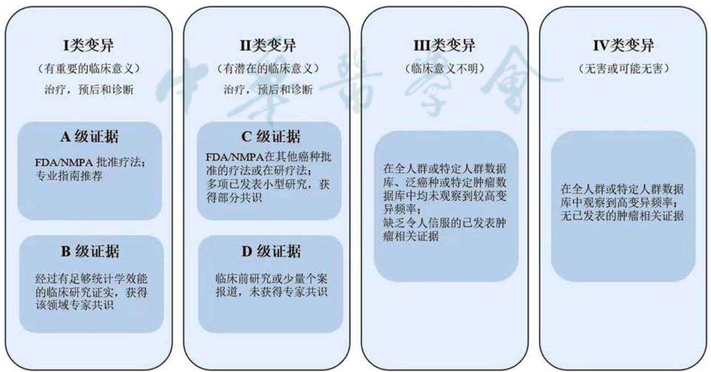

·指南与共识·

# 基于NGS的肿瘤全景变异检测探针设计专家共识（2026版）

中国抗癌协会肿瘤病理专业委员会

通信作者：黄杰，中国食品药品检定研究院体外诊断试剂检定所，北京 100050，Email：jhuang $5 5 2 2 @ 1 2 6 . { \mathrm { c o m } }$ ；周晓燕，复旦大学附属肿瘤医院病理科，上海 200032，Email：xyzhou $1 0 0 @ 1 6 3 . \mathrm { c o m }$ ；应建明，国家癌症中心 国家肿瘤临床医学研究中心 中国医学科学院北京协和医学院肿瘤医院病理科，北京 100021，Email：jmying@cicams.ac.cn

【摘要】 随着肿瘤精准医学发展，基于二代测序（ ）的肿瘤全景变异（ ）检测成为临床诊疗的主流检测手段。然而，作为 检测的起始环节，探针设计尚未建立技术标准或评估体系。中国医学科学院北京协和医学院肿瘤医院联合中国抗癌协会病理专委会、中国食品药品检定研究院等权威机构组织临床专家、病理专家及第三方医学检验机构深入研讨，参考国内外文献，结合中国临床实践，针对 检测产品的目标基因及目标区域选择、基因组合方式、探针性能评估、探针变更等多个关键环节达成6条纲领性的技术共识，系统提出探针池设计全流程技术规范。共识通过探针设计标准化、多层级性能验证体系的构建及探针动态变更管理，填补了肿瘤 探针设计技术标准空白，为国家药品监督管理局对肿瘤NGS实验室自建方法的合规性审查提供科学依据，推动肿瘤基因检测从“临床可用”向“临床可信”转变。

【关键词】 恶性肿瘤； 二代测序； 肿瘤全景变异检测； 目标基因选择； 目标区域选择；基因组合方式； 探针性能评估； 探针变更管理

基金项目：国家重点研发计划（2022YFC2409902，2022YFC2409903）

# Chinese expert consensus on NGS-based probe design for tumor comprehensive genomic profiling testing (2026 edition)

Tumor Pathology Committee of China Anti-Cancer Association   
Corresponding authors: Huang Jie, Department of In Vitro Diagnostic Reagent, National Institutes for Food and Drug Control, Beijing 100050, China, Email: jhuang5522@126.com; Zhou Xiaoyan, Department of Pathology, Fudan University Shanghai Cancer Center, Shanghai 200032, China, Email: xyzhou100@ 163.com; Ying Jianming, Department of Pathology, National Cancer Center/National Clinical Research Center for Cancer/Cancer Hospital, Chinese Academy of Medical Sciences and Peking Union Medical College, Beijing 100021, China, Email: jmying@cicams.ac.cn

【Abstract】 Comprehensive genomic profiling (CGP) based on next-generation sequencing (NGS) has emerged as a mainstream approach for clinical diagnosis and treatment with the development of precision oncology. However, as the first stage of NGS testing, probe design has not yet been standardized by a reliable assessment framework. In response to this unmet need, the Cancer Hospital, Chinese Academy of Medical Sciences and Peking Union Medical College, in collaboration with the Tumor Pathology Committee of China Anti-Cancer Association, the National Institutes for Food and Drug Control, and other authoritative institutions, convened clinical experts, pathologists, and representatives from third-party medical laboratories for in-depth discussions on standardization strategies. The expert panel formulated six core technical consensus statements, including the selection of target genes and regions, gene combination strategies, probe performance evaluation, and probe updates, based on a thorough analysis of both international studies and domestic clinical experience. For the design of the probe pool, this consensus methodically suggests a full-process technical specification. It fills a technical gap in tumor NGS probe design by standardizing probe design, establishing a multi-level performance validation system, and dynamically managing probe modifications. Furthermore, it supports the shift of genomic testing from "clinically available" to "clinically reliable" by offering a scientific basis for the National Medical Products Administration's (NMPA) regulatory review of laboratory-developed tests (LDTs) for oncology.

【Key words】 Malignant neoplasms; Next-generation sequencing; Tumor comprehensive genomic profiling; Target gene selection; Target region selection; Gene combination strategy; Probe performance evaluation; Probe modification management

Fund programs: National Key Research and Development Program of China (2022YFC2409902, 2022YFC2409903)

在精准医疗快速发展的时代背景下，二代测序（next generation sequencing， NGS）技术凭借其高通量特性和发现未知基因变异能力的独特优势，已成为临床实践中肿瘤基因检测的主流技术和首选方法 。 全 景 变 异（comprehensive genomic profiling，）检测是一种基于 技术的基因检测方法可同时评估数百个以上基因的多种类型变异，包括单核苷酸变异（single nucleotide variant， SNV）、插入/缺 失（insertion-deletion， InDel）、拷 贝 数 变 异（copy number variations， CNV） 和 结 构 变 异（structure variation， SV）等，还可以检测肿瘤突变负荷（tumor mutation burden， TMB）、微卫星不稳定性（microsatellite instability， MSI）和同源重组缺陷（homologous recombination deficiency， HRD）等复杂的基因组标志物，从而在单次检测中提供全面的肿瘤相关的基因组信息，最大限度地提高检测的全面性和准确度［1］ 。目前市场上涵盖全面基因组标志物的肿瘤CGP检测产品均属于实验室自建方法（laboratory developed tests， LDT），尚缺乏统一的监督管理规范。

近年来，我国针对肿瘤 基因检测产品的全流程质量管理规范，已形成多维度指导体系。中国临床肿瘤学会（Chinese Society of Clinical Oncology，CSCO）、北京市临床检验中心、中国抗癌协会肿瘤病理专业委员会等权威机构，联合临床专家、临床病理等多领域专家，相继制定了《二代测序技术在肿瘤精准医学诊断中的应用专家共识》［2］ 、《高通量测序技术临床规范化应用北京专家共识（第一版肿瘤部分）》［3］ 、《实验室自建肿瘤全景变异检测性能确认中国专家共识（2024版）》［4］、《肿瘤二代测序临床报告解读共识》［5］ 等多项重要指导文件。这些共识系统规范了NGS检测的样本处理、文库构建、生物信息分析及临床报告解读等关键环节。然而值得注意的是，作为 检测产品的初始核心环节—探针设计，目前仍缺乏统一的行业标准、临床指南或专家共识。探针设计质量直接影响探针的靶向捕获效率和均一性，从而影响检测产品的检测灵敏度与特异性。因此，建立系统的探针设计、验证及变更标准将成为保障NGS检测产品精准性和临床有效性的关键基石。

基于肿瘤NGS基因检测产品研发规范与临床应用的迫切需求，国家癌症中心/国家肿瘤临床医学研究中心 中国医学科学院北京协和医学院肿瘤医院联合中国抗癌协会病理专委会、中国食品药品检定研究院，组织多学科临床专家组通过系统论证与审慎研判，针对 检测技术关键环节中的探针设计达成纲领性技术共识。该共识不仅为各级临床病理中心及第三方医学检验机构建立了基于NGS技术的肿瘤基因检测探针设计标准化框架，更通过建立统一的技术标准，强化实验室间检测结果的可比性，进而为临床精准诊疗决策提供可验证的技术支持体系，同时为个性化医疗场景下的基因检测产品遴选提供循证依据。

本共识采用的推荐级别见表1。

# 一、目标基因和区域的选择

1. 目标基因的选择：检测产品的临床预期用途、基因的临床价值以及证据等级是选择目标基因的主要依据。检测产品的预期用途及基因的临床价值主要包括为临床医师及患者提供遗传筛查、辅助诊断、药物疗效预测、预后评估以及复发监测等方面的指导价值。目前，有多个针对肿瘤生物标志物临床意义解读的循证医学分级系统，包括

表1 共识采用的推荐级别及代表意义  

<table><tr><td>推荐级别</td><td>代表意义</td></tr><tr><td>1类</td><td>基于高级别证据,专家意见高度一致</td></tr><tr><td>2A类</td><td>基于低级别证据或缺少证据，专家意见高度一致;</td></tr><tr><td>2B类</td><td>或基于高级别证据，专家意见基本一致</td></tr><tr><td>3类</td><td>基于低级别证据或缺少证据,专家意见基本一致 专家意见明显分歧</td></tr></table>

注：FDA为美国食品药品监督管理局；NMPA为国家药品监督管理局；ASCO为美国临床肿瘤协会；ESMO为欧洲肿瘤内科学会；为中国临床肿瘤学会；高级别证据： 批准，或等专业指南推荐，或经过有足够统计学效能的临床研究证实，获得该领域专家共识；低级别证据：发表多项小型研究，获得部分共识，或有临床前研究或少量个案报道，未获得专家共识

2017 年 美 国 分 子 病 理 学 协 会（Association forMolecular Pathology， AMP）/美 国 临 床 肿 瘤 学 会（American Society of Clinical Oncology， ASCO）/美国病理学家协会（College of American Pathologists，CAP）联合制定的体细胞变异解读指南［6］ ，2020年由欧洲肿瘤内科学会（European Society of MedicalOncology， ESMO）发布的ESMO分子靶点临床可操作 性 量 表（ESMO Scale for Clinical Actionability of， ）［7］ ，纪念斯隆 凯特琳癌症中心的精准医疗肿瘤数据库（Precision OncologyKnowledge Base， OncoKB）证 据 等 级 规 则［8］，以 及美 国 食 品 药 品 监 督 管 理 局（Food and Drug， ）、器械和放射卫生中心依据临床证据的可靠程度进行的基因突变等级分类［9］ 。不同的解读指南变异等级划分有着细微差别，总体可以把基因变异划分为具有明确临床意义、具有潜在临床意义、临床意义未明、无害或可能无害变异四个大类（表2）。此外，2022年临床基因组资源中心、癌症基因组联盟和癌症变异解读联盟联合发布了体细胞变异致癌性分类标准，能够更好地对一些变异的分类提供标准，该标准旨在解决以往体细胞变异分类中存在的不一致问题，为恶性肿瘤相关体细胞变异的致癌性提供了一套系统、全面的分类方法［10］ 。

本专家共识首先针对基因的证据等级分类进行讨论并达成一致意见，即建立中国专家共识的基因及变异分级标准。综合上述肿瘤生物标志物临床意义解读证据等级体系，2017年AMP/ASCO/CAP联合制定的体细胞变异解读指南等级体系是目前国内影响范围最广的基因变异分级体系，也是国内各类肿瘤NGS检测最广泛采用的报告解读证据等级体系。因此，本共识考虑了检测产品在我国推广应用的可行性，在2017年AMP/ASCO/CAP指南的基础上对目标变异的分级进行了本地化（图 ），其中类变异的 类证据除了 批准还包括国家药品监督管理局（National Medical Products Administration，NMPA）批准疗法，专业指南主要包括CSCO以及美国 国 立 综 合 癌 症 网 络（National ComprehensiveCancer Network， NCCN）、ASCO、ESMO 等权威机构推荐的临床指南。同样，对于Ⅱ类变异的C级证据也增加了国内NMPA的批准疗法。此外，该共识首次提出了基因的分类等级，参考基因变异等级将基因分成3类：包括具有明确临床意义的Ⅰ类基因（即包含Ⅰ类变异的基因）、具有潜在临床意义的Ⅱ类基因（即包含Ⅱ类变异且不包含Ⅰ类变异的基

表2 现有的基因标志物临床价值证据等级解读体系  

<table><tr><td>AMP/ASCO/CAP</td><td>ESMO-ESCAT</td><td>OncoKB</td><td>FDA等级</td></tr><tr><td>I(明确临床价值)</td><td>I级(标准治疗)</td><td>1(FDA获批)</td><td>I类(CDx)</td></tr><tr><td>A:FDA批准/专业指南推荐 B:足够统计学效能的临床研究证实、获得专家共识</td><td>Ⅱ级(前瞻性研究优选方案)</td><td>2(指南推荐) R1(标准治疗耐药)</td><td>Ⅱ类(指南级变异)</td></tr><tr><td>Ⅱ (潜在临床意义) C:FDA在其他癌种批准疗法或在研疗法;多项已发</td><td>Ⅲ级(药物在其他癌症类型中有效) ：V级(临床前研究预测)</td><td>3B(获批其他癌种)</td><td>3A(有临床研究结果）Ⅲ类(潜在临床价值)</td></tr><tr><td>表小型研究、获得部分共识</td><td>V级(药物有效,但不延长PFS和OS）</td><td>4(临床前研究)</td><td></td></tr><tr><td>D:临床前研究或少量个案报道、未获得专家共识</td><td></td><td>R2(非标准治疗耐药)</td><td></td></tr><tr><td>Ⅲ(临床意义未明)</td><td>X级(无证据证明是靶点)</td><td></td><td></td></tr><tr><td>V(无害或可能无害)</td><td></td><td></td><td></td></tr></table>

注：AMP为美国分子病理学协会；ASCO为美国临床肿瘤学会；CAP为美国病理学家协会；ESMO为欧洲肿瘤内科学会；ESCAT为ESMO分子靶点临床可操作性量表； 为精准医疗肿瘤数据库； 为美国食品药品监督管理局； $\mathrm { C D x }$ 为伴随诊断，是一种与特定药物相关联的体外诊断技术（使用的相应药物被称为伴随药物），通过测量特定标志物以识别最佳用药人群的检测手段；PFS为无进展生存时间，是患者从治疗开始到肿瘤进展（根据影像学或临床标准判定）或发生任何原因导致的死亡（以先发生的事件为准）的时间，若未发生事件，则以末次评估时间为终点；OS为总生存时间，是患者从接受治疗（或进入研究）到因任何原因死亡的时间长度，若患者存活，则以最后1次随访时间为终点；

因）、临床意义未明的Ⅲ类基因（即不包含Ⅰ、Ⅱ类变异的基因）。

在构建肿瘤CGP检测产品目标基因的筛选框架时，除了具有临床意义的 类和 类基因之外，还需要系统整合临床意义未明的 类基因中具有探索价值的基因，以满足肿瘤精准诊疗对基因组全景分析的技术要求。这类基因的策略性纳入具备双重临床价值：其一，可有效规避因基因临床证据级别动态调整导致的探针组合频繁更新；当特定基因的临床证据等级升级时，仅需补充验证相应变异位点的技术性能，即可实现检测报告范围的追踪式更新与快速迭代。其二，可使每位肿瘤患者获得更深层次的变异谱解析，为开展“肿瘤知情”的分子残留病灶（molecular residual disease， MRD）检测提供更多可以追踪的体细胞突变，从而显著提升后续MRD动态监测的灵敏度和特异度。由此可见，科学纳入Ⅲ类基因实为维持CGP检测产品全生命周期竞争力的战略性决策。

共识意见1：建立了本地化的基因变异分级标准，并首次提出了基因证据等级分类体系，根据基因突变的临床意义将基因分成3类，包括具有明确临床意义的Ⅰ类基因、具有潜在临床意义的Ⅱ类基因，以及临床意义未明的 类基因。在构建肿瘤CGP检测产品目标基因的筛选框架时，除了具有临床意义的 类和 类基因之外，还需根据检测产品的预期用途整合部分具有临床探索价值的临床意义未明的Ⅲ类基因，以满足肿瘤精准诊疗对基因组全景分析的技术要求。检测 类基因是维持CGP检测产品全生命周期竞争力的战略性决策（推荐级别：2A类）。

目标区域的选择：目标基因的变异类型、基因组指标以及生信质控指标的性能要求是目标区域选择的主要依据。

在检测基因突变时，目标区域的选择需根据基因变异类型及变异特征进行差异化设计。原癌基因通常存在明确的热点突变区域，且变异多富集于关键功能结构域；相比之下，抑癌基因的突变呈散发性分布。基于这类基因的突变特征，针对 、的检测方案，推荐采取不同的设计策略：对原癌基因锁定功能结构域及临床证实的热点突变区域，而对抑癌基因则建议覆盖完整编码区序列。当检测CNV变异时，推荐目标区域为基因的全编码区，或者至少满足生物信息学算法所要求的最小的外显子覆盖要求。值得注意的是，特定单核苷酸多态性（single nucleotide polymorphism， SNP）位点的策略性纳入可显著增强 分析的准确度，建议在探针设计时结合生物信息算法需求添加参考位点，以此提升 检测的性能。在融合基因检测中，探针设计的核心靶区应聚焦于已知的断点富集区域，包括内含子、非翻译区域及少数外显子注：AMP为美国分子病理学意见协会；ASCO为美国临床肿瘤学会；CAP为美国病理学家协会；FDA为美国食品药品监督管理局；

  
图1 基于AMP/ASCO/CAP指南形成的本地化的体细胞突变分类等级

区域。鉴于断点区域多位于复杂的非编码区［通常伴随高重复序列和异常的鸟嘌呤（guanine， G）和胞嘧啶（cytosine， C）含量，简称GC含量］，建议采取适应性设计策略：优先锁定高频融合伴侣基因的保守断点区域，通过规避高重复性/高同源性的基因组区间，有效平衡覆盖广度和检测性能的辩证关系。

在基因组标志物检测的探针设计策略中，目标区域需依据不同标志物的生物信息学算法进行精准化设计，即在满足检测性能的前提下进行探针覆盖区域的精细化调控，既可优化检测系统的效能，又能有效控制探针组合的规模，实现成本效益的最大化。检测TMB指标时，要求探针覆盖的编码区在1 Mb以上［11］ ，通常在具有临床价值的基因的基础上增加相应恶性肿瘤亚型的高频变异区域来实现。 检测目前尚未形成标准化的技术规范，建议采取动态优化策略，基于算法特性筛选最佳的微卫星位点组合。研究显示， 检测的灵敏度与微卫星位点的数量存在非线性关联，增加微卫星位点可能导致信号噪声比下降，检测数据显示，单核苷酸位点在效能评估中表现出更优的灵敏度［12］。《Bethesda分子诊断指南》明确指出，传统的美国国家癌症研究所双核苷酸位点检测系统需额外补充单核苷酸位点以提升灵敏度精准区分低度 亚型［13］。此外，多核苷酸序列本身的多态性会导致检测方法高度依赖正常配对样本，而单核苷酸位点可不依赖正常配对样本，加之稳定性高、灵敏度高的特点，常被 检测产品选为计算 的核心检测靶区。HRD检测时，可参考《同源重组修复缺陷临床检测与应用专家共识（2021版）》［14］ 的技术框架进行探针设计， 位点的筛选需严格遵循两大准则：一是空间分布均匀，确保基因组全域覆盖，消除检测盲区；二是杂合位点密度优先，即优先选择中国人群杂合频率在 $0 . 4 \sim 0 . 6$ 之间的SNP位点。同时建立三级排除机制，即排除显著偏离哈迪-温伯格平衡的位点、探针捕获稳定性欠佳的位点以及存在技术干扰风险的高同源/高重复区域的位点。

探针池的目标区域设计需系统性整合“检测功能模块”和“质量控制模块”。质量控制区域的战略布局虽不直接参与变异分析，却是保障检测系统可靠性的基石。探针设计中需包含4个关键质量控制维度的专属功能区域：肿瘤纯度推算、样本配对分析、污染率评估以及性别判断系统。在技术实现层面，前 项质量控制指标的计算可通过 基因分型实现，SNP位点及数目的确定需要满足生物信息学算法对杂合率和群体频率阈值的要求。性别鉴定模块应采用染色体特异性覆盖策略，通过在染色体异源区域设计性别特异性探针，建立高效的双盲检测体系（准确度应达 $9 9 \%$ 以上）。当临床样本出现性别信息异常时，该模块可实现污染样本中供体性别判定及样本混淆风险预警。

完整的 探针池应系统构建“功能检测层”和“质量保障层”双层架构。“功能检测层”包括基因变异（包括SNV、InDel、CNV及SV）检测和/或基因组指标（如 、 、 等）检测的关键靶区，“质量保障层”是集成上述四位一体的质控模块。每个模块涉及的目标区域需要根据CGP检测产品的预期用途进行个性化设计。该设计范式通过检测功能与质控效能的动态耦合，既满足临床决策的核心需求，又实现了 检测全流程可追溯、结果可验证的精准医学技术标准，为NGS检测的技术审评提供了标准化框架。

共识意见2：肿瘤CGP检测产品探针池的目标区域设计需系统性整合“检测功能模块”和“质量控制模块”。“检测功能模块”应包含基因变异（包括SNV、InDel、CNV及SV）检测和/或基因组指标（如TMB、MSI、HRD等）检测的关键靶区，“质量控制模块”应包含肿瘤纯度推算、样本配对分析、污染率评估以及性别判断计算所必需的基因组区域。每个模块涉及的目标区域需要根据CGP检测产品的预期用途进行个性化设计（推荐级别：2A类）。

3. 基因组合的方式：经过多学科专家组的系统性论证与多维度验证，形成了《常见实体瘤基因检测推荐列表》，见附表1、2（扫描本文首页二维码查看）。对于Ⅰ类和Ⅱ类基因的推荐，不仅详细列出了基因在不同恶性肿瘤患者中的临床证据等级，还明确了推荐检测的目标区间（附表1）。其中Ⅲ类基因推荐依据主要包括肿瘤信号通路相关基因及肿瘤人群高频突变基因（附表2）。基于肿瘤临床及变异公共数据库（COSMIC、TCGA 等）融合中国人群自建数据库（采用全基因组测序/全外显子测序技术进行肿瘤组织与正常对照样本配对分析的数据）的基因变异人群发生频率进行基因筛选。通过系统分析基因变异在人群中的发生频率，并采用复发指数（recurrence index， RI）等量化指标进行精准筛选［15］。 RI 综 合 考 虑 目 标 区 域 的 突 变 患 者 数 量（ $\mathrm { \Delta N p }$ ）、区域长度（L）及队列患者总数（N），计算公式为 $\mathrm { { R I } = \mathrm { { ( N p / N ) } \times \mathrm { { ( 1 ~ 0 0 0 / L ) } } } }$ ，以此实现不同长度外显子间的均一化评估。具体筛选标准需要综合考虑检测产品的性能要求、探针池的大小、检测产品可容忍的数据量规格等因素。本次推荐基因选择$\mathrm { R I } \geqslant 2 0$ 且覆盖至少 $\geqslant 5$ 例突变患者的高复发区域，可以确保基因不仅具备较高人群突变频率，同时对TMB具有显著贡献。该筛选策略可以保障优先选择对肿瘤突变贡献度高的基因，有效控制探针池大小，在MRD监测场景中显著提升个体患者可追踪突变的数量，增强检测的临床灵敏度和可靠性。该推荐列表的制定充分考虑了肿瘤患者的临床获益，整合了临床肿瘤学家对肿瘤精准诊疗的前瞻性的认知，同时充分考虑了相应检测产品在我国推广应用的可行性。

该实体瘤基因检测推荐列表可以成为指导肿瘤CGP检测产品探针池设计的有效工具。CGP检测产品可以根据检测产品的适用人群分为单癌、多癌以及泛癌基因检测产品，其探针池的设计过程也就是不同目标基因组合的过程。如何进行基因组合是本次专家共识讨论的焦点，针对该问题，专家建议可根据不同场景进行基因组合设计：（1）按照临床预期用途进行基因组合，如遗传筛查、辅助诊断、药物疗效预测、预后评估、复发监测等单一场景，或者辅助诊断 $^ +$ 药物疗效预测、药物疗效预测 $^ +$ 复发监测等复合场景，该情景既适用于单癌基因检测产品，也适用于多癌或者泛癌基因检测产品的设计。（）按照肿瘤来源的不同系统进行基因组合设计，如针对妇科肿瘤、消化系统肿瘤、中枢神经系统肿瘤等设计肿瘤多癌基因检测产品。（3）通过某个/某些基因组指标关联不同的治疗方式或者不同的恶性肿瘤类型。如：免疫治疗相关标志物检测、抑制剂相关基因标志物检测，该类型的检测产品可以精准地筛选出某种特定治疗方式的适用人群。通常情况下，基于后2种场景设计的多癌或泛癌 检测产品更匹配临床真实使用场景，可以有效减少开发多个单癌检测产品造成的研发资源浪费，实现探针池设计研发和临床应用的双重经济学效益。

共识意见3：本次共识形成了常见实体瘤患者基因检测推荐列表（扫描本文首页二维码查看），在CGP检测产品设计时推荐根据临床预期用途、肿瘤来源的不同系统或特定的治疗方式关联不同的恶性肿瘤人群进行目标基因组合，可进行多癌或泛癌基因检测，从而实现探针池设计研发和临床应用的双重经济学效益（推荐级别：1类）。

# 二、探针 探针池的设计及性能评估

目标基因和目标区间确定后进行探针设计、筛选及合成，并使用细胞系标准品及临床样本对单条探针以及探针池的靶向捕获能力及变异检测性能进行评估，以确保探针池捕获区间的实际检测性能满足临床检测要求。

# （一）探针的设计和筛选

探针的设计和筛选是根据目标捕获区间的参考基因组序列，寻找出能富集目标区域的DNA参考序列的过程。目标区域DNA参考序列除了明确的参考基因组DNA序列外，还应该考虑因人群遗传多样性、特定的基因突变等因素导致的与参考序列存在差异的特定DNA序列。探针设计的基本原则是在确保每条探针都能对目标区域实现高覆盖度的同时，最大程度地提高探针池的灵敏度、特异度和均一性。

探针的 含量、熔解温度 $\mathrm { T m }$ 、交叉杂交及探针长度是影响探针池性能的主要因素。GC含量是影响探针池杂交效果的关键因素，过高或过低的GC含量都可能导致杂交效果不佳，通常情况下，GC 含量在 $5 0 \% \sim 6 0 \%$ 时，探针池的捕获效率和均一性最优。探针设计时可以根据探针池的 含量来调整不同探针的浓度或覆盖密度，从而提升目标区间的捕获能力，确保探针池检测的灵敏度。探针的熔解温度Tm与GC含量、探针长度及杂交反应条件等因素有关，可结合湿实验反应条件的调整来控制探针的 $\mathrm { T m }$ 值在一个合适的范围内，以保证探针捕获性能［16］ 。交叉杂交是影响探针池特异性的关键因素之一，特别是在低复杂度基因组区域，同源序列探针的存在可能会引发非特异性捕获反应，从而导致检测失败。因此，建议对基因组中与探针序列具有高度相似性（如 $5 0 ~ \mathrm { m e r }$ 探针建议相似性阈值设定为 $> 7 5 \% \sim 8 0 \%$ ）的目标区间进行全面评估［17］ ，并剔除相似区域过多的探针，以有效降低探针组合整体的交叉杂交比例。探针长度也是影响探针特异性的重要因素［18］ ，在确定探针长度时，需综合考虑样本类型、插入片段平均长度、测序读取模式等因素。通常而言，探针长度越长，其与靶序列的杂交稳定性越高，但过长的探针可能导致合成困难、成本增加、受DNA降解影响更大。在实际应用中，常规探针长度在 $6 0 \sim 1 2 0 ~ \mathrm { n t }$ 之间，旨在确保杂交稳定性的前提下，兼顾合成的可行性和成本的经济性。

由于目标区域的复杂程度不同，在探针设计阶段，可通过调整单条探针的起始位置以及运用多重叠瓦等设计策略，来实现探针池检测性能的最优化。建议遵循目标区间中心对称的原则进行滑窗操作，在可移动范围内寻找最佳的探针组合。由于杂交捕获法中的模板是随机打断的片段化基因组DNA 或是血浆中的游离 DNA，DNA 模板片段与固定序列探针的杂交结合效率会随二者重叠长度的不同而变化。为了提高在核心肿瘤热点区域的覆盖度与均一性，推荐采用叠瓦式探针设计策略，确保检测的灵敏度。比如，针对复杂的InDel变异，可通过野生型 $^ +$ 突变型的探针设计策略，即在变异位点的两侧分别设计 1条野生型探针，在变异位点内部设计 条突变型探针，这种探针布局可提升模板的转化率，进而提升探针对变异检测的准确度。

共识意见4：探针设计时除了参考基因组外，还需要充分考虑人群遗传多样性、特定的基因突变等原因造成的目标区域序列多样性（推荐级别：2B类）。探针设计和筛选过程，需要充分考虑探针的GC含量、熔解温度Tm、探针位置、探针长度等因素，在保证探针灵敏度和特异度的前提下，筛选出能富集目标区域的最优探针组合（推荐级别：2A类）。

# （二）探针池的质量控制及性能评估

探针出厂前，探针合成供应商会对其进行严格的质检、定量和分装。探针质检方式包括单条探针质检和 或混合探针池 质检。由于干粉状态的探针相比母液或工作液更稳定，可结合探针的使用量和使用时间设计分装方案并进行抽干保存，确保探针池以干粉状态进行运输和长期保存。探针池干粉、浓储液、配置后的工作液，可储存至− $8 0 \ { ^ \circ } \mathrm { C } { \pm } 5 \ { ^ \circ } \mathrm { C }$ 条件下；实验开展过程中使用的工作液，可储存于$- 2 0 \mathrm { \Omega } ^ { \circ } \mathrm { C } { \pm } 5 \mathrm { \Omega } ^ { \circ } \mathrm { C }$ 条件下，并在使用过程中保持低温、减少冻融次数，以避免降解和断裂。

尽管探针/探针池在设计、筛选及合成时均进行了严格的质量控制，但是否满足NGS检测产品的临床检测要求还需要使用标准品及临床样本进行性能评估，评估的内容至少包括测序数据质控、单条探针 单个位点的检测性能以及产品维度的基因变异和/或基因组指标的检测能力。其中临床样本需要包含检测产品要求的全部样本类型，组织样本和体液样本由于检测产品流程、检测产品参数和性能要求的差异，需要分别进行评估。

测序数据质控评估：为了评估探针池的测序数据质控表现，推荐使用细胞系标准品或高质量的临床样本（如白细胞 样本）进行 全流程检测，评估的参数包括捕获效率、均一性、 含量偏好、基因组比对率等（表3），其中捕获效率和均一性是影响探针池检测性能的关键参数，直接影响检测产品达到预期性能所需要的数据量。

捕获效率又称中靶率，是指比对到目标区域的碱基数占总测序碱基数的百分比，反映了探针池能够有效地捕获到目标区域的能力，捕获效率越高代表测序数据的利用率越高。通常情况下，探针池的捕获效率与目标区域和探针设计方式有关，如果目标区间包含较多的高 、重复序列或者高拷贝序列，理论上会更容易发生非特异性捕获，通过调整单条探针的设计方法可以减少非特异序列的结合，提高探针池的捕获效率。除了探针本身的影响因素之外，测序样本的质量、DNA的片段大小以及湿实验检测流程等也是影响探针捕获效率的重要因素。《GB/T 37872—2019目标基因区域捕获质量评价通则》中要求，对于目标基因区域 ${ > } 1 0 ~ \mathrm { M b }$ 的探针池捕获特异性应不低于 $45 \%$ ， $\leqslant 1 0 ~ \mathrm { M b }$ 的目标基因区域探针池捕获特异性应不低于 $1 2 \% ^ { [ 1 9 ] }$ 。

表3 测序数据质控评估内容  

<table><tr><td>质控参数</td><td>含义</td><td>参考质控</td></tr><tr><td>捕获效率</td><td>比对到目标区域的碱基数占总测序碱基数的百分比</td><td>&gt;10 Mb时,不低于45%; ≤10 Mb时,不低于12%[18]</td></tr><tr><td>覆盖均一性</td><td></td><td></td></tr><tr><td>Fold-80</td><td>确保 80% 的目标碱基达到平均覆盖深度所需的额外测序倍数1～2</td><td></td></tr><tr><td>0.2倍平均深度碱基覆盖度</td><td>位点深度达到0.2倍平均测序深度的碱基占比</td><td>&gt;95%[19]</td></tr><tr><td>GC含量</td><td>测序序列中鸟嘌呤(G)和胞嘧啶(C)碱基所占的比例</td><td>40%~ 60%</td></tr><tr><td>GC偏好</td><td>不同GC含量靶标的覆盖深度的偏倚程度</td><td>25%~75%GC含量区间的靶标区域覆盖深度</td></tr><tr><td>基因组比对率</td><td>比对到参考基因组上的reads数占所有测序reads数的比例</td><td>&gt;0.5x平均值 &gt;95%</td></tr></table>

注：CGP为全景变异；GC为碱基鸟嘌呤和胞嘧啶；reads是测序读段；表格中列出的参考质控不作为探针池评估的硬性指标，具体探针池的实际合格线与探针池的目标区域、实验体系、检测样本类型以及检测产品的性能要求相关，CGP检测产品定型时需使用临床样本进行质控标准的确认

探针池的覆盖均一性是指测序过程中目标区域之间序列覆盖的均匀性，是测序读段（ ）在目标区域的测序深度均匀程度的度量。覆盖均一性高的探针池可减少使所有目标区域达到预期测序深度所需的数据量，从而降低检测产品成本，减少分析时间，缩短检测周期。目前常用的评估覆盖均一性的指标包括 Fold-80 碱基罚分（Fold-80 basepenalty，简称 Fold-80）和 0.2 倍平均深度碱基覆盖度。Fold-80［20］ 是指确保 $80 \%$ 的目标碱基达到平均覆盖深度所需的额外测序倍数，分值越高，均一性越差。 - 的理想值为 ，即 $80 \%$ 的目标碱基已经达到了平均覆盖深度，无需额外测序。然而，在实际应用中，Fold-80 值通常会 $> 1$ ，一般情况下认为 - 值 $< 2$ 的探针池的覆盖均一性较好。倍平均深度碱基覆盖度是指 $\geq 2 0 \%$ 目标区域的平均有效深度的占比，数值越高表示探针池的均性越好。2025年国家药品监督管理局发布行业标准《肿瘤组织基因突变检测试剂盒（高通量测序法）》 - 建议 $\geq 2 0 \%$ 目标区域的平均有效深度占比不低于 $9 5 \% ^ { [ 2 0 ] }$ 。

含量是指在测序序列中鸟嘌呤（ ）和胞嘧啶（ ）碱基所占的比例，探针池的目标区间、合成质量，以及实验环节中的温度校准等因素都会影响GC含量的结果。如果GC含量异常，可能会影响探针池的捕获效率和测序数据的均一性。 含量的最佳比例尚无明确规定， 年国家市场监督管理总局发布的《高通量基因测序仪校准规范》（征集意见稿）中关于标准物质的选择原则指出GC占比应该在 $4 0 \% \sim 6 0 \%$ 之间，这为 探针设计和评估提供了一个参考范围。

GC偏好是由文库制备、探针捕获、上机测序等多个环节的多种因素累积产生的靶标区域GC含量影响覆盖深度的现象。通常表现为低GC或高GC含量的靶标区域的平均覆盖深度小于整体平均覆盖深度。其中低GC高于均值而高GC低于均值，或低GC低于均值而高GC高于均值，或低GC和高GC均低于均值的情况都有可能出现。将靶标区域根据不同的 GC 含量细分为多个 $\mathrm { G C ~ b i n }$ （例如 0～$100 \%$ ，每 $1 \% 1$ 个 $\operatorname { b i n }$ ），每个 $\operatorname { b i n }$ 分别计算平均覆盖深度，如果 $2 5 \% \sim 7 5 \%$ GC区间均有超过0.5倍平均覆盖深度即可评价为没有严重的GC偏好。

数占所有测序 数的比例，一般要求达到$9 5 \%$ 以上，这一标准可以确保检测具有较高的数据利用率，从而提高后续数据分析的准确性和可靠性。

除上述指标外， 、测序深度、去除 重复后的比对率等常见生信分析指标虽不能直接反应探针的质量，但却能反应检测产品的检测性能及样本的测序质量，需要根据检测产品的预期用途和检测指标的性能要求，设置明确的质控标准。

综上所述，探针池的测序数据质控尚无严格的质控标准，具体的数据表现不仅与探针池目标区域及探针设计方式相关，还与 检测产品全流程的多个环节密切相关，包括待测样本的质量、湿实验体系以及干实验质控指标的计算方法相关。因此，探针池测序数据质控标准的设定的需要根据检测产品的性能要求，以及真实检测所能达到的要求进行确认，通常要求不低于表 中提供的参考质控标准。

2. 单条探针/单个位点的检测性能评估：探针池测序数据质控评估合格后，还需要对单条探针或单个位点的检测性能进行评估，通常使用探针池测序数据质控评估的分析数据，评估单条探针或单个位点在所有测试样本中的中位表现。由于 检测产品探针池包含的探针数目很多，很难通过对真实变异的检测准确度进行评估，深度系数是评估探针检测能力的常用指标。

探针 位点的深度系数定义为单条探针 单个位点的测序深度与样本平均测序深度的比值，该值的质控线设定与 CGP 检测产品的检测限（limit ofdetection， LoD）及阳性判断值相关，需不低于检测要求的理论最低值。具体的计算方法为：在保证突变检出概率 $\geqslant 9 5 \%$ 前提下，利用二项分布函数根据不同突变或基因组指标的阳性判断值以及LoD计算出位点要求的测序深度，即理论的最低测序深度，该理论深度与检测产品要求的样本平均测序深度的比值即探针深度系数的最小值。例如，某检测产品要求测序深度为 $5 0 0 \times$ ，突变的阳性判断值为4 条 reads，LoD 为 $2 \%$ ，根据二项分布计算出的突变检出概率达到 $9 5 \%$ 以上时的理论位点测序深度需达到 $3 8 6 \times$ ，检测产品的样本平均深度标准为 $5 0 0 \times$ ，则位点的理论深度系数应达到 0.77（ $3 8 6 \times / 5 0 0 \times$ ）以上。

CGP检测产品探针池中包含的探针数目较多，由于目标区域本身的复杂性，实际检测时可能会出现个别探针/位点的深度系数低于合格线。该部分探针通常是由于目标区域的GC含量过高或过低、含有较多重复序列等原因造成的，可通过进一步优化探针设计方法来实现相应目标区域的检测性能达标。即以该探针的目标区域为中心，在原设计方案的基础上通过左右滑窗的方式增加新的探针，以探针多重叠瓦的方式实现目标区域的检测性能达标。将补充合成的新探针加入到原探针池中，再重新进行测序质控及单条探针/单个位点的检测性能评估，确保新的探针池可以达到检测产品性能的检测要求。针对质控不合格无设计优化空间的目标区域，可以明确出该目标区域可达到的理论检测限，并在检测产品报告中针对该区域进行检测性能的局限性声明，或者直接从检测产品的报告范围中进行剔除。

3. 基因变异及基因组指标的检测能力评估：探针池基因变异及基因组指标的检测能力是通过CGP检测产品的检测能力实现的，即验证探针池对产品维度检测指标的LoD和准确度的检测性能，评估方法和评估标准可参考《实验室自建肿瘤全景变异检测性能确认中国专家共识（2024版）》［3］ 中的要求进行。

检测产品的基因变异的 是指 $9 5 \%$ 的样本能够正确检出变异位点的最低等位基因百分比，基因组指标的LoD指 $9 5 \%$ 的样本能够正确检出阳性所需的最低的肿瘤纯度。探针池LoD的评估需要对所有的变异类型的目标频率以及基因组指标的目标肿瘤纯度进行验证。 检测产品的准确度评估通常采用方法学比较的方式，使用其他经过验证的对标方法检测的临床样本进行检测，计算检测方法的阳性符合率（positive percent agreement，PPA）、阴 性 符 合 率（negative percent agreement，NPA）和 阳 性 预 测 值（positive predictive value，PPV），需满足 LoD 以上的变异的 PPA、NPA 和 PPV达到 $9 5 \%$ 以上。样本数量的选择，针对每种变异类型及每个基因组指标，应在 $9 5 \%$ 置信度（ $\scriptstyle \alpha = 0 . 0 5$ ）和 $9 5 \%$ 可靠性（ $_ { r = 0 . 9 5 }$ ）的基础上，使用容忍区间来评估性能确认的最少样本数［3］ 。由于不同类型的分子标志物的分析方法及性能要求不同，建议针对不同的变异类型进行分别评估。其中对标方法建议优先选择待测标志物的临床“金标准”方法，并使用获得NMPA批准的IVD试剂盒，如EGFR突变、扩增、 指标等。对于尚未有获批检测方法的基因组指标，可以采用经过性能确认的 方法，如MTAP基因纯合缺失、HRD指标等。

共识意见5：探针池在进行临床使用前需要使用标准品及临床样本对探针池的检测性能进行评估，推荐评估的内容至少包括测试质控评估（包括捕获效率、均一性、GC含量等）、单条探针/单个位点的深度系数表现，还推荐对产品维度的检测限LoD 和准确度进行评估，确保探针性能符合 CGP检测产品的检测要求（推荐级别：1类）。

# 三、探针变更

在肿瘤诊疗技术不断迭代和临床需求动态更新的背景下，CGP检测产品的探针体系可能需要适应性调整。探针变更主要涉及以下 种情形：（）变更探针合成供应商。CGP 检测产品在使用过程中可能会因检测产品成本结构优化、应对供应链风险等原因进行探针合成供应商变更。供应商切换应优先选择探针类型相同（如DNA探针、RNA探针等）、合成原理及探针质控标准与原供应商具有可比性的合作方，且维持探针序列一致。供应商筛选时建议参考 认证厂商的工艺参数进行匹配度评估。（2）部分探针浓度调整或部分区域探针加密。当 CGP 检测产品对部分肿瘤标志物的检测性能要求发生改变时，如检测产品需要下调部分基因标志物的LoD，可通过提高对相应目标区域的探针浓度或对目标区间的探针进行加密来实现。尽管探针池的目标区域没有发生变化，由于部分探针浓度调整或部分目标区间的探针加密，造成不同目标区域呈现出梯度分布的测序深度表现和不同规格的检测限。该情况下，通常认为是检测产品设计升级，即探针变更后形成了新的检测产品。（3）探针序列修改、删减和增加。当基因变异的临床价值发生改变时，通常会涉及探针序列的修改、删减和增加，即检测产品的检测范围发生改变，形成了新的检测产品。

探针池变更后需要经过充分的性能评估，确保新探针池性能满足临床检测要求，并详细记录探针版本号及检测产品更新迭代特征。探针合成供应商发生变更时，一般需要使用 20 例以上使用原探针池测试的临床样本进行探针性能评估，评估内容包括测序质控表现、单条探针/单个位点的深度系数以及产品维度基因组标志物检测的准确度。评估标准为下机数据质控表现与原探针相当或无显著差异，单条探针/单个位点的深度系数均满足检测产品性能的检测要求，且基因组标志物检测的一致率为 $100 \%$ 。若因探针池变更导致形成新的检测产品时，如部分区域探针浓度变化、探针序列修改、删减和增加，除了对测序质控、单条探针 单个位点的深度系数以及检测准确度进行评估外，还需要同时参考《实验室自建肿瘤全景变异检测性能确认中国专家共识（2024版）》［3］ 对新检测产品的关键参数（如预排数据量、TMB指标的阳性判断值等）及检测产品关键性能（包括检测限及准确度）进行重新确认。当变更后的探针进行交付使用前，还需要对新探针匹配新的生信分析流程，如更新bed区间、更新CNV基线、更新MSI基线等。

所有变更执行后均需生成标准化的技术文档，具体包括：探针合成供应商工艺可比性分析报告、探针性能评估报告、升级检测产品的性能确认报告等。对于涉及伴随诊断用途的检测产品变更，还需提交NMPA补充申请并履行注册变更程序，以确保临床使用的合规性。

共识意见6：探针池发生变更时，首先要确保新探针池的测序数据质控表现及单条探针/单个位点的深度系数满足产品检测要求，同时匹配更新生信分析流程。当仅探针合成供应商发生变更时，需要与变更前的探针进行基因标志物的准确度评估，评估时需要纳入全部的基因变异类型及基因组标志物。当探针池的目标区域发生变更（包括新增及删减）、部分探针浓度发生调整时，产品的检测范围或检测性能会发生变化，还需要从产品维度对新检测产品的关键参数（如数据量）、LoD以及准确度进行重新确认（推荐级别：2B类）。

四、总结

作为全面覆盖多种基因变异和复杂基因组标志物检测需求的肿瘤CGP检测产品，其探针设计面临多重技术挑战：一方面由于需检测的基因变异和伴随诊断标志物日益增多，探针池需要覆盖的靶基因与靶区域显著增多；另一方面NGS技术全流程的复杂性进一步提高了探针池性能评估的技术门槛。需特别关注的是，探针池作为NGS全流程检测的初始反应体系，其杂交捕获效率和特异性直接决定了最终检测结果的准确度与可靠性。然而目前该领域尚未形成系统的质量标准或技术共识，亟待建立针对性的技术规范。

基于上述背景，本共识旨在建立基于 技术的肿瘤 CGP 检测产品探针设计全流程质量管理体系。其技术规范聚焦三大核心维度：（1）临床价值相关性驱动的靶区筛选机制（涵盖目标基因 区域筛选标准和临床证据权重要求）；（2）探针设计及性能评估标准（包括探针覆盖率、均一性、重复序列规避等技术指标）；（3）探针变更的科学验证流程（涉及生物信息学预测与干湿实验验证的联合评估框架）。本共识形成的技术导则不仅可为CGP检测产品的生产厂商提供检测产品开发的标准，也为临床医师和患者评估检测产品的技术性能提供参考依据。

本次专家共识的适用范围说明：在技术路径上限定为基于DNA靶向捕获测序的CGP检测产品，目标基因推荐的恶性肿瘤类型仅限于实体肿瘤，临床证据来源于FDA/NMPA批准伴随诊断、权威临床指南（如NCCN/CSCO）、高质量循证研究（截止时间2025年5月）。此外，各企业应建立动态证据评估机制，当靶基因的临床证据等级因新型疗法研发或实践指南更新发生变更时，应及时修正检测方案。需特别指出的是，本共识提出的技术指标将随行业发展持续优化，新的行业标准发布后应以最新标准为执行依据。

专家共识编写组成员（按姓氏汉语拼音字母排序） 柏乾明（复旦大学附属肿瘤医院病理科）、常志力（南京世和基因生物技术股份有限公司）、陈维之（无锡臻和生物科技有限公司）、陈文浩（伯科生物科技有限公司）、成琼（河南省人民医院病理科）、董磊（上海交通大学医学院附属瑞金医院病理科）、董林（国家癌症中心 国家肿瘤临床医学研究中心 中国医学科学院北京协和医学院肿瘤医院病理科）、杜新华（北京吉因加科技有限公司）、樊祥山（安徽医科大学第一附属医院病理科）、谷俊刚（上海何因生物科技有限公司）、管彦芳（北京吉因加科技有限公司）、韩昱晨（上海交通大学医学院附属胸科医院病理科）、胡沛臻（第四军医大学西京医院病理科）、胡晓彤（浙江大学医学院附属邵逸夫医院病理科）、黄博（华中科技大学同济医学院附属协和医院病理科）、黄杰（中国食品药品检定研究院体外诊断试剂检定所）、纪元（复旦大学附属中山医院分子病理中心）、姜青明（重庆市肿瘤医院病理科）、李卫华（国家癌症中心 国家肿瘤临床医学研究中心 中国医学科学院北京协和医学院肿瘤医院病理科）、李文斌（国家癌症中心 国家肿瘤临床医学研究中心 中国医学科学院北京协和医学院肿瘤医院病理科）、梅姗姗［埃德特（上海）生物科技有限公司］、孟宏学（哈尔滨医科大学附属肿瘤医院病理科）、屈武斌［艾吉泰康生物科技（北京）有限公司］、史玉洁（河南省人民医院病理科）、孙意（中南大学湘雅二医院病理科）、魏冰（河南省肿瘤医院分子病理科）、吴强［纳昂达（南京）生物科技有限公司］、肖华亮（陆军特色医学中心病理科）、杨映红（福建医科大学附属协和医院病理科）、姚梅宏（福建医科大学附属协和医院病理科）、叶丰（四川大学华西医院临床病理研究所分子室）、易鑫（北京吉因加科技有限公司）、易玉婷（北京吉因加科技有限公司）、殷慧慧（中国食品药品检定研究院体外诊断试剂检定所）、应建明（国家癌症中心 国家肿瘤临床医学研究中心 中国医学科学院北京协和医学院肿瘤医院病理科）、张妍（北京吉因加科技有限公司）、赵苗青（山东省肿瘤医院病理科）、周晓燕（复旦大学附属肿瘤医院病理科）

执笔人 殷慧慧（中国食品药品检定研究院体外诊断试剂检定所）、李文斌（国家癌症中心 国家肿瘤临床医学研究中心 中国医学科学院北京协和医学院肿瘤医院病理科）

利益冲突 本共识内容基于科学证据与集体讨论，在共识起草、讨论与定稿过程中，所有参与企业人员仅承担对应技术模块的信息提供与校核职责，不参与任何推荐级别、推荐措辞或商业倾向性表述的决策，未对共识结果构成利益冲突。NGS检测公司代表北京吉因加科技有限公司提供了 检测产品的目标基因及目标区域选择、基因组合的常见方式、探针性能评估的主要内容以及探针变更的常见情况及探针可比性验证的方法；吉因加提供的上述资料均来自于指南、共识、公开的文献、以及行业内的通识性规范。南京世和基因生物技术股份有限公司及无锡臻和生物科技有限公司作为 的代表公司对吉因加提供的资料进行讨论和补充，并一起对共识的推荐意见进行技术校对。共识形成的技术条款均未涉及任何排他性推荐或专利授权条款，故不存在利益冲突。艾吉泰康生物科技（北京）有限公司、伯科生物科技有限公司、埃德特（上海）生物科技有限公司、纳昂达（南京）生物科技有限公司及上海何因生物科技有限公司作为 NGS 探针设计及合成的公司代表，提供了探针设计、合成、质检、运输保存等环节的材料，对“共识意见 ”中“探针筛选与优化”及“共识意见6”中“探针变更”部分的技术细节进行校对，提供的技术参数来源于公开文献或行业通识性的技术参数，未涉及任何排他性推荐或专利授权条款，故不存在利益冲突。所有作者声明无利益冲突

# 参 考 文 献

[1] Tjota MY, Segal JP, Wang P. Clinical utility and benefits of comprehensive genomic profiling in cancer[J]. J Appl Lab Med, 2024, 9(1):76-91. DOI:10.1093/jalm/jfad091.   
[2] 中国临床肿瘤学会肿瘤标志物专家委员会,中国肿瘤驱动 基因分析联盟.二代测序技术在肿瘤精准医学诊断中的应 用专家共识[J]. 中华医学杂志, 2018, 98(26):2057-2065. DOI:10.3760cma.j.issn.0376-2491.2018.26.001.   
[3] 北京市临床检验中心, 北京医学会检验医学分会, 首都医 科大学临床检验诊断学系, 等. 高通量测序技术临床规范 化应用北京专家共识(第一版肿瘤部分)[J]. 中华医学杂志, 2020, 100(9):648-659. DOI:10.3760cma.j.issn.0376-2491. 2020.09.003.   
[4] 中国抗癌协会肿瘤病理专业委员会分子病理协作组,中华 医学会病理学分会分子病理学组.实验室自建肿瘤全景变 异检测性能确认中国专家共识(2024版)[J]. 中华肿瘤杂 志 , 2024, 46(4): 274-284. DOI: 10.3760/cma. j. cn112152- 20231027-00277.   
[5] 二代测序临床报告解读肿瘤学专家组.肿瘤二代测序临床 报 告 解 读 共 识 [J]. 循 证 医 学 , 2022, 22(2): 65-79. DOI: 10.12019/j.issn.1671-5144.2022.02.001.   
[6] Li MM, Datto M, Duncavage EJ, et al. Standards and guidelines for the interpretation and reporting of sequence variants in cancer: a joint consensus recommendation of the Association for Molecular Pathology, American Society of Clinical Oncology, and College of American Pathologists[J]. J Mol Diagn, 2017, 19(1):4-23. DOI:10.1016/j.jmoldx.2016.10.002.   
[7] Mateo J, Chakravarty D, Dienstmann R, et al. A framework to rank genomic alterations as targets for cancer Actionability of molecular Targets (ESCAT)[J]. Ann Oncol, 2018, 29(9):1895-1902. DOI:10.1093/annonc/mdy263. [8] Chakravarty D, Gao JJ, Phillips SM, et al. OncoKB: a precision oncology knowledge base[J]. JCO Precis Oncol, 2017, 2017:PO.17.00011. DOI:10.1200/PO.17.00011. [9] The U.S. Food and Drug Administration. CDRH's approach to tumor profiling next generation sequencing tests[EB/ OL]. (2023-02-23) [2025-07-22]. https://www. fda. gov/ medical-devices/products-and-medical-procedures/in-vitrodiagnostics. [10] Horak P, Griffith M, Danos AM, et al. Standards for the classification of pathogenicity of somatic variants in cancer (oncogenicity): joint recommendations of Clinical Genome Resource (ClinGen), Cancer Genomics Consortium (CGC), and Variant Interpretation for Cancer Consortium (VICC)[J]. Genet Med, 2022, 24(5):986-998. DOI:10.1016/ j.gim.2022.01.001. [11] Baras AS, Stricker T. Abstract LB-105: characterization of total mutational burden in the GENIE cohort: Small and large panels can provide TMB information but to varying degrees[J]. Cancer Res, 2017, 77(Suppl 13): LB-105. DOI: 10.1158/1538-7445.AM2017-LB-105. [12] Bai WQ, Ma JF, Liu YY, et al. Screening of MSI detection loci and their heterogeneity in East Asian colorectal cancer patients[J]. Cancer Med, 2019, 8(5): 2157-2166. DOI: 10.1002/cam4.2111. [13] Umar A, Boland CR, Terdiman JP, et al. Revised bethesda guidelines for hereditary nonpolyposis colorectal cancer (Lynch syndrome) and microsatellite instability[J]. J Natl Cancer Inst, 2004, 96(4):261-268. DOI:10.1093/jnci/djh034.   
[14] 中国抗癌协会肿瘤标志专业委员会遗传性肿瘤标志物协 作组, 中华医学会病理学分会分子病理学组 . 同源重组修   
复 缺陷临床检测与应用专家共识(2021版)[J]. 中国癌症防 治杂志, 2021, 13(4):329-338. DOI:10.3969/j.issn.1674-5671. 2021.04.01. [15] Newman AM, Bratman SV, To J, et al. An ultrasensitive method for quantitating circulating tumor DNA with broad patient coverage[J]. Nat Med, 2014, 20(5):548-554. DOI:10.1038/nm.3519. [16] SantaLucia J. A unified view of polymer, dumbbell, and oligonucleotide DNA nearest-neighbor thermodynamics [J]. Proc Natl Acad Sci U S A, 1998, 95(4):1460-1465. DOI: 10.1073/pnas.95.4.1460. [17] Kane MD, Jatkoe TA, Stumpf CR, et al. Assessment of the sensitivity and specificity of oligonucleotide (50mer) microarrays[J]. Nucleic Acids Res, 2000, 28(22): 4552-4557. DOI:10.1093/nar/28.22.4552. [18] He ZL, Wu LY, Li XY, et al. Empirical establishment of oligonucleotide probe design criteria[J]. Appl Environ Microbiol, 2005, 71(7):3753-3760. DOI:10.1128/AEM.71. 7.3753-3760.2005. [19] 国家市场监督管理总局, 中国国家标准化管理委员会 . 目 标基因区域捕获质量评价通则: GB/T 37872—2019[S]. 北 京:国家标准委, 2019. https://openstd.samr.gov.cn/bzgk/ gb/newGbInfo?hcno $| =$ D30847645D9A4E6B36D79257F8A 46D74. [20] 国家药品监督管理局 . 肿瘤组织基因突变检测试剂盒(高 通量测序法): YY/T 1946—2024 [S]. 北京: 国家药品监督管理 局, 2025. https://std.samr.gov.cn/hb/search/stdHBDetailed? id=259650B6B8A85193E06397BE0A0A3791.