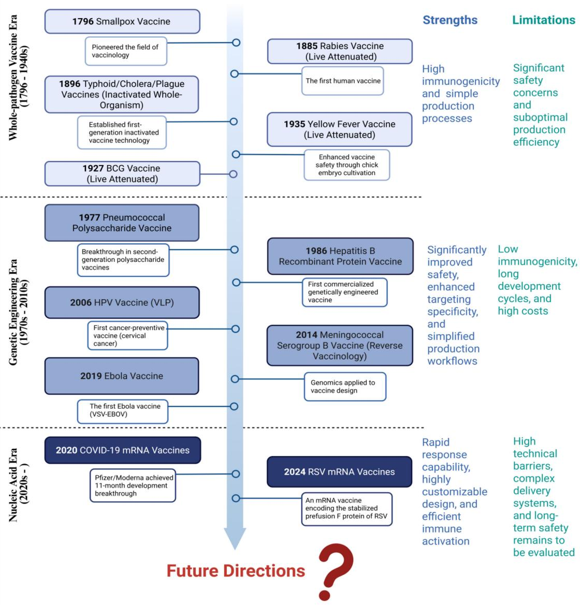
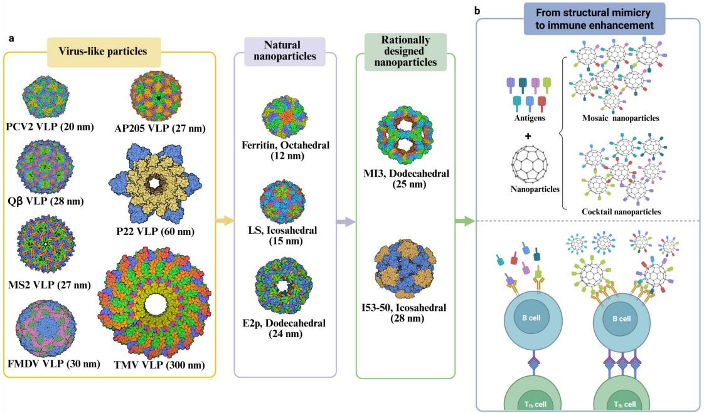
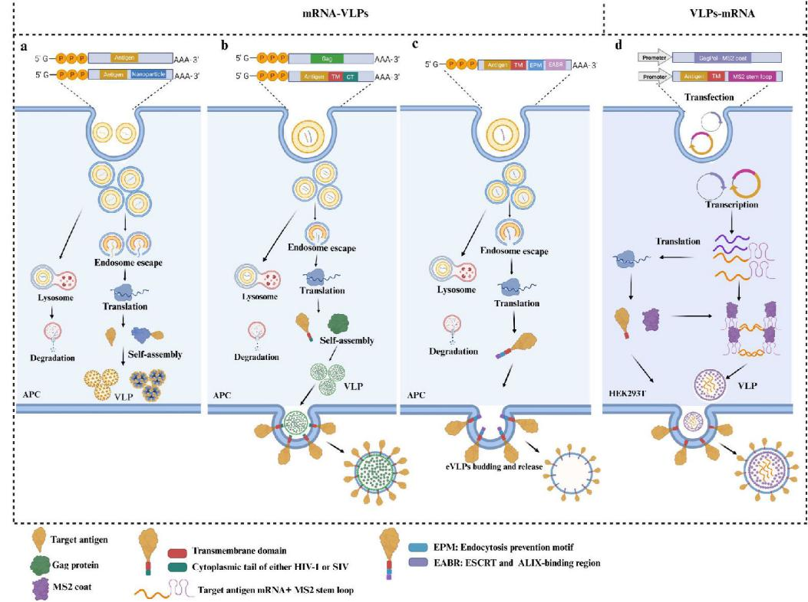
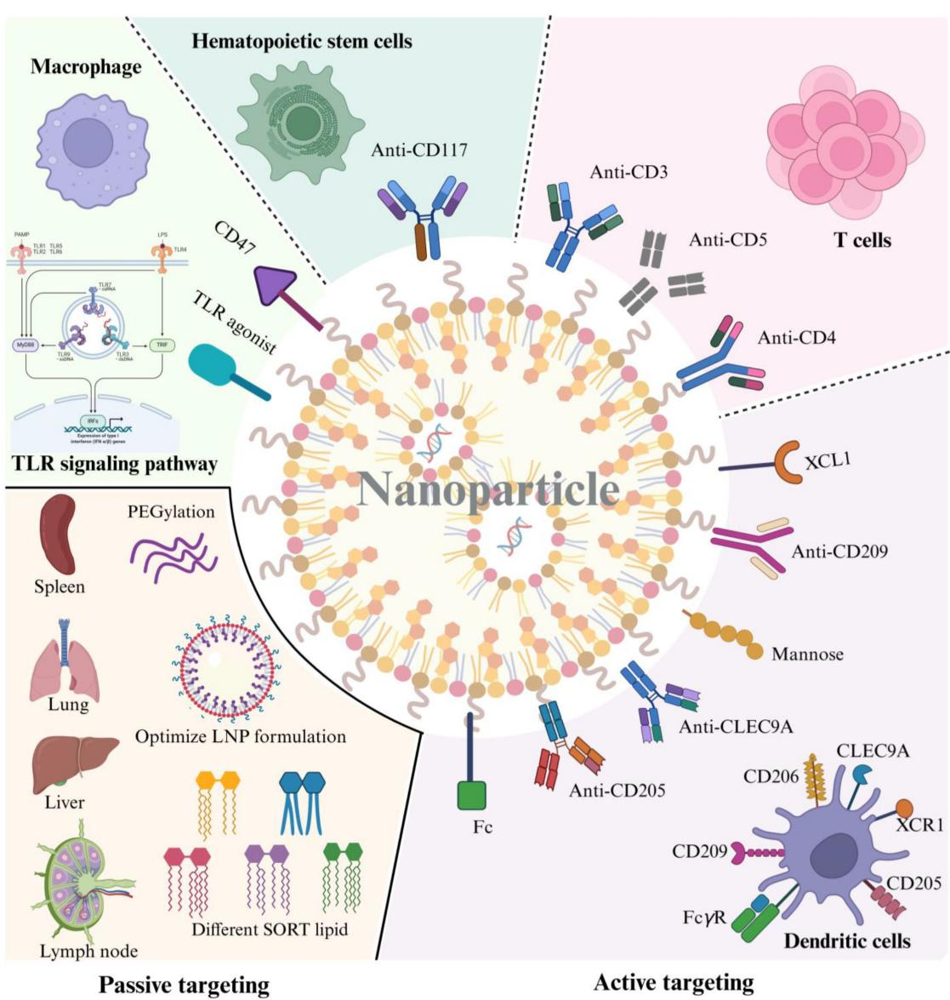

# Broad-spectrum vaccines against various and evolving viruses: from antigen design to nanoparticle delivery

Mengxiang Cao,1 Yongfeng Li,1 Xin Song,1 Zhanhao Lu,1 Huanjie Zhai,1 Hua-Ji Qiu,1 Yuan Sun1

AUTHOR AFFILIATION See affiliation list on p. 18.

ABSTRACT Pathogen evolution and narrow vaccine coverage urgently demand broad-spectrum vaccines. This review explores two pivotal technological fronts: structural biology- and immunoinformatics-guided antigen design, and utilizing nanoparticle-based delivery systems to induce broad immune responses. We critically analyze four antigen optimization strategies: (i) structure-based antigen design, (ii) conserved epitope targeting, (iii) consensus sequence-based antigen engineering, and (iv) chimeric immunogen design. Additionally, the common types and characteristics of nanoparticles are described briefly. Subsequently, we delve into cutting-edge applications of nanoparticles to enhance immune protection, including mosaic and cocktail nanoparticle vaccines, surface-modified targeting strategies, and the integration of mRNA technology with virus-like particles (VLPs). In conclusion, this review synthesizes risk-benefit analyses of existing strategies, current challenges, and emerging opportunities, offering practical frameworks to facilitate broad-spectrum vaccine innovation and enhance pandemic preparedness.

KEYWORDS broad-spectrum immune response, vaccine, antigen design, nanoparticle delivery

accines serve as powerful tools against infectious diseases. The evolution of vaccine technologies has progressed through three transformative eras (Fig. 1). The first-generation vaccines, like Jenner’s smallpox vaccine and Pasteur’s rabies vaccine, were developed using empirical methods based on inactivated or live-attenuated pathogens. However, these vaccines had significant limitations regarding safety concerns and manufacturing efficiency. The molecular biology revolution in the 1980s enabled second-generation vaccines based on precise antigen-targeting strategies, which significantly enhanced vaccine safety profiles while streamlining manufacturing processes through targeted antigen production and genome-guided immunogen design. The COVID-19 pandemic has unprecedentedly accelerated breakthroughs of third-generation vaccines, with mRNA vaccines achieving a paradigm shift through rapid design and in vivo protein expression.

However, the efficacy of vaccines is often limited by a fundamental challenge: antigenic escape driven by pathogen evolution, such as in influenza viruses and SARS-CoV-2 (1, 2). Following the 1918 Spanish flu pandemic (estimated fatalities exceeding 51 million), five waves of influenza pandemic have occurred. China’s current influenza vaccines, trivalent (IIV3) and quadrivalent (IIV4) inactivated vaccines, along with liveattenuated nasal spray vaccine (LAIV3), provide $40 \%$ to $6 0 \%$ efficacy against matched strains but lack broad cross-reactivity. Consequently, annual updates are required due to antigenic drift and shift. However, vaccine production faces high costs, delays, and risks of strain mismatch from viral evolution during manufacturing cycles. Similarly, SARS-${ \mathsf { C o V } } { \mathsf { - } } 2$ exemplifies rapid pathogen evolution. It spreads globally at an estimated rate of $( 8 - 9 ) \times 1 0 ^ { - 4 }$ nucleotide substitutions per site per year (3), evolving through mutation and

Editor Herman W. Favoreel, Universiteit Gent, Merelbeke, Belgium

Address correspondence to Hua-Ji Qiu, qiuhuaji@caas.cn, or Yuan Sun, sunyuan@caas.cn.

Mengxiang Cao and Yongfeng Li contributed equally to this article. Author order was determined based on their contribution to the article.

The authors declare no conflict of interest.

See the funding table on p. 18.

Copyright $\circledcirc$ 2025 Cao et al. This is an open-access article distributed under the terms of the Creative Commons Attribution 4.0 International license.

  
FIG 1 Milestones in human vaccine development. This timeline highlights key advancements in vaccinology. The whole-pathogen vaccine era (1796–1940s) featured foundational vaccines like the smallpox, rabies, and typhoid/cholera/plague vaccines. It offered high immunogenicity but safety risks. The genetic engineering era (1970s–2010s) includes polysaccharide/recombinant protein vaccines (pneumococcal/hepatitis B), VLP-based HPV (first cancer vaccine), reverse vaccinology (meningococcal B), and viral vectors (Ebola vaccine), prioritizing safety and enhanced targeting yet facing immunogenicity challenges. The nucleic acid era (2020s–now) is exemplified by COVID-19 and RSV mRNA vaccines, representing a significant leap in vaccine technology with the application of genomics and the mRNA platform. It offers rapid and flexible design but has high technical barriers and long-term safety yet to be evaluated.

recombination to generate variants with enhanced transmissibility, pathogenicity, and immune evasion capabilities (4). This relentless evolutionary pressure underscores the limitations of the traditional, passive vaccine model—the perpetual “chasing the virus” approach. Confronted with this “evolutionary arms race”, this reactive approach has shown limitations, necessitating a paradigm shift from a “reactive response to current strains” to “proactive prevention of future threats”. To counter viral evolution and antigenic diversity, broad-spectrum vaccines targeting conserved epitopes across variants or entire virus families are urgently needed, surpassing traditional strain-specific approaches. Next-generation strategies must integrate two pillars: (1) rational antigen design targeting conserved regions and (2) engineered delivery systems optimized for immune potentiation. The rational design of antigen structures can enhance immune responses in magnitude and breadth (5). Nanoparticles serve as modular delivery platforms. They enhance antigen immunogenicity through multivalent display, lymph node targeting, and controlled release kinetics (6). Combining antigen design with nanoparticle delivery, these strategies collectively overcome traditional vaccine limitations and enable more effective broad-spectrum solutions.

This article primarily focuses on antigen design and nanoparticle delivery systems as innovative approaches to induce broad immune protection. We will first elaborate on various strategies for antigen design, followed by an introduction to the diverse types of nanoparticles and discuss their applications in enhancing immune protection. The review concludes with an evaluation of the strengths and limitations of these strategies, aiming to propose a synergistic paradigm that can effectively address viral diversity and advance pandemic preparedness.

# ANTIGEN DESIGN STRATEGIES TO ENHANCE THE MAGNITUDE AND BREADTHOF IMMUNE PROTECTION

The evolutionary arms race between pathogens and the host immune system poses a fundamental challenge to vaccine development, particularly for rapidly mutating viruses and antigenically diverse pathogens. To overcome immune escape mechanisms and elicit robust and durable protection, next-generation antigen design has evolved beyond empirical approaches toward rational engineering frameworks. In this section, we summarize the innovative antigen design strategies outlined in Table 1, analyzing their respective strengths and limitations.

# Antigenic structure stabilization: locking viral proteins in prefusion conformation

Viral surface proteins often undergo conformational changes post-infection, masking critical neutralizing epitopes. Stabilizing these antigens in prefusion states is thus essential for eliciting potent and durable immunity. This section focuses on three major viruses, showcasing how structural vaccinology advances enable prefusion-stabilized vaccine design.

Human immunodeficiency virus (HIV) vaccine development faces challenges due to the conformational flexibility and glycan shield of Env trimers, which hinders the induction of broadly neutralizing antibody (bNAb). To overcome these challenges, three landmark engineering strategies have been developed: SOSIP (the stabilized outer surface immunogenic polypeptide), NFL2P (native flexible linked 2P), and UFO (uncleaved prefusion-optimized design). The SOSIP approach employs multiple modifications to stabilize the Env trimers. These include introducing a disulfide bond and an I559P substitution, removing the hydrophobic membrane-proximal external region (MPER), and mutating the gp120–gp41 cleavage site from REKR to RRRRRR (7). These changes improve the trimers’ solubility, mimic native Env structures, and facilitate bNAb binding while minimizing non-NAb interference. Despite these advances, SOSIP trimers show limitations in applicability, yield, and stability. The NFL2P strategy builds upon SOSIP by eliminating the furin cleavage site and inserting two flexible $( \mathsf { G } _ { 4 } \mathsf { S } ) _ { 2 }$ linkers between gp120 and gp41 for cleavage-independent trimer assembly (8). Although NFL2P improves yield and stability, its broad applicability remains constrained. The UFO design is a native-like engineering method for HIV-1 Env trimers. It eliminates the dependency on enzymatic cleavage and incorporates optimizations targeting the membrane fusion process. Kong et al. (9) proposed this innovative design, which omits the I559P mutation and replaces the furin cleavage site with variable-length linkers. This innovation enhances the universal applicability and stability of the Env trimers across diverse HIV-1 strains. However, the purification of correctly folded trimers is quite complex.

Parallel innovations have driven respiratory syncytial virus (RSV) vaccine development, where NAbs primarily target metastable prefusion F (pre-F) trimers (45). Seminal work introduced the DS-Cav1 immunogen, combining disulfide mutations (S155C and S290C) and cavity-filling substitutions (S190F and V207L) to stabilize pre-F (10). Disulfide bond engineering suppresses dynamic fluctuations in key regions during conformational transitions, while bulky side-chain substitutions fill cavities caused by suboptimal hydrophobic packing in the prefusion state. This dual strategy restricts transitional spatial freedom and enhances thermodynamic stability. This design results in NAb titers exceeding protective thresholds in pre-clinical models. A recent study identified an optimized construct, which incorporated T103C–I148C disulfide bonds, S190I cavityfilling, and D486S charge-neutralizing mutations and demonstrated enhanced efficacy in phase III clinical trials (46). Notably, the nanoparticle display of DS-Cav1 on I53-50 scaffolds enhanced immunogenicity by 10-fold, an effect attributed to its spatial organization (11). This structure-based antigen design, combined with nanoparticle delivery to achieve broad-spectrum immunity, is now a strategy extended to EBOV, SARS-CoV-2, and HIV vaccine development (47–49).

TABLE 1 Analysis of different antigen design strategies   

<table><tr><td> Strategy</td><td>Principle</td><td>Targeted pathogen/anti- gen</td><td>Core technical methods</td><td> Advantages</td><td>Challenges/limitations</td><td> Stages</td><td>Refer</td></tr><tr><td rowspan="6"></td><td rowspan="6"></td><td>HIV-1 Env trimer</td><td>SOSIP</td><td>Enhancing trimer solubility and mimicking native Env structure</td><td>Limiting applicability,low yield, and instability</td><td>Pre-clinical trials</td><td></td></tr><tr><td rowspan="4"></td><td>NFL2P</td><td>Improving yield and stability Enhancing universalapplicability and</td><td>Constraining broad applicabilityPre-clinicaltrials</td><td></td><td></td></tr><tr><td>UFO</td><td>stability</td><td>Complex purification methods</td><td>Pre-clinical trials</td><td></td></tr><tr><td rowspan="2">Introducing disulfide bonds, cavity-filling mutations,</td><td>Enhancing the conformational stability,</td><td>Th2-skewed immune polarization</td><td></td><td>(10</td></tr><tr><td>immunogenicity,and durable and potent hMPV, HeV, NiV,and hPIVand charge neutralization neutralizing antibody activity</td><td>risk of RSV; multistep purification complexity</td><td>Approved (GSK/Pfizer/Moderna)</td><td></td></tr><tr><td></td><td>mutation 2P</td><td>Improving yield, stability,and eliciting more</td><td></td><td>Approved (Moderna/BioNTech/</td><td></td></tr><tr><td rowspan="4"></td><td></td><td>6P Removing the MPER and TM,</td><td>durable and potent immune response</td><td></td><td>Johnson &amp; Johnson/ Novavax)</td><td>(16</td></tr><tr><td rowspan="2">Ebola GP protein</td><td>fusing the “foldon&quot;domain of T4 fibritin,and introducing a T42A mutation</td><td>Enhancing the conformational stability and eliciting more durable and potent immune response</td><td>Lacking the MPER region in GP may affect the antibody response</td><td>Pre-clinical trials</td><td></td></tr><tr><td>Introducing epitope masking, epitope scaffolding, Focusing on conservedSARS-CoV-2, RSV, IAV,and protein dissection,antigen</td><td>Steering immune recognition toward defined antigenic regions,thereby broadening resurfacing,and cross-strain protective efficacy</td><td>Weakened immunogenicity</td><td>Pre-clinical trials</td><td></td></tr><tr><td>Generating conserved residues encoding</td><td>Dengue virus, SARS-CoV-2,</td><td>boosting Computationally optimized</td><td>Covering multiple strains/subtypes to mitigate Susceptibility to high mutation</td><td></td><td></td><td></td></tr><tr><td rowspan="4">sequence design</td><td rowspan="4">to elicit broad immunity and influenza virus</td><td>cross-reactive epitopesChikungunya virus, NiV，</td><td>broadly reactive antigens</td><td>the impact of antigenic drift</td><td>rates</td><td>Pre-clinical trials</td><td>(27</td></tr><tr><td>HuNoVand SARS-CoV-2</td><td>Epitope transplantation</td><td>Eliciting cross-reactive immune responses against multiple variants</td><td>Limited immunogenicity</td><td>Pre-clinical trials</td><td>(33</td></tr><tr><td>SARS-CoV-2 and influenza</td><td>Domain substitution</td><td>Conferring broad protection across</td><td>Addressing stability limitations and epitope immunodominance hierarchies requires precise</td><td></td><td></td></tr><tr><td>virus</td><td></td><td>variants/pathogens</td><td>engineering to balance antigenic</td><td></td><td></td></tr><tr><td rowspan="4">design</td><td rowspan="4">variants into a single immunogen</td><td></td><td></td><td></td><td>responses</td><td></td><td></td></tr><tr><td></td><td>Incorporating immunomodulatory</td><td></td><td></td><td></td><td></td></tr><tr><td>Influenza virus and RABV</td><td>molecules such as CXCL13,</td><td>Enhancing non-specificimmune responses</td><td>Low antigen expression and</td><td></td><td>(40</td></tr><tr><td></td><td>CCL3, XCL1,or GM-CSF</td><td></td><td>solubility</td><td>Pre-clinical trials</td><td></td></tr></table>

The COVID-19 pandemic spurred rapid advances in structural vaccinology. SARS-CoV-2‘s spike (S) protein undergoes structural rearrangement to mediate viral-cell membrane fusion, but post-fusion S alone fails to elicit robust immunity. Corbett et al. (16) engineered a prefusion-stabilized S protein by introducing two proline mutations (2P), which effectively “lock” its conformation to preserve neutralizing epitopes. At present, the S-2P strategy has been utilized in multiple vaccines, including the mRNA vaccines by Moderna and BioNTech, the adenovirus vector vaccine from Johnson & Johnson, and the recombinant protein vaccine by Novavax. This technology has elicited more durable and potent immune responses. Two doses of the BNT162b2 (BioNTech) and mRNA-1273 (Moderna) vaccines provided $9 4 . 8 \%$ and $9 4 . 1 \%$ protection against COVID-19, respectively (17, 18). Based on S-2P, Hsieh et al. (19) further introduced four proline mutations (S-6P). These additional proline mutations further stabilize the prefusion conformation of the S protein and improve its expression level and stability.

The conformational dynamics of viral surface proteins helps evade NAbs. Therefore, stabilizing antigens in prefusion conformation depends on three strategies: covalent bond stabilization (e.g., disulfide bonds), steric hindrance optimization (e.g., hydrophobic cavity filling, charge neutralization, and proline substitutions), and cleavage site modification (e.g., eliminating cleavage-dependent transitional states). Emerging computational tools, including AlphaFold3, Colab Design, and Rosetta, enable rational design of prefusion-stabilized antigens for other enveloped viruses, such as the prefusion conformation of EBOV GP protein and the F proteins from Hendra virus (HeV), Nipah virus (NiV), human metapneumovirus (HMPV), and human parainfluenza virus (HPIV) (12–15, 20).

# Epitope-focused design: directing immune recognition toward conserved determinants

While stabilizing antigens in specific conformations boosts immunity, viral variants necessitate vaccines that target conserved regions across strains. Epitope-focused design directs immune responses to these invariant sites, sharpening antibody precision and reducing ineffective reactions. Multiple immune-focusing strategies have been developed to steer immune recognition toward defined antigenic regions, including epitope masking (glycosylation to occlude immunodominant regions), epitope scaffolding (transplanting epitopes onto stable scaffolds for enhanced immunogenicity), and antigen resurfacing (reducing non-target epitope immunogenicity by site-directed mutagenesis) (21). Building on this concept, Hauser et al. (22) harnessed the power of glycosylation engineering and epitope scaffolding in synergy to achieve broad-spectrum neutralization against SARS-CoV-2 and related coronaviruses. Beyond masking immunodominant regions, directing responses toward cryptic but conserved epitopes presents unique challenges. These are addressed by strategies, such as the protect-modify-deprotect (PMD), a three-step process: (1) protection of the target epitopes using bNAbs, (2) covalent modification of exposed lysine residues with PEG-NHS, and (3) deprotection of the target epitope by dissociation of NAb (23). This innovative approach leverages PEGylation and chemical masking effects to redirect immune recognition toward the previously hidden epitopes. The complexity of covalent modification and the process of antibody removal increases manufacturing costs and introduce risks of residual reagent toxicity. Moderna’s recent clinical trials of an mRNA-based RSV vaccine in infants revealed more severe respiratory infection symptoms compared to the placebo group (50). This situation underscores RSV-specific risks, such as fusion protein dominance or age-related immune responses. To address these challenges, current strategies focus on epitope engineering, exemplified by the LC2DM approach, which involves truncating immunodominant regions to remove non-protective epitopes while retaining key neutralizing targets. This design enhanced Th1 polarization and achieved durable NAb titers $( >$ 84 days), though requiring careful validation to ensure conserved epitopes remained effectively recognizable by immune cells (24). Zhao et al. (25) achieved broad-spectrum protection against variants by displaying 16 copies of a conserved epitope of SARS-CoV-2 on a tailored horseshoe-shaped RNH1 scaffold, though the induced antibodies showed limited neutralization, potentially due to the epitope’s cryptic nature and suboptimal spatial density.

Two major obstacles in epitope-based vaccine design are mimicking the natural epitope structure and enhancing epitope immunogenicity. Selecting conserved B-cell and T-cell epitopes for vaccine development simplifies antigen design and enhances overall protective efficacy. Computational design tools are widely employed in the prediction of epitope vaccines (51). Sharma et al. (26) developed a universal multi-epitope subunit vaccine using immunoinformatics approaches that synergistically activates innate, cellular, and humoral immune responses. Furthermore, ConFormer-based epitope predictors (CFEP) have been developed to predict binding affinity of epitopes to both HLA classes I and II molecules. Vaccines designed using this approach effectively elicit T-cell responses and, by targeting conserved viral regions, exhibit broad protection against diverse variants (52). However, epitopes are usually small in size and thus less immunogenic. One of the promising strategies is to display the epitopes on the surface of nanoparticles. Many nanoparticles have been proven to be able to accommodate foreign epitopes without destroying particle assembly (53). The nanoparticle vaccine, engineered by displaying conserved epitopes of pre-existing NAbs on ferritin (CePnF), demonstrated robust induction of humoral, cellular, and mucosal immune responses while conferring broad-spectrum protection against diverse SARS-CoV-2 variants (54). However, epitope density and spacing on nanoparticles must be optimized to prevent steric hindrance, a challenge that requires iterative structural modeling and experimental validation. Simultaneously, multi-epitope tandem fusion may disrupt the protein scaffold’s hydrophilicity, leading to insoluble inclusion bodies, while also requiring avoidance of immunodominance imbalance. Structural modeling can predict optimal antigen combinations to maximally expose key immune epitopes. Moreover, the capacity of bNAbs to offer escape-resistant and long-lasting antiviral protection highlights the crucial role of structural characterization of their cognate epitopes in optimizing the design of pan-variant vaccines. Recent studies identified numerous bNAbs against various pathogens (55–57). The structural and functional characterization of these bNAbs has laid a path to innovative vaccine strategies. While bNAbs typically target conformational epitopes, de novo protein design enables engineered immunogens that mimic bNAb mechanisms, eliciting broad-spectrum protection against rapidly evolving pathogens. Recently, David Baker’s team computationally engineered a protein named nTrimer1 that potently neutralizes diverse MERS strains and demonstrated exceptional prophylactic efficacy in mouse models (58). This de novo design exemplifies the remarkable potential of computational protein design.

Vaccine design targeting conserved epitopes must balance two objectives: maximizing immunogenicity and minimizing viral escape. The glycan shield of HIV-1 Env exemplifies this challenge: it serves as a critical escape mechanism, yet complex glycopeptide epitopes underpin bNAb breadth. To address this paradox, attention should be directed toward functionally invariant regions, such as the CD4-binding loop and fusion peptide, where mutations severely impair viral fitness. Designing immunogens that expose these sites can force the virus to choose between “escape” and “inactivation”. Sequential immunization targeting multiple epitope clusters can induce antibodies against diverse regions, thereby preventing escape due to single-epitope mutations (59, 60).

# Consensus sequence engineering: capturing pan-viral shared features

Epitope-focused design enhances antibody specificity through immune-guided technologies. However, its reliance on predefined epitopes has driven researchers to investigate a critical question: How can we systematically uncover cross-subtype conserved elements at the viral genomic level? Consensus sequence engineering provides a solution via multiple sequence alignment-based mining of evolutionarily conserved motifs. Computationally optimized broadly reactive antigens (COBRA) represent the dominant methodology. This strategy has been extended to develop broad-spectrum vaccines against multiple pathogens, including influenza virus, dengue virus, SARS-CoV-2, NiV, and Chikungunya virus (27–31). Consensus sequence-based antigen design holds great promise for preventing emerging infectious diseases. Using an evolutionary clustering algorithm, Zhao et al. (32) identified conserved SARS-CoV-2 mutation sites and evolutionary patterns. The resulting $\mathsf { S } _ { \mathsf { p a n } }$ antigen targets the five most frequent mutations, all of which persist in subsequently emerged Omicron subvariants, demonstrating strong conservation and foresight.

Despite significant progress, consensus-based vaccine development faces challenges. For influenza viruses, the rapid mutation rate and antigenic drift complicate the prediction of evolutionarily stable consensus sequences, thereby gradually diminishing vaccine efficacy over time. Notably, accurate prediction of consensus sequences depends critically on the viral database: larger and more diverse databases yield greater precision. Moreover, the database must represent currently circulating viruses to yield meaningful computational results. Furthermore, host genetic diversity introduces another hurdle: varied genetic backgrounds influence vaccine-induced immune responses, resulting in variable efficacy across species. This complicates control efforts for viruses capable of cross-species transmission. Pre-existing immunity from prior exposures (acquired from prior infection or vaccination) may interfere with consensus vaccine immunogenicity, limiting immune activation in pre-immune populations. This highlights the intricacies of designing personalized or universal vaccines. Critically, rational vaccine design requires not only advanced sequence analysis but also deep insights into viral evolution and host immunity. To advance this field, future efforts must integrate computational biology, structural virology, and systems immunology to streamline vaccine development.

# Chimeric antigen design: integrating immunodominant domains from heterologous strains

Chimeric antigen design represents a pivotal strategy to counteract viral variations. To advance broad-spectrum vaccines, it integrates key antigenic epitopes from divergent viral strains into a unified immunogen through two principal technical paradigms: epitope transplantation and domain substitution. Transplanting neutralizing epitopes from highly variable viruses onto conserved backbones can overcome genotype restrictions. For instance, transferring neutralizing epitopes from the VP1 surface loops of human norovirus (HuNoV) GII.4 to the GI.1 backbone successfully induced cross-reactive antibodies against both genotypes, demonstrating the critical role of epitope-backbone compatibility in broad immune coverage (33). According to Guthmiller et al. (34), the chimeric hemagglutinin (HA) vaccination reshaped the long-lived HA-specific B-cell repertoire and induced a convergence of B cells against multiple conserved and protective epitopes of HA. Vaccine design requires balancing immunodominance to target multiple conserved epitopes for broader protection. Broecker et al. (35) engineered “mosaic” HAs by replacing immunodominant antigenic sites in $\mathsf { H 3 H A }$ with conserved epitopes derived from avian influenza HAs, thereby achieving antigenic silencing of variable regions. This approach overcomes seasonal vaccine limitations by refocusing immunity toward conserved epitopes, demonstrating broad cross-reactivity across H3 strains and conferring heterologous protection against antigenically drifted viruses. Multivalent antigens constructed through domain fusion enhance variant coverage. A representative case is the heterodimer formed by fusing SARS-CoV-2 prototype strain and beta variant receptor-binding domains (RBDs), which elicited bNAbs against alpha, beta, delta, and omicron via spatial synergy effects. Further incorporating beta and omicron mutations into alpha coronavirus backbones has achieved cross-variant protection and provided a pre-adaptive framework to counter viral evolution (36–38). The modularity of chimeric antigen design enables diverse applications beyond single-pathogen scenarios. For example, hybrid antigens combining the influenza HA stalk domains and the SARS-CoV-2 RBDs, as reported by Li et al. (39), induced dual NAbs against both viruses, highlighting the potential of chimeric antigen design for broad-spectrum protection. Despite the significant advantages that chimeric antigens offer, this approach also faces several challenges that impact its efficacy. First, the physicochemical stability of multi-domain fusion proteins can be compromised due to structural incompatibilities between heterologous domains. Second, immune dominance hierarchies among epitopes may suppress responses to subdominant targets, and careful safety evaluation is required for the novel antigen created by fusion. These limitations underscore the need for computational modeling and structural validation to ensure epitope accessibility and native-like folding. Additionally, for vector-based vaccines, the capacity to accommodate multiple antigens must also be considered.

Chimeric antigens can incorporate immunomodulatory molecules, such as CXCL13, CCL3, XCL1, or GM-CSF (40–44). These molecules stimulate dendritic cells (DCs) and recruit T follicular helper (Tfh) cells and germinal center (GC) B cells. This process promotes GC formation and non-specifically enhances immune responses. Critically,

  
FIG 2 Protein-based nanoparticles: types and multivalent display strategies. (a) Representative categories of nanoparticles. Their structures were constructed by using the Protein Data Bank (PDB) ID codes, including protein-based platforms [e.g., VLPs derived from PCV2 (6OLA), FMDV (7ENP), MS2 (6RRS), P22 (8EB7), $\boldsymbol { \mathrm { Q } \beta }$ (7LGE), TMV (6RLP), ferritin (1MFR), LS (4V7G), AP205 (5LQP), E2p (1B5S), MI3 (7B3Y), and I53-50 (7SGE)]. (b) Two nanoparticle delivery strategies to enhance immune responses: mosaic nanoparticles integrate diverse antigenic components within a single structural entity, whereas cocktail nanoparticles achieve synergistic effects through simultaneous delivery of multiple nanoparticle types each displaying a single antigen. Compared to single soluble antigens, multivalent antigen arrays on nanoparticles can cross-link multiple B-cell receptors to enhance antigen processing and presentation while simultaneously strengthening interactions with follicular helper T cells, thereby resulting in higher and longer-lasting antibody levels.

GC responses require stringent regulation to prevent autoantibody production and the development of systemic autoimmune diseases, while the chimeric construct’s safety requires comprehensive evaluation (61). Furthermore, spatial conformation disruptions during chimeric antigen construction may weaken effectiveness. Despite these challenges, chimeric design represents a powerful platform for developing next-generation broad-spectrum vaccines. Advances in structural biology, immunoinformatics, and synthetic biology will refine this strategy to better address viral evolution and pandemic threats.

# NANOPARTICLE PLATFORMS FOR BROAD-SPECTRUM IMMUNITY: VALENT ENGINEERING AND IMMUNE ENHANCEMENT

The successful implementation of these antigen designs critically depends on synergistic optimization with advanced delivery systems. For instance, the integration of structurally stabilized antigens with surface-displayed nanoparticles can synergistically enhance immune responses, while multi-epitope chimeric antigens require modular platforms to maximize immunogenicity. When the antigen spacing on nanoparticle surfaces approximates the optimal B-cell receptor (BCR) binding distance $( \sim 1 0 \ \mathsf { n m } )$ ), multivalent antigens can simultaneously engage multiple BCRs, triggering potent B-cell activation signals. Concurrently, nanoparticles within this size range $( 2 0 - 2 0 0 \ \mathsf { n m } )$ can drain to lymph nodes and be presented to resident DCs (62). In the following sections, we systematically categorize nanoparticle types (see Fig. 2a for representative structures), elucidate their distinctive characteristics, and evaluate their applications in enhancing immune protection. A detailed summary of the utilization of different nanoparticles for inducing broad-spectrum immune protection is provided in Table 2.

# Structural mimicry: virus-like particles (VLPs), natural and rationally designed protein nanoparticles

VLPs represent an attractive vaccine development platform due to their structural mimicry of native viruses, combined with the elimination of risks inherent in live vaccines. The rigid, repetitive surface structure of VLPs, a potent geometric pathogenassociated structural pattern (PASP), facilitates BCR cross-linking while enabling efficient natural IgM binding and C1q complement fixation, thereby promoting their deposition on follicular dendritic cells (FDCs) (85, 86). This activates potent immunity, as exemplified by HPV VLPs with L1 pentamers, which achieve a cervical cancer prevention rate of $>$ $9 0 \%$ (63). VLPs derive from diverse sources, such as animal viruses, bacteriophages, and plant viruses (87, 88). In veterinary medicine, VLPs have shown promise in protection against a range of animal infectious diseases. For example, PCV2-based VLPs have been used to develop vaccines against PCV2 (64), while FMDV VLPs have induced long-lasting immune responses (65). Both VLP-based vaccines have been implemented in field disease control programs. Swine influenza A virus VLPs provide cross-protection against different strains (66). Notably, structurally diverse VLPs serve as versatile platforms for multivalent antigen presentation, exemplified by PCV2 VLPs displaying classical swine fever virus (CSFV) E2 protein or porcine reproductive and respiratory syndrome virus (PRRSV) neutralizing epitopes, and porcine parvovirus (PPV) VLPs presenting T- and B-cell epitopes of FMDV VP1 within surface loops—all eliciting robust dual-pathogen immunity (67, 68). These VLPs can display foreign antigens for bivalent vaccines. Bacteriophagebased VLPs (P22, Qβ, MS2, and AP205) and plant virus-derived VLPs (TMV and PapMV) exhibit stability and immunogenicity, advancing vaccine design (89–94). VLP production platforms include bacterial, yeast, insect cell, mammalian cell, plant cell, and cell-free systems. Bacterial systems offer cost-effective scalability (producing approximately $30 \%$ of current VLPs) but lack eukaryotic post-translational modifications (PTMs) and require stringent endotoxin control, partially mitigated by engineered endotoxin-free E. coli. Yeast systems allow limited glycosylation, but VLP extraction risks denaturation. Insect cells support eukaryotic PTMs yet face purification difficulties due to baculovirus contamination. Mammalian cells enable complex PTMs yet have high costs and low yields. Plant systems are rapid and low cost but lack mammalian-like glycosylation and have low productivity. Cell-free systems achieve high yields quickly but are limited by poor scalability and high costs (95, 96).

TABLE 2 Comparative analysis of nanoparticle vaccine platforms for broad-spectrum protection against viral infections   

<table><tr><td></td><td></td><td>Antigendesign</td><td>HumorarTmmuneresponse</td><td></td><td></td><td>Rererences</td></tr><tr><td rowspan="3">VLP</td><td>Seasonal influenza virus, HuNoV,sarbecoviruses,</td><td>Displaying diferent antigens/epitopes on the VLP surface; transplanting neutralizing epitopes from variable viruses</td><td>Robust cross-reactive antibodies</td><td>Robust cross-reactive T-cell</td><td>Reduced viral loads</td><td>(33,53,63-70)</td></tr><tr><td>CSFV, and IAV</td><td>onto conserved backbones forms mosaic nanoparticles</td><td></td><td>responses</td><td></td><td></td></tr><tr><td>SARS-CoV-2 (Delta, WIV04,Omicron),</td><td>Displaying conserved epitopes of various viral proteins on the surface offerritin;</td><td>Antibodies with cross-reactivity</td><td>Potent and cross-reactive</td><td>Complete protection</td><td>(41,54,71-73)</td></tr><tr><td rowspan="3"></td><td>and ASFV</td><td>targeting DCs</td><td>and neutralizing activity</td><td>cellular immune responses</td><td></td><td></td></tr><tr><td></td><td>Displaying multiple distinct antigens/epitopes on mosaic</td><td></td><td></td><td></td><td></td></tr><tr><td>SARS-CoV-1/2 and HIV-1</td><td>nanoparticles surface; glycosylation to occlude immunodominant regions;</td><td>Enhanced antibody responses to mismatched strains</td><td>Not assessed</td><td>Not assessed</td><td>(48,74-76)</td></tr><tr><td rowspan="3"></td><td></td><td>Stabilizing the viral protein in the prefusion conformation</td><td></td><td></td><td></td><td></td></tr><tr><td>RSV, EBOV, SUDV,</td><td>Stabilizing the viral protein in the prefusion conformation;</td><td>Potent neutralizing and</td><td></td><td>Significant activation of CD4+ and Protection against lethal</td><td></td></tr><tr><td>SARS-CoV-2,and HIV-1</td><td>constructing mosaic/cocktail nanoparticle vaccines</td><td>cross-reactive antibodies</td><td>CD8+T cells</td><td>challenge</td><td>(11,47,49,77)</td></tr><tr><td rowspan="3">LNP</td><td></td><td></td><td></td><td>Robust Th1/Tc1 responses (IFN-Y</td><td></td><td></td></tr><tr><td>SARS-CoV-2 and SARS-like Constructing chimeric antigen;</td><td></td><td>Cross-reactive IgG antibodies</td><td>and IL-2)and CD8+T-cell</td><td>Complete protection in mice/hamsters</td><td>(37,38)</td></tr><tr><td>zoonotic coronavirus</td><td>co-delivering with STING agonist</td><td>against multiple variants</td><td>activation</td><td></td><td></td></tr><tr><td rowspan="3">mRNA-launched VLP</td><td rowspan="3">ZIKV, RABV,SARS-CoV-2,</td><td>Self-assembly of mRNA-encoded proteins into VLPs;</td><td></td><td></td><td></td><td></td></tr><tr><td>fusing mRNA-encoded target proteins with nanoparticle-</td><td>NAbs against various variants;</td><td>Multifunctional CD8+and CD4+</td><td></td><td></td></tr><tr><td>forming components;</td><td>durable antibody-mediated</td><td>T-cell responses</td><td>Complete protection</td><td>(78-83)</td></tr><tr><td rowspan="3">VLP-encapsulated</td><td rowspan="3"></td><td>co-delivering mRNA-encoded target proteins and structuralprotection</td><td></td><td></td><td></td><td></td></tr><tr><td>helper proteins or EABR</td><td></td><td></td><td></td><td></td></tr><tr><td>Integrating MS2 stem-loop structures into mRNA;</td><td>Cross-neutralizing IgG antibodies;</td><td>Enhanced T-cell-mediated</td><td></td><td></td></tr><tr><td>mRNA</td><td>SARS-CoV-2 and HSV-1</td><td>targeting DCs</td><td>durable responses up to 9 months</td><td>immunity,generating more IFN-γ, TNF-α,and IL-2</td><td>Reduced the viral load</td><td>(84)</td></tr></table>

Ferritin serves as a structurally stable and extensively validated biomimetic platform, offering a viable alternative to VLPs despite its smaller size and simpler subunit architecture. As the most studied non-viral protein nanoparticle, ferritin comprises eight subunits with three-fold symmetry and functions as a structural scaffold for trimeric antigen presentation. Key pathogenic viral antigens (e.g., influenza HA, SARS-CoV-2 S, and RSV F) adopt functional trimeric structures. The strategic fusion of these antigenic molecules to ferritin enables the assembly of trimers that closely mimic their native structural architectures. Currently, two ferritin-based influenza vaccines have undergone Phase I clinical evaluation (NCT03186781 and NCT03814720), both of which have demonstrated the ability to induce the production of bNAbs (71, 72). Lumazine synthase (LS) is an enzyme involved in riboflavin biosynthesis, characterized by a highly symmetric icosahedral structure formed by the self-assembly of 60 subunits (97). LS exhibits high thermal stability (tolerating elevated temperatures) and resistance to degradation in physiological environments, making it suitable as a long-acting antigen carrier. When the VP8 protein of rotavirus was fused with LS nanoparticles, it was found that the monomeric VP8 on the nanoparticles exhibited denser and more closely spaced arrangements compared to the dimeric VP8 on native viral particles (98). However, LS nanoparticles fused with full-length HIV gp120 or gp140 failed to assemble. In contrast, dihydrolipoyl transacetylase protein (E2p), which forms a hollow dodecahedral 60-mer structure through the self-assembly of 20 trimers, successfully displayed HIV gp120 or gp140 and enhanced the breadth and durability of NAbs (99).

Natural protein assemblies inspire the engineering of programmable nanoparticles. Computationally designed architectures recapitulate native structural symmetry, self-assembly properties, and functional compartmentalization, thereby enabling precise control of antigen density, inter-epitope spacing, and spatial organization to optimize immune recognition. For example, I53-50 nanoparticles are a two-component protein complex, which is assembled in vitro by the icosahedral trimers I53-50A and the dodecahedral pentamers I53-50B (100). The I53-50 nanoparticle demonstrated enhanced immunogenicity when displaying RSV prefusion F proteins. By computationally simulating antigen spacing at $1 5 \ \mathsf { n m }$ , which matches the optimal distance for BCR crosslinking, this configuration resulted in a 10-fold increase in NAbs compared to monomeric protein formulations (11). The I53-50-based SARS-CoV-2 recombinant protein nanoparticle vaccine GBP510 has entered clinical trials (NCT04750343) (77). Moreover, Bruun et al. (74) developed MI3, a mutant variant of the I301 residue on the 2-keto-3-deoxy-phosphogluconate (KDPG) aldolase from the hyperthermophilic bacterium Thermotoga maritima, which self-assembles into a porous dodecahedral structure composed of 60 subunits. MI3 nanoparticles displayed eight distinct SARS-CoV-2 RBDs via SpyTag-SpyCatcher, eliciting protection against multiple sarbecovirus strains (75). The SpyTag-SpyCatcher system enables modular antigen exchange, allowing a single nanoparticle platform to accommodate diverse pathogens and dynamically update antigens in response to emerging genetic variants. However, in comparison to other platforms, MI3 is relatively new and has received less attention in terms of safety and efficacy; thus, further validation is needed. In brief, these engineered platforms match the immunogenicity of natural counterparts, with oligomeric structures tailored for multimeric antigens, enhancing vaccine potential.

# Broad-spectrum immunity via mosaic and cocktail nanoparticle vaccines

Mosaic nanoparticles and cocktail nanoparticles represent a promising strategy for broad-spectrum vaccine development, demonstrating superior NAb induction compared to monovalent counterparts. These strategies leverage distinct approaches: mosaic nanoparticles rely on spatial engineering to precisely arrange multiple antigens on a single particle, while cocktail nanoparticles achieve modular delivery by mixing different single-antigen particles (differences between these delivery strategies are illustrated in Fig. 2b). To address emerging SARS-CoV-2 variants and sarbecovirus spillovers, Cohen et al. designed mosaic-8 RBD nanoparticles displaying eight different sarbecovirus RBDs. The probability of two adjacent RBDs being the same is low for mosaic-8 RBD nanoparticles, an arrangement chosen to favor interactions with B cells whose receptors can cross-link between adjacent RBDs to use avidity effects to preferentially recognize conserved, but sterically occluded, classes 3, 4, and 1/4 RBD epitopes. Mosaic-8 nanoparticles enhance heterologous binding, protecting against sarbecovirus challenges in animal models and eliciting more broadly cross-reactive antibodies against conserved epitopes than homotypic RBD-only nanoparticles (75, 76, 101). Nevertheless, this study had its limitations, as it failed to assess cellular immunity and did not conduct formal transmission studies. Notably, studies have shown that intranasal delivery of the mosaic nanoparticle vaccine elicits a robust mucosal immune response, confers broad cross-protection against multiple SARS-CoV-2 sublineages (102), and provides durable immune protection (73). To unravel the immunological underpinnings behind the enhanced breadth of antibody response and superior protection against heterologous infection offered by mosaic nanoparticle vaccines, Liu et al. (103) delved into the matter. Analysis of the nanoparticle-induced BCR repertoire revealed the preferential expansion of the IGHV14-3:IGKV14-111 germline pairing by mosaic nanoparticles. These mAbs conferred broad cross-protection through recognition of a conserved cryptic epitope on RBDs across clades 1a, 1b, and 3 sarbecoviruses. Similarly, Liu et al. (69) designed mosaic nanoparticles using genetic algorithms to maximize coverage of potential T-cell epitopes present in circulating strains. These nanoparticles exhibited cross-reactivity against 15 of 16 tested strains and were effective against a swine influenza virus, highlighting the broader applicability of this approach beyond coronaviruses. However, technical limitations persist, particularly because the display of different antigens onto the nanoparticles is random, and their positions and proportions cannot be predetermined. The construction of a quartet nanoparticle by arranging SARS-CoV RBDs on a single polypeptide chain and displaying it on MI3 nanoparticle surfaces addresses the challenge of uncontrollable antigen proportion. Compared to the mosaic-8 vaccine, the quartet nanocages, despite containing fewer components, induced broad-spectrum antibodies that effectively neutralized both target viruses and variant strains (104).

In contrast, cocktail nanoparticle vaccines are created by mixing individual nanoparticles, each displaying identical antigens. This modular approach avoids the stochastic antigen display patterns inherent in mosaic designs while retaining the flexibility to combine different antigens. For instance, a cocktail vaccine co-displaying S protein antigens from phylogenetically distinct clade 1 sarbecoviruses has been shown to induce bNAb responses against not only SARS-CoV-2 variants but also SARS-CoV-1 and zoonotic bat sarbecoviruses capable of binding to the human ACE2 (70). While cocktail nanoparticles offer advantages in fabrication simplicity and characterization over mosaic nanoparticles, both platforms entail sophisticated manufacturing processes and materials, resulting in relatively high production costs.

# Synergistic mRNA-VLP integration: programmable multivalent antigen display for enhanced immune protection

Pfizer and Moderna leveraged mRNA platforms to unprecedentedly develop SARS CoV-2 vaccines within merely 11 months, demonstrating the exceptional rapid response capability and flexibility of mRNA in addressing pandemic emergencies. The platform’s core advantage lies in real-time in vivo protein expression, enabling dynamic antigen adaptation: by modifying mRNA sequences to match viral antigenic drift, researchers rapidly iterated vaccines to target emerging variants with precision. However, challenges, such as large molecular size, negative charge, and susceptibility to enzymatic degradation, hinder their cellular internalization and cytoplasmic delivery, necessitating advanced delivery systems. LNPs remain the gold standard for mRNA encapsulation, offering protection and enhanced cellular uptake (105). Nevertheless, a frequently overlooked challenge in LNP technology lies in the remarkably limited cytoplasmic release of nucleic acid payloads. LNPs are internalized by cells through endocytic pathways, followed by trafficking to early endosomes that subsequently mature into late endosomes and ultimately lysosomes (106). To achieve efficient delivery, nucleic acid carriers must escape into the cytoplasm prior to endosomal maturation into degradative lysosomal compartments. This critical yet inefficient process is termed endosomal escape. Current escape mechanisms are primarily attributed to two hypotheses: (1) ionizable lipid protonation in acidic endosomes induces membrane non-bilayer phase transitions, and (2) proton sponge effects trigger endosomal osmotic rupture (107). A deeper understanding of these mechanisms is essential for the rational design of next-generation delivery systems.

In contrast, VLPs provide a self-assembling scaffold capable of multivalent antigen display, prolonged lymph node retention, and synergistic packaging of nucleic acids or adjuvants through their positively charged lumen (86). Recent advances have explored hybrid mRNA-VLP platforms to overcome limitations of conventional vaccines (illustrated in Fig. 3a through d). For example, LNP-encapsulated mRNA encoding Zika virus prM-E proteins self-assembled into VLPs in vivo, eliciting potent NAbs while minimizing cross-reactive antibodies to avoid antibody-dependent enhancement (ADE) of dengue virus infection (78). Similarly, the mRNA, encoding glycoprotein and matrix proteins of rabies virus to assemble VLPs in vivo, induces broader and longer-lasting NAbs than conventional inactivated vaccines (79). While these studies primarily focused on humoral immunity, Hendricks et al. (80) demonstrated that the mRNA-launched VLPs could induce robust $\boldsymbol { \mathsf { C D 8 } } ^ { + }$ T cell responses alongside NAbs, offering protection against both matched and mismatched viral strains.

Recent engineering advances have expanded strategies for in vivo VLP formation. For viral proteins lacking self-assembly capability, fusion with self-assembling nanoparticles or co-expression with other viral proteins enables VLP generation. For instance, Zhang et al. co-delivered mRNAs encoding HIV-1 Env and SIV Gag, producing Env-displaying enveloped VLPs in vivo that induced bNAbs in non-human primates. This approach was further applied to SARS-CoV-2 mRNA-launched VLP design (81, 82). Hoffmann et al. (83) pioneered an endosomal sorting complex required for transport (ESCRT) pathway-driven VLP assembly strategy, eliminating dependency on other viral proteins. The key modification is fusing the cytoplasmic tail of the SARS-CoV-2 spike protein with an ESCRT- and ALG-2-interacting domain (EABR). This hijacks the ESCRT machinery, a cellular system that regulates membrane remodeling, to drive spontaneous VLP assembly and release from host cells (108). The mRNA-launched VLPs thus synergistically combine the multivalent antigen display capability of nanoparticles with the rapid adaptability of mRNA, eliciting stronger antibody responses than traditional Gag-dependent systems. This methodology establishes a versatile framework for membrane-bound antigen vaccines, expanding the scope of modular vaccine design. Collectively, these studies demonstrate enhanced synergy between mRNA and VLPs in eliciting durable humoral and cellular immunity.

VLPs serve not only as multivalent scaffolds for displaying foreign antigens but also package negatively charged nucleic acids or adjuvants via their positively charged inner surfaces, enhancing immune potency. Ling et al. (109) engineered lentiviral vectors based on the bacteriophage MS2 system, which leverages the specific interaction between the MS2 coat protein and stem-loop structures on mRNA to achieve copackaging and delivery of Cas9 mRNA and a VEGFA-targeting gRNA. This innovative strategy effectively mitigates the off-target effects and immunogenicity concerns associated with prolonged Cas9 expression mediated by conventional viral vectors. Targeted delivery strategies further improve efficacy. Yin et al. (84) engineered mRNAloaded VLPs decorated with the Sindbis virus glycoproteins, enabling DC-SIGN receptormediated dendritic cell targeting. Compared to non-targeted VLPs or LNPs, DC-targeted VLPs-encapsulated mRNA elicited superior and sustained adaptive immunity, highlighting the critical role of antigen-presenting cells in vaccine efficacy. Additionally, by enabling surface insertion of exogenous peptides and leveraging the properties of encapsulated mRNA, MS2 coat proteins facilitate the design of mRNA-peptide combination vaccines. This integrated approach presents a promising platform for combating complex viruses. Despite these advances, VLPs face two critical barriers. One is that VLPs often become trapped in endosomes and ultimately degraded after cellular uptake. Moreover, the confined interior space of VLPs poses limitations, leading to suboptimal or inefficient mRNA translation, thereby hampering the overall effectiveness. Future research should focus on the rational design and precise functionalization of VLPs to achieve dynamic regulation of their cellular entry and assembly states, thereby optimizing delivery efficiency.

  
FIG 3 The synergistic strategy of mRNAs and VLPs. The mRNA-launched VLPs encompass the following approaches: (a) mRNA encodes self-assembling antigens forming VLPs in vivo or fusing with nanoparticles for surface display. (b) The target antigen (containing a transmembrane domain [TM] for membrane anchoring and a cytoplasmic tail [CT] sharing homology with the Gag protein of HIV or SIV) is co-delivered with Gag protein. During Gag VLP budding, the antigen binds to Gag via its CT, anchoring it onto the surface of enveloped VLPs (eVLPs). (c) Insertion of an endocytosis prevention motif (EPM) and an ESCRT/ALIX-binding region (EABR) into the CT of the target antigen. The EABR recruits ESCRT to drive the budding of the eVLPs from the cell membrane. (d) VLP-encapsulated mRNA via specific interactions between the MS2 stem-loop structure in the mRNA and the MS2 coat protein, enabling co-encapsulation of target antigen-encoding mRNA during MS2 VLP assembly.

# Surface-functionalized nanoparticles enable immune enhancement through precision targeting

Nanoparticle surface engineering plays a pivotal role in optimizing nucleic acid delivery efficacy by tailoring physicochemical properties to enhance biocompatibility, stability, and tissue-specific targeting ability. This methodology enables organ-selective delivery, minimizes off-target distribution, and improves therapeutic precision (110, 111). As illustrated in Fig. 4, surface functionalization strategies are divided into active and passive targeting. Active targeting employs ligand-receptor interactions or antibody modification to promote precise targeting. For instance, anti-CD3/CD4/CD5 antibody–conjugated LNPs target T lymphocytes, while the CD117-conjugated LNPs efficiently target hematopoietic stem cells (HSCs) (112, 113). Complementary approaches include CD47-mediated evasion of phagocytic clearance and toll-like receptors (TLRs)

  
FIG 4 Surface functionalization of nanoparticles for targeted delivery. In active targeting, nanoparticles are modified with antibodies (e.g., anti-CD3/CD4/CD5 for T cells; anti-CD117 antibodies for hematopoietic stem cells), ligands, or antibodies (e.g., mannose, XCL1, anti-CD205, anti-CLEC9A, or anti-CD209 antibodies) to target specific cell surface receptors on DCs. Additionally, modifications by CD47 or a TLR agonist regulate cellular uptake or immune responses. For passive targeting, optimization of LNP formulation (e.g., insert different SORT lipids or introduce PEGylation) adjusts surface properties (charge, size) to enhance targeting efficiency toward organs, such as the spleen, lung, liver, and lymph nodes.

agonist-functionalized nanoparticles that enhance immunostimulatory responses (114, 115). In contrast, passive targeting involves the optimization of LNP surface properties, including charge and size, through the adjustment of lipid composition to improve targeting efficacy (116). Notably, PEG critically influences extrahepatic targeting efficacy, and PEGylation of LNP will improve the ${ \mathsf { L N P 5 } } ^ { \prime }$ stability and facilitate readily tissue penetration and targeting (117). Given the pivotal roles of DCs in adaptive immunity, particularly their ability to cross-present exogenous antigens via MHC-I, activating cytotoxic T cells (CTLs) and triggering antitumor or antiviral responses, this review specifically focuses on DC-targeted vaccine strategies.

Current DC-targeting strategies exploit multiple surface receptors, including Fcγ receptors (FcγRs), lymphocyte antigen 75 (CD205), mannose receptor (CD206), DC-SIGN (CD209), C-type lectin domain family 9 member A (CLEC9A), and XC-chemokine receptor 1 (XCR1) (118). However, expression patterns of surface receptors often vary between species (119). Research has demonstrated that mannose-modified nanoparticles enhance $\boldsymbol { \subset } \boldsymbol { \mathsf { D 8 } } ^ { + }$ T-cell priming through improved DC uptake and antigen cross-presentation, while combinatorial approaches integrating STING agonists or PD-1 blockade synergistically amplify antitumor immunity (120). The glucose transporter 1 (Glut-1) is also a reliable target for delivering antigens to DCs, offering effective immunotherapy for various types of tumors (121). In the development of mRNA vaccines for influenza, SARS-CoV-2, and rabies, targeted modifications preserved post-lyophilization physical properties without compromising targeting specificity or immunogenicity (122, 123). Distinct immune polarization outcomes arise from targeting different DC surface receptors: while engagement of MHC-II molecules predominantly drives Th2-biased responses with IgG1 dominance, chemokine receptors CCR1/3/5 instead elicit mixed Th1/Th2 polarization accompanied by comparable IgG1 and IgG2a elevation. Conversely, XCR1 targeting induces robust Th1 polarization and cell-mediated immunity (124). These findings demonstrate that precision receptor targeting enables programmable control over Th1/Th2 bias, antibody isotype profiles, and effector cell differentiation, highlighting how strategic receptor selection governs the “quality” of adaptive immunity beyond merely enhancing response magnitude. While DC-targeted vaccines represent a paradigm shift from ex vivo approaches like sipuleucel-T, the first FDA-approved therapeutic cancer vaccine, which represents a landmark achievement in autologous DC-based immunotherapy (125), simplifies the process and potentially reduces costs.

However, there are some drawbacks, such as certain receptors not being exclusive to DCs; for instance, macrophages also express mannose receptors. Moreover, it has been reported that soluble mannose receptor levels are elevated in patients with a variety of inflammatory diseases (126). Thus, potential off-target effects need to be carefully evaluated when exploiting targets expressed on multiple cell types. Upon entering the bloodstream, nanoparticles are immediately opsonized by complement protein C3. This leads to their clearance by phagocytes, compromising targeting efficacy and triggering the release of anaphylatoxins (127). Pre-existing anti-PEG antibodies, despite PEG’s role in reducing RES clearance (128), can activate complement, compromising the integrity of PEGylated LNPs and causing cargo leakage or exposure (129). Conjugation chemistries pose challenges in antibody orientation control and characterization complexity, complicating manufacturing processes. Furthermore, studies demonstrate that these chemistries directly participate in activating the complement cascade of plasma proteins. Their activation of complement causes dramatic alterations in nanoparticle biodistribution (130). It should also be noted that surface-engineered NPs may not always function as intended in vivo. This is because various serum proteins rapidly and non-specifically adsorb onto the NP surface, forming a “protein corona”. This corona significantly masks conjugated targeting ligands and facilitates rapid clearance from systemic circulation by the mononuclear phagocyte system (131). Additionally, strategic selection of covalent vs. non-covalent modification methods must consider nanoparticle core properties, functional group reactivity, and end-product stability requirements. Most importantly, surface engineering critically dictates nanoparticle characteristics (hydrodynamic diameter, zeta potential, dissolution kinetics, and thermodynamic stability), which collectively govern biological outcomes, including cytotoxicity, immune responses, biodistribution, pharmacokinetics, and organ-specific accumulation.

# CONCLUSIONS AND PERSPECTIVES

The development of broad-spectrum vaccines represents not merely a technological advancement but a pivotal paradigm shift essential for combating rapidly evolving viral pathogens—moving decisively from a “reactive response to current strains” toward “proactive prevention of future threats”. Successful realization of this shift hinges primarily on breakthroughs in antigen design science, not merely on advancements in production technology. Innovations in antigen design are rooted in advances in scientific concepts and methodologies. While advances in production technology can be rapidly implemented, fundamental scientific discoveries require rigorous validation over time.

Nanoparticles serve as versatile platforms for antigen delivery and immune enhancement. Their nanoscale size facilitates efficient uptake by APCs, while surface antigen multimerization enhances receptor-binding affinity and immune activation. This review highlights the transformative synergy between rational antigen design and nanoparticle delivery platforms, which collectively address the limitations of conventional strain-specific vaccines. Key advancements in structural vaccinology, epitope-focused engineering, consensus sequence optimization, and chimeric antigen design are the engines powering this transition, enabling the precise targeting of conserved viral regions and enhancing both the magnitude and breadth of immune responses. Concurrently, nanoparticle platforms, including spanning ${ \mathsf { V L P S } } ,$ natural nanoparticles, and computationally designed nanoparticles, enhance immunogenicity through multivalent antigen display, targeted delivery, and controlled release kinetics. Innovations such as mosaic or cocktail nanoparticles, mRNA-launched VLPs or VLPs-encapsulated mRNA, and surfacefunctionalized delivery further exemplify the versatility of these strategies in eliciting cross-reactive humoral and cellular immunity, laying the groundwork for proactive defense.

This paradigm shift necessitates tailoring vaccine design strategies to both the functional mechanisms of protective antibodies and the mechanisms by which specific antigens induce immunity for each disease. Future research focused on proactive prevention should prioritize: (1) Integrating artificial intelligence (AI) to develop precise antigen design. Machine learning techniques (e.g., deep learning and random forests) can predict conserved epitopes with high accuracy, quantify immunogenicity, simulate immune interactions, and optimize antigen stability by integrating multidimensional data on pathogen genomics, protein structures, and immune responses. This reduces reliance on empirical screening, accelerates the transition from laboratory to clinical applications, and significantly lowers development costs. These outcomes are enabled by an AI-powered predictive model that integrates viral evolutionary dynamics with host immune profiles, supported by a collaborative, multi-algorithm optimization framework synthesizing genomic data, immune response characteristics, and clinical information. This comprehensive system should encompass the entire vaccine development pipeline, from antigen screening and design to adjuvant selection and formulation refinement (51). For pathogens with undefined protective antigens, like African Swine Fever Virus (ASFV), existing vaccines are primarily live-attenuated types. While these elicit strong cellular immunity, they pose risks of reversion to virulence and biosafety concerns (132). Integrating machine learning holds significant potential here: models trained on ASFV structural biology, genomic, and immunology data can predict an antigen’s potential to activate both humoral and cellular immune responses. This identifies protective antigens—those that trigger cellular immunity and whose antibodies effectively inhibit viral replication. Designing diverse vaccines targeting these antigens for sequential immunization can thereby reshape the immune system for effective protection. However, data heterogeneity and limited availability constrain AI model performance, while substantial hardware requirements and restricted access to high-performance computing facilities further impede their application. (2) Innovative nanomaterials and delivery strategies can enhance immune activation. For instance, stimuli-responsive nanoparticles that release antigens upon encountering intracellular signals (e.g., pH changes and enzymatic activity) enable spatiotemporal control of antigen delivery (133). Emerging delivery systems, such as extracellular vesicles and hydrogels, show great potential for vaccine development (134, 135). Co-delivery of antigens with adjuvants (e.g., TLR/STING agonists) via nanoparticles further amplifies immune responses through synergistic activation (136). Optimizing modular platforms (e.g., SpyTag-SpyCatcher-functionalized MI3 nanoparticles) for rapid antigen swapping enables real-time updates against emerging variants. For broad application in vaccine development, the manufacturing processes of these nanomaterials require further refinement to enable cost-effective and large-scale production while maintaining their safety profiles. (3) Interdisciplinary integration is essential to bridge translational gaps. Combining computational biology, structural virology, and systems immunology would address the interplay between viral evolution, immune recognition, and delivery efficiency. By embracing and advancing these fronts, the vision of proactive, broad-spectrum protection against known pathogens and unforeseen future pandemic threats can be transformed from a scientific imperative into a practical reality.

# ACKNOWLEDGMENTS

This work was supported by the National Natural Science Foundation of China (32430102 and 32373024).

# AUTHOR AFFILIATION

1State Key Laboratory for Animal Disease Control and Prevention, Harbin Veterinary Research Institute, Chinese Academy of Agricultural Sciences, Harbin, China

# AUTHOR ORCIDs

Hua-Ji Qiu $\textcircled{1}$ http://orcid.org/0000-0003-4880-5687   
Yuan Sun $\oplus$ http://orcid.org/0009-0009-0518-9336

# FUNDING

<table><tr><td>Funder</td><td>Grant(s)</td><td>Author(s)</td></tr><tr><td>National Natural Science Foundation of China</td><td>32430102</td><td>Hua-Ji Qiu</td></tr><tr><td>National Natural Science Foundation of China</td><td>32373024</td><td>Yongfeng Li</td></tr></table>

# AUTHOR CONTRIBUTIONS

Mengxiang Cao, Investigation, Validation, Writing – original draft, Writing – review and editing | Yongfeng Li, Funding acquisition, Investigation, Supervision, Writing – review and editing | Xin Song, Methodology, Resources, Writing – review and editing | Zhanhao Lu, Investigation, Resources, Writing – review and editing | Huanjie Zhai, Methodology | Hua-Ji Qiu, Funding acquisition, Methodology, Supervision, Writing – review and editing | Yuan Sun, Investigation, Supervision, Writing – review and editing

# REFERENCES

1. Dye C. 2014. After 2015: infectious diseases in a new era of health and development. Philos Trans R Soc Lond B Biol Sci 369:20130426. https:// doi.org/10.1098/rstb.2013.0426   
2. Greenwood B. 2014. The contribution of vaccination to global health: past, present and future. Philos Trans R Soc Lond B Biol Sci 369:20130433. https://doi.org/10.1098/rstb.2013.0433   
3. Wang Y, Wang D, Zhang L, Sun W, Zhang Z, Chen W, Zhu A, Huang Y, Xiao F, Yao J, et al. 2021. Intra-host variation and evolutionary dynamics of SARS-CoV-2 populations in COVID-19 patients. Genome Med 13:30. h ttps://doi.org/10.1186/s13073-021-00847-5   
4. Li D, Sun C, Zhuang P, Mei X. 2024. Revolutionizing SARS-CoV-2 omicron variant detection: towards faster and more reliable methods. Talanta 266:124937. https://doi.org/10.1016/j.talanta.2023.124937   
5. Ward AB, Wilson IA. 2020. Innovations in structure-based antigen design and immune monitoring for next generation vaccines. Curr Opin Immunol 65:50–56. https://doi.org/10.1016/j.coi.2020.03.013   
6. Nguyen NT, Le XT, Lee WT, Lim YT, Oh KT, Lee ES, Choi HG, Youn YS. 2024. STING-activating dendritic cell-targeted nanovaccines that evoke potent antigen cross-presentation for cancer immunotherapy. Bioact Mater 42:345–365. https://doi.org/10.1016/j.bioactmat.2024.09.002   
7. Sanders RW, Derking R, Cupo A, Julien J-P, Yasmeen A, de Val N, Kim HJ, Blattner C, de la Peña AT, Korzun J, Golabek M, de Los Reyes K, Ketas TJ, van Gils MJ, King CR, Wilson IA, Ward AB, Klasse PJ, Moore JP. 2013. A next-generation cleaved, soluble HIV-1 Env trimer, BG505 SOSIP.664 gp140, expresses multiple epitopes for broadly neutralizing but not non-neutralizing antibodies. PLoS Pathog 9:e1003618. https://doi.org/1 0.1371/journal.ppat.1003618   
8. Sharma SK, de Val N, Bale S, Guenaga J, Tran K, Feng Y, Dubrovskaya V, Ward AB, Wyatt RT. 2015. Cleavage-independent HIV-1 Env trimers engineered as soluble native spike mimetics for vaccine design. Cell Rep 11:539–550. https://doi.org/10.1016/j.celrep.2015.03.047   
9. Kong L, He L, de Val N, Vora N, Morris CD, Azadnia P, Sok D, Zhou B, Burton DR, Ward AB, Wilson IA, Zhu J. 2016. Uncleaved prefusionoptimized gp140 trimers derived from analysis of HIV-1 envelope metastability. Nat Commun 7:12040. https://doi.org/10.1038/ncomms1 2040   
10. McLellan JS, Chen M, Joyce MG, Sastry M, Stewart-Jones GBE, Yang Y, Zhang B, Chen L, Srivatsan S, Zheng A, et al. 2013. Structure-based design of a fusion glycoprotein vaccine for respiratory syncytial virus. Science 342:592–598. https://doi.org/10.1126/science.1243283   
11. Marcandalli J, Fiala B, Ols S, Perotti M, de van der Schueren W, Snijder J, Hodge E, Benhaim M, Ravichandran R, Carter L, Sheffler W, Brunner L, Lawrenz M, Dubois $\mathsf { P } ,$ Lanzavecchia A, Sallusto F, Lee KK, Veesler D, Correnti CE, Stewart LJ, Baker D, Loré K, Perez L, King NP. 2019. Induction of potent neutralizing antibody responses by a designed protein nanoparticle vaccine for respiratory syncytial virus. Cell 176:1420–1431. https://doi.org/10.1016/j.cell.2019.01.046   
12. Wong JJW, Paterson RG, Lamb RA, Jardetzky TS. 2016. Structure and stabilization of the Hendra virus F glycoprotein in its prefusion form. Proc Natl Acad Sci USA 113:1056–1061. https://doi.org/10.1073/pnas.15 23303113   
13. Loomis RJ, Stewart-Jones GBE, Tsybovsky Y, Caringal RT, Morabito KM, McLellan JS, Chamberlain AL, Nugent ST, Hutchinson GB, Kueltzo LA, Mascola JR, Graham BS. 2020. Structure-based design of Nipah virus vaccines: a generalizable approach to paramyxovirus immunogen development. Front Immunol 11:842. https:​//doi.org/10.3389/fimmu.20 20.00842   
14. Hsieh CL, Rush SA, Palomo C, Chou CW, Pickens W, Más V, McLellan JS. 2022. Structure-based design of prefusion-stabilized human metapneumovirus fusion proteins. Nat Commun 13:1299. https://doi.org/10. 1038/s41467-022-28931-3   
15. Stewart-Jones GBE, Chuang G-Y, Xu K, Zhou T, Acharya P, Tsybovsky Y, Ou L, Zhang B, Fernandez-Rodriguez B, Gilardi V, et al. 2018. Structurebased design of a quadrivalent fusion glycoprotein vaccine for human parainfluenza virus types 1–4. Proc Natl Acad Sci USA 115:12265– 12270. https://doi.org/10.1073/pnas.1811980115   
16. Corbett KS, Edwards DK, Leist SR, Abiona OM, Boyoglu-Barnum S, Gillespie RA, Himansu S, Schäfer A, Ziwawo CT, DiPiazza AT, et al. 2020. SARS-CoV-2 mRNA vaccine design enabled by prototype pathogen preparedness. Nature 586:567–571. https://doi.org/10.1038/s41586-020 -2622-0   
17. Baden LR, El Sahly HM, Essink B, Kotloff K, Frey S, Novak R, Diemert D, Spector SA, Rouphael N, Creech CB, et al. 2021. Efficacy and safety of the mRNA-1273 SARS-CoV-2 vaccine. N Engl J Med 384:403–416. https:/ /doi.org/10.1056/NEJMoa2035389   
18. Skowronski DM, De Serres G. 2021. Safety and efficacy of the BNT162b2 mRNA COVID-19 vaccine. N Engl J Med 384:1576–1577. https://doi.org/ 10.1056/NEJMc2036242   
19. Hsieh CL, Goldsmith JA, Schaub JM, DiVenere AM, Kuo HC, Javanmardi $\mathsf { K } ,$ Le KC, Wrapp D, Lee AG, Liu Y, Chou CW, Byrne PO, Hjorth CK, Johnson NV, Ludes-Meyers J, Nguyen AW, Park J, Wang N, Amengor D, Lavinder JJ, Ippolito GC, Maynard JA, Finkelstein IJ, McLellan JS. 2020. Structure-based design of prefusion-stabilized SARS-CoV-2 spikes. Science 369:1501–1505. https://doi.org/10.1126/science.abd0826   
20. Rutten L, Gilman MSA, Blokland S, Juraszek J, McLellan JS, Langedijk JPM. 2020. Structure-based design of prefusion-stabilized filovirus glycoprotein trimers. Cell Rep 30:4540–4550. https://doi.org/10.1016/j.c elrep.2020.03.025   
21. Musunuri S, Weidenbacher PAB, Kim PS. 2024. Bringing immunofocusing into focus. NPJ Vaccines 9:11. https://doi.org/10.1038/s41541-023-0 $0 7 9 2 \mathrm { - } \mathrm { x }$   
22. Hauser BM, Sangesland M, St Denis KJ, Lam EC, Case JB, Windsor IW, Feldman J, Caradonna TM, Kannegieter T, Diamond MS, Balazs AB, Lingwood D, Schmidt AG. 2022. Rationally designed immunogens enable immune focusing following SARS-CoV-2 spike imprinting. Cell Rep 38:110561. https://doi.org/10.1016/j.celrep.2022.110561   
23. Bruun TUJ, Do J, Weidenbacher P-B, Utz A, Kim PS. 2024. Engineering a SARS-CoV-2 vaccine targeting the receptor-binding domain crypticface via immunofocusing. ACS Cent Sci 10:1871–1884. https://doi.org/1 0.1021/acscentsci.4c00722   
24. Lin M, Yin Y, Zhao X, Wang C, Zhu X, Zhan L, Chen L, Wang S, Lin X, Zhang J, Xia N, Zheng Z. 2025. A truncated pre-F protein mRNA vaccine elicits an enhanced immune response and protection against respiratory syncytial virus. Nat Commun 16:1386. https://doi.org/10.103 8/s41467-025-56302-1   
25. Zhao F, Zhang Y, Zhang Z, Chen Z, Wang X, Wang S, Li R, Li Y, Zhang Z, Zheng W, Wang Y, Zhang Z, Wu S, Yang Y, Zhang J, Zai X, Xu J, Chen W. 2025. Epitope-focused vaccine immunogens design using tailored horseshoe-shaped scaffold. J Nanobiotechnol 23:119. https://doi.org/1 0.1186/s12951-025-03200-9   
26. Sharma S, Kumari V, Kumbhar BV, Mukherjee A, Pandey R, Kondabagil K. 2021. Immunoinformatics approach for a novel multi-epitope subunit vaccine design against various subtypes of Influenza A virus. Immunobiology 226:152053. https://doi.org/10.1016/j.imbio.2021.1520 53   
27. Allen JD, Ross TM. 2022. Bivalent H1 and H3 COBRA recombinant hemagglutinin vaccines elicit seroprotective antibodies against H1N1 and H3N2 influenza viruses from 2009 to 2019. J Virol 96:e0165221. htt ps://doi.org/10.1128/jvi.01652-21   
28. Sankaradoss A, Jagtap S, Nazir J, Moula SE, Modak A, Fialho J, Iyer M, Shastri JS, Dias M, Gadepalli R, et al. 2022. Immune profile and responses of a novel dengue DNA vaccine encoding an EDIII-NS1 consensus design based on Indo-African sequences. Mol Ther 30:2058– 2077. https://doi.org/10.1016/j.ymthe.2022.01.013   
29. Yasmin S, Ansari MY, Pandey K, Dikhit MR. 2024. Identification of potential vaccine targets for elicitation of host immune cells against SARS-CoV-2 by reverse vaccinology approach. Int J Biol Macromol 265:130754. https://doi.org/10.1016/j.ijbiomac.2024.130754   
30. Lu M, Yao Y, Liu H, Zhang X, Li X, Liu Y, Peng Y, Chen T, Sun Y, Gao $\mathsf { G } ,$ Chen M, Zhao J, Zhang X, Yin C, Guo W, Yang P, Hu X, Rao J, Li E, Wong G, Yuan Z, Chiu S, Shan C, Lan J. 2023. Vaccines based on the fusion protein consensus sequence protect Syrian hamsters from Nipah virus infection. JCI Insight 8:e175461. https://doi.org/10.1172/jci.insight.1754 61   
31. Coirada FC, Fernandes ER, Mello L de, Schuch $\mathsf { V } ,$ Soares Campos $\mathsf { G } ,$ Braconi CT, Boscardin SB, Santoro Rosa D. 2023. Heterologous DNA prime-subunit protein boost with Chikungunya virus E2 induces neutralizing antibodies and cellular-mediated immunity. Int J Mol Sci 24:10517. https://doi.org/10.3390/ijms241310517   
32. Zhao Y, Ni W, Liang S, Dong L, Xiang M, Cai Z, Niu D, Zhang Q, Wang D, Zheng Y, Zhang Z, Zhou D, Guo W, Pan Y, Wu X, Yang Y, Jing Z, Jiang Y, Chen Y, Yan H, Zhou Y, Xu K, Lan K. 2023. Vaccination with $\mathsf { S } _ { \mathsf { p a n } } ,$ an antigen guided by SARS-CoV-2 S protein evolution, protects against challenge with viral variants in mice. Sci Transl Med 15:eabo3332. https: //doi.org/10.1126/scitranslmed.abo3332   
33. Hou YN, Jin YQ, Zhang XF, Tang F, Hou JW, Liu ZM, Han ZB, Zhang H, Du LF, Shao S, Su JG, Liang Y, Zhang J, Li QM. 2023. Chimeric virus-like particles of human norovirus constructed by structure-guided epitope grafting elicit cross-reactive immunity against both GI.1 and GII.4 genotypes. J Virol 97:e0093823. https://doi.org/10.1128/jvi.00938-23   
34. Guthmiller JJ, Yu-Ling Lan L, Li L, Fu Y, Nelson SA, Henry C, Stamper CT, Utset HA, Freyn AW, Han J, et al. 2025. Long-lasting B cell convergence to distinct broadly reactive epitopes following vaccination with chimeric influenza virus hemagglutinins. Immunity 58:980–996. https:// doi.org/10.1016/j.immuni.2025.02.025   
35. Broecker F, Liu STH, Suntronwong N, Sun W, Bailey MJ, Nachbagauer R, Krammer F, Palese P. 2019. A mosaic hemagglutinin-based influenza virus vaccine candidate protects mice from challenge with divergent H3N2 strains. NPJ Vaccines 4:31. https://doi.org/10.1038/s41541-019-01 26-4   
36. Xu K, Gao P, Liu S, Lu S, Lei W, Zheng T, Liu X, Xie Y, Zhao Z, Guo S, et al. 2022. Protective prototype-Beta and Delta-Omicron chimeric RBDdimer vaccines against SARS-CoV-2. Cell 185:2265–2278. https://doi.org /10.1016/j.cell.2022.04.029   
37. Martinez DR, Schäfer A, Leist SR, De la Cruz G, West A, Atochina-Vasserman EN, Lindesmith LC, Pardi N, Parks R, Barr M, Li D, Yount B, Saunders KO, Weissman D, Haynes BF, Montgomery SA, Baric RS. 2021. Chimeric spike mRNA vaccines protect against Sarbecovirus challenge in mice. Science 373:991–998. https://doi.org/10.1126/science.abi4506   
38. Tan S, Zhao J, Hu X, Li Y, Wu Z, Lu G, Yu Z, Du B, Liu Y, Li L, et al. 2023. Preclinical evaluation of RQ3013, a broad-spectrum mRNA vaccine against SARS-CoV-2 variants. Sci Bull Sci Found Philipp 68:3192–3206. h ttps://doi.org/10.1016/j.scib.2023.11.024   
39. Li Y, Liu P, Hao T, Liu S, Wang X, Xie Y, Xu K, Lei W, Zhang C, Han P, Li Y, Jin X, Huan Y, Lu Y, Zhang R, Li X, Zhao X, Xu K, Liao P, Lu X, Bi Y, Song H, Wu G, Zhu B, Gao GF. 2023. Rational design of an influenza-COVID-19 chimeric protective vaccine with HA-stalk and S-RBD. Emerg Microbes Infect 12:2231573. https://doi.org/10.1080/22221751.2023.2231573   
40. Zhao L, Toriumi H, Wang H, Kuang Y, Guo X, Morimoto K, Fu ZF. 2010. Expression of MIP-1alpha (CCL3) by a recombinant rabies virus enhances its immunogenicity by inducing innate immunity and recruiting dendritic cells and B cells. J Virol 84:9642–9648. https://doi.or g/10.1128/JVI.00326-10   
41. Song J, Wang M, Zhou L, Tian P, Sun Z, Sun J, Wang X, Zhuang G, Jiang D, Wu Y, Zhang G. 2023. A candidate nanoparticle vaccine comprised of multiple epitopes of the African swine fever virus elicits a robust immune response. J Nanobiotechnol 21:424. https://doi.org/10.1186/s1 2951-023-02210-9   
42. Wan J, Wang C, Wang Z, Wang L, Wang H, Zhou M, Fu ZF, Zhao L. 2024. CXCL13 promotes broad immune responses induced by circular RNA vaccines. Proc Natl Acad Sci USA 121:e2406434121. https://doi.org/10.1 073/pnas.2406434121   
43. Zhou M, Wang L, Zhou S, Wang Z, Ruan J, Tang L, Jia Z, Cui M, Zhao L, Fu ZF. 2015. Recombinant rabies virus expressing dog GM-CSF is an efficacious oral rabies vaccine for dogs. Oncotarget 6:38504–38516. htt ps://doi.org/10.18632/oncotarget.5904   
44. Wang Z, Li M, Zhou M, Zhang Y, Yang J, Cao Y, Wang K, Cui M, Chen H, Fu ZF, Zhao L. 2017. A novel rabies vaccine expressing CXCL13 enhances humoral immunity by recruiting both T follicular helper and germinal center B cells. J Virol 91:e01956-16. https://doi.org/10.1128/JVI .01956-16   
45. Ngwuta JO, Chen M, Modjarrad K, Joyce MG, Kanekiyo M, Kumar A, Yassine HM, Moin SM, Killikelly AM, Chuang G-Y, Druz A, Georgiev IS, Rundlet EJ, Sastry M, Stewart-Jones GBE, Yang Y, Zhang B, Nason MC, Capella C, Peeples ME, Ledgerwood JE, McLellan JS, Kwong PD, Graham BS. 2015. Prefusion F-specific antibodies determine the magnitude of RSV neutralizing activity in human sera. Sci Transl Med 7:309ra162. http s://doi.org/10.1126/scitranslmed.aac4241   
46. Che Y, Gribenko AV, Song X, Handke LD, Efferen KS, Tompkins K, Kodali S, Nunez L, Prasad AK, Phelan LM, Ammirati M, Yu X, Lees JA, Chen W, Martinez L, Roopchand V, Han S, Qiu $\mathsf { X } ,$ DeVincenzo JP, Jansen KU, Dormitzer PR, Swanson KA. 2023. Rational design of a highly immunogenic prefusion-stabilized F glycoprotein antigen for a respiratory syncytial virus vaccine. Sci Transl Med 15:eade6422. https:// doi.org/10.1126/scitranslmed.ade6422   
47. Kang YF, Sun C, Sun J, Xie C, Zhuang Z, Xu HQ, Liu Z, Liu YH, Peng S, Yuan RY, Zhao JC, Zeng MS. 2022. Quadrivalent mosaic HexaProbearing nanoparticle vaccine protects against infection of SARS-CoV-2 variants. Nat Commun 13:2674. https://doi.org/10.1038/s41467-022-30 222-w   
48. Malebo K, Woodward J, Ximba P, Mkhize Q, Cingo S, Moyo-Gwete T, Moore PL, Williamson AL, Chapman R. 2024. Development of a twocomponent nanoparticle vaccine displaying an HIV-1 Envelope glycoprotein that elicits tier 2 neutralising antibodies. Vaccines (Basel) 12:1063. https://doi.org/10.3390/vaccines12091063   
49. Brunette N, Weidle C, Wrenn SP, Fiala B, Ravichandran R, Carr KD, Zak SE, Zumbrun EE, Bakken RR, Murphy M, Chan S, Skotheim R, Borst AJ, Carter L, Correnti CE, Dye JM, Baker D, King NP, Stewart LJ. 2025. A multivalent pan-ebolavirus nanoparticle vaccine provides protection in rodents from lethal infection by adapted Zaire and Sudan viruses. bioRxiv. https://doi.org/10.1101/2025.01.29.635581   
50. FDA. 2024. Imbalance in severe respiratory syncytial virus (RSV) cases in a clinical trial of an RSV vaccine in infants and young children. Vaccines and related biological products advisory committee meeting (VRBPAC). Available from: https://www.fda.gov/media/184380/download   
51. Olawade DB, Teke J, Fapohunda O, Weerasinghe K, Usman SO, Ige AO, Clement David-Olawade A. 2024. Leveraging artificial intelligence in vaccine development: a narrative review. J Microbiol Methods 224:106998. https://doi.org/10.1016/j.mimet.2024.106998   
52. Feng ZY, Pang XL, Xu $\scriptstyle { \mathsf { Q } } ,$ Gu ZJ, Li SL, Zhu LL, Li HL. 2025. Design of a multi-valent SARS-CoV-2 peptide vaccine for broad immune protection via deep learning. Engineering (Beijing). https://doi.org/10.1016/j.eng.2 025.04.025   
53. Shao S, Zhang XF, Hou JW, Yang SS, Han ZB, Wu HL, Tang F, Li XY, Lei ZH, Zhao ZX, Li SX, Liu ZM, Shan P, Jin YQ, Su JG, Liang Y, Zhang J, Li QM. 2024. Design of hepadnavirus core protein-based chimeric viruslike particles carrying epitopes from respiratory syncytial virus. NPJ Vaccines 9:62. https://doi.org/10.1038/s41541-024-00855-7   
54. Wu X, Li W, Rong H, Pan J, Zhang X, Hu Q, Shi ZL, Zhang XE, Cui Z. 2024. A nanoparticle vaccine displaying conserved epitopes of the preexisting neutralizing antibody confers broad protection against SARS-CoV-2 variants. ACS Nano 18:17749–17763. https://doi.org/10.102 1/acsnano.4c03075   
55. Wang Y, Yan A, Song D, Duan M, Dong C, Chen J, Jiang Z, Gao Y, Rao M, Feng J, et al. 2024. Identification of a highly conserved neutralizing epitope within the RBD region of diverse SARS-CoV-2 variants. Nat Commun 15:842. https://doi.org/10.1038/s41467-024-45050-3   
56. Sun Y, Liu L, Qiang H, Sun H, Jiang Y, Ren L, Jiang Z, Lei S, Chen L, Wang Y, Lin X, Wang G, Huang Y, Fu Y, Shi Y, Chen X, Yu H, Li S, Luo W, Liu E, Zheng $\scriptstyle { \mathsf { Q } } ,$ Zheng Z, Xia N. 2024. A potent broad-spectrum neutralizing antibody targeting a conserved region of the prefusion RSV F protein. Nat Commun 15:10085. https://doi.org/10.1038/s41467-024-54384- $- \mathsf { x }$   
57. Huang Y, Song F, Zeng Y, Sun H, Sheng R, Wang X, Liu L, Luo G, Jiang Y, Chen Y, Zhang M, Zhang S, Gu Y, Yu H, Li S, Li T, Zheng Q, Ge S, Zhang J, Xia N. 2025. A single residue switch mediates the broad neutralization of Rotaviruses. Nat Commun 16:838. https://doi.org/10.1038/s41467-02 5-56114-3   
58. Ragotte RJ, Tortorici MA, Catanzaro NJ, Addetia A, Coventry B, Froggatt HM, Lee J, Stewart C, Brown JT, Goreshnik I, Sims JN, Milles LF, Wicky BIM, Glögl M, Gerben $\mathsf { S } ,$ Kang A, Bera AK, Sharkey W, Schäfer A, Harkema JR, Baric RS, Baker D, Veesler D. 2025. Designed miniproteins potently inhibit and protect against MERS-CoV. Cell Rep 44:115760. htt ps://doi.org/10.1016/j.celrep.2025.115760   
59. Wagh K, Hahn BH, Korber B. 2020. Hitting the sweet spot: exploiting HIV-1 glycan shield for induction of broadly neutralizing antibodies. Curr Opin HIV AIDS 15:267–274. https://doi.org/10.1097/COH.00000000 00000639   
60. Klasse PJ, Sanders RW, Ward AB, Wilson IA, Moore JP. 2025. The HIV-1 envelope glycoprotein: structure, function and interactions with neutralizing antibodies. Nat Rev Microbiol. https://doi.org/10.1038/s41 579-025-01206-6   
61. Townsend MJ, Monroe JG, Chan AC. 2010. B-cell targeted therapies in human autoimmune diseases: an updated perspective. Immunol Rev 237:264–283. https://doi.org/10.1111/j.1600-065X.2010.00945.x   
62. Manolova V, Flace A, Bauer M, Schwarz K, Saudan P, Bachmann MF. 2008. Nanoparticles target distinct dendritic cell populations according to their size. Eur J Immunol 38:1404–1413. https://doi.org/10.1002/eji.2 00737984   
63. Zhao $\scriptstyle { \mathsf { Q } } ,$ Potter CS, Carragher B, Lander G, Sworen J, Towne V, Abraham D, Duncan P, Washabaugh MW, Sitrin RD. 2014. Characterization of virus-like particles in GARDASIL by cryo transmission electron microscopy. Hum Vaccin Immunother 10:734–739. https://doi.org/10.4 161/hv.27316   
64. Liu ZH, Deng ZF, Lu Y, Fang WH, He F. 2022. A modular and selfadjuvanted multivalent vaccine platform based on porcine circovirus virus-like nanoparticles. J Nanobiotechnol 20:493. https://doi.org/10.11 86/s12951-022-01710-4   
65. Xiao Y, Zhang S, Yan H, Geng X, Wang Y, Xu X, Wang M, Zhang H, Huang B, Pang W, Yang M, Tian K. 2021. The high immunity induced by the virus-like particles of foot-and-mouth disease virus serotype O. Front Vet Sci 8:633706. https://doi.org/10.3389/fvets.2021.633706   
66. Pliasas VC, Menne Z, Aida V, Yin JH, Naskou MC, Neasham PJ, North JF, Wilson D, Horzmann KA, Jacob J, Skountzou I, Kyriakis CS. 2022. A novel neuraminidase virus-like particle vaccine offers protection against heterologous H3N2 influenza virus infection in the porcine model. Front Immunol 13:915364. https:​//doi.org/10.3389/fimmu.2022.915364   
67. Ma J, Xiao X, Zhou Y, Huang W, Sun J, Chang X, Xiao S, Fang L. 2025. Engineering a bivalent nanoparticle vaccine with PCV2 capsid protein and PRRSV epitopes. J Nanobiotechnol 23:438. https://doi.org/10.1186/ s12951-025-03514-8   
68. Li Q, Ma X, Shen Y, Dai J, Nian X, Shang X, Chen J, Wubshet AK, Zhang J, Zheng H. 2024. Chimeric porcine parvovirus VP2 virus-like particles with epitopes of South African serotype 2 foot-and-mouth disease virus elicits specific humoral and cellular responses in mice. Viruses 16:621. h ttps://doi.org/10.3390/v16040621   
69. Liu X, Zhao T, Wang L, Yang Z, Luo C, Li M, Luo H, Sun C, Yan H, Shu Y. 2023. A mosaic influenza virus-like particles vaccine provides broad humoral and cellular immune responses against influenza A viruses. NPJ Vaccines 8:132. https://doi.org/10.1038/s41541-023-00728-5   
70. Halfmann PJ, Loeffler K, Duffy A, Kuroda M, Yang JE, Wright ER, Kawaoka Y, Kane RS. 2024. Broad protection against clade 1 sarbecoviruses after a single immunization with cocktail spike-protein-nanoparticle vaccine. Nat Commun 15:1284. https://doi.org/10.1038/s41467-024-45495-6   
71. Houser KV, Chen GL, Carter C, Crank MC, Nguyen TA, Burgos Florez MC, Berkowitz NM, Mendoza F, Hendel CS, Gordon IJ, et al. 2022. Safety and immunogenicity of a ferritin nanoparticle H2 influenza vaccine in healthy adults: a phase 1 trial. Nat Med 28:383–391. https://doi.org/10.1 038/s41591-021-01660-8   
72. Widge AT, Hofstetter AR, Houser KV, Awan SF, Chen GL, Burgos Florez MC, Berkowitz NM, Mendoza F, Hendel CS, Holman LA, et al. 2023. An influenza hemagglutinin stem nanoparticle vaccine induces crossgroup 1 neutralizing antibodies in healthy adults. Sci Transl Med 15:eade4790. https://doi.org/10.1126/scitranslmed.ade4790   
73. Zhang X, Wu S, Liu J, Chen R, Zhang Y, Lin Y, Xi Z, Deng J, Pu Z, Liang C, Feng J, Li R, Lin K, Zhou M, Liu Y, Zhang X, Liu B, Zhang Y, He X, Zhang H. 2023. A mosaic nanoparticle vaccine elicits potent mucosal immune response with significant cross-protection activity against multiple SARS-CoV-2 sublineages. Adv Sci (Weinh) 10:e2301034. https://doi.org/ 10.1002/advs.202301034   
74. Bruun TUJ, Andersson A-M, Draper SJ, Howarth M. 2018. Engineering a rugged nanoscaffold to enhance plug-and-display vaccination. ACS Nano 12:8855–8866. https://doi.org/10.1021/acsnano.8b02805   
75. Cohen AA, van Doremalen N, Greaney AJ, Andersen H, Sharma A, Starr TN, Keeffe JR, Fan C, Schulz JE, Gnanapragasam PNP, Kakutani LM, West AP, Saturday G, Lee YE, Gao H, Jette CA, Lewis MG, Tan TK, Townsend AR, Bloom JD, Munster VJ, Bjorkman PJ. 2022. Mosaic RBD nanoparticles protect against challenge by diverse sarbecoviruses in animal models. Science 377:eabq0839. https://doi.org/10.1126/science.abq0839   
76. Cohen AA, Keeffe JR, Schiepers A, Dross SE, Greaney AJ, Rorick AV, Gao H, Gnanapragasam PNP, Fan C, West AP, et al. 2024. Mosaic sarbecovirus nanoparticles elicit cross-reactive responses in pre-vaccinated animals. Cell 187:5554–5571. https://doi.org/10.1016/j.cell.2024.07.052   
77. Song JY, Choi WS, Heo JY, Lee JS, Jung DS, Kim SW, Park KH, Eom JS, Jeong SJ, Lee J, et al. 2022. Safety and immunogenicity of a SARS-CoV-2 recombinant protein nanoparticle vaccine (GBP510) adjuvanted with AS03: A randomised, placebo-controlled, observer-blinded phase 1/2 trial. eClinicalMedicine 51:101569. https://doi.org/10.1016/j.eclinm.202 2.101569   
78. Richner JM, Himansu S, Dowd KA, Butler SL, Salazar V, Fox JM, Julander JG, Tang WW, Shresta S, Pierson TC, Ciaramella G, Diamond MS. 2017. Modified mRNA vaccines protect against Zika virus infection. Cell 168:1114–1125. https://doi.org/10.1016/j.cell.2017.02.017   
79. Liu J, Sun J, Ding X, Liu W, Wang Y, Wang Z, Peng H, Zhang Y, Su W, Jiang C. 2024. A nucleoside-modified mRNA vaccine forming rabies virus-like particle elicits strong cellular and humoral immune responses against rabies virus infection in mice. Emerg Microbes Infect 13:2389115. https://doi.org/10.1080/22221751.2024.2389115   
80. Hendricks GG, Grigoryan L, Navarro MJ, Catanzaro NJ, Hubbard ML, Powers JM, Mattocks M, Treichel C, Walls AC, Lee J, et al. 2024. Computationally designed mRNA-launched protein nanoparticle vaccines. bioRxiv:2024.07.22.604655. https://doi.org/10.1101/2024.07.2 2.604655   
81. Zhang P, Narayanan E, Liu $\scriptstyle { \mathsf { Q } } ,$ Tsybovsky Y, Boswell K, Ding $\mathsf { S } ,$ Hu Z, Follmann D, Lin Y, Miao H, et al. 2021. A multiclade env-gag VLP mRNA vaccine elicits tier-2 HIV-1-neutralizing antibodies and reduces the risk of heterologous SHIV infection in macaques. Nat Med 27:2234–2245. ht tps://doi.org/10.1038/s41591-021-01574-5   
82. Zhang P, Falcone S, Tsybovsky Y, Singh M, Gopan V, Miao H, Seo Y, Rogers D, Renzi I, Lai YT, Narayanan E, Stewart-Jones G, Himansu S, Carfi A, Fauci AS, Lusso P. 2023. Increased neutralization potency and breadth elicited by a SARS-CoV-2 mRNA vaccine forming virus-like particles. Proc Natl Acad Sci USA 120:e2305896120. https://doi.org/10.1 073/pnas.2305896120   
83. Hoffmann MAG, Yang Z, Huey-Tubman KE, Cohen AA, Gnanapragasam PNP, Nakatomi LM, Storm KN, Moon WJ, Lin PJC, West AP Jr, Bjorkman PJ. 2023. ESCRT recruitment to SARS-CoV-2 spike induces virus-like particles that improve mRNA vaccines. Cell 186:2380–2391. https://doi. org/10.1016/j.cell.2023.04.024   
84. Yin D, Zhong Y, Ling S, Lu S, Wang X, Jiang Z, Wang J, Dai Y, Tian X, Huang $\scriptstyle { \mathsf { Q } } ,$ et al. 2025. Dendritic-cell-targeting virus-like particles as potent mRNA vaccine carriers. Nat Biomed Eng 9:185–200. https://doi.o rg/10.1038/s41551-024-01208-4   
85. Mohsen MO, Zha $\mathsf { L } ,$ Cabral-Miranda G, Bachmann MF. 2017. Major findings and recent advances in virus-like particle (VLP)-based vaccines. Semin Immunol 34:123–132. https://doi.org/10.1016/j.smim.2017.08.01 4   
86. Link A, Zabel F, Schnetzler Y, Titz A, Brombacher F, Bachmann MF. 2012. Innate immunity mediates follicular transport of particulate but not soluble protein antigen. J Immunol 188:3724–3733. https://doi.org/10.4 049/jimmunol.1103312   
87. Hadj Hassine I, Ben M’hadheb M, Almalki MA, Gharbi J. 2024. Virus‐like particles as powerful vaccination strategy against human viruses. Rev Med Virol 34:e2498. https://doi.org/10.1002/rmv.2498   
88. Bachmann MF, van Damme P, Lienert F, Schwarz TF. 2025. Virus-like particles: a versatile and effective vaccine platform. Expert Rev Vaccines 24:444–456. https://doi.org/10.1080/14760584.2025.2508517   
89. Laliberté-Gagné ME, Bolduc M, Garneau C, Olivera-Ugarte SM, Savard P, Leclerc D. 2021. Modulation of antigen display on PapMV nanoparticles influences its immunogenicity. Vaccines (Basel) 9:33. https://doi.org/10. 3390/vaccines9010033   
90. Kang S, Uchida M, O’Neil A, Li R, Prevelige PE, Douglas T. 2010. Implementation of p22 viral capsids as nanoplatforms. Biomacromolecules 11:2804–2809. https://doi.org/10.1021/bm100877q   
91. Wang G, Liu Y, Feng H, Chen Y, Yang S, Wei Q, Wang J, Liu D, Zhang G. 2018. Immunogenicity evaluation of MS2 phage-mediated chimeric nanoparticle displaying an immunodominant B cell epitope of footand-mouth disease virus. PeerJ 6:e4823. https://doi.org/10.7717/peerj.4 823   
92. Liu X, Chang X, Rothen D, Derveni M, Krenger P, Roongta S, Wright E, Vogel M, Tars K, Mohsen MO, Bachmann MF. 2021. AP205 VLPs based on dimerized capsid proteins accommodate RBM domain of SARS-CoV-2 and serve as an attractive vaccine candidate. Vaccines (Basel) 9:403. https://doi.org/10.3390/vaccines9040403   
93. Skamel C, Aller SG, Bopda Waffo A. 2018. Correction: In vitro evolution and affinity-maturation with coliphage Qβ display. PLoS ONE 13:e0199953. https://doi.org/10.1371/journal.pone.0199953   
94. Karan S, Affonso De Oliveira JF, Moreno-Gonzalez MA, Steinmetz NF. 2024. A self-amplifying human papillomavirus 16 vaccine candidate delivered by tobacco Mosaic Virus-Like Particles. ACS Appl Bio Mater 7:7675–7683. https://doi.org/10.1021/acsabm.4c01239   
95. Huang X, Wang X, Zhang J, Xia N, Zhao Q. 2017. Escherichia coli-derived virus-like particles in vaccine development. NPJ Vaccines 2:3. https://doi .org/10.1038/s41541-017-0006-8   
96. Kheirvari M, Liu H, Tumban E. 2023. Virus-like particle vaccines and platforms for vaccine development. Viruses 15:1109. https://doi.org/10. 3390/v15051109   
97. Zhang X, Meining W, Fischer M, Bacher A, Ladenstein R. 2001. X-ray structure analysis and crystallographic refinement of lumazine synthase from the hyperthermophile Aquifex aeolicus at 1.6 A resolution: determinants of thermostability revealed from structural comparisons. J Mol Biol 306:1099–1114. https://doi.org/10.1006/jmbi.2 000.4435   
98. Roier S, Mangala Prasad V, McNeal MM, Lee KK, Petsch B, Rauch S. 2023. mRNA-based VP8 nanoparticle vaccines against rotavirus are highly immunogenic in rodents. NPJ Vaccines 8:190. https://doi.org/10.1038/s 41541-023-00790-z   
99. He L, de Val N, Morris CD, Vora N, Thinnes TC, Kong L, Azadnia P, Sok D, Zhou B, Burton DR, Wilson IA, Nemazee D, Ward AB, Zhu J. 2016. Presenting native-like trimeric HIV-1 antigens with self-assembling nanoparticles. Nat Commun 7:12041. https://doi.org/10.1038/ncomms 12041   
100. Bale JB, Gonen S, Liu Y, Sheffler W, Ellis D, Thomas C, Cascio D, Yeates TO, Gonen T, King NP, Baker D. 2016. Accurate design of megadaltonscale two-component icosahedral protein complexes. Science 353:389– 394. https://doi.org/10.1126/science.aaf8818   
101. Leekha A, Saeedi A, Sefat KMSR, Kumar M, Martinez-Paniagua M, Damian A, Kulkarni R, Reichel K, Rezvan A, Masoumi S, Liu $\mathsf { X } ,$ Cooper LJN, Sebastian M, Sands CM, Das VE, Patel NB, Hurst B, Varadarajan N. 2025. Multi-antigen intranasal vaccine protects against challenge with sarbecoviruses and prevents transmission in hamsters. Nat Commun 15:6193. https://doi.org/10.1038/s41467-024-50133-2   
102. Fan C, Keeffe JR, Malecek KE, Cohen AA, West AP, Baharani VA, Rorick AV, Gao H, Gnanapragasam PNP, Rho S, Alvarez J, Segovia LN, Hatziioannou T, Bieniasz PD, Bjorkman PJ. 2025. Cross-reactive sarbecovirus antibodies induced by mosaic RBD-nanoparticles. bioRxiv:2025.01.02.631145. https://doi.org/10.1101/2025.01.02.631145   
103. Liu C, Xu S, Zheng Y, Xie Y, Xu K, Chai Y, Luo T, Dai L, Gao GF. 2024. Mosaic RBD nanoparticle elicits immunodominant antibody responses across sarbecoviruses. Cell Rep 43:114235. https://doi.org/10.1016/j.celr ep.2024.114235   
104. Hills RA, Tan TK, Cohen AA, Keeffe JR, Keeble AH, Gnanapragasam PNP, Storm KN, Rorick AV, West AP, Hill ML, Liu S, Gilbert-Jaramillo J, Afzal M, Napier A, Admans G, James WS, Bjorkman PJ, Townsend AR, Howarth MR. 2024. Proactive vaccination using multiviral Quartet Nanocages to elicit broad anti-coronavirus responses. Nat Nanotechnol 19:1216– 1223. https://doi.org/10.1038/s41565-024-01655-9   
105. Kim J, Eygeris Y, Gupta M, Sahay G. 2021. Self-assembled mRNA vaccines. Adv Drug Deliv Rev 170:83–112. https://doi.org/10.1016/j.add r.2020.12.014   
106. Manzanares D, Ceña V. 2020. Endocytosis: the nanoparticle and submicron nanocompounds gateway into the cell. Pharmaceutics 12:371. https://doi.org/10.3390/pharmaceutics12040371   
107. Chatterjee S, Kon E, Sharma P, Peer D. 2024. Endosomal escape: a bottleneck for LNP-mediated therapeutics. Proc Natl Acad Sci USA 121:e2307800120. https://doi.org/10.1073/pnas.2307800120   
108. Votteler J, Sundquist WI. 2013. Virus budding and the ESCRT pathway. Cell Host Microbe 14:232–241. https://doi.org/10.1016/j.chom.2013.08. 012   
109. Ling S, Yang S, Hu X, Yin D, Dai Y, Qian X, Wang D, Pan X, Hong J, Sun X, Yang H, Paludan SR, Cai Y. 2021. Lentiviral delivery of co-packaged Cas9 mRNA and a VEGFA-targeting guide RNA prevents wet age-related macular degeneration in mice. Nat Biomed Eng 5:144–156. https://doi.o rg/10.1038/s41551-020-00656-y   
110. Kim J, Eygeris Y, Ryals RC, Jozić A, Sahay G. 2024. Strategies for non-viral vectors targeting organs beyond the liver. Nat Nanotechnol 19:428– 447. https://doi.org/10.1038/s41565-023-01563-4   
111. Witten J, Hu Y, Langer R, Anderson DG. 2024. Recent advances in nanoparticulate RNA delivery systems. Proc Natl Acad Sci USA 121:e2307798120. https://doi.org/10.1073/pnas.2307798120   
112. Kheirolomoom A, Kare AJ, Ingham ES, Paulmurugan R, Robinson ER, Baikoghli M, Inayathullah M, Seo JW, Wang J, Fite BZ, Wu B, Tumbale SK, Raie MN, Cheng RH, Nichols L, Borowsky AD, Ferrara KW. 2022. In situ Tcell transfection by anti-CD3-conjugated lipid nanoparticles leads to Tcell activation, migration, and phenotypic shift. Biomaterials 281:121339. https://doi.org/10.1016/j.biomaterials.2021.121339   
113. Shi D, Toyonaga $\mathsf { S } ,$ Anderson DG. 2023. In vivo RNA delivery to hematopoietic stem and progenitor cells via targeted lipid nanoparticles. Nano Lett 23:2938–2944. https://doi.org/10.1021/acs.nanolett.3c0 0304   
114. Goldinger SM, Dummer R, Baumgaertner P, Mihic-Probst D, Schwarz K, Hammann-Haenni A, Willers J, Geldhof C, Prior JO, Kündig TM, Michielin O, Bachmann MF, Speiser DE. 2016. Nano-particle vaccination combined with TLR-7 and -9 ligands triggers memory and effector $\mathsf { C D 8 ^ { + } }$ T-cell responses in melanoma patients. Eur J Immunol 46:493.   
115. Dowling DJ, Scott EA, Scheid A, Bergelson I, Joshi S, Pietrasanta C, Brightman $\mathsf { S } ,$ Sanchez-Schmitz G, Van Haren SD, Ninković J, Kats D, Guiducci C, de Titta A, Bonner DK, Hirosue S, Swartz MA, Hubbell JA, Levy O. 2017. Toll-like receptor 8 agonist nanoparticles mimic immunomodulating effects of the live BCG vaccine and enhance neonatal innate and adaptive immune responses. J Allergy Clin Immunol 140:1339–1350. https://doi.org/10.1016/j.jaci.2016.12.985   
116. Yong H, Tian Y, Li Z, Wang C, Zhou D, Liu J, Huang X, Li J. 2025. Highly branched poly $( \beta$ -amino ester)s for efficient mRNA delivery and nebulization treatment of silicosis. Adv Mater 37:e2414991. https://doi. org/10.1002/adma.202414991   
117. Zhang H, Leal J, Soto MR, Smyth HDC, Ghosh D. 2020. Aerosolizable lipid nanoparticles for pulmonary delivery of mRNA through design of experiments. Pharmaceutics 12:1042. https://doi.org/10.3390/pharmac eutics12111042   
118. Wang J, Zhang Y, Jia Y, Xing H, Xu F, Xia B, Lai W, Yuan Y, Li X, Shan S, Chen J, Guo W, Zhang J, Zheng A, Li J, Gong N, Liang XJ. 2025. Targeting vaccines to dendritic cells by mimicking the processing and presentation of antigens in xenotransplant rejection. Nat Biomed Eng 9:201–214. https://doi.org/10.1038/s41551-025-01343-6   
119. Srivastava P, Rütter M, Antoniraj GM, Ventura Y, David A. 2024. Dendritic cell-targeted nanoparticles enhance T cell activation and antitumor immune responses by boosting antigen presentation and blocking PD-L1 pathways. ACS Appl Mater Interfaces 16:53577–53590. https://doi.org/10.1021/acsami.4c12821   
120. Gou S, Liu W, Wang S, Chen G, Chen Z, Qiu L, Zhou X, Wu Y, Qi Y, Gao Y. 2021. Engineered nanovaccine targeting Clec9a+ dendritic cells remarkably enhances the cancer immunotherapy effects of STING agonist. Nano Lett 21:9939–9950. https://doi.org/10.1021/acs.nanolett. 1c03243   
121. Liu J, Cui Y, Cabral H, Tong A, Yue $\scriptstyle { \mathsf { Q } } ,$ Zhao L, Sun X, Mi P. 2024. Glucosylated nanovaccines for dendritic cell-targeted antigen delivery and amplified cancer immunotherapy. ACS Nano 18:25826–25840. http s://doi.org/10.1021/acsnano.4c09053   
122. Zhuang X, Qi Y, Wang M, Yu N, Nan F, Zhang H, Tian M, Li C, Lu H, Jin N. 2020. mRNA vaccines encoding the HA protein of influenza A H1N1 virus delivered by cationic lipid nanoparticles induce protective immune responses in mice. Vaccines (Basel) 8:123. https://doi.org/10.33 90/vaccines8010123 Circular RNA vaccines with long-term lymph node-targeting delivery stability after lyophilization induce potent and persistent immune responses. mBio 15:e0177523. https://doi.org/10.1128/mbio.01775-23   
124. Grødeland $\mathsf { G } ,$ Fossum E, Bogen B. 2015. Polarizing T and B cell responses by APC-targeted subunit vaccines. Front Immunol 6:367. http s:​//doi.org/10.3389/fimmu.2015.00367   
125. Madan RA, Gulley JL. 2011. Sipuleucel-T: harbinger of a new age of therapeutics for prostate cancer. Expert Rev Vaccines 10:141–150. https: //doi.org/10.1586/erv.10.173   
126. van der Zande HJP, Nitsche D, Schlautmann L, Guigas B, Burgdorf S. 2021. The mannose receptor: from endocytic receptor and biomarker to regulator of (Meta) inflammation. Front Immunol 12:765034. https:​// doi.org/10.3389/fimmu.2021.765034   
127. Wang Z, Hood ED, Nong J, Ding J, Marcos‐Contreras OA, Glassman PM, Rubey KM, Zaleski M, Espy CL, Gullipali D, Miwa T, Muzykantov VR, Song W, Myerson JW, Brenner JS. 2022. Combating complement's deleterious effects on nanomedicine by conjugating complement regulatory proteins to nanoparticles. Adv Mater Weinheim 34:e2107070. https://doi.org/10.1002/adma.202107070   
128. Suk JS, Xu $\scriptstyle { \mathsf { Q } } ,$ Kim N, Hanes J, Ensign LM. 2016. PEGylation as a strategy for improving nanoparticle-based drug and gene delivery. Adv Drug Deliv Rev 99:28–51. https://doi.org/10.1016/j.addr.2015.09.012   
129. Estapé Senti M, de Jongh CA, Dijkxhoorn K, Verhoef JJF, Szebeni J, Storm G, Hack CE, Schiffelers RM, Fens MH, Boross P. 2022. Anti-PEG antibodies compromise the integrity of PEGylated lipid-based nanoparticles via complement. J Control Release 341:475–486. https:// doi.org/10.1016/j.jconrel.2021.11.042   
130. Zaleski MH, Chase LS, Hood ED, Wang Z, Nong J, Espy ${ \mathsf { C L } } ,$ Zamora ME, Wu J, Morrell LJ, Muzykantov VR, Myerson JW, Brenner JS. 2025. Conjugation chemistry markedly impacts toxicity and biodistribution of targeted nanoparticles, mediated by complement activation. Adv Mater 37:e2409945. https://doi.org/10.1002/adma.202409945   
131. Xiao $\scriptstyle { \mathsf { Q } } ,$ Zoulikha M, Qiu M, Teng C, Lin C, Li X, Sallam MA, Xu Q, He W. 2022. The effects of protein corona on in vivo fate of nanocarriers. Adv Drug Deliv Rev 186:114356. https://doi.org/10.1016/j.addr.2022.114356   
132. van den Born E, Olasz F, Mészáros I, Göltl E, Oláh B, Joshi J, van Kilsdonk E, Segers R, Zádori Z. 2025. African swine fever virus vaccine strain ASFV-G-∆I177l reverts to virulence and negatively affects reproductive performance. NPJ Vaccines 10:46. https://doi.org/10.1038/s41541-025-0 1099-9   
133. Zhao S, Gao K, Han H, Stenzel M, Yin B, Song H, Lawanprasert A, Nielsen JE, Sharma R, Arogundade OH, Pimcharoen S, Chen YJ, Paul A, Tuma J, Collins MG, Wyle Y, Cranick MG, Burgstone BW, Perez BS, Barron AE, Smith AM, Lee HY, Wang A, Murthy N. 2024. Acid-degradable lipid nanoparticles enhance the delivery of mRNA. Nat Nanotechnol 19:1702–1711. https://doi.org/10.1038/s41565-024-01765-4   
134. Meng Y, Yao Z, Ke X, Hu M, Ren H, Gao S, Zhang H. 2025. Extracellular vesicles-based vaccines: Emerging immunotherapies against cancer. J Control Release 378:438–459. https://doi.org/10.1016/j.jconrel.2024.12. 010   
135. Fu W, Guo M, Zhou X, Wang Z, Sun J, An Y, Guan T, Hu M, Li J, Chen Z, Ye J, Gao X, Gao GF, Dai L, Wang Y, Chen C. 2024. Injectable hydrogel mucosal vaccine elicits protective immunity against respiratory viruses. ACS Nano 18:11200–11216. https://doi.org/10.1021/acsnano.4c00155   
136. Atalis A, Keenum MC, Pandey B, Beach A, Pradhan P, Vantucci C, O’Farrell L, Noel R, Jain R, Hosten J, Smith C, Kramer L, Jimenez A, Ochoa MA, Frey D, Roy K. 2022. Nanoparticle-delivered TLR4 and RIG-I agonists enhance immune response to SARS-CoV-2 subunit vaccine. J Control Release 347:476–488. https://doi.org/10.1016/j.jconrel.2022.05.023