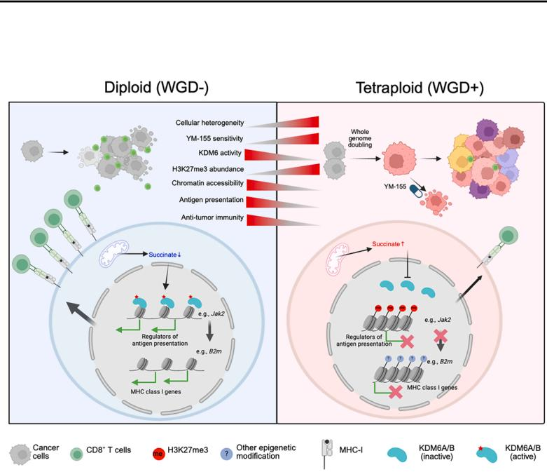
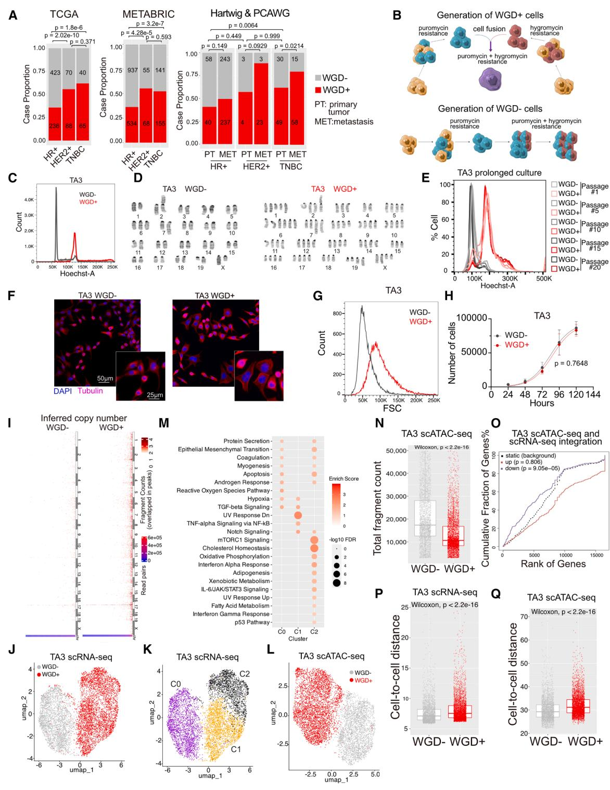
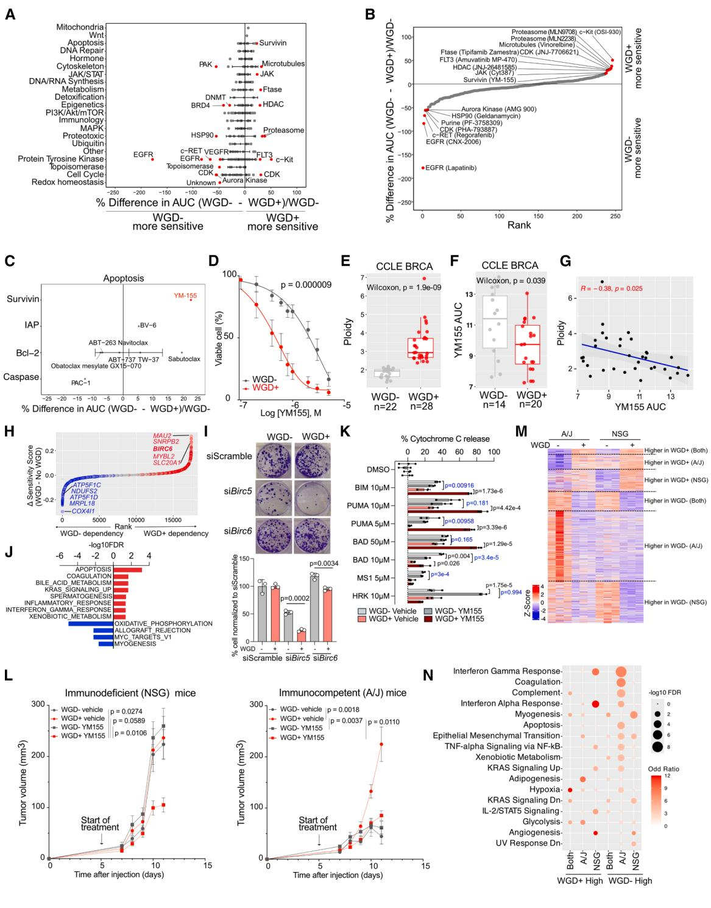

# Cancer Cell

# Whole-genome doubling drives immune evasion by silencing antigen presentation

Graphical abstract

# Authors

Pierre Foidart, Zheqi Li, Xinran Cai, ..., Henry W. Long, Judith Agudo, Kornelia Polyak

Correspondence kornelia_polyak@dfci.harvard.edu

# In brief

Foidart et al. reveal that whole-genome doubling (WGD) promotes immune suppression in breast cancer. WGD+ tumors have diminished expression of antigen presentation and reduced IFNγ response. Metabolic alterations in WGD+ tumors lead to lower KDM6 activity, causing higher H3K27me3 that represses transcriptional regulators of antigen presentation genes.

# Highlights

• Whole-genome doubling (WGD) is a driver of immune escape in breast cancer   
• Different mechanisms triggering WGD may lead to distinct tumor evolutionary paths   
• WGD+ cancer cells have reduced antigen presentation and response to IFNγ stimuli   
• WGD+ tumors have lower KDM6 activity causing higher H3K27me3 muting MHC regulators

# Article Whole-genome doubling drives immune evasion by silencing antigen presentation

Pierre Foidart,1,2,3,14 Zheqi Li, $^ { 1 , 2 , 3 , 1 4 }$ Xinran Cai, $^ { 1 , 2 , 3 , 1 4 }$ Marco Seehawer, $^ { 1 , 2 , 3 }$ Daniel D. Brown,4 Amatullah Tawawalla,1   
Pilar Baldominos,5,6 Salma Parvin, $^ { 1 , 2 , 3 }$ Jun Nishida, $^ { 1 , 2 , 3 }$ Ernesto Rojas-Jimenez, $^ { 1 , 2 , 3 }$ Triet M. Bui,1,2,3   
Benedetto Diciaccio,1,2,3 Rahul Kumar, $^ { 7 , 8 }$ Brent T. Schlegel, $^ { 7 , 8 }$ Marie-Anne Goyette, $^ { 1 , 2 , 3 }$ TashJae Scales,9 Pengze Yan,1,2,3   
Xintao Qiu,9 Rong Li,9 Yijia Jiang,9 Yingtian Xie,9 Mahmoud Aarabi, $^ { 1 0 , 1 1 }$ Xiao-Yun Huang,1 Laura E. Stevens,1,2,3   
Paloma Cejas,9 Lise Mangiante,12 Cristina Irene Sotomayor Vivas, $\blacktriangleleft$ Kathleen E. Houlahan, $\ L _ { 1 2 }$ Christina Curtis,12   
Steffi Oesterreich,7,8 Isaac S. Harris, $\mathtt { 1 3 }$ Anthony G. Letai, $^ { 1 , 2 , 3 }$ Adrian V. Lee, $^ { 4 , 7 , 8 }$ Henry W. Long,9 Judith Agudo,5,6   
and Kornelia Polyak1,2,3,15, \*   
1Department of Medical Oncology, Dana-Farber Cancer Institute, Boston, MA 02215, USA   
2Department of Medicine, Brigham and Women’s Hospital, Boston, MA 02115, USA   
3Department of Medicine, Harvard Medical School, Boston, MA 02115, USA   
4Institute for Precision Medicine, University of Pittsburgh, Pittsburgh, PA 15260, USA   
5Department of Cancer Immunology and Virology, Dana-Farber Cancer Institute, Boston, MA 02215, USA   
6Department of Immunology, Harvard Medical School, Boston, MA 02115, USA   
7Women’s Cancer Research Center, UPMC Hillman Cancer Center, Magee-Women’s Research Institute, Pittsburgh, PA 15260, USA   
8Department of Pharmacology and Chemical Biology, University of Pittsburgh, Pittsburgh, PA 15260, USA   
9Center for Functional Cancer Epigenetics, Dana-Farber Cancer Institute, Boston, MA 02215, USA   
10Departments of Pathology, and Obstetrics, Gynecology, and Reproductive Sciences, University of Pittsburgh School of Medicine,   
Pittsburgh, PA 15261, USA   
11UPMC Cytogenetics Laboratoires, UPMC Magee-Womens Hospital, Pittsburgh, PA 15213, USA   
12Stanford Cancer Institute, Stanford University School of Medicine, Stanford, CA 94305, USA   
13University of Rochester Medical Center, Rochester, NY 14642, USA   
14These authors contributed equally   
15Lead contact   
\*Correspondence: kornelia_polyak@dfci.harvard.edu   
https://doi.org/10.1016/j.ccell.2026.04.007

# SUMMARY

Whole-genome doubling (WGD) is a common yet poorly understood event associated with poor clinical outcomes. Here, we characterize mechanisms by which WGD drives tumor evolution, utilizing mouse mammary tumor models of WGD established through cell fusion. We find that WGD increases transcriptomic and epigenetic heterogeneity and identify the YM155 BIRC5 inhibitor as a compound specifically suppressing WGD $^ +$ tumors. WGD triggers immune evasion by escaping ${ \tt C D 8 } ^ { + }$ T cell responses, rendering WGD $^ +$ tumors more sensitive to anti-PD-L1. Through single-cell profiling, we discover that WGD+ cancer cells exhibit reduced antigen presentation and response to $\mathsf { I F N } \gamma ,$ , attributed to the epigenetic silencing of MHCI transcriptional regulators via elevated histone H3 lysine 27 trimethylation. Further investigations reveal decreased KDM6 activity and increased succinate levels in WGD $^ +$ tumors. PRC2 inhibition preferentially suppresses WGD $^ +$ tumor growth, enhances antigen presentation, and ${ \tt C D 8 } ^ { + }$ T cell infiltration. Our results underscore metabolic and epigenetic alterations as critical drivers of WGD-associated immune escape.

# INTRODUCTION

Whole-genome doubling (WGD) is a common initiating event in tumorigenesis leading to aneuploidy, already detected in preinvasive and premalignant lesions.1–3 Multiple mechanisms can lead to WGD, including mitotic perturbations, endoreduplication, and cell-to-cell fusion.4 Polyploid cells display genomic instability, which increases intratumor heterogeneity and accelerates cancer genome evolution.5 Chromosomal instability and the presence of tetraploid and hyperdiploid cancer cells are associated with treatment resistance,6–8 yet the underlying mechanisms are poorly understood.

Breast cancer is classified based on the expression of estrogen receptor (ER), progesterone receptor (PR), and human epidermal growth factor receptor 2 (HER2) into hormone receptor positive $\left( \mathsf { H R } + \right)$ , $\mathsf { H E R 2 + }$ , and triple-negative breast cancer (TNBC). While the availability of targeted therapies for $\mathsf { H R } +$ and $\mathsf { H E R 2 + }$ tumors improved clinical outcomes, treatment of TNBC

# Cancer Cell Article

  
Figure 1. Clinical relevance of WGD and an experimental model of WG

(A) Percentage of tumors identified as WGD- or ${ \mathsf { W G D } } +$ . Fisher’s exact test.   
(B) Schematic of WGD- and ${ \mathsf { W G D } } +$ cell generation.   
(C and D) Flow cytometry for DNA content (C) and karyotype (D) of TA3 model.   
(E) Flow cytometry of Hoechst33258-stained TA3 fusion WGD- and ${ \mathsf { W G D } } +$ cells at different passages.   
(F) Immunofluorescence for tubulin and DAPI. Scale bars are $5 0 ~ { \mu \mathrm { m } }$ and $2 5 \mu \mathrm { m }$ .   
(G) Flow cytometry for forward scatter of TA3 model.   
(H) Viable cell numbers at the indicated time points. Data are represented as mean $\pm$ SD, $n = 3$ per group. Comparison of logistic growth curve. Error bars represent $\pm \mathsf { S D }$ . Extra sum-of-squares F test.   
(I) Heatmap of copy number estimation based on the scATAC-seq data of TA3 model.

remains limited.9–11 We identified BET bromodomain inhibitors as candidate therapeutic agents in TNBC12 in combination with paclitaxel, CDK4/6 inhibitors, and anti-PD-L1.13,14 However, we observed rapid emergence of resistance, and that while all resistant cells were tetraploid, tetraploidy by itself did not confer resistance.15

Aneuploid cells in normal tissues elicit an immune response and are cleared by the immune system.16–19 In cancer, however, aneuploidy is thought to cause immune evasion,20,21 based on the correlation of aneuploidy with diminished immune infiltration in The Cancer Genome Atlas (TCGA).20–22 Similarly, pan-cancer analysis of TCGA shows an inverse correlation between WGD and estimates of tumor-infiltrating leukocytes.23 However, reports also suggest that tetraploidization and polyploidy lead to increased immunogenicity2 4 and aneuploidy-associated senescence sensitizes to NK cell-mediated killing.17,25 Thus, the mechanisms by which WGD promotes tumor evolution, including immune escape, remain poorly defined. To investigate this, we generated mouse mammary tumor cell line models of WGD and discovered a metabolic-epigenetic mechanism of WGD-associated immune evasion.

# RESULTS

# WGD in breast tumors and models of WGD

We investigated WGD in breast cancer by WGD calling26,27 or reanalyzing public genome sequencing data with known WGD status.22,28,29 WGD is more common in $\mathsf { H E R 2 + }$ tumors and TNBC than $\mathsf { H R } +$ tumors and is further increased in distant metastases (Figure 1A and S1A). WGD is more enriched in TP53- mutant compared to wild-type (WT) primary breast cancers across all subtypes (Figure S1B), but was associated with worse prognosis in TP53 WT cases (Figure S1C). Key fusogenic ligands ERVW1 and SLC1A5 had significantly higher expression in ${ \mathsf { W G D } } +$ tumors with WT but not mutant TP53 (Figure S1D), implying cell fusion as a route of WGD.

To dissect how WGD drives breast tumor evolution, we generated experimental models of WGD using mouse mammary tumor cell lines by somatic cell fusion (Figure 1B). Cell fusion and ploidy were confirmed by flow cytometry for DNA content (Figures 1C and S1E). Karyotyping showed nearly perfect doubling of the genome in the WGD $^ +$ cells in TA3 and 168fARN models (Figures 1D and S1F; Table S1) and confirmed nearly diploid parental TA3 karyotype (Figure 1D; Table S1), hypotetraploidy, and high aneuploidy of 168fARN and 67NR lines (Figures S1E and S1F; Table S1). The high baseline ploidy of 67NR cells may explain the limited shift in DNA content in the fusions, as a significant increase is likely not tolerated. Therefore, we primarily used the TA3 model, as it best reflects the euploid (2n, WGD-) and tetraploid (4n, WGD+) states. We confirmed the stability of WGD- and ${ \mathsf { W G D } } +$ by flow cytometry for DNA content during prolonged culture of the TA3 model (Figure 1E). Exome sequencing of parental TA3, 168fARN, and 67NR cells and their ${ \mathsf { W G D } } +$ derivatives revealed that most variants in WGD-cells were shared with their matched ${ \mathsf { W G D } } +$ counterparts (Figures S1G and S1H; Table S1). The limited number of unique variants in WGD- cells suggests that ${ \mathsf { W G D } } +$ derivatives are not likely to be a minor subclone of the WGD-population. All three cell lines are TP53 WT, and functional p53 was confirmed in TA3 and 168FARN WGDand ${ \mathsf { W G D } } +$ derivatives based on the robust induction of p21 by doxorubicin (Figure S1I). ${ \mathsf { W G D } } +$ TA3 and 168fARN cells were larger than their corresponding WGD- counterparts and had a single nucleus (Figures 1F, 1G, and S1J). The proliferation of WGD- and ${ \mathsf { W G D } } +$ cells was not significantly different in cell culture (Figures 1H and S1K).

To investigate the effect of WGD on cellular heterogeneity, we performed a duplexed single-cell RNA sequencing (scRNA-seq) and a single-cell assay for transposase-accessible chromatin (scATAC-seq) on the TA3 and 67NR WGDand ${ \mathsf { W G D } } +$ lines. The estimation of chromosomal copy number based on overlapped fragment counts in ATAC peaks in the TA3 model confirmed the diploid and tetraploid state of each cell within WGD- and ${ \mathsf { W G D } } +$ cells populations, respectively (Figure 1I), while the 67NR copy number prediction was less confident, likely due to high heterogeneity and pre-existing aneuploidy (Figure S2A).

Uniform manifold approximation and projection (UMAP) indicated transcriptional and epigenetic differences between WGD- and ${ \mathsf { W G D } } +$ cells (Figures 1J-1L and S2B-S2C). Hallmark signature enrichment analysis of scRNA-seq clusters identified different activated pathways in ${ \mathsf { W G D } } +$ compared to WGD-cells, including inflammatory response and metabolism (Figures 1M and S2D; Table S2). Fragment count in scATAC-seq data was significantly lower in ${ \mathsf { W G D } } +$ cells, suggesting more compact inactive chromatin is less accessible to transposase (Figures 1N and S2E; Table S2).

Genomic distribution of the differential ATAC peaks showed that most peaks lost in ${ \mathsf { W G D } } +$ cells were in promoters, while gained peaks were more common in distant intergenic regions and introns (Figure S2F), implying that WGD might lead to transcriptional repression. Integration of scATAC-seq and scRNAseq data demonstrated a significant positive correlation between mRNA and ATAC-based inferred gene activity in both models (Figure S2G). Binding and expression target analysis (BETA) of differential ATAC peaks showed that genes annotated to lost peaks in ${ \mathsf { W G D } } +$ cells were downregulated in both models, while ${ \mathsf { W G D } } +$ gained peaks’ association with upregulated genes was only significant in 67NR cells (Figures 1O and S2H). Accordingly, the majority of lost ATAC peaks were common between the

  
Figure 2. Small molecule screen and follow-up validation

(A and B) Differences in drug sensitivities between WGD- and ${ \mathsf { W G D } } +$ cells by pathways (A) and ordered by percent differences in AUC for target (B).   
(C) Differences in sensitivities of apoptosis-targeting agents, grouped by target.   
(D) Dose-response curves of YM155 in WGD- and ${ \mathsf { W G D } } +$ cells $\lceil n = 3$ per group). Extra sum-of-squares F test.   
(E) Estimated ploidy of breast cancer cell lines from CCLE.   
(F) DepMap PRISM screen YM155 AUC in WGD- and ${ \mathsf { W G D } } +$ breast cancer cell lines.   
(G) Scatterplot shows Pearson’s correlation between ploidy and YM155 AUC.   
(H) CRISPR screen hits ranked by differences in sensitivity scores between WGD- and WGD $^ +$ TNBC lines. Significantly different hits (FDR<0.05) are labeled in red and blue. Top 10 hits are indicated.   
$( \mathbb { I } )$ Representative images of colony formation assay of TA3 WGD- and ${ \mathsf { W G D } } +$ cells expressing Birc5 or Birc6 siRNAs (Top). Quantification of colony growth (bottom), $\boldsymbol { n } = 3 /$ condition. One-way ANOVA.

# Cancer Cell Article

two models; gained peaks and differentially expressed genes (DEGs) showed limited overlap (Figure S2I). Genes commonly upregulated in ${ \mathsf { W G D } } +$ cells were enriched in apoptosis and interferon signaling pathways, while downregulated genes were MYC targets (Figure S2J). Consistently, LISA prediction of transcriptional regulators of DEGs identified MYC, STAT5, and RELA (Figure S2K; Table S2). Calculating cell-to-cell distance as a measure of heterogeneity revealed significantly higher heterogeneity at both transcriptomic and chromatin levels among the ${ \mathsf { W G D } } +$ cells in both TA3 and 67NR models (Figures 1P, 1Q, S2L, and S2M).

# Small molecule inhibitor screen for WGD-targeting compounds

To assess the impact of WGD on therapeutic sensitivity, we performed a small molecule inhibitor (SMI) screen testing ${ \sim } 4 0 0$ compounds using the TA3 model (Table S3). Sensitivity of WGD- and ${ \mathsf { W G D } } +$ cells was comparable to most compounds, with a few exceptions. ${ \mathsf { W G D } } +$ cells were more resistant to several kinase inhibitors (e.g., AURKA and CHK1) but displayed augmented sensitivity to YM155 (Figures 2A–2C and S3A). Follow-up validation of selected hits revealed the most significant and reproducible differences in response to YM155 (Figures 2D and S3B). We confirmed the heightened sensitivity of ${ \mathsf { W G D } } +$ breast cancer lines to YM155 using the PRISM database30 and inferred WGD status from the Cancer Cell Line Encyclopedia (CCLE)31 (Figures 2E–2G). YM155 represses a series of the inhibitor of apoptosis (IAP) family proteins, with BIRC5 (survivin) being its major target.32 Immunoblot analysis showed lower BIRC5 in ${ \mathsf { W G D } } +$ compared to WGD-cells in the TA3 model (Figures S3C and S3D). BIRC5 transcript levels were also lower in ${ \mathsf { W G D } } +$ tumors in the TCGA TNBC cohort, but not in three other cohorts and the CCLE breast cancer lines (Figure S3E). Reanalysis of the DepMap 22Q4 CRISPR screen data identified BIRC6 as a top hit in ${ \mathsf { W G D } } +$ lines (Figure 2H; Table S3). We performed colony formation assays following the downregulation of Birc5 or Birc6 and observed more pronounced growth inhibition after Birc5 knockdown in TA3 ${ \mathsf { W G D } } +$ than in WGD cells, while Birc6 downregulation did not impair cell growth (Figures 2I and S3F). Accordingly, apoptosis was the top-enriched pathway in ${ \mathsf { W G D } } +$ cell line-specific CRISPR screen hits (Figure 2J). BH3 profiling3 3 of TA3 WGD- $^ { \prime + }$ cells in the presence and absence of YM155 revealed that ${ \mathsf { W G D } } +$ cells were more primed to apoptosis following YM155 treatment, but baseline sensitivity was not significantly different (Figure 2K).

To test sensitivity to YM155 in vivo, we injected cells into immunocompetent (A/J) or immunodeficient (NSG) mice. YM155 inhibited the growth of ${ \mathsf { W G D } } +$ but not WGD-tumors in both A/J and NSG mice (Figure 2L). Gene expression profiling revealed the repression of metabolic pathways, including cholesterol and insulin biosynthesis, by YM155 in WGD $^ +$ tumors in both strains (Figures 2M and S3G). We also discovered that ${ \mathsf { W G D } } +$ tumors grew much faster than WGD- ones in immunocompetent but not in immunodeficient mice (Figure 2L). WGDand ${ \mathsf { W G D } } +$ tumor RNA-seq profiles were more distinct in A/J than in NSG mice (Figure S3H). Pathway analysis of tumor transcriptomes revealed significant differences in immune-related pathways depending on mouse strain (Figure 2N; Table S3). Interferon signaling was enriched in WGD- high genes in A/J mice and in ${ \mathsf { W G D } } +$ tumors in NSG mice.

# Immune environments of WGD- and WGD $^ +$ tumors

We repeated the in vivo experiment using A/J and NSG mice without treatment, which again showed faster growth of ${ \mathsf { W G D } } +$ tumors in A/J but not in NSG mice (Figures 3A and S4A). Microscopic examination of tumors identified high levels of necrosis in WGD- tumors in A/J mice, while no differences were noted in NSG mice (Figures S4B and S4C). Flow cytometry for lymphoid and myeloid markers revealed that ${ \mathsf { W G D } } +$ tumors had significantly fewer $\mathtt { C D 4 5 ^ { + } }$ leukocytes and a pronounced decrease in $\mathtt { C D 3 ^ { + } }$ and ${ \tt C D 8 ^ { + } }$ T cells compared to WGD- tumors, with a decreased $\mathtt { C D 8 } ^ { + }$ T cell/Treg ratio (Figures 3B, S4D–S4F, and S5A). Relative frequencies of NK cells, macrophages, and dendritic cells were also lower in ${ \mathsf { W G D } } +$ tumors, while neutrophils showed the opposite pattern (Figure S5B). Immunofluorescence confirmed significantly fewer $\mathtt { C D 3 ^ { + } }$ and $\mathtt { C D 8 } ^ { + }$ T cells in WGD $^ +$ tumors (Figure 3C).

Repeat of these experiments in the 168fARN model showed similarly faster growth of ${ \mathsf { W G D } } +$ tumors (Figure S5C). Flow cytometry demonstrated reduced infiltration of $\mathtt { C D 3 ^ { + } }$ and $\scriptstyle { \mathtt { C D 8 } } ^ { + }$ T cells in ${ \mathsf { W G D } } +$ tumors (Figure S5D). To investigate whether different ways of achieving WGD might affect this phenotype, we derived TA3 ${ \mathsf { W G D } } +$ cells by inducing cytokinesis failure (CF) with cytochalasin D (Figures S5E–S5H). Tumor growth assays in A/J mice showed much faster growth and greater heterogeneity compared to the TA3 fusion model and no significant difference between CF WGD- and ${ \mathsf { W G D } } +$ tumors (Figure S5I). Flow cytometry for DNA content revealed a shift to 2n ploidy in a few ${ \mathsf { W G D } } +$ tumors, implying less stable genotypes (Figure S5J). Total leukocyte content was significantly lower in CF ${ \mathsf { W G D } } +$ tumors, and while there were no differences in total $\mathtt { C D 3 ^ { + } }$ and $\boldsymbol { \mathsf { C D 8 } } ^ { + }$ T cells, the $\mathtt { C D 8 } ^ { 

... [OUTPUT TRUNCATED - 92771 chars omitted out of 142771 total] ...

fixed in paraformaldehyde for 15 min. Afterward, the fixative was neutralized using a tris/glycine buffer. Cells were stained overnight with Hoechst33342 (Nuclei, Invitrogen) and anti-cytochrome c-Alexa Fluor 647 antibody (BioLegend). Prior to imaging, the stain solution was washed out using the BioTek 406EL plate washer. Fluorescent microscope images from the BH3 profiling plates were acquired using the IXM XLS high content widefield microscope (Molecular Devices) at the ICCB Longwood Screening Facility. The cytochrome c positive cells were quantified using the Multi-Wavelength Cell Scoring module in Metamorph software. Release of cytochrome c in response to the BIM and PUMA peptides indicate overall mitochondrial priming. In contrast, the release of cytochrome c in response to the BAD, HRK, MS1, FS1 peptides, and BH3 mimetics indicate specific anti-apoptotic dependencies. Combinations of BH3 mimetics were used to test co-dependencies. Release of cytochrome c in response to the BAD peptide and ABT-263 indicate BCL-2, BCL-XL, or Bcl-w dependency; to the HRK peptide, A-133, and A-115 indicate BCL-XL dependency; to ABT-199 indicates BCL-2 dependency; to the MS1 peptide and S63845 indicate MCL-1 dependency.

# Immunoblot analyses

Proteins were isolated using isolation buffer (1 mM EGTA, 1 mM EDTA, 150 mM NaCl, 20 mM Tris and $1 \%$ Triton X-) for 30 min on ice. Histones were isolated using EpiQuik Total Histone Extraction Kit (Epigentek). Protein concentration was measured using Pierce 660nm Protein Assay Reagent (Thermo Fisher) and equal amounts were loaded onto $4 \%$ Bis-Tris gradient gel (for survivin) or

# Cancer Cell Article

Tris- $10 \%$ Tricine (histone extracts) gels. Proteins were transferred onto PVDF membranes using wet blot devices and $1 \times$ transfer buffer containing $20 \%$ methanol for at $\mathfrak { g o v }$ for 2 h. Membranes were incubated with primary antibodies against Survivin (Cell Signaling Technology, 2808 1:1000, RRID:AB_2063948), beta-2 microglobolin (Life Technology, 701250, 1:1000, RRI-D:AB_2532441), tubulin (Millipore, T6199, 1:20000, RRID:AB_477583), H3K27me3 (Active Motif, 39155, 1:1000, RRID:AB_2561020), H3K27ac (abcam, ab4729, 1:1000, RRID:AB_2118291), H3K4me3 (Cell Signaling Technology, 9751, 1:1000, RRID:AB_2616028), H3K9me3 (abcam, ab8898, 1:1000, RRID:AB_306848) and H4K20me3 (abcam, ab9053, 1:1000, RRID:AB_306969) in $5 \%$ milk overnight and with secondary antibodies anti-ms HRP (Invitrogen, 62–6520, 1:10000, RRID:AB_2533947) or anti-rb HRP (Invitrogen, 65–6120, 1:10000, RRID:AB_88384) in TBST for 1 h. Signals were developed with Clarity Western ECL Solution (BioRad) on a Chemidoc MP (BioRad) device. For loading controls of histone, histone extracts were run on a $10 \%$ tricine gel and stained with InstantBlue Coomassie Protein Stain blue (abcam, ab119211) for $2 0 \mathrm { \ m i n }$ .

# Immunofluorescence and immunohistochemistry staining

Tissue FFPE sections were deparaffinized and antigen retrieval was performed using Target Retrieval Solution, $\mathsf { p H } 6$ (Agilent) for 40 min with a steamer. Slides were then blocked using $5 \%$ NGS in TBST for one hour and incubated with primary antibodies against CD3 (Abcam, ab11089, 1:100, RRID:AB_2889189), CD4 (Abcam, ab183685, 1:100, RRID:AB_2686917), CD8 (Cell Signaling Technology, #98941, 1:100, RRID:AB_2756376) and H3K27me3 (Cell Signaling Technology, #9733, 1:100, RRID:AB_2616029) in $5 \%$ NGS in TBST overnight in $4 ^ { \circ }$ and secondary antibodies (goat anti rb Alexa Fluor 647 (Invitrogen, A-21245, RRID:AB_2535813) and goat anti rb Alexa Fluor 555 (Invitrogen, A-21428, RRID:AB_141784) in $5 \%$ NGS in TBST for $^ { 2 \mathfrak { h } }$ in room temperature. Endogenous fluorescence was quenched using TrueVIEW Autofluorescence Quenching Kit (Vector Laboratories) for 5 min.

For immunohistochemistry staining, heat-induced antigen retrieval was carried out by placing sections in $1 0 ~ \mathsf { m M }$ sodium citrate buffer $\left( \mathsf { p H } \ 6 . 0 \right)$ at $\mathfrak { s } 5 ^ { \circ } \mathfrak { C }$ for $2 0 \ \mathsf { m i n }$ . Endogenous peroxidase activity was quenched by treating sections with $0 . 3 \%$ H2O2 for $3 0 \mathsf { m i n }$ . Sections were then blocked for $3 0 \mathsf { m i n }$ at room temperature using serum from the species in which the secondary antibody was raised, followed by overnight incubation with primary antibodies at $4 ^ { \circ } \mathsf { C }$ . On the following day, sections were incubated with components from the VECTASTAIN Elite ABC Kit (Vector Laboratories, #PK-6101). The HRP signal was visualized by incubating sections with a DAB substrate.

For all the experiments, images were taken with a Nikon ECLIPSE Ti2-E fluorescence microscope and QuPath software (RRID:SCR_018257) was used for image analysis and target protein quantification. For H3K27me3 quantification, nuclei H3K27me3 signal intensity was normalized to the cytoplasmic signal for background correction in each cell.

# Flow cytometry

Tumor tissues were smashed and digested for 60 min using digestion media ( $2 \%$ w/v collagenase IV, $2 \%$ w/v hyaluronidase and $2 \%$ w/v BSA in DMEM) at $3 7 ^ { \circ } \mathrm { C }$ in shaker for 1 h. Cell suspensions were filtered through a $5 0 0 \mu \mathrm { m }$ mesh, washed with PBS and frozen in $10 \%$ DMSO/FBS at $\mathtt { - 8 0 ^ { \circ } C }$ . For flow cytometry analysis, digested cells were first stained with Live/dead cell staining kit (Life Technology, L34957) and fixed using eBioscience Intracellular Fixation & Permeabilization Buffer (Thermo Fisher, 88-8824-00). Cells were then stained by two antibody panels (1:200) against lymphocyte and myeloid cell markers separately. The lymphocyte panel is a mixture of the following antibodies: CD45-FITC (eBioscience, 11-0451-82, RRID:AB_465050), MHC-II-eFluor450 (eBioscience, 48-5321-82, RRID:AB_1272204), CD3e-PE (BioLegend, 100206, RRID:AB_312663), CD49b-APC-Cy7 (BioLegend, 108920, RRI-D:AB_2561458), CD19-BV650 (BioLegend, 115541, RRID:AB_11204087), NK1.1-APC-Cy7(BioLegend, 108724, RRID:AB_830871), CD4-BV605 (BioLegend, 100547, RRID:AB_11125962), CD8a-BV711 (BioLegend, 100747, RRID:AB_11219594), γδTCR-PerCP-Cy5.5 (BioLegend, 118118, RRID:AB_10612756), CD69-PE/Cyanine7 (BioLegend, 104512, RRID:AB_493564), CD25-Alexa Fluor 700 (BioLegend, 102024, RRID:AB_493709) and FoxP3-APC (eBioscience, 17-5773-82, RRID:AB_469457). The myeloid marker panel includes CD11b-BV711 (BioLegend, 101241, RRID:AB_11218791), CD11c-BV605 (BioLegend, 117333, RRID:AB_11204262), F4-80-APC (BioLegend, 123116, RRID:AB_893481), Ly6C-PerCP-Cy5.5 (BioLegend, 128012, RRID:AB_1659241), Ly6G-APC-Cy7 (BioLegend, 127624, RRID:AB_10640819), CD103-PE/Cyanine7 (BioLegend, 121426, RRID:AB_2563691), PDCA-1-PE (eBioscience, 12-3172-81, RRID:AB_763421), CD80-BV650 (BioLegend, 104731, RRID:AB_11147759), CD86-Alexa Fluor 700 (BioLegend, 105024, RRID:AB_493721) as well as the CD45-FITC and MHC-II-eFluor450 listed above. Flow cytometry was performed using LSRFortessa High-Parameter Flow Cytometer (BD, RRID:SCR_025285) after channel compensation. Gating strategies are shown in Figures S4D–S4F.

For in vitro $| \mathsf { F N } \gamma$ treatment experiments, cells were treated with different doses of murine IFNγ (0, 0.05, 0.1, 0.2, 0.5, or 1 ng/mL) for $1 6 \mathsf { h }$ and stained with Live/dead cell staining kit (Life Technology, L34957) and PE anti-mouse β2-microglobulin (Biolegend, 154504, RRID:AB_2721340) and fixed with $2 \%$ PFA for $1 0 \mathrm { \ m i n }$ . Flow cytometry for MHC makers was performed $^ { 2 4 \mathrm { ~ h ~ } }$ later.

# Cytokine array

Snap-frozen tumor tissue was mechanically homogenized in $1 \%$ Triton $\mathsf { X } -$ in PBS with protease and phosphorate inhibitors and subject to one freeze-thaw cycles. Supernatant was collected after centrifuge. For each experimental condition protein concentration in supernatant from each individual tumor was determined using Pierce BCA Protein Assay Reagent (Thermo Fisher) and then $2 0 0 { \mu \ g }$ protein evenly mixed from each sample from the sample group was used for cytokine quantification. Cytokine levels were determined with Proteome Profiler Mouse XL Cytokine Array (R&D Systems) on a Chemidoc MP (BioRad) device following manufacturer protocol. ImageJ was used for protein amount quantification.

# KDM6 and PRC2 enzymatic activity assay

ELISA assays were conducted following the manufacture protocol using either KDM6A/B (Abcam, ab156910) or PRC2 (BPS BioScience, #52009) activity kits. Briefly, 10-20mg snap-frozen tumor tissue was mechanically homogenized in $1 5 0 \mu \ L 1 \%$ Triton X- in PBS with protease and phosphorate inhibitors and subject to one freeze-thaw cycle. Supernatant was collected after centrifuge. $2 0 \mu \ L$ tumor lysates from were used for ELISA input and the OD450 values were normalized to input tumor weight as normalized RLU.

# Alpha-ketoglutarate and succinate measurement

Snap frozen tumor tissues (10-20mg) were homogenized and lysed in $1 5 0 \mu \mathrm { L P B S } + 1 \%$ Triton X-100 with protease inhibitors. After one freeze-thaw cycle, $2 0 ~ \mu \iota$ tumor lysate was used for the relevant assays. For metabolites measurement in TA3 tumor of Figure 7Q, alpha ketoglutarate kit (Sigma-Aldrich MAK054) and succinate kit (Sigma-Aldrich MAK184) were used, and metabolite abundance were determined by fluorescent and colorimetric assays respectively. For metabolites measurement in 168fARN and TA3 cytokinesis failure models conducted later, alpha ketoglutarate kit (Abcam, ab83431) and succinate kit (Abcam 204718) were used due to the discontinuation of the Sigma-Aldrich kits, and metabolite abundance were determined by colorimetric assays following the manufactural protocol and raw readouts were further normalized to the initial tissue amount for each metabolite.

# FACETS-based estimation of tumor purity and ploidy from whole-exome sequencing

Genomic DNA was extracted from patient-derived organoids (PDOs) and matched peripheral blood samples using DNeasy Blood & Tissue Kits by Qiagen. Samples were submitted to the UPMC Genome Center (UGC) for whole-exome sequencing (WES) library preparation and paired-end sequencing using the Roche KAPA HyperPlus Kit (Cat. #09075810001). For each sample, 500 ng of genomic DNA was enzymatically fragmented, followed by end repair, A-tailing, adapter ligation, and PCR amplification. Library quality was assessed using AATI Fragment Analyzer. Targeted exonic regions were captured using the IDT xGen Exome Research Panel v1.0 (Cat. #1056114) with xGen Universal Blockers (Cat. #1075474), following the Roche KAPA HyperCap Workflow $\mathtt { v 3 . 0 }$ , per the manufacturer’s protocol. Prepared libraries, with an average insert size of approximately 400 bp, were quantified using the KAPA qPCR quantification kit (Roche) on a LightCycler 480 (Roche). Libraries were normalized and pooled according to Illumina guidelines. Sequencing was performed on the Illumina NovaSeq 6000 platform, generating 151 bp paired end reads. Raw base call (BCL) files generated on the NovaSeq 6000 were converted to sample-level FASTQ files using Illumina’s bcl2fastq conversion software (v3.0.3– v0.11.9). Average sequencing depth ranged from $2 0 \times$ to $3 1 8 \times$ for PDO samples and from $5 1 \times$ to $9 7 \times$ for matched blood samples.

Bioinformatics analysis began with preprocessing of paired-end raw reads (\*.fastq.gz) using FastQC (https://github.com/sandrews/FastQC) (v0.11.7) for quality assessment, Trim Galore (https://github.com/FelixKrueger/TrimGalore) (v 0.6.10) for adapter and low-quality base trimming, and MultiQC $( \mathsf { v } 1 . 1 9 ) ^ { 7 8 }$ for summarizing quality control metrics. Reads with low quality score and adapter sequences were removed. High-quality reads were then aligned to the human reference genome (hg38) using the Burrows–Wheeler Aligner (BWA-MEM72 v0.7.17). Aligned reads were sorted and indexed using SAMtools73 (v1.9). The resulting sorted BAM files were used to generate snp_pileup.gz files via the snp-pileup-wrapper.R script (https://github.com/mskcc/ facets-suite/tree/master). Tumor purity and ploidy estimation were performed using FACETS74 (v0.6.2), with the segmentation critical value (cval) set to 150.

# Patient-derived organoid flow cytometry

PDOs were plated in $4 0 \mu \ L$ Cultrex domes and cultured until near- $100 \%$ confluency. For ploidy analysis, PDOs were dissociated to single cells with TrypLE, fixed in 70%EtOH at $4 ^ { \circ } \mathsf { C }$ for $^ { 1 \mathrm { ~ h ~ } }$ , washed with DPBS, and stained with $1 0 \mu \ g / \ m L$ Hoechst33342 (Life Technologies, #H3570) in $0 . 1 \%$ Triton X-100 PBS. Flow cytometry performed on BD LSR Fortessa II with the 355_379_28 filter.

For HLA analysis, PDOs were treated with $1 0 \mathrm { n g / m L }$ Interferon $\gamma$ (Millipore Sigma I17001-100UG) or vehicle for $^ { 7 2 \mathrm { ~ h ~ } }$ . PDOs were dissociated to single cells with TrypLE, stained with APC anti-human HLA-A/B/C (BioLegend, #311410; RRID: AB_314879) and FITC anti-human $\beta 2$ -microglobulin (BioLegend, #316304; RRID: AB_492837), both at $5 ~ { \mu \mathrm { L } } / 1 0 0 { \mu \mathrm { L } }$ , fixed with the eBioscience Foxp3/Transcription Factor Fixation/Permeabilization Concentrate and Diluent (Thermo Fisher Scientific, #00-5521-00) according to manufacturer, and ran on a BD LSR Fortessa I with the 488_515_30 and 628_670_30 filters. All flow cytometry was performed in the UPMC Hillman Cytometry Facility.

# Generation and analyses of scRNA-seq data

Samples from tumor tissues were prepared as described for flow cytometry. To removed dead cells and debris Percoll (Sigma #P4937-500ML) purification was performed. Cell pellets after dead cell/debris removal were resuspended in $0 . 0 4 \%$ UltraPure BSA (Sigma-Aldrich) in PBS and immediately processed for library preps with DFCI Translational Immunogenomics Lab (TIGL). Gene expression library preparation was conducted using $1 0 \times$ Genomics ChromiumTM instrument $1 0 \times$ Genomics) according to the manufacturer’s recommendations using Chromium Next GEM Single Cell 5’ HT Kit v2 ( $1 0 \times$ Genomics). Quality controls for amplified cDNA libraries and final sequencing libraries were performed using Bioanalyzer High Sensitivity DNA Kit (Agilent). Equimolar ratios of libraries were sequenced on an Illumina NovaSeq 6000 (Illumina, RRID:SCR_016387) targeting 2000 reads per cell using 150bp read pairs per library at the Dana-Farber Cancer Institute Molecular Biology Core Facilities. Raw data was processed using CellRanger (RRID:SCR_023221) with bcltofastq function to obtain fastq files for each sample. Files were further processed using Cell Ranger Count 7.0.1 to obtain counts after aligning with mouse mm10 genome assembly. H5 files were then processed in R using Seurat package. Low quality reads were removed according to following criteria: nCount_RNA $> 1 0 0 0 \ \delta $ & nFeature_RNA $< 1 0 0 0 \ \&$

# Cancer Cell Article

percent.mt $< 2 0$ . Percentage of ribosomal reads $\mathtt { < } 4 0$ and log10 genes per UM ${ > } 0 . 8$ . For scMultiomic analysis, cells were filtered by both criterions of scRNA-seq and scATAC-seq. Final evaluated cell numbers in each sample are summarized in Table S4. Normalization was performed using LogNormalize followed by SCTransform regressing ribosomal percentage, mitochondrial percentage, nCount_RNA and nFeature_RNA. Clustering and subclustering was performed using with the top 30 principal components. Next, cluster were manually annotated using gene.module.scores with specific marker genes. For further characterization cluster ‘tumor cells’ and ‘non-tumor cells’ were first subset. ‘Non-tumor cells’ were then subset into cluster: ‘fibroblast’, ‘endothelial cells’, ‘T/NK cells’, or ‘myeloid cells’. Within each subset cells were again annotated using selected marker genes and gene.module.scores and scores were plotted according to each genotype. UMAP visualization was performed using ‘scCustomize’ package (RRID:SCR_024675). Neighborhood analysis was performed using the ‘‘miloR’’ package. Regulator analysis was carried out using the ‘‘SCENIC’’ package (RRID:SCR_017247) and cell-cell communication analysis were performed using the ‘CellChat’ package (RRID:SCR_021946). Interaction corsstalk strength was selected for downstream differential analysis in each cell type between WGD- and WGD $^ +$ tumors. The ProjecTILs package (RRID_ RRID:SCR_026854) was used to infer T cell states to a published mouse T cell atlas.39 For evaluation of MDSC signature in neutrophils, module score function was used to calculate the enrichment level of a previous reported MDSC signature in breast tumors.36 For integration of RNA-seq and ChIP-seq, BETA (RRID:SCR_005396) was performed as previously described.40 Briefly, differentially expressed (DE) genes were first computed using DESeq2 $\left( \mathsf { R R I D : S C R \_ 0 1 5 6 8 7 } \right) ^ { 6 1 }$ and used as one of the inputs. BETA basic modules were used to compute the statistical associations between DE genes and DB peaks using $1 0 0 \mathsf { k b }$ as the ranges to link gene TSS to each peak. $p$ values were derived using one-tailed Kolmogorov-Smirnov test for up-regulated and down-regulated genes respectively.

# Generation and analyses of scATAC-seq data

Dissociated viable tumor cells were used for $1 0 \times$ Chromium Single Cell ATAC library preparation. The libraries were sequenced separately on the NovaSeq 6000 (Illumina) system (NovaSeq Control Software $\mathsf { v } . 1 . 7 . 0$ and v.1.7.5). Single-cell ATAC-seq data were processed using the Cell Ranger ATAC 2.0 pipeline, which included sample demultiplexing, barcode processing, read alignment to the $\mathsf { m m } 1 0$ reference genome, and open chromatin peak quantifications. Single Cell Multiome ATAC $^ +$ Gene Expression data were preprocessed using the Cell Ranger ARC pipeline ARC 2.0.0, which included sample demultiplexing, barcode processing, read alignment to the $\mathsf { m m } 1 0$ reference genome, gene expression and open chromatin peak quantifications. For downstream analysis of scATAC-seq, we followed the instruction of ‘‘Signac’’ package (RRID:SCR_021158). Cells were prefiltered by $3 0 0 0 { < }$ fragment counts $< 5 0 0 0 0$ , FRiP score ${ > } 0 . 1$ , fraction of blacklist region $< 0 , 1$ , nucleosome signa $^ { < 4 }$ and TSS enrichment score $^ { > 2 }$ . For scMultiomic analysis, cells were filtered by both criterions of scRNA-seq and scATAC-seq. Final evaluated cell numbers in each sample are summarized in Table S4. For data normalization, term frequency–inverse document frequency (TF-IDF) normalization was applied to the filtered peak-by-cell matrix to account for sequencing depth and feature frequency. Dimensionality reduction was performed using singular value decomposition (SVD) to compute latent semantic indexing (LSI) components. Each cell were subjected to lsi dimension reduction from 2 to 30, and then intergrated using the FindIntegrationAnchors function to further reduce the batch effects. Gene activity score was inferred by scATAC-seq data using GeneActivity fucntion to examine marker gene expression and determine cell types of each cluster. The genomic track view of targeted gene loci was visualized using ‘‘CoveragePlot’’ function. For copy number inferrence, QuickATAC (Github link: https://github.com/AllenWLynch/QuickATAC) was used to compute a count matrix for peaks at a 1 bp resolution for each cell. The maximum number of overlapping fragments at the same base pair within each peak is used to determine the lower limit of the absolute copy number. Following this, k-means clustering is employed to group the cells based on these estimated lower limits. A heatmap is then generated to visualize the resulting clusters. Briefly, BAM files were filtered using ‘‘mapping_quality $\geq 3 0$ and template_length $< 1 0 0 0$ ,’’ and barcodes were further filtered to include only those with FRiP(Fraction of Reads in Peaks) $\geq 0 . 4$ and at least 10,000 fragments per barcode. Mapping_quality (MAPQ) is a score assigned by the aligner to indicate how confident it is that a read is correctly mapped to its location in the reference genome. MAPQ $3 0 \to \sim 1$ in 1000 chance of being misaligned. Template_length (also known as insert size or TLEN field in SAM) is the length of the DNA fragment represented by a paired-end read— i.e., the distance between the start of the forward and reverse reads. Keep only read pairs where the inferred insert size is less than 1000 bp, excluding unusually long fragments that may indicate mapping artifacts, chimeric reads, or structural variants.

# RNA-seq data generation and analyses

For bulk RNA-seq analysis from tumors, total RNA was extracted from snap frozen tumors using Qiagen RNeasy Mini kit. RNA-seq library preparation and sequencing were performed by Azenta RNA-seq service with 15–30 million reads per sample. RNA-seq data was analyzed using the VIPER pipeline.79 Briefly, reads were aligned using STAR (RRID:SCR_004463) to mm10 mouse genome. Genes with 0 counts in all samples were excluded and remaining counts were normalized via log2 TMM transformation to counts per million (log2 (TMM-CPM $+ 1$ )) from edgeR (RRID:SCR_012802) 66 for further processing. PCA plots were conducted using edgeR package, heatmaps were visualized using ‘ComplexHeatmap’ package (RRID:SCR_017270). For differential expression analyses DEseq261 was performed using different factor levels according to the experimental design. Enrichment scores of different pathways were calculated using ‘gsva’ package (RRID:SCR_021058). Immune and stromal scores were calculated using ‘ESTIMATE’ package.

# Analyses of public gene expression data

Whole genome-doubling in TCGA (RRID:SCR_003193) and CCLE (RRID:SCR_013836) datasets were called using the ‘absolute’ package following instructions by Quinton et al.23 WGD in METABRIC was called using the calculate_fraction_cna function from the facetsSuite R package (v2.0.8) with the ASCAT (RRID:SCR_016868) copy number profiles and ploidy from Pereira et al.80 WGD calling in Hartwig and PCAWG cohorts were directly downloaded from prior publication.29 TCGA RNA-seq reads were reprocessed using Salmon v0.14.1 (RRID:SCR_017036) 81 and Log2 $( \mathsf { T P M } + 1 )$ values were used. For the METABRIC dataset, normalized probe intensity values were obtained from Synapse (Syn1688369). For genes with multiple probes, probes with the highest interquartile range (IQR) were selected to represent the gene. For tumor subtype classification in both cohorts, clinical annotation files containing IHC results for ER, PR, and HER2 were used. Tumors were classified as $\mathsf { H } \mathsf { R } ^ { + }$ if they were positive for either ER or PR but negative for HER2. ${ \mathsf { H E R } } { 2 } ^ { + }$ tumors were defined by positive HER2 status, regardless of ER or PR expression. TNBC tumors were defined as negative for all three markers $( \mathsf { E } \mathsf { R } ^ { - }$ , $\mathsf { P } \mathsf { R } ^ { - }$ , and HER2- ). ‘ISOPure’ package was used to deconvolute cancer cell portion transcriptomic data and ‘gsva’ package was further used to calculate the enrichment score of different antigen processing and presentation signatures. Immune infiltration scores were calculated using ‘ESTIMATE’ package. For cell line analysis, YM-155 sensitivity scores were downloaded from Depmap portal (RRID:SCR_017655) using the CTRP:417979 screen results, taking AUC (CTD $\scriptstyle { \hat { 2 } }$ ) as the measurement. CRISPR gene dependency scores were taken from the DepMap Public 22Q4 screen. TCGA scA-TAC-seq raw data were obtained from dbGaP phs000178.v11.p8 with legitimate approval of controlled access. Raw fastq files of 6 basal tumors were reprocessed using the Cell Ranger ATAC 2.0 pipeline, which included sample demultiplexing, barcode processing, read alignment to the hg19 reference genome, and open chromatin peak quantifications. Cancer cells were extracted based on epithelial marker expression for downstream analysis. For paired bone metastases scRNA-seq analysis, raw count matrix was downloaded from GEO: GSE190772. Data were processed using Seurat following the filter and cell type annotation from the original publication.38,82 4617 and 5439 cells from BoM1 and BoM2 were analyzed. For data analysis of the FUSCC TNBC cohort,54 RNA-seq data were downloaded from https://www.biosino.org/node/project/detail/OEP000155. WGD status was classified using the cutoff of predicted ploidy of 2.7 as defined in the original publication. For random effect meta-analysis, we calculated the standardized effect size (Cohen’s d) and its corresponding standard error (SE) based on the mean and standard deviation of the two groups in each cohort and their corresponding subsets. These cohort-specific effect sizes were then combined using a random-effects meta-analysis implemented in the metafor R package, with between-study variance estimated using the restricted maximum likelihood (REML) method.

# H3K27me3 CUT&Run

Tumors were collected and digested as described before for flow cytometry. Single cell solutions were stained with Live/dead cell staining kit (Life Technology, L34957), anti-CD45-FITC (eBioscience, 11-0451-82, RRID:AB_465050) and anti-EpCAM (BioLegend 118214, RRID:AB_1134102) and sorted for live cells/CD45- /EpCAM+ cells. Approximately 100,000 cells were used to perform Cut&Run using CUTANA ChIC/CUT&RUN Kit Version 4 (Epicypher, 14–1048) according to manufacturer’s protocol. Cell permeabilization was performed with $0 . 0 0 5 \%$ digitonin and anti-H3K27me3 antibody (Active Motif, 39155, RRID:AB_2561020) was used for targeted capture. Cut&Run libraries were prepared using IDT xGen DNA library prep reagents on a Beckman Coulter Biomek i7 liquid handling platform from approximately 1ng of DNA with 14 cycles of PCR amplification according to manufacturer’s protocol. Finished sequencing libraries were quantified by Qubit fluorometer and Agilent TapeStation 2200. Library pooling and indexing was evaluated with shallow sequencing on an Illumina NovaSeq X Plus (RRID:SCR_024568). Subsequently, libraries were sequenced on an Illumina NovaSeq X Plus targeting 20 million 150bp read pairs by the Molecular Biology Core facilities of Dana-Farber Cancer Institute. Data analysis was performed using the nf-core/cutandrun pipeline version 3.2.2. Briefly, reads were aligned using Bowtie2 (RRID:SCR_016368) to $\mathsf { m m } 1 0$ and counts were normalized to CPM. Peak calling was done using SEACR in -stringent mode. Consensus peaks were generated by merging peaks from all samples and featureCounts was used to count reads within consensus peaks from each bam file using –countReadPairs -M -O mode. Count matrix was used for differential abundance calculation using limma with TMM normalization and peak annotation was done using Chipseeker (RRID:SCR_021322). Differential pathway analysis was performed with ChipEnrich in broadenrich 5kb mode. Motif enrichment analysis was performed using MEME Suite (RRID:SCR_001783) using Hocomoco mouse database V11 (RRID:SCR_005409).

# Whole exome sequencing

Genomic DNA from cell lines were extracted using DNeasy Blood & Tissue Kits. gDNA was fragmented to 200bp on a Covaris R230 instrument according to manufacturer’s protocol. Libraries were prepared using IDT xGEN 2 S Plus DNA reagents on a Beckman Coulter Biomek i7 liquid handling platform from approximately 200ng of DNA according to manufacturer’s protocol with 14 cycles of PCR amplification. Finished libraries were quantified by Qubit fluorometer and fragment size distribution was evaluated by Agilent TapeStation 4200. Libraries were pooled together for target enrichment using Twist Mouse Exome Panel reagents and hybrid capture was performed with a 16-h hybridization incubation using a custom probe panel according to manufacturer’s protocol. Post-capture library pools were quantified by Qubit fluorometer and Agilent TapeStation 4200. Library pools were further evaluated for quality and pool balance with shallow sequencing on an Illumina MiSeq. Subsequently, libraries were sequenced on an Illumina NovaSeq 6000 with paired-end 150bp reads by the Molecular Biology Core Facilities at Dana-Farber Cancer Institute.

Sequenced reads (FASTQ files) were aligned to mm10 version of human genome with BWA-MEM v.0.7.15 and preprocessed following GATK best practices.83 The quality of alignment and potential sample contamination was evaluated with the following

# Cancer Cell Article

software tools FastQC, Picard, and FastQ-Screen. Short nucleotide variants (point mutations and indels) were called using GATK Mutect2 using a ‘‘panel of normals’’ based on samples from the 1000 Genomes Project and provided in the Broad Institute’s public data repository. Identified variants were annotated with Ensembl Variant Effect Predictor75 (version 115.2) and transformed into MAF files with the vcf2maf script. The variant calls were further annotated with OncoKB using the oncokb-annotator python package.

# QUANTIFICATION AND STATISTICAL ANALYSIS

# Statistical analyses

Statistical test was conducted using GraphPad PRISM v9 (RRID:SCR_002798) or an embedded test in the ‘‘ggpubr’’ package (RRID:SCR_021139) in R v4.3.1 (RRID:SCR_001905). Normal distribution was first estimated using the Shapiro-Wilk test. Non-parametric tests were used, should data for matched comparisons did not pass the test. Non-paired, two-sided t test or Mann-Whitney U test was used for single comparisons. One-way ANOVA corrected for multiple comparisons or the Kruskal-Wallis test was used for multi-group comparisons. All tests were performed with a $9 5 \%$ confidence interval. $p$ -values are indicated for each experiment.