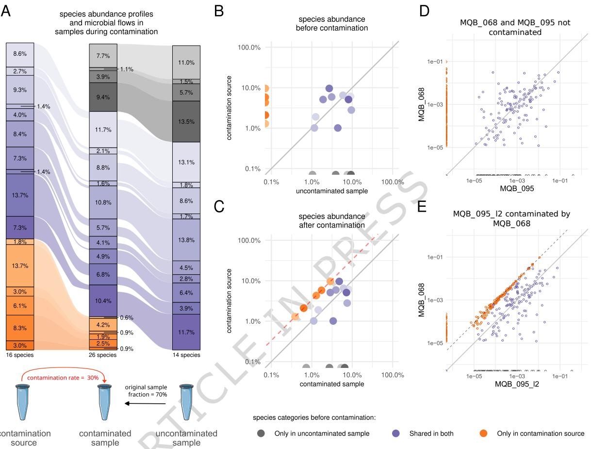
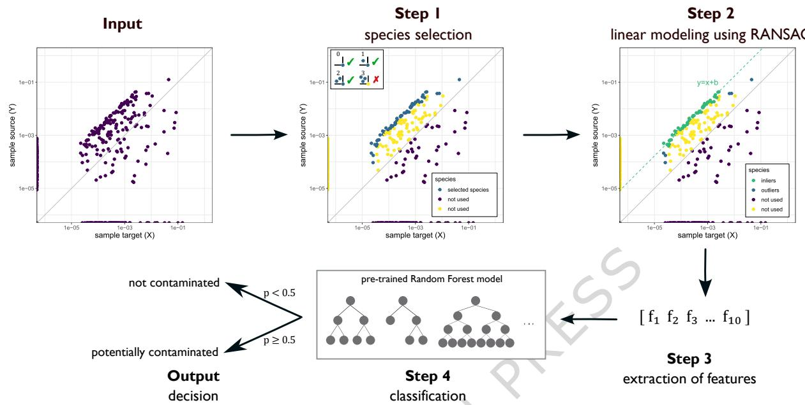
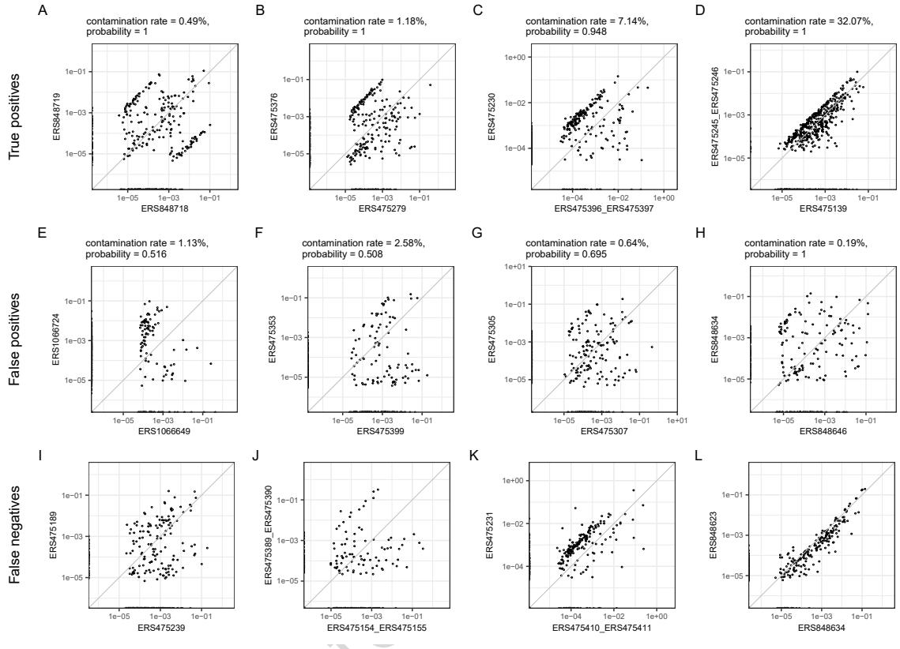
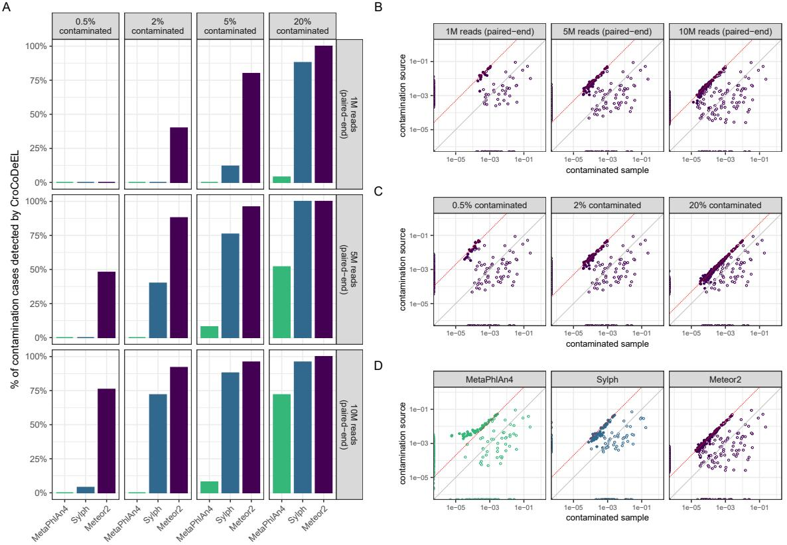
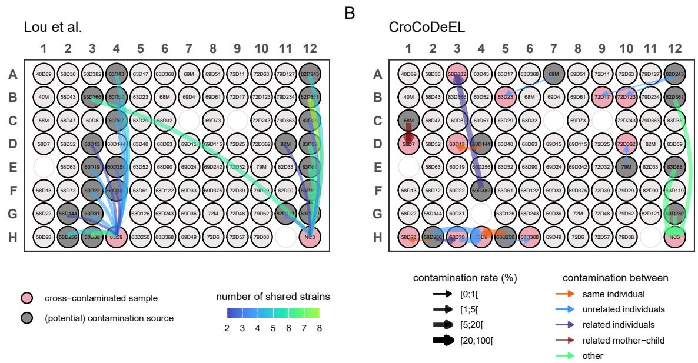
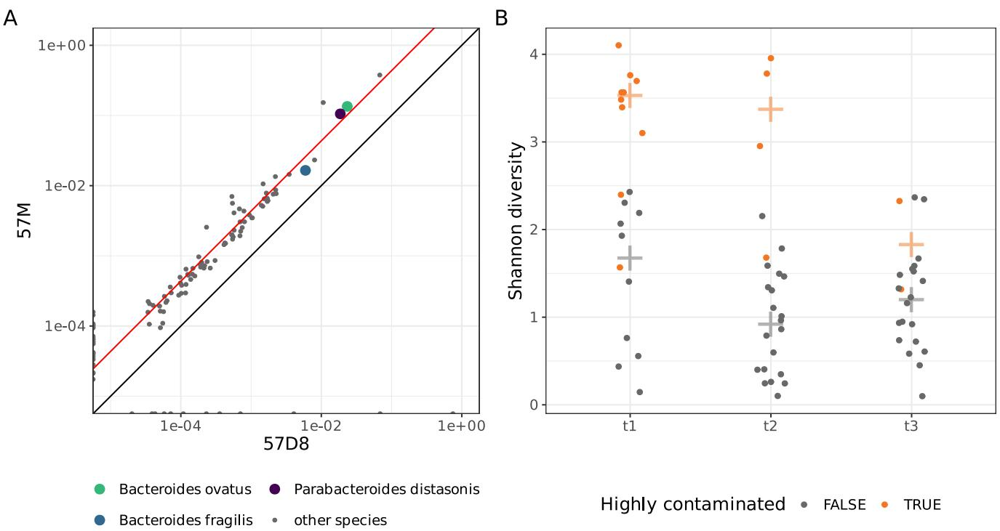
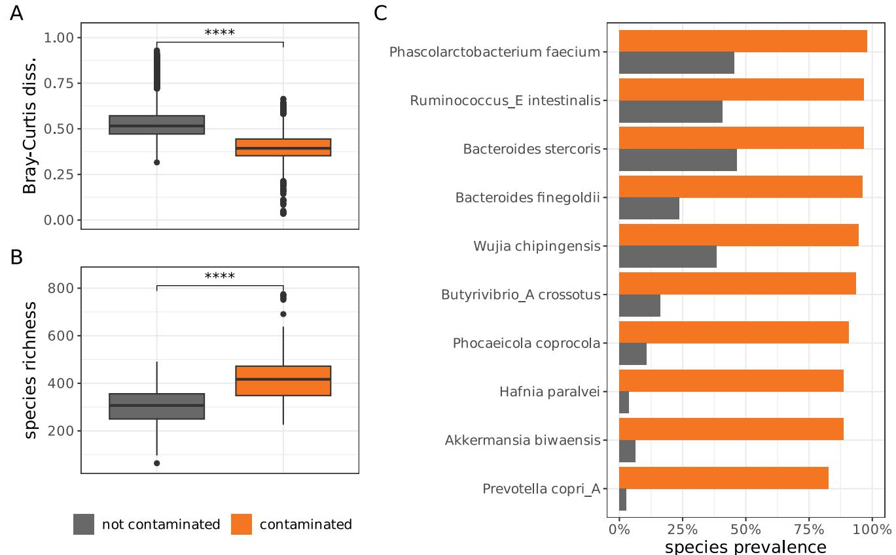

# Artidle in Press

# CroCoDeEL: accurate control-free detection of cross-sample contamination in metagenomic data

# Lindsay Goulet, Florian Plaza Onate, Alexandre Famechon, Benoit Quinquis, Eugeni Belda, Edi Prifti, Emmanuelle Le Chatelier & Guillaume Gautreau

We are providing an unedited version of this manuscript to give early access to its findings. Before final publication, the manuscript will undergo further editing. Please note there may be errors present which affect the content,and all legal disclaimers apply.

If this paper is publishing under a Transparent Peer Review model then Peer Review reports will publish with the final article.

CroCoDeEL: accurate control-free detection of cross-sample contamination in metagenomic data

Lindsay Goulet1t， Florian Plaza Onate $\cdot ^ { 1 }$ t， Alexandre Famechon $\cdot ^ { 1 }$ ，Benoit Quinquis $^ { 1 }$ ，Eugeni Belda $^ { 2 , 3 }$ ，EdiPrifti $^ { 2 , 3 }$ ，Emmanuelle Le Chatelier1\*， Guillaume Gautreau $^ { 1 , 4 }$ \*

$^ { 1 }$ Université Paris-Saclay, INRAE, MGP, F-78350, Jouy-en-Josas, France.   
$^ 2$ Unité de Modelisation Mathématique et Informatique des Systemes   
Complexes, UMMISCO, Sorbonne Université, IRD, F-93143, Bondy, France.   
$^ 3$ Nutrition and Obesities : Systemic Approaches, NutriOmics, Research Unit, Sorbonne Université, INSERM, 75013, Paris, France. $^ 4$ Université Paris-Saclay, INRAE, MaIAGE, 78350, Jouy-en-Josas, France. y

\*Corresponding author(s). E-mail(s): emmanuelle.lechatelier@inrae.fr; guillaume.gautreau@inrae.fr; tThese authors contributed equally to this work.

# Abstract

Metagenomic sequencing provides insights into microbial communities,but it can be compromised by technical biases,including cross-sample contamination.This phenomenon arises when microbial content is inadvertently exchanged among concurrently processed samples,distorting microbial profiles and compromising the reliability of metagenomic data and downstream analyses.Existing detection methods rely on negative controls,which are insufficiently used and do not detect cross-contamination within non-control samples.Meanwhile,strainlevel bioinformatics approaches do not distinguish contamination from natural strain sharing and lack sensitivity. To fill this gap,we introduce CroCoDeEL,a decision-support tool for detecting and quantifying cross-sample contamination. Leveraging linear modeling and a pre-trained supervised model, CroCoDeEL identifies specific contamination patterns in species abundance profiles.It requires no negative controls or prior knowledge of sample processing positions,offering improved accuracy and versatility. Benchmarks across three public datasets demonstrate that CroCoDeEL can detect contaminated samples and identify their contamination sources,even at low rates $( \mathrm { i 0 . 1 \% } )$ ， provided sufficient sequencing depth.Application of CroCoDeEL to several existing studies reveals previously undetected contamination.

Keywords:Metagenomics,Quality control, Cross-sample Contamination, Supervised classification

# Introduction

Shotgun metagenomic sequencing has revolutionized microbiology by allowing indepth characterization of microbial communities without prior cultivation in the lab. While being powerful, this technique is subject to technical and experimental biases at different steps, including sample collection and storage, DNA extraction, sequencing and bioinformatics processing [1]. One of these biases is contamination,which refers to the unintended presence in a sample of DNA from sources other than the biological material under investigation. Two types of contamination have been described: external contamination and cross-sample contamination [2, 3].

External contamination can arise from the sampling environment, laboratory surfaces,DNA extraction kits, or other reagents[2, 4]. Cross-sample contamination, or wel-to-well leakage, refers to the accidental transfer of material (the "splashome” [5]) between samples processed together. This can be caused by human error or robotic mishaps, such as reusing pipette tips, pipetting leakage, micro-droplet formation when sealing plates, or splashing during agitation. Such contamination often occurs between adjacent wels and is more frequent when low and high-biomass samples are processed together [6, 7]. Index hopping during sequencing can also cause reads to be assigned to the wrong sample in multiplexed libraries [8].

The use of 96-well plates to maximize throughput increases cross-contamination risk due to minimal physical separation between samples. Mitigation strategies include using plates with individual microtubes [9],manual handling instead of robotic processing and separating samples by biomass level [7]. To prevent index hopping, using Unique Dual Index (UDI) sequencing adapters is recommended [10]. Even with precautions, cross-sample contamination can still occur [3]. Yet,this phenomenon is often overlooked by lab staff and data analysts, jeopardizing the reliability of study results. If not detected and addressed, it can bias findings by introducing false microbial species, misidentifying shared strains [7], reducing statistical power,and overestimating alpha diversity and richness [11].

The most common detection approach is to include negative controls (blanks) during laboratory processing [2, 9]. While controls are an essential component of good practice in microbiome research and are efective for identifying external contamination,they have inherent limitations for detecting cross-sample contamination,as they cannot reveal events occurring exclusively between genuine (i.e.， non-control) samples.In addition,contamination events distant from controls may remain undetected [7]. Strategically placing multiple negative controls across plates can improve detection [6, 9], but this approach reduces the number of wells available for genuine samples, potentially lowering throughput and raising sequencing costs. As a result, many laboratories limit the use of controls or fail to publish associated sequencing data. P

Given these limitations, there is a need for complementary strategies that go beyond control-based approaches alone.While several bioinformatic tools have been developed to detect cross-sample contamination in genomics [12-14] and transcriptomics [15]，most metagenomics tools focus on detecting external contamination and only a few also address cross-contamination. For example, SCRuB [16] determines whether negative controls have been contaminated by well-to-well leakage, enabling accurate removal of external contamination, but it is not designed to detect cross-sample contamination outside of controls. Recentrifuge [17] claims to detect cross-contamination in non-control samples,but this requires that the contamination source has also affected a negative control. In practice, this assumption often fails, as it would require placing negative controls across the plate in a checkerboard-like distribution. Such experimental designs are rarely implemented,which substantially limits the applicability of this approach.

To our knowledge, the only method shown to effectively detect cross-contamination in metagenomics, including in non-control samples, is that of Lou et al.,which tracks unexpectedly shared strains between samples processed together [7]. However, when two samples share strains,identifying the contamination source and estimating contamination rates is challenging,especially if samples contaminate each other.Natural strain sharing,such as vertical transmission among relatives or horizontal transmis-sion among cohabiting individuals [18,19],can also confound results. Furthermore, low-level cross-sample contamination may remain undetected by strain-level analyses, because the coverage of contaminant strains is typically too low for reliable detection. Strain-level analyses are also computationally intensive and time-consuming,and the lack of an automated, user-friendly implementation has limited broader adoption.

Here,we present CroCoDeEL (CROss-sample COntamination DEtection and Estimation of its Level),a tool for detection and quantification of cross-sample contamination,including in non-control samples. CroCoDeEL identifies both contamination sources and affected samples, estimates contamination rates,and generates intuitive graphical reports to support manual curation. Unlike existing approaches, it requires neither negative controls nor plate layout information, relying solely on species abundance profiles, which are fast and easy to generate. CroCoDeEL combines rule-based filtering, linear modeling,and a pre-trained Random Forest model built on a humancurated semi-simulated dataset. We evaluated CroCoDeEL on three independent metagenomic cohorts,demonstrating concordance with expert classifications. Applications to published datasets revealed previously undetected contamination that may affect the robustness of downstream analyses. These findings highlight the need for systematic cross-sample contamination screening,positioning CroCoDeEL as a resource for improving the reliability of metagenomic sequencing data.

# Results

# Specific patterns in species abundance profiles are associated with cross-sample contamination

In theory, all the species from the contamination source should be introduced into the contaminated sample after a cross-sample contamination event. Some of these species could initially be absent from the contaminated sample before contamination. As cross-sample contamination can be thought of as a sample dilution, the relative abundances of these contamination-specific species are expected to be proportional between the contaminated and the contaminating sample; the proportionality coefficient being equal to the contamination rate.This insight forms the foundation of the E   
CroCoDeEL approach.

To better illustrate this phenomenon, we compared species abundance profiles of a contaminated sample and its contamination source on a toy example (Fig. 1A). To do so,we visualized these profiles using a scatter plot with a logarithmic scale to enhance the visibility of subdominant species (Fig. 1B).Remarkably, this visualization reveals a subset of species characterized by a linear trend having a proportional abundance between the two samples (Fig. 1C). These are the contamination-specific species mentioned above, forming what we will subsequently call a contamination line.

Beyond this theoretical example, we performed an experiment to confirm that this phenomenon can be observed in real metagenomic data. Specifically, we collected two fecal samples,MQB_068 and MQB_095, from two unrelated human individuals. After DNA extraction,we created a third sample, MQB_095_l2, by mixing MQB-095 and MQB-068 in approximately 90:10 proportions. In this context, MQB_095_l2 represents MQB_095 contaminated by MQB_068 at a rate of $1 0 \%$ . The two original uncontaminated samples and the deliberately contaminated sample were subjected to shotgun metagenomic sequencing. As in the toy example,we first compared the species abundance profiles of MQB_095_l2 and MQB_068 using a log-scale scatterplot Fig. 1E. Two key observations confirmed MQB_095_l2 as the contaminated sample with MQB_o68 as the source.First,above a certain abundance threshold,all species from MQB_068 are detected in MQB_095_l2,as evidenced by the absence of points along the y-axis. This indicates that all species from MQB_068 were introduced into MQB-095_l2, though species below the metagenomic detection threshold were not observed. Second,among the species shared between the two samples， some align along a straight line,representing species from MQB_068 specifically introduced into MQB_095_l2 through contamination. These species exhibit proportional abundance between the two samples,with higher abundance in MQB_068,as shown by the contamination line appearing above the identity line.In contrast, no contamination line is observed when comparing the species abundance profiles of the two uncontaminated samples (Fig. 1D). Furthermore, species richness in MQB_095 is substantially lower than in its contaminated counterpart (194 vs. 319), indicating that 39% of the species detected in MQB_095_l2 are artifacts of contamination. Finally, we generated seven additional intentionally contaminated samples with varying contamination rates, and in all cases, we observed a contamination line (Supplementary Data 1).

Our goal was to develop a method capable of automatically detecting contamination lines,when present. To achieve this,we first created a semi-simulated dataset with species abundance profiles for 13,330 sample pairs,of which $4 4 \%$ were contamination events created by mixing data from real metagenomic samples originating from different projects. We then implemented an algorithm based on linear modeling to detect potential contamination lines within sample pairs. If a line was identified, ten expert-curated features were extracted (Supplementary Fig. 1), including the number of species constituting the line and linear regression quality metrics. The algorithm was applied to all sample pairs in the semi-simulated dataset. Using these features,we trained a Random Forest classifier to distinguish contaminated from noncontaminated sample pairs. The model demonstrated excellent performance during validation,achieving precision and recall both exceeding 0.99. For each contamination event,the contamination rate was estimated by calculating the abundance ratio of species on the contamination line between the contaminated and the source sample. Provided that the reference used for taxonomic profiling is representative of species present in samples,this approach produced estimates closely matching theoretical values, with a median (Q1-Q3) absolute relative error of 8.3% (3.4%-16.9%) on the semi-simulated dataset. However, if abundant species in the contaminated sample or the contamination source are missing in the reference, the contamination rate can be respectively under- or overestimated (Supplementary Fig. 2).)

Finally,we developed CroCoDeEL,which combines both the feature extraction algorithm and the pre-trained model to classify all sample pairs from a real dataset as either contaminated or not,and estimate the respective contamination levels when relevant (Fig. 2). TN

# CroCoDeEL accurately identifies cross-sample contamination in real metagenomic data

We first evaluated CroCoDeEL on the set of eight intentionally contaminated samples constructed by mixing known proportions of two human fecal samples. Across all cases,including those with low contamination rates,CroCoDeEL correctly identified all contamination events,with estimated contamination rates closely matching the expected values (Supplementary Data 1).

To further assess CroCoDeEL's classification performance on real metagenomes, two human experts manually searched for cross-sample contamination events across three independent test datasets of human fecal samples.In each dataset, they inspected the species abundance profiles for al sample pairs to identify potential contamination lines,assigning a confidence level (low,medium，or high） to each suspected case. After consensus, these expert-labeled results served as the ground truth and were subsequently compared with CroCoDeEL classifications.

In each test dataset, the proportion of human-reported contamination events among all inspected sample pairs was low ( $< 0 . 5 \%$ ). Therefore,unlike in the training dataset,real datasets tend to have a strong imbalance, with the majority of instances belonging to the non-contamination class. For this reason，we used performance indicators suited to this type of distribution [20, 21].

CroCoDeEL demonstrated consistent classification performance across the three datasets (Table 1, Supplementary Data 2). The Matthews correlation coefficient averaged O.69, indicating consistent classification accuracy for CroCoDeEL. The recall averaged 95%, meaning that the tool detected most of the contamination cases fagged by humans. Interestingly, among contamination cases reported by both CroCoDeEL and humans, we observed several instances where two contamination lines were visible on both sides of the identity line,representing scenarios in which samples contaminated each other (Fig. 3A). 门

We identified two categories of false negatives.The first included contamination cases at very low rates,where human experts had limited confidence in their decision (Fig. 3I,J). The second, more concerning category, involved a few high-level contamination events with blurred contamination patterns,resulting in missed detections in cases we aimed to capture (Fig. 3K,L). For contamination case K,both implicated samples were contaminated by a third sample (ERS475210_ERS475211),albeit at different rates. As a result, the two samples shared a large number of species with proportional abundances.By transitivity, this led to the appearance of a blurred line when comparing their species abundance profiles,which, however, did not arise from direct contamination. We hypothesized that other cases where a third-party sample could not be identified may result from what we term ”cascade contamination” where one sample contaminates another and is subsequently contaminated itself.

The specificity averaged 5O%，indicating that half of the cases flagged by CroCoDeEL were not reported by humans (Fig. 3E,H). In each dataset, these potential false positives represented only about a hundred cases, or less than 0.5% of all sample pairs analyzed by CroCoDeEL.Most of these cases had low estimated contamination levels (average: $0 . 2 6 \%$ ） and received a confidence score from the classification model significantly lower than that of true positives (mean probability: 0.73 vs. 0.92, p-value $< 2 . 2 \times 1 0 ^ { - 1 6 }$ , Mann-Whitney U test). Although a small proportion (<10%) of these events are likely to be false positives (Fig. 3E),the majority falls within a gray zone where contamination is plausible but at levels near the detection limit (Fig. 3F-H). This suggests that many of these 'false positives' may represent genuine, albeit minimal, contamination.To further test this hypothesis,we pooled all samples from the three datasets and classified with CroCoDeEL all sample pairs where cross-contamination was impossible,as the samples originated from distinct datasets. Among the 140,972 sample pairs considered,only five false positives were detected (Supplementary Fig. 3),with reported contamination rates remaining low (mean = $0 . 2 8 \%$ ). This result underscores the high specificity of CroCoDeEL in most scenarios where contamination is definitively absent.

In terms of computing resource utilization, CroCoDeEL searched for contaminations in around a hundred samples and generated corresponding graphical reports within a few minutes on a standard computing node (Table 1). Runtime increased quadratically with the number of samples, as CroCoDeEL performs pairwise comparisons.Additionally, CroCoDeEL demonstrated good scalability with the number of CPUs,achieving an effciency of approximately 0.85. Its memory usage was low and remained relatively constant,allowing CroCoDeEL to be run on a standard desktop computer.

# CroCoDeEL performance is impacted by sequencing depth, contamination rates,and accuracy of species abundance profiles

Identifying a contamination line in metagenomic samples requires both the detection of contamination-specific species and their accurate quantification. This task becomes particularly challenging at low contamination rates or shallow sequencing depths, where contaminant species are typically subdominant and represented by a limited number of reads. To investigate how these factors influence CroCoDeEL's performance, we simulated 25 sample pairs,with one sample in each pair contaminating the other. We varied both sequencing depth and contamination rates across different scenarios, generating species abundance tables for each condition using three different taxonomic profilers,Meteor2 [22],our in-house taxonomic profiler,along with two other popular tools, MetaPhlAn4 [23] and sylph [24]. These tables were then processed by CroCoDeEL,and the identified contaminations events were compared to the expected outcomes (Supplementary Data 3, Fig. 4).

These experiments confirmed that both sequencing depth and contamination rates are critical factors in detecting contamination events (p-values $< 2 \times 1 0 ^ { - 1 6 }$ ,logistic regression). For instance, using Meteor2 profiles, CroCoDeEL successfully detected all cases of high contamination (rate = 20%),even with shallow sequencing (1M pairedend reads).In contrast,at a lower contamination rate (2 $2 \%$ ), CroCoDeEL detected 92% of contamination cases with 1OM paired-end reads but only $4 0 \%$ with 1M paired-end reads (Fig. 4A). Higher sequencing depths increased the number of reads from contaminant species,enhancing their detection by taxonomic profilers and thus improving CroCoDeEL's sensitivity (Fig. 4B). Similarly, higher contamination rates led to con-taminant species comprising a larger proportion of total reads, further improving detection by taxonomic profilers and consequently boosting CroCoDeEL's sensitivity (Fig. 4C).

In addition， our results demonstrated that CroCoDeEL's sensitivity strongly depended on the taxonomic profiler used (p-values $< 2 \times 1 0 ^ { - 1 6 }$ , logistic regression). Specifically, CroCoDeEL achieved much better sensitivity with species abundance profiles generated by Meteor2 than with those from Sylph or MetaPhlAn4, particularly at low sequencing depths and low contamination rates (Fig. 4A). For example, with 10M paired-end reads and a contamination rate of $0 . 5 \%$ ， CroCoDeEL detected 76% of contamination cases with Meteor2, compared to only 4% with sylph and none with MetaPhlAn4. A comparison of the species abundance profiles generated by the three tools revealed that Meteor2 produced contamination lines comprising more species with less dispersion (Fig. 4D). Indeed, Meteor2 not only provided better sensitivity in detecting subdominant species introduced by contamination but also delivered more accurate quantification (Supplementary Fig. 4). In contrast, MetaPhlAn4 systematically underestimated the abundance of subdominant species,which interfered with CroCoDeEL's ability to detect contamination lines. Filtering out these species drastically improved CroCoDeEL's sensitivity in some configurations (Supplementary Fig. 5). However,Meteor2 was the only tool that produced abundance profiles suitable for effectively detecting contamination at low sequencing depths and/or low contamination rates. T

# CroCoDeEL provides enhanced accuracy compared to ? strain-sharing-based methods

To our knowledge,aside from CroCoDeEL,only one other in silico method has been proposed for detecting cross-sample contamination, including in non-control samples. This approach, developed by Lou and colleagues [7], performs strain-level analysis and identifies contamination when unrelated samples share multiple strains.In their first case study, stool samples were collected from infants at multiple time points during their first year of life and from their mothers a few days after birth.A total of 402 samples were processed,with microbial DNA extracted in 96-well plates, followed by shotgun metagenomic sequencing. Samples were labeled using a family identifier and a suffix indicating the collection day for infants or 'M' for mothers. For example, 63D9 denotes a sample from the infant of family 63 collected on day 9,while $5 8 M$ refers to a sample from the mother of family 58.In this section,we focused on plate 3 (P3), where Lou and colleagues identified several cross-contaminated samples.We compared the results initially reported with those of CroCoDeEL after manual curation (Fig. 5, Supplementary Data 4). CroCoDeEL identified 16 human-validated contamination events involving l2 contaminated samples. In contrast, the strain-sharing-based method detected only two contaminated samples,both of which were also identified by CroCoDeEL. Notably, nine contamination cases identified by CroCoDeEL occurred between samples from adjacent wells, further highlighting the increased risk of contamination between physically close samples. Contamination sources were typically associated with older individuals, suggesting that well-to-well contamination, where low-biomass samples are contaminated by high-biomass samples or samples with greater microbial diversity, is more readily detected. This pattern reflects progressive diversification and increasing microbial load over time.

Both tools identified two contaminated samples: the negative control $N C 3$ and 63D9.According to the strain-sharing method, 63D9 was contaminated by samples from infants 6O and 58, while NC3 was contaminated by samples from infant 83 and members of family 82.However,since samples from the same individual or related individuals may naturally share strains, the exact contamination sources for these samples could not be determined using strain analysis alone. In contrast, CroCoDeEL identified the contaminated samples,pinpointed the contamination sources and estimated contamination rates.For instance,CroCoDeEL revealed that sample $6 3 D g$ was specifically contaminated by 58D256 and 60D38 (Supplementary Fig. 6A),which aligned with the observation that these samples shared the highest number of strains with

63D9 (7 and 5, respectively). A comparison of species abundance profiles for 63D9 and other potential contamination sources further confirmed these results (Supplementary Fig. 6A). Similarly, CroCoDeEL determined that $N C 3$ was contaminated by samples 82D361, 83D88, and 83D249, while excluding 82M, a sample from a mother, as a source (Supplementary Fig. 6B).

Beyond these shared findings,CroCoDeEL identified additional contamination cases involving samples from related individuals or those collected from the same infant at different time points. Such cases were undetectable using the strain-sharing approach due to strain persistence in longitudinal data and vertical transmission between mothers and their children.However， CroCoDeEL successfully identified these events by accounting for the significant evolution of the infant microbiome over time and its distinct composition compared to adults (Supplementary Fig. 6C).For instance, CroCoDeEL determined that sample 63D9 was strongly contaminated by 63D250,a sample from the same infant collected at a later time point. Similarly, sam-ple 58D256 contaminated 60D38, with infants 60 and 58 identified as twins. Regarding mother-to-infant contamination, CroCoDeEL identified a case in family 58 where sample 58D7 was contaminated by the mother's sample, 58M. The species abundance profiles of these samples were highly similar (Spearman's $\rho = 0 . 8 8$ ),and the microbial richness of 58D7 was unusually high for an infant of this age (223 species), confirming the contamination rate estimated by CroCoDeEL.

An intriguing case reported by CroCoDeEL involved samples collected from twins at one year old （60D382 contaminating $5 8 D \mathcal { B } \mathcal { B } \mathcal { Q }$ ), representing one of the rare instances of contamination between samples in distant wells.Although the species abundance profiles of these two samples were highly similar (Spearman's $\rho = 0 . 8 7$ ),which explains the high estimated contamination rate ( ${ > } 6 0 \%$ )，no clear contamination line was observed (Supplementary Fig. 6E), indicating that this case may represent a false positive.Notably,while the infants were raised together, such similarity in microbiota composition is unexpected, as shown by earlier samples where the similarity was much lower (Supplementary Fig. 6E).These observations suggest a potential issue with sample collection or laboratory processing.

Finally, CroCoDeEL identified additional contamination events between unrelated samples, such as 82D243 contaminating 72D17 (Supplementary Fig. 6D).While these events could theoretically have been detected by the strain-sharing approach, they were likely overlooked due to the low contamination rate( ${ < } 2 \%$ ),highlighting CroCoDeEL's sensitivity in such scenarios.

# Undetected cross-sample contamination may bias metagenomic studies C

Next,we examined another study by Lou et al. [25] that investigated microbial colonization in infants during their first year of life,analyzing the same dataset after excluding contaminated plates P3 and P4. For plates P1, P2, and P5, the authors did not detect contamination in the negative controls,or shared strains between unrelated samples, leading them to conclude that these plates were free from cross-sample contamination. However,using CroCoDeEL,we identified eight contamination events involving P2 (Supplementary Data 4), including a case where the infant fecal sample 57D8 was contaminated by its mother's fecal sample 57M at a rate of 23%. In their interpretation,Lou et al. reported the detection of maternal strains in the newborn gut at birth,suggesting vertical transmission that did not persist over time.In contrast, our analysis strongly suggests that this early presence of maternal strains was the result of cross-sample contamination rather than genuine colonization. This conclu-sion is supported by the scatterplot shown in Fig. 6A, where nearly all species present in the mother's microbiome are also detected in the infant sample,with a large sub-set appearing at proportional relative abundances, an outcome highly unlikely under natural vertical transmission.

We also applied CroCoDeEL to a study by Ferretti et al.[26]，which had a comparable purpose and design to that of Lou et al. This analysis revealed previously undetected cross-sample contamination events: CroCoDeEL identified 48 cross-contaminated samples out of 182 stool and tongue dorsum samples (Supplementary Data 5). Notably, 80% (45/56) of microbes reported as transiently present in some infants were likely the result of contamination,as they were found in newborn stool samples where CroCoDeEL detected contamination rates greater than $2 0 \%$ originating from maternal stool samples (10015,10019,10029,10031,and 10055 at t1).As in the original study, we observed high species alpha-diversity in infant fecal samples at the first time point, followed by a significant decrease over the first week (p-value $=$ 0.005 for t1 vs. t2; p-value = 0.003 for t1 vs. t3). However,analysis with CroCoDeEL suggests that the high diversity observed in t1 is driven by contaminated samples. ? Indeed, after their removal, no significant differences remain (p-value = 0.12 for tl vs. t2; p-value = 0.56 for t1 vs. t3, Mann-Whitney U tests,Fig. 6B).

In a different context,we analyzed the TwinsUK cohort [27],which included 1004 fecal samples from adult donors. CroCoDeEL identified 202 contaminated samples, 176 of which were linked to the same eight sources of contamination (Supplementary Data 6). These eight sources exhibited highly similar species abundance profiles (Spearman's $\rho >$ 0.96) and abnormally high species richness (mean: $7 8 2 \pm 8$ )， suggesting they were duplicated mixtures of multiple samples. Consequently,in many cases, the precise contamination source could not be determined. As most contaminated samples shared the same source, they were more similar to each other than uncontaminated samples were to each other (mean Bray-Curtis dissimilarity: 0.40 vs O.53, p-value $< 2 \times 1 0 ^ { - 1 6 }$ ， Mann-Whitney U test, Fig. 7A). Contaminated samples also exhibited significantly higher species richness (mean: 425 vs 303,p-value $< 2 \times 1 0 ^ { - 1 6 }$ ， Mann-Whitney U test，Fig. 7B). Finally, 32% (440/1382) of species detected in at least 10 samples were more prevalent in the contaminated samples than in the uncontaminated ones ( $F D R \leq 0 . 0 1$ , Fisher exact tests,Fig. 7C). These findings suggest that the results of studies based on this cohort may need to be reassessed.

# Discussion

In this study, we demonstrate that cross-sample contamination distorts species abundance profiles and introduce the concept of the contamination line.This linear pattern emerges when comparing the species abundance profile of a contaminated sample with its contamination source.We verified that contamination lines ares unlikely to occur by chance, typically appearing in fewer than one case per 1o,0oO sample pairs when analyzing human gut metagenomes. In the rare instances where they did occur, these lines involved only a few species, representing false positives at very low rates. By systematically searching for this contamination pattern across all sample pairs within a given cohort， we sought to identify contamination events as thoroughly as possible. Based on our experience,a trained human eye is highly effective at identifying such contamination lines. However, inspecting the abundance profiles of all sample pairs is highly time-consuming. For example, in a 96-well plate, reviewing all 9,12O possible sample pairs is required. Importantly, while the prevalence of contamination at the sample level can be high, the number of pairwise contamination events within the vast space of all possible pairs remains low. This imbalance makes manual screening particularly time-consuming and prone to oversight,underscoring the need for tools to streamline this task.

A key advantage of CroCoDeEL is its ability to operate solely on species abundance profiles,without relying on controls or metadata about sample positions. This makes it applicable across diverse metagenomic datasets, including those lacking or with insuffcient controls,and enables detection of cross-contamination between nonadjacent samples, such as from pipetting leaks or micro-droplet dispersion.Rather than replacing traditional controls, CroCoDeEL complements them by addressing a methodological gap: while controls are essential for detecting external contamination or low-level leakage, they cannot identify cross-contamination events between real, non-control samples.

Benchmarks based on real human fecal metagenomes confirmed that the tool detects cross-sample contaminations with high sensitivity provided sufficient sequencing depth. Notably， it was able to identify numerous likely cases at very low contamination rates that appeared negligible or were overlooked by human experts. Such sensitivity can be achieved only with taxonomic profilers that can detect and quantify subdominant species with high accuracy. However, this requirement is not adequately met by several popular tools. We propose that future efforts in developing and evaluating taxonomic profilers should place greater emphasis on accurately quantifying low-abundant species.In addition to contamination detection， CroCoDeEL estimates contamination rates,allowing researchers to evaluate the severity and impact of contamination on their datasets.

Despite its strengths, CroCoDeEL has some limitations. First,as shown in real datasets, CroCoDeEL may occasionally miss complex contamination scenarios where contamination lines are less distinct.Additionally, the tool may falsely identify contamination in sample pairs with inherently similar species abundance profiles despite the absence of a contamination line. Such false positives are more likely in scenarios where samples are colected from animals raised in the same farm or cage environment or in longitudinal studies where samples are obtained from the same individual over short time intervals.

It is important to emphasize that CroCoDeEL is designed as a decision-support tool rather than a definitive classfication system. Its purpose is not to replace human oversight but to reduce the workload by identifying cases that warrant further review. Given the relatively small number of cases flagged by CroCoDeEL compared to the total number of sample pairs,human experts can efficiently confirm contamination by inspecting scatter plots in automatically generated reports and leveraging relevant metadata, if available.

Our findings suggest that cross-sample contamination is an issue in metagenomics, although its extent, both in terms of contamination rate and the proportion of affected samples, varies significantly across projects. We confirmed that it is particularly critical when mixing high and low-biomass samples,as low-volume contamination can lead to high DNA contamination. This highlights the need for caution when interpreting results from such experiments,as well as from follow-up analyses that reuse the data. For instance, CroCoDeEL detects adult microbiota contamination within several infant fecal metagenomes from public datasets, potentially compromising Metagenome-Assembled Genome (MAG) collections of the early-life human gut microbiome [28, 29]. While the robustness of machine learning models and high statistical power in large cohort studies may help mitigate the impact of contamination-induced artifacts, the consequences are far more severe in clinical settings,where each sample is analyzed individually. Indeed, false discoveries of microbial species, including pathogens, can severely compromise diagnosis, prognosis,and risk assessments and other clinical applications relying on metagenomic sequencing. As this technology gains traction in medicine [3O], the risks associated with cross-sample contamination require greater recognition.

CroCoDeEL's ability to detect subtle cross-sample contamination as low as $0 . 1 \%$ raises the question of when contamination becomes problematic enough to warrant sample exclusion. The impact depends on study objectives and sample composition. For example,in alpha diversity analyses, a contamination rate of $1 \%$ can significantly inflate microbial richness, leading to the detection of dozens of spurious species. Conversely，since contaminants are typically present at low abundances, the Shannon diversity index,which accounts for taxa distribution, is only slightly affected.

Rather than relying solely on sample exclusion, addressing contamination may benefit from computational decontamination strategies. CroCoDeEL paves the way for such approaches,which aim to clean species abundance profiles by removing artifactual signals introduced by cross-contamination. Although beyond the scope of this study, preliminary findings suggest that decontamination could serve as a valuable alternative to reprocessing samples. However, challenges remain， such as eliminating contamination-specific species without impacting naturally low-abundant taxa or addressing samples contaminated by multiple sources.Developing a comprehensive and robust decontamination tool will be a focus of future work,ensuring that metagenomic analyses are not only contamination-aware but also contamination-free.

As microbiome research scales up to include tens to hundreds of thousands of samples (e.g., the Microsetta Initiative, the Million Microbiome of Humans Project), increasing reliance on laboratory automation necessitates rigorous contamination mon-itoring. We therefore advocate for integrating cross-sample contamination detection into routine sequencing quality control. By providing a robust framework for identifying such contamination,CroCoDeEL contributes to enhancing the reliability of microbiome research, clinical diagnostics, and other metagenomics-based applications.

# Methods

# Ethics

The study protocol involving the collection of stool samples was approved by the French Committee for the Protection of Persons (CPP Ile-de-France 1O) under reference 2021-A02873-38. The study complied with all relevant regulations regarding research involving human participants and was conducted in accordance with the principles of the Declaration of Helsinki. Written informed consent was obtained from all participants prior to sample collection. Participants did not receive any form of com-pensation. No metadata regarding sex, gender, or age was collected,as this information was not required for generating cross-contaminated samples.

# Automatic detection of cross-sample contamination

This section details the algorithm implemented in CroCoDeEL,designed to automatically detect a contamination line,when present .

Let $X = \{ x _ { 1 } , x _ { 2 } , . . . , x _ { n } \}$ and $Y = \{ y _ { 1 } , y _ { 2 } , . . . , y _ { n } \}$ represent the abundances of $n$ species in two samples,where $X$ is the suspected contaminated sample and $Y$ is the potential contamination source. Assuming contamination, we, define $r \in ] 0 , 1 ]$ as the contamination rate. For species specifically introduced by contamination, we assume that $\textstyle Y = { \frac { 1 } { r } } \cdot X$ ， which,after logl0 transformation, becomes $\log _ { 1 0 } ( Y ) = \log _ { 1 0 } ( X ) -$ $\log _ { 1 0 } ( r )$ DR

Subsequently, we compare logl0 transformed values of $X$ and $Y$ . The algorithm is illustrated using a scatter plot,where $X$ is plotted on the $x$ -axis and $Y$ ("Input” scatter plot, Fig. 2). Notably, this comparison is asymmetrical and must also be repeated by swapping the roles of $X$ and $Y$ . In this case, $Y$ is the suspected contaminated sample, while $X$ serves as the potential contamination source.

# Step 1 Selection of candidate species for a contamination line

Contamination-specific species must be more abundant in the contamination source. Therefore,only species present in both $X$ and $Y$ but more abundant in $Y$ are considered. Graphically, this corresponds to the set of points $S _ { u p p e r }$ above the identity line (blue and yellow points in the "Step 1” scatter plot, Fig. 2).When contamination occurs, the abundance ratio of the species shared between X and Y is supposed to be at least equal to the contamination rate.Graphically, this implies that no points should lie above the contamination line. Thereby,all species in $S _ { u p p e r }$ are screened and those with fewer than $l = 2$ other species in their upper left quadrant are selected.

The resulting set of selected species is denoted as $S _ { c a n d i d a t e s }$ (blue points in the "Step 1” scatter plot, Fig. 2).

# Step 2.Detection of the potential contamination line

If fewer than five candidate species are found, the sample pair is classified as uncontaminated,and the algorithm ends. Otherwise, the RANSAC (Random Sample Consensus) regressor [31] is applied to the points in $S _ { c a n d i d a t e s }$ to search for a contamination line.In our settings, this iterative algorithm fits a linear model $y = x + b$ ，where the estimated parameter $b$ is the line offset.Points that fit the model are classified as inliers ( $S _ { c a n d i d a t e \_ i n l i e r s . }$ ), while others are considered outliers (Scandidate-outliers). In the 'Step 2' scatter plot (Fig. 2),green points represent inliers, and blue points repre-sent outliers. If fewer than five inlier species are detected, the sample pair is classified as uncontaminated,and the algorithm ends.

# Step 3. Extraction of features describing the potential contamination line and its context

To assess whether a detected contamination line corresponds to a genuine contamination event,we compute ten features identified as relevant by human experts. These features,capture key characteristics of the contamination line and its context,and are used for downstream validation. They are listed below in order of decreasing predictive power,as measured by SHAP (SHapley Additive exPlanations) absolute values [32],and illustrated in Supplementary Fig. 1.

· $f 1$ : The number of species forming the contamination line (i.e number of inliers).A small number of inliers may suggest a spurious line $( | \mathrm { S H A P } | = 0 . 1 6 3 5 )$ · $f 2$ : For each species forming the contamination line, the average Euclidean distance to the 5 nearest neighbors is calculated. The global average of these distances is then computed. This feature assesses the "compactness” of the contamination line $( | \mathrm { S H A P } | = 0 . 0 9 8 8 )$ ·

· $f 3$ : We begin by defining a pseudo-zero,which is one logarithmic unit below the smallest non-zero species abundance in the suspected contamination source (formally, $p s e u d o \_ z e r o = \operatorname* { m i n } \left( \log _ { 1 0 } ( y _ { i } ) \right) - 1 , \quad y _ { i } \in Y , \ y _ { i } > 0 )$ . Using this, we define an abundance cutoff $c _ { 1 } = p s e u d o \_ z e r o + b$ ，where $b$ represents the estimated offset of the contamination line described earlier.We also define $m$ as the average abundance in the source of the 1O most abundant species detected in the source but absent in the suspected contaminated sample (i.e., points on the y-axis). Finally, the feature $| m - c _ { 1 } |$ quantifies whether highly abundant species in the potential source are unexpectedly missing from the contaminated sample (|SHAP|= 0.0854).

· $f 4$ : The mean orthogonal residual of inlier species to the contamination line, quantifying the line's scatter $\mathrm { ' | S H A P | = 0 . 0 5 0 8 ) }$ · PR   
· $f 5$ : The ratio between the number of species forming the contamination line and the number of species detected in both $X { \mathrm { ~ a n d ~ } } Y \ ( | { \mathrm { S H A P } } | = 0 . 0 4 3 5 )$   
· $f 6$ : We define another abundance cutoff $c _ { 2 }$ defined as average abundance in the source of the $1 0 \%$ least abundant inlier species (i.e, those forming the contamination line). The final feature, $| m \stackrel { \_ } { \_ } c _ { 2 } |$ , serves the same purpose as $f 9$ $| \mathrm { S H A P } | = 0 . 0 3 1 3 )$ ·   
· $f 7$ : The ratio between the number of species above the contamination line and the number of species detected in both $X$ and $Y$ （ $| \mathrm { S H A P } | = 0 . 0 2 1 6 )$ $f 8$ : The number of species above the contamination line.In the case of contamination,very few species should be above the line, except in complex scenarios such as cascade contaminations $( | \mathrm { S H A P } | = 0 . 0 1 7 2 )$   
· $f 9$ : For each species forming the contamination line, the average Euclidean distance to the 5 farthest neighbors is calculated,and the global average of these distances is computed. This feature assesses the "spread” of the contamination line (|SHAP|= 0.0067).

· $f 1 0$ : The Spearman rank correlation coefficient between $X$ and $Y$ . A high Spearman's rho between $X$ and $Y$ is expected at high contamination levels (|SHAP|= 0.0021).

# Step 4.Random Forest classification model to confirm a contamination event

The ten extracted features are fed into a pre-trained Random Forest model (1,000 trees) for classification. This classifier was trained using 13,350 sample pairs from a semi-simulated dataset (detailed below),with labels indicating whether each pair was contaminated. After training, the model is applied to real sample pairs to detect contamination events. For each pair, the ten extracted features serve as input,and the model outputs a predicted probability of contamination. If the predicted probability of contamination is $\geq 0 . 5$ , the sample pair is classified as contaminated with a contamination rate $r$ equal to $1 0 ^ { - b }$ . The algorithm then terminates,and this probability presents the confidence level of the classification. Conversely, if the probability is $< 0 . 5$ , the sample pair is classified as not contaminated.

# Metagenomic data preprocessing and taxonomic profiling

For Illumina sequencing data,quality control was performed using fastp (version: 0.23.4) [33], including the following steps: 1) removal of sequencing adapters, 2) trimming or discarding low-quality reads,and 3) discarding reads shorter than 60 bp. For Ion Torrent sequencing data,quality control was performed using AlienTrimmer (version: 2.0) [34]. Reads mapped to the human genome (T2T CHM13v2.0, GCA_009914755.4) with Bowtie2 (version: 2.5.4) [35] were subsequently removed.

Unless otherwise specified, taxonomic profiling was conducted using Meteor (ver-sion: 2.0.14) [22] which includes a built-in read mapping and quantification pipeline. Briefly, for each sample, high-quality microbial reads were mapped with Bowtie2 [35] to the updated Integrated Gene Catalogue of the human gut microbiota (IGC2), comprising 10.4 million genes [36]. Alignments with nucleotide identities below 95% were discarded,and gene counts were computed using a two-step procedure previously described, which handles multi-mapped reads [37]. Raw gene counts were normalized according to gene length.

The IGC2 gene catalog has been clustered into 1,990 MetaGenomic Species (MGS) (clusters of more than 100 co-abundant genes belonging to the same microbial species) using MSPminer [38, 39]. The abundance of an MGS was calculated as the mean abundance of its 1Oo signature genes (i.e., the genes most correlated within the cluster). If fewer than 10% of the signature genes were detected in a sample, the species abundance was set to 0. S

In addition to Meteor, taxonomic profiling was performed using Sylph (version: v0.6.0)[24]，based on the Genome Taxonomy Database r214 [40],or MetaPhlAn4 (version: 4.1.0) [23], using the vJun23 database. 一

# Creation of real cross-contaminated samples

Nine fecal samples were self-collected by volunteers who were recruited via a call sent to the mailing list of our institute. Each volunteer used a sterile spoon to collect a portion of their stool sample and placed it directly into a tube containing the stabilizing solution (Zymo DNA/RNA Shield).DNA extraction was performed by the SAMBO platform (MetaGenoPolis, INRAE, Jouy-en-Josas, France） using a semi-automated protocol based on the IHMS SOP 07 V2 guidelines [41,42],and described in detail previously [43] Briefly,upon arrival at the laboratory, each sample was manually aliquoted into individual 2 mL tubes.Aliquots then underwent a combination of thermal, chemical,and mechanical bead-beating lysis.Lysis extracts were purified using the QIAsymphony SP instrument (Qiagen),with the QIAsymphony DSP Virus/Pathogen Midi kit，which automates the steps of DNA binding to magnetic beads,washing,and elution.Final DNA extracts were re-suspended in 110 μL of the provided elution buffer. Throughout the process, several measures minimized contamination risk. Tubes were securely capped whenever possble,and the automated purification system includes built-in anti-leak safeguards that significantly reduce the likelihood of cross-sample contamination.Additionally, the physical separation between tubes during key steps further reduces the probability of contamination events compared to extractions performed in 96-well plate formats. Finally,eight newly intentionally contaminated samples were simulated by mixing defined volumes of purified DNA extracts from two samples to mimic cross-contamination scenarios (see Supplementary Data 1 for details). Metagenomic sequencing was performed on both these intentionally contaminated samples and the original, non-contaminated DNA extracts. Shotgun metagenomic sequencing was conducted at the MetaQuant platform (MetaGenoPolis, INRAE, Jouy-en-Josas, France) using Ion Torrent (Thermo Fisher Scientific,Waltham, USA) or DNBSEQ-G400 (MGI Tech, China) instruments as previously described [44]. T

# Creation of semi-simulated cross-contaminated samples

To mimic a cross-contaminated sample, contents from two real metagenomic samples were mixed in proportions corresponding to the expected contamination rate. Two strategies described below were used to achieve this.

Let $r \in ] 0 , 1 ]$ and $n \in \mathbb { N } ^ { * }$ . Consider a simulated sample $C$ consisting of $n$ reads, where sample $A$ is contaminated by sample $B$ at a rate $r$

1. Read-based subsampling: Reads were subsampled from the original samples using the ‘sample command implemented in seqtk (version: 1.4 rl22) [45]. Specifcally, $n \cdot ( 1 - r )$ reads were drawn from sample $A$ ，and $n \cdot r$ reads from sample $B$ . The subsampled reads were merged into a new FASTQ fle, representing the contaminated sample $C$ . This file was then processed to generate taxonomic profiles,as described earlier.

2.Gene count-based rarefaction: Gene count vectors for samples $A$ and $B$ were frst generated using Meteor [22]. For each sample,a pseudogene was added to represent unmapped reads. Rarefaction was performed by randomly selecting $n \cdot ( 1 - r )$ counts from $A$ and $n \cdot r$ counts from $B$ . The rarefied gene counts were summed to create a composite gene count vector for the contaminated sample $C$ ，which was subsequently analyzed with Meteor to produce species abundance profiles.

Both strategies successfully generated simulated samples with species abundance profiles resembling those of real cross-contaminated datasets (Supplementary Fig. 1). The gene count-based approach is computationally faster but limited to generating species abundance profiles via Meteor. Conversely, the read-based subsampling method is more versatile, allowing comparisons across various taxonomic profilers,albeit at the cost of generating larger intermediate files.

An alternative approach using linear combinations of species abundance profiles was tested but deemed unsuitable due to two major shortcomings: it produced unrealistic sensitivity for detecting subdominant species introduced through contamination and produced an overly idealized contamination profile, with data points aligning perfectly along the contamination line (Supplementary Fig. 7E-F).

# Generation of the semi-simulated training dataset

To train a classifier that will identify contamination events,we created a semi-simulated dataset with species abundance profiles for 15,0o sample pairs. To do so, eleven independent cohorts, including two with restricted access, were selected, comprising a total of 15,203 samples (Table 2). These cohorts were chosen to represent two microbial ecosystems (oral and human gut microbiota) and a broad range of phenotypes and geographical origins. For these samples, raw gene count tables (i.e., the number of mapped reads for each gene） were generated using the Meteor software suite,as described above.

Initially, sample pairs were carefully selected from independent cohorts to ensure that they could not contaminate each other prior to simulation. Contamination was then simulated in half of the dataset (7,50O sample pairs) by mixing rarefied gene counts of the two samples,as explained above. Contamination rates were uniformly sampled from $0 \%$ to $1 0 0 \%$ for 5,50O sample pairs,and from $0 \%$ to 5% for the remaining 2,0oO pairs. This dual sampling approach was designed to enhance the classifier performance, as empirical observations suggested that most contaminations occur at low levels (below $5 \%$ ). Sequencing depth was varied across al sample pairs, contaminated and non-contaminated, by performing additional gene count rarefaction. Sequencing depth was uniformly sampled between 1 and 20 million reads. Finally, the gene counts of these simulated samples were processed through Meteor to generate species abundance profiles, as described in the previous subsections.

Species abundance profiles for each sample pair corresponding to contamination cases were visually inspected using scatter plots by human experts (L.G.and G.G.). Sample pairs were discarded if no contamination line was visible due to low sequencing depth or insufficient contamination rates. The final curated dataset comprised 7,480 non-contaminated sample pairs and 5,850 contaminated pairs. Notably, most contamination events involved samples from the same ecosystem. Of the 5,850 contaminated pairs, $7 2 . 3 \%$ were gut-to-gut contaminations (both source and sink fecal),while $1 4 . 5 \%$ were gut-to-oral and $1 3 . 2 \%$ oral-to-gut. This distribution reflects CroCoDeEL's realistic focus on intra-ecosystem contamination.

To train and evaluate the classifier,the final dataset was randomly split into a training set (70%） and a test set ( $( 3 0 \%$ ),ensuring balanced representation of contaminated and non-contaminated cases in both sets. The test set was held out and used exclusively to benchmark the performance of the final model. Performance metrics such as precision, recall,and F1-score were computed on this independent test set to assess classifier robustness.

# Generation of the test datasets

# Real metagenomic datasets labeled by human experts

Metagenomic sequencing data from three public cohorts were downloaded Table 3 and species abundance tables were generated with Meteor2 [22]. For each dataset, scatter plots of species abundance profiles were created, representing pairwise comparisons across all samples. These plots were systematically examined to identify potential contamination lines.When a contamination pattern was observed, both the contaminated sample and the contamination source were annotated. In total, 84,178 plots were reviewed independently by two evaluators (G.G. and L.G.).

Inter-rater reliability was assessed using Cohen's κ coefficient [46], commonly used in psychological and behavioral studies. The $\kappa$ values calculated for the three datasets (Table 3) highlight the challenges in achieving consensus for detecting contamination at low rates or in complex scenarios. Following the guidelines of Landis and Koch [47], $\kappa$ values between O.4 and 0.6 indicate moderate agreement, while values between O.6 and 0.8 represent substantial agreement. These results underscore the inherent complexity of manually detecting cross-sample contamination, even for experienced evaluators. Discrepancies between the annotations by G.G.and L.G.,which primarily arose from oversight, ambiguous cases, or typographical errors, were resolved through arbitration sessions involving both evaluators and a third reviewer (F.P.O.). During these sessions, contamination cases were assgned a confidence level (Low,Medium,or High） based on consensus (Supplementary Data 2). Notably, the arbitration process adopted a stringent criteria for confirming contamination, ensuring robustness in contamination labeling but potentially increasing the rate of false negatives.

# Semi-simulated dataset to evaluate the impact of sequencing depth,contamination rates and taxonomic profilers

MetagenomicsequencingdatafromthebioprojectsPRJNA763023 [https://identifiers.org/resolve?query=bioproject:PRJNA763023] (Yang2021, 200stoolsamplesfromChineseindividuals，[48]）andPRJDB4176 [https://identifiers.org/resolve?query=bioproject:PRJDB4176](Yachida2019， 645 stool samples from Japanese individuals, [49]） were downloaded. 25 sample pairs were randomly selected,ensuring that each pair consisted of samples from different cohorts to prevent cross-sample contamination prior to contamination. Within each pair,one sample was designated as the contamination source and the other as the contaminated sample. Contamination was simulated by mixing reads between paired samples,as described earlier. Sequencing depth was varied by subsampling reads. The resulting dummy FASTQ files were then processed using Sylph,MetaPhlAn4, and Meteor2 to generate species abundance tables. CroCoDeEL classification results are available in Supplementary Data 3. y

# Other datasets analyzed

Metagenomic sequencing datafromthefrstcasestudyby Louetal. were downloadedfromthebioprojectPRJNA698986 [https://identifiers.org/resolve?query $=$ bioproject:PRJNA698986]，and CroCoDeEL classification resultswerecuratedbyL.G， G.G. andE.L.C(SupplementaryData 4). Data from the Ferretti et al. study [26] and the TwinsUKstudy[27]weredownloadedfrombioprojectsPRJNA352475 [https://identifiers.org/resolve?query=bioproject:PRJNA352475] and PRJEB32731 [https://identifiers.org/resolve?query=bioproject:PRJEB32731]， respectively. For all three datasets, species abundance tables were generated with Meteor2.

# Implementation and benchmarks

CroCoDeEL was implemented in Python 3 [50l. Species abundance tables and other data frames were managed with the Pandas module [51]. Implementation of the Random Forest and and the RANSAC algorithms available in the scikit-learn module [52] were used. Scatter plots comparing species abundance profiles of samples were gener-ated using the Matplotlib module [53]. Finally, the multiprocessing module was used to process all the pairs of samples to be classified in parallel. Benchmarks were performed on a computing node with two Intel $\textsuperscript { ( R ) }$ Xeon?CPU E5-2680 clocked at 2.70GHz, each containing 8 physical cores, along with 256GB of RAM. RAM consumption and execution times were measured with GNU time. S

Supplementary information.

# Data Availability

Metagenomicsequencingdataforthe cross-contaminatedsamples newlygenerated in thisstudy are publiclyavailable in the European Nucleotide Archive (ENA） under BioProject accesson number PRJEB83730 [https://identifers.org/resolve?query=bioproject:PRJEB83730].Otherpreviously published metagenomic datasetsanalyzed in thisstudy are publicly availablethrough the InternationalNucleotideSequenceDatabaseCollaboration(INSDC)underthe BioProjectaccession numbersPRJDB4176 [https://identifers.org/resolve?query=bioproject:PRJDB4176] (Yachida2019[49]), PRJEB10878 [https://identifiers.org/resolve?query=bioproject:PRJEB10878] (Li2021 [54]), PRJEB11532 [https://identifers.org/resolve?query=bioproject:PRJEB11532] (Zeevi2015 [55]),PRJEB12449 [https://identifiers.0rg/resolve?query=bioproject:PRJEB12449] (Vogtmann2016 [56]),PRJEB32731 [https://identifers.org/resolve?query=bioproject:PRJEB32731] (Twins UK [27]), PRJNA352475 [https://identifers.0rg/resolve?query=bioproject:PRJNA352475] (Ferretti2018 [26]),PRJEB37249 [https://identifiers.org/resolve?query=bioproject:PRJEB37249] (MetaCardis Vieira2020 [57]),PRJEB38742 [https://identifiers.org/resolve?query=bioproject:PRJI (MetaCardis Molinaro2020 [58]),PRJEB45799 [https://identifers.org/resolve?query=bioproject:PI Colomer2023 [19]),PRJEB51353 [https://identifiers.org/resolve?query=bioproject:PRJEB51353] (SCAPIS [59]), PRJEB6337 [https://identifiers.org/resolve?query=bioproject:PRJEB6337] (Qin2014 [37]),PRJNA398089 [https://identifiers.org/resolve?query=bioproject:PRJNA398089] (HMP2 IBD [60l),PRJNA698986 [https://identifers.org/resolve?query=bioproject:PRJNA698986] (Lou2023 [7]), PRJNA354235 [https://identifiers.org/resolve?query=bioproject:PRJNA354235] (HPFS [61]), PRJNA763023 [https://identifiers.org/resolve?query=bioproject:PRJNA763023] (Yang2021[48]). Metagenomicsequencingdatapreviouslypublishedwith restricted accessare available on the European Genome-phenomeArchive (EGA）after filling in a request form through the datasets: EGADoooo1001991 [https://ega-archive.org/datasets/EGAD00001001991] (LifeLines DEEP [62]） and EGAD00001006554 [https://ega-archive.0rg/datasets/EGAD00001006554](Milieu Intérieur [63]). Sample metadata and strain-level analysis results from the Lou et al. study were obtained from the publicly available GitHub repository associated with the publication [https://github.com/yue-clare-lou/Well2WellContaminationPublication]. Species abundance profiles from the training and testing datasets used to train and evaluate the CroCoDeEL random forest model are available on the Recherche Data Gouv repository dataset N6JSHQ [https://doi.org/10.57745/N6JSHQ]. Source data are provided with this paper.

# Code Availability

CroCoDeEL source code is publicly available on GitHub under the GNU GPL v3 licence [https://github.com/metagenopolis/CroCoDeEL]. Software documentation, tests, installation procedure and commands to train a custom model are also available on this repository. All results reported in this study were obtained with CroCoDeEL version 1.0.3 [64].

Thescriptsusedtogeneratethetrainingdataset from metagenomic sequencing data are available on GitHub [https://github.com/metagenopolis/CroCoDeEL_auxillary] andhave been permanently archived on Zenodo [https://doi.org/10.5281/zenodo.19349649].

# References

[1] Quince, C.， Walker，A.W.， Simpson， J.T.， Loman，N.J.， Segata, N.: Shotgun metagenomics, from sampling to analysis. Nature biotechnology 35(9), 833-844 (2017)   
[2] Eisenhofer，R.，Minich，J.J.，Marotz,C.， Cooper，A.，Knight,R.，Weyrich, L.S.: Contamination in low microbial biomass microbiome studies: issues and recommendations. Trends in microbiology 27(2), 105-117 (2019)   
[3] Fierer, N.， Leung, P.M., Lappan,R.， Eisenhofer,R.，Ricci, F.，Holland, S.I., Dragone, N., Blackall, L.L., Dong, X.， Dorador, C., Ferrari, B.C., Goordial, J., Holmes, S.P., Inagaki, F., Korem, T., Li, S.S., Makhalanyane, T.P., Metcalf, J.L., Nagarajan,N., Orsi, W.D., Shanahan, E.R., Walker, A.W., Weyrich,L.S., Gilbert, J.A.,Wills,A.D., Callahan, B.J., Shade, A., Parkhill, J., Banfield, J.F., Greening,C.: Guidelines for preventing and reporting contamination in low-biomass microbiome studies.Nat. Microbiol. 10(7),1570-1580 (2025)   
[4] Salter, S.J., Cox, M.J., Turek, E.M., Calus, S.T., Cookson, W.O., Moffatt, M.F., Turner， P., Parkhill, J.， Loman， N.J.，Walker，A.W.: Reagent and laboratory contamination can critically impact sequence-based microbiome analyses.BMC biology 12,1-12 (2014)   
[5] Olomu, I.N., Pena-Cortes, L.C., Long, R.A., Vyas, A., Krichevskiy, O., Luellwitz,

R., Singh, P.,Mulks,M.H.: Elimination of “kitome” and “splashome” contamination results in lack of detection of a unique placental microbiome. BMC microbiology 20,1-19 (2020)

[6] Minich， J.J.， Sanders, J.G.，Amir，A.， Humphrey, G.，Gilbert， J.A.，Knight, R.: Quantifying and understanding well-to-well contamination in microbiome research. MSystems 4(4),10-1128 (2019)

[7] Lou,Y.C.， Hoff, J., Olm，M.R.，West-Roberts, J.，Diamond, S.，Firek,B.A., Morowitz, M.J., Banfield, J.F.: Using strain-resolved analysis to identify contamination in metagenomics data. Microbiome 11(1),36 (2023)

[8] Sinha, R., Stanley, G., Gulati, G.S., Ezran, C., Travaglini, K.J., Wei, E., Chan, C.K., Nabhan, A.N., Su, T., Morganti, R.M.,et al.: Index switching causes “spreading-of-signal” among multiplexed samples in illumina hiseq 40oo dna sequencing. BioRxiv, 125724 (2017)

[9] Brennan, C.， Belda-Ferre, P.， Zuffa, S.， Charron-Lamoureux, V., Mohanty，, I., Ackermann, G., Allaband, C.,Ambre, M., Boyer, T., Bryant, M., et al.: Clearing the plate: a strategic approach to mitigate well-to-well contamination in largescale microbiome studies. Msystems 9(10), 00985-24 (2024)

[10] MacConaill, L.E., Burns, R.T., Nag,A., Coleman, H.A., Slevin, M.K., Giorda, K., Light, M., Lai, K., Jarosz, M.， McNeill, M.S., et al.: Unique, dual-indexed sequencing adapters with umis effectively eliminate index cross-talk and significantly improve sensitivity of massively parallel sequencing. BMC genomics 19, 1-10 (2018)

[11] Lejal, E., Estrada-Pena, A.， Marsot, M., Cosson, J.-F.， Rué, O., Mariadassou,

M., Midoux, C., Vayssier-Taussat, M., Pollet, T.: Taxon appearance from extraction and amplification steps demonstrates the value of multiple controls in tick microbiota analysis.Frontiers in Microbiology 11,1093 (2020)

[12] Cibulskis,K.， McKenna,A.， Fennell, T.，Banks，E.，DePristo,M.，Getz,G.: Contest: estimating cross-contamination of human samples in next-generation sequencing data. Bioinformatics 27(18), 2601-2602 (2011)

[13] Fiévet,A., Bernard, V., Tenreiro, H., Dehainault, C., Girard,E., Deshaies, V., Hupe,P., Delattre, O., Stern, M.-H., Stoppa-Lyonnet, D., et al.: Art-deco: easy tool for detection and characterization of cross-contamination of dna samples in diagnostic next-generation sequencing analysis. European Journal of Human Genetics 27(5), 792-800 (2019) E

[14] Krasilnikova,L.A.， Tomkins-Tinch, C.H., Gayton， A.C.， Schaffner, S.F.， Dobbins, S.T., Gladden-Young, A., Siddle, K.J., Park, D.J., Sabeti, P.C.: Polyphonia: detecting inter-sample contamination in viral genomic sequencing data. Bioinformatics 40(12),698 (2024) E

[15] Simion， P.，Belkhir，K.， Frangois,C.，Veyssier, J.， Rink， J.C.，Manuel,M, Philippe, H., Telford, M.J.: A software tool ‘croco'detects pervasive cross-species contamination in next generation sequencing data. BMC biology 16, 1-9 (2018)

[16] Austin, G.I., Park, H., Meydan, Y., Seeram, D., Sezin, T., Lou, Y.C., Firek, B.A, Morowitz, M.J.，Banfield, J.F., Christiano,A.M., et al.: Contamination source modeling with scrub improves cancer phenotype prediction from microbiome data. Nature Biotechnology 41(12),1820-1828 (2023)

[17] Marti, J.M.: Recentrifuge: Robust comparative analysis and contamination removal for metagenomics. PLoS computational biology 15(4),1006967 (2019)

[18] Hildebrand, F.,Gossmann, T.I.， Frioux, C., Ozkurt, E.， Myers,P.N.,Ferreti, P.,Kuhn, M., Bahram, M., Nielsen, H.B., Bork, P.: Dispersal strategies shape persistence and evolution of human gut bacteria. Cell host & microbe 29(7), 1167-1176 (2021)

[19] Valles-Colomer，M.， Blanco-Miguez,A.，Manghi, P.，Asnicar， F.，Dubois,L., Golzato, D.,Armanini, F.，Cumbo,F.,Huang,K.D.,Manara,S.，et al.: The person-to-person transmission landscape of the gut and oral microbiomes.Nature 614(7946), 125-135 (2023)

[20] Saito,T.,Rehmsmeier, M.: The precision-recall plot is more informative than the roc plot when evaluating binary classifiers on imbalanced datasets. PloS one 10(3), 0118432 (2015) E

[21] Chicco,D., Jurman, G.: The matthews correlation coefficient (mcc) should replace the roc auc as the standard metric for assessing binary classification. BioData T Mining 16(1),4 (2023) 1

[22] Ghozlane,A., Thirion, F., Plaza Onate,F., Gauthier, F., Le Chatelier,E., Annamalé,A., Almeida, M., Ehrlich, S.D., Pons,N.: Accurate profiling of microbial communities for shotgun metagenomic sequencing with meteor2. Microbiome 13(1), 227 (2025)

[23] Blanco-Miguez,A., Beghini, F., Cumbo,F., McIver, L.J., Thompson,K.N., Zolfo, M., Manghi, P., Dubois, L., Huang, K.D., Thomas, A.M., Nickols, W.A., Piccinno,G., Piperni,E.,Puncochar,M., Valles-Colomer, M., Tett,A., Giordano,

F., Davies,R.，Wolf, J., Berry, S.E., Spector, T.D., Franzosa, E.A., Pasoli, E., Asnicar, F., Huttenhower， C.， Segata, N.: Extending and improving metagenomic taxonomic profiling with uncharacterized species using MetaPhlAn 4. Nat. Biotechnol. 41(11),1633-1644 (2023)

[24] Shaw, J., Yu, Y.W.: Rapid species-level metagenome profiling and containment estimation with sylph. Nature Biotechnology 43(8),1348-1359 (2025)

[25] Lou, Y.C.， Olm，M.R.,Diamond, S., Crits-Christoph,A., Firek,B.A.,Baker, R.,Morowitz,M.J.，Banfield, J.F.: Infant gut strain persistence is associated with maternal origin, phylogeny, and traits including surface adhesion and iron acquisition. Cell Reports Medicine 2(9) (2021)

[26] Ferretti, P., Pasolli, E., Tett,A., Asnicar, F., Gorfer,V., Fedi, S., Armanini, F., Truong, D.T.,Manara, S., Zolfo,M., et al.: Mother-to-infant microbial transmission from different body sites shapes the developing infant gut microbiome. Cell host & microbe 24(1),133-145 (2018) S

[27] Visconti, A., Le Roy, C.I., Rosa, F., Rossi, N., Martin, T.C., Mohney, R.P., Li, W., Rinaldis, E., Bell, J.T., Venter, J.C., et al.: Interplay between the human gut microbiome and host metabolism. Nature Communications 10(1),1-10 (2019)

[28] Zeng, S., Patangia, D., Almeida, A., Zhou, Z., Mu, D., Paul Ross, R., Stanton, C., Wang, S.: A compendium of 32,277 metagenome-assembled genomes and over 80 millon genes from the early-life human gut microbiome.Nature Communications 13(1), 5139 (2022)

[29] Peng, Y., Zhu, J., Wang, S., Liu, Y., Liu, X., DeLeon, O., Zhu, W., Xu, Z., Zhang, X., Zhao, S., et al.: A metagenome-assembled genome inventory for children reveals early-life gut bacteriome and virome dynamics. Cell Host & Microbe 32(12), 2212-2230 (2024)

[30] Britton, R.A., Verdu, E.F., Di Rienzi, S.C., Munoz, A.R., Tarr,P.I., Preidis, G.A., Tomeo, N.J., Ranallo, R.T., Pimentel, M., Chang, E.: Taking microbiome science to the next level: recommendations to advance the emerging field of microbiomebased therapeutics and diagnostics. Gastroenterology 167(6),1059-1064 (2024)

[31] Fischler,M.A.， Bolles, R.C.: Random sample consensus: a paradigm for model fitting with applications to image analysis and automated cartography. Communications of the ACM 24(6), 381-395 (1981) https://doi.org/10.1145/358669. 358692

[32] Lundberg, S.M., Lee, S.-I.: A unified approach to interpreting model predictions. In: Advances in Neural Information Processing Systems,vol. 30,pp. 4765- 4774 (2017). https://doi.org/10.5555/3295222.3295230 . https://dl.acm.org/doi/ 10.5555/3295222.3295230

[33] Chen， S.， Zhou, Y.，Chen，Y.，Gu, J.: fastp: an ultra-fast al-in-one fastq preprocessor. Bioinformatics 34(17),884-890 (2018)

[34] Criscuolo,A., Brisse, S.: AlienTrimmer: a tool to quickly and accurately trim off multiple short contaminant sequences from high-throughput sequencing reads. Genomics 102(5-6), 500-506 (2013)

[35] Langmead, B., Salzberg, S.L.: Fast gapped-read alignment with bowtie 2. Nat. Methods 9(4), 357-359 (2012)

[36] Wen,C., Zheng, Z.，Shao,T., Liu,L., Xie, .,Le Chatelier,E.，He,Z, Zhong, W., Fan, Y., Zhang, L.， et al.: Quantitative metagenomics reveals unique gut microbiome biomarkers in ankylosing spondylitis. Genome biology 18,1-13 (2017)

[37] Qin, N., Yang, F., Li,A.,Prifti, E., Chen, Y., Shao,L., Guo, J.,Le Chatelier,E., Yao,J., Wu,L., et al.: Alterations of the human gut microbiome in liver cirrhosis. Nature 513(7516), 59-64 (2014)

[38] Plaza Onate, F., Le Chatelier, E., Almeida, M., Cervino, A.C.L., Gauthier, F., Magoules, F., Ehrlich, S.D., Pichaud, M.: MSPminer: abundance-based reconstitution of microbial pan-genomes from shotgun metagenomic data. Bioinformatics 35(9), 1544-1552 (2019)

[39] Plaza Onate,F., Pons, N., Gauthier,F.,Almeida, M., Ehrlich, S.D., Le Chatelier, E.: Updated Metagenomic Species Pan-genomes (MSPs) of the human gastrointestinal microbiota. Recherche Data Gouv (2021). https://doi.org/10.15454/ FLANUP . https://doi.0rg/10.15454/FLANUP

[40] Parks, D.H., Chuvochina, M., Rinke, C., Mussig, A.J., Chaumeil, P.-A., Hugenholtz,P.: Gtdb: an ongoing census of bacterial and archaeal diversity through a phylogenetically consistent， rank normalized and complete genome-based taxonomy. Nucleic acids research 50(D1), 785-794 (2022)

[41] Costea, P.I., Zeller, G., Sunagawa, S., Pelletier,E., Alberti, A., Levenez, F., Tramontano,M., Driessen, M., Hercog,R., Jung, F.-E., et al.: Towards standards for human fecal sample processng in metagenomic studies. Nature biotechnology 35(11), 1069-1076 (2017)

[42] (IHMS), I.H.M.S.: Standard operating procedure for fecal samples DNA Extrac-tion, protocol H INRA. http://www.human-microbiome.org/index.php?id=Sop& num=007. Accessed April 22, 2025

[43] David， A.， Morabito， C.: Protocol fordna extraction fromsaliva samples， used forshotgunmicrobiomeanalysis.protocols.io(2023). https://dx.doi.org/10.17504/protocols.io.dm6gpjm1lgzp/v1

[44] Meslier,V., Quinquis, B., Da Silva, K., Plaza Onate,F., Pons, N., Roume, H., Podar, M., Almeida, M.: Benchmarking second and third-generation sequencing platforms for microbial metagenomics. Scientific Data 9(1), 694 (2022)

[45] Li, H.: seqtk: A fast and lightweight tool for processing sequences in FASTA/- FASTQ format. https://github.com/lh3/seqtk. Accessed April 22, 2025

[46] Cohen， J.: A coefficient of agreement for nominal scales. Educational and Psychological Measurement 20(1)，37-46 (1960) https://doi.org/10.1177/ 001316446002000104

[47] Landis, J.R., Koch, G.G.: The measurement of observer agreement for categorical data. Biometrics 33(1), 159 (1977) https://doi.org/10.2307/2529310

[48] Yang, Y., Du, L., Shi, D., Kong, C., Liu, J., Liu, G., Li, X., Ma, Y.: Dysbiosis of human gut microbiome in young-onset colorectal cancer. Nature communications 12(1), 6757 (2021) R

[49] Yachida, S.， Mizutani， S.， Shiroma, H.， Shiba, S.，Nakajima， T.， Sakamoto, T., Watanabe,H., Masuda, K.， Nishimoto,Y., Kubo,M.,et al.: Metagenomic and metabolomic analyses reveal distinct stage-specific phenotypes of the gut microbiota in colorectal cancer. Nature medicine 25(6), 968-976 (2019)

[50] Python Software Foundation: Python 3.x Documentation. https://docs.python. org/3/. Accessed April 22, 2025 (2024)

[51] team, T.: Pandas-dev/pandas: Pandas. https://doi.org/10.5281/zenodo.3509134 . https://doi.org/10.5281/zenodo.3509134

[52] Buitinck, L., Louppe,G.，Blondel, M., Pedregosa, F.， Mueller，A.， Grisel, O, Niculae, V., Prettenhofer,P., Gramfort,A., Grobler, J., Layton,R., VanderPlas, J.,Joly, A., Holt, B., Varoquaux, G.: API design for machine learning software: experiences from the scikit-learn project. In: ECML PKDD Workshop: Languages [53] Hunter, J.D.: Matplotlib: A 2d graphics environment. Computing in Science & Engineering 9(3), 90-95 (2007) https://doi.0rg/10.1109/MCSE.2007.55

[54] Li, W., Nelson, K.E.: Microbial species that initially colonize the human gut at birth or in early childhood can stay in human body for lifetime.Microb. Ecol. 82(4),1074-1079 (2021)

[55] Zeevi, D., Korem, T., Zmora, N., Israeli, D.,Rothschild, D., Weinberger,A.,Ben-Yacov, O., Lador, D., Avnit-Sagi, T., Lotan-Pompan, M., Suez, J., Mahdi, J.A., Matot, E., Malka, G., Kosower, N., Rein, M., Zilberman-Schapira, G., Dohnalova, L.,Pevsner-Fischer, M.,Bikovsky, R.， Halpern, Z., Elinav, E.， Segal, E.: Personalized nutrition by prediction of glycemic responses. Cell 163(5),1079-1094 (2015) P

[56] Vogtmann, E., Hua, X., Zeller, G., Sunagawa, S., Voigt, A.Y., Hercog, R., Goedert,J.J.， Shi, J.， Bork, P.， Sinha, R.: Colorectal cancer and the human gut microbiome: Reproducibility with whole-genome shotgun sequencing. PLoS One 11(5), 0155362 (2016) T

[57] Vieira-Silva， S.， Falony，G.， Belda，E.， Nielsen， T.， Aron-Wisnewsky， J.,Chakaroun， R.， Forslund， S.K.， Assmann， K.， Valles-Colomer， M.， Nguyen,T.T.D., et al.: Statin therapy is associated with lower prevalence of gut microbiotadysbiosis. Nature 581(7808), 310-315 (2020)

[58] Molinaro,A., Bel Lassen, P., Henricsson, M.,Wu, H.,Adriouch, S., Belda,E, Chakaroun, R., Nielsen, T., Bergh, P.-O.,Rouault, C., André, S., Marquet, F., Andreell, F., Salem, J.-E., Assmann, K.,Bastard, J.-P., Forslund, S., Le Chatelier,E., Falony, G., Pons, N., Prifti, E., Quinquis, B., Roume,H., Vieira-Siva, S.,

Hansen, T.H., Pedersen, H.K., Lewinter, C., Sonderskov, N.B., MetaCardis Consortium,Kober, L., Vestergaard, H., Hansen, T., Zucker, J.-D., Galan, P., Dumas, M.-E.,Raes, J., Oppert,J.-M., Letunic, I., Nielsen, J.,Bork, P., Ehrlich, S.D., Stumvoll, M., Pedersen, O.,Aron-Wisnewsky, J., Clément,K., Bäckhed, F.: Imidazole propionate is increased in diabetes and associated with dietary patterns and altered microbial ecology. Nat. Commun. 11(1), 5881 (2020)

[59] Dekkers，K.F.， Sayols-Baixeras， S.，Baldanzi，G.， Nowak，C.， Hammar，U, Nguyen, D., Varotsis, G., Brunkwall, L., Nielsen, N., Eklund, A.C., Bak Holm, J., Nielsen, H.B., Ottosson, F., Lin, Y.-T., Ahmad, S., Lind, L., Sundstrom, J., Engstrom, G., Smith, J.G., Arnlov, J., Orho-Melander,M., Fall, T.: Author correction: An online atlas of human plasma metabolite signatures of gut microbiome composition. Nat. Commun. 14(1), 2971 (2023)

[60] Lloyd-Price, J.,Arze, C., Ananthakrishnan,A.N., Schirmer, M.,Avila-Pacheco, J., Poon,T.W.,Andrews, E., Ajami, N.J., Bonham, K.S., Brislawn, C.J., Casero, D., Courtney, H., Gonzalez, A., Graeber, T.G., Hall, A.B., Lake, K., Landers, C.J.,Mallick, H., Plichta, D.R., Prasad, M., Rahnavard, G., Sauk, J., Shungin, D., Väzquez-Baeza, Y.,White, R.A. 3rd, IBDMDB Investigators, Braun, J., Denson, L.A., Jansson, J.K., Knight, R., Kugathasan, S., McGovern, D.P.B., Petrosino, J.F., Stappenbeck, T.S., Winter, H.S., Clish, C.B., Franzosa, E.A., Vlamakis, H., Xavier, R.J., Huttenhower, C.: Multi-omics of the gut microbial ecosystem in inflammatory bowel diseases.Nature 569(7758), 655-662 (2019)

[61] Tisza, M.J., Buck, C.B.: A catalog of tens of thousands of viruses from human metagenomes reveals hidden associations with chronic diseases.Proc.Natl. Acad. Sci. U. S. A. 118(23), 2023202118 (2021)

[62] Zhernakova,A., Kurilshikov,A., Bonder, M.J., Tigchelaar, E.F.， Schirmer,， M.,

Vatanen， T.， Mujagic, Z.， Vila, A.V.， Falony, G.， Vieira-Silva， S.， Wang, J.,Imhann,F., Brandsma, E., Jankipersadsing, S.A., Joossens,M., Cenit, M.C., Dee-len,P., Swertz,M.A.,LifeLines cohort study,Weersma,R.K., Feskens, E.J.M.,Netea, M.G., Gevers, D., Jonkers, D., Franke, L., Aulchenko, Y.S., Huttenhower,C.，Raes， J.， Hofker， M.H.， Xavier，R.J.，Wijmenga, C.， Fu, J.: Population-based metagenomics analysis reveals markers for gut microbiome composition anddiversity. Science 352(6285), 565-569 (2016)

[63] Thomas, S., Rouilly, V., Patin,E., Alanio, C., Dubois, A., Delval, C., Marquier, L.-G.,Fauchoux, N., Sayegrih, S., Vray, M., Duffy,D., Quintana-Murci, L., Albert, M.L.,Milieu Intérieur Consortium: The milieu intérieur study - an integrative approach for study of human immunological variance. 277-293 (2015)

[64] Goulet,L., Plaza Oiate,F., Prifti, E., Belda,E.,Le Chatelier,E.,Gautreau, G.: CroCoDeEL: Cross-sample Contamination Detection and Estimation of Its Level. https://doi.0rg/10.5281/zenodo.18921887 . https://doi.0rg/10.5281/ zenodo.18921887

# Funding

This work was funded by the MetaGenoPolis grant ANR-11-DPBS-0001 and the PEPR SAMS PREANALYTICS grant ANR-24-PESA-0004.

# Acknowledgements

We thank Florence Thirion and Victoria Meslier for the in-depth testing of CroCoDeEL and their valuable feedback.We also thank Patrick Veiga for reviewing the draft version of this paper and providing helpful suggestions. The microtube

images in Figure 1.A is adapted from Servier Medical Art [https://smart.servier.com] and is licensed under CC BY 4.0 [https://creativecommons.org/licenses/by/4.0/].

# Author Contributions Statement

E.L.C.designed the original method for graphically identifying contamination events. L.G.and G.G. developed the algorithm for automatic contamination detection.A.F. and B.Q. created the contaminated samples and performed shotgun sequencing. L.G., E.L.C., F.P.O.,and G.G. designed and conducted the analyses. L.G.and F.P.O. wrote the software. G.G., E.P., E.B., F.P.O., and E.L.C. supervised the project. E.L.C., F.P.O.，and G.G. wrote the manuscript.All authors read and approved the final manuscript. S

# Competing Interests Statement

The authors declare no competing interests.

# Tables

Table 1: CroCoDeEL performance indicators on the three test datasets. Recall indicates the percentage of expert-identified contamination events found by CroCoDeEL, while precision indicates the percentage of cases reported by CroCoDeEL matching those of experts. Matthews correlation coeffcient indicates the degree of association between CroCoDeEL predictions and expert classifications.   

<table><tr><td colspan="2"> pairs inspected</td><td>PRJEB12449 [https://identifiers.org/resol 110 sery=bioproject:PRJEB12449]</td><td>PRJEB10878 [https://idemtifiers.org/resolve?query=bioproject:PRJEB10878] 128</td><td>PRJEB6337 [https://identifiers.org/resolve?q 237 ery=bioproject:PRJEB6337]</td></tr><tr><td colspan="2"># contamination events found by humans | CroCoDeEL</td><td>33|72 11,990</td><td>16</td><td>111 | 202 55,932</td></tr><tr><td colspan="2"># contaminated samples foumd by humans | CroCoDeEL Recall</td><td>27  49 100%</td><td>40 |55 96.0%</td><td>86 | 126 91.0%</td></tr><tr><td colspan="2">Precision Matthews correlation codflicient</td><td>45.8%</td><td>55.8%</td><td>50%</td></tr><tr><td>Runtime (seconds)</td><td>8 CPU</td><td>0.68 142</td><td>0.73</td><td>0.67</td></tr><tr><td>RAM consumption (MB)</td><td>16 CPU 8 CPU 16 CPU</td><td>237 88 237</td><td>28</td><td>368 245</td></tr></table>

Table 2: Description of the eleven cohorts used to generate the semi-simulated training dataset   

<table><tr><td>BioProject acc. PRJEB37249 [https://identifiers.org/resolve?query=bioproject:PRJEB37249]</td><td>Project name</td><td>Body site</td><td>Country</td><td># samples</td><td>Reference</td></tr><tr><td>PRJEB32731 [https:// //identifiers.org/resolve?query=bioproject:PRJEB32731]</td><td>MetaCardis Vieira2020 Twins UK</td><td>Human gut Human gut</td><td>EU UK</td><td>888 1004</td><td>[57]</td></tr><tr><td>PRJEB11532 [https://identifiers.org/resolve?query=bioproject:PRJEB11532] PRJEB38742 [https://identifiers.org/resolve?query=bioproject:PRJEB38742]</td><td>Zeevi2015</td><td>Human gut</td><td>ISR</td><td>969</td><td>1</td></tr><tr><td></td><td>MetaCardis Molinaro2020</td><td>Human gut</td><td>EU</td><td>1018</td><td></td></tr><tr><td>PRJNA398089 [https://identifiers.org/resolve?query=bioproject:PRJNA398089]</td><td>HMP2 IBD</td><td>Human gut</td><td>USA</td><td>1338</td><td></td></tr><tr><td>PRJNA354235 [https://identifiers.org/resolve?query=bioproject:PRJNA354235]</td><td>Health Professionals Follow-up Study (HPFS)</td><td>Human gut </td><td>USA</td><td>929</td><td></td></tr><tr><td>PRJDB4176 [https://identifiers.org/resolve?query=bioproject:PRJDB4176]</td><td>Yachida2019</td><td></td><td>JPN</td><td>645</td><td></td></tr><tr><td>PRJEB51353 [https://identifiers.org/resolve?query=bioproject:PRJEB51353]</td><td>SCAPIS</td><td>Human gut</td><td>SWE</td><td>3992</td><td></td></tr><tr><td>PRJEB45799 [https://identifiers.org/resolve?query=bioproject:PRJEB45799]</td><td>Valles-Colomer2023</td><td>Human gut</td><td>USA</td><td>1929</td><td>[19]</td></tr><tr><td>EGAD00001006554 [https://ega-archive.org/datasets/EGAD00001006554]</td><td>Milieu Interieur</td><td>Human oral </td><td>FR</td><td>1356</td><td>[63]</td></tr><tr><td>EGAD00001001991 [https://ega-archive.org/datasets/EGAD00001001991]</td><td>LifeLines DEEP</td><td>Human gut Human gut</td><td>NL</td><td>1135</td><td>[62]</td></tr></table>

Table 3: Description of the three cohorts manually curated by human experts to generate test datasets   

<table><tr><td>Bioproject acc.</td><td>Project name</td><td>Body site</td><td>Country</td><td># samples</td><td># inspected plots</td><td>Cohen&#x27;s K</td><td>Reference</td></tr><tr><td>PRJEB12449 [https://identifiers.org/resolve?query=bioproject:PRJEB12449]</td><td>Vogtmann2016</td><td>gut</td><td>USA</td><td>110</td><td>11,990</td><td>0.78</td><td></td></tr><tr><td>PRJEB10878 [https://identifiers.org/resolve?query=bioproject:PRJEB10878]</td><td>Li2021</td><td>gut</td><td>DNK and CHN</td><td>128</td><td>16,256</td><td>0.76</td><td></td></tr><tr><td>PRJEB6337 [htps://identifiers.org/resolve?query=bioproject:PRJEB6337]</td><td>Qin2014</td><td>gut</td><td>CHN</td><td>237</td><td>55,932</td><td>0.52</td><td></td></tr></table>

# Figure Legends

Fig.1: Illustration of cross-sample contamination patterns on a toy example and real metagenomic data. (A) Alluvial plot representing how contamination impacts species abundance profiles of a formerly non-contaminated sample. Before contamination， three species subsets can be distinguished: species shared by both the non-contaminated sample and the contamination source (blue)， those specific to the non-contaminated sample (gray)，and those specific to the contamination source (orange). (B) When comparing the species abundance profiles of the uncontaminated sample and its future contamination source on a log-transformed scatter plot, no distinct pattern emerges. Since logl0(O) is undefined, species not detected are represented as half-points on either the $x$ -axis or $y$ -axis.(C) After contamination, abundances of contamination-specific species (orange dots) exhibit a noticeable linear pattern (red dashed line), with the equation $y = x - l o g _ { 1 0 }$ (contamination_rate) indicating proportionality. (D) Comparison of the species abundance profile of samples MQB_068 and MQB_095, which do not contaminate each other. (E) Comparison of the abundance profile of the same sample pair, but where MQB_095_l2 is intentionally contaminated by MQB_068 at a rate of approximately 10%. Source data are provided as a Source Data file.

Fig. 2: Flowchart describing the classification algorithm implemented in CroCoDeEL Each step of the algorithm is detailed extensively in the Methods section. In this example,CroCoDeEL classifies a sample pair $X$ and $Y$ ，where $X$ is the suspected contaminated sample and $Y$ is the suspected contamination source. Input: CroCoDeEL takes as input the log-transformed species abundance profiles of $X$ and $Y$ ， which are visualized in a scatter plot. Step 1: Candidate species for a contamination line are selected. These species (blue points) have none or very few other species in their upper-left quadrant. Step 2: A potential contamination line is detected using the RANSAC regressor, which estimates the line offset (parameter b) and classifies candidate species as inliers (green points) or outliers (blue points). Step 3: Ten numeric features describing the contamination pattern are extracted. Step 4: The extracted features are input into a pre-trained Random Forest model for classification. Output: If the confidence score (probability） returned by the model exceeds O.5， sample $X$ is flagged as contaminated by sample $Y$ ， and the contamination rate is estimated based on the contamination line offset. Otherwise, sample $X$ is considered as non-contaminated by sample Y.

Fig. 4: Impact of sequencing depth, contamination rate and taxonomic profilers on CroCoDeEL sensitivity. Performance of CroCoDeEL was evaluated using 25 semi-simulated sample pairs, assessing the influence of varying contamination rates (0.5%, 2%, 5%, 20%), sequencing depths (1M, 5M, 10M paired-end reads), and three taxonomic profilers (MetaPhlAn4, Sylph, Meteor2). (A) Proportion of contamination cases detected by CroCoDeEL (recall) for each profiler (colored bars) under different contamination rates (columns) and sequencing depths (rows). (B) Impact of sequencing depth: log-scale scatter plots comparing species abundance profiles of the same contamination case (2% contaminated, Meteor2 profiler) across varying sequencing depths.On all scatter plots， filled points indicate species introduced specifically by contamination. The theoretical contamination line is drawn in red. (C) Impact of contamination rate: log-scale scatter plots comparing species abundance profiles of the same contamination case (10M paired-end reads, Meteor2 profiler) under varying contamination rates. (D) Impact of taxonomic profilers: log-scale scatter plots comparing species abundance profiles of the same contamination case (1oM paired-end reads, $5 \%$ contaminated) generated by the three taxonomic profilers. Source data are provided as a Source Data file.

Fig. 5: Comparison of contamination results on plate P3 using the strainsharing method (Lou et al.) or CroCoDeEL. (A) Results from Lou et al.'s strain-sharing method. Pink wells represent contaminated samples， and gray wells indicate potential contamination sources. Arrow colors reflect the number of shared strains between the contaminated sample and the suspected sources. (B) Results from CroCoDeEL. Pink wells represent contaminated samples, and gray wells indicate contamination sources. Arrows show contamination events, with the direction pointing from the source to the contaminated sample. The thickness of the arrows corresponds to the estimated contamination rates, and their colors represent the relationships between samples.Source data are provided as a Source Data file.

Fig. 6: Cross-sample contamination affects studies combining high and low biomass samples (A） Scatter plot comparing species abundance profiles between a newborn's fecal sample (57D8, $x$ -axis) and its mother's (57M, $y$ -axis). The infant sample is highly contaminated by the maternal sample, as shown by the red contamination line. Colored points highlight species identified by Lou et al. as non-persistent early colonizers but are likely contamination artifacts. (B) Strip charts comparing the Shannon diversity index in infant fecal samples from the Ferretti et al. study at three time points: t1 (1 day, $n = \mathrm { { } } \mathit { { 2 0 } }$ ）， $t _ { \mathcal { L } } ^ { \mathcal { O } }$ (3 days, $n = \mathcal { Z } _ { 4 } ^ { \prime }$ )， and t3 (7 days, $n = \mathrm { ~ } \mathcal { Q } \mathcal { Q }$ ). Orange points indicate highly contaminated samples， while gray points represent other samples. Crosses indicate the median value for each sample type. Source data are provided as a Source Data file.

Fig. 7: Cross-sample contamination affects the TwinsUK study (A） Boxplots comparing the Bray-Curtis dissimilarity between all pairs of non-contaminated samples ( $\mathit { n } = \mathit { 3 2 1 , 2 0 1 }$ ； gray） and contaminated samples ( $n = 2 0 { , } 3 0 1$ ; orange). (B) Boxplots comparing species richness between non-contaminated samples (gray, $n = \delta \mathcal { V } _ { \ Z } ^ { \ Z }$ ）and contaminated samples (orange, $n = \mathcal { Z } \theta \mathcal { Z }$ ).Boxplots show the median (center line),the interquartile range (box， 25th-75th percentiles)，and whiskers extending to $1 . 5 \times$ the interquartile range from the box. Points beyond the whiskers represent outliers. Statis-tical comparisons were performed using Mann-Whitney $U$ tests, with $* * * *$ indicating a $p$ -value $< 2 \times 1 0 ^ { - 1 6 }$ . (C) Bar plots showing the prevalence of species that are significantly more frequent in contaminated samples (orange) than in non-contaminated ones (gray). Source data are provided as a Source Data file.

A

