# Accurate Predictions of Novel Biomolecular Interactions with IsoDDE

Isomorphic Labs Team

Predicting biomolecular interactions is fundamental to rational drug design, yet achieving experimental accuracy and generalisability across novel chemical space remains a critical bottleneck. While deep learning approaches such as AlphaFold 3 have advanced structure prediction, benchmarks reveal that limitations persist in generalising to unexplored regions of molecular space, estimating binding affinity, and detecting molecular binding sites on previously uncharacterised protein surfaces. Here, we introduce the Isomorphic Labs Drug Design Engine (IsoDDE), a unified computational system designed to address these limitations. We demonstrate that IsoDDE more than doubles the accuracy of AlphaFold 3 on a challenging protein-ligand generalisation benchmark, successfully modelling complex out-of-distribution events such as induced fits, and accurately identifying novel binding pockets. In the biologics domain, IsoDDE substantially outperforms existing models, providing a new state of the art for antibody-antigen interface prediction and CDR-H3 loop modeling. Finally, for small molecule binders, IsoDDE’s affinity predictions exceed gold-standard physics-based methods, bridging the gap towards experimental-grade precision without the computational overhead of traditional physics-based workflows. Our results demonstrate that IsoDDE offers a scalable foundation for AI drug design, providing the predictive fidelity required to navigate novel biological systems with unprecedented accuracy.

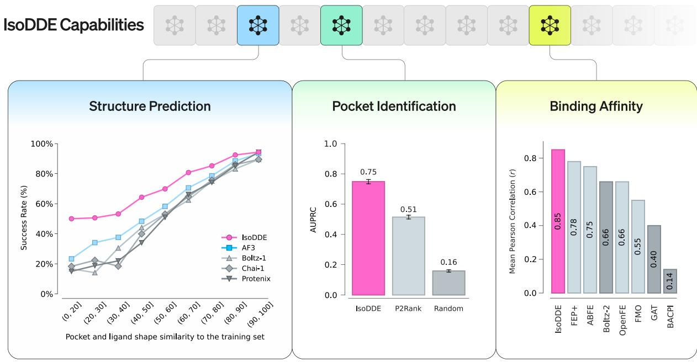  
Figure 1 | Selected capabilities of the IsoDDE. Left: IsoDDE shows a leap in structure prediction for unseen small molecules and pockets on the Runs $\mathbf { N } ^ { \prime }$ Poses benchmark, more than doubling the prior state-of-the-art accuracy (AF3). Middle: IsoDDE demonstrates robust generalisation capabilities, outperforming established methods in identifying ligand-binding pockets. Right: IsoDDE’s ability to predict binding affinity exceeds gold standard physics-based methods such as $\mathrm { F E P + }$ .

# Introduction

Characterising the interactions between biomolecules (proteins, small molecules also known as ligands, DNA, etc.) is fundamental to discovering biological mechanisms (Mosalaganti et al., 2022) and, through intervention, to the modulation of biological function and the rectification of disease states (Kuntz, 1992). Whilst many experimental techniques exist to probe biological systems (Adrian et al., 1984; Kendrew et al., 1958; Nguyen et al., 2015; O’Reilly et al., 2019), the ability to characterise biomolecular interactions in silico (on a computer) with experimental accuracy remains a grand challenge at the core of scalable and reliable drug design (Medina-Franco, 2021).

Deep learning models have advanced the modelling of interactions, often in combination with diverse computational chemistry tools (Trott and Olson, 2010; Van Der Spoel et al., 2005). This understanding has been achieved through the accurate prediction and modelling of 3D structure (Jumper et al., 2021). The introduction of AlphaFold-Multimer (Evans et al., 2022) enabled the modelling of proteinprotein complexes and their underlying structural interactions. Subsequently, AlphaFold 3 (AF3) (Abramson et al., 2024) established a new class of structure prediction models that could structurally characterise relevant biomolecular interfaces more accurately than classical docking, including those involving small molecule ligands and antibodies, two of the most dominant therapeutic modalities. Since then, the field has expanded to include a proliferation of AlphaFold-style structure models (Chai Discovery team et al., 2024; Genesis Research Team et al., 2025; Wohlwend et al., 2024) seeking to reproduce and extend these predictive capabilities.

Despite recent progress, benchmarks reveal persistent failures to generalise to unexplored regions of molecular space (Hitawala and Gray, 2025; Škrinjar et al., 2025; Xu et al., 2026b). This limitation is evidenced by antibody-antigen docking failure rates exceeding $5 0 \%$ even for AF3 (Hitawala and Gray, 2025; Xu et al., 2026b). Benchmarks also show that current cofolding models largely memorise small-molecule binding modes, leading to performance collapse in novel pockets (Škrinjar et al., 2025). Furthermore, accurate structural predictions often fail to translate to quantitative metrics of interaction strength (e.g., $\Delta G$ or $K _ { D }$ ). To predict binding events and affinity, researchers often rely on proxies such as confidence estimates from structural models (Bennett et al., 2025; Gerasimavicius et al., 2026; Schmid and Walter, 2025; Stark et al., 2025), specialised deep learning scorers (Gainza et al., 2023; Liu et al., 2025; Motmaen et al., 2023), or on classical tools like FEP (Zwanzig, 1954) and docking (Coleman et al., 2013; Trott and Olson, 2010). However, these methods often correlate poorly with experimental data or require hand-crafted initialisation for each system.

In this report, we demonstrate a step change in accuracy and generalisation to novel chemical space, directly addressing these limitations. Bridging the generalisation gap provides the foundational layer for a drug design engine (DDE) aiming to drug first-in-class targets and to discover distinct modulatory mechanisms. Our DDE integrates this predictive fidelity with the generative capability to navigate and optimise within vast molecular design spaces. Here, we preview a subset of the predictive core of the Isomorphic Labs Drug Design Engine (IsoDDE), which addresses the foundational requirement of accurate simulation, a prerequisite for effective generative design (Figure 1).

The following results highlight the predictive capabilities of the IsoDDE across diverse domains:

• Protein-ligand structure prediction: In the subset of the Runs N’ Poses protein-ligand cofolding benchmark (Škrinjar et al., 2025) furthest from the training set, IsoDDE achieves a ${ > } 2$ -fold cofolding accuracy improvement over the previous state of the art, AF3. Moreover, it successfully models complex out-of-distribution effects, such as the opening of cryptic pockets, that are outside the training set of the model.

• Antibody-antigen structure prediction: In the prediction of antibody-antigen interfaces, IsoDDE shows a significant enhancement in accuracy, outperforming AF3 by $2 . 3 \times$ and Boltz-2 (Passaro et al., 2025) by $1 9 . 8 \times$ in the fraction of high-quality predictions on a challenging, heldout antibody test set. IsoDDE also demonstrates state-of-the-art performance on complementarity determining region heavy chain 3 (CDR-H3) loop prediction (Hitawala and Gray, 2025; Regep et al., 2017), outperforming AF3 by $1 . 2 \times$ and Boltz-2 by $1 . 6 \times$ .

• Binding affinity: Our methods exceed state-of-the-art deep learning methods on realistic medicinal chemistry benchmarks and, on curated sets amenable to physics simulation, we exceed gold-standard free-energy perturbation methods (Passaro et al., 2025).

• Pocket identification: IsoDDE outperforms P2Rank, a frequent top-ranking open-source method by $_ { 1 . 5 \mathrm { x } }$ AUPRC on a general test set, unlocking novel pockets previously discoverable only through experimental methods (Krivák and Hoksza, 2018).

The remainder of this manuscript outlines these results in more detail.

# 1. Structure Modelling

The foundation of rational drug design is an accurate geometric understanding of the target and its interactors. We evaluate IsoDDE’s structural capabilities across a variety of interfaces and benchmarks.

# 1.1. Related Work

Since its 2024 release, AF3 has maintained a leading position in structure prediction. We benchmark IsoDDE both against AF3 as well as more recent works that have explored improving model performance and steerability through architectural, data, and training protocol changes.

To enhance user control, several models have introduced conditioning features. Wohlwend et al. (2024) implemented a robust pocket-conditioning algorithm. In Chai Discovery team et al. (2024), the authors developed options to prompt with experimental constraints, such as epitope mapping and cross-linking mass spectrometry data. Passaro et al. (2025) proposed a wider range of controllability features, including the ability to condition on the experimental method (e.g., X-ray, NMR), integrate multi-chain templates, and apply distance constraints. Multiple models (Corley et al., 2025; Passaro et al., 2025) also added inference-time steering mechanisms to correct for physical inaccuracies such as incorrect stereochemistry.

Reproductions of AF3 featured in our analysis have stayed faithful to the core elements of triangular operations acting on pair representations, to produce an embedding which is then processed by a generative diffusion model. Architecture changes can be categorised into hyper-parameter and signal flow changes on the one hand, and revisiting the generative modelling formulation with newer perspectives on the other hand. For example, Wohlwend et al. (2024) and ByteDance AML AI4Science Team et al. (2025) both report reordering operations in the MSA module to improve information flow between single and pair representations. Corley et al. (2025) report a variety of changes to the diffusion and confidences heads. Qiao et al. (2024) adopt a flow-based implementation incorporating physical priors. Zhou et al. (2025) report improvements from wider pairformer representations. Beyond these, distillation data mixtures, crop size schedule and losses have also been varied across model variants, but without establishing clear links to final model performance.

Efforts to improve model throughput have mainly focused on the $O ( n ^ { 3 } )$ triangular attention and multiplication operations, for example the cuEquivariance library (NVIDIA, 2024). In particular, customised variants of FlashAttention (Dao et al., 2022) reduce triangular attention’s memory footprint to $O ( n ^ { 2 } )$ which can be critical on long sequence lengths (Song et al., 2023).

While steerability and efficiency have improved, newer general models have not substantially improved unconditional accuracy. IsoDDE’s architecture and training improvements represent the first such step change since the release of AF3.

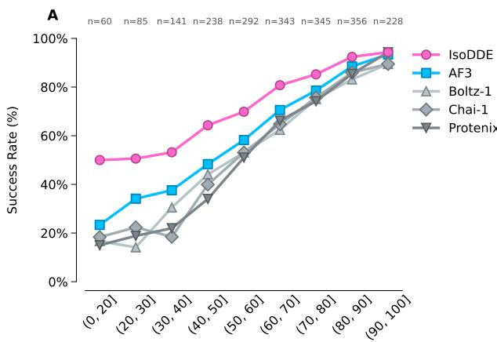  
Pocket and ligand shape similarity to the training set

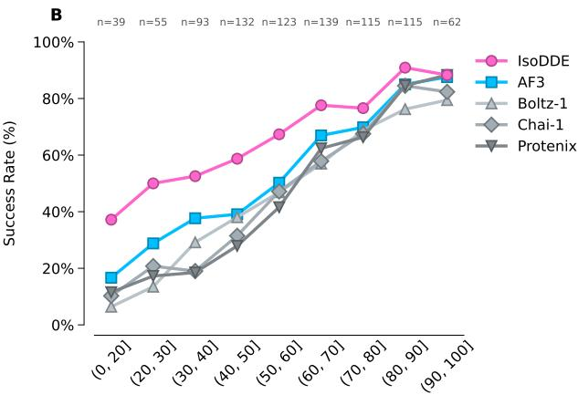  
Pocket and ligand shape similarity to the training set

Figure 2 | IsoDDE performance on Runs N’ Poses shows meaningful improvement on the hardest generalisation challenges. The success rate of the top confidence ranked prediction is plotted. Numbers on the top axis indicate the number of examples in each bin. A: Full data set, B: Clustered and filtered to remove 124 prevalent ligands, as in Škrinjar et al. (2025). The IsoDDE model reported here has the same training cutoff date as AF3 and is fully consistent with the similarity bins. Further results are given in Figure 14 and analysis of the improvement of IsoDDE over AF3 is given in Table 4.

# 1.2. Measuring Protein-Ligand Generalisation

The Runs $\mathbf { N } ^ { \prime }$ Poses benchmark (Škrinjar et al., 2025) was developed to measure the generalisation of protein-ligand cofolding models to examples far from the training set. The benchmark defines a measure of pocket similarity, based on pocket sequence identity, and of ligand similarity, based on the shape overlay (Leung et al., 2019). The benchmark set consists of protein-ligand examples released after the AF3 training cutoff date (30-September-2021), and bucketed by similarity to their nearest neighbour training set example. We compare the accuracy of IsoDDE, which is also trained to the AF3 cutoff, across data similarity bins to AF3 and the models reported on the full Runs N’ Poses benchmark. We examine the performance of the single highest confidence prediction from 25 samples. Results in Figure 2 demonstrate a large increase in performance in the bins with lowest similarity to the training set, which represent the hardest generalisation challenge, and significant increases in performance in other bins.

We report comparisons to Boltz-2 on a subset of the benchmark in Section 1.4. Some additional AF3 reproductions have reported on different aggregations but do not provide results on the single highest confidence prediction on the full Runs N’ Poses benchmark, preventing a direct comparison in the stratification bins (Genesis Research Team et al., 2025). Additional reported results on Runs N’ Poses come in well under AF3 (The OpenFold3 Team, 2025).

Within the hardest similarity bin (0-20], IsoDDE achieved a $5 0 \%$ success rate (30 of the 60 cases where all models could generate predictions). Notably, 17 of these successful predictions were for examples where AF3 did not produce a correct result. Figure 3 highlights three case studies illustrating the difficulty and utility of accurately predicting these poses. First, the ligand in PDB structure 8EA6 (Thompson et al., 2023) opens a novel cryptic pocket at the interface of two NKG2D protein chains, forming a ternary complex. Comparison to the nearest structure in the training set demonstrates the extent of the induced fit effect, which causes the ligand to act as an allosteric protein-protein interaction inhibitor. Second, the ligand in PDB structure 8E23 (Bubenik et al., 2022) is an allosteric PolΘ inhibitor that causes a helix movement to open a pocket unseen in the training set. Finally, the ligand in PDB structure 7FEE (Yang et al., 2022a) is a positive allosteric modulator of CB1, a class A

GPCR. IsoDDE finds the correct pose despite the pocket being unknown as a cannabinoid receptor ligand binding site in the training set.

An important part of IsoDDE structure capabilities is the confidence score associated with each prediction which enables an estimate of how likely the prediction of known binders is to be accurate. We provide additional results in the supplementary material (Figure 15), showing how model performance varies with confidence score.

# 1.3. Comparison on FoldBench

Table 1 | Performance of structure models on FoldBench. We show success rates of the highest confidence example for each method on the full FoldBench set, all examples post January-2023. Protein-protein and antibody-antigen results correspond to fraction DockQ $> = 0 . 2 3$ , protein-ligand to fraction pocket aligned $\mathrm { R M S D } < 2 \mathring { \mathrm { A } }$ and $\mathrm { L D D T } \mathrm { \mathrm { P L I } } > 0 . 8$ .

<table><tr><td>Model</td><td>Antibody-Antigen</td><td>Protein-Ligand</td><td>Protein-Protein</td></tr><tr><td>IsoDDE</td><td>75.58</td><td>75.99</td><td>74.19</td></tr><tr><td>AlphaFold 3</td><td>47.90</td><td>64.90</td><td>72.93</td></tr><tr><td>Protenix-v1</td><td>50.12</td><td>62.79</td><td>74.00</td></tr><tr><td>SeedFold</td><td>53.21</td><td>63.12</td><td>74.03</td></tr><tr><td>SeedFold-Linear</td><td>46.91</td><td>66.48</td><td>74.14</td></tr><tr><td>Chai-1</td><td>23.64</td><td>51.23</td><td>68.53</td></tr><tr><td>HelixFold 3</td><td>28.40</td><td>51.82</td><td>66.27</td></tr><tr><td>Protenix</td><td>34.13</td><td>50.70</td><td>68.18</td></tr><tr><td>OpenFold 3 (preview)</td><td>28.83</td><td>44.49</td><td>69.96</td></tr></table>

The FoldBench dataset provides an additional benchmark for structure models trained on data before 13-January-2023, and is filtered for similarity to structures before this date (Xu et al., 2026a,b). We present results comparing IsoDDE trained to the AF3 cutoff date (see Section 4.4) to a set of external models in Table 1, demonstrating the superior performance of IsoDDE across antibody-antigen, protein-ligand and protein-protein benchmarks. Results for models aside from IsoDDE, SeedFold and Protenix-v1 are taken from the FoldBench website (Xu et al., 2026a). SeedFold results are from Zhou et al. (2025). Protenix-v1 results are from Protenix Team (2026).

# 1.4. Comparison to Boltz-2

The Boltz-2 model (Passaro et al., 2025) is an enhancement of the Boltz-1 model and provides a point of comparison for IsoDDE structure capabilities. Boltz-2 is trained on PDB data before 01-June-2023 meaning the complete Runs N’ Poses set cannot be used. A subset after the 01-June-2023 cutoff date with the similarity reported to the Boltz-2 training set was created as part of the Runs $\mathrm { N } '$ Poses benchmark. We compare on this admissible subset and show generally higher performance of IsoDDE than Boltz-2 in Figure 4, with significantly higher performance in the most challenging (0-20] similarity bin (Table 5).

In addition to protein-ligand results, we seek to compare across other important interfaces and chain types enabled in IsoDDE. Following a similar process to the AF3 test set construction (Abramson et al., 2024), we collated a test set from PDB structures released after 01-January-2024 based on filtering for overall size, data quality and similarity to the training set, and clustered by similarity (see Structure Prediction Benchmark Construction). Results in Figure 5 highlight not only the performance gap between AF3 and its reproductions on key interfaces, but also the broad progress of IsoDDE. For protein-ligand predictions we show both results where violations from ideal local geometries are treated as failures and filtered from the predictions, and where these violations are allowed (see

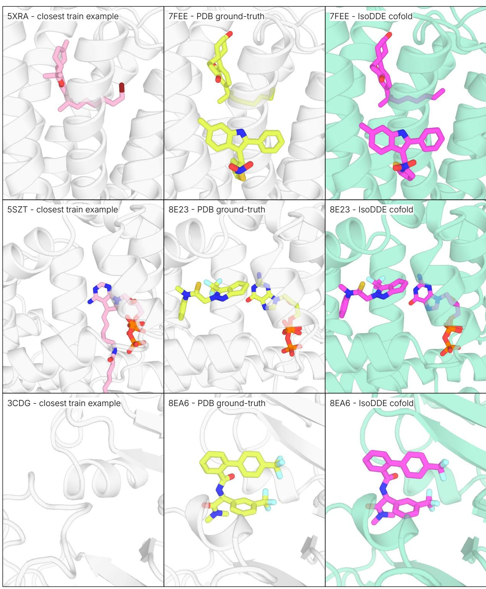  
Figure 3 | Case studies on hard targets from the lowest (0-20] similarity bin where IsoDDE succeeds and AF3 fails. Left: nearest training set example PDB structure as defined in the Runs $\mathbf { N } ^ { \prime }$ Poses benchmark, aligned to the test set example. Middle: experimental PDB structure of test set example. Right: top ranked by confidence score IsoDDE prediction.

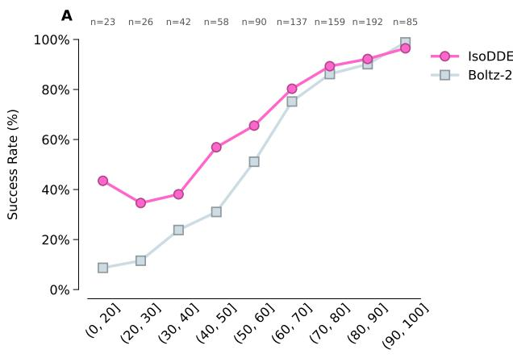  
Pocket and ligand shape similarity to the training set

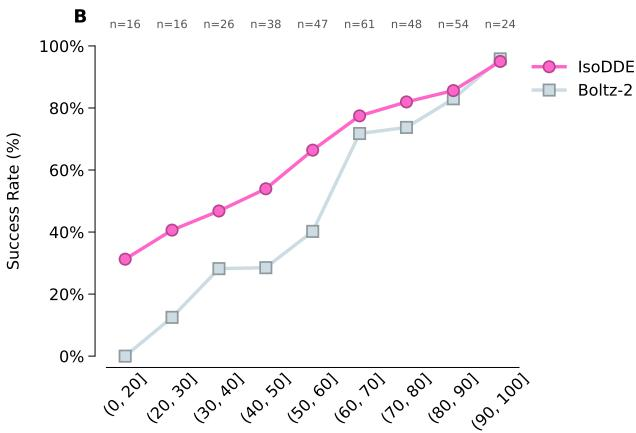  
Pocket and ligand shape similarity to the training set   
Figure 4 | IsoDDE and Boltz-2 performance on Runs N’ Poses set post Boltz-2 training cutoff, with the similarity bins calculated with respect to the Boltz-2 training set (PDB structures before 01-June-2023). The success rate of the top confidence ranked prediction is plotted. Numbers on the top axis indicate the number of examples in each bin. A: Full data set, B: Clustered and filtered to remove 124 prevalent ligands highlighted in Škrinjar et al. (2025). Further analysis of the performance difference between IsoDDE and Boltz-2 is given in Table 5.

Structure Prediction Benchmark Construction for the definition of violations). IsoDDE reaches full parity of these two metrics, eliminating the issue of generating inaccurate local ligand geometries.

# 1.5. Antibody-Antigen Interfaces

Among protein-protein complexes, antibody-antigen interfaces are a particularly difficult subclass (Zhang et al., 2025). Challenges arise due to the sequence and structural variability in an antibody’s CDR loops (Hitawala and Gray, 2025; Regep et al., 2017), as well as the conformational nature of antigen epitopes. We created an antibody-antigen test set to further assess structure prediction performance. This set consists of 334 PDB structures having a novel antibody-antigen interface with respect to those in training. We define a novel interface as having below $4 0 \%$ epitope similarity (where epitope similarity is the epitope sequence identity weighted by the epitope pocket overlap) or below $7 0 \%$ sequence identity across all CDR loops; see Supplementary Information for details.

IsoDDE shows a leap in performance relative to AF3, the previous state-of-the-art model (Abramson et al., 2024). In the high-fidelity regime $( \mathrm { D o c k Q } > 0 . 8 )$ , IsoDDE’s $3 9 \%$ accuracy represents a $2 . 3 \times$ and $1 9 . 8 \times$ leap over AF3 and Boltz-2, effectively unlocking up to $2 2 \%$ and $3 7 \%$ more of the novel antibody design space previously inaccessible to modeling (Figure 6). In the correct regime (DockQ $> 0 . 2 3 )$ , with a single seed, IsoDDE predicts $6 3 \%$ of interfaces successfully, which represents a $1 . 4 \times$ and $2 . 2 \times$ improvement over AF3 and Boltz-2, respectively (Figure 13). Notably, the atomic-level precision observed in IsoDDE predictions extends to the CDR-H3 loop, which IsoDDE models with $\overset { \cdot } { \leq } 2 \mathring { \mathrm { A } }$ backbone RMSD for $7 0 \%$ of antibodies in the test set, compared to $5 8 \%$ for AF3 and $4 3 \%$ for Boltz-2, representing a $1 . 2 \times$ and $1 . 6 \times$ improvement, respectively (Figure 6).

Antibody-antigen structure prediction was previously shown to benefit from scaling inference-time compute (Abramson et al., 2024). Using 1000 model seeds and ranking based on confidence enhances IsoDDE’s performance on our test set (Figures 6 and 13), reaching up to $8 2 \%$ in DockQ correct and $5 9 \%$ in DockQ high accuracy predictions. In addition, the fraction of antibodies with accurate CDR-H3 predictions increases to $8 4 \%$ . Both IsoDDE and AF3’s performance metrics improve with more seeds. Remarkably, IsoDDE has stronger DockQ and CDR-H3 prediction performance at 1 seed compared to both AF3 and Boltz-2 performance at 1000 seeds.

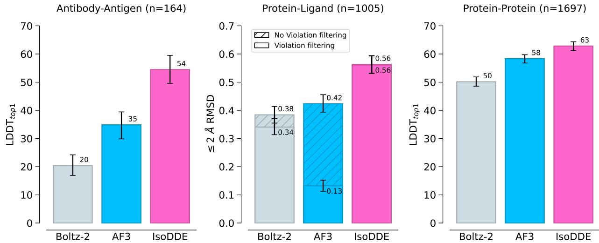  
Figure 5 | Results for three main interface types across low similarity, clustered examples. Results correspond to the metric of the highest confidence prediction over 25 samples, with Boltz-2 iPTM used as the confidence score for Boltz-2 predictions, n corresponds to the number of clusters in each interface type. For antibody-antigen and general protein-protein interfaces the $\mathrm { L D D T } _ { t o p 1 }$ metric is defined as the LDDT (Mariani et al., 2013) of the highest confidence prediction, as in Abramson et al. (2024), for protein-ligand interfaces the fraction of highest confidence ligand predictions with pocket-aligned heavy atom $\mathrm { R M S D } \leq 2 \mathring \mathrm { A }$ is reported, both for all predictions and only those which pass violation filters – violations defined in 4.1. Error bars are a $9 5 \%$ confidence interval on the mean.

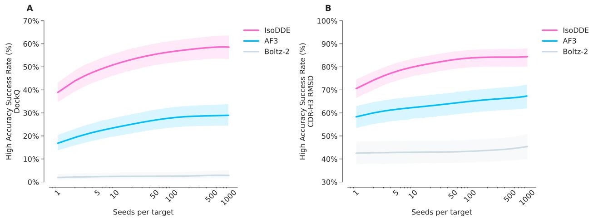  
Figure 6 | Scaling inference-time compute improved antibody-antigen structure prediction. Results on a low homology antibody-antigen test set $\scriptstyle ( n = 3 3 4 )$ ), showing A: DockQ high accuracy success rate $( \mathrm { D o c k Q } > 0 . 8 )$ and B: CDR-H3 RMSD high accuracy success rate (framework-aligned backbone RMSD $\leq 2 \mathring \mathrm { A } \}$ . Plots show the aggregated mean of confidence-ranked samples per number of seeds across all antibody-antigen interfaces.

As illustrated in Figure 13, IsoDDE achieves DockQ scores comparable to or surpassing those of AF3 across nearly all test cases. Notably, the most significant gains are observed on targets that prove challenging for AF3, underscoring IsoDDE’s robust generalisation capabilities. To illustrate this, we highlight three challenging antibody-antigen case studies where IsoDDE outperforms AF3 (Figure 7).

The first example concerns PDB ID 9FZD (Sorgenfrei et al., 2025), a structure of a nanobody binding a bacterial outer membrane protein A (OmpA). IsoDDE predicts the nanobody-OmpA interface with DockQ 0.943 and the CDR-H3 loop with a backbone RMSD of $0 . 9 4 \mathring \mathrm { A } .$ However, the top-ranked prediction from AF3 has DockQ 0.00 and CDR-H3 backbone RMSD 4.98 Å. This is primarily due to AF3 placing the nanobody on the incorrect side of the OmpA membrane protein. There are no structures in the PDB featuring OmpA in complex with a nanobody; the closest nanobody or antibody match in the training data has $6 1 \%$ CDR sequence identity, while the closest epitope match has $3 8 \%$ epitope similarity.

Another example is PDB ID 8Q3J (da Silva et al., 2024), which features an antibody Fv binding murine IL-38. The closest antibody match has $8 1 \%$ CDR sequence identity, while the nearest epitope match has $3 3 \%$ epitope similarity. IsoDDE predicts the heavy chain-antigen interface with DockQ 0.876, with the CDR-H3 loop having backbone RMSD of $0 . { \dot { 7 } } 8 { \mathring \mathrm { A } } .$ . As shown in (Figure 7), the AF3 cofold flips the orientation of the heavy and light chains relative to the ground-truth PDB structure attaining a DockQ of 0.060, while the IsoDDE prediction shows a high structural overlap.

Finally, for PDB ID 8QZ2 (Rödström et al., 2024), IsoDDE produces an accurate prediction of a nanobody binding the potassium ion channel TREK-2. There are no structures in the PDB featuring this ion channel in complex with an antibody or nanobody, and the closest epitope in the IsoDDE training data has $3 6 \%$ epitope similarity. IsoDDE’s top-ranked pose has DockQ 0.683 and CDR-H3 $0 . 6 7 \mathring { \mathrm { A } }$ , while the top-ranked AF3 pose is incorrect.

# 2. Binding Affinity

While 3D pose determination is a prerequisite for structure-based design, effective molecular optimisation further requires quantitative interaction strength estimation. To bridge this gap, IsoDDE allows quantitative binding estimation. In this section, we assess IsoDDE’s ability to predict ligand binding affinity across diverse chemical series, moving beyond binary classification to precise potency ranking.

# 2.1. Related Work and Challenges

Predicting the strength of a biomolecular interaction, as well as its physical structure, is a key drug design challenge. Molecular fingerprint models (Lavecchia, 2015) have historically aided lead optimisation by predicting the affinity of a ligand to a particular target, given measurements for similar ligands. These approaches can accelerate the drug discovery process by extracting quantitative predictions of structure-activity relationships from experimental data. They are fundamentally limited to chemical space similar to the training data and rely on target-specific experimental data collection. Molecular dynamics approaches can directly estimate the free energy of binding of ligand-protein complexes (FEP). FEP methods represent the gold standard for in silico prediction of ligand-protein binding constants, but they are also limited both by their high computational cost and because they require accurate starting geometries and careful systems preparation (Williams-Noonan et al., 2018).

# 2.2. Evaluation Strategy

Since the advent of deep learning, several groups have attempted to develop general neural models of ligand-protein binding, either utilising models on sequence information (Nguyen et al., 2021; Öztürk et al., 2019; Yang et al., 2022b) or directly on 3D structure (Wallach et al., 2015), such as Pafnucy (Francoeur et al., 2020) or docking potentials. It has also become clear that benchmarking deep learning models is far from trivial, as clarified by recent work on the bias of existing datasets (Kanakala et al., 2023). Existing algorithm evaluations are frequently inflated due to intrinsic data biases. For example, datasets tend to contain many congeneric series, with several compounds having similar activity. As such, a naive splitting approach can lead to researchers accidentally testing their models on compounds that are highly similar to the training set.

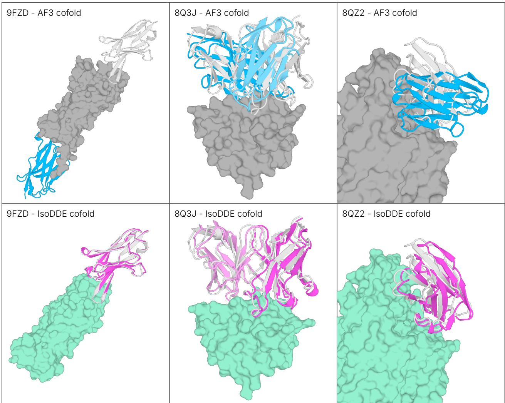  
Figure 7 | Case studies of antibody-antigen structure predictions, from AF3 and IsoDDE. Left: Nanobody binding OmpA (PDB: 9FZD), Middle: Fab fragment binding mIL-38 (PDB: 8Q3J), Right: Nanobody binding potassium ion channel TREK-2 (PDB: 8QZ2). AF3 predictions are shown in the top row (antigen: gray, antibody heavy chain: blue, antibody light chain: light blue) and IsoDDE predictions are shown in the bottom row (antigen: green, antibody heavy chain: pink, antibody light chain: light pink). The ground-truth antibody is overlaid in white for all predictions.

We adopt a similar approach to that used for the evaluation of structure models: we split the data along a specific cutoff date of 01-January-2023. Assays after this date are divided into a validation and test set as usual. This approach is not immune to the biases that can occur in bioactivity datasets, but it does align with the prospective use of models in a drug discovery campaign, as it simulates directly how well models would perform on a new problem. In order to include comparisons to other ML methods (Passaro et al., 2025) on public datasets such as $\mathrm { F E P + \ 4 }$ (Hahn et al., 2022; Ross et al., 2023) and OpenFE (Gowers et al., 2023), we removed all data for the proteins in these benchmarks from the training set.

# 2.3. Results

To assess IsoDDE’s performance on a realistic in silico analogue of a drug discovery programme, we predicted binding affinities for all newly deposited assays in ChEMBL 35 (Zdrazil et al., 2024). As shown in Figure 8, IsoDDE maintains a high level of performance across target categories. Furthermore, when compared to physics-based simulations in Figure 9, IsoDDE considerably outperforms all ML methods on three public benchmarks $\mathrm { F E P + \ 4 }$ (Hahn et al., 2022; Ross et al., 2023), OpenFE (Gowers et al., 2023), and the recent CASP16 blind binding affinity prediction task (Gilson et al., 2025). In fact, remarkably, IsoDDE can surpass the performance of physics-based methods, even accounting for the fact that physics-based methods are often grounded by crystal structures.

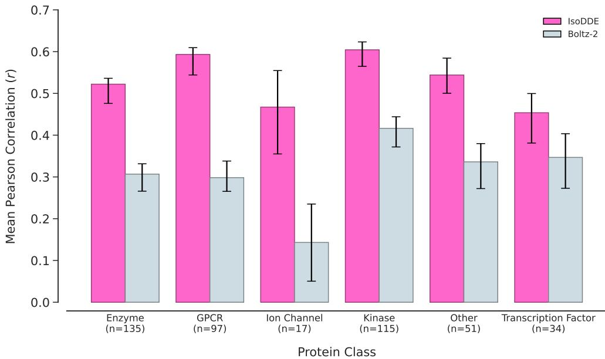  
Figure 8 | Per-class performance evaluation on the ChEMBL 35 time-split dataset. The bar plot displays the mean Pearson Correlation Coefficient $( r )$ between predicted and experimental binding affinities, achieved by IsoDDE and Boltz-2 across six protein classes. The sample size $( n )$ for each class is indicated on the x-axis. Error bars represent the bootstrapped $9 5 \%$ confidence interval.

The performance of IsoDDE in time-split assays highlights its promise and application in drug discovery, but time-splits do not guarantee that assays after a certain date are not extremely similar to assays in the training set. Figure 10a shows how Pearson’s correlation coefficient varies on assays as a function of their similarity to previous assays. Similarity is defined as the maximum fingerprint similarity to the training set, averaged across all bioactivities in an assay. The figure shows how IsoDDE is broadly robust to novelty in chemical space. Figure 10b demonstrates IsoDDE’s generalisation capability on a specific case study from Gay et al. (2023) involving a novel protein and a novel chemical series.

# 3. Protein Ligandability

The cofolding and affinity prediction capabilities described above do not require specifying a suitable site for the ligand (hereafter "pocket"). However, the ability to identify all potential pockets without specifying a ligand unlocks unique opportunities. Pocket identification reveals the full set of possible mechanisms of action to pursue for molecular design, whether targeting first-in-class proteins lacking annotation or seeking novel modulation modes for well-studied targets. We evaluate IsoDDE’s capacity for blind pocket identification as a pivotal step in expanding the human ligandable proteome.

# 3.1. Related Work and Challenges

The identification of pockets is a foundational challenge in structure-based drug design. Early approaches evolved from geometric grid and probe-based algorithms (Connolly, 1983; Hendlich et al., 1997; Kuntz et al., 1982; Laskowski, 1995; Levitt and Banaszak, 1992) to methods incorporating evolutionary conservation (Capra et al., 2009; Glaser et al., 2006; Huang and Schroeder, 2006) and energy-based scoring (Goodford, 1985; Laurie and Jackson, 2005; Ruppert et al., 1997). Subsequently, molecular dynamics tools like MDpocket (Schmidtke et al., 2011) enabled the capture of protein flexibility and transient states crucial for recognition.

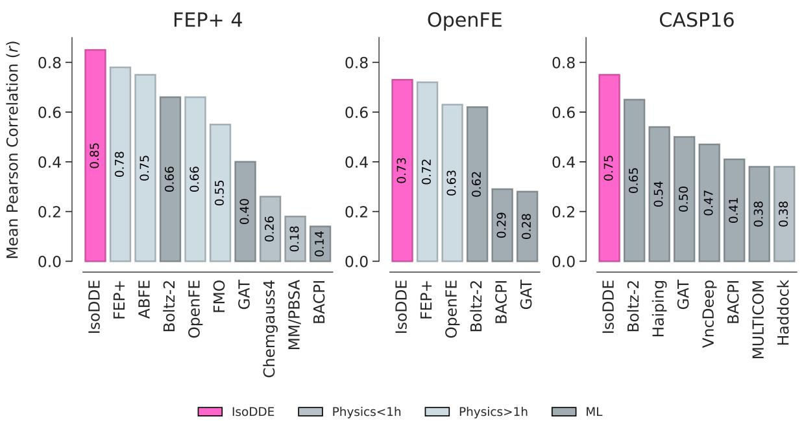  
Figure 9 | IsoDDE considerably surpasses ML methods and can even outperform expensive physicsbased methods such as OpenFE. Benchmark sets are described in Section 4.5.

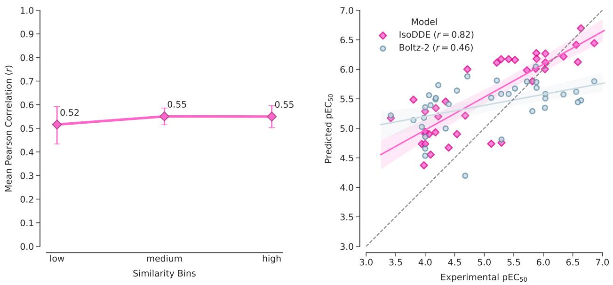  
Figure 10 | IsoDDE performance analysis. Left: Performance stability across ligand similarity bins for ChEMBL 35. Similarity is calculated using Morgan fingerprints and is defined as the mean maximum Tanimoto similarity to the training set across all ligands in an assay. Bins are defined by similarity score: low (0–0.33), medium (0.33–0.66), and high (0.66–1.0). Right: GPR3 agonist case study. IsoDDE accurately predicts activity for diphenyleneiodonium analogs $( r = 0 . 8 2 )$ on a novel target.

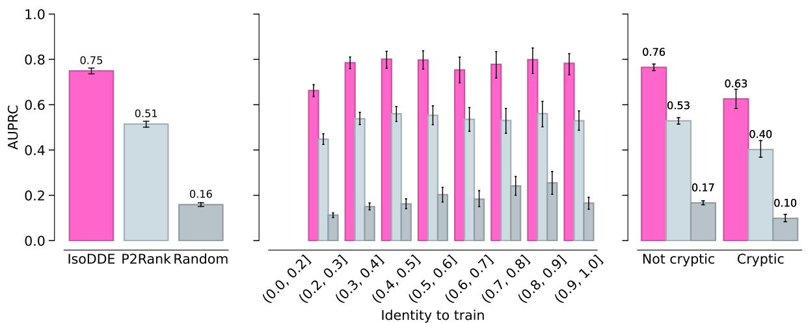  
Figure 11 | IsoDDE outperforms P2Rank, a common open-source model, with generalisability to targets with low sequence identity to train. IsoDDE is able to identify pockets deemed non-obvious as shown by the breakout on the cryptic subset of the test set. The random baseline procedure is described in the supplement. Error bars represent the $9 5 \%$ confidence interval.

More recently, deep learning approaches have gained prominence, utilising architectures ranging from 3D CNNs (DeepSite, Jiménez et al. 2017) to equivariant GNNs (VN-EGNN, Sestak et al. 2024). Despite increased expressive capacity, reliance on predefined features and explicit structural inputs often limits these methods from mapping the full universe of ligand pockets (reviews in Carpenter and Altman 2024, Eguida and Rognan 2022).

# 3.2. Results

IsoDDE exhibits the capability to identify novel, ligandable pockets in the absence of a known ligand. Given the lack of a single, modern community benchmark, and a single problem representation, to exemplify the generalisation of the model, we created a test set aligned to the temporal cutoff of the IsoDDE structure model. We measure performance by the ability to rank known pocket residues (those within 5 Å of a ligand), calculated as the area under the precision-recall curve (AUPRC). All pockets observed during training are excluded from evaluation. We benchmarked our model against P2Rank (Krivák and Hoksza, 2018), a widely-used open-source model that consistently ranks among the top performers (Utgés and Barton, 2024).

Figure 11 demonstrates IsoDDE’s consistent high performance, even on proteins with low training set similarity. Further, we assessed the performance on a cryptic subset. Such sites are absent, hidden, or undetectable in the ligand-free (apo) state of the protein, but become apparent and capable of binding a ligand in the ligand-bound (holo) state due to a conformational change. As seen in Figure 11 (right), while the performance decreases for the cryptic set, it continues to outperform P2Rank.

This general capability significantly expands the ligandable human proteome, offering new sites for therapeutic intervention and the potential to revisit existing targets with novel mechanisms of action beyond standard active and orthosteric sites. We illustrate this predictive power further through a retrospective analysis of a recent publication (Figure 12) with the protein sequence being the only inference-time user input.

Applying the pocket identification capability to a well-studied substrate receptor of the CRL4 E3 ligase complex, Cereblon, we were able to correctly identify the location of a cryptic site without $a$ priori knowing the identity of the pocket-opening ligand. While the signal appears nonsensical when

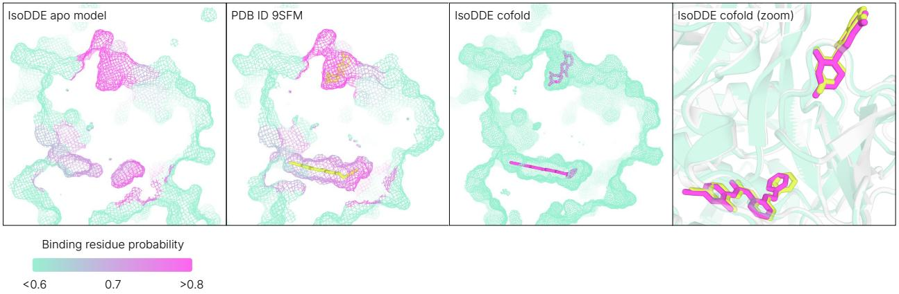

Figure 12 | Retrospective analysis of a recent literature example reporting the discovery of a novel cryptic site on Cereblon (CRBN) (Dippon et al., 2026). Left: Surface mesh cross-section of the IsoDDE model of CRBN in the apo state. The colour gradient shows the predicted residue-level probability of each residue being a ligand-binding residue. Middle Left: The same predicted residue-level probabilities overlaid on top of the structure from the paper. The pocket identification signal was able to predict the location of both the known and the novel cryptic site using just the sequence of CRBN as input, without specifying the identity of the ligands. Crystal ligands lenalidomide (CCD ID LVY, top, known site) and SB-405483 (CCD ID A1CEG, bottom, novel site) shown in chartreuse. Middle Right: Surface mesh cross-section of the IsoDDE model cofolded with the specified ligands (pink) - lenalidomide and SB-405483, without pocket conditioning. Right: A closer inspection of the cofold (green/magenta) with respect to paper structure PDB ID 9SFM (grey/chartreuse) indicates not only correct pocket placement, but also a correct pose for both ligands. P2Rank identifies this pocket only once the pocket is formed – pocket probability increases from 0.010 in the apo AlphaFold DB structure to 0.518 in the holo PDB ID 9SFM (not shown).

overlaid on top of the apo structure, we see that same signal lining the full depth of the pocket when projected onto the recent ligand-bound crystal structure. Further, once the identity of the ligands was specified, the structure model was able to correctly cofold the ligands into their respective pockets (SB-405483 RMSD 0.33 $\mathring \mathrm { A }$ , lenalidomide RMSD $\begin{array} { r } { \dot { 0 } . 1 2 \mathring { \mathbb { A } } , } \end{array}$ , no pocket conditioning). A survey of all PDB structures ${ > } 3 0 \%$ sequence identity to Cereblon revealed that no ligands have been previously observed at the location of SB-405483 prior to the publication of this paper (internal analysis, not shown).

We describe a prospective use case of the pocket identification capability in the supplementary material (Figure 16), where we conducted a crystal soaking campaign utilising the Pan-Dataset Density Analysis (PanDDA) methodology to characterise binding events to a helicase.

# 4. Summary

We have previewed a subset of the predictive capabilities of IsoDDE. Our results in structure prediction present the first step-change improvement since the release of AlphaFold 3. They enable structurebased drug design on the most difficult targets across multiple modalities, allowing us to prioritise molecules in our programmes with much higher confidence. IsoDDE’s ability to predict binding affinities and novel pockets with high accuracy provides critical tools to design novel molecules, empowering drug designers to navigate the vast chemical space with unprecedented accuracy.

# Supplementary Materials

# 4.1. Structure Prediction Benchmark Construction

We construct a structure prediction benchmark by filtering X-ray crystallography and cryo-electron microscopy (cryo-EM) PDB entries with a release date after 01-January-2024. To ensure a high-quality sampling of each interface type, we apply the filtering criteria in Table 2.

Table 2 | Filtering criteria for structure prediction benchmark construction.   

<table><tr><td>Category</td><td>Filtering Criteria</td></tr><tr><td>Global size filters</td><td>Total size&lt; 18oo biopolymer residues + ligand atoms.</td></tr><tr><td>Protein-protein and antibody-antigen quality</td><td>Resolution &lt; 4 A.</td></tr><tr><td>Protein-ligand quality</td><td>· X-ray structures: Resolution &lt; 2.5 A and goodness of fit to electron density &gt; 0.5 (Shao et al., 2022).</td></tr><tr><td></td><td>· Cryo-EM structures: Resolution &lt; 3.5 A; common membrane ligands removed.</td></tr><tr><td></td><td>· Ligand size: 6 &lt; number of heavy atoms &lt; 40.</td></tr><tr><td></td><td>· Composition: Organic ligands containing only H, B, C, N, O, F, Si, P, S, Cl, Se, Br, or I.</td></tr><tr><td></td><td>· Exclusions: Common crystallography buffers and common ions are</td></tr><tr><td></td><td>removed. · Occupancy = 1.O for all atoms.</td></tr><tr><td></td><td>· Crystal Contacts: &lt; 1O% of contacts with crystal symmetry mate</td></tr><tr><td></td><td>chains that are not part of the same bioassembly as the primary chain (defined as the chain with the most contacts to the ligand).</td></tr></table>

We further apply similarity filtering to the interfaces included in the test set to remove interfaces which have both sides similar to an interface before the cutoff. Similarity is defined for ligands by volume overlap (voxel based with a grid size of $2 \mathring \mathrm { A } )$ , ligand pockets by sequence identity of residues $< 6 \mathring \mathrm { A }$ from the ligand, protein surfaces by sequence identity of residues at the interface with the binding partner (residues within $1 0 \mathring { \mathrm { A } }$ of the partner chain, interfaces must be $< 4 \mathring \mathrm { A }$ from each other at closest point, with $> 6$ residues in the interface). Specific similarity cutoffs are provided in Table 3.

<table><tr><td>Category</td><td>Similarity Cutoffs</td></tr><tr><td>Protein-ligand</td><td>Ligand volume overlap &gt; 0.6 and pocket sequence identity &gt; 0.5.</td></tr><tr><td>Protein-protein</td><td>Both interface sequence identities &gt; 0.6.</td></tr></table>

Table 3 | Similarity filtering cutoffs. An interface is excluded if both sides are above this similarity to any example interface before the cutoff.

# 4.2. Antibody-Antigen Structure Test Set

The antibody-antigen structure test set is a subset of the structure test set described above, comprised of antibody-antigen interfaces that are considered novel by either CDR sequence identity or epitope similarity. Only PDB entries that contain at least one antibody chain, identified by ANARCI (Dunbar and Deane, 2015), in contact with at least one antigen chain, and have total size $\leq 1 5 0 0$ biopolymer residues $^ +$ ligand atoms are included. An antigen chain is considered to be in contact with an antibody chain if there is at least one non-hydrogen atom within $4 . 0 \mathring \mathrm { A } .$ . PDB entries that only contain antibody chain(s) were excluded, as the primary objective of the antibody-antigen structure test set is to assess antibody-antigen interface prediction performance.

We used the AHo definition (Honegger and Plückthun, 2001) of CDR loops to determine antibody chain novelty with respect to the training data. Antibody chains with sequence identity $< 7 0 \%$ across all CDR loops were considered to be novel.

To determine whether an antigen’s epitope is novel with respect to the training data, we computed an epitope similarity metric based on sequence identity and fraction of sequence overlap between two epitopes. The epitope is defined as any residue in the antigen chain that contains a heavy-atom within $\bar { 1 0 \mathrm { ~ \AA ~ } }$ of an antibody chain heavy-atom. Sequence alignment is performed on the antigen sequences, and then all residues not in the epitope are masked out. The epitope sequence identity is calculated on the (non-masked) overlapping epitope residues. The fraction epitope overlap is calculated as the number of epitope residues overlapping divided by the total number of epitope residues. Finally, the epitope similarity is reported as the epitope sequence identity weighted by the fraction epitope overlap. Epitopes with similarity $< 4 0 \%$ are considered novel.

# 4.3. Ligand Violations

We measure the deviation of predicted ligand geometries from ideal local bond and angle values by using the ideal CCD geometry as a reference. If the absolute error in any predicted bond or angle is $2 5 \%$ of the reference value, then the prediction is marked as a violation and filtered from the set of scored predictions. Deviations from planarity of $s p ^ { 2 }$ and aromatic carbons are assessed similarly. If any chiral centre is predicted with the incorrect stereochemistry that is also marked as a violation.

Intra-molecular clashes are assessed by marking non-bonded atoms that approach to less than the sum of their van der Waals radii, minus a threshold of $1 . 5 \mathring \mathrm { A }$ . Intermolecular clashes are assessed with a distance cutoff of $1 . 7 \mathring { \mathrm { A } } ,$ in part to allow for covalent bond formation. Ligands with any clashes are marked as violations and filtered as with ligand geometry violations.

# 4.4. Training Cutoffs

All IsoDDE structure prediction models presented here are trained on PDB structures with release dates prior to the AF3 cutoff date of 30-September-2021. For the results on FoldBench (section 1.3) and in Figures 5 and 6 we additionally provided PDB structures with release dates up to 01-January-2023 as templates during model inference (also to AF3 on our own evaluation sets), as this date is before the cutoffs of these evaluation sets.

# 4.5. Binding Affinity

We curated a dataset composed of assays newly deposited in ChEMBL 35 (not present in ChEMBL 34) after the 01-January-2023 cutoff. The scope was restricted to single-chain protein targets with a maximum sequence length of 1800 amino acids. To be included, assays were required to contain at least 20 ligands and report standard activity readouts $( K _ { i } , \ K _ { d } , \ I C _ { 5 0 } , \ E C _ { 5 0 } .$ , or $D C _ { 5 0 . }$ ). Assays demonstrating insufficient variance (label standard deviation $< 0 . 5$ ) were excluded.

The existing benchmark sets in Figure 9 were prepared following the protocol set out in Passaro et al. (2025) and results for models other than IsoDDE were taken from Passaro et al. (2025). Specifically, for OpenFE, we ran inference over the public dataset from OpenFE Industry Benchmarks (OpenFreeEnergy, 2025) yielding 873 binding affinity measurements across 39 unique targets. The $\mathrm { F E P + \ 4 }$ set consists ligand-target binding affinities for 4 targets (CDK2,TYK2, JNK1 and P38) with 87 neutral molecules (Chen et al., 2023). In order to guarantee that these two FEP labelled datasets are removed from the training set, we removed any target with a sequence identity of $9 0 \%$ or greater to either of the sets.

# 4.6. Pocket Identification

The pocket identification benchmark was constructed by clustering structural data from the PDB. Only PDBs obtained through X-ray crystallography and cryo-EM, with a resolution less than $5 \textup { \AA }$ were considered. Pockets were defined as residues within $5 \textup { \AA }$ of any heavy atom of a bound ligand. Only ligands with CCD ID codes with 6-50 heavy atoms were considered, excluding crystallography buffers and common ions. A minimum pocket size of 10 residues was required. Further, only protein chains not annotated as chimeras were considered. Chimeras were defined as a PDB chain mapping to ${ > } 1$ unique UniProt ID, accounting for instances where multiple UniProt IDs correspond to the same protein due to UniProt ID updates. Each pocket instance (unique PDB ID:protein chain:ligand chain) was aligned to a reference full-length structural model of that protein UniProt ID sequence, derived from the IsoDDE structure model. These aligned pockets were then clustered based on the spatial proximity of their ligand centroids using single-linkage clustering with a distance threshold of $5 \mathring { \mathrm { A } } ,$ grouping similar locations for a given UniProt ID. This process yielded a set of unique ground truth pockets. To account for leakage, only pockets which were not observed in training or validation sets were considered for evaluation, yielding pockets where every pocket instance of a test pocket had a release date after 01-January-2024.

While no single definition exists for cryptic sites, we have adapted a common standard defined by CryptoBench (Škrhák et al., 2024). To identify cryptic sites, we analysed structural variations between ligand-bound (holo) and unbound (apo) states. Apo structures were defined as those lacking non-excluded ligands. We randomly sampled up to 10 apo chains per UniProt ID from the PDB. Each selected apo chain was then structurally aligned to every holo instance within the same pocket cluster. These alignments were optimised to minimise the Root Mean Square Deviation (RMSD) between the $\alpha$ -carbon atoms of the residues defining the pocket.

Following alignment, we calculated both all-atom and backbone-only (C, CA, N, O) RMSDs between the apo and holo versions of the pocket. A pocket was labeled as "globally cryptic" if the minimum all-atom or minimum backbone RMSD exceeded $2 . 0 \mathring \mathrm { A }$ across any apo-holo pairing for that pocket. Furthermore, to create an IsoDDE-specific cryptic label, we considered the IsoDDE training set splits. A pocket is labeled CRYPTIC for IsoDDE if no holo instance of the pocket was present in the IsoDDE training set AND either (1) the pocket is globally cryptic, or (2) the pocket is not globally cryptic, but the minimum RMSD (all-atom or backbone) between any apo instance in the IsoDDE training set and any holo instance of the pocket is greater than $2 . 0 \mathring \mathrm { A } .$ . Pockets with any holo forms in the IsoDDE training set were labeled NOT CRYPTIC.

The performance of IsoDDE on the pocket identification task was benchmarked against P2Rank 2.5.1 (Krivák and Hoksza, 2018) run with the AlphaFold configuration on structures predicted by IsoDDE models for the full length wild-type sequences of the test set proteins. The random baseline was obtained by using the same IsoDDE predicted structures. Predictions for the random baseline were generated by sampling a random number of predicted pocket centres from the distribution of the experimentally determined pockets per protein in the test set. Each pocket center was at least 1 Å and at most $\dot { 5 } \mathring \mathrm { A }$ from any atom in the structure. Each pocket center was assigned a score uniformly sampled from [0, 1]. Residues within $8 \mathring { \mathrm { A } }$ from a sampled pocket centre were assigned its score, while residues that did not have any pocket centre within the threshold were assigned a score of 0.

# 4.7. Additional Figures

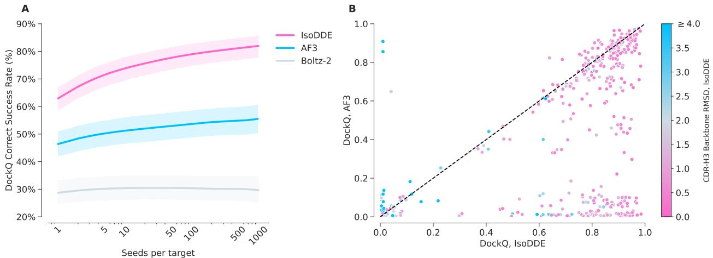  
Figure 13 | Comparison of IsoDDE and AF3 DockQ performance on the antibody-antigen test set (n $= 3 3 4$ PDB targets). A: Success Rates for DockQ correct $( > 0 . 2 3 )$ in seed scaling study comparing IsoDDE, AF3, and Boltz-2. B: DockQ comparison between AF3 and IsoDDE for all targets in the antibody test set. Each dot represents an antibody-antigen chain pair. Dots are coloured by their framework-aligned CDR-H3 loop backbone RMSD $\mathrm { \bar { ( A ) } }$ predicted by IsoDDE.

<table><tr><td>Set</td><td>IsoDDE</td><td>AF3</td><td>Mean Gain</td><td>95% CI Gain</td><td>N</td></tr><tr><td>Full</td><td>50.0%</td><td>23.3%</td><td>26.7%</td><td>[8.3%, 43.3%]</td><td>60</td></tr><tr><td>Filtered</td><td>44.0%</td><td>18.0%</td><td>26.0%</td><td>[8.0%, 44.0%]</td><td>50</td></tr><tr><td>Filtered + Clustered</td><td>37.2%</td><td>16.7%</td><td>20.5%</td><td>[2.5%,38.5%]</td><td>39</td></tr></table>

Table 4 | Comparison of IsoDDE and AF3 success rates in the lowest (0,20] similarity bin across different versions of the Runs N’ Poses set as reported in Figures 2 and 14. Gain $=$ IsoDDE success rate - AF3 success rate, $9 5 \%$ confidence interval on the gain is computed with bootstrapping, demonstrating the significant improvement of IsoDDE to AF3.

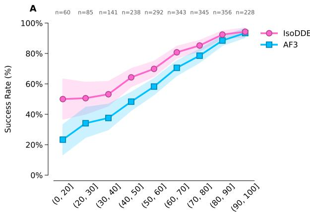  
Pocket and ligand shape similarity to the training set

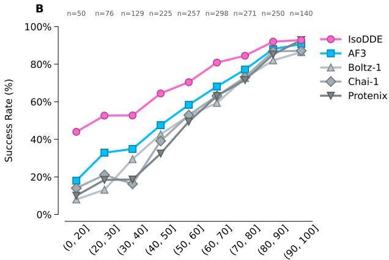  
Pocket and ligand shape similarity to the training set

Figure 14 | Additional results on the Runs $\mathrm { N } ^ { \prime }$ Poses benchmark. The success rate of the top confidence ranked prediction is plotted. Numbers on the top axis indicate the number of examples in each bin. A: Full dataset, showing comparison between AF3 and IsoDDE, with $9 5 \%$ confidence intervals. B: Filtered to remove 124 prevalent ligands highlighted in Škrinjar et al. (2025). The IsoDDE model reported here has the same training cutoff date as AF3 and is fully consistent with the similarity bins.

<table><tr><td>Set</td><td>IsoDDE</td><td>Boltz-2</td><td>Mean Gain</td><td>95% CI Gain</td><td>N</td></tr><tr><td>Full</td><td>43.5%</td><td>8.7%</td><td>34.8%</td><td>[13.0%,56.5%]</td><td>23</td></tr><tr><td>Filtered</td><td>29.4%</td><td>0.0%</td><td>29.4%</td><td>[11.8%,52.9%]</td><td>17</td></tr><tr><td>Filtered + Clustered</td><td>31.2%</td><td>0.0%</td><td>31.2%</td><td>[12.5%,56.2%]</td><td>16</td></tr></table>

Table 5 | Comparison of IsoDDE and Boltz-2 success rates in the lowest (0,20] similarity bin across different versions of the Runs $\mathrm { N } ^ { \prime }$ Poses set as reported in Figure 4. Gain $=$ IsoDDE success rate - Boltz-2 success rate, $9 5 \%$ confidence interval on the gain is computed with bootstrapping, demonstrating the significant improvement of IsoDDE to Boltz-2.

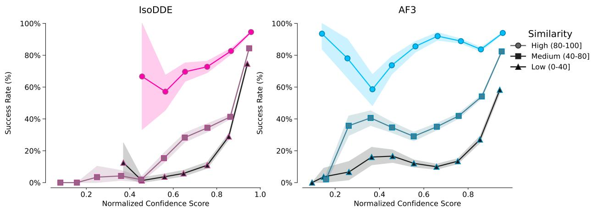  
Figure 15 | Success rate of protein-ligand pose prediction on the Runs $\mathbf { N } ^ { \prime }$ Poses set versus confidence scores from IsoDDE and AF3 models, showing that confidence score is well calibrated to success rate even for examples with low similarity to the training set, and the relationship is more monotonic for IsoDDE. Examples grouped by similarity bins computed as in Figure 2, with $9 5 \%$ confidence intervals. Confidence score bins with at least 5 examples are plotted. Even in the $\textless 4 0 \%$ similarity bins of the Runs $\mathbf { N } ^ { \prime }$ Poses data set, which correspond to novel structure-based design situations, the highest confidence IsoDDE predictions achieve around $7 0 \%$ success rate.

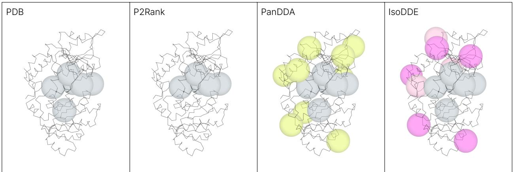  
Figure 16 | The pocket identification capability significantly expands our ligandable space both on the global, proteome level, and on a local, protein level. On a real project, IsoDDE provides us with novel pockets for a prospective campaign. From left to right, the plot shows the location of crystallised ligands for the target of interest and similar proteins in the PDB $( > 3 0 \%$ sequence identity to target, target in training set for IsoDDE), the location of predicted pockets by P2Rank (pocket probability ${ > } 0 . 1 $ ), the location of ligands from an in-house PanDDA fragment soaking experiment, and the location of predicted pockets by IsoDDE. Grey spheres represent pockets overlapping with the PDB ligands. Chartreuse spheres represent pockets identified by PanDDA beyond the pockets exemplified in the PDB. Dark pink spheres represent pockets identified by IsoDDE which match the location of the PanDDA experiment. Light pink spheres represent pockets uniquely identified by IsoDDE which are high confidence and were not present in the PanDDA experimental output. P2Rank recall on PDB pockets and PanDDA pockets was 0.83, 0.33 respectively. IsoDDE recall on PDB pockets and PanDDA pockets was 1.0 and 0.73, respectively.

# References

J. Abramson, J. Adler, J. Dunger, R. Evans, T. Green, A. Pritzel, O. Ronneberger, L. Willmore, A. J. Ballard, J. Bambrick, S. W. Bodenstein, D. A. Evans, C.-C. Hung, M. O’Neill, D. Reiman, K. Tunyasuvunakool, Z. Wu, A. Žemgulyt˙e, E. Arvaniti, C. Beattie, O. Bertolli, A. Bridgland, A. Cherepanov, M. Congreve, A. I. Cowen-Rivers, A. Cowie, M. Figurnov, F. B. Fuchs, H. Gladman, R. Jain, Y. A. Khan, C. M. R. Low, K. Perlin, A. Potapenko, P. Savy, S. Singh, A. Stecula, A. Thillaisundaram, C. Tong, S. Yakneen, E. D. Zhong, M. Zielinski, A. Žídek, V. Bapst, P. Kohli, M. Jaderberg, D. Hassabis, and J. M. Jumper. Accurate structure prediction of biomolecular interactions with AlphaFold 3. Nature, 630(8016):493–500, 2024. doi: 10.1038/s41586-024-07487-w.

M. Adrian, J. Dubochet, J. Lepault, and A. W. McDowall. Cryo-electron microscopy of viruses. Nature, 308(5954):32–36, 1984. doi: 10.1038/308032a0.

N. R. Bennett, J. L. Watson, R. J. Ragotte, A. J. Borst, D. L. See, C. Weidle, R. Biswas, Y. Yu, E. L. Shrock, R. Ault, et al. Atomically accurate de novo design of antibodies with RFdiffusion. Nature, 620:1089–1100, 2025. doi: 10.1038/s41586-023-06415-8.

M. Bubenik, P. Mader, P. Mochirian, F. Vallée, J. Clark, J.-F. Truchon, A. L. Perryman, V. Pau, I. Kurinov, K. E. Zahn, M.-E. Leclaire, R. Papp, M.-C. Mathieu, M. Hamel, N. M. Duffy, C. Godbout, M. Casas-Selves, J.-P. Falgueyret, P. S. Baruah, O. Nicolas, R. Stocco, H. Poirier, G. Martino, A. B. Fortin, A. Roulston, A. Chefson, S. Dorich, M. St-Onge, P. Patel, C. Pellerin, S. Ciblat, T. Pinter, F. Barabé, M. El Bakkouri, P. Parikh, C. Gervais, A. Sfeir, Y. Mamane, S. J. Morris, W. C. Black, F. Sicheri, and M. Gallant. Identification of rp-6685, an orally bioavailable compound that inhibits the dna polymerase activity of pol??. Journal of Medicinal Chemistry, 65(19):13198–13215, 2022. doi: 10.1021/acs.jmedchem.2c00998.

ByteDance AML AI4Science Team, X. Chen, Y. Zhang, C. Lu, W. Ma, J. Guan, C. Gong, J. Yang, H. Zhang, K. Zhang, S. Wu, K. Zhou, Y. Yang, Z. Liu, L. Wang, B. Shi, S. Shi, and W. Xiao. Protenix - advancing structure prediction through a comprehensive alphafold3 reproduction. bioRxiv, 2025. doi: 10.1101/2025.01.08.631967.

J. A. Capra, R. A. Laskowski, J. M. Thornton, M. Singh, and T. A. Funkhouser. Predicting protein ligand binding sites by combining evolutionary sequence conservation and 3d structure. PLoS Computational Biology, 5(12):e1000585, 2009. doi: 10.1371/journal.pcbi.1000585.

K. A. Carpenter and R. B. Altman. Databases of ligand-binding pockets and protein-ligand interactions. Computational and Structural Biotechnology Journal, 23:1320–1338, 2024. doi: 10.1016/j.csbj. 2024.03.015.

Chai Discovery team, J. Boitreaud, J. Dent, M. McPartlon, J. Meier, V. Reis, A. Rogozhonikov, and K. Wu. Chai-1: Decoding the molecular interactions of life. bioRxiv, 2024. doi: 10.1101/2024.10. 10.615955.

W. Chen, D. Cui, S. V. Jerome, M. Michino, E. B. Lenselink, D. J. Huggins, A. Beautrait, J. Vendome, R. Abel, R. A. Friesner, et al. Enhancing hit discovery in virtual screening through absolute protein– ligand binding free-energy calculations. Journal of Chemical Information and Modeling, 63(10): 3171–3185, 2023.

R. G. Coleman, M. Carchia, T. Sterling, J. J. Irwin, and B. K. Shoichet. Ligand pose and orientational sampling in molecular docking. PLOS ONE, 8(10):1–19, 10 2013. doi: 10.1371/journal.pone. 0075992.

M. L. Connolly. Analytical molecular surface calculation. Journal of Applied Crystallography, 16(5): 548–558, 1983. doi: 10.1107/S0021889883010985.

N. Corley, S. Mathis, R. Krishna, M. S. Bauer, T. R. Thompson, W. Ahern, M. W. Kazman, R. I. Brent, K. Didi, A. Kubaney, L. McHugh, A. Nagle, A. Favor, M. Kshirsagar, P. Sturmfels, Y. Li, J. Butcher, B. Qiang, L. L. Schaaf, R. Mitra, K. Campbell, O. Zhang, R. Weissman, I. R. Humphreys, Q. Cong, J. Funk, S. Sonthalia, P. Liò, D. Baker, and F. DiMaio. Accelerating biomolecular modeling with AtomWorks and RF3. bioRxiv, 2025. doi: 10.1101/2025.08.14.670328.   
P. da Silva, J. Mora, X. You, S. Wiechmann, M. Putyrski, J. Garcia-Pardo, et al. Neutralizing IL-38 activates $\gamma \delta$ T cell-dependent antitumor immunity and sensitizes for chemotherapy. Journal for ImmunoTherapy of Cancer, 12(4):e008641, 2024. doi: 10.1136/jitc-2023-008641.   
T. Dao, D. Y. Fu, S. Ermon, A. Rudra, and C. Ré. Flashattention: Fast and memory-efficient exact attention with io-awareness. arXiv, 2022. doi: 10.48550/arXiv.2205.14135.   
V. N. Dippon, Z. Rizvi, A. E. Choudhry, C.-w. Chung, I. F. Alkuraya, W. Xu, X. B. Tao, A. J. Jurewicz, J. L. Schneck, W. Chen, N. M. Curnutt, F. Kabir, K.-H. Chan, M. A. Queisser, C. Musetti, H. Dai, G. C. Lander, A. B. Benowitz, and C. M. Woo. Identification of an allosteric site on the E3 ligase adapter cereblon. Nature, pages 1–9, 2026. doi: 10.1038/s41586-025-09994-w.   
J. Dunbar and C. M. Deane. Anarci: antigen receptor numbering and receptor classification. Bioinformatics, 32(2):298–300, 09 2015. doi: 10.1093/bioinformatics/btv552.   
M. Eguida and D. Rognan. Estimating the similarity between protein pockets. International Journal of Molecular Sciences, 23(20):12462, 2022. doi: 10.3390/ijms232012462.   
R. Evans, M. O’Neill, A. Pritzel, N. Antropova, A. Senior, T. Green, A. Žídek, R. Bates, S. Blackwell, J. Yim, O. Ronneberger, S. Bodenstein, M. Zielinski, A. Bridgland, A. Potapenko, A. Cowie, K. Tunyasuvunakool, R. Jain, E. Clancy, P. Kohli, J. Jumper, and D. Hassabis. Protein complex prediction with AlphaFold-Multimer. bioRxiv, 2022. doi: 10.1101/2021.10.04.463034.   
P. G. Francoeur, T. Masuda, J. Sunseri, A. Jia, R. B. Iovanisci, I. Snyder, and D. R. Koes. Threedimensional convolutional neural networks and a cross-docked data set for structure-based drug design. Journal of Chemical Information and Modeling, 60(9):4200–4215, 2020. doi: 10.1021/acs. jcim.0c00411.   
P. Gainza, S. Wehrle, A. Van Hall-Beauvais, A. Marchand, A. Scheck, Z. Harteveld, S. Buckley, D. Ni, S. Tan, F. Sverrisson, et al. De novo design of protein interactions with learned surface fingerprints. Nature, 617(7959):176–184, 2023. doi: 10.1038/s41586-023-05993-x.   
E. A. Gay, D. L. Harris, J. W. Wilson, and B. E. Blough. The development of diphenyleneiodonium analogs as gpr3 agonists. Bioorganic & medicinal chemistry letters, 94:129427, 2023. doi: 10.1016/ j.bmcl.2023.129427.   
Genesis Research Team, A. Dobles, N. Jovic, K. Leidal, P. Murugan, D. C. Williams, D. Wulsin, N. Gruver, C. X. Ji, K. Pruegsanusak, G. Scarpellini, A. Sharma, W. Swiderski, A. Bootsma, R. S. Bowen, C. Chen, J. Chen, M. A. Dämgen, B. DiFrancesco, J. D. Fishman, A. Ivanova, Z. Kagin, D. Li-Bland, Z. Liu, I. Morozov, J. Ouyang-Zhang, F. C. P. IV, K. S. Shah, B. Shor, G. M. da Silva, R. Tal, M. Tessmer, C. Tilbury, C. Vetcher, D. Zeng, M. Al-Shedivat, A. Faust, E. N. Feinberg, M. V. LeVine, and M. Pan. Pearl: A foundation model for placing every atom in the right location. arXiv, 2025. doi: 10.48550/arXiv.2510.24670.   
L. Gerasimavicius, S. C. Biddie, and J. A. Marsh. A structure-guided approach to noncoding variant evaluation for transcription factor binding using AlphaFold 3. Nucleic Acids Research, 54(1): gkaf1417, 2026. doi: 10.1093/nar/gkaf1417.   
M. K. Gilson, J. Eberhardt, P. Škrinjar, J. Durairaj, X. Robin, and A. Kryshtafovych. Assessment of

pharmaceutical protein–ligand pose and affinity predictions in casp16. Proteins: Structure, Function, and Bioinformatics, 94:249–266, 2025. doi: 10.1002/prot.70061.

F. Glaser, R. J. Morris, R. J. Najmanovich, R. A. Laskowski, and J. M. Thornton. A method for localizing ligand binding pockets in protein structures. Proteins: Structure, Function, and Bioinformatics, 62 (2):479–488, 2006. doi: https://doi.org/10.1002/prot.20769.

P. J. Goodford. A computational procedure for determining energetically favorable binding sites on biologically important macromolecules. Journal of Medicinal Chemistry, 28(7):849–857, 1985. doi: 10.1021/jm00145a002.

R. J. Gowers, I. Alibay, D. W. Swenson, M. M. Henry, B. Ries, H. M. Baumann, J. R. Eastwood, J. A. Mitchell, D. Dotson, J. T. Horton, et al. The open free energy library. 2023. doi: 10.5281/zenodo. 8344248.

D. F. Hahn, C. I. Bayly, M. L. Boby, H. E. B. Macdonald, J. D. Chodera, V. Gapsys, A. S. Mey, D. L. Mobley, L. P. Benito, C. E. Schindler, et al. Best practices for constructing, preparing, and evaluating protein-ligand binding affinity benchmarks. Living journal of computational molecular science, 4(1): 1497, 2022. doi: 10.33011/livecoms.4.1.1497.

M. Hendlich, F. Rippmann, and G. Barnickel. LIGSITE: automatic and efficient detection of potential small molecule-binding sites in proteins. Journal of Molecular Graphics and Modelling, 15(6): 359–363, 1997. doi: 10.1016/s1093-3263(98)00002-3.

F. N. Hitawala and J. J. Gray. What does AlphaFold3 learn about antibody and nanobody docking, and what remains unsolved? mAbs, 17(1):2545601, 2025. doi: 10.1080/19420862.2025.2545601.

A. Honegger and A. Plückthun. Yet another numbering scheme for immunoglobulin variable domains: an automatic modeling and analysis tool. Journal of molecular biology, 309(3):657–670, 2001. doi: 10.1006/jmbi.2001.4662.

B. Huang and M. Schroeder. LIGSITEcsc: predicting ligand binding sites using the connolly surface and degree of conservation. BMC Structural Biology, 6(1):19, 2006. doi: 10.1186/1472-6807-6-19.

J. Jiménez, S. Doerr, G. Martínez-Rosell, A. S. Rose, and G. D. Fabritiis. DeepSite: protein-binding site predictor using 3d-convolutional neural networks. Bioinformatics, 33(19):3036–3042, 2017. doi: 10.1093/bioinformatics/btx350.

J. Jumper, R. Evans, A. Pritzel, T. Green, M. Figurnov, O. Ronneberger, K. Tunyasuvunakool, R. Bates, A. Žídek, A. Potapenko, A. Bridgland, C. Meyer, S. A. A. Kohl, A. J. Ballard, A. Cowie, B. Romera-Paredes, S. Nikolov, R. Jain, J. Adler, T. Back, S. Petersen, D. Reiman, E. Clancy, M. Zielinski, M. Steinegger, M. Pacholska, T. Berghammer, S. Bodenstein, D. Silver, O. Vinyals, A. W. Senior, K. Kavukcuoglu, P. Kohli, and D. Hassabis. Highly accurate protein structure prediction with AlphaFold. Nature, 596(7873):583–589, 2021. ISSN 0028-0836. doi: 10.1038/s41586-021-03819-2.

G. C. Kanakala, R. Aggarwal, D. Nayar, and U. D. Priyakumar. Latent biases in machine learning models for predicting binding affinities using popular data sets. ACS omega, 8(2):2389–2397, 2023. doi: 10.1021/acsomega.2c06781.

J. C. Kendrew, G. Bodo, H. M. Dintzis, R. G. Parrish, H. Wyckoff, and D. C. Phillips. A three-dimensional model of the myoglobin molecule obtained by x-ray analysis. Nature, 181(4610):662–666, 1958. doi: 10.1038/181662a0.

R. Krivák and D. Hoksza. P2rank: machine learning based tool for rapid and accurate prediction of ligand binding sites from protein structure. Journal of Cheminformatics, 10(1):39, 2018. doi: 10.1186/s13321-018-0285-8.

I. D. Kuntz. Structure-based strategies for drug design and discovery. Science, 257(5073):1078–1082, 1992. doi: 10.1126/science.257.5073.1078.

I. D. Kuntz, J. M. Blaney, S. J. Oatley, R. Langridge, and T. E. Ferrin. A geometric approach to macromolecule-ligand interactions. Journal of Molecular Biology, 161(2):269–288, 1982. doi: 10.1016/0022-2836(82)90153-x.

R. A. Laskowski. SURFNET: A program for visualizing molecular surfaces, cavities, and intermolecular interactions. Journal of Molecular Graphics, 13(5):323–330, 1995. doi: 10.1016/0263-7855(95) 00073-9.

A. T. R. Laurie and R. M. Jackson. Q-SiteFinder: an energy-based method for the prediction of protein–ligand binding sites. Bioinformatics, 21(9):1908–1916, 2005. doi: 10.1093/bioinformatics/ bti315.

A. Lavecchia. Machine-learning approaches in drug discovery: methods and applications. Drug discovery today, 20(3):318–331, 2015. doi: 10.1016/j.drudis.2014.10.012.

S. Leung, M. Bodkin, F. v. Delft, P. Brennan, and G. Morris. SuCOS is better than RMSD for evaluating fragment elaboration and docking poses. ChemRxiv, 2019. doi: 10.26434/chemrxiv.8100203.v1.

D. G. Levitt and L. J. Banaszak. POCKET: A computer graphics method for identifying and displaying protein cavities and their surrounding amino acids. Journal of Molecular Graphics, 10(4):229–234, 1992. doi: 10.1016/0263-7855(92)80074-n.

D. Liu, F. Young, K. D. Lamb, A. Claudio Quiros, A. Pancheva, C. J. Miller, C. Macdonald, D. L. Robertson, and K. Yuan. PLM-interact: extending protein language models to predict protein-protein interactions. Nature Communications, 16(1):9012, 2025. doi: 10.1038/s41467-025-64512-w.

V. Mariani, M. Biasini, A. Barbato, and T. Schwede. lDDT: a local superposition-free score for comparing protein structures and models using distance difference tests. Bioinformatics, 29(21): 2722–2728, 2013. doi: 10.1093/bioinformatics/btt473.

J. L. Medina-Franco. Grand challenges of computer-aided drug design: The road ahead. Frontiers in Drug Discovery, Volume 1, 2021. doi: 10.3389/fddsv.2021.728551.

S. Mosalaganti, A. Obarska-Kosinska, M. Siggel, R. Taniguchi, B. Turoňová, C. E. Zimmerli, K. Buczak, F. H. Schmidt, E. Margiotta, M.-T. Mackmull, W. J. H. Hagen, G. Hummer, J. Kosinski, and M. Beck. Ai-based structure prediction empowers integrative structural analysis of human nuclear pores. Science, 376(6598):eabm9506, 2022. doi: 10.1126/science.abm9506.

A. Motmaen, J. Dauparas, M. Baek, M. H. Abedi, D. Baker, and P. Bradley. Peptide-binding specificity prediction using fine-tuned protein structure prediction networks. Proceedings of the National Academy of Sciences, 120(9):e2216697120, 2023. doi: 10.1073/pnas.2216697120.

H. H. Nguyen, J. Park, S. Kang, and M. Kim. Surface plasmon resonance: a versatile technique for biosensor applications. Sensors, 15(5):10481–10510, 2015. doi: 10.3390/s150510481.

T. Nguyen, H. Le, T. P. Quinn, T. Nguyen, T. D. Le, and S. Venkatesh. GraphDTA: predicting drug– target binding affinity with graph neural networks. Bioinformatics, 37(8):1140–1147, 2021. doi: 10.1093/bioinformatics/btaa921.

NVIDIA. cuEquivariance, 2024. URL https://github.com/NVIDIA/cuEquivariance.

OpenFreeEnergy. IndustryBenchmarks2024: Processed results - combined mbar calculated dg data. https://github.com/OpenFreeEnergy/IndustryBenchmarks2024/blob/ ff41e5ad0fda89b352341e3f6511bee25db0000a/industry_benchmarks/analysis/ processed_results/combined_pymbar3_calculated_dg_data.csv, 2025.

M. O’Reilly, A. Cleasby, T. G. Davies, R. J. Hall, R. F. Ludlow, C. W. Murray, D. Tisi, and H. Jhoti. Crystallographic screening using ultra-low-molecular-weight ligands to guide drug design. Drug Discovery Today, 24(5):1081–1086, 2019. doi: 10.1016/j.drudis.2019.03.009.

H. Öztürk, E. Ozkirimli, and A. Özgür. Widedta: prediction of drug-target binding affinity. arXiv, 2019. doi: 10.48550/arXiv.1902.04166.

S. Passaro, G. Corso, J. Wohlwend, M. Reveiz, S. Thaler, V. R. Somnath, N. Getz, T. Portnoi, J. Roy, H. Stark, D. Kwabi-Addo, D. Beaini, T. Jaakkola, and R. Barzilay. Boltz-2: Towards accurate and efficient binding affinity prediction. bioRxiv, 2025. doi: 10.1101/2025.06.14.659707.

Protenix Team. Protenix-v1: Toward high-accuracy open-source biomolecular structure prediction. 2026. URL https://github.com/bytedance/Protenix/blob/main/docs/PTX_V1_ Technical_Report_202602042356.pdf.

Z. Qiao, F. Ding, T. Dresselhaus, M. A. Rosenfeld, X. Han, O. Howell, A. Iyengar, S. Opalenski, A. S. Christensen, S. K. Sirumalla, F. R. Manby, T. F. M. III, and M. Welborn. Neuralplexer3: Accurate biomolecular complex structure prediction with flow models. arXiv, 2024. doi: 10.48550/arXiv. 2412.10743.

C. Regep, G. Georges, J. Shi, B. Popovic, and C. M. Deane. The H3 loop of antibodies shows unique structural characteristics. Proteins: Structure, Function, and Bioinformatics, 85(7):1311–1318, 2017. doi: 10.1002/prot.25291.

K. E. J. Rödström, A. Cloake, J. Sörmann, et al. Extracellular modulation of TREK-2 activity with nanobodies provides insight into the mechanisms of K2P channel regulation. Nature Communications, 15(1):4173, 2024. doi: 10.1038/s41467-024-48536-2.

G. A. Ross, C. Lu, G. Scarabelli, S. K. Albanese, E. Houang, R. Abel, E. D. Harder, and L. Wang. The maximal and current accuracy of rigorous protein-ligand binding free energy calculations. Communications Chemistry, 6(1):222, 2023. doi: 10.1038/s42004-023-01019-9.

J. Ruppert, W. Welch, and A. N. Jain. Automatic identification and representation of protein binding sites for molecular docking. Protein Science, 6(3):524–533, 1997. doi: 10.1002/pro.5560060302.

E. W. Schmid and J. C. Walter. Predictomes, a classifier-curated database of alphafold-modeled proteinprotein interactions. Molecular cell, 85(6):1216–1232, 2025. doi: 10.1016/j.molcel.2025.01.034.

P. Schmidtke, A. Bidon-Chanal, F. J. Luque, and X. Barril. MDpocket: open-source cavity detection and characterization on molecular dynamics trajectories. Bioinformatics, 27(23):3276–3285, 2011. doi: 10.1093/bioinformatics/btr550.

F. Sestak, L. Schneckenreiter, J. Brandstetter, S. Hochreiter, A. Mayr, and G. Klambauer. VN-EGNN: E(3)- equivariant graph neural networks with virtual nodes enhance protein binding site identification. arXiv, 2024. doi: 10.48550/arxiv.2404.07194.

C. Shao, J. D. Westbrook, C. Lu, C. Bhikadiya, E. Peisach, J. Y. Young, J. M. Duarte, R. Lowe, S. Wang, Y. Rose, Z. Feng, and S. K. Burley. Simplified quality assessment for small-molecule ligands in the protein data bank. Structure, 30(2):252–262.e4, 2022. doi: 10.1016/j.str.2021.10.003.

P. Škrinjar, J. Eberhardt, G. Tauriello, T. Schwede, and J. Durairaj. Have protein-ligand cofolding methods moved beyond memorisation? bioRxiv, 2025. doi: 10.1101/2025.02.03.636309.

S. L. Song, B. Kruft, M. Zhang, C. Li, S. Chen, C. Zhang, M. Tanaka, X. Wu, J. Rasley, A. A. Awan, C. Holmes, M. Cai, A. Ghanem, Z. Zhou, Y. He, P. Luferenko, D. Kumar, J. Weyn, R. Zhang, S. Klocek, V. Vragov, M. AlQuraishi, G. Ahdritz, C. Floristean, C. Negri, R. Kotamarthi, V. Vishwanath, A. Ramanathan, S. Foreman, K. Hippe, T. Arcomano, R. Maulik, M. Zvyagin, A. Brace, B. Zhang, C. O. Bohorquez, A. Clyde, B. Kale, D. Perez-Rivera, H. Ma, C. M. Mann, M. Irvin, J. G. Pauloski, L. Ward, V. Hayot, M. Emani, Z. Xie, D. Lin, M. Shukla, I. Foster, J. J. Davis, M. E. Papka, T. Brettin, P. Balaprakash, G. Tourassi, J. Gounley, H. Hanson, T. E. Potok, M. L. Pasini, K. Evans, D. Lu, D. Lunga, J. Yin, S. Dash, F. Wang, M. Shankar, I. Lyngaas, X. Wang, G. Cong, P. Zhang, M. Fan, S. Liu, A. Hoisie, S. Yoo, Y. Ren, W. Tang, K. Felker, A. Svyatkovskiy, H. Liu, A. Aji, A. Dalton, M. Schulte, K. Schulz, Y. Deng, W. Nie, J. Romero, C. Dallago, A. Vahdat, C. Xiao, T. Gibbs, A. Anandkumar, and R. Stevens. DeepSpeed4Science initiative: Enabling large-scale scientific discovery through sophisticated ai system technologies. arXiv, 2023. doi: 10.48550/arXiv.2310.04610.   
M. Sorgenfrei, L. M. Hürlimann, A. Printz, et al. Rapid detection and capture of clinical Escherichia coli strains mediated by OmpA-targeting nanobodies. Communications Biology, 8(1):1047, Jul 2025. doi: 10.1038/s42003-025-08345-9.   
H. Stark, F. Faltings, M. Choi, Y. Xie, E. Hur, T. J. O’Donnell, A. Bushuiev, T. Uçar, S. Passaro, W. Mao, et al. Boltzgen: Toward universal binder design. bioRxiv, 2025. doi: 10.1101/2025.11.20.689494.   
The OpenFold3 Team. OpenFold3-preview, 2025. URL https://github.com/aqlaboratory/ openfold-3.   
A. A. Thompson, M. B. Harbut, P.-P. Kung, N. K. Karpowich, J. D. Branson, J. C. Grant, D. Hagan, H. A. Pascual, G. Bai, R. B. Zavareh, H. R. Coate, B. C. Collins, M. Côte, C. F. Gelin, K. L. Damm-Ganamet, H. Gholami, A. R. Huff, L. Limon, K. J. Lumb, P. A. Mak, K. M. Nakafuku, E. V. Price, A. Y. Shih, M. Tootoonchi, N. A. Vellore, J. Wang, N. Wei, J. Ziff, S. B. Berger, J. P. Edwards, A. Gardet, S. Sun, J. E. Towne, J. D. Venable, Z. Shi, H. Venkatesan, M.-L. Rives, S. Sharma, B. T. Shireman, and S. J. Allen. Identification of small-molecule protein–protein interaction inhibitors for nkg2d. Proceedings of the National Academy of Sciences, 120(18):e2216342120, 2023. doi: 10.1073/pnas.2216342120.   
O. Trott and A. J. Olson. AutoDock vina: Improving the speed and accuracy of docking with a new scoring function, efficient optimization, and multithreading. Journal of Computational Chemistry, 31(2):455–461, 2010. doi: 10.1002/jcc.21334.   
J. S. Utgés and G. J. Barton. Comparative evaluation of methods for the prediction of protein–ligand binding sites. Journal of Cheminformatics, 16(1):126, 2024. doi: 10.1186/s13321-024-00923-z.   
D. Van Der Spoel, E. Lindahl, B. Hess, G. Groenhof, A. E. Mark, and H. J. C. Berendsen. GROMACS: Fast, flexible, and free. Journal of Computational Chemistry, 26(16):1701–1718, 2005. doi: 10.1002/jcc.20291.   
I. Wallach, M. Dzamba, and A. Heifets. Atomnet: A deep convolutional neural network for bioactivity prediction in structure-based drug discovery. arXiv, 2015. doi: 10.48550/arXiv.1510.02855.   
B. J. Williams-Noonan, E. Yuriev, and D. K. Chalmers. Free energy methods in drug design: Prospects of “alchemical perturbation” in medicinal chemistry. Journal of Medicinal Chemistry, 61(3):638–649, 2018. doi: 10.1021/acs.jmedchem.7b00681.   
J. Wohlwend, G. Corso, S. Passaro, M. Reveiz, K. Leidal, W. Swiderski, T. Portnoi, I. Chinn, J. Silterra, T. Jaakkola, and R. Barzilay. Boltz-1 democratizing biomolecular interaction modeling. bioRxiv, 2024. doi: 10.1101/2024.11.19.624167.   
S. Xu, Q. Feng, and BEAM-Labs. Foldbench: An all-atom benchmark for biomolecular structure

prediction, 2026a. URL https://github.com/BEAM-Labs/FoldBench. Accessed: 2026-01- 16.   
S. Xu, Q. Feng, L. Qiao, H. Wu, T. Shen, Y. Cheng, S. Zheng, and S. Sun. Benchmarking all-atom biomolecular structure prediction with FoldBench. Nature Communications, 17:442, 2026b. doi: 10.1038/s41467-025-67127-3.   
X. Yang, X. Wang, Z. Xu, C. Wu, Y. Zhou, Y. Wang, G. Lin, K. Li, M. Wu, A. Xia, J. Liu, L. Cheng, J. Zou, W. Yan, Z. Shao, and S. Yang. Molecular mechanism of allosteric modulation for the cannabinoid receptor CB1. Nature Chemical Biology, 18(8):831–840, 2022a. doi: 10.1038/s41589-022-01038-y.   
Z. Yang, W. Zhong, L. Zhao, and C. Y.-C. Chen. MGraphDTA: deep multiscale graph neural network for explainable drug–target binding affinity prediction. Chemical science, 13(3):816–833, 2022b. doi: 10.1039/D1SC05180F.   
B. Zdrazil, E. Felix, F. Hunter, E. J. Manners, J. Blackshaw, S. Corbett, M. de Veij, H. Ioannidis, D. M. Lopez, J. Mosquera, M. Magarinos, N. Bosc, R. Arcila, T. Kizilören, A. Gaulton, A. Bento, M. Adasme, P. Monecke, G. Landrum, and A. Leach. The ChEMBL database in 2023: a drug discovery platform spanning multiple bioactivity data types and time periods. Nucleic Acids Research, 52 (D1):D1180–D1192, 01 2024. ISSN 0305-1048. doi: 10.1093/nar/gkad1004. URL https: //doi.org/10.1093/nar/gkad1004.   
J. Zhang, R. Yuan, A. Kryshtafovych, R. C. Kretsch, R. D. Schaeffer, J. Zhou, R. Das, N. V. Grishin, and Q. Cong. Assessment of protein complex predictions in CASP16: Are we making progress? bioRxiv, 2025. doi: 10.1101/2025.05.29.656875.   
Y. Zhou, C. Lu, Y. Ma, W. Qu, F. Ye, K. Zhang, L. Wang, M. Gui, and Q. Gu. Seedfold: Scaling biomolecular structure prediction. arXiv, 2025. doi: 10.48550/arXiv.2512.24354.   
R. W. Zwanzig. High-temperature equation of state by a perturbation method. I. nonpolar gases. Journal of Chemical Physics, 22:1420–1426, 1954. doi: 10.1063/1.1740409.   
V. Škrhák, M. Novotný, C. P. Feidakis, R. Krivák, and D. Hoksza. CryptoBench: cryptic protein–ligand binding sites dataset and benchmark. Bioinformatics, 41(1):btae745, 12 2024. doi: 10.1093/ bioinformatics/btae745.