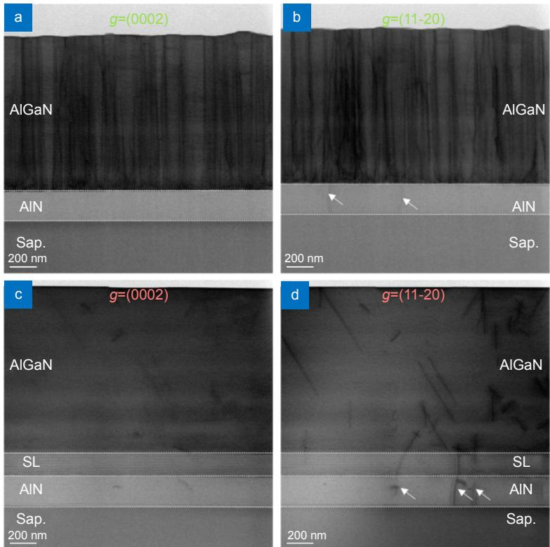
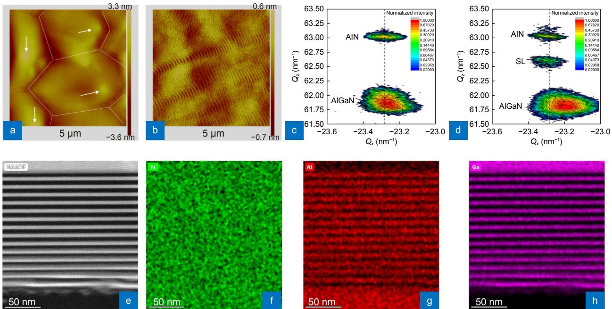
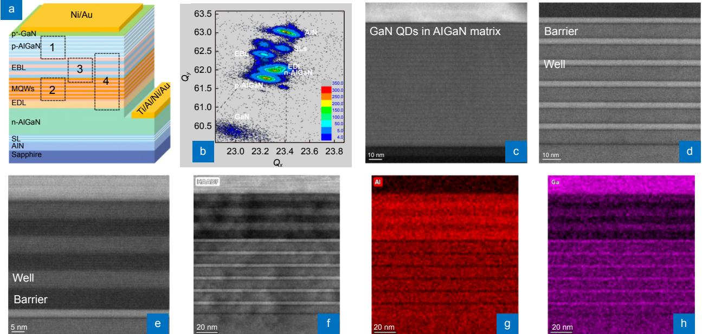
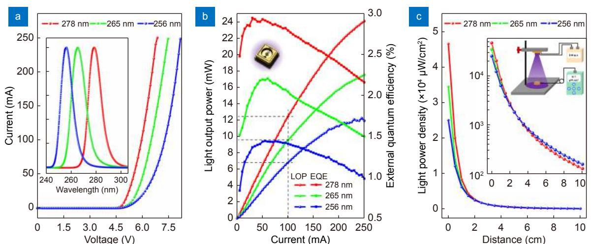
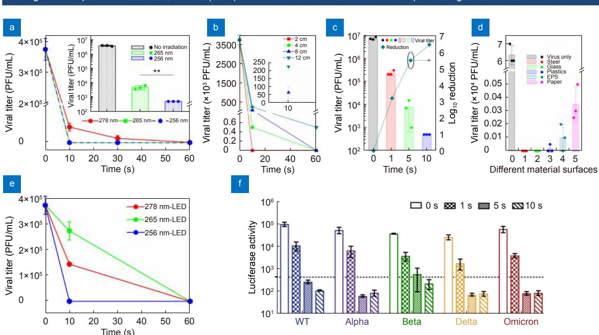
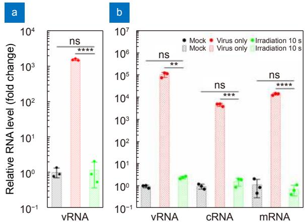

# Opto-Electronic Advances

ISSN 2096-4579

CN 51-1781/TN

# Rapid inactivation of human respiratory RNA viruses by deep ultraviolet irradiation from light-emitting diodes on a high-temperature-annealed AlN/Sapphire template

Ke Jiang, Simeng Liang, Xiaojuan Sun, Jianwei Ben, Liang Qu, Shanli Zhang, Yang Chen, Yucheng Zheng, Ke Lan, Dabing Li and Ke Xu

Citation: Jiang K, Liang SM, Sun XJ, Ben JW, Qu L et al. Rapid inactivation of human respiratory RNA viruses by deep ultraviolet irradiation from light-emitting diodes on a high-temperature-annealed AlN/Sapphire template. Opto-Electron Adv 6, 230004(2023).

https://doi.org/10.29026/oea.2023.230004

Received: 23 January 2023; Accepted: 24 April 2023; Published online: 15 June 2023

# Related articles

# Deep-ultraviolet photonics for the disinfection of SARS-CoV-2 and its variants (Delta and Omicron) in the cryogenic environment

Wenyu Kang, Jing Zheng, Jiaxin Huang, Lina Jiang, Qingna Wang, Zhinan Guo, Jun Yin, Xianming Deng, Ye Wang, Junyong Kang Opto-Electronic Advances 2023 , doi: 10.29026/oea.2023.220201

# Rapid inactivation of human respiratory RNA viruses by deep ultraviolet irradiation from light-emitting diodes on a high-temperatureannealed AlN/Sapphire template

Ke Jiang1,2†, Simeng Liang3†, Xiaojuan $\mathsf { S u n } ^ { 1 , 2 * }$ , Jianwei $\mathrm { B e n } ^ { 1 , 2 }$ , Liang ${ { \mathrm { Q } } { \mathrm { u } } ^ { 3 } } .$ , Shanli Zhang1,2, Yang Chen1,2, Yucheng Zheng3, Ke Lan3,4, Dabing $\operatorname { L i } ^ { 1 , 2 * }$ and Ke ${ \mathrm { X u } } ^ { 3 , 4 * }$

Efficient and eco-friendly disinfection of air-borne human respiratory RNA viruses is pursued in both public environment and portable usage. The AlGaN-based deep ultraviolet (DUV) light-emission diode (LED) has high practical potentials because of its advantages of variable wavelength, rapid sterilization, environmental protection, and miniaturization. Therefore, whether the emission wavelength has effects on the disinfection as well as whether the device is feasible to sterilize various respiratory RNA viruses under portable conditions is crucial. Here, we fabricate AlGaN-based DUV LEDs with different wavelength on high-temperature-annealed (HTA) AlN/Sapphire templates and investigate the inactivation effects for several respiratory RNA viruses. The AlN/AlGaN superlattices are employed between the template and upper n-AlGaN to release the strong compressive stress (SCS), improving the crystal quality and interface roughness. DUV LEDs with the wavelength of 256, 265, and $2 7 8 { \mathsf { n m } }$ , corresponding to the light output power of 6.8, 9.6, and $1 2 . 5 \mathrm { m W }$ are realized, among which the $2 5 6 ~ \mathsf { n m }$ -LED shows the most potent inactivation effect in human respiratory RNA viruses, including SARS-CoV-2, influenza A virus (IAV), and human parainfluenza virus (HPIV), at a similar light power density (LPD) of ${ \sim } 0 . 8 \ \mathrm { m W } / \mathrm { c m } ^ { 2 }$ for $\boldsymbol { 1 0 \ { \mathsf { s } } }$ . These results will contribute to the advanced DUV LED application of disinfecting viruses with high potency and broad spectrum in a portable and eco-friendly use.

Keywords: AlGaN; DUV LED; superlattice; SARS-CoV-2; influenza A virus

Jiang K, Liang SM, Sun XJ, Ben JW, Qu L et al. Rapid inactivation of human respiratory RNA viruses by deep ultraviolet irradiation from light-emitting diodes on a high-temperature-annealed AlN/Sapphire template. Opto-Electron Adv 6, 230004 (2023).

# Introduction

Human respiratory RNA viruses, such as SARS-CoV-2 and IAV, spread rapidly in the human population by airway transmission and caused substantial morbidity, mortality, economic losses, and pandemic diseases worldwide1. COVID-19 has caused more than 636 million confirmed infection cases and 6.6 million deaths globally till Dec. 20222. During the COVID-19 pandemic, an additional 3311831 samples of respiratory viruses were collected during inpatient and outpatient surveillance, of which $1 9 \%$ (614,907) were positive for IAV from late 2019 to 2020, according to the WHO report3. IAV and SARS-CoV-2 are both air-borne transmitted viruses that efficiently spread through large air-flowing respiratory droplets and aerosols4. Aerosolized droplets can fall onto the nearest surface or form aerosols that can persist for up to 30 hours in air5−7. Surface contact could also transmit IAV and SARS- $\mathrm { C o V } { - } 2 ^ { 8 - 9 }$ . Studies have shown that IAV and SARS-CoV-2 can survive for 1–2 and 2–3 days on hard, nonporous surfaces such as stainless steel and plastic, respectively10−11. Although both consist of RNA, the genome of SARS-CoV-2 and IAV, two typical human respiratory viruses that populations are susceptible to, has its unique characteristics12−14. Hence, more efficient and broad-spectrum disinfection method should be developed for surface and environmental disinfection to reduce the risk of human respiratory RNA virus transmission.

DUV light irradiation is an effective virus inactivation method through damaging viral genomes15−18. Mercury lamps are conventionally used in virus disinfection but suffer the disadvantages of toxicity, fragility, bulkiness, short lifetime, and ozone production. Moreover, according to the Minamata Convention on Mercury, the manufacture, import, and export of a myriad of products containing mercury have been prohibited since $2 0 2 0 ^ { 1 9 - 2 2 }$ . Hence, an eco-friendly and efficient germicidal candidate is now eagerly demanded. A DUV LED based on Al-GaN, whose wavelength is tunable from 365 to $2 1 0 ~ \mathrm { { n m } }$ , is a perfect alternative to mercury lamps to sterilize due to its merits of pollution-free, small-size, energy-conservation and so $\scriptstyle \mathbf { o n } ^ { 2 3 - 2 6 }$ . A lot of investigations have demonstrated the AlGaN-based DUV LEDs can effectively inactive bacteria such as Escherichia coli, Staphylococcus aureus, Candida albicans, etc. and different bacteria have different sensitivity to different wavelength20,27−32. It is found the wavelength below $2 6 0 ~ \mathrm { { n m } }$ exhibit better inactivation effect on bacteria. However, studies for the disinfection effects on SARS-CoV-2 and IAV by AlGaNbased LED usually focus on the wavelength from 265 to $3 6 5 ~ \mathrm { { n m } }$ , with an integrated light source mode and a low virus concentration16,33−38. The inactivation effects of more portable and even shorter wavelength AlGaNbased DUV LED on SARS-CoV-2 and IAV must be more precisely estimated.

AlGaN-based DUV LEDs are usually heteroepitaxially grown on AlN/Sapphire template since AlN single-crystal substrates are too expensive. High-quality AlN/Sapphire templates are obtained in the last two decades through two-step growth, interlayer, $\mathrm { N H } _ { 3 }$ pulse-flow, mobility enhanced epitaxy, epitaxial lateral overgrowth, and HTA39−43. Among these methods, the HTA method may be the most promising for industrial application due to its simplicity, high efficiency, and stability44−45. However, the HTA AlN/Sapphire template usually exhibits SCS, which significantly affect the upper AlGaN quality46−47. On the one hand, the SCS can induce the Stranski-Krastanov (S-K) growth mode and result in 3D islands, leading to a high density of threading dislocations and rough surfaces48−49. On the other hand, the SCS will cause a pulling effect, leading to composition nonuniformity and low p-doping efficiency. Furthermore, the SCS will very likely deteriorate the device during fabrication processes50. Hence, relaxation of the SCS during epitaxy on the HTA AlN/Sapphire template is necessary.

In this work, we fabricate AlGaN-based DUV LEDs with different peak wavelength of 256, 265, and $2 7 8 ~ \mathrm { n m }$ on SCS HTA AlN/Sapphire templates and investigate their inactivation effects on human respiratory RNA viruses. Directly growing an AlGaN epilayer on a HTA AlN/Sapphire template will induce a high density of dislocations and a rough interface and surface, resulting in nonluminescence of the upper LEDs. To relax the SCS, the AlN/AlGaN superlattices (SLs) are inserted between the template and upper AlGaN epilayer. The dislocations and rough surfaces are suppressed, based on which DUV LEDs are fabricated. Furthermore, we find that the 256 nm-LED shows the highest inactivation effect against SARS-CoV-2 $( > 2 . 3 { \times } 1 0 ^ { 4 }$ PFUs, $1 0 0 \%$ of the initial titer), IAV $( > 3 . 8 { \times } 1 0 ^ { 6 }$ PFUs, $9 9 . 9 9 \%$ of the initial titer), and HPIV $( > 1 . 1 \times 1 0 ^ { 5 }$ T $\mathrm { C I D } _ { 5 0 }$ , $1 0 0 \%$ of the initial titer) within $1 0 \ s$ at a distance of $4 \ \mathrm { c m }$ $( { \sim } 0 . 8 \mathrm { \ m W / c m ^ { 2 } } )$ ). Meanwhile, the $2 5 6 \ \mathrm { n m }$ -LED can disinfect viruses on smooth and rough surfaces and destroy all three types of viral genes. The results provide an effective method to alleviate the adverse impacts of the SCS of the HTA AlN/Sapphire template on the upper epilayer, thus offering advanced inactivation effects against these respiratory viruses.

# Experimental details

# HTA AlN/Sapphire template fabrication and n-AlGaN epilayer growth

First, $2 0 0 \ \mathrm { n m }$ AlN films are sputtered on $\pmb { c }$ -Sapphire substrates at $6 5 0 ~ ^ { \circ } \mathrm { C }$ in a $\mathrm { N } _ { 2 }$ atmosphere with a chamber pressure of 4 mTorr $\mathrm { 1 ~ T o r r = 1 } 3 3 . 3 2 2 ~ \mathrm { P a } )$ . Then, the sputtered templates are annealed at $1 7 5 0 ~ ^ { \circ } \mathrm { C }$ for 1 hour using a face-to-face geometry in a $\Nu _ { 2 }$ atmosphere. n-Al-GaN epilayers are grown on the HTA templates by $9 \times 2 "$ showerhead metal-organic chemical vapor deposition (MOCVD). TMGa, TMAl and $\mathrm { N H } _ { 3 }$ are used as the Ga, Al and N precursors, respectively, and $\mathrm { S i H _ { 4 } }$ is used as the $\mathbf { n }$ -type doping source. The HTA templates are first thermally cleaned in a $\mathrm { H } _ { 2 }$ and $\mathrm { N H } _ { 3 }$ mixed gas atmosphere at $8 5 0 ~ ^ { \circ } \mathrm { C }$ to remove surface contamination. Then, the temperature is ramped up to $1 1 5 0 ~ ^ { \circ } \mathrm { C }$ to grow an n-AlGaN epilayer at 50 mbar. The total n-AlGaN thickness is ${ \sim } 1 . 2 ~ \mu \mathrm { m }$ , and the target Al content is approximately $5 5 \%$ . To release the SCS of the n-AlGaN epilayer, SLs are inserted between the template and the upper n-AlGaN epilayer. After removing surface contamination and ramping up the temperature, an AlN barrier layer and an AlGaN well layer with an Al content of $8 0 \%$ are successively grown for 60 and $3 0 ~ \mathsf { s } .$ , respectively, and the process is repeated 14 times. Last, an AlN barrier cap layer is grown. The growth temperature of the SLs is the same as that of the n-AlGaN epilayer. The total thickness of the SLs is approximately $1 7 0 \mathrm { n m }$ .

# Device growth and fabrication

DUV LED wafers are grown based on the n-AlGaN epilayer with and without SLs. Additionally, TMGa, TMAl and $\mathrm { N H } _ { 3 }$ are used as the Ga, Al and N precursors, respectively, and $\mathrm { S i H _ { 4 } }$ is used as the n-type doping source. In addition, $\mathrm { C p 2 M g }$ is used as the p-type doping source. On the $\mathbf { n }$ -AlGaN layer, a Si-doped AlGaN electron acceleration layer (EDL) of approximately $5 0 ~ \mathrm { { n m } }$ is grown. Then, AlGaN multiple quantum wells (MQWs) and a $\mathrm { M g }$ -doped AlGaN SL electron blocking layer (EBL) are grown. Next, a $1 0 0 \mathrm { n m p }$ -AlGaN layer is grown above the EBL as the hole injection layer (HIL) using the quantum engineering p-doping method51. Lastly, a p-GaN cap layer of approximately $2 0 ~ \mathrm { { n m } }$ is grown on the p-AlGaN HIL to form a better p-type ohmic contact. By controlling the flow ratio of the Al and Ga sources during growth, the Al content of each layer can be tuned, thus modulating the emission wavelength of the wafers. After epitaxial growth, ex situ annealing at $9 0 0 ^ { \circ } \mathrm { C }$ in a $\Nu _ { 2 }$ atmosphere for $1 0 \ \mathrm { m i n }$ is implemented on the as-grown wafers to further remove H atoms combined with $\mathrm { M g }$ atoms. Then, standard DUV LED fabrication processes, including mask layer deposition by plasma-enhanced chemical vapor deposition (PECVD), standard photolithography, mask layer etching by reactive ion etching (RIE), mesa etching by inductively coupled plasma (ICP) etching, electrode deposition and activation by electron beam evaporation, thermal evaporation, sputtering and fast thermal annealing, are used to fabricate $1 0 { \times } 2 0 ~ \mathrm { m i l } ^ { 2 }$ LED chips. Finally, flip-chip packaging technology is adopted for the chips to realize LED devices.

# Material and device characterizations

Transmission electron microscopy-ready (TEM) samples are prepared using the in situ focused ion beam (FIB) lift out technique on an FEI Dual Beam FIB/SEM. The samples are capped with sputtered C and $\mathrm { e { - P t / I { - P t } } }$ prior to milling. The TEM lamella is approximately $1 0 0 \ \mathrm { n m }$ . The samples are imaged by an FEI Tecnai TF-20 FEG/TEM at $2 0 0 \mathrm { k V }$ in bright-field (BF) scanning transmission electron microscopy (STEM) mode and highangle annular dark-field scanning transmission electron microscopy (HAADF-STEM) mode. The STEM probe size is $1 { - } 2 \ \mathrm { n m }$ in nominal diameter. Energy dispersive spectroscopy (EDS) mappings are acquired on an Oxford INCA Bruker Quantax EDS system. Atomic force microscopy (AFM) images are obtained with Bruker Multimode 8 equipment. X-ray diffraction (XRD) reciprocal space mappings (RSM) measurements are performed on Bruker D8 Discover equipment using the Cu $\mathrm { K } _ { \mathfrak { a } 1 }$ radiation line with a wavelength of $0 . 1 5 4 0 6 \mathrm { n m }$ . Current-voltage (IV) curves of the DUV LEDs are measured by a PDA FS-Pro 380 semiconductor analyzer, and electroluminescence (EL) spectra are obtained by an Omni- $\cdot \lambda$ 300i grating spectrometer with 1200 lines/mm. The wavelength step is fixed at $0 . 1 \ \mathrm { n m }$ . The light-outputpower (LOP) curves are measured by an AIS-2 LED integrating sphere equipped with a HAAS-2000 UV spectral radiometer and an LED300E power supply in continuous wave mode. The light-power-density (LPD) of the devices is measured by a Linshang LS125 UV light meter equipped with a UVCLED-X0 probe in atmosphere.

# Cells and viruses

MDCK and Vero E6 cells are obtained from ATCC. The BHK21-hACE2 cell line is provided by Professor Huan Yan, Wuhan University. All cells are maintained in Dulbecco’s modified Eagle’s medium (DMEM; Gibco) supplemented with $1 0 \%$ fetal bovine serum (FBS) and incubated at $3 7 ~ ^ { \circ } \mathrm { C }$ in $5 \% \mathrm { C O } _ { 2 }$ . The A/WSN/33 virus is generated by reverse genetics as previously described52.

Human parainfluenza virus (HPIV3) is obtained from Professor MingZhou Chen, Wuhan University. The SARS-CoV-2 live virus (strain IVCAS 6.7512) is provided by the National Virus Resource, Wuhan Institute of Virology, Chinese Academy of Sciences.

# Pseudovirus production

The DNA sequences of human codon-optimized S proteins from SARS-COV-2 variants (Alpha, GISAID: EPI-ISL-601443; Beta, GISAID: EPI_ISL_678597; Delta, GISAID: EPI_ISL_2029113; Omicron, GISAID: EPI_ISL_7162071) are cloned into the pCAGGS vector with C-terminal 18 aa truncation (SARS-CoV-2-S-Δ18). Pseudotyped VSV-ΔG viruses expressing a luciferase reporter are provided by Professor Ningshao Xia, Xiamen University. Pseudotyped SARS-CoV-2 virus particles are produced as previously described53. Briefly, Vero E6 cells are seeded in $1 0 \ \mathrm { c m }$ -dishes and simultaneously transfected with $1 5 \ \mu \mathrm { g }$ of SARS-CoV-2-S-Δ18 plasmid using Lipofectamine 2000 (ThermoFisher). Forty-eight hours post-transfection, $5 0 0 ~ \mu \mathrm { L }$ of VSV-ΔG virus is used to infect Vero E6 cells. Cell supernatants containing pSARS-$\mathrm { C o V } { - } 2$ virus with a VSV backbone are collected after another $2 4 \mathrm { h }$ , cleared of cell debris by centrifugation at 3000 rpm for 6 minutes, aliquoted, and stored at $- 8 0 ~ ^ { \circ } \mathrm { C }$ .

# Device irradiation and viral titer detection

For irradiation experiments, $6 0 ~ \mu \mathrm { L }$ of a virus suspension $\mathrm { 1 - 2 ~ m m }$ depth) is placed in a defined well of a 24-well plate or on the surface of stainless steel, glass, plastic, cystosepiment, or paper, and the virus suspension is exposed to the designated device. Considering the low transmittance of UVC light in the culture medium, we dilute the virus suspension in PBS before irradiation54. After irradiation, each virus inoculum is tenfold serially diluted and subjected to the plaque assay or the $5 0 \%$ tissue culture infectious dose $( \mathrm { T C I D } _ { 5 0 } ,$ ) assay for the live viral titer test.

To titrate IAV, plaque assay is applied by immunostaining as previously described55. Briefly, MDCK cells $5 . 0 { \times } 1 0 ^ { 4 }$ cells) are seeded on a 48-well plate one day before. Cells are then infected with tenfold serial dilutions of viruses in PBS $1 0 ^ { 2 }$ to $1 0 ^ { 7 }$ times dilution). After incubation at $3 7 ^ { \circ } \mathrm { C }$ for $^ { 1 \mathrm { h } , }$ Avicel medium ( $2 . 4 \%$ Avicel (FMC Corporation) mixed with $2 \times$ DMEM) is added to each well. After two days, the overlay medium is moved and cells are then fixed with $4 \%$ formaldehyde and permeabilized with $0 . 3 \%$ Triton X-100. Immuno-staining is performed using an anti-NP polyclonal antibody conjugated to HRP (Hangzhou HKIG Biotech Co. Ltd). Individual infected plaque is visible by True Blue substrate (KPL).

For SARS-CoV-2 titer detection, plaque assay is applied by crystal violet staining. Vero E6 cells ${ \mathrm { . 1 . 0 } } { \times } 1 0 ^ { 5 }$ cells) are seeded on a 24-well plate and cultured overnight. Cells are infected with tenfold serial dilutions of a SARS-CoV-2 virus stock in DMEM and incubated at $3 7 ~ ^ { \circ } \mathrm { C }$ for $^ \mathrm { ~ 1 ~ h ~ }$ . Inocula are replaced with Aquacide II (Calibiochem, CAS 9004-32-4) containing DMEM and $5 \%$ FBS. After 3 days, the overlay medium is moved and cells are fixed with $4 \%$ formaldehyde. Individual infected plaque is visible by crystal violet staining.

For HPIV3 titer detection, the $5 0 \%$ tissue culture infectious dose $\mathrm { ( T C I D } _ { 5 0 } )$ is applied by observing membrane fusion as previously described56. Vero E6 cells $2 . 0 { \times } 1 0 ^ { 4 }$ cells) are seeded on a 96-well plate and cultured overnight. Cells are infected with tenfold serial dilutions of an HPIV virus stock in PBS and incubated at $3 7 ^ { \circ } \mathrm { C }$ for 5–7 days. The viral titers are determined by direct examination for membrane fusion (resulting from an individual fused cell joining a syncytium) and the $\mathrm { T C I D } _ { 5 0 }$ is calculated with the Spearman-Karber method.

To detect the infectivity of SARS-CoV-2 variant, different SARS-CoV-2 pseudotyped virus (pSARS-CoV-2) were generated previously53, wherein the outside membrane protein is SARS-CoV-2 spike proteins, the inter viral genome is VSV-based virion taking luciferase (luc) gene. The expression of luc could therefore reflect the successfully infection of pSARS-CoV-2 to targeted cells. To examine the infectivity of different variants after UVC irradiation, BHK21-hACE2 cells are seeded into 96-well culture plates to form monolayer and then are subjected to tenfold serially diluted pSARS-CoV-2 for 24 h. Then, the supernatant is sucked out, and the cells are washed with cold PBS, followed by lysis in $3 0 ~ \mu \mathrm { L }$ of cell lysis buffer (Promega, E1941). The pSARS-CoV-2 infectivity is measured by detecting the luciferase activity using commercially kit with the luciferase substrate (Promega, E4550) via a Varioskan LUX Multimode Microplate Reader (ThermoFisher, VLBLATGD2).

# Real-time reverse-transcriptase-polymerase chain reaction

Real-time reverse-transcriptase–polymerase chain reaction (qPCR) is used to quantify the vRNA, cRNA, and mRNA levels of influenza genes. Purified RNA extracted with TRIzol (Invitrogen™, 15596018) is reverse transcribed using Oligo dT or specific primers (vRNA-NP: AGCAAAAGCAGGGTAGATAATCACTC, cRNA-NP: AGTAGAAACAAGGGTATTTTTCTTT, mRNA-NP: TTTTTTTTTTTTTTTTCTTTAATTGTC or uni12: AGCAAAAGCAGG) (using the TAKARA $\mathrm { C A T \# }$ RR037A kit). In brief, $6 \mu \mathrm { L }$ of the RNA standard is mixed with $1 . 5 ~ \mu \mathrm { L }$ of $1 0 ~ \mu \mathrm { M }$ primer, incubated at $6 5 ~ ^ { \circ } \mathrm { C }$ for 5 min and then cooled at $4 ~ ^ { \circ } \mathrm { C } .$ . The corresponding cDNA is quantified using Hieff qPCR SYBR Green Master Mix (Yeason). Thermal circulation is carried out in a 96-well reaction plate (ThermoFisher, 4343814).

# Statistical analysis

Statistical analysis of biological experiments is performed using GraphPad 8.0. Student’s unpaired t test is used for two-group comparisons. According to the analysis conducted, $^ { \ast } \mathrm { p }$ value $< 0 . 0 5 , \ { ^ { * * } } \mathrm { p }$ value $< 0 . 0 1$ , $\mathsf { \Omega } ^ { \mathsf { * * * } \mathsf { * } } \mathsf { p }$ value $< 0 . 0 0 1$ and $\mathsf { \Psi } ^ { \mathsf { * * } \star \mathsf { * * } } \mathsf { p }$ value $< 0 . 0 0 0 1$ are considered significant. Unless otherwise noted, error bars indicate the mean values and standard deviations of three biological experiments.

# Results and discussion

# AlGaN epilayer compressive stress relaxation on HTA AlN/Sapphire templates

Although high-quality AlN/Sapphire templates through HTA is obtained (Fig. S1), the residual SCS in the template (Fig. S2) will cause difficulties in the upper AlGaN growth. n-AlGaN is grown on a HTA AlN/Sapphire template by MOCVD to investigate the impacts of SCS on the upper AlGaN epilayer. Bright-field dual beam (BF-DB) STEM images with different $\pmb { g }$ vectors are obtained in the same area to observe different types of dislocations. There are almost no screw dislocations in the AlN/Sapphire template. Many screw dislocations are generated at the interface between the AlN/Sapphire template and epilayer and propagate straight to the surface (Fig. 1(a)). The edge dislocation density is also low in the AlN/Sapphire template, but a similar increment process to that of screw dislocation occurs at the interface (Fig. 1(b)). The threading dislocation density of the upper n-AlGaN epilayer is estimated to be about $3 . 6 \times 1 0 ^ { 1 0 }$ $\mathrm { c m } ^ { - 2 }$ . In the upper AlGaN near the interface, dislocation bending and merging can be observed, implying that the

  
Fig. 1 | Cross-sectional BFDB STEM images $( < 1 - 1 0 0 > )$ of the n-AlGaN epilayer grown on a HTA AlN/Sapphire template. (a, b) and (c, d) are the images without and with SLs, respectively. (a, c) and (b, d) are taken with ${ \pmb g } = ( 0 0 0 2 )$ and (11-20), respectively. For one sample, the images with different $\pmb { \mathfrak { g } }$ vectors are taken in the same area. The white arrows in (b) and (d) denote the edge dislocations in the HTA AlN/Sapphire template.

SCS in the template, which can result in a 3D growth mode, should be responsible for the dislocation increment. Furthermore, the BFDB STEM images (Fig. 1(a, b)) also illustrate the rough surface of the upper AlGaN, which can lead to rough interfaces of the upper MQWs, deteriorating device performance. The nonluminescence of the LEDs grown by this method demonstrates the significance of relaxing the SCS.

To relax the SCS, the AlN/AlGaN SLs are employed between the template and the upper n-AlGaN layer. With the SLs, both screw and edge dislocations are suppressed compared to the wafer without the SLs (Fig. 1(c, d)), being reduced by two orders of magnitude to about $4 . 0 { \times } 1 0 ^ { 8 } ~ \mathrm { c m } ^ { - 2 }$ . More importantly, with the SLs, few new dislocations are generated at the interfaces between the SLs and template as well as between the upper n-AlGaN and SLs, indicating that the SLs can maintain the highquality advantage of the template in the upper n-AlGaN epilayer, benefiting device structure growth. In addition, with the SLs, the dislocations penetrating to the upper n-AlGaN do not vertically propagate as they do without SLs. They tend to obliquely propagate (Fig. 1(d)), which is beneficial to dislocation merging. Additionally, with the SLs, the surface of the upper n-AlGaN becomes very flat (Fig. $1 ( \mathrm { c } , \mathrm { d } ) .$ ) compared to the wafer without SLs (Fig. $1 ( \mathsf { a } , \mathsf { b } ) .$ ).

AFM measurements further confirm the n-AlGaN epilayer surface morphology with and without SLs. There is a high density of hillocks on the surface for the wafer without SLs, as marked by the white arrows (Fig. 2(a)), being related to screw- or mixed-type dislocations57−59. Between the hillocks, boundaries can be observed, resulted from the merging of 3D islands60−61, generating a high density of edge and mixed dislocations. In contrast, for the wafer with SLs, no hillocks are observed, and flat atomic steps are formed on the surface, implying few threading dislocations in the epilayer (Fig. 2(b)). The root mean square (RMS) value for the wafer with SLs of $0 . 1 7 0 \ \mathrm { n m }$ $( 5 ~ { \mu \mathrm { m } } \times 5 ~ { \mu \mathrm { m } } )$ is much smaller than that of $0 . 6 6 3 \ \mathrm { n m }$ for the wafer without SLs. These results agree with the STEM images. XRD RSMs of the (–105) planes of the wafers are obtained to examine the strain states of the n-AlGaN epilayer. Without the SLs, the reciprocal lattice point (RLP) of n-AlGaN almost aligns with the fully strained line, indicating the SCS in the n-AlGaN (Fig. 2(c)). When the SLs are inserted, the RLP of the upper n-AlGaN deviates from the fully strained line, implying a relaxation ratio of ${ \sim } 6 0 \%$ and demonstrating the strain relaxation effect of the SLs (Fig. 2(d)).

A HAADF STEM image of the AlN/AlGaN SL area and the corresponding EDS mappings of N, Al, and Ga elements are obtained to analyze the strain relaxation. The SLs contain 14 cycles of AlN/AlGaN $( 6 \ \mathrm { n m } \ / \ 6 \ \mathrm { n m } )$ )

  
Fig. 2 | Surface and strain states of the n-AlGaN epilayer grown on a HTA AlN/Sapphire template and structure of the SLs. (a, b) and (c, d) are AFM images $( 5 ~ { \mu \mathrm { m } } \times 5 ~ { \mu \mathrm { m } } )$ and XRD RSMs of the (–105) planes for wafers without/with SLs. (e–h) Cross-sectional HAADF STEM image $( < 1 1 - 2 0 > )$ of an AlN/AlGaN SLs area and corresponding EDS mappings of N, Al, and Ga elements.

and a final AlN cap layer with a total thickness of ${ \sim } 1 7 0$ nm (Fig. 2(e)). In the initial growth stage of the SLs, namely, growth of the first AlN/AlGaN structure, very uneven and ambiguous interfaces are observed, which is strong evidence for the 3D growth mode at the beginning of SL growth. Meanwhile, within the first 6 cycles, a clear contrast change from bright to dark can be observed in the wells, indicating the strong compositional pulling effect62−63. The EDS mappings confirm the compositional variations in the wells (Fig. 2(f–h)). Besides, as SL growing, the interfaces become increasingly clear, and the compositional variations in the wells become increasingly obscure. Within the last 8 cycles, sharp interfaces and homogeneous composition wells are formed. Through the periodic growth mode variation from 3D to 2D and the compositional pulling effect during the first several cycles, the SCS can be deduced to be released.

# DUV LED fabrication on HTA AlN/Sapphire templates

Based on the strain relaxation structure, DUV LEDs are grown by MOCVD. From bottom to top, the device structure contains an n-AlGaN electron transport layer (ETL), a Si-doped n-AlGaN EDL, AlGaN MQW active layers, a Mg-doped AlGaN SL-EBL, a p-AlGaN HIL, and a thin heavily doped p-GaN contact layer (Fig. 3(a)). The p-AlGaN HIL is grown by the quantum engineering of nonequilibrium p-doping method51. By designing the compositions in the quantum well and the other functional layers, DUV LED wafers with different peak wavelengths are grown. The wafer with a peak wavelength of $2 7 8 ~ \mathrm { n m }$ is taken as the typical sample for structure examinations. The XRD RSM of the (105) plane confirms that the compressive stress has been partially released (Fig. 3(b)). HAADF STEM images of the p-AlGaN HIL, MQWs, and EBL (areas 1, 2, and 3 in Fig. 3(a)) are obtained to estimate whether the final structure meets the design requirements. The periodically stacked structure of the p-AlGaN HIL indicates the existence of GaN quantum structures in an AlGaN matrix (Fig. 3(c)). There are 6 pairs of barriers and wells with thicknesses of 9 and $3 \ \mathrm { n m }$ , and sharp interfaces are formed (Fig. 3(d)). An SL structure of 3 cycles is adopted in the EBL with barrier and well thicknesses of $6 \mathrm { n m }$ (Fig. 3(e)). Furthermore, the HAADF image covering the whole DUV LED structure (area 4 in Fig. 3(a)) and the corresponding EDS mappings of Al and Ga confirm that all heterostructure interfaces are sufficiently abrupt and that the Al contents of each layer can meet the design requirements (Fig. 3(f–h)).

Standard device fabrication processes are used to prepare DUV LEDs with an area of $\mathrm { 1 0 { \times } 2 0 ~ \ m i l ^ { 2 } }$ , and the devices are flip-chip packaged (inset in Fig. 4(b)). The IV curves, EL spectra, LOP and distance-dependent LPD are measured. With wavelength shortening, the forward voltage rises due to the increase in Al content and decrease in $\mathrm { { n / p } }$ -doping efficiency (Fig. 4(a)). The full widths at half maximum (FWHMs) of the EL spectra for the $2 7 8 { \mathrm { ~ n m } }$ -, $2 6 5 ~ \mathrm { n m } \cdot$ - and $2 5 6 ~ \mathrm { n m }$ -LEDs at $1 0 0 ~ \mathrm { { m A } }$ are 11.6, 12.9, and $1 0 . 8 ~ \mathrm { n m }$ (inset in Fig. 4(a)), respectively. The EL spectra exhibit no obvious other parasitic peaks up to $3 6 0 ~ \mathrm { { n m } }$ (Figs. S3–S5), indicating the good carrier confinement effect of the MQWs and EBL. Additionally, since the shorter the wavelength is, the higher the Al content, the lower the ${ \mathfrak { n } } / { \mathfrak { p } }$ -doping efficiency, and the weaker the quantum confinement effects of the DUV LEDs, the LOP of the $2 7 8 { \mathrm { ~ n m } } \cdot$ -, $2 6 5 ~ \mathrm { n m }$ -, and $2 5 6 ~ \mathrm { n m }$ - LEDs at the same current naturally successively reduces, and the LOP increment with current also successively reduces (Fig. $4 ( \mathrm { b } )$ ). At the current of $1 0 0 ~ \mathrm { { m A } }$ , the LOPs of the $2 7 8 { \mathrm { ~ n m } }$ -, $2 6 5 \ \mathrm { n m } \cdot$ , and $2 5 6 ~ \mathrm { n m }$ -LEDs are 12.5, 9.6, and $6 . 8 \mathrm { m W }$ , respectively. The peak external quantum efficiencies (EQE) for the $2 7 8 { \mathrm { ~ n m } }$ -, $2 6 5 ~ \mathrm { n m } \cdot$ -, and $2 5 6 ~ \mathrm { n m }$ - LEDs are about $3 . 0 \%$ , $2 . 2 \%$ , and $1 . 4 \%$ , respectively. These devices are soldered to Al submounts and integrated with a ${ { 6 0 } ^ { \circ } }$ lens to measure the distance-dependent LPD at the current of $1 0 0 ~ \mathrm { { m A } }$ (inset in Fig. 4(c)). With increasing irradiation distance, the LPD rapidly decays for all LEDs (Fig. $4 ( \mathsfit { c } ) _ { . }$ ). However, interestingly, the decay rates of the $2 7 8 { \mathrm { ~ n m } }$ -, $2 6 5 \ \mathrm { n m } .$ -, and $2 5 6 ~ \mathrm { n m }$ -LEDs successively decrease. At a distance of $4 \mathrm { { c m } }$ , the three LEDs have a similar LPD of ${ \sim } 0 . 8 \ \mathrm { m W } / \mathrm { c m } ^ { 2 }$ (inset in Fig. $4 ( \mathrm { c } ) _ { . } ^ { \cdot }$ ). Hence, $4 \mathrm { { c m } }$ is a good irradiation distance for investigation of the inactivation effects of different wavelength LEDs.

  
Fig. 3 | DUV LED structure grown on a HTA AlN/Sapphire template. (a) Structure diagram of the DUV LED. (b) XRD RSM of the (105) plane of the DUV LED wafer. (c–e) Cross-sectional HAADF STEM images $( < 1 1 - 2 0 > )$ ) of the $\mathsf { p }$ -AlGaN HIL, MQWs, and EBL (areas 1, 2, and 3 in Fig. $3 ( \mathsf { a } ) )$ of the DUV LED, respectively. (f–h) HAADF STEM image $( < 1 1 - 2 0 > )$ of the DUV LED (area 4 in Fig. 3(a)) and corresponding EDS mappings of Al and Ga.

  
Fig. 4 | Performance characterizations of the three DUV LEDs. (a) IV curves. The inset shows the normalized EL spectra at the current of 100 mA. (b) LOP and EQE curves. The inset shows a picture of a typical flip-chip packaged LED. (c) Distance-dependent LPD at the current of 100 mA. The insets show the log-scale graph and measurement geometry.

# Inactivation effects of DUV LEDs on human respiratory RNA viruses

The $2 7 8 { \mathrm { n m } } \cdot$ -, $2 6 5 \ \mathrm { n m } \cdot$ -, and $2 5 6 \mathrm { n m }$ -LEDs are used to investigate the inactivation effects on human respiratory viruses. Residual live virus titers after radiation are quantified by counting plaque-forming units (PFUs) for IAV and SARS-CoV-2 that are cytolytic to form virus plaque, but by measuring the $5 0 \%$ tissue culture infectious dose $( \mathrm { T C I D } _ { 5 0 } )$ for human parainfluenza virus (HPIV) that could not lysis the cell64. Residual live virus titers without DUV radiation rarely change within 600 s (Fig. S6), excluding the influence of other factors other than DUV radiation.

For IAV, suspensions of the H1N1 subtype (strain A/WSN/1933) are irradiated at $4 \ \mathrm { c m } \ ( { \sim } 0 . 8 \ \mathrm { m W } / \mathrm { c m } ^ { 2 } )$ for 10, 30, and $6 0 \ s ,$ and the plaque-forming assay is performed in MDCK cells to visualize the live viral titer after irradiation. The data show that the $2 6 5 \mathrm { n m } \cdot$ and $2 5 6 \mathrm { n m }$ - LEDs can equally inactivate $1 0 0 \%$ of the viruses in $1 0 \ s$ with an initial titer of $2 . 3 { \times } 1 0 ^ { 4 }$ PFU in $6 0 \mu \mathrm { L } ,$ , compared to the $2 7 8 ~ \mathrm { n m }$ -LED with an $8 8 . 9 \%$ reduction in $1 0 s ,$ and all LEDs can inactivate $1 0 0 \%$ virus in $_ { 6 0 \mathrm { ~ } s }$ (Fig. 5(a)). To further differentiate the effects of the $2 6 5 \ \mathrm { n m } \cdot$ and 256 nm-LEDs, a higher initial viral titer of $2 . 3 \times 1 0 ^ { 5 }$ PFUs in $6 0 \mu \mathrm { L }$ is applied and the live viral titer after $1 0 s$ of irradiation is measured, wherein the $2 5 6 \mathrm { n m }$ -LED exhibits better inactivation efficiency than the $2 6 5 ~ \mathrm { { n m } }$ -LED by reducing the viral titer to the experimental detection limit of less than $5 0 0 ~ \mathrm { P F U / m L }$ (inset in Fig. 5(a)). This indicates that the DUV LEDs with shorter wavelengths within a certain range may be more useful despite their lower LOP, to a certain extent.

  
Fig. 5 | Inactivation effects of the DUV LEDs on IAV and SARS-CoV-2. (a) Inactivation efficiency for IAV with an initial titer of $2 . 3 \times 1 0 ^ { 4 }$ PFUs in $6 0 ~ \mu \ L$ . The inset shows the results for a higher initial titer of $2 . 3 \times 1 0 ^ { 5 }$ PFUs in $6 0 ~ \mu \ L$ . (b) Irradiation time-dependent viral inactivation effects for IAV from 2 to ${ 1 2 \mathsf { c m } }$ . The inset shows the live viral titer after $\boldsymbol { 1 0 \ { \mathsf { s } } }$ at 8 and $1 2 \mathsf { c m }$ . (c) Viral inactivation effects of the 256 nm-LED for IAV in $\boldsymbol { 1 0 \ \mathsf { s } }$ at 4 cm. The viral titers determined by the ratio of PFUs (bar chart) and log10 reduction (cyan line) are shown. (d) Live viral titer after 10 s irradiation for IAV at 4 cm on different materials. Values are presented as the means±SDs $\scriptstyle n = 3$ , $n { \mathrm { : } }$ =number of independent replicates). (e) Inactivation efficiency with an initial titer of $2 . 3 \times 1 0 ^ { 4 }$ PFUs in $6 0 ~ \mu \ L$ for SARS-CoV-2. Values are presented as the means±SDs $\scriptstyle n = 2$ , $n { \mathrm { : } }$ =number of biological replicates). (f) Inactivation effects of the $2 5 6 ~ \mathsf { n m }$ -LED for different pSARS-CoV-2 variants. BHK21-hACE2 cells are infected for $^ { 2 4 \mathrm { ~ h ~ } }$ with pseudo-SARS-CoV-2 irradiated or not, and then, the luciferase activity is measured to reflect the virus entry efficiency. Time-dependent effects at 4 cm are evaluated by measuring the luciferase activity for individual pSARS-CoV-2. The dotted line represents the detection limit. Values are presented as the means±SDs $\scriptstyle n = 3$ , n=number of independent replicates). $^ { \star \star } \mathsf { p } { < } 0 . 0 1$ .

To further confirm the inactivation effect of the 256 nm-LED on IAV, we irradiate the virus suspensions at distances of 2, 4, 8, and $1 2 \mathrm { c m }$ for 10 and $6 0 \ : s$ (Fig. 5(b)). The $2 5 6 \ \mathrm { n m }$ -LED can reduce the PFUs of IAV to less than 300 PFUs $( > 7 6 0 0$ -fold reduction) at $1 2 \mathrm { \ c m }$ with a high initial titer of $2 . 3 \times 1 0 ^ { 5 }$ PFUs. Meanwhile, it can inactivate $1 0 0 \%$ of the initial virus at shorter distance of 2, 4, and $8 \ c m$ in $ 6 0 \ s .$ . For $1 0 \ s$ irradiation, a $2 \ \mathrm { c m }$ distance supports a $1 0 0 \%$ disinfection rate with such high initial virus titer, whereas $4 \ \mathrm { c m }$ and $8 \ \mathrm { c m }$ offer $9 9 . 9 9 \%$ and $9 8 . 0 4 \%$ disinfection rates. The infection ratio of the virus suspensions irradiated at 2 and $4 \mathrm { { c m } }$ for $1 0 ~ \mathsf { s }$ is less than $0 . 0 1 \%$ of the non-irradiated control. Moreover, the 256 nm-LED can even decrease higher initial viral titers ${ \cdot } 4 . 4 { \times } 1 0 ^ { 5 }$ PFUs) by $9 6 . 8 2 \%$ $( \log 1 0 > 3 )$ ), $9 9 . 8 9 \%$ $\log 1 0 >$ 5), and $9 9 . 9 0 \%$ $( \log 1 0 > 6 )$ after shorter irradiation times of $1 \ s , \ 5 \ s ,$ and $1 0 ~ \mathsf { s }$ (Fig. 5(c)). The long effective irradiation distance $( 1 2 \ \mathrm { c m } )$ and short irradiation time (1 s) indicate that the the $2 5 6 ~ \mathrm { n m }$ -LED is suitable for extensive use in virus disinfection.

Additionally, it is known that viruses can stay active on some surfaces for hours, even up to days. To determine the inactivation effects of the $2 5 6 ~ \mathrm { n m }$ -LED on different surfaces, irradiation of viruses on stainless steel, glass, plastic, cystosepiment, and paper is performed at 4 cm for $1 0 \ s$ $( \sim 8 \mathrm { \ m J } / \mathrm { c m } ^ { 2 } )$ . The $2 5 6 \ \mathrm { n m }$ -LED can completely inactivate viruses $( 1 0 0 \% )$ ) on stainless steel or glass and inactivate $9 9 . 9 7 \%$ , $9 9 . 8 5 \%$ , and $9 9 . 4 6 \%$ of viruses on plastic, cystosepiment, and paper, respectively (Fig. 5(d)). These results show that the $2 5 6 ~ \mathrm { n m }$ -LED can disinfect viruses on both smooth and rough surfaces, although virus inactivation on rough surfaces requires a longer time.

For SARS-CoV-2, all LEDs can completely inactivate the viruses in $6 0 \ : s$ with an initial titer of $2 . 3 { \times } 1 0 ^ { 4 }$ PFUs at $4 \mathrm { { c m } }$ $\left( { \sim } 4 8 \ m J / c \mathrm { m } ^ { 2 } \right)$ ), among which the $2 5 6 ~ \mathrm { n m }$ -LED performs the best, inactivating $1 0 0 \%$ of the viruses in $1 0 \ s$ $( \sim 8 ~ \mathrm { m J } / \mathrm { c m } ^ { 2 } )$ (Fig. 5(e)), again demonstrating the broadspectrum characteristic and that the shorter the wavelength the better the disinfection effect, to a certain extent. Therefore, researches on AlGaN-based DUV LEDs should focus on shorter wavelengths to improve the quantum efficiency.

Under evolutionary pressure, the COVID-19 pandemic is becoming more complicated. The SARS-CoV-2 virus evolves different variants with various mutations on its outer membrane spike proteins to generate alpha, beta, et al. to omicron variants. The corresponding spike mutations in SARS-CoV-2 variants may induce changes in the physicochemical property of viral outer surface to affect the disinfection efficiency65. To determine whether the inactivation effect of the DUV LED differs between mutations of viruses, we use pseudotyped SARS-CoV-2 viruses taking different mutated spike proteins on their surfaces for irradiation assay. Equal amounts of pseudotyped variants are individually irradiated by the $2 5 6 \ \mathrm { n m } .$ - LED for 1–10 s at $4 \mathrm { { c m } }$ . The data in Fig. 5(f) show that 1 s radiation with the $2 5 6 \mathrm { n m }$ -LED can reduce the virus infectivity 10-fold, while 5–10 s radiation, corresponding to irradiation dose of $4 { - } 8 \ \mathrm { m J } / \mathrm { c m } ^ { 2 }$ , dramatically eliminates the infectious viruses to lower than the detection limit, for all variants. It suggests that the $2 5 6 \mathrm { n m }$ -LED irradiation can reduce the virus infectivity regardless of envelope mutations on spike proteins. This again proves that, the inactivation ability of our $2 5 6 \mathrm { n m }$ -LED is undisrupted by changes in viral outer membrane proteins.

Then, we irradiate HPIV as well as IAV and SARS-CoV-2 with higher original titers by the $2 5 6 ~ \mathrm { { n m } }$ -LED for $1 0 \ s$ at $4 \ \mathrm { c m }$ (Table 1). The results again reveal that the $2 5 6 \ \mathrm { n m }$ -LED can have potent virus disinfection effects for various viruses in a short time. To confirm the effects of the DUV light irradiation on the RNA genome, realtime reverse-transcriptase–polymerase chain reaction (qPCR) is performed to quantify the three types of influenza virus RNAs of segment 5 (NP gene): vRNA, cRNA, and mRNA, which represent replication, transcription, and expression of the viral genome, respectively. The total RNA levels in the cell supernatants (Fig. 6(a)) and lysates (Fig. $6 ( \mathrm { b } )$ ) infected with the non-irradiated virus suspension steadily increase at $2 4 ~ \mathrm { ~ h ~ }$ post-infection.

However, cells inoculated with $1 0 \ s$ irradiated viruses show no detectable RNAs, similar to mock infection. Hence, the $2 5 6 ~ \mathrm { n m }$ -LED irradiation can completely destroy RNAs to shut down viral replication, transcription and expression.

  
Fig. 6 | Total relative RNA levels in the cell (a) supernatants and (b) lysates infected by a virus suspension irradiated for 10 s at 4 cm or not after $^ { 2 4 \mathrm { ~ h ~ } }$ . The relative RNA level is normalized to that of the mock (non-infected) group. Values are presented as the means±SDs $\scriptstyle n = 3$ , n=number of independent replicates). $\star \star _ { \mathsf { p } } < 0 . 0 1$ , $\star \star \star _ { \mathsf { p } } < 0 . 0 0 1$ , $\star \star \star \star _ { \mathsf { p } } < 0 . 0 0 0 1$ .

Although we focus on the inactivation effects of the DUV LEDs on RNA viruses in this work, it is also found that the $2 5 6 ~ \mathrm { n m }$ -LED can inactive DNA virus adenovirus (Fig. S7). However, under the same conditions, the inactivation efficiency on DNA viruses is lower than that on RNA viruses because DNA is a double-stranded nucleotide, being more stable than RNA. Therefore, DNA virus disinfection might require a longer time. By the way, it is worth mentioning that the performance of the $2 5 6 \ \mathrm { n m }$ -LED used in our inactivation experiments is similar to the commercially available $2 5 4 ~ \mathrm { n m }$ -LED (Fig. S8), indicating that sterilization and disinfection using DUV LEDs is not only high-efficiency but also very easy in today’s public life. Moreover, despite the $2 5 6 ~ \mathrm { { n m } }$ -LED irradiation caused little cell damage at this condition (Fig. S9), it is also recommended that DUV exposure should not be too long time and direct eye contact.

Table 1 | Estimation of the inactivation ability of the $2 5 6 \ \mathsf { n m }$ -LED for human respiratory RNA viruses including IAV, SARS-CoV-2, and HPIV. The viral titers of the virus stock in ${ \tt6 0 \mu \mathrm { L } }$ are shown. The values represent means±SD of 3 independent experiments for IAV and HPIV and means±SD of 2 independent experiments for SARS-CoV-2.   

<table><tr><td rowspan=1 colspan=1>Virus</td><td rowspan=1 colspan=2>Exposure time (s) Light power density (mW/cm²)</td><td rowspan=1 colspan=1>Irradiationdose (mJ/cm²)</td><td rowspan=1 colspan=1>Reductionratio</td><td rowspan=1 colspan=1>Irradiation ability</td></tr><tr><td rowspan=1 colspan=1>IAV   3,833,333 (PFU)</td><td rowspan=1 colspan=1>10</td><td rowspan=1 colspan=1>~0.8</td><td rowspan=1 colspan=1>8</td><td rowspan=1 colspan=1>99.99%</td><td rowspan=1 colspan=1>&gt;3,820,000 (PFU)</td></tr><tr><td rowspan=1 colspan=1>SARS-CoV-222,500 (PFU)</td><td rowspan=1 colspan=1>10</td><td rowspan=1 colspan=1>~0.8</td><td rowspan=1 colspan=1>8</td><td rowspan=1 colspan=1>100%</td><td rowspan=1 colspan=1> ≥ 22,500 (PFU)</td></tr><tr><td rowspan=1 colspan=1>HPIV   106,800 (TCID50)</td><td rowspan=1 colspan=1>10</td><td rowspan=1 colspan=1>~0.8</td><td rowspan=1 colspan=1>8</td><td rowspan=1 colspan=1>100%</td><td rowspan=1 colspan=1>≥ 106,800 (TCID50）</td></tr></table>

# Conclusions

Infection with human respiratory RNA viruses like SARS-CoV-2 has led to substantial morbidity, mortality, and economic losses worldwide. Efficient, eco-friendly, portable, and broad-spectrum disinfection methods for protection from viral infection have long been pursued. DUV irradiation is an effective non-contact virus inactivation method. In this work, we fabricate AlGaN-based DUV LEDs with different peak wavelength of 256, 265, and $2 7 8 \ \mathrm { n m }$ on SCS HTA AlN/Sapphire templates and investigate their inactivation effects on human respiratory RNA viruses including SARS-CoV-2, IAV, and HPIV. It is found the SCS in the template significantly affect the upper AlGaN quality, resulting a high density dislocations, rough interfaces and surfaces, and even nonluminescence of the upper LEDs. Hence, it is very important to explore the SCS control methods before the HTA method can be large-scale applied. The SLs are introduced to release the SCS from the HTA template, based on which high performance DUV LEDs can be realized, providing an effective stress regulation strategy. The mechanism is mainly due to the periodic growth mode transition from 3D to 2D and the compositional pulling effect in the first several cycles.

Among the fabricated $2 7 8 { \mathrm { ~ n m } } \cdot$ -, $2 6 5 ~ \mathrm { { n m } } \cdot$ and $2 5 6 ~ \mathrm { { n m } \mathrm { { \cdot } } }$ LEDs, the $2 5 6 ~ \mathrm { n m }$ -LED shows the most potent inactivation efficiency for both SARS-CoV-2 and IAV at a similar LPD of ${ \sim } 0 . 8 \ \mathrm { m W } / \mathrm { c m } ^ { 2 }$ , implying viruses may be more sensitive to shorter wavelength and research on DUV LEDs should focus on shorter wavelengths to improve the quantum efficiency. It can efficiently inactivate SARS-CoV-2 and its variants $( > 2 . 3 { \times } 1 0 ^ { 4 }$ PFUs, $1 0 0 \%$ of the initial titer), IAV $\left( > 3 . 8 \times 1 0 ^ { 6 } \right.$ PFUs, $9 9 . 9 9 \%$ of the initial titer), and HPIV $( > 1 . 1 \times 1 0 ^ { 5 }$ T $\mathrm { C I D } _ { 5 0 : }$ , $1 0 0 \%$ of the initial titer) within $1 0 ~ \mathsf { s }$ at $4 \mathrm { { c m } }$ $( { \sim } 8 ~ \mathrm { m J } / \mathrm { c m } ^ { 2 } )$ . Besides, it can still be effective at an irradiation distance as far as $1 2 \mathrm { { c m } }$ for virus inactivation, can disinfect viruses on both smooth and rough surfaces, and can destroy vRNA genes of different virus families and gene lengths. These results confirm the portable, long-lasting and broad-spectrum characteristics of the AlGaN-based DUV LED disinfection, contributing to the advanced DUV LED application of disinfecting viruses.

# References

Calderaro A, De Conto F, Buttrini M, Piccolo G, Montecchini S1. et al. Human respiratory viruses, including SARS-CoV-2, circulating in the winter season 2019–2020 in Parma, Northern Italy.

Int J Infect Dis 102, 79–84 (2021).   
2. https://covid19.who.int.   
3. https://www.who.int/publications/i/item/who-wer-9625-241-264.   
4. Brankston G, Gitterman L, Hirji Z, Lemieux C, Gardam M. Transmission of influenza A in human beings. Lancet Infect Dis 7, 257–265 (2007).   
Duguid JP. The size and the duration of air-carriage of respirat-5. ory droplets and droplet-nuclei. Epidemiol Infect 44, 471–479 (1946).   
Liu Y, Ning Z, Chen Y, Guo M, Liu YL et al. Aerodynamic ana-6. lysis of SARS-CoV-2 in two Wuhan hospitals. Nature 582, 557–560 (2020).   
Cowling BJ, Ip DKM, Fang VJ, Suntarattiwong P, Olsen SJ et al.7. Aerosol transmission is an important mode of influenza A virus spread. Nat Commun 4, 1935 (2013).   
Leung NHL. Transmissibility and transmission of respiratory vir-8. uses. Nat Rev Microbiol 19, 528–545 (2021).   
Chin AWH, Lai AM Y, Peiris M, Poon LLM. SARS-CoV-2 Omic-9. ron variant is more stable than the ancestral strain on various surfaces. bioRxiv (2022). https://doi.org/10.1101/2022.03.09.483703   
Van Doremalen N, Bushmaker T, Morris DH, Holbrook MG,10. Gamble A et al. Aerosol and surface stability of SARS-CoV-2 as compared with SARS-CoV-1. N Engl J Med 382, 1564–1567 (2020).   
Bean B, Moore BM, Sterner B, Peterson LR, Gerding ND et al.11. Survival of influenza viruses on environmental surfaces. J Infect Dis 146, 47–51 (1982).   
Zhou P, Yang XL, Wang XG, Hu B, Zhang L et al. A pneumonia12. outbreak associated with a new coronavirus of probable bat origin. Nature 579, 270–273 (2020).   
Wise HM, Foeglein A, Sun JC, Dalton RM, Patel S et al. A com-13. plicated message: Identification of a novel PB1-related protein translated from influenza A virus segment 2 mRNA. J Virol 83, 8021–8031 (2009).   
Eisfeld AJ, Neumann G, Kawaoka Y. At the centre: influenza A14. virus ribonucleoproteins. Nat Rev Microbiol 13, 28–41 (2015).   
Guerrero- Beltr·n JA, Barbosa- C·novas GV. Advantages and15. limitations on processing foods by UV light. Food Sci Technol Int 10, 137–147 (2004).   
Nishisaka-Nonaka R, Mawatari K, Yamamoto T, Kojima M,16. Shimohata T et al. Irradiation by ultraviolet light-emitting diodes inactivates influenza a viruses by inhibiting replication and transcription of viral RNA in host cells. J Photochem Photobiol B 189, 193–200 (2018).   
Lo CW, Matsuura R, Iimura K, Wada S, Shinjo A et al. UVC dis-17. infects SARS-CoV-2 by induction of viral genome damage without apparent effects on viral morphology and proteins. Sci Rep 11, 13804 (2021).   
Bosshard F, Armand F, Hamelin R, Kohn T. Mechanisms of hu-18. man adenovirus inactivation by sunlight and UVC light as examined by quantitative PCR and quantitative proteomics. Appl Environ Microbiol 79, 1325–1332 (2013).   
Sarigiannis DA, Karakitsios SP, Antonakopoulou MP, Gotti A.19. Exposure analysis of accidental release of mercury from compact fluorescent lamps (CFLs). Sci Total Environ 435-436, 306–315 (2012).   
Nunayon SS, Zhang HH, Lai ACK. Comparison of disinfection20. performance of UVC-LED and conventional upper-room UVGI systems. Indoor Air 30, 180–191 (2020).   
Morrison G, Shaughnessy R, Shu S. Setting maximum emis-21. sion rates from ozone emitting consumer appliances in the United States and Canada. Atmos Environ 45, 2009–2016 (2011).   
Schalk S, Adam V, Arnold E, Brieden K, Voronov A et al. UV-22. lamps for disinfection and advanced oxidation-lamp types, technologies and applications. IUVA News 8, 32–37 (2006).   
>Li DB, Jiang K, Sun XJ, Guo CL. AlGaN photonics: recent ad-23. vances in materials, and ultraviolet devices. Adv Opt Photonics 10, 43–110 (2018).   
Shatalov M, Sun WH, Lunev A, Hu XH, Dobrinsky A et al. Al-24. GaN deep-ultraviolet light-emitting diodes with external quantum efficiency above $10 \%$ . Appl Phys Express 5, 082101 (2012).   
Takano T, Mino T, Sakai J, Noguchi N, Tsubaki K et al. Deep-ul-25. traviolet light-emitting diodes with external quantum efficiency higher than $20 \%$ at ${ 2 7 5 \ \mathsf { n m } }$ achieved by improving light-extraction efficiency. Appl Phys Express 10, 031002 (2017).   
Khan MA, Maeda N, Yun J, Jo M, Yamada Y et al. Achieving26. $9 . 6 \%$ efficiency in 304 nm p-AlGaN UVB LED via increasing the holes injection and light reflectance. Sci Rep 12, 2591 (2022).   
Luo W, Li T, Li YD, Wang HJ, Yuan Y et al. Watts-level ultravi-27. olet-C LED integrated light sources for efficient surface and air sterilization. J Semicond 43, 072301 (2022).   
Suzuki A, Emoto A, Shirai A, Nagamatsu K. Ultraviolet light-28. emitting diode (UV-LED) sterilization of citrus bacterial canker disease targeted for effective decontamination of citrus sudachi fruit. Biocontrol Sci 27, 1–7 (2022).   
Lee YW, Yoon HD, Park JH, Ryu UC. Application of29. $2 6 5 \mathrm { - } \mathsf { n m }$ UVC LED lighting to sterilization of typical gram negative and positive bacteria. J Korean Phys Soc 72, 1174–1178 (2018).   
Kim BS, Youm S, Kim YK. Sterilization of harmful microorgan-30. isms in hydroponic cultivation using an ultraviolet LED light source. Sensor Mater 32, 3773–3785 (2020).   
Huang SY, Lin JC, Huang XQ, Wang WK. Large-area31. $2 8 0 ~ \mathsf { n m }$ LED flexible sterilization light source with improved thermal performance. Optik 248, 168109 (2021).   
Oguma K, Rattanakul S, Masaike M. Inactivation of health-re-32. lated microorganisms in water using UV light-emitting diodes. Water Supply 19, 1507–1514 (2019).   
Liu SF, Luo W, Li D, Yuan Y, Tong W et al. Sec-eliminating the33. SARS-CoV-2 by AlGaN based high power deep ultraviolet light source. Adv Funct Mater 31, 2008452 (2021).   
Bormann M, Alt M, Schipper L, de Sand L, Otte M et al. Disin-34. fection of SARS-CoV-2 contaminated surfaces of personal items with UVC-LED disinfection boxes. Viruses 13, 598 (2021).   
Shimoda H, Matsuda J, Iwasaki T, Hayasaka D. Efficacy of 265-35. nm ultraviolet light in inactivating infectious SARS-CoV-2. J Photochem Photobiol 7, 100050 (2021).   
Gerchman Y, Mamane H, Friedman N, Mandelboim M. UV-LED36. disinfection of Coronavirus: Wavelength effect. J Photochem Photobiol B 212, 112044 (2020).   
Inagaki H, Saito A, Sugiyama H, Okabayashi T, Fujimoto S.37. Rapid inactivation of SARS-CoV-2 with deep-UV LED irradiation. Emerg Microbes Infect 9, 1744–1747 (2020).   
Kojima M, Mawatari K, Emoto T, Nishisaka-Nonaka R, Bui TKN38. et al. Irradiation by a combination of different peak-wavelength ultraviolet-light emitting diodes enhances the inactivation of influenza A viruses. Microorganisms 8, 1014 (2020).   
Sun XJ, Li DB, Chen YR, Song H, Jiang H et al. In situ observa-39. tion of two-step growth of AlN on sapphire using high-temperature metal-organic chemical vapour deposition. CrystEngComm 15, 6066–6073 (2013).   
Jiang K, Sun XJ, Ben JW, Jia YP, Liu HN et al. The defect evol-40. ution in homoepitaxial AlN layers grown by high-temperature metal-organic chemical vapor deposition. CrystEngComm 20, 2720–2728 (2018).   
Zhang LS, Xu FJ, Wang JM, He CG, Guo WW et al. High-qual-41. ity AlN epitaxy on nano-patterned sapphire substrates prepared by nano-imprint lithography. Sci Rep 6, 35934 (2016).   
Banal RG, Funato M, Kawakami Y. Initial nucleation of AlN42. grown directly on sapphire substrates by metal-organic vapor phase epitaxy. Appl Phys Lett 92, 241905 (2008).   
Ben JW, Xun XJ, Jia YP, Jiang K, Shi ZM et al. Defect evolu-43. tion in AlN templates on PVD-AlN/sapphire substrates by thermal annealing. CrystEngComm 20, 4623–4629 (2018).   
Susilo N, Hagedorn S, Jaeger D, Miyake H, Zeimer U et al. Al-44. GaN-based deep UV LEDs grown on sputtered and high temperature annealed AlN/sapphire. Appl Phys Lett 112, 041110 (2018).   
Uesugi K, Kuboya S, Shojiki K, Xiao SY, Nakamura T et al. 26345. nm wavelength UV-C LED on face-to-face annealed sputter-deposited AlN with low screw- and mixed-type dislocation densities. Appl Phys Express 15, 055501 (2022).   
Miyake H, Lin CH, Tokoro K, Hiramatsu K. Preparation of high-46. quality AlN on sapphire by high-temperature face-to-face annealing. J Cryst Growth 456, 155–159 (2016).   
Xiao SY, Suzuki R, Miyake H, Harada S, Ujihara T. Improve-47. ment mechanism of sputtered AlN films by high-temperature annealing. J Cryst Growth 502, 41–44 (2018).   
Himwas C, Songmuang R, Dang LS, Bleuse J, Rapenne L et al.48. Thermal stability of the deep ultraviolet emission from AlGaN/AlN Stranski-Krastanov quantum dots. Appl Phys Lett 101, 241914 (2012).   
Himwas C, den Hertog M, Bellet-Amalric E, Songmuang R,49. Donatini F et al. Enhanced room-temperature mid-ultraviolet emission from AlGaN/AlN Stranski-Krastanov quantum dots. $\boldsymbol { J }$ Appl Phys 116, 023502 (2014).   
Liu SF, Yuan Y, Huang LJ, Zhang J, Wang T et al. Drive high50. power UVC-LED wafer into low-cost 4-inch era: effect of strain modulation. Adv Funct Mater 32, 2112111 (2022).   
Jiang K, Sun XJ, Shi ZM, Zang H, Ben JW et al. Quantum en-51. gineering of non-equilibrium efficient p-doping in ultra-wide band-gap nitrides. Light Sci Appl 10, 69 (2021).   
Han QL, Chang C, Li L, Klenk C, Cheng JK et al. Sumoylation of52. influenza A virus nucleoprotein is essential for intracellular trafficking and virus growth. J Virol 88, 9379–9390 (2014).   
Xiong HL, Wu YT, Cao JL, Yang R, Liu YX et al. Robust neutral-53. ization assay based on SARS-CoV-2 S-protein-bearing vesicular stomatitis virus (VSV) pseudovirus and ACE2-overexpressing BHK21 cells. Emerg Microbes Infect 9, 2105–2113 (2020).   
Wen W, Chen C, Tang JK, Wang CY, Zhou MY et al. Efficacy54. and safety of three new oral antiviral treatment (molnupiravir, fluvoxamine and Paxlovid) for COVID-19: a meta-analysis. Ann Med 54, 516–523 (2022).   
Matrosovich M, Matrosovich T, Garten W, Klenk HD. New low-55. viscosity overlay medium for viral plaque assays. Virol $J$ 3, 63 (2006).   
Zamora JLR, Ortega V, Johnston GP, Li J, André NM et al.56. Third helical domain of the Nipah virus fusion glycoprotein modulates both early and late steps in the membrane fusion cascade. J Virol 94, e00644–20 (2020).   
Heying B, Tarsa EJ, Elsass CR, Fini P, DenBaars SP et al. Dis-57. location mediated surface morphology of GaN. J Appl Phys 85, 6470–6476 (1999).   
Peng LY, Zhao DG, Liang F, Wang WJ, Liu ZS et al. Influences58. of gallium and nitrogen partial pressure on step-bunching and step-meandering morphology of InGaN quantum barrier layer. Mater Today Commun 29, 102923 (2021).   
Hamachi T, Tohei T, Hayashi Y, Imanishi M, Usami S et al.59. Propagation of threading dislocations and effects of Burgers vectors in HVPE-grown GaN bulk crystals on Na-flux-grown GaN substrates. J Appl Phys 129, 225701 (2021).   
Dong P, Yan JC, Zhang Y, Wang JX, Zeng JP et al. AlGaN-60. based deep ultraviolet light-emitting diodes grown on nano-patterned sapphire substrates with significant improvement in internal quantum efficiency. J Cryst Growth 395, 9–13 (2014).   
He CG, Zhao W, Wu HL, Zhang S, Zhang K et al. High-quality61. AlN film grown on sputtered AlN/sapphire via growth-mode modification. Cryst Growth Des 18, 6816–6823 (2018).   
Liu B, Zhang R, Zheng JG, Ji XL, Fu DY et al. Composition62. pulling effect and strain relief mechanism in AlGaN/AlN distributed Bragg reflectors. Appl Phys Lett 98, 261916 (2011).   
Jiang K, Sun XJ, Ben JW, Shi ZM, Jia YP et al. Suppressing the63. compositional non-uniformity of AlGaN grown on a HVPE-AlN template with large macro-steps. CrystEngComm 21, 4864–4873 (2019).   
LaBarre DD, Lowy RJ. Improvements in methods for calculating64. virus titer estimates from $\mathsf { T C } \mathsf { I D } _ { 5 0 }$ and plaque assays. J Virol Methods 96, 107–126 (2001).   
Hirose R, Itoh Y, Ikegaya H, Miyazaki H, Watanabe N et al. Dif-65. ferences in environmental stability among SARS-CoV-2 vari-

ants of concern: both omicron BA. 1 and BA. 2 have higher stability. Clin Microbiol Infect 28, 1486–1491 (2022).

# Acknowledgements

We are grateful for financial supports from the National Key R&D Program of China (2022YFB3605001), National Natural Science Foundation of China (62121005, 62004196, 61725403, 31922004, and 61827813), Youth Innovation Promotion Association of Chinese Academy of Sciences (2023223), Young Elite Scientist Sponsorship Program by CAST (YESS20200182), and Innovation Team Project from the Hubei Province (2020CFA015).

# Author contributions

D. B. Li and X. J. Sun proposed the conception of fabricating DUV LEDs with different wavelengths on HTA AlN/Sapphire template and applying them to virus disinfection especially SARS-CoV-2. They also directed all the device growths, fabrications, characterizations, analyses, and manuscript writing. K. Jiang designed the structures, grew the materials, fabricated the devices, measured the material and device properties, analyzed the results, and wrote the manuscript. J. W. Ben, S. L. Zhang, and Y. Chen helped to grow the materials and measure the properties. K. Xu directed the disinfection experiments, results analyses, and manuscript writing. S. M. Liang and L. Qu performed device irradiation experiments and viral titer detection, analyzed the results, and wrote the manuscript. S. M. Liang, Y. C. Zheng, and K. Lan performed the live SARS-CoV-2 experiments in the ABSL-3 lab.

# Competing interests

The authors declare no competing financial interests.

# Supplementary information

Supplementary materials are available online or from the authors. https://doi.org/10.29026/oea.2023.230004