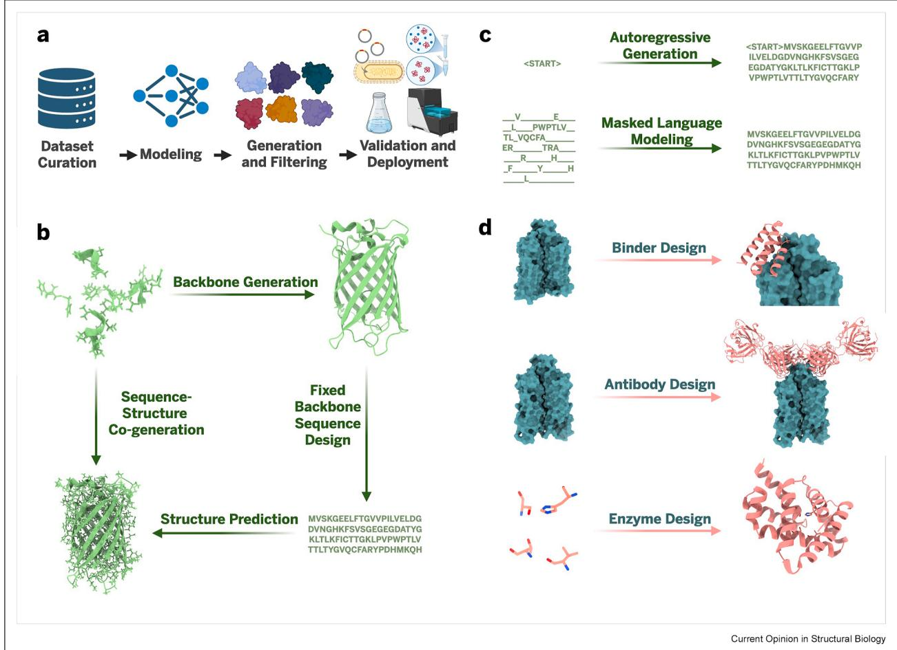

# Closing the loop: Experimentally validated methods in artificial intelligence–driven protein design

Clayton W. Kosonocky ,a Sarah Alamdari2 , Kevin K. Yang2 and Ava P. Amini2

Artificial intelligence (AI) has reshaped protein design by enabling models trained on large-scale sequence and structure data to generate proteins with specified functions. These models are best understood in the context of an end-to-end pipeline that includes data curation, model development, candidate generation and filtering, and experimental validation. Here, we review AI-driven protein design methods that span this full pipeline. We begin with a primer on AI-driven protein design and then outline the key components of the pipeline and assess performance across three major application areas: binders, antibodies, and enzymes. By consolidating experimental outcomes across diverse approaches, we provide a practical reference for methods that currently succeed in the lab and highlight the ongoing importance of experimental feedback in advancing AI-driven protein design.

# Addresses

1 The University of Texas at Austin, Austin, TX, 78712, USA   
2 Microsoft Research, Cambridge, MA, 02142, USA

Corresponding author: Amini, Ava P.. (ava.amini@microsoft.com) a Work done during an internship at Microsoft Research.

# Current Opinion in Structural Biology 2026, 98:103272

This review comes from a themed issue on Folding, Binding and Protein Design (2026)

Edited by Dr. John Christodoulou, Dr. Michele Vendruscolo

For a complete overview see the Issue and the Editorial

Available online xxx

https://doi.org/10.1016/j.sbi.2026.103272

0959-440X $/ { \odot }$ 2026 The Authors. Published by Elsevier Ltd. This is an open access article under the CC BY license (http://creativecommons. org/licenses/by/4.0/).

# Introduction

The ability to generate proteins with specific biological functions, commonly known as protein design, has long been a central goal in molecular and synthetic biology [1,2]. Success in this domain promises broad applications, from therapeutic design to industrial catalysis and precise molecular sensing [3—5]. Achieving functional design requires navigating the complex interplay between amino acid sequence, three-dimensional (3D) structure, and environmental context [1].

Traditional computational approaches to protein design have relied heavily on physical simulations, empirically derived features, or expert-guided heuristics [2]. While these have yielded notable results, they are often computationally expensive, difficult to scale, and constrained by the need for high-quality structural information [1,2]. Recent advances in artificial intelligence (AI) have begun to bypass many of these limitations by enabling models to learn sequence—structure—function relationships directly from large-scale biological data, offering a scalable path to predict and generate sequences likely to carry out desired functions [6—10]. Although recent progress has been driven by advances in deep learning, the development of these methods occurs within a broader pipeline that includes dataset construction, model training, candidate generation, in silico evaluation and filtering, and experimental validation. Understanding how these components interact is essential for evaluating the capabilities and limitations of current AIdriven protein design strategies.

In this review, we examine AI-driven protein design across the full data—model—experiment pipeline (Figure 1a), with a focus on how these workflows are implemented in practice and why specific datasets, model architectures, and experimental strategies are used. We begin by outlining a general workflow for AIdriven protein design, spanning data curation, model development, and experimental validation. We then revisit this pipeline in the context of three major biological application areas: binders, antibodies, and enzymes. Throughout, we focus on models of global protein sequence or structure space with demonstrated experimental success, using them to illustrate how meaningful progress in AI-driven protein design depends not only on model quality but also on the integration of data, design decisions, and experimental validation.

# The end-to-end pipeline for AI-driven protein design: data, model, deploy

AI-driven protein design operates as a pipeline with key stages: dataset curation, model training, sample generation and filtering, and experimental validation (Figure 1a).

  
Figure 1

AI-driven protein design. a) Overview of the full AI-driven protein design pipeline, from dataset curation to experimental validation and deployment. b) Structure-based generation. Starting in the upper left and proceeding clockwise: structural context is used to generate an optimal backbone, which is converted into a sequence. Generated sequences are then screened using structure prediction models to ensure they are likely to fold into the intended backbone. Newer models directly generate full-atom structures from input context in a single step, bypassing the need for multiple models. c) Sequencebased generation. Autoregressive models generate proteins from left to right, while masked language models infill missing positions to produce diverse sequences. d) Application domains covered in this review include binders, antibodies, and enzymes. The teal structure represents the target; the salmon-colored structure is the designed protein. Binder and antibody design typically requires specification of a target protein, while enzyme design often requires defining a catalytic center. AI, artificial intelligence. Figure 1 was created using BioRender (https://biorender.com)

Proteins are comprised of an amino acid sequence that corresponds to a 3D structure. These two modalities, sequence and structure, have been extensively cataloged over the past several decades, leading to large databases with hundreds of thousands of protein structures [11] and millions to billions of sequences [12—14].

Structure-based AI-guided protein design (Figure 1b) leverages models trained on protein structures. These workflows often begin with a backbone design model, which generates candidate backbone geometries that are expected to support a specific function [7,15—18]. This step can generate structures conditioned on constraints such as binding-site coordinates or catalytic motifs that must be recapitulated in the final design. Once a backbone is generated, a fixed-backbone sequence design model is used to predict an amino acid sequence likely to fold into that structure [6,19—22]. Finally, structure prediction models [9,10,17,23,24] are used to assess whether the generated sequences are likely to fold into the intended structure to filter out inconsistent designs. However, this is far from the only viable approach. Many models unify backbone generation and sequence design to cogenerate structure and sequence [25—28], whereas others backpropagate through structure prediction models to generate proteins that satisfy biological and physical constraints [29—31]. In contrast, sequencebased models for protein design (Figure 1c) forgo structure entirely, operating under the premise that protein sequence data contain enough information to design functional proteins [8,9,13,32,33]. Sequencebased models can predict stabilizing mutations [9], redesign large regions [34], and generate full sequences [8,13,14,32,33,35,36].

Protein design models can generate proteins either unconditionally or conditionally based on input design specifications. While less relevant for targeted biological applications, unconditional generation is often used to assess how realistic the proteins generated by the model are. Alternatively, in a conditional generation setting, information on the desired protein or target is provided to the model prior to generation. Structure-based models typically receive context in the form of domains and structures that the designed protein should interact with or contain. Early models were limited to protein- or peptide-level context, where the context contained only residues or backbone atoms. More recent approaches can incorporate full atomic representations of interacting biomolecules [15,17,20—23,28,37—40] and dynamic conformational states [41]. In contrast, sequence-based models condition on partial protein sequences [32—34], aligned homologs [13,32], or unaligned homologs [13]. Sequence-based models can additionally be fine-tuned to generate proteins based on a sample set or distribution of interest, such as enzymes of a particular family [8,35,36].

The final stage of AI-driven protein design is experimental validation of candidate designs, which tests whether model-generated proteins express, fold as intended, and perform the specified function. Although inherently limited by time and cost, experiments are essential, not just because they evaluate computational methods, but also because molecules exist in the physical world and the goal is to create new, functional ones. Some studies evaluate models on their ability to produce viable designs directly, without additional filtering [13]. More commonly, experimental candidates are selected after in silico screening. Typical steps include discarding sequences that fail structure prediction or confidence thresholds [7,42], ranking or filtering using Rosetta or related physics-based scores to remove energetically unfavorable or nonphysical structures [31,37], clustering to maintain sequence or structural diversity [42], and manual inspection.

The rate at which a model is determined to yield functional proteins depends on the type, scale, and definition of success of the experiments conducted, all of which vary by application. Three experimental assays common to all structured proteins are―in increasing order of resolution and decreasing throughput―expression, secondary structure characterization, and 3D structure determination. Expression is assessed most commonly in cell-based systems and verified using methods such as SDS-PAGE, which confirms correct size, and size exclusion chromatography, which confirms monodispersity and the absence of aggregation or multimerization. Secondary structure is typically evaluated with circular dichroism (CD). CD is often used as a fast proxy instead of or before more costly atomicresolution methods such as X-ray crystallography (XRC) and electron microscopy (EM), which are the gold standard for structure determination due to the detailed mechanistic information they provide.

To centralize information from many independent studies, we present per-study reported success rates for a suite of protein design models across a variety of applications (Tables 1—4) and tasks (Tables A.5, A.6, A.7). Though these rates provide insights into model efficacy, caution should be used when comparing between models as these rates depend on varying candidate selection methods.

# Application areas: binders, antibodies, and enzymes

Currently, three protein design applications stand out for their impact and demonstrable success: binders, antibodies, and enzymes (Figure 1d). The following sections outline the importance of each and emphasize nuances in the various stages of the AI-driven protein design pipeline, as applied to each of these three areas.

# Binders

Binders are proteins that form strong, specific intermolecular contacts with another protein [7,16,29,34,39, 43—48,50], small molecule [17,20,22,40], or nucleic acid [28]. The ability to design custom binders on demand enables precise modulation of biological systems through control of protein—protein and protein—ligand interactions. Demonstrated applications include binders that inhibit snake venom or viral proteins [7,34,51], immunotherapies targeted for specific cells [29,52], and designed binders to intrinsically disordered proteins [53].

To design functional binders, models must capture how proteins interact with target surfaces and use this context to generate compatible interfaces. The design of protein binders is powered by interaction structures in the Protein Data Bank (PDB) [11]. One common training setup involves masking out a chain in a complex and predicting its sequence and structure, effectively framing binder design as a conditional generation task. This approach is used by many models [7,42,48,49], while others instead leverage multimeric structure prediction models [19,29,39,45,50]. Additional strategies include learning surface fingerprints for geometric matching [47] as well as language modeling [32,34], which, despite binder design being canonically regarded as a structure-based task, has shown strong performance. One possible explanation is that language models implicitly learn structural features from coevolutionary signals and, when conditioned on or fine-tuned to interacting proteins, capture the relationships necessary for binding [32]. Despite substantial progress in protein—ligand binder design [17,20,22,42], success rates remain lower than for protein—protein binders, likely due to the relatively limited representation of small molecules in current datasets compared to the vast set of possible chemical structures [11].

Table 1   

<table><tr><td colspan="5">Experimentally-validated, Al-designed protein binders (1/2).</td></tr><tr><td>Model</td><td>Target</td><td>Extra design info</td><td>Validation</td><td>Success rate(s)t</td><td>Ref.</td></tr><tr><td>AlphaDesign</td><td>RcaT</td><td></td><td>Fluorescence</td><td>17/88</td><td></td></tr><tr><td>AlphaProteo</td><td>BHRF1</td><td></td><td>YSD, CD</td><td>83/94</td><td>[43] [44]</td></tr><tr><td rowspan="10">BindCraft</td><td>SC2RBD</td><td></td><td></td><td>21/172</td><td></td></tr><tr><td>IL-7RA</td><td></td><td></td><td>24/94</td><td></td></tr><tr><td>PD-L1</td><td></td><td></td><td>24/159</td><td></td></tr><tr><td>TrkA</td><td></td><td></td><td>12/131</td><td></td></tr><tr><td>IL-17A</td><td></td><td></td><td>9/63</td><td></td></tr><tr><td>VEGF-A</td><td></td><td></td><td>31/94</td><td></td></tr><tr><td>TNF-α</td><td></td><td></td><td>0/54</td><td></td></tr><tr><td>PD-1</td><td></td><td>BLI</td><td>13/53</td><td>[29]</td></tr><tr><td>PD-L1</td><td></td><td>SPR</td><td>7/9</td><td></td></tr><tr><td>IFNAR2</td><td></td><td></td><td>3/9</td><td></td></tr><tr><td>CD45 BBF-14</td><td></td><td></td><td>4/16</td><td></td></tr><tr><td></td><td></td><td>SPR, MST</td><td>6/11</td><td></td></tr><tr><td>CLDN1</td><td></td><td>SPR, XRC</td><td>6/7</td><td></td></tr><tr><td>DerF7 DerF21</td><td></td><td></td><td>4/10</td><td></td></tr><tr><td>BetV1</td><td></td><td>SEC-MALS</td><td>4/7 2/7</td><td></td></tr><tr><td>SpCas9</td><td></td><td>CryoEM, edit Assay</td><td>6/6</td><td></td></tr><tr><td>CbAgo</td><td></td><td>DNA cleavage</td><td>2/12</td><td></td></tr><tr><td>HER2</td><td>AAV</td><td>Transduction Assay</td><td>1/10</td><td></td></tr><tr><td>PD-L1</td><td>AAV</td><td></td><td>4/10</td><td></td></tr><tr><td>IL-7RA</td><td></td><td> SPR, BLI</td><td>4/20</td><td>[42]</td></tr><tr><td>PDGFR</td><td></td><td></td><td>2/20</td><td></td></tr><tr><td rowspan="11"></td><td>PD-L1</td><td></td><td></td><td>12/20</td><td></td></tr><tr><td>Insulin</td><td></td><td></td><td>17/20</td><td></td></tr><tr><td></td><td></td><td></td><td></td><td></td></tr><tr><td>TNF-α MZB1</td><td></td><td></td><td>0/20</td><td></td></tr><tr><td>PMVK</td><td></td><td></td><td>14/15</td><td></td></tr><tr><td>PHYH</td><td></td><td></td><td>2/15 5/7</td><td></td></tr><tr><td></td><td></td><td></td><td></td><td></td></tr><tr><td>IDI2</td><td></td><td></td><td>4/15</td><td></td></tr><tr><td>AMBP</td><td></td><td></td><td>5/15</td><td></td></tr><tr><td>HNMT RFK</td><td></td><td></td><td>1/15</td><td></td></tr><tr><td>GM2A</td><td></td><td></td><td>0/15</td><td></td></tr><tr><td></td><td></td><td></td><td>0/15</td><td></td></tr><tr><td>ORM2</td><td></td><td></td><td>0/15</td><td></td></tr><tr><td>Indolicidin</td><td></td><td>Fluorescence,</td><td>5/6</td><td></td></tr><tr><td>Melittin</td><td></td><td>Fluorescence</td><td>2/6</td><td></td></tr><tr><td>Protegrin 52 targets</td><td></td><td>BLI</td><td>2/6</td><td></td></tr><tr><td>EvoBind2</td><td>RNase</td><td></td><td>SPR</td><td>68% overall</td><td>[16] [45]</td></tr><tr><td></td><td>RNase</td><td>Cyclic</td><td></td><td>5/13 1/4</td><td></td></tr><tr><td>EvoBindRare</td><td>RNase</td><td>ncAA</td><td>SPR</td><td>1/7</td><td>[39]</td></tr><tr><td></td><td>RNase</td><td>Cyclic; ncAA</td><td></td><td>1/1</td><td></td></tr><tr><td>EvoPro</td><td>PD-L1</td><td></td><td>SPR</td><td>9/13</td><td>[43]</td></tr></table>

Binders are composed of the standard 20 amino acids unless otherwise noted. MST, micro-scale thermophoresis; AAV, adeno-associated virus. †Success rates are reported as per the criteria defined in the respective paper. AI, artificial intelligence; BLI, biolayer interferometry; ELISA, enzyme-linked immunosorbent assay; EM, electron microscopy; YSD, yeast surface display; CD, circular dichroism; SEC, size exclusion chromatography; SPR, surface plasmon resonance.

Binder efficacy is typically quantified by the dissociation constant $( K _ { d } )$ , or the concentration of ligand at which half of the binder is bound to ligand, measured using kinetic assays such as surface plasmon resonance (SPR)

Table 2   

<table><tr><td colspan="6">Table 2</td></tr><tr><td colspan="6"> Experimentally-validated, Al-designed protein binders (2/2).</td></tr><tr><td>Model</td><td>Target</td><td>Extra Design Info</td><td>Validation</td><td> Success Rate(s)t</td><td>Ref.</td></tr><tr><td>LatentX</td><td>MDM2</td><td>Cyclic</td><td>SPR</td><td>10/11</td><td>[46]</td></tr><tr><td></td><td>MCL1</td><td>Cyclic</td><td></td><td>11/11</td><td></td></tr><tr><td></td><td>PD-L1</td><td>Cyclic</td><td></td><td>16/17</td><td></td></tr><tr><td></td><td>BHRF1</td><td></td><td>BLI, mDisplay</td><td>64/100</td><td></td></tr><tr><td></td><td>TrkA</td><td></td><td></td><td>10/100</td><td></td></tr><tr><td></td><td>PD-L1</td><td></td><td></td><td>49/100</td><td></td></tr><tr><td></td><td>IL-7RA</td><td></td><td></td><td>26/100</td><td></td></tr><tr><td></td><td>SC2RBD</td><td></td><td></td><td>52/100</td><td></td></tr><tr><td>maSIF</td><td>PD-L1</td><td></td><td>YSD</td><td>1/N</td><td>[47]</td></tr><tr><td></td><td>PD-1</td><td></td><td>YSD, SPR</td><td>3/N</td><td></td></tr><tr><td>PepMLM</td><td>CTLA-4</td><td></td><td></td><td>1/N</td><td></td></tr><tr><td></td><td>NCAM1</td><td></td><td>ELISA</td><td>4/4</td><td>[34]</td></tr><tr><td></td><td>AMHR2 7</td><td></td><td></td><td>4/4</td><td></td></tr><tr><td></td><td>MSH3</td><td>Fused to E3</td><td>Fluorescence</td><td>5/6</td><td></td></tr><tr><td></td><td></td><td>ligase</td><td></td><td></td><td></td></tr><tr><td></td><td>mHTT</td><td>Fused to E3</td><td>Western Blot,</td><td>5/5</td><td></td></tr><tr><td></td><td></td><td>ligase</td><td>Fluorescence</td><td></td><td></td></tr><tr><td></td><td>Viral Proteins</td><td>Fused to E3</td><td></td><td>37/60</td><td></td></tr><tr><td></td><td></td><td>ligase</td><td></td><td></td><td></td></tr><tr><td>PXdesign</td><td> IL-7RA</td><td></td><td>BLI</td><td>4/10</td><td>[48]</td></tr><tr><td></td><td>SC2RBD</td><td></td><td></td><td>2/9, then 4/8</td><td></td></tr><tr><td></td><td>PD-L1</td><td></td><td></td><td>8/11</td><td></td></tr><tr><td></td><td>VEGF-A</td><td></td><td></td><td>8/17</td><td></td></tr><tr><td></td><td>TrkA</td><td></td><td></td><td>3/15</td><td></td></tr><tr><td></td><td>TNF-α</td><td></td><td></td><td>0/16</td><td></td></tr><tr><td>RFdiffusion</td><td>HA</td><td></td><td>BLI, CryoEM</td><td>18%</td><td>[7]</td></tr><tr><td></td><td>IL-7Ra</td><td></td><td>BLI</td><td>35%</td><td></td></tr><tr><td></td><td>INSR</td><td></td><td></td><td>20%</td><td></td></tr><tr><td></td><td>PD-L1</td><td></td><td></td><td>14%</td><td></td></tr><tr><td></td><td>TrkA</td><td></td><td></td><td>8%</td><td></td></tr><tr><td>RFpeptides</td><td>MCL1</td><td>Cyclic</td><td>SPR, XRC</td><td>3/14</td><td>[49]</td></tr><tr><td></td><td>GABARAP</td><td>Cyclic</td><td></td><td>2/6</td><td></td></tr><tr><td></td><td></td><td></td><td></td><td></td><td></td></tr><tr><td></td><td>RbtA MDM2</td><td>Cyclic Cyclic</td><td>SPR</td><td>4/11</td><td></td></tr></table>

Binders are composed of the standard 20 amino acids unless otherwise noted. When the number of tested designs is unknown, success rates are reported as ‘of N designs.’ †Success rates are reported as per the criteria defined in the respective paper. BLI, biolayer interferometry; ELISA, enzyme-linked immunosorbent assay; EM, electron microscopy; SPR, surface plasmon resonance; XRC, X-ray crystallography; YSD, yeast surface display; AI, artificial intelligence.

[54], biolayer interferometry (BLI) [55], and yeast surface display (YSD) [56]. SPR and BLI provide precise, quantitative kinetic data with throughput ranging from dozens to thousands of samples depending on the platform. Display technologies such as YSD can estimate approximate $K _ { d }$ values by titrating antigen concentrations over a monoclonal population of displaying cells, though they are more commonly used for highthroughput enrichment of binders from large libraries. Ideally, to confirm the predicted binding interaction, XRC or CryoEM is used to obtain a structure of the bound complex. In practice, this has been done for binders to influenza hemagglutinin (HA) [7], allergens DerF7 and DerF21 [29], SpCas9 [29], cyclic binders to cancer and bacterial targets MCL1, GABARAP, and RbtA [49] and binders to small molecules [17,22]. When validating a model, candidate binders for a variety of targets are generally designed and tested as a means to assess model generalizability. At present, common targets are PD-1, PD-L1, IL-7RA, TrkA, and TNF- $\alpha$ [7,16,29,44,46—48,50]. Many of these targets have reached success rates of well over $1 0 \%$ , with the exception of TNF- $\alpha$ , to which only Chai-2 has been able to create binders [16,44,48].

While these results mark substantial progress, it is important to note that success rates typically refer to in vitro binding, often outside of a cellular context or animal model. Further progress is needed to evaluate binding strength and specificity in vivo and to optimize properties for eventual real-world deployment. One key challenge is maximizing the ratio of on-target to offtarget binding, particularly in complex biological environments where unintended interactions can lead to

Table 3   

<table><tr><td colspan="7">Experimentally-validated, Al-designed antibodies.</td></tr><tr><td>Model</td><td>Target</td><td>Design scope</td><td>Scaffold</td><td>Validation</td><td> Success Rate(s)t</td><td>Ref.</td></tr><tr><td rowspan="7">AbDifuser BoltzGen</td><td>HER2 IL-7RA PD-L1</td><td>Ab CDRH3 VHH CDR</td><td>Trastuzumab See table legend</td><td>SPR</td><td>70%</td><td>[71]</td></tr><tr><td>PDGFR</td><td></td><td></td><td>SPR, BLI</td><td>7/15 6/15</td><td>[42]</td></tr><tr><td></td><td></td><td></td><td>6/10</td><td></td></tr><tr><td>Insulin</td><td></td><td></td><td>4/15</td><td></td></tr><tr><td>TNF-α</td><td></td><td></td><td>0/15</td><td></td></tr><tr><td>MZB1 PMVK</td><td></td><td></td><td>1/15</td><td></td></tr><tr><td>PHYH</td><td></td><td>8/15</td><td></td><td></td></tr><tr><td></td><td></td><td></td><td>1/5 1/15</td><td></td></tr><tr><td>IDI2</td><td></td><td></td><td></td><td></td></tr><tr><td>AMBP</td><td></td><td></td><td>0/15</td><td></td></tr><tr><td>HNMT</td><td></td><td></td><td>1/15</td><td></td></tr><tr><td></td><td></td><td></td><td>2/15</td><td></td></tr><tr><td>GM2A</td><td></td><td></td><td></td><td>0/15</td><td></td></tr><tr><td>ORM2</td><td></td><td></td><td></td><td>0/15</td><td></td></tr><tr><td>Penguinpox</td><td></td><td></td><td></td><td>0/15</td><td></td></tr><tr><td> Hemagglutinin</td><td></td><td></td><td></td><td>0/15</td><td></td></tr><tr><td rowspan="5">Chai-2 GeoFlowV3</td><td>52 targets CCR8</td><td>VHH, VH-VL CDR</td><td>Unspecified</td><td>BLI</td><td>15.5%;26/52 targets</td><td>[16]</td></tr><tr><td>PD-1 TSLP Ep1 TSLP Ep2</td><td>VHH CDR</td><td>h-NbBcII10FGLA</td><td>BLI</td><td>3/23 1/50</td><td>[68]</td></tr><tr><td>IL33 Ep1</td><td></td><td></td><td></td><td>13/50 11/50</td><td></td></tr><tr><td>IL33 Ep2 IL13 Ep1</td><td></td><td></td><td></td><td>6/46 3/50 2/34</td><td></td></tr><tr><td>IL13 Ep2 PD-L1 VHH CDR</td><td>hNbBCII</td><td></td><td>Fluorescence, BLI</td><td>9/50 7/101</td><td></td></tr><tr><td></td><td>IL3 IL20</td><td></td><td></td><td></td><td>2/46 4/43</td><td>[31]</td></tr><tr><td rowspan="2">IgGM</td><td>BHRF1 Protein A</td><td>VHH FR3</td><td>VHH3</td><td>BLI</td><td>11/52</td><td></td></tr><tr><td>PD-L1</td><td>Ab CDRH3</td><td> See table legend</td><td>ELISA, BLI</td><td>2/10</td><td>[67]</td></tr><tr><td rowspan="2">JAM</td><td>SARS-CoV-2 RBD</td><td>VHH</td><td>See table legend</td><td>YSD</td><td>7/60 2.2%nM</td><td></td></tr><tr><td>CXCR4/7</td><td></td><td></td><td>BLI</td><td>0.32%</td><td>[72]</td></tr><tr><td>mBER</td><td>CXCR4 145 targets</td><td>VHH CDR</td><td></td><td>Flow Cytometry</td><td>7/35&lt;nM</td><td></td></tr><tr><td>RFantibody</td><td>RSV Site I RSV Site III</td><td></td><td>IGHV3-23</td><td> Phage Display</td><td>0.02%-8%; 78/</td><td>[30]</td></tr><tr><td rowspan="5"></td><td rowspan="5">Influenza HA</td><td>VHH CDR</td><td>h-NbBcII10FGLA</td><td>YSD</td><td>145 targets 0/9000</td><td>[66]</td></tr><tr><td></td><td></td><td>YSD, SPR</td><td>1/9000</td><td></td></tr><tr><td></td><td></td><td>YSD, SPR, CryoEm</td><td>4/9000</td><td></td></tr><tr><td></td><td></td><td></td><td>1/9000</td><td></td></tr><tr><td></td><td></td><td></td><td></td><td></td></tr><tr><td rowspan="5"></td><td>SARS-CoV-2 RBD IL-7Rα</td><td></td><td></td><td>YSD, SPR</td><td></td><td></td></tr><tr><td>TcdB</td><td></td><td></td><td> SPR</td><td>2/95</td><td></td></tr><tr><td></td><td></td><td></td><td></td><td></td><td></td></tr><tr><td></td><td></td><td></td><td></td><td>0/95</td><td></td></tr><tr><td>TcdB</td><td> scFv CDR</td><td>hu4D5-8</td><td></td><td>6/N</td><td></td></tr></table>

As most of the current antibody generation models design only parts of an existing antibody scaffold, the design scope and scaffold are additionally reported for each target. When the number of tested designs is unknown, success rates are reported as ‘of N designs.’ BoltzGen used one of four VHHs as frameworks: Taplacizumab, Vobarilizumab, Ozoralizumab, or TPP-3444. The anti-PD-L1 antibodies made by IgGM were created using frameworks from specific humanized V and J genes (IGHV323/IGKV15 and IGHJ4/IGKJ1). It is not clear if a scaffold was used for JAM VHH designs. †Success rates are reported as per the criteria defined in the respective paper.

CDR, complementarity-determining region; BLI, biolayer interferometry; ELISA, enzyme-linked immunosorbent assay; EM, electron microscopy; SPR, surface plasmon resonance; VHH, single variable domain on a heavy chain; YSD, yeast surface display

toxicity or loss of efficacy. Conversely, designing binders that function across multiple targets―such as isoforms or related protein families―is another important yet difficult objective, especially for applications such as broad-spectrum antivirals or pan-cancer therapeutics.

Finally, minimizing immunogenicity remains a central concern for therapeutic applications, where even highly specific and potent binders may fail due to immune responses triggered by non-self-epitopes or unusual structural motifs. Addressing these challenges requires continued advances in dataset design, modeling, filtering, and expanded experimental feedback loops to refine and select those with desired biophysical properties.

<table><tr><td colspan="6">Table 4</td></tr><tr><td colspan="6">Experimentally-validated, Al-designed enzymes.</td></tr><tr><td>Model</td><td>Task</td><td>Active Site</td><td>Validation</td><td>Ratio Active t</td><td>Ref.</td></tr><tr><td rowspan="4">trRosetta PLACER</td><td>Luciferase</td><td>Generated</td><td>Luminescence</td><td>3/7648</td><td>[74]</td></tr><tr><td>4MU Serine Hydrolase 4MU Serine Hydrolase;</td><td>Generated</td><td>Fluorescence, XRC</td><td>20/132 9/45</td><td>[37]</td></tr><tr><td>2-state design</td><td></td><td></td><td></td><td></td></tr><tr><td>4MU Serine Hydrolase (4-state) 4MU Serine Hydrolase</td><td></td><td></td><td>8/11</td><td></td></tr><tr><td></td><td>backbone redesign 4MU Hydrolase to PET</td><td></td><td>Fluorescence N/A</td><td>2/20 85/85</td><td></td></tr><tr><td rowspan="3">ProGen2</td><td>hydrolase</td><td></td><td></td><td></td><td></td></tr><tr><td>HEK3 Cas9 Nuclease HEK2 Cas9 Nuclease</td><td>Implicit</td><td>Indel Assay</td><td>120/209 84/209</td><td>[8]</td></tr><tr><td>CD3G1 Cas9 Nuclease</td><td></td><td></td><td>61/209</td><td></td></tr><tr><td>ProtGPT2 RFdiffusion2</td><td>Triosephosphate Isomerase</td><td>Implicit</td><td>Absorbance</td><td>2/12</td><td>[36]</td></tr><tr><td></td><td>Methodol Retro- Aldolase</td><td>Extracted</td><td>IVTT</td><td>4/96</td><td>[15]</td></tr><tr><td rowspan="5"></td><td> 4MU Cysteine</td><td></td><td>Fluorescence</td><td>1+/48</td><td></td></tr><tr><td>Hydrolase 4MU-B Zinc</td><td></td><td></td><td>3/96</td><td></td></tr><tr><td>Metallohydrolase</td><td></td><td></td><td></td><td></td></tr><tr><td>4MU-PA Zinc Metallohydrolase</td><td></td><td></td><td>5/96</td><td></td></tr><tr><td> 4MU-PA Cysteine</td><td>Extracted</td><td>Fluorescence</td><td>35/190</td><td>[28]</td></tr><tr><td>RiffDiff</td><td>Hydrolase</td><td>Extracted</td><td>SEC, SAXS</td><td></td><td></td></tr><tr><td rowspan="2"></td><td>Retro-Aldolase</td><td></td><td>Endpoint Assay</td><td>30/35</td><td>[38]</td></tr><tr><td>MBH Enzyme</td><td>Implicit</td><td></td><td>57/63</td><td></td></tr><tr><td rowspan="3">ZymCTRL</td><td>β-Carbonic Anhydrase</td><td></td><td> pH assay</td><td>7/20</td><td>[35]</td></tr><tr><td>Lactate Dehydrogenase</td><td></td><td>Absorbance</td><td>10/10</td><td></td></tr><tr><td>Triosephosphate Isomerase</td><td></td><td></td><td>3/12</td><td>[36]</td></tr></table>

IVTT, in vitro transcription translation; SEC, size exclusion chromatography; SAXS, small-angle X-ray scattering; N/A, not listed in paper; XRC, X-ray crystallography. Active sites were explicitly generated by the model, implicitly generated by being trained on homologous proteins, or extracted from another protein to be scaffolded by the model. †Ratio active is reported as per the criteria defined in the respective paper.

# Antibodies

The central function of antibodies is to recognize―and ideally mediate the clearance and neutralization of―foreign molecules and pathogens. Unlike generalpurpose binders, antibodies have a conserved immunoglobulin framework that determines not only their structural architecture but also how binding events are coupled to immune effector functions through the constant (Fc) region. Antibodies are highly sought after due to their favorable safety profiles, established optimization pipelines, and scalable production infrastructure [57]. In addition to direct therapeutic use, they support applications such as molecular detection and imaging [58], recognition domains in Chimeric Antigen Receptor (CAR)-T cells [59], and scaffolds in bispecific and antibody—drug conjugate platforms [60,61].

A core challenge in antibody design is the limited structural coverage of antibodies in the PDB, even though dedicated resources such as SAbDab curate essentially all known antibody structures and complexes [11,62]. Complementary sequence-focused repositories such as Observed Antibody Space [63] and AbRank [64] assemble hundreds of millions of repertoire sequences and hundreds of thousands of binding measurements but provide atomic-resolution structures for only a small fraction of these sequences. The complementaritydetermining regions (CDRs) that form the antigenbinding site are generated by V(D)J recombination followed by somatic hypermutation, which produces extreme sequence and structural diversity, particularly in CDR H3 [65]. As a result, individual antibodies rarely sit in deep homologous families and coevolutionary signals that support multiple sequence alignment (MSA)-based models are sparse, a limitation that has been noted for AlphaFold2-style pipelines when applied to antibodies [10]. Addressing these issues requires modeling strategies that exploit antibody-specific sequence statistics and structural priors [31], rather than relying solely on generic MSA-based protein design approaches.

Therapeutic antibody development involves optimizing multiple objectives in parallel, including binding affinity, specificity, selectivity, and developability. This typically involves screening to find binders to the antigen, followed by affinity maturation to improve binding strength and refine specificity. AI-driven protein design promises to perform both steps entirely in silico, with the added promise of binding epitope specification [30,31,66—68]. While early models focused on redesigning CDR loops to enhance affinity or accommodate new antigens [69,70], recent experimentally validated models have demonstrated successful design of entire antibodies and nanobodies, achieving subnanomolar affinities and double-digit success rates on several targets [16,30,31,66—68,71,72] (Table 3). One of these models also supports framework region engineering, affinity maturation (systematic optimization of binding interfaces), and humanization (biasing sequences toward human-like germline usage to reduce immunogenicity), further streamlining design campaigns [67]. The key breakthrough in these recent models arose by bringing in biological priors to the generation process through, for example, the introduction of custom loss functions incentivizing unstructured CDR loops over the alpha helices common to many structure-based diffusion models [31].

While many developability metrics have dedicated biophysical or biochemical assays [73], the strength of an antibody’s binding to its antigen is reflected in the $K _ { d } ,$ measured using similar methods as for other binders, including SPR, BLI, and YSD. Likewise, antibody design faces similar limitations, due to their shared assays, data constraints, and deployment criteria. Improving off-target control, humanization, and targeting of nonprotein antigens such as glycans, lipids, and nucleic acids would expand the scope of antibody design models and enable more generalizable, applicationspecific generation that may augment or even rival other approaches.

# Enzymes

Enzymes catalyze an exceptionally wide range of chemical reactions, making them a valuable target for protein design [75]. For example, they can synthesize molecules that are difficult or impractical to produce by conventional chemistry, degrade recalcitrant materials such as plastics, and enable precise genome editing through systems like CRISPR-associated nucleases.

Enzyme design poses distinct challenges as it requires modeling not only the protein itself but also the chemical reaction it catalyzes. This includes representing the substrate―often small molecules under-represented in the PDB [11]―as well as the geometry and electrostatics of the active site required to stabilize the transition state. Because catalysis involves transient, high-energy intermediates, this information can be difficult to infer from static structures alone and may require augmentation with other data sources or mechanistic priors.

Furthermore, the problem spans multiple levels of difficulty: generating variants of enzymes that catalyze known reactions is more tractable than designing enzymes for reactions not observed in nature. Present capabilities focus largely on the former (Table 4). Sequence-based approaches have been used to generate functional Cas9 [8], triosephosphate isomerase [36], and carbonic anhydrase [35] variants in the absence of structural information. Early structure-based strategies used hallucination-based methods [74] or backbone diffusion around extracted catalytic residues from known enzymes [37]. The latter approach fixed the orientations of the catalytic side chains, limiting the flexibility of the active site and reducing design scope. Recent models have addressed this by learning optimal catalytic residue placement, allowing for more general active-site geometries to be constructed [15,28,38]. This advance represents a step toward enabling the design of enzymes with arbitrary mechanisms as these models are compatible with active sites modeled using density functional theory.

Experimental validation is less standardized for enzymes than for binders and antibodies as most substrates require distinct assays. Scaling enzyme validation requires assays that convert catalytic activity into a measurable signal. For example, many models were validated by designing enzymes that produce fluorescent products [15,28,37,38], while others designed nucleases whose activity can be verified with sequencing [8].

AI-driven enzyme design began with the successful generation of well-characterized enzyme classes and has begun to focus on the design of enzymes for other catalytic mechanisms. At present, the scope of reactions designable with AI-based tools is but a fraction of what is possible [75]. Bridging this gap may require moving beyond purely data-driven approaches, potentially benefiting from the integration of physics-based methods such as quantum mechanics and molecular mechanics, density functional theory, or molecular dynamics surrogates such as BioEmu and Boltzmann Generators [76,77].

# Discussion

In only a few years since accurate structure prediction became possible, protein design has advanced to the point where AI models can generate binders, antibodies, and enzymes with measurable experimental success. These models encompass a range of methodologies, including sequence-based language modeling, structure-conditioned diffusion, and iterative optimization through differentiable structure predictors. Despite this methodological diversity, their shared foundation lies in the quality and breadth of experimental data, curated over decades, that defines the empirical landscape from which AI models learn.

Experimental assays play a central role in determining which functions and properties the AI models are optimized for. The scalability and accessibility of binding assays have enabled rapid progress in binder and antibody design, yielding increasing success rates and growing structural diversity. In contrast, properties such as smallmolecule context, off-target specificity, humanization, and developability remain comparatively data limited due to their complexity and the cost of corresponding measurements. Likewise, the diversity of substrate- and context-specific assays for diverse classes of enzymes constrains the standardization needed for large-scale measurement and experimental feedback. Developing experimental platforms that systematically capture such under-represented properties represents a critical path toward expanding the design space addressable by AI.

Progress in AI-driven protein design thus depends on the reciprocal integration of computational modeling and experimental characterization. Computational advances define the hypotheses and candidate sequences, while experimental feedback provides the quantitative data required for calibration, generalization, and mechanistic understanding. Emphasizing such integrated design—validation loops may represent a productive direction for the field, enabling models to extend their design capabilities.

While continued increases in computational scale and model complexity will undoubtedly improve generative capabilities, progress ultimately depends on the resolution and scope of experimental feedback. The challenge ahead is not one of handing off responsibility from model developers to experimentalists but of unifying both perspectives into a continuous, data-informed design cycle. Establishing this duality between computational prediction and experimental validation will be essential for transforming current AI-driven protein design systems into general, interpretable, and deployable frameworks across molecular biology.

# Declaration of competing interest

The authors declare the following financial interests/ personal relationships which may be considered as potential competing interests: Ava P. Amini reports a relationship with Microsoft Corporation that includes employment and equity or stocks. Kevin K. Yang reports a relationship with Microsoft Corporation that includes employment and equity or stocks. Sarah Alamdari reports a relationship with Microsoft Corporation that includes employment and equity or stocks. If there are other authors, they declare that they have no known competing financial interests or personal relationships that could have appeared to influence the work reported in this paper.

# Acknowledgements

C.W.K. performed this work during an internship with Microsoft Research. This manuscript was made possible with the support of The Bioindustrial Manufacturing and Design Ecosystem (BioMADE) (T-OC-A-04-0087); the content expressed herein is that of the authors and does not necessarily reflect the views of BioMADE. C.W.K. was also funded in part by the Welch Foundation (F-1654).

# Appendix A. Additional experimental validation data

Table A.5   

<table><tr><td colspan="4"> Additional experimental validation of Al-driven protein design methods (1/3).</td></tr><tr><td>Model</td><td>Task</td><td>Validation</td><td> Success Rate(s)t</td><td>Ref.</td></tr><tr><td>AFdesign</td><td>Top7, Protein A,</td><td>SEC, CD, Melt</td><td>25/39 expressed 7/39 soluble&amp; folded</td><td>[19]</td></tr><tr><td>AlphaBind</td><td>Protein G, Ubiquitin, 4H Redesigns 3 targets; CDR</td><td>BLI</td><td>10/15 improved</td><td>[69]</td></tr><tr><td>BoltzGen</td><td>NPM1-binding</td><td>Fluorescence</td><td>1/5 localized</td><td>[42]</td></tr><tr><td></td><td>peptide RagC GTPase-</td><td>SPR</td><td>7/29</td><td></td></tr><tr><td></td><td>binding peptide RagA:RagC-binding</td><td>SPR</td><td>14/24</td><td></td></tr><tr><td></td><td>peptide GyrA-binding</td><td>Cell Assay</td><td>352/1808 inhibited</td><td></td></tr><tr><td></td><td> peptide</td><td>Cell Assay</td><td>54/1808 inhibited and bound</td><td></td></tr><tr><td>CARBonAra</td><td>Rucaparib binder TEM-1 β-Lactamase</td><td>Fluorescence CD, SEC, NMR, Rxn</td><td>5/6 4/10</td><td>[21]</td></tr><tr><td>Chroma</td><td>Redesign Unconditional</td><td>Progression Split-GFP</td><td>1+/172</td><td></td></tr><tr><td></td><td>Designs Unconditional</td><td>XRC</td><td></td><td>[25]</td></tr><tr><td></td><td>Designs</td><td></td><td>2/N</td><td></td></tr><tr><td></td><td>Unconditional Designs</td><td>CD</td><td>7/N</td><td></td></tr><tr><td>Chroma&amp;AFcycler</td><td>Conditional Designs</td><td>CD</td><td>3/N</td><td></td></tr><tr><td></td><td>Protein Letters 1500AA Protein</td><td>nsEm SDS-PAGE, nsEM</td><td>10/12</td><td>[78]</td></tr><tr><td>Dayhoff</td><td>Unconditional</td><td>SDS-PAGE</td><td>1/N 16/25 (3B-UR90),</td><td></td></tr><tr><td></td><td>Design</td><td></td><td>40/144 (others)</td><td>[13]</td></tr><tr><td>ESM-1b/1v</td><td>Evolved 7 antiviral IgGs</td><td>BLI</td><td>14-71% improved</td><td>[70]</td></tr><tr><td>ESM3</td><td>de novo GFP Design Conditional GFP</td><td>Fluorescence Fluorescence</td><td>19/88 37/88</td><td>[33]</td></tr><tr><td>EvoDiff</td><td>Design Unconditional</td><td>CD</td><td>4/25 expressed</td><td>[32]</td></tr><tr><td></td><td>Design Cox15 IDR</td><td>Microscopy</td><td>8/8 localized</td><td></td></tr><tr><td></td><td>Localization Design Calmodulin</td><td>CD,spectroscopy</td><td>correctly 12/13 expressed, 1/</td><td></td></tr><tr><td>IgGM</td><td>Scaffolding p53 Scaffolding</td><td>BLI</td><td>13 Ca2+ binding</td><td></td></tr><tr><td></td><td>RBD; murine Ab</td><td>BLI</td><td>8/24 bound 5/20</td><td>[67]</td></tr><tr><td></td><td>humanization IL33; Ab Aff. Mat.</td><td>ELISA</td><td>3/N</td><td></td></tr><tr><td></td><td>Round 1 IL33; Ab Aff. Mat.</td><td></td><td></td><td></td></tr><tr><td>LASErMPNN</td><td>Round 2 Exatecan Binders</td><td>ELISA, BLI Fluorescence</td><td>3/10</td><td></td></tr><tr><td></td><td></td><td>Anisotropy, Ligand Specificity, XRC</td><td>4/4</td><td>[22]</td></tr><tr><td>LigandMPNN</td><td>Rocuronium Binder Cholic Acid Binder</td><td>YSD/FC YSD/FC</td><td>1/189 21/105 hits, 6/8</td><td>[20]</td></tr></table>

YSD, yeast surface display; AI, artificial intelligence; BLI, biolayer interferometry; ELISA, enzyme-linked immunosorbent assay; XRC, X-ray crystallography; SEC, size exclusion chromatography; CD, circular dichroism. When the number of tested designs is unknown, success rates are reported as ‘of N designs.’ †Success rates are reported as per the criteria defined in the respective paper.

Table A.6   

<table><tr><td colspan="5"> Additional experimental validation of Al-driven protein design methods (2/3).</td></tr><tr><td>Model</td><td>Task</td><td>Validation</td><td> Success Rate(s)t</td><td>Ref.</td></tr><tr><td>ProDomino ProGen3</td><td>AsLOV2 Inserted into PAC or CAT</td><td> Abx/Light Assay</td><td>78%</td><td>[41]</td></tr><tr><td rowspan="4"></td><td>Unconditional Designs (60-80%</td><td> split-GFP</td><td>55-70%</td><td>[14]</td></tr><tr><td>SeqID) Unconditional Designs (40-60% SeqID)</td><td> split-GFP</td><td>60-75%</td><td></td></tr><tr><td>Unconditional Designs ( &lt; 30% SeqID)</td><td> split-GFP</td><td>40-60%</td><td></td></tr><tr><td>Unconditional Generation</td><td>SEC, CD</td><td>32/40 soluble &amp; monomeric, stable</td><td>[26]</td></tr><tr><td rowspan="6"></td><td>Designs with Biased</td><td>SEC, CD</td><td>up to 95C 68/96 expressed &amp;</td><td></td></tr><tr><td>AA Composition Repeat Sequences w/ or w/o Helical</td><td>SEC, CD, XRC</td><td>soluble 27/76 soluble (caps), 10/86 soluble (no</td><td></td></tr><tr><td>Caps Scaffolded Peptide Barcodes</td><td>SEC, mS</td><td>caps), 7/8 folded (CD); 1 folded (XRC) 64/84 expressed, 48/ 64 monodisperse</td><td></td></tr><tr><td></td><td></td><td>peak at expected elution volume, 41/ 58 correct barcode</td><td></td></tr><tr><td>Melittin Scaffolded with Furin Cleavage</td><td>SEC,CD, SS- PAGE, MS</td><td>reads 5/13 soluble &amp; monodisperse</td><td></td></tr><tr><td>Site AF Hallucination</td><td></td><td></td><td></td></tr><tr><td rowspan="3">Proteus</td><td>Rescue</td><td>SEC</td><td>1+/129</td><td>[6]</td></tr><tr><td>Gab2-scaffolded</td><td>CD, SEC,RC BLI</td><td>3/N 1/N</td><td></td></tr><tr><td>Grb2 SH3 Domain Unconditional</td><td>SEC, CD</td><td>12/16 folded</td><td></td></tr><tr><td> Raygun</td><td>Monomers EGFP &amp; mCherry</td><td>Fluorescence</td><td> 6/8 function</td><td>[18] [79]</td></tr><tr><td rowspan="4"></td><td>Seq. Reduction (10-15%) TurbolD Seq.</td><td></td><td></td><td></td></tr><tr><td>Reduction (1-6%) EGFR Binders</td><td>Western Blot</td><td>6/11 expressed, 2/11 function</td><td></td></tr><tr><td> Unconditional</td><td> Adaptyv</td><td>4/4 expressed, 2/4 bind</td><td>[80]</td></tr><tr><td>Monomers</td><td>CD</td><td>2 folded</td><td>[7]</td></tr><tr><td rowspan="5"></td><td>TIM Barrel Generation</td><td> SEC</td><td>10/11 expressed</td><td></td></tr><tr><td></td><td>CD</td><td>8/8 folded</td><td></td></tr><tr><td>Symmetric Oligomers</td><td> nsEm</td><td>5 folded</td><td></td></tr><tr><td>Scaffolded p53 Binding to MDM2</td><td>BLI</td><td>55/95</td><td></td></tr><tr><td>Symmetric Motif Scaffold (Ni2+ binding)</td><td> nsEM, ITC</td><td>4 well-folded</td><td></td></tr></table>

X-ray crystallography; CD, circular dichroism; SEC, size exclusion chromatography; BLI, biolayer interferometry. When the number of tested designs is unknown, success rates are reported as ‘of N designs.’ †Success rates are reported as per the criteria defined in the respective paper.

Table A.7   

<table><tr><td colspan="5"> Additional experimental validation of Al-driven protein design methods (3/3).</td></tr><tr><td>Model</td><td>Task</td><td>Validation</td><td> Success Rate(s)t</td><td>Ref.</td></tr><tr><td>RFdiffusion2MI</td><td>CD3epY188-selective Binder</td><td>YSD, BLI</td><td>1+/459</td><td></td></tr><tr><td rowspan="6">RFdiffusion3</td><td>EGFR pY1068-selective Binder</td><td>YSD, BLI</td><td>1/5082</td><td>[40]</td></tr><tr><td>EGFR pY1173-selective Binder</td><td>YSD, BLI</td><td>2/2408</td><td></td></tr><tr><td></td><td></td><td></td><td></td></tr><tr><td>INSR pY1361-selective Binder</td><td>YSD, BLI</td><td>2/80</td><td>[28]</td></tr><tr><td> 4MU-PA Cysteine Hydrolase</td><td>Fluorescence</td><td>35/190</td><td></td></tr><tr><td>Digoxigenin Binders Open-Pocket Heme</td><td>ITC, CD UV visible</td><td>1+/4416 90/168 expressed</td><td>[17]</td></tr><tr><td rowspan="6"></td><td></td><td></td><td>90/168 Cys-bound heme</td><td></td></tr><tr><td></td><td></td><td>33/40 monomeric 26/26 break when</td><td></td></tr><tr><td></td><td></td><td> mutated</td><td></td></tr><tr><td></td><td></td><td>20/26 high</td><td></td></tr><tr><td></td><td>UV visible</td><td> thermostability</td><td></td></tr><tr><td>Optically-Active Bilin Binder</td><td>XRC</td><td>9/96 1+ folded</td><td></td></tr><tr><td rowspan="4">TMdiffusion</td><td>TM Association</td><td>Fluorescence</td><td>16/18</td><td>[27]</td></tr><tr><td>GpA-like Design</td><td>SDS-PAGE, XRC</td><td>5/6 expressed and</td><td></td></tr><tr><td></td><td></td><td>oligomerized; 1</td><td></td></tr><tr><td>Synthetic Switchable GHRs</td><td> pSTAT5 Signaling</td><td>verified by crystal 17/17</td><td></td></tr></table>

UV, ultraviolet; XRC, X-ray crystallography; YSD, yeast surface display; AI, artificial intelligence; BLI, biolayer interferometry. †Success rates are reported as per the criteria defined in the respective paper.

# References

Papers of particular interest, published within the period of review, have been highlighted as:

\* of special interest \* \* of outstanding interest

1. Huang P-S, Boyken SE, Baker D: The coming of age of de novo protein design. Nature 2016, 537:320–327.   
2. Korendovych IV, DeGrado WF: De novo protein design, a retrospective. Q Rev Biophys 2020, 53:e3.   
3. Chen Z, Wang X, Chen X, Huang J, Wang C, Wang J, Wang Z: Accelerating therapeutic protein design with computational approaches toward the clinical stage. Comput Struct Biotechnol J 2023, 21:2909.   
4. Jiang L, Althoff EA, Clemente FR, Doyle L, Rothlisberger D, Zanghellini A, Gallaher JL, Betker JL, Tanaka F, Barbas III CF, et al.: De novo computational design of retro-aldol enzymes. Science 2008, 319:1387–1391.   
5. Jackson C, Anderson A, Alexandrov K: The present and the future of protein biosensor engineering. Curr Opin Struct Biol   
2022, 75, 102424.   
6. Dauparas J, Anishchenko I, Bennett N, Bai H, Ragotte RJ, Milles LF, Wicky BI, Courbet A, de Haas RJ, Bethel N, et al.: Robust deep learning–based protein sequence design using ProteinMPNN. Science 2022, 378:49–56.   
7. Watson JL, Juergens D, Bennett NR, Trippe BL, Yim J, Eisenach HE, Ahern W, Borst AJ, Ragotte RJ, Milles LF, et al.: De novo design of protein structure and function with RFdiffusion. Nature 2023, 620:1089–1100.   
8. Ruffolo JA, Nayfach S, Gallagher J, Bhatnagar A, Beazer J, ★ Hussain R, Russ J, Yip J, Hill E, Pacesa M, et al.: Design of highly functional genome editors by modelling CRISPR–Cas sequences. Nature 2025:1–8.

Autoregressive model that produced active Cas9 nuclease, validated extensively beyond what is described in this review.

9. Lin Z, Akin H, Rao R, Hie B, Zhu Z, Lu W, Smetanin N, Verkuil R, Kabeli O, Shmueli Y, et al.: Evolutionary-scale prediction of atomic-level protein structure with a language model. Science 2023, 379:1123–1130.   
10. Jumper J, Evans R, Pritzel A, Green T, Figurnov M, Ronneberger O, Tunyasuvunakool K, Bates R, Zídek � A, Potapenko A, et al.: Highly accurate protein structure prediction with AlphaFold. Nature 2021, 596:583–589.   
11. Burley SK, Berman HM, Bhikadiya C, Bi C, Chen L, Di Costanzo L, Christie C, Dalenberg K, Duarte JM, Dutta S, et al.: RCSB protein data bank: biological macromolecular structures enabling research and education in fundamental biology, biomedicine, biotechnology and energy. Nucleic Acids Res 2019, 47:D464–D474.   
12. Suzek BE, Wang Y, Huang H, McGarvey PB, Wu CH, Consortium U: UniRef clusters: a comprehensive and scalable alternative for improving sequence similarity searches. Bioinformatics 2015, 31:926–932.   
13. Yang KK, Alamdari S, Lee AJ, Kaymak-Loveless K, Char S, Brixi G, Domingo-Enrich C, Wang C, Lyu S, Fusi N, et al.: The Dayhoff Atlas: scaling sequence diversity for improved protein generation. bioRxiv 2025:2025. 07.   
14. Bhatnagar A, Jain S, Beazer J, Curran SC, Hoffnagle AM, Ching K, Martyn M, Nayfach S, Ruffolo JA, Madani A: Scaling unlocks broader generation and deeper functional understanding of proteins. bioRxiv 2025:2025. 04.   
15. Ahern W, Yim J, Tischer D, Salike S, Woodbury SM, Kim D, Kalvet I, Kipnis Y, Coventry B, Altae-Tran HR, et al.: Atom level enzyme active site scaffolding using RFdiffusion2. bioRxiv 2025:2025. 04.   
16. Team CD, Boitreaud J, Dent J, Geisz D, McPartlon M, Meier J, Qiao Z, Rogozhnikov A, Rollins N, Wollenhaupt P, et al.: Zeroshot antibody design in a 24-well plate. bioRxiv 2025:2025. 07.   
17 . Krishna R, Wang J, Ahern W, Sturmfels P, Venkatesh P, Kalvet I,   
★\* Lee GR, Morey-Burrows FS, Anishchenko I, Humphreys IR,

# et al.: Generalized biomolecular modeling and design with RoseTTAFold all-atom. Science 2024, 384. eadl2528.

Early all-atom model for design and prediction of full assemblies, validated on small molecule binders.

18. Wang C, Qu Y, Peng Z, Wang Y, Zhu H, Chen D, Cao L: Proteus: exploring protein structure generation for enhanced designability and efficiency. bioRxiv 2024:2024. 02.

19. Goverde CA, Wolf B, Khakzad H, Rosset S, Correia BE: De novo protein design by inversion of the AlphaFold structure prediction network. Protein Sci 2023, 32, e4653.

20. Dauparas J, Lee GR, Pecoraro R, An L, Anishchenko I, Glasscock C, Baker D: Atomic context-conditioned protein sequence design using LigandMPNN. Nat Methods 2025:1–7.

21. Krapp LF, Meireles FA, Abriata LA, Devillard J, Vacle S, Marcaida MJ, Dal Peraro M: Context-aware geometric deep learning for protein sequence design. Nat Commun 2024, 15: 6273.

22. Fry B, Slaw K, Polizzi NF: Zero-shot design of drug-binding proteins via neural selection-expansion. bioRxiv 2025:2025. 04.

23. Corley N, Mathis S, Krishna R, Bauer MS, Thompson TR, Ahern W, Kazman MW, Brent RI, Didi K, Kubaney A, et al.: Accelerating biomolecular modeling with AtomWorks and RF3. bioRxiv 2025:2025. 08.

24. Wohlwend J, Corso G, Passaro S, Getz N, Reveiz M, Leidal K,   
★ Swiderski W, Atkinson L, Portnoi T, Chinn I, et al.: Boltz-1 democratizing biomolecular interaction modeling. bioRxiv 2025:2024. 11.

Boltz is an open source structure prediction model commonly used in protein design pipelines with performance comparable to AlphaFold3.

25. Ingraham JB, Baranov M, Costello Z, Barber KW, Wang W, Ismail A, Frappier V, Lord DM, Ng-Thow-Hing C, Van Vlack ER, et al.: Illuminating protein space with a programmable generative model. Nature 2023, 623:1070–1078.

26. Lisanza SL, Gershon JM, Tipps SW, Sims JN, Arnoldt L, Hendel SJ, Simma MK, Liu G, Yase M, Wu H, et al.: Multistate and functional protein design using RoseTTAFold sequence space diffusion. Nat Biotechnol 2024:1–11.

27. Rudden L, Battig R, Andrews V, Nguyen J, Stoll M, Scutteri L, Winnicki M, Call MJ, Call ME, Thevenin D, et al.: Deep learningbased joint sequence-structure de novo membrane protein design. bioRxiv 2025:2025. 08.

28. Butcher JKV, Krishna R, Mitra R, Brent RI, Li Y, Corley N, Kim P, Funk J, Mathis SV, Salike S, et al.: De novo design of all-atom biomolecular interactions with RFdiffusion3. bioRxiv 2025.

29. Pacesa M, Nickel L, Schellhaas C, Schmidt J, Pyatova E,   
★ Kissling L, Barendse P, Choudhury J, Kapoor S, Alcaraz-Serna A, et al.: One-shot design of functional protein binders with BindCraft. Nature 2025:1–10.

Popularized differentiable structure predictors as a practical route for binder design.

30. Swanson E, Nichols M, Ravichandran S, Ogden P: mBER: controllable de novo antibody design with million-scale experimental screening. bioRxiv 2025:2025. 09.

31 . MilleFragosoLS,WangJN,DriscollCL,DaiH,WidatallaT,ZhangX, \*\* HieBL,GaoXJ:Efficientgenerationofepitope-targeteddenovo antibodies with Germinal. bioRxiv 2025:2025. 09.

Open source model with a similar appraoch to BindCraft, leveraging an antibody-tuned language model, that was used to generate successful epitope-targeted nanobodies.

32. Alamdari S, Thakkar N, Van Den Berg R, Tenenholtz N, Strome B, Moses A, Lu AX, Fusi N, Amini AP, Yang KK: Protein generation with evolutionary diffusion: sequence is all you need. bioRxiv 2023:2023. 09.

33. Hayes T, Rao R, Akin H, Sofroniew NJ, Oktay D, Lin Z, Verkuil R, Tran VQ, Deaton J, Wiggert M, et al.: Simulating 500 million years of evolution with a language model. Science 2025, 387: 850–858.

34. Chen LT, Quinn Z, Dumas M, Peng C, Hong L, Lopez-Gonzalez M, Mestre A, Watson R, Vincoff S, Zhao L, et al.:

Target sequence-conditioned design of peptide binders using masked language modeling. Nat Biotechnol 2025:1–9.

35. Munsamy G, Illanes-Vicioso R, Funcillo S, Nakou IT, Lindner S, Ayres G, Sheehan LS, Moss S, Eckhard U, Lorenz P, et al.: Conditional language models enable the efficient design of proficient enzymes. bioRxiv 2024:2024. 05.

36. Romero-Romero S, Braun AE, Kossendey T, Ferruz N, Schmidt S, Höcker B: De novo design of triosephosphate isomerases using generative language models. bioRxiv 2024: 2024. 11.

37 . Lauko A, Pellock SJ, Sumida KH, Anishchenko I, Juergens D,   
★\* Ahern W, Jeung J, Shida AF, Hunt A, Kalvet I, et al.: Computational design of serine hydrolases. Science 2025, 388. eadu2454.

Enzyme design model that optimally places catalytic site geometries, validated in a variety of reactions producing fluorescent products.

38. Braun M, Tripp A, Chakatok M, Kaltenbrunner S, Fischer C, Stoll D, Bijelic A, Elaily W, Totaro MG, Moser M, et al.: Computational enzyme design by catalytic motif scaffolding. bioRxiv 2024:2024. 08.

39. Li Q, Daumiller D, Bryant P: RareFold: structure prediction and design of proteins with noncanonical amino acids. bioRxiv 2025:2025. 05.

40. Bauer MS, Zhang JZ, Wu K, Lee GR, Coventry B, Klupt KA, Shi J, Brent RI, Li X, Moller C, et al.: De novo design of phosphotyrosine peptide binders. bioRxiv 2025:2025. 09.

41. Wolf B, Shehu P, Brenker L, von Bachmann A-L, Kroell A-S, Southern N, Holderbach S, Eigenmann J, Aschenbrenner S, Mathony J, et al.: Rational engineering of allosteric protein switches by in silico prediction of domain insertion sites. Nat Methods 2025:1–9.

42 . Stark H, Faltings F, Choi M, Xie Y, Hur E, O’Donnell TJ,   
\*\* Bushuiev A, Uçar T, Passaro S, Mao W, et al.: BoltzGen: toward universal binder design. bioRxiv 2025, https://doi.org/10.1101/ 2025.11.20.689494.

The validation for BoltzGen included a wide set of binders and antibodies to well-characterized targets and multiple novel, plausibly challenging targets.

43. Jendrusch MA, Yang AL, Cacace E, Bobonis J, Voogdt CG, Kaspar S, Schweimer K, Perez-Borrajero C, Lapouge K, Scheurich J, et al.: AlphaDesign: a de novo protein design framework based on AlphaFold. Mol Syst Biol 2025, 21: 1166–1189.

44. Zambaldi V, La D, Chu AE, Patani H, Danson AE, Kwan TO, Frerix T, Schneider RG, Saxton D, Thillaisundaram A, et al.: De novo design of high-affinity protein binders with AlphaProteo. arXiv (2409.08022) 2024.

45. Li Q, Vlachos EN, Bryant P: Design of linear and cyclic peptide binders from protein sequence information. Commun Chem 2025, 8:211.

46. Team LL, Bridgland A, Crabbé J, Kenlay H, Pretorius D, Schmon SM, Hilmkil A, Bartke-Croughan R, Rombach R, Flashman M, et al.: Latent-X: an atom-level frontier model for de novo protein binder design. arXiv (2507.19375) 2025.

47. Gainza P, Wehrle S, Van Hall-Beauvais A, Marchand A, Scheck A, Harteveld Z, Buckley S, Ni D, Tan S, Sverrisson F, et al.: De novo design of protein interactions with learned surface fingerprints. Nature 2023, 617:176–184.

48. Ren M, Sun J, Guan J, Liu C, Gong C, Wang Y, Wang L, Cai Q, Chen X, Xiao W, et al.: PXDesign: fast, modular, and accurate de novo design of protein binders. bioRxiv 2025: 2025. 08.

49. Rettie SA, Juergens D, Adebomi V, Bueso YF, Zhao Q, Leveille AN, Liu A, Bera AK, Wilms JA, Üffing A, et al.: Accurate de novo design of high-affinity protein-binding macrocycles using deep learning. Nat Chem Biol 2025:1–9.

50. Goudy OJ, Nallathambi A, Kinjo T, Randolph NZ, Kuhlman B: In silico evolution of autoinhibitory domains for a PD-L1 antagonist using deep learning models. Proc Natl Acad Sci 2023, 120, e2307371120.

51. Vázquez Torres S, Benard Valle M, Mackessy SP, Menzies SK, Casewell NR, Ahmadi S, Burlet NJ, Muratspahi�c E, Sappington I, Overath MD, et al.: De novo designed proteins neutralize lethal snake venom toxins. Nature 2025, 639:225–231.   
52. Broske B, Binder SC, McEnroe BA, Kempchen TN, Fandrey CI, Messmer JM, Tan E, Konopka P, Ferber D, Yong MC, et al.: Development of AI-designed protein binders for detection and targeting of cancer cell surface proteins. bioRxiv 2025: 2025. 05.   
53. Liu C, Wu K, Choi H, Han HL, Zhang X, Watson JL, Ahn G, Zhang JZ, Shijo S, Good LL, et al.: Diffusing protein binders to intrinsically disordered proteins. Nature 2025:1–9.   
54. Liedberg B, Nylander C, Lunström I: Surface plasmon resonance for gas detection and biosensing. Sensor Actuator 1983, 4:299–304.   
55. Bates TA, Gurmessa SK, Weinstein JB, Trank-Greene M, Wrynla XH, Anastas A, Anley TW, Hinchliff A, Shinde U, Burke JE, et al.: Biolayer interferometry for measuring the kinetics of protein–protein interactions and nanobody binding. Nat Protoc 2025, 20:861–883.   
56. McMahon C, Baier AS, Pascolutti R, Wegrecki M, Zheng S, Ong JX, Erlandson SC, Hilger D, Rasmussen SG, Ring AM, et al.: Yeast surface display platform for rapid discovery of conformationally selective nanobodies. Nat Struct Mol Biol 2018, 25:289–296.   
57. Holliger P, Hudson PJ: Engineered antibody fragments and the rise of single domains. Nat Biotechnol 2005, 23: 1126–1136.   
58. Engvall E, Perlmann P: Enzyme-linked immunosorbent assay (ELISA) quantitative assay of immunoglobulin G. Immunochemistry 1971, 8:871–874.   
59. Mitra A, Barua A, Huang L, Ganguly S, Feng Q, He B: From bench to bedside: the history and progress of CAR T cell therapy. Front Immunol 2023, 14, 1188049.   
60. Milstein C, Cuello A: Hybrid hybridomas and their use in immunohistochemistry. Nature 1983, 305:537–540.   
61. Jin S, Sun Y, Liang X, Gu X, Ning J, Xu Y, Chen S, Pan L: Emerging new therapeutic antibody derivatives for cancer treatment. Signal Transduct Targeted Ther 2022, 7:39.   
62. Dunbar J, Krawczyk K, Leem J, Baker T, Fuchs A, Georges G, Shi J, Deane CM: SAbDab: the structural antibody database. Nucleic Acids Res 2014, 42:D1140–D1146.   
63. Olsen TH, Boyles F, Deane CM: Observed antibody space: a diverse database of cleaned, annotated, and translated unpaired and paired antibody sequences. Protein Sci 2022, 31: 141–146.   
64. Liu C, Pelissier A, Shao Y, Denzler L, Martin AC, Paige B, Martínez MR: AbRank: a benchmark dataset and metriclearning framework for antibody-antigen affinity ranking. arXiv preprint arXiv:2506.17857 2025.   
65. Yermanos AD, Dounas AK, Stadler T, Oxenius A, Reddy ST: Tracing antibody repertoire evolution by systems phylogeny. Front Immunol 2018, 9:2149.   
66. Bennett NR, Watson JL, Ragotte RJ, Borst AJ, See DL, Weidle C, Biswas R, Yu Y, Shrock EL, Ault R, et al.: Atomically accurate

de novo design of antibodies with RFdiffusion. bioRxiv 2025: 2024. 03.

67 . Wang R, Wu F, Shi J, Song Y, Kong Y, Ma J, He B, Yan Q, ★ Ying T, Gao X, et al.: A generative foundation model for antibody design. bioRxiv 2025:2025. 09.

Antibody design model with demonstrated general capabilities, including framework and CDR design, affinity maturation, and humanization.

68. Team B, Tang J: Rapid de novo antibody design with GeoFlow-V3. bioRxiv 2025:2025. 10.   
69. Agarwal AA, Harrang J, Noble D, McGowan KL, Lange AW, Engelhart E, Lahman MC, Adamo J, Yu X, Serang O, et al.: AlphaBind, a domain-specific model to predict and optimize antibody–antigen binding affinity. . MAbs, vol. 17. Taylor & Francis; 2025, 2534626.   
70. Hie BL, Shanker VR, Xu D, Bruun TU, Weidenbacher PA, Tang S, Wu W, Pak JE, Kim PS: Efficient evolution of human antibodies from general protein language models. Nat Biotechnol 2024, 42:275–283.   
71. Martinkus K, Ludwiczak J, Liang W-C, Lafrance-Vanasse J, Hotzel I, Rajpal A, Wu Y, Cho K, Bonneau R, Gligorijevic V, et al.: Abdiffuser: full-atom generation of in-vitro functioning antibodies. Adv Neural Inf Process Syst 2023, 36:40729–40759.   
72. Bio N, Biswas S: De novo design of hundreds of functional GPCR-targeting antibodies enabled by scaling test-time compute. bioRxiv 2025:2025. 05.   
73. Mieczkowski C, Zhang X, Lee D, Nguyen K, Lv W, Wang Y, Zhang Y, Way J, Gries J-M: Blueprint for antibody biologics developability. . MAbs, vol. 15. Taylor & Francis; 2023, 2185924.   
74. Yeh AH-W, Norn C, Kipnis Y, Tischer D, Pellock SJ, Evans D, Ma P, Lee GR, Zhang JZ, Anishchenko I, et al.: De novo design of luciferases using deep learning. Nature 2023, 614: 774–780.   
75. Yang J, Li F-Z, Long Y, Arnold FH: Illuminating the universe of enzyme catalysis in the era of artificial intelligence. Cell Syst 2025.   
76. Lewis S, Hempel T, Jiménez-Luna J, Gastegger M, Xie Y, Foong AY, Satorras VG, Abdin O, Veeling BS, Zaporozhets I, et al.: Scalable emulation of protein equilibrium ensembles with generative deep learning. Science 2025, 389. eadv9817.   
77. Noé F, Olsson S, Köhler J, Wu H: Boltzmann generators: sampling equilibrium states of many-body systems with deep learning. Science 2019, 365. eaaw1147.   
78. Frank C, Schiwietz D, Fuß L, Ovchinnikov S, Dietz H: Alpha-Fold2 refinement improves designability of large de novo proteins. bioRxiv 2024:2024. 11.   
79. Devkota K, Shonai D, Mao J, Ko YS, Wang W, Soderling S, Singh R: Miniaturizing, modifying, and magnifying nature’s proteins with Raygun. bioRxiv 2024:2024. 08.   
80. Cotet T-S, Krawczuk I, Pacesa M, Nickel L, Correia BE, Haas N, Qamar A, Challacombe CA, Kidger P, Ferragu C, et al.: Crowdsourced protein design: lessons from the Adaptyv EGFR binder competition. bioRxiv 2025:2025. 04.