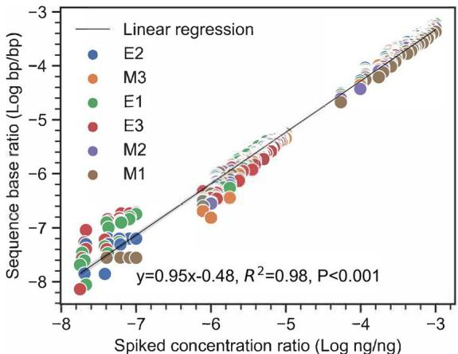
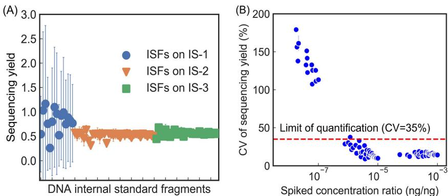
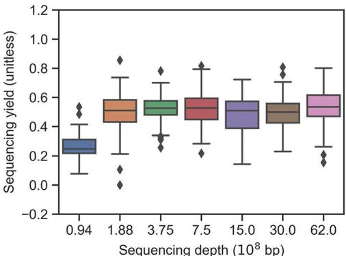
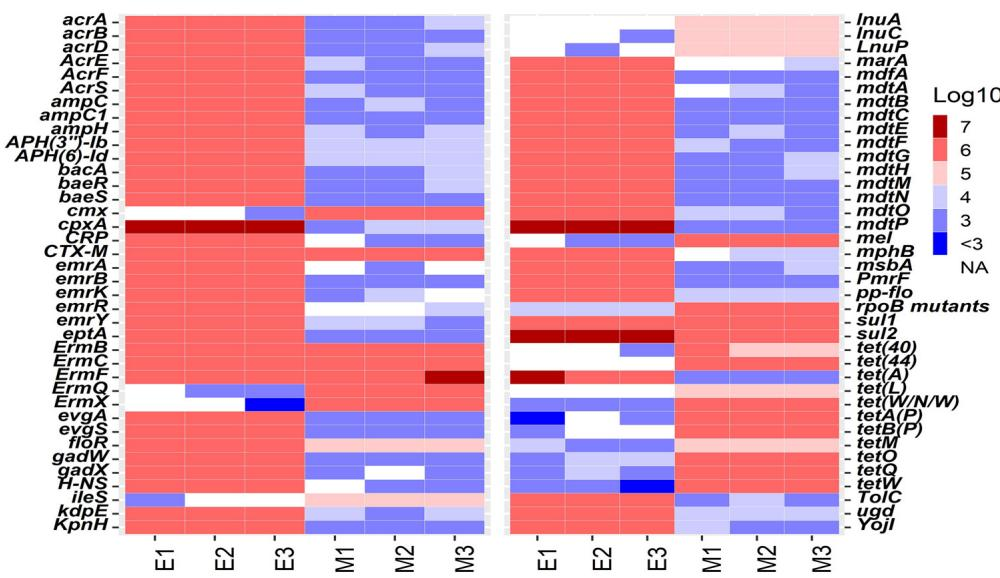
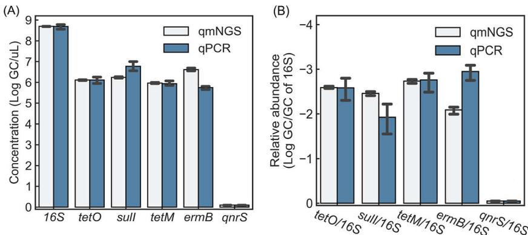

# A Quantitative Metagenomic Sequencing Approach for High-Throughput Gene Quantification and Demonstration with Antibiotic Resistance Genes

Bo Li,a Xu Li,b Tao Yana

a Department of Civil and Environmental Engineering, University of Hawaii at Manoa, Honolulu, Hawaii, USA bDepartment of Civil and Environmental Engineering, University of Nebraska-Lincoln, Lincoln, Nebraska, USA

ABSTRACT Comprehensive microbial risk assessment requires high-throughput quantification of diverse microbial risks in the environment. Current metagenomic next-generation sequencing approaches can achieve high-throughput detection of genes indicative of microbial risks but lack quantitative capabilities. This study developed and tested a quantitative metagenomic next-generation sequencing (qmNGS) approach. Numerous xenobiotic synthetic internal DNA standards were used to determine the sequencing yield $( Y _ { \mathrm { { s e q } } } )$ of the qmNGS approach, which can then be used to calculate absolute concentration of target genes in environmental samples based on metagenomic sequencing results. The qmNGS approach exhibited excellent linearity as indicated by a strong linear correlation $( r ^ { 2 } = 0 . 9 8 )$ ) between spiked and detected concentrations of internal standards. High-throughput capability of the qmNGS approach was demonstrated with artificial Escherichia coli mixtures and cattle manure samples, for which $9 5 \pm 3$ and $2 0 8 \pm 4$ types of antibiotic resistance genes (ARGs) were detected and quantified simultaneously. The qmNGS approach was further compared with quantitative real-time PCR $( { \mathsf { q } } { \mathsf { P } } { \mathsf { C } } { \mathsf { R } } )$ and demonstrated comparable levels of accuracy and less variation for the quantification of six target genes (16S, tetO, sulI, tetM, ermB, and qnrS).

IMPORTANCE Monitoring and comprehensive assessment of microbial risks in the environment require high-throughput gene quantification. The quantitative metagenomic NGS (qmNGS) approach developed in this study incorporated numerous xenobiotic and synthetic DNA internal standard fragments into metagenomic NGS workflow, which are used to determine a new parameter called sequencing yield that relates sequence base reads to absolute concentration of target genes in the environmental samples. The qmNGS approach demonstrated excellent method linearity and comparable performance as the qPCR approach with high-throughput capability. This new qmNGS approach can achieve high-throughput and accurate gene quantification in environmental samples and has the potential to become a useful tool in monitoring and comprehensively assessing microbial risks in the environment.

KEYWORDS qmNGS, internal DNA standards, gene quantification, antibiotic resistance genes

Monitoring and assessment of microbial risks in the environment are critical to the pro-tection of human health but, however, still face tremendous technological challenges. Many microbial pathogens are difficult to cultivate while available cultivation protocols are often time-consuming, labor-intensive, and tedious. As a result, cultivation-based approaches can provide only limited coverage of the high diversity of microbial pathogens in the environment, necessitating surrogate-based strategies, such as enumeration of fecal indicator bacteria Escherichia coli and enterococci for water quality monitoring (1) and Salmonella bacteria for biosolid classification (2). Even more significant are challenges in assessing microbial risks associated with the tremendously diverse antibiotic resistance genes (ARGs) in the natural environment. Studies have reported hundreds of different types of ARGs in human and animal wastes: for example, 175 ARG types were detected in wastewater activated sludge (3), and 109 ARG types were shared among manure samples from different animal sources (4). High diversity of ARGs has also been reported in the natural environment, both anthropogenically impacted and presumably pristine ones, including 56 ARGs in urban stream water and 114 ARGs in wastewater (5), 16 to 372 ARGs across different reclaimed waters (6), and 48 ARG in pristine soil samples (7).

Advancements in molecular methods, in particular quantitative real-time PCR (qPCR), have significantly improved the coverage on diverse microbial risks (8–11) and expanded throughput by adopting novel reactor platforms (e.g., microfluidics-based high-throughput qPCR [HT-qPCR]) (12). However, the qPCR methods still require a priori knowledge of the target genes and the availability of suitable primers (13), which limits throughput and increases costs. Metagenomic sequencing, aided by the rapidly expanding sequence outputs and decreasing costs of emerging next-generation sequencing (NGS) technologies (14), has the unique advantages of requiring no a priori knowledge and offering high-throughput capabilities, which are important for comprehensive assessment of microbial risks in the environment. Prior studies have typically used metagenomic NGS (mNGS) for microbial diversity analysis (15, 16), direct pathogen detection (17, 18), and ARG characterization (5, 6) in environmental samples. However, the conventional mNGS methods can provide only relative abundance of target genes in sequencing outputs, while absolute concentrations of target genes in environmental samples are needed for comprehensive microbial risk assessment.

To achieve absolute quantification in mNGS, efforts have been made by incorporating different internal DNA or RNA standards into the metagenomic DNA or RNA samples (19). Previous studies typically used as internal standards nucleic acid sequences of natural origins that are highly unlikely to be present in the target samples. For example, natural genomic DNA (20, 21) and RNA synthesized from commercial synthetic plasmid vector (21–23) have been used as internal standards in metagenomic and metatranscriptomic sequencing. A previous study used select DNA sequences from diverse microbial genomes to create inverted sequences with no match in the BLAST nt database, which were spiked into environmental samples to quantify microbial community changes and achieve quantitative normalization between samples in metagenomic sequencing (24). However, metagenomic studies often involve different sample types from various environments that typically contain extremely diverse metagenomic nucleic acid sequences, which could increase the possibility that the spiked internal standard sequences could be naturally present in the target samples.

In this study, a quantitative mNGS (qmNGS) approach was developed to achieve high-throughput gene quantification by designing and incorporating xenobiotic and synthetic internal standards in metagenomic sequencing to remove the possibility of the spiked standards coming from natural sources and thereby avoid detection ambiguity. The synthetic DNA internal standards were composed of 20 different DNA fragments with an in-frame insertion of three consecutive stop codons, rendering them highly similar to natural DNA sequences yet completely xenobiotic. A mathematical model was developed for the qmNGS approach, which includes a novel parameter called sequencing yield that accounts for the overall variation in metagenomic sequencing experiments by relating the DNA mass ratios in the samples to the sequence base ratios in the NGS results. The qmNGS approach was tested by spiking different concentrations of the internal standards into DNA samples with different DNA complexity levels (i.e., a mixture of environmental E. coli isolates from cattle manure and direct cattle manure samples). The method linearity of the qmNGS approach was demonstrated with the spiked internal standards, the throughput was demonstrated with the simultaneous quantification of numerous ARGs in the environmental samples, and the accuracy was verified by comparing the qmNGS quantitative results with those of qPCR assays for select target genes.

# RESULTS

qmNGS model. The mathematical relationship between the mass ratio of spiked concentration of an internal standard fragment (ISF) in a DNA sample (ISF-i) $( C _ { \mathrm { | { \mathsf { S F } } - \mathrm { i } } } ,$ nanograms per microliter), the total DNA concentration in the sample $( { C _ { \mathrm { { T O T } } } } ,$ nanograms per microliter), the number of sequence bases detected for ISF-i $( \boldsymbol { n } _ { \mathrm { | S F - j \prime } }$ base pairs), and the total sequence bases detected for the sample $( \boldsymbol { n } _ { \mathtt { T O T } } ,$ base pairs) is described in equation 1.

$$
\frac { C _ { \mathrm { I S F - i } } } { C _ { \mathrm { T O T } } } \cdot Y _ { \mathrm { s e q - i } } = \frac { n _ { \mathrm { I S F - i } } } { n _ { \mathrm { T O T } } }
$$

The parameter $Y _ { \mathrm { s e q - i } }$ (sequencing yield, unitless) relates the spiked mass ratio of ISF-i $( \frac { C _ { 1 5 F - i } } { C _ { \top 0 \top } } )$ and the sequence base ratio $( \frac { n _ { \mathrm { 1 S F - i } } } { n _ { \mathrm { T O T } } } )$ from the sequencing experiments. Ideally, $\frac { n _ { \mathsf { I S F - i } } } { n _ { \mathsf { T O T } } }$ should be the same as $\scriptstyle { \frac { C _ { 1 5 F - \mathrm { i } } } { C _ { \mathrm { T O T } } } } ,$ which equates to a theoretical value of 1 for $Y _ { \mathrm { s e q \mathrm { - } i } }$ . By spiking numerous ISFs into DNA samples to achieved specified mass ratio, $Y _ { \mathrm { s e q - i } }$ can be determined for individual ISFs and used to calculate an overall $Y _ { \mathrm { s e q } }$ . With the assumption that DNA fragments of natural origins behave identically to the spiked ISFs in the sequencing experiments, the $Y _ { \mathrm { s e q } }$ can be used to approximate the sequencing yield in qmNGS for DNA fragments of environmental origin.

To make the synthetic ISs distinguishable from DNA fragments of environmental origin, each ISF contains a synthetic marker of three consecutive stop codons. Since the bioinformatic detection of the IS fragment is based on sequence reads with the synthetic marker and the sequencing processes can result in a portion of the $ { n _ { \mathrm { 1 S F - i } } }$ not containing the synthetic marker (e.g., due to random DNA fragmentation during the sequencing library preparation process), the bioinformatically detectable IS fragment $( \boldsymbol { n } ^ { \prime } _ { \mathrm { \Pi | S F - j } } )$ is only a portion of $ { n _ { \mathrm { 1 S F - i } } }$ (equation 2), which is quantified by the probability of sequence reads containing the internal marker $( P _ { j } )$ (see $P _ { j }$ calculation in the supplemental material). Therefore, the relationship in equation 1 can be further expressed by equation 3.

$$
n _ { \mathrm { \scriptsize ~ I S F - i } } ^ { \prime } = n _ { \mathrm { I S F - i } } \cdot P _ { i }
$$

$$
\frac { C _ { \mathrm { I S F - i } } } { C _ { \mathrm { T O T } } } \cdot Y _ { \mathrm { s e q - i } } = \frac { n _ { \mathrm { \tiny ~ I S F - i } } ^ { \prime } / P _ { i } } { n _ { \mathrm { T O T } } }
$$

In the same sequencing reaction and subsequent bioinformatics analysis, all ISFs and DNA of environmental origin are expected to share similar behaviors and hence similar $Y _ { \mathrm { s e q } } ,$ which can be estimated as the average value of $Y _ { \mathrm { s e q - i } }$ of all ISFs (equation 4). The $Y _ { \mathrm { s e q } }$ can then be used to quantify the absolute concentration of target genes $( \boldsymbol { C } _ { \mathrm { t a r g e t } } ,$ nanograms per microliter) (equation 5) and conversion to gene copy (GC) numbers $( C _ { \mathrm { t a r g e t - G C } } ,$ GC per microliter) (equation 6).

$$
Y _ { \mathrm { s e q } } = \left( \sum _ { i = 1 } ^ { n } Y _ { \mathrm { s e q - i } } \right) / n
$$

$$
\frac { C _ { \mathrm { t a r g e t } } } { C _ { \mathrm { T O T } } } \cdot Y _ { \mathrm { s e q } } = \frac { n _ { \mathrm { t a r g e t } } } { n _ { \mathrm { T O T } } }
$$

$$
C _ { \mathrm { t a r g e t - G C } } = { \frac { C _ { \mathrm { t a r g e t } } \times N _ { A } } { L _ { \mathrm { t a r g e t } } \times 1 0 ^ { 9 } \times 6 5 0 } }
$$

where $N _ { A }$ is Avogadro's constant, $6 . 0 2 2 \times 1 0 ^ { 2 3 } \mathrm { m o l } ^ { - 1 }$ ; $L _ { \mathrm { t a r g e t } }$ is the length of the target gene (unit, base pairs); $1 0 ^ { 9 }$ is the conversion factor of nanograms to grams; 650 is the molecular weight of DNA per base pair (units, gram $\cdot$ mole21  base pair21); $\boldsymbol { n } _ { \mathrm { t a r g e t } }$ is sequence bases of target gene, calculated as the sum of alignment length of all sequence reads assigned to the gene (units, base pairs).

  
FIG 1 Correlation between detected sequence base ratio $( {  { n _ { \mathrm { \vert S F - i } } } } / {  { n _ { \mathrm { \tilde { \tau } \mathrm { { o } T } } } } } ,$ base pairs/base pairs) and spiked DNA concentration ratio $( C _ { 1 5 F - j } / C _ { \mathrm { T O T } } ,$ nanograms/nanograms) of the ISFs in the three replicate mixed $E$ coli DNA samples (E1 to E3) and manure samples (M1 to M3).

qmNGS method linearity. The six samples spiked with the ISFs were tested with the qmNGS approach to determine the method linearity. An average of $4 . 1 \times 1 0 ^ { 7 }$ (sample standard deviation $s = 0 . 0 4 \times 1 0 ^ { 7 } \mathrm { b }$ p) sequencing reads with length of 150 bp and $6 . 2 \times 1 0 ^ { 9 } \mathsf { b p }$ $( s = 6 . 3 \times 1 0 ^ { 7 } \mathsf { b p } )$ sequence bases were obtained (see Table S2 in the supplemental material). After quality trimming, $9 2 . 2 \% \pm \ : 0 . 9 \%$ (sample mean $\pm$ sample standard deviation) of sequencing reads were retained, resulting in $3 . 8 \times 1 0 ^ { 7 } \pm 0 . 1 .$ $\times 1 0 ^ { 7 }$ trimmed reads with average length of $1 4 7 . 1 \pm 0 . 3 \mathrm { b p }$ and $5 . 6 \times 1 0 ^ { 9 } ~ \pm ~ 1 . 1 -$ $\times 1 0 ^ { 8 }$ bp sequence bases.

Excellent method linearity of qmNGS with an $r ^ { 2 }$ of 0.98 was observed between the spiked mass ratio $( \frac { C _ { 1 5 F - \mathrm { i } } } { C _ { \mathsf { T O T } } } )$ and the sequence base ratio $( \frac { n _ { \mathsf { I S F - i } } } { n _ { \mathsf { T O T } } } )$ for the 79 ISFs (Fig. 1). All the ISFs spiked at $1 . 8 \times 1 0 ^ { - 8 }$ to $1 . 8 \times 1 0 ^ { - 3 } \mathrm { n g / n g }$ mass ratio were detected in at least one DNA sample, with the detected sequencing bases in the range of $2 2 \pm 3 9$ to $1 0 ^ { 6 . 2 8 ~ \pm }$ $\textstyle 1 0 ^ { 5 . 4 1 }$ bp (Table S1). The $Y _ { \mathrm { s e q } }$ values for the ISFs exhibited limited variations among the six replicates in the analysis $( 0 . 6 0 \pm 0 . 1 6 )$ ) (Fig. 2A). Coefficient of variation (CV) of $Y _ { \mathrm { s e q - i } }$ for each ISF in the six replicates showed an overall CV in the range of $9 . 1 \%$ to $1 7 9 . 3 \% \mathrm { ; }$ larger variations were observed for the ISFs spiked at lower concentrations (Fig. 2B). Defining the limit of quantification (LOQ) as the lowest concentration with CV less than $3 5 \%$ (25) and limit of detection (LOD) as the lowest concentration detection in all the three replicates $9 5 \%$ confidence level [25]), the LOQ and LOD of the qmNGS approach were determined to be $7 . 8 \times 1 0 ^ { - 7 } \mathsf { n g / n g }$ and $1 . 0 \times 1 0 ^ { - 7 } \mathsf { n g / n g } ,$ respectively. The $Y _ { \mathrm { s e q } }$ for the ISFs spiked at a concentration ratio above the LOQ were maintained at a steady level $( 0 . 5 5 \pm 0 . 0 5 ) $ , with an average CV of $1 6 . 2 \%$ $( s = 4 . 9 \% )$ ). The $Y _ { \mathrm { s e q } }$ for all ISFs above the LOQ showed a normal distribution (as indicated by an $R ^ { 2 }$ of 0.99 in a quantile-quantile plot [Fig. S4]), and analyses of variance (ANOVAs) showed no significant difference in $Y _ { \mathrm { s e q } }$ among different ISFs $( P = 0 . 0 8 )$ ). $Y _ { \mathrm { s e q } }$ showed limited difference $\mathrm { ( C V = } 3 . 9 \% )$ paired t test, $P < 0 . 0 0 1$ ) between the two sample types with different complexity, with averaged $Y _ { \mathrm { s e q } }$ of 0.56 $( s = 0 . 0 7 $ ) and 0.53 $( s = 0 . 0 6 )$ ) in the E. coli mixture samples and manure samples, respectively.

  
FIG 2 Average sequencing yield values of the 79 DNA internal standard fragments (ISFs) located on the three blocks (IS-1, -2, and -3) that were spiked at different concentrations (A) and their coefficient of variation (CV) with respect to their spiked concentration ratio (B). Error bars in panel A were standard deviations from six samples.

  
FIG 3 The impact of different sequencing depths (through resampling) on the distribution of sequencing yield values of the ISFs. Only ISFs spiked at a concentration ratio above the limit of quantification (LOQ) are included in the box plots.

Effect of sequencing depth on the qmNGS results. Subsamples with sequencing depths of $3 0 \times 1 0 ^ { 8 }$ , $1 5 \times 1 0 ^ { 8 } $ , $7 . 5 \times 1 0 ^ { 8 } ,$ $3 . 7 5 \times 1 0 ^ { 8 } ,$ , $1 . 8 8 \times 1 0 ^ { 8 } ,$ , and $0 . 9 4 \times 1 0 ^ { 8 }$ bp were obtained from the original sequencing data of ca. $6 2 \times 1 0 ^ { 8 }$ bp for all sequenced DNA samples. Decreasing sequencing depths resulted in increasing LOQ values of qmNGS: $7 . 8 \times 1 0 ^ { - 7 }$ , $2 . 7 \times 1 0 ^ { - 6 } ,$ , $5 . 4 \times 1 0 ^ { - 5 }$ , $5 . 0 \times 1 0 ^ { - 6 }$ , $5 . 4 \times 1 0 ^ { - 5 }$ , $5 . 4 \times 1 0 ^ { - 5 }$ , and $2 . 0 \times 1 0 ^ { - 4 } \mathsf { n g / n g }$ for sequencing depths of $6 2 \times 1 0 ^ { 8 } ,$ $3 0 \times 1 0 ^ { 8 }$ , $1 5 \times 1 0 ^ { 8 } ,$ , $7 . 5 \times 1 0 ^ { 8 }$ , $3 . 7 5 \times 1 0 ^ { 8 }$ , $1 . 8 8 \times 1 0 ^ { 8 } ,$ and $0 . 9 4 \times 1 0 ^ { 8 }$ bp, respectively (Fig. S5). In contrast, the sequencing depth did not cause significant difference in $Y _ { \mathrm { s e q } }$ values except for the lowest sequencing depth. $0 . 9 4 \times 1 0 ^ { 8 }$ bp (Fig. 3). For sequencing depths ranging from $1 . 8 8 \times 1 0 ^ { 8 }$ to $6 2 \times 1 0 ^ { 8 }$ bp, average $Y _ { \mathrm { s e q } }$ values $( \pm \textit { s } )$ of 0.55 $( \pm 0 . 0 5 )$ ), 0.49 $( \pm 0 . 0 4 )$ ), 0.48 $\pm 0 . 0 4 )$ ), 0.53 $\pm 0 . 0 5 $ ), 0.52 $( \pm 0 . 0 5 )$ , and 0.50 $( \pm 0 . 0 4 )$ for sequencing depths of $6 2 \times 1 0 ^ { 8 }$ , $3 0 \times 1 0 ^ { 8 }$ , $1 5 \times 1 0 ^ { 8 }$ , $7 . 5 \times 1 0 ^ { 8 }$ , $3 . 7 5 \times 1 0 ^ { 8 }$ , and $1 . 8 8 \times 1 0 ^ { 8 }$ bp, respectively, were observed. The $Y _ { \mathrm { s e q } }$ depth of $0 . 9 4 \times 1 0 ^ { 8 }$ bp decreased significantly compared with other sequencing depths (analysis of covariance [ANCOVA], $P < 0 . 0 0 1$ ), with an average $Y _ { \mathrm { s e q } }$ value of only 0.26 $( \pm 0 . 0 4 )$ .

High-throughput detection and quantification of ARGs. The averaged $Y _ { \mathrm { s e q } }$ value of ISFs at the original sequencing depth, which was 0.55, was used for the quantification of natural ARGs in the six DNA samples. 16S rRNA genes were also quantified for estimating total bacterial biomass and for the calculation of relative abundances of ARGs (i.e., [ARGs]/[16S rRNA gene]). Up to 104 (sample mean $\pm$ standard deviation: $9 5 \pm 3$ ) and 258 $( 2 0 8 \pm 4 )$ types of ARGs were detected in the E1 to E3 and M1 to M3 samples, with total concentration of $1 0 ^ { 8 . 6 \pm 0 . 0 0 3 }$ and $1 0 ^ { 7 . 5 \pm 0 . 0 1 }$ copies $/ \mu |$ l, respectively. ARGs with relative abundance no less than $0 . 5 \%$ in at least one of the samples were summarized in Fig. 4. Within the same sample type, the majority of the detected ARGs were detected through the three replicates. Eighty-seven ARG types were detected in E1 to E3 (accounting for $9 9 . 9 9 8 \% \pm \ 0 . 0 0 1 \%$ of total concentration in each sample), and 159 ARG types were detected in M1 to M3 (accounting for $9 9 . 8 \% \pm \ : 0 . 0 2 \%$ of total ARG concentration in each sample) (Fig. 4), indicating good consistency of the qmNGS approach. The CVs of the detection of ARGs among the triplicate samples were in the range of $0 . 3 \%$ to $1 3 3 . 9 \% ,$ with the averaged CV being $2 8 . 2 \% \pm \ 2 5 . 8 \%$ (Fig. S6). The observed CV decreased with increasing abundances of ARGs in the DNA samples; in other words, more abundant ARGs showed more consistent quantification than the less abundant ones, which is similar to the observation made for the spiked ISFs. The concentrations of 16S genes in the E1 to E3 and M1 to M3 samples were $1 0 ^ { 7 . 9 \pm 0 . 0 0 4 }$ and $1 0 ^ { 8 . 7 \pm 0 . 0 1 }$ copies $/ \mu |$ , respectively; the limited standard deviations demonstrated very limited variation in the replicate samples.

  
FIG 4 Heat map of the absolute concentrations of ARGs $( \log _ { 1 0 }$ gene copies $/ \mu |$ ) in the DNA samples from the E. coli isolate mixtures (E1 to E3) and cattle manure samples (M1 to M3). Only ARGs detected with relative abundances of ${ > } 0 . 5 \%$ are presented here.

Verification of qmNGS quantification by qPCR. The qmNGS approach for gene quantification was verified by comparing the qmNGS results with ${ \mathsf { q P C R } }$ results for six target genes (16S rRNA gene and five ARGs [tetO, sulI, tetM, ermB, and qnrS]) in samples M1 to M3. There were no statistically significant differences in the concentrations of 16S and ARGs as determined by the two methods (paired t test, $P = 0 . 5 6$ ) (Fig. 5A). A similar observation was made when ARGs were normalized by the 16S concentration (Fig. 5B), and no significant difference between the relative abundances of ARGs determined by the two methods was found (paired t test, $P { = } 0 . 5 9$ ).

Moreover, the qmNGS quantification of triplicate samples exhibited significantly less variation. For 16S and the four detected ARGs, the average CV value of the triplicate detection by qmNGS $( 6 . 7 \% \pm 4 . 4 \%$ ) was significantly less than the average CV value by ${ \mathsf { q P C R } }$ $( 2 5 . 8 \% \pm \ 1 0 . 3 \%$ ) (paired $t$ test, $P { = } 0 . 0 3$ ). For the relative abundance of ARGs normalized by the 16S concentration, the average CV value by qmNGS $1 1 . 8 \% \pm 6 . 2 \%$ was also significantly less than the average CV value by ${ \mathsf { q P C R } }$ $( 5 1 . 8 \% \pm 1 1 . 1 \% )$ (paired t test, $P { = } 0 . 0 1$ ).

# DISCUSSION

With the tremendous throughput of NGS technologies and rapidly decreasing sequencing costs and increasingly rapid turnaround, metagenomic sequencing has the potential to replace traditional cultivation-based and molecular methods (including qPCR) in microbial risk assessment in the environment. Although relative abundance of target genes may be calculated by using various normalization strategies (e.g., normalization by the 16S rRNA gene), metagenomic sequencing typically cannot provide absolute quantification, which is important to quantitative microbial risk assessment. Efforts have been made by incorporating different internal DNA or RNA standards to achieve quantitative metagenomic sequencing, while most previous studies still used naturally present sequences as internal standards which can still be found in environmental samples. The qmNGS approach proposed in this study aimed to address this challenge by using spiked xenobiotic and synthetic DNA internal standard fragments (ISFs) and companion bioinformatic strategies that convert numbers of sequence base pairs detected for specific genes in a metagenomic experiment to absolute gene concentrations (i.e., GC numbers per volume).

  
FIG 5 Comparison of qmNGS and qPCR in quantifying the 16S rRNA gene and five ARGs in the cattle manure samples (M1 to M3). qnrS was not detected by either qmNGS or qPCR.

The ISFs contain an insertion of a xenobiotic and synthetic DNA marker that is not present in DNA fragments of natural origin and are essential for the proposed qmNGS approach. Several previous sequencing efforts used as the internal standard a spiked RNA fragment that was expected to be absent from the samples being analyzed such as natural DNA (20, 21) and RNA synthesized from commercial synthetic plasmid vector (22). However, the tremendous diversity of environmental samples makes it nearly impossible to use natural nucleic acids as internal standards (even synthetic plasmid vectors can be found in the environment [26]) based on their expected presence/ absence in the target samples, and those conserved sequences in microbial genomes may also introduce bias into sequencing results of samples. The xenobiotic and synthetic marker in this study (i.e., an in-frame insertion of three consecutive stop codons) provides unequivocal certainty that can differentiate the spiked ISFs from the natural DNA samples when they are mixed and sequenced together. The ISFs used in this study were synthesized with ARGs and 16S rRNA genes; however, the synthetic marker insertion strategy could be applied to synthesize internal DNA standards with any other DNA sequences.

This design of ISFs also made it possible to utilize a large number of different types of ISFs in parallel with DNA from the environmental samples. In this study, the employment of numerous ISFs spiked at multiple concentration levels in the qmNGS approach allowed for statistical assessment of method precision and linearity. The high linearity of the qmNGS approach is attributable to its avoidance of PCR amplification and associated biases, which is believed to be among the primary reasons for notable disparity between expected DNA composition and sequencing results (27–29). Additionally, the spiking strategy of synthetic DNA internal standards may also be applicable to amplicon-based sequencing experiments to achieve quantitative detection of amplicons. It was shown that the sequencing display of amplicons can improve both the sensitivity of PCR/qPCR and the multiplex level of multiplex PCR (mPCR) assays; however, it still suffered from nonquantitative detection and uneven amplification of different targets in mPCR (30, 31). The uneven amplification of difference targets may be assessed by using multiple ISFs specifically designed for the target genes and the quantification strategies in the qmNGS approach.

A key parameter in achieving quantification by the qmNGS approach is the sequencing yield $( Y _ { \mathrm { { s e q } } } )$ , which takes into account numerous variations in the multistep process of metagenomic sequencing experiments. Since the ISFs undergo the same processes (including DNA fragmentation, library preparation, and sequencing) as DNA samples of environmental origin, their sequencing yields can be calculated and used to estimate the overall sequencing yield of the qmNGS process. Previous studies used a sequencing recovery parameter (or sample-sequencing depth per the work of Gifford et al. [22]), which was defined as the ratio of the detected base pairs of an internal standard to the base pairs that were spiked into a sample, to evaluate performance of a metagenomic sequencing experiment. This sequencing recovery parameter, however, is still affected by the total nucleic acid mass of the samples and the total number of base pairs of sequencing data; analysis of sequencing recovery of ISFs in subsamples at different sequencing depths in this study showed the sequencing recovery linearly decreased with the sequencing depth (see Fig. S7 in the supplemental material), which makes it incomparable among different experiments that employ different sequencing depths. In contrast, the $Y _ { \mathrm { s e q } }$ parameter of the qmNGS approach in this study is normalized to the quantity of DNA samples (equation 1, $C _ { \mathrm { T O T } } )$ and the total number of base pairs of sequencing data (equation 1, $n _ { \mathrm { T O T } } )$ . As a result, the ISFs used in this study produced very consistent sequencing yields in spite of different spiked concentrations of the different ISFs and the different sequencing depths, as shown in Fig. 2 to 4.

The capability of using numerous ISFs simultaneously by the qmNGS approach also allows for determination of method detection limit and robust identification of optimal spiking concentrations to be used in calculating the overall sequencing yield. Although consistency in sequencing yield was observed for different ISFs on the IS-2 and IS-3 blocks, the ISFs on the IS-1 block, which were spiked at lower concentration ratios $( C _ { \mathrm { \scriptscriptstyle B } } / C _ { \mathrm { \scriptscriptstyle T O T } } < 1 0 ^ { - 7 } )$ were detected with only limited sequence bases, exhibiting large variation in sequencing yield among individual ISFs. This allowed for the determination of the method quantification and detection limit of the qmNGS approach and selection of ISFs on IS-2 and IS-3 for the calculation of overall sequencing yield to be used to quantify target ARGs in the samples. Comparison of sequencing yields at different sequencing depths (Fig. 3 and Fig. S5) showed that sequencing depth does not affect the sequencing yield but does affect the LOQ. As usually different sequencing depths are obtained in different sequencing experiments or even in the same experiment for different samples, spiking internal standards at different concentration levels (for example, the range of $1 . 8 \times 1 0 ^ { - 8 }$ to $1 . 8 \times 1 0 ^ { - 3 } \mathsf { n g / n g }$ for the 79 ISFs or $1 0 ^ { - 7 } , 1 0 ^ { - 5 }$ , and $\scriptstyle 1 0 ^ { - 3 }$ for the three ISs) is recommended to determine the LOQ.

High throughput of the qmNGS approach was demonstrated with the quantification of up to 208 ARGs in individual samples (Fig. 4). The HT-qPCR method has been widely employed for high-throughput quantification of diverse ARGs, and the traditional mNGS approach, due to its lack of absolute quantification, was typically used only to verify results from HT-qPCR experiments (32, 33). HT-qPCR can achieve simultaneous detection of up to 200 target genes (4, 34–36), but it is limited by the availability of primers specific for the target genes and is restricted to the targeted genes only. For example, a previous study compared the ARG profiles in river water samples by using both HT-qPCR and mNGS, and more ARGs were detected by the nontargeted mNGS approach (160 ARG types) than by the HT-qPCR approach (104 ARG types) (33). The high-throughput capability of mNGS in gene quantification has also been observed in the two previous studies that found 170 ARGs in wastewater (23) and 62 to 361 ARGs in manure (20) detected by quantitative metagenomic sequencing.

Compared to qPCR-based quantification methods, the qmNGS approach also provided higher specificity because of its sequence-based detection. The two major types of fluorescence reporting dye used in qPCR include sequence-specific hydrolysis probes (e.g., TaqMan probe) and nonspecific intercalating dyes (e.g., SYBR green) (37). SYBR green is more commonly used because of its cost-efficiency and has been used in most of the HT-${ \mathsf { q P C R } }$ assays for ARG detection; however, it is not a sequence-specific reporter and also detects potential nonspecific amplification in qPCR (38). Probe-based qPCR is considered among the most reliable methods of gene quantification because of the additional specificity and accuracy provided by the probe. In this study, the qmNGS approach demonstrated a level of accuracy comparable to probe-based qPCR and even less variation as exemplified by the quantification of the 16S rRNA gene and four detected ARGs, and the nondetection of qnrS gene by both approaches in the samples also supported the efficacy of the qmNGS approach (Fig. 5). Current NGS has high consistency and reproducibility, as reported in previous studies of bacterial genotyping (39) and microbial community analysis (40), and NGS does not rely on primer and probe-specific PCR and is less vulnerable to PCR inhibition which causes quantification variations, explaining the lower variation in gene quantification in qmNGS than in qPCR.

Overall, a novel qmNGS approach was developed for high-throughput gene quantification by spiking xenobiotic and synthetic DNA ISFs into environmental DNA samples.

The high throughput and accuracy of the qmNGS approach in gene quantification without a priori knowledge of the targets were demonstrated by using ARGs in environmental samples in this study. The qmNGS approach can also be used to quantify any gene of interest, including virulence factors, 16S rRNA genes, mobile genetic elements, metal resistance genes, and gene markers of emerging significance in environmental samples. In its current form, the primary limitation of the qmNGS approach is its method sensitivity, as the current limit of quantification in this study was determined by the spiked ISFs to be around $7 . 8 \times 1 0 ^ { - 7 } \mathsf { n g / n g }$ DNA (or $1 0 ^ { 3 . 5 }$ copies $\scriptstyle \prime \mu \mid$ DNA), which is lower than some of the PCR-based methods (e.g., $1 0 ^ { 1 }$ to ${ 1 0 ^ { 4 } }$ copies $/ \mu |$ DNA by HT-qPCR assays [13] and $1 0 ^ { 1 }$ copies $/ \mu |$ DNA by ${ \mathsf { q P C R } }$ in this study). This, however, can be remediated by using deeper sequencing outputs, which is becoming more economically feasible as the NGS technologies continue to increase throughput and decrease costs (41).

# MATERIALS AND METHODS

Design of synthetic DNA internal standards. Twenty xenobiotic and synthetic DNA internal standard fragments (ISFs) were designed in this study. The ISFs are identical to common DNA targets used in the detection of 16S rRNA gene (16S), intI1, and 18 common ARGs, except for an in-frame insertion of a synthetic DNA marker of three consecutive stop codons (TAGTAATGA) (see Fig. S1 and Table S1 in the supplemental material). This design makes the ISFs completely xenobiotic and hence allows them to be distinguishable from actual gene fragments of environmental origin. The 20 ISFs have different lengths (103 to $4 3 0 \mathsf { b p }$ ) and different GC contents $( 2 6 . 8 \%$ to $6 3 . 8 \%$ ).

The 20 ISFs were synthesized consecutively in three blocks and embedded in the pUCIDT vector (IDT; Coralville, IA, USA) and are referred to as internal standards 1, 2, and 3 (IS-1, IS-2, and IS-3). The three ISs contained five, eight, and seven ISFs, with total insert lengths of 758 bp, 1,509 bp, and 1,732 bp, respectively. Different ISFs located on the same ISs inherently have the same copy number, while the different ISs can be used with different concentrations, which provides flexibility in experimental design and data interpretation. Additionally, multiple consecutive ISFs on the same IS can be considered one entity during data analysis, which provides additional combined fragments for statistical analysis. A total of $7 9 \ 1 \mathsf { S F S } ,$ including individual ISFs and combination of consecutive ISFs, were investigated in this research (Table S1). The 79 ISFs exhibited GC contents of $2 6 . 8 \%$ to $6 3 . 8 \%$ and fragment lengths of 94 to 1,732 bp (Fig. S3).

The IS DNA standards were measured using a Qubit4 fluorometer (Thermo Fisher Scientific, Waltham, MA, USA). For metagenomic sequencing, the ISFs were spiked into the DNA samples to achieve different mass ratios (nanogram/nanogram) between the IS standard concentration (nanograms per microliter) and the sample DNA concentration (nanograms per microliter), resulting in spiked concentration ratios for the 79 ISFs within the range of $1 . 8 \times 1 0 ^ { - 8 }$ to $1 . 8 \times 1 0 ^ { - 3 } \mathsf { n g / n g }$ (Table S1 and Fig. S2).

Sample DNA preparation. Two types of DNA samples with different DNA complexity levels were prepared and used in the experiments, including DNA extracts from a mixture of E. coli isolates with less environmental complexity (in triplicates and termed E1 to E3) and a cattle manure sample with higher environmental complexity (in triplicates and termed M1 to M3). Fresh cattle manure samples were collected from the U.S. Meat Animal Research Center near Clay Center, NE. To collect manure E. coli isolates, manure slurry was diluted in phosphate-buffered saline (PBS) and then spread on modified membrane-thermotolerant Escherichia coli (mTEC) agar plates with subsequent incubation of $2 \pm 0 . 5 \mathsf { h }$ at $3 5 ^ { \circ } \mathsf { C } \pm 0 . 5 ^ { \circ } \mathsf { C }$ in incubator and $4 4 . 5 ^ { \circ } \mathsf { C } \pm 0 . 2 ^ { \circ } \mathsf { C }$ in water bath for $2 2 \pm 2 \mathsf { h }$ (42). Blue colonies from the modified mTEC agar plates were picked and further streaked on LB agar plates and incubated at $3 7 ^ { \circ } \mathsf { C }$ overnight for further purification. Purified E. coli isolates from each LB agar plate were then inoculated into LB 96-well plates, incubated at $3 7 ^ { \circ } \mathsf { C }$ for 6 h (with final optical density at $6 0 0 \mathsf { n m }$ $[ \mathrm { O D } _ { 6 0 0 } ]$ of 0.4 to 1.0), and then mixed in equal concentration based on the ${ \tt O D } _ { 6 0 0 }$ values to prepare an E. coli mixture.

The E. coli mixture and cattle manure samples were subjected to total genomic DNA extraction using the E.Z.N.A. soil DNA kit (Omega Bio-tek, Norcross, GA) and E.Z.N.A. bacterial DNA kit (Omega Bio-tek, Norcross, GA), respectively, by following the manufacturer’s instruction. All DNA extracts were quantified using a Qubit4 fluorometer and then stored at $- 2 0 \textdegree C$ until further analysis.

Metagenomic NGS. The E1 to E3 and M1 to M3 sample DNAs were spiked with the ISs and then subjected to metagenomic NGS. Sequencing library preparation and shotgun sequencing were performed by BGI (Shenzhen, China). In short, sample DNA was fragmented randomly, and the required-length DNA fragments were isolated by electrophoresis. After sequencing adapters were ligated to the isolated DNA fragments, sequencing was conducted using an Illumina HiSeq 4000 platform. An average of 3.1 Gb per sample of 150-bp paired-end sequencing data was collected, and the raw sequencing data are available in NCBI’s Sequence Read Archive (see below and Table S2).

Bioinformatic analysis. Forward and reverse paired ends were quality trimmed using Trimmomatic (43) (with parameters slidingwindow:4:20 leading:10 trailing:10 minlen:50). The quality-trimmed reads were searched against a local database containing the sequences of the spiked ISFs by using BLASTN search with an E value cutoff of $1 0 ^ { - 5 }$ . The detection of ISFs was based on two criteria including the presence of the synthetic marker and hits with alignment bit score higher than 50 and identity higher than $9 0 \%$ to the reference sequences of ISFs. The detected ISFs were normalized to detected sequence bases by summarizing the alignment length of all hit reads for each DNA fragment. To study the effect of sequencing depth on the sequencing results, the original sequencing data were randomly subsampled with a custom Bash script to generate seven different sequence depths (i.e., $1 0 0 \%$ , $5 0 \%$ , $2 5 \%$ $1 2 . 5 \%$ $6 . 2 5 \% ,$ $3 . 1 3 \%$ , and $1 . 5 6 \%$ of the received sequencing reads). Subsamples were analyzed by following the exact same bioinformatic procedures as described above.

To detect environmental ARGs in the DNA samples, quality-trimmed reads except for those identified as the spiked ISFs were searched against the CARD database (44) using BLASTX with the same cutoff criteria used in the detection of ISF standards (i.e., bit score higher than 50 and identity higher than $9 0 \%$ ). For the detection of 16S rRNA gene, the sequencing reads were further analyzed by using METAXA2 (45) with default parameters.

qPCR quantification of 16S rRNA and ARGs. To verify the qmNGS quantification accuracy and precision, the 16S rRNA gene and five ARGs (tetO, sulI, tetM, ermB, and qnrS) in the manure samples were quantified using ${ \mathsf { q P C R } }$ assays, which are summarized in Table S3. The qPCRs were run on an ABI 7300 system (Applied Biosystems, Waltham, MA). All qPCR mixtures were $2 0 \jmath { - \mu } |$ reaction mixtures consisting of $1 \times$ GoTaq probe qPCR master mix (Promega, Madison, WI) run in duplicates. Primers, probes, and cycling conditions for qPCR assays are provided in the supplemental material (Table S3). Genomic DNAs of E. coli ATCC 25922 (with five 16S rRNA copies per genome), the IS-1 plasmid, and the IS-2 plasmid were used as the DNA templates for qPCR of 16S rRNA, sulI, and tetO, respectively. Synthesized DNA containing the target genes (gBlocks; IDT, Coralville, IA) was used as the DNA template for tetM, ermB, and qnrS. All standard curves were constructed from 10-fold serial dilutions of DNA template with concentrations ranging from $1 0 ^ { 1 }$ to $1 0 ^ { 7 }$ gene copies per reaction (GC/rxn). The amplification efficiencies of the ${ \mathsf { q P C R } }$ assays in this study ranged from $8 2 \%$ to $1 0 9 \%$ , with limit of quantification (LOQ) of $1 0 ~ \mathsf { G C / r x n }$ for each assay. Negative controls for the ${ \mathsf { q P C R } }$ (blank) were included in each qPCR run. Threshold cycle $\left( C _ { \tau } \right)$ value of each sample was calculated using arithmetic mean of duplicates. The concentration of target gene was calculated from the standard curve and reported as GC per microliter.

Statistical analysis. Data manipulation and statistical analyses were conducted using the packages in Jupyter or R, including dplyr, tidyr, stringr, scipy, pandas, and numpy. Plots were generated using seaborn and scipy package in Jupyter and ggplot2 package in R.

Data availability. Raw sequencing data were deposited in the NCBI Sequence Read Archive under accession numbers SRR1139176 to SRR11391801.

# SUPPLEMENTAL MATERIAL

Supplemental material is available online only.   
SUPPLEMENTAL FILE 1, XLSX file, 0.03 MB.   
SUPPLEMENTAL FILE 2, PDF file, 2 MB.

# ACKNOWLEDGMENTS

This study was supported by a grant from USDA NIFA (2017-68003-26497).   
We declare no competing interests.

# REFERENCES

1. US Environmental Protection Agency. 2012. Recreational water quality criteria. US Environmental Protection Agency, Washington, DC.   
2. US Environmental Protection Agency. 2006. Method 1682: Salmonella in sewage sludge (biosolids) by modified semisolid Rappaport-Vassiliadis (MSRV) medium vol EPA-821-R-06–14. Office of Water (4303T), US Environmental Protection Agency, Washington, DC.   
3. Yang Y, Li B, Ju F, Zhang T. 2013. Exploring variation of antibiotic resistance genes in activated sludge over a four-year period through a metagenomic approach. Environ Sci Technol 47:10197–10205. https://doi.org/10 .1021/es4017365.   
4. Qian X, Gu J, Sun W, Wang X-J, Su J-Q, Stedfeld R. 2018. Diversity, abundance, and persistence of antibiotic resistance genes in various types of animal manure following industrial composting. J Hazard Mater 344:716–722. https:// doi.org/10.1016/j.jhazmat.2017.11.020.   
5. Baral D, Dvorak BI, Admiraal D, Jia S, Zhang C, Li X. 2018. Tracking the sources of antibiotic resistance genes in an urban stream during wet weather using shotgun metagenomic analyses. Environ Sci Technol 52:9033–9044. https://doi.org/10.1021/acs.est.8b01219.   
6. Garner E, Chen C, Xia K, Bowers J, Engelthaler DM, McLain J, Edwards MA, Pruden A. 2018. Metagenomic characterization of antibiotic resistance genes in full-scale reclaimed water distribution systems and corresponding potable systems. Environ Sci Technol 52:6113–6125. https://doi.org/ 10.1021/acs.est.7b05419.   
7. Li B, Chen Z, Zhang F, Liu Y, Yan T. 2020. Abundance, diversity and mobility potential of antibiotic resistance genes in pristine Tibetan Plateau soil as revealed by soil metagenomics. FEMS Microbiol Ecol 96:fiaa172. https://doi.org/10.1093/femsec/fiaa172.   
8. von Wintzingerode F, Gobel UB, Stackebrandt E. 1997. Determination of microbial diversity in environmental samples: pitfalls of PCR-based rRNA analysis. FEMS Microbiol Rev 21:213–229. https://doi.org/10.1111/j.1574 -6976.1997.tb00351.x.   
9. Frahm E, Obst U. 2003. Applications of the fluorogenic probe technique (TaqMan PCR) to detection of Enterococcus spp. and Escherichia coli in water sample. J Microbiol Methods 52:123–131. https://doi.org/10.1016/ S0167-7012(02)00150-1.   
10. Spano G, Beneduce L, Terzi V, Stanca AM, Massa S. 2005. Real-time PCR for the detection of Escherichia coli O157:H7 in dairy and cattle wastewater. Lett Appl Microbiol 40:164–171. https://doi.org/10.1111/j.1472-765X.2004.01634.x.   
11. Smith CJ, Osborn AM. 2009. Advantages and limitations of quantitative PCR (Q-PCR)-based approaches in microbial ecology. FEMS Microbiol Ecol 67:6–20. https://doi.org/10.1111/j.1574-6941.2008.00629.x.   
12. Spurgeon SL, Jones RC, Ramakrishnan R. 2008. High throughput gene expression measurement with real time PCR in a microfluidic dynamic array. PLoS One 3:e1662. https://doi.org/10.1371/journal.pone.0001662.   
13. Crane ${ \mathsf { S L } } ,$ van Dorst J, Hose GC, King CK, Ferrari BC. 2018. Microfluidic ${ \mathsf { q P C R } }$ enables high throughput quantification of microbial functional genes but requires strict curation of primers. Front Environ Sci 6:145. https://doi.org/10.3389/fenvs.2018.00145.   
14. Shokralla $\mathsf { S } ,$ Spall JL, Gibson JF, Hajibabaei M. 2012. Next-generation sequencing technologies for environmental DNA research. Mol Ecol 21:1794–1805. https://doi.org/10.1111/j.1365-294X.2012.05538.x.   
15. Caporaso JG, Kuczynski J, Stombaugh J, Bittinger K, Bushman FD, Costello EK, Fierer N, Pena AG, Goodrich JK, Gordon JI, Huttley GA, Kelley ST, Knights D, Koenig JE, Ley RE, Lozupone CA, McDonald D, Muegge BD, Pirrung M, Reeder J, Sevinsky JR, Turnbaugh PJ, Walters WA, Widmann J, nig throughput community sequencing data. Nat Methods 7:335–336. https://doi.org/10.1038/nmeth.f.303.   
16. Fierer N, Leff JW, Adams BJ, Nielsen UN, Bates ST, Lauber ${ \mathsf { C L } } ,$ Owens S, Gilbert JA, Wall DH, Caporaso JG. 2012. Cross-biome metagenomic analyses of soil microbial communities and their functional attributes. Proc Natl Acad Sci U S A 109:21390–21395. https://doi.org/10.1073/pnas.1215210110.   
17. Cai L, Zhang T. 2013. Detecting human bacterial pathogens in wastewater treatment plants by a high-throughput shotgun sequencing technique. Environ Sci Technol 47:5433–5441. https://doi.org/10.1021/es400275r.   
18. Kumaraswamy R, Amha YM, Anwar MZ, Henschel A, Rodríguez J, Ahmad F.   
2014. Molecular analysis for screening human bacterial pathogens in municipal wastewater treatment and reuse. Environ Sci Technol 48:11610–11619. https://doi.org/10.1021/es502546t.   
19. Satinsky BM, Gifford SM, Crump BC, Moran MA. 2013. Use of internal standards for quantitative metatranscriptome and metagenome analysis. Methods Enzymol 531:237–250. https://doi.org/10.1016/B978-0-12-407863-5.00012-5.   
20. Crossette E, Gumm J, Langenfeld K, Raskin L, Duhaime M, Wigginton K.   
2021. Metagenomic quantification of genes with internal standards. mBio   
12:e03173-20. https://doi.org/10.1128/mBio.03173-20.   
21. Satinsky BM, Crump BC, Smith CB, Sharma S, Zielinski BL, Doherty M, Meng J, Sun S, Medeiros PM, Paul JH. 2014. Microspatial gene expression patterns in the Amazon River Plume. Proc Natl Acad Sci U S A 111:11085–   
11090. https://doi.org/10.1073/pnas.1402782111.   
22. Gifford SM, Sharma S, Rinta-Kanto JM, Moran MA. 2011. Quantitative analysis of a deeply sequenced marine microbial metatranscriptome. ISME J   
5:461–472. https://doi.org/10.1038/ismej.2010.141.   
23. Ju F, Beck K, Yin X, Maccagnan A, McArdell CS, Singer HP, Johnson DR, Zhang T, Bürgmann H. 2019. Wastewater treatment plant resistomes are shaped by bacterial composition, genetic exchange, and upregulated expression in the effluent microbiomes. ISME J 13:346–360. https://doi .org/10.1038/s41396-018-0277-8.   
24. Hardwick SA, Chen WY, Wong T, Kanakamedala BS, Deveson IW, Ongley SE, Santini NS, Marcellin E, Smith MA, Nielsen LK, Lovelock CE, Neilan BA, Mercer TR. 2018. Synthetic microbe communities provide internal reference standards for metagenome sequencing and analysis. Nat Commun   
9:3096. https://doi.org/10.1038/s41467-018-05555-0.   
25. Forootan A, Sjöback R, Björkman J, Sjögreen B, Linz L, Kubista M. 2017. Methods to determine limit of detection and limit of quantification in quantitative real-time PCR (qPCR). Biomol Detect Quantif 12:1–6. https:// doi.org/10.1016/j.bdq.2017.04.001.   
26. Chen J, Jin M, Qiu Z-G, Guo C, Chen Z-L, Shen Z-Q, Wang X-W, Li J-W.   
2012. A survey of drug resistance bla genes originating from synthetic plasmid vectors in six Chinese rivers. Environ Sci Technol 46:13448–   
13454. https://doi.org/10.1021/es302760s.   
27. Fouhy F, Clooney AG, Stanton C, Claesson MJ, Cotter PD. 2016. 16S rRNA gene sequencing of mock microbial populations-impact of DNA extraction method, primer choice and sequencing platform. BMC Microbiol   
16:123. https://doi.org/10.1186/s12866-016-0738-z.   
28. Brandt J, Albertsen M. 2018. Investigation of detection limits and the influence of DNA extraction and primer choice on the observed microbial communities in drinking water samples using 16S rRNA gene amplicon sequencing. Front Microbiol 9:2140. https://doi.org/10.3389/fmicb.2018.02140.   
29. Allali I, Arnold JW, Roach J, Cadenas MB, Butz N, Hassan HM, Koci M, Ballou A, Mendoza M, Ali R. 2017. A comparison of sequencing platforms and bioinformatics pipelines for compositional analysis of the gut microbiome. BMC Microbiol 17:194. https://doi.org/10.1186/s12866-017-1101-8.   
30. Saingam P, Li B, Yan T. 2018. Use of amplicon sequencing to improve sensitivity in PCR-based detection of microbial pathogen in environmental samples. J Microbiol Methods 149:73–79. https://doi.org/10.1016/j.mimet.2018.05.005.   
31. Li B, Saingam P, Ishii S, Yan T. 2019. Multiplex PCR coupled with direct amplicon sequencing for simultaneous detection of numerous waterborne .1007/s00253-018-9498-z.   
32. Zhang Y, Zhang C, Parker DB, Snow DD, Zhou Z, Li X. 2013. Occurrence of antimicrobials and antimicrobial resistance genes in beef cattle storage ponds and swine treatment lagoons. Sci Total Environ 463–464:631–638. https://doi.org/10.1016/j.scitotenv.2013.06.016.   
33. Liu X, Xiao P, Guo Y, Liu L, Yang J. 2019. The impacts of different highthroughput profiling approaches on the understanding of bacterial antibiotic resistance genes in a freshwater reservoir. Sci Total Environ 693:133585. https://doi.org/10.1016/j.scitotenv.2019.133585.   
34. Wang F-H, Qiao M, Su J-Q, Chen Z, Zhou X, Zhu Y-G. 2014. High throughput profiling of antibiotic resistance genes in urban park soils with reclaimed water irrigation. Environ Sci Technol 48:9079–9085. https://doi .org/10.1021/es502615e.   
35. Xu L, Ouyang W, Qian Y, Su C, Su J, Chen H. 2016. High-throughput profiling of antibiotic resistance genes in drinking water treatment plants and distribution systems. Environ Pollut 213:119–126. https://doi.org/10 .1016/j.envpol.2016.02.013.   
36. Karkman A, Johnson TA, Lyra C, Stedtfeld RD, Tamminen M, Tiedje JM, Virta M. 2016. High-throughput quantification of antibiotic resistance genes from an urban wastewater treatment plant. FEMS Microbiol Ecol 92:fiw014. https://doi.org/10.1093/femsec/fiw014.   
37. VanGuilder HD, Vrana KE, Freeman WM. 2008. Twenty-five years of quantitative PCR for gene expression analysis. Biotechniques 44:619–626. https://doi.org/10.2144/000112776.   
38. Ruiz-Villalba A, van Pelt-Verkuil E, Gunst QD, Ruijter JM, van den Hoff MJ. 2017. Amplification of nonspecific products in quantitative polymerase chain reactions (qPCR). Biomol Detect Quantif 14:7–18. https://doi.org/10 .1016/j.bdq.2017.10.001.   
39. Mellmann A, Andersen PS, Bletz S, Friedrich AW, Kohl TA, Lilje B, Niemann S, Prior K, Rossen JW, Harmsen D. 2017. High interlaboratory reproducibility and accuracy of next-generation-sequencing-based bacterial genotyping in a ring trial. J Clin Microbiol 55:908–913. https://doi.org/10.1128/JCM.02242-16.   
40. Raju SC, Lagström S, Ellonen P, De Vos WM, Eriksson JG, Weiderpass E, Rounge TB. 2018. Reproducibility and repeatability of six high-throughput 16S rDNA sequencing protocols for microbiota profiling. J Microbiol Methods 147:76–86. https://doi.org/10.1016/j.mimet.2018.03.003.   
41. Kulski JK. 2016. Next-generation sequencing—an overview of the history, tools, and “Omic” applications, p 3–60. In Kulski JK (ed), Next generation sequencing: advances, applications and challenges. IntechOpen, London, United Kingdom.   
42. US Environmental Protection Agency. 2002. Method 1603: Escherichia coli (E. coli) in water by membrane filtration using modified membranethermotolerant Escherichia coli agar (modified mTEC). US Environmental Protection Agency, Washington, DC.   
43. Bolger AM, Lohse M, Usadel B. 2014. Trimmomatic: a flexible trimmer for Illumina sequence data. Bioinformatics 30:2114–2120. https://doi.org/10 .1093/bioinformatics/btu170.   
44. Alcock BP, Raphenya AR, Lau TTY, Tsang KK, Bouchard M, Edalatmand A, Huynh W, Nguyen A-LV, Cheng AA, Liu S, Min SY, Miroshnichenko A, Tran H-K, Werfalli RE, Nasir JA, Oloni M, Speicher DJ, Florescu A, Singh B, Faltyn M, Hernandez-Koutoucheva A, Sharma AN, Bordeleau E, Pawlowski AC, Zubyk HL, Dooley D, Griffiths E, Maguire F, Winsor $\mathsf { G L } ,$ Beiko RG, Brinkman FSL, Hsiao WWL, Domselaar GV, McArthur AG. 2020. CARD 2020: antibiotic resistome surveillance with the comprehensive antibiotic resistance database. Nucleic Acids Res 48(D1):D517–D525. https://doi.org/10.1093/nar/gkz935   
45. Bengtsson-Palme J, Hartmann M, Eriksson KM, Pal C, Thorell $\mathsf { K } ,$ Larsson DGJ, Nilsson RH. 2015. METAXA2: improved identification and taxonomic classification of small and large subunit rRNA in metagenomic data. Mol Ecol Resour 15:1403–1414. https://doi.org/10.1111/1755-0998.12399.