# ProtDBench: A Unified Benchmark of Protein Binder Design and Evaluation

Cong Liu 1 2 Milong Ren 2 Jiaqi Guan 3 Chengyue Gong 3 Jinyuan Sun 2 Xinshi Chen 2 Wenzhi Xiao 2

# Abstract

Recent advances in de novo protein binder design have enabled increasing experimental validation, yet reported in silico metrics remain difficult to interpret or compare across studies due to nonstandardized evaluation protocols. We introduce ProtDBench, a standardized and throughputaware evaluation framework for protein binder design. ProtDBench defines unified benchmark tasks, evaluation protocols, and success criteria, enabling systematic analysis of how evaluation design influences observed performance. Using a large wet-lab annotated dataset, we analyze commonly used structure prediction models as evaluation verifiers, revealing substantial verifier-dependent bias and limited agreement under identical filtering protocols. We then benchmark representative open-source generative binder design methods across ten diverse protein targets under a fixed evaluation protocol. Beyond per-sequence success rates, ProtDBench incorporates throughput-aware metrics based on a fixed 24-hour budget, as well as cluster-level success criteria to account for structural diversity. Together, these results expose systematic differences induced by filtering rules, success definitions, and throughput-aware evaluation between computational efficiency, success rate, and structural diversity. Overall, ProtDBench provides a fair and reproducible evaluation pipeline that supports systematic and controlled comparison of protein binder design methods under realistic evaluation settings.

# 1. Introduction

Protein binder design, the task of engineering proteins that bind with high affinity and specificity to molecular targets, is a central challenge in therapeutic development, diagnostics, and synthetic biology. Traditional approaches rely on physics-based modeling or extensive experimental screening, which are often slow, costly, and laborintensive. Recent advances in biomolecular structure prediction and generative modeling have substantially accelerated de novo protein binder design. Building on accurate structure predictors, modern approaches can rapidly generate large numbers of candidate binders, enabling both diffusion-based and hallucination-based design paradigms (e.g., Chu et al., 2023; Pacesa et al., 2025a; Cho et al., 2025; Stark et al., 2025; Watson et al., 2023; Butcher et al., 2025a; Team et al., 2025; Zhang et al., 2025).

Despite rapid progress in protein binder generation, evaluation remains a critical and underdeveloped component of current design pipelines. In practice, success is assessed almost exclusively through in silico filtering using confidence scores derived from structure prediction models (Watson et al., 2023; Stark et al., 2025). However, this evaluation paradigm suffers from several limitations:

• Reliability of structure-based filters Confidence metrics (e.g., pLDDT, ipTM, and ipAE) are widely used as proxies for binding success, yet their correlation with experimental outcomes has only been validated on limited datasets and remains poorly understood across targets and design regimes.

• Standardization of benchmarking protocols Evaluation practices vary substantially in target selection, hotspot definitions, filtering thresholds, verifier choice, and computational budgets, making fair comparison between generative methods difficult (e.g., Watson et al., 2023; Pacesa et al., 2025b; Stark et al., 2025).

• Awareness of throughput related metrics Existing reported performance is often reduced to persample success rates, obscuring important trade-offs between effectiveness and efficiency, such as generation throughput, diversity of viable binders, and resource-constrained performance.

• Reproducibility of filtering pipelines Many evaluation pipelines rely on implicit design choices or filtering configurations, limiting reproducibility and hindering systematic analysis of how evaluation decisions influence reported results (Zambaldi et al., 2024; Stark et al., 2025).

To address these challenges, we propose ProtDBench, a unified and throughput-aware evaluation framework for $d e$ novo protein binder design. ProtDBench is built around the observation that evaluation choices, such as the structure prediction verifier, filtering strategy, and computational budget, substantially shape reported performance, yet are rarely made explicit or analyzed systematically. By grounding evaluation in wet-lab annotated data, ProtD-Bench enables principled assessment of the reliability and bias of structure-based confidence metrics. At the same time, ProtDBench standardizes benchmark targets, verifier configurations, and filtering protocols, allowing fair and reproducible comparison across generative methods. Beyond per-sample success rates, ProtDBench incorporates throughput and diversity-aware metrics that better reflect practical design constraints.

We instantiate ProtDBench through a comprehensive twopillar study. Firstly, we conduct large-scale retrospective analyses on a large-scale wet-lab annotated dataset, Cao dataset (Cao et al., 2022), to quantify the predictive power and complementarity of commonly used structure prediction–based verifiers. Secondly, under a standardized evaluation protocol, we benchmark a wide range of representative open-source generative methods across diverse protein targets, analyzing not only success rates but also clusterlevel diversity, structural consistency, and computational throughput.

# 2. Evaluation Framework: ProtDBench

ProtDBench (Algorithm 1) is a unified evaluation framework for de novo protein binder design. Rather than treating evaluation as a fixed component of a design pipeline, ProtDBench explicitly formalizes evaluation as a configurable process that operates on generated candidates and is independent of the generative mechanism itself. This formulation enables controlled, reproducible comparisons and facilitates systematic analysis of how evaluation choices influence observed performance.

# 2.1. Problem Formulation and Evaluation Scope

We consider the task of protein binder design under a unified generative and evaluation setting. Given a target protein $\{ T _ { \mathrm { s e q } } , T _ { \mathrm { s t r } } \}$ , the objective is to generate a binder sequence $B _ { \mathrm { s e q } }$ together with a corresponding threedimensional structure $\boldsymbol { B } _ { \mathrm { s t r } }$ , such that the binder forms a stable and specific complex with the target under binding constraints $c$ (e.g., predefined interaction hotspots). Existing generative approaches aim to learn a conditional map-

# Algorithm 1 Evaluation Pipeline in ProtDBench

Require: Target $( T _ { \mathrm { s e q } } , T _ { \mathrm { s t r } } )$ ; generated binder backbones $\mathcal { D } _ { \mathrm { b b } } = \{ B _ { \mathrm { s t r } } ^ { ( i ) } \} _ { i = 1 } ^ { N }$ ; ; verifier $\nu$ ; filter $F ( \cdot )$   
Ensure: Metrics $\mathcal { M }$ // Sequence evaluation for each backbone $B _ { \mathrm { s t r } } ^ { ( i ) } \in \mathcal { D } _ { \mathrm { b b } }$ do Sample $m$ sequences $\boldsymbol { S } _ { i }$ ; evaluate each $s \in S _ { i }$ with $\nu$ to obtain pass indicators $F ( s )$ end for // Filtering Compute per-sequence success rate from $\{ F ( s ) \}$ over all sampled sequences Define the passing backbone set $\mathcal { D } _ { \mathrm { p a s s } } = \{ B _ { \mathrm { s t r } } ^ { ( i ) } \ | \ \exists s \in S _ { i } :$ $F ( s ) = 1 \}$ // Diversity and aggregation Cluster only $\mathcal { D } _ { \mathrm { p a s s } }$ by structural similarity (FoldSeek/TMscore) Aggregate $\mathcal { M }$ (sequence-level SR, cluster-based diversity, throughput-aware yield)

ping

$$
f _ { \theta } ( T _ { \mathrm { s e q } } , T _ { \mathrm { s t r } } , c ) \to ( B _ { \mathrm { s e q } } , B _ { \mathrm { s t r } } ) .
$$

For a fixed target, a generative method produces a set of candidate binders

$$
\mathcal { D } _ { \mathrm { s e q } } = \{ ( B _ { \mathrm { s e q } } ^ { ( i ) } , B _ { \mathrm { s t r } } ^ { ( i ) } ) \} _ { i = 1 } ^ { N } ,
$$

where each element corresponds to one generated binder sequence–structure pair. The role of evaluation is to map the generated set $\mathcal { D } _ { \mathrm { s e q } }$ to quantitative measures that reflect design quality under a specified evaluation protocol.

To enable systematic and comparable evaluation, we characterize generated binders through a set of complementary properties. First, per-sequence success rate (SR) measures the fraction of generated sequences that pass a fixed structure-based verification and filtering protocol, serving as a proxy for both structural validity and interface quality. Second, cluster-level pass rate quantifies diversity via a cluster-based metric computed from successful binder backbones, capturing structural diversity beyond redundant solutions. Finally, structural consistency assesses whether a generated backbone can be recapitulated by an independent structure predictor after sequence design, reflecting the robustness of generated structures.

# 2.2. Evaluation Verifier

A central component of ProtDBench is the evaluation verifier. An evaluation verifier assigns confidence scores to a binder–target pair, typically based on structure prediction. Formally, a verifier $\nu$ maps

$$
\mathcal { V } \big ( T _ { \mathrm { s e q } } , T _ { \mathrm { s t r } } , B _ { \mathrm { s e q } } ^ { ( i ) } , B _ { \mathrm { s t r } } ^ { ( i ) } \big ) \to \mathbf { z } ^ { ( i ) } ,
$$

where $\mathbf { z } ^ { ( i ) }$ denotes a vector of scalar confidence metrics (e.g., pLDDT, ipTM, ipAE).

In practice, evaluation verifiers are instantiated using structure prediction models and their associated confidence outputs. ProtDBench treats verifiers as modular and replaceable components: different verifiers, or combinations thereof, can be plugged into the same evaluation protocol without modifying the remaining evaluation steps. This design enables systematic analysis of verifier bias, complementarity, and computational trade-offs.

# 2.3. Filtering and Success Criteria

Within ProtDBench, evaluation is defined as a deterministic mapping from a set of generated binders to a set of quantitative performance measures. This mapping is specified through two conceptually distinct components: filtering and success criteria.

Filtering Given the verifier $\nu$ introduced above, which assigns confidence scores to a target-binder pair

$$
\mathcal { V } ( T _ { \mathrm { s e q } } , T _ { \mathrm { s t r } } , B _ { \mathrm { s e q } } ^ { ( i ) } , B _ { \mathrm { s t r } } ^ { ( i ) } ) \to \mathbf { z } ^ { ( i ) } \in \mathbb { R } ^ { k } .
$$

A filter is defined as a deterministic predicate ${ \mathcal { F } } ( { \mathbf { z } } ) \in$ $\{ 0 , 1 \}$ , which maps verifier scores to a binary decision. In practice, $\mathcal { F }$ is instantiated using threshold-based rules on verifier scores. For example, AlphaProteo (Zambaldi et al., 2024) applies a conjunction of interface confidence and structural consistency thresholds, e.g., $\mathrm { p T M } _ { \mathrm { b i n d e r } } > 0 . 8$ $\mathrm { R M S D } < 2 . 5$ and $\mathrm { m i n } ( \mathrm { i p A E } ) < 1 . 5$ .

Success criteria Given a generated set of binder backbones $\mathcal { D }$ , we define success criteria to summarize performance into metrics after applying a verifier-based filter.

At the binder sequence level, we report the per-sequence pass rate as the fraction of sampled sequences that pass the filter. At the binder cluster level, we quantify diversity among successful designed backbones by clustering passing backbones based on structural similarity (pairwise TMscore; FoldSeek (Van Kempen et al., 2024)) and report a cluster-based success metric described in Section 4.2.

# 2.4. Throughput-Aware Evaluation

Beyond success-rate oriented metrics, ProtDBench incorporates computational throughput as an additional evaluation dimension. Given a fixed computational budget, e.g., 24-hour single GPU computation, performance metrics are measured for fair comparison among methods with different computational profiles. Throughput-aware evaluation reflects practical deployment constraints in large-scale binder design processes, where both design quality and computational cost jointly determine real-world utility.

# 3. Analyzing Structure Prediction Models as Evaluation verifiers

Under the evaluation framework specified in Section 2, structure prediction models act as evaluation verifiers that determine which generated candidates are counted as successful binders. The choice of verifier directly affects evaluation outcomes by shaping binder enrichment, computational cost, and coverage of the design space. As such, commonly-used structure predictors are analyzed as evaluation verifiers using wet-lab data, focusing on filtering accuracy, efficiency, and design space coverage.

# 3.1. Analysis Setup

Filtering is a central operation in practical binder design pipelines. To serve as reliable evaluation verifiers, structure-predictor’s confidence metrics are expected to have correlations with wet-lab experimental binding success while remaining computationally feasible at scale.

Dataset We use the Cao dataset (Cao et al., 2022) to build the evaluation environment. Cao dataset is a large wet-lab annotated benchmark consisting of a number of energybased model designed de novo binder candidates for multiple targets. Each candidate is experimentally labeled as a binder or non-binder. Crucially, these designs were validated without prior AlphaFold-based filtering, making the dataset a suitable standard for retrospectively assessing the correlation between in silico metrics and in vitro results.

Evaluation verifiers and filters We evaluate confidencebased filtering strategies derived from multiple families of structure predictors. Specifically, we consider:

• AF2-style models, represented by AF2-IG (Watson et al., 2023), a variant of AF2 adapted for binder design using an initial-guess protocol, and Colab-Fold (Mirdita et al., 2022), an accelerated AF2 inference pipeline that replaces the original MSA search with MMseqs2.

• AF3-style models, represented by Protenix (Chen et al., 2025), its lightweight variant Protenix-Mini (Gong et al., 2025)1, Boltz-1 (Wohlwend et al., 2024), Boltz-2 (Passaro et al., 2025), Chai-1 (ChaiDiscovery et al., 2024).

• MSA-free model, ESMFold (Lin et al., 2022).

From each verifier, we extract commonly used confidence metrics, including ipTM, ipAE, pLDDT, and pTM. For each verifier and target, a single-metric filter is constructed by retaining the top $\alpha$ fraction of candidates under a confidence score $s ( B )$ , with $\alpha = 1 \%$ . Formally, for a fixed target and a given confidence metric $s ( B )$ produced by a verifier, candidates are filtered according to $s ( B )$ . A binary filter is defined by retaining the top $\alpha$ fraction:

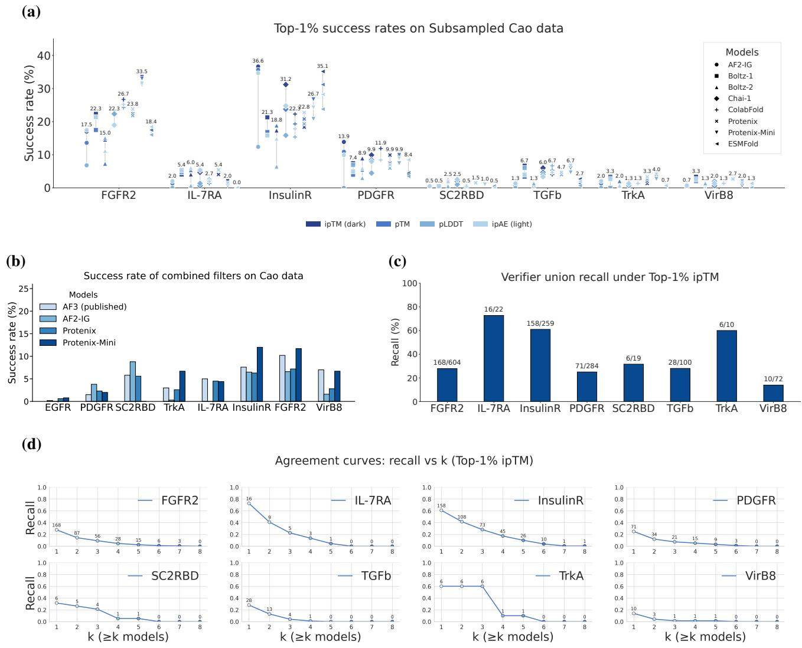  
Figure 1. Benchmarking structure prediction models as filters on the Cao dataset. (a) Top- $1 \%$ success rates achieved by individual confidence metrics (e.g., ipTM, pTM, pLDDT, ipAE) derived from AF2-IG, Boltz-1, Boltz-2, Chai-1, ColabFold, Protenix, and Protenix-Mini. (b) Success rates of combined filtering strategies across eight targets. “AF3 (published)” denotes baseline results from prior work, while other bars correspond to results obtained using our unified evaluation pipeline. (c) Union recall under Top- $1 \%$ ipTM filtering, defined as the fraction of true positive binders recovered by at least one model, establishing an upper bound on multi-model filtering. (d) Agreement curves showing recall as a function of the agreement threshold $k$ , where a true positive must be identified by at least $k$ models simultaneously. Recall decreases rapidly as $k$ increases, indicating limited consensus among models and highlighting their complementary coverage of the binder design space. The number of true positives agreed by $k$ verifiers are shown above markers.

$$
\mathcal { F } _ { \alpha } ( B ) = \mathbb { I } \left[ s ( B ) \geq \mathrm { Q u a n t i l e } _ { 1 - \alpha } \big ( \{ s ( B ^ { \prime } ) | B ^ { \prime } \in \mathcal { D } \} \big ) \right] .
$$

This provides a simple, model-agnostic baseline for assessing verifier enrichment behavior. In practice, for computational tractability, non-binders are randomly subsampled to at most 20000 per target.

Other than filters induced by single confidence metric, combined filters apply multiple score thresholds jointly (e.g., interface confidence and structural consistency constraints) to classify candidates as passing or failing. Thresholds are selected via a simple grid search on the Cao dataset, following prior work (Zambaldi et al., 2024). Based on the resulting single-metric analysis, we identify Protenix as a strong and representative evaluation verifier for combined filter studies. The resulting fixed configurations are summarized in Table 1, with full details provided in Appendix B.1.

Table 1. Thresholds for combined filters “AF2-IG-easy” reflects thresholds proposed by BindCraft (Pacesa et al., 2025b). “AF2-IG” denotes thresholds selected via our own grid search on Cao data; these match the values independently reported in Zambaldi et al. (2024). “AF3” refers to thresholds grid-searched in Zambaldi et al. (2024). “Protenix”, “Protenix-Mini” share a unified threshold set, and thresholds are also selected via grid search on Cao data.   

<table><tr><td>Filter Name</td><td>Confidence Thresholds</td><td>Structure Thresholds</td></tr><tr><td>AF3 (Zambaldi et al., 2024)</td><td>min ipAE&lt;1.5,binder pTM&gt; 0.8</td><td>complex RMSD&lt;2.5A</td></tr><tr><td>AF2-IG (Zambaldi et al., 2024)</td><td>ipAE&lt;7.0, pLDDT&gt;0.9</td><td>binder RMSD&lt;1.5A</td></tr><tr><td>AF2-IG-easy (Pacesa et al., 2025b)</td><td>ipAE&lt;10.85,ipTM&gt;0.5,pLDDT&gt;0.8</td><td>binder bound/unbound RMSD &lt;3.5 A</td></tr><tr><td>Protenix (Chen et al.,2025), Protenix-Mini (Gong et al.,2025)</td><td>binder ipTM&gt;0.85,binder pTM&gt;0.88</td><td>complex RMSD&lt;2.5A</td></tr></table>

Filtering accuracy metric. Given experimental binding labels $y ( B ) \in \{ 0 , 1 \}$ , we quantify filtering accuracy as the success rate of retained candidates:

$$
\mathrm { S R } = \frac { \sum _ { B \in \mathcal { D } } \mathcal { F } _ { \alpha } ( B ) y ( B ) } { \sum _ { B \in \mathcal { D } } \mathcal { F } _ { \alpha } ( B ) } .
$$

Evaluation questions. Using this setup, we analyze evaluation verifiers along three dimensions:

1. Filtering accuracy: How effectively does an verifier enrich experimentally validated binders? 2. Efficiency: Can lightweight verifiers reduce computational cost without sacrificing enrichment quality? 3. Coverage: Do different verifiers capture complementary regions of the design space?

# 3.2. Main Findings

Filtering accuracy: verifier choice substantially affects binder enrichment. Figure 1a shows the top- $1 \%$ success rates obtained by thresholding individual confidence metrics across a wide range of structure prediction models. We observe substantial variability across both models and targets. In particular, AF3-style predictors, especially Protenix and Protenix-Mini, achieve higher top- $1 \%$ success rates than AF2-IG and perform quite decently compared to other folding models on most targets, indicating strong single-metric enrichment capability. However, no single metric or verifier dominates uniformly across all targets.

In Figure 1b, across eight targets, Protenix-based combined filters perform competitive compared to AF3 and AF2-IG. Its lightweight variants, Protenix-Mini, retain comparable or even superior performance compared to Protenix.

Efficiency: lightweight verifier variants enable scalable evaluation. Protenix-Mini substantially reduce inference time relative to the full Protenix while maintaining comparable enrichment performance (Figure 1a). This cost accuracy trade-off highlights that verifier efficiency is a critical factor in large-scale evaluation, where computational budget constraints can otherwise dominate practical feasibility.

Coverage: evaluation verifiers emphasize complementary regions of the design space. Despite exhibiting broadly similar enrichment trends, different evaluation verifiers recover largely distinct subsets of true binders under identical filtering criteria. As shown in Figure 1c, taking the union of Top- $1 \%$ ipTM predictions across verifiers substantially improves recall for several targets. It indicates that no single verifier dominates coverage of the true binder space. Moreover, as the agreement threshold increases, recall drops sharply (Figure 1d). This fact demonstrates that only a small fraction of true binders are consistently identified by multiple verifiers. Together, these results indicate that different structure prediction models potentially capture complementary signals rather than redundant confidence information. We suggest that it may reflect distinct inductive biases toward specific structural features or interaction patterns in the binder design space. Consequently, evaluation outcomes can vary substantially depending on the choice of verifier.

# 4. Evaluating Generative Models within the ProtDBench Framework

Having established the evaluation framework in Section 2 and analyzed the behavior of structure prediction models as evaluation verifiers in Section 3, we now turn to benchmark different generative models performance under a fixed protocol. This section presents a systematic evaluation of generative binder design models under a fixed protocol, enabling controlled comparison of generation efficiency, per-sequence success, structural diversity, and structural consistency. Rather than establishing a definitive ranking of generative models, the analysis illustrates how different evaluation choices within ProtDBench expose distinct trade-offs between throughput, success rate, and diversity.

# 4.1. Benchmark Setup

Benchmark targets Following prior work (Zambaldi et al., 2024), we benchmark on 10 protein targets with diverse structural properties and varying design difficulty. The target set includes multi-chain complexes (H1, VEGF-A, IL17A, and TNFa), which further challenge generative models with complex interfaces and cooperative binding geometries. For each target, we follow the same cropping ranges, hotspot specifications, and binder length settings across all methods. Detailed target information is provided in Appendix A.1. For each target and binder length, we generate 4 independent backbone structures per method to reduce variance and ensure consistent comparison.

Generative binder design models Several recent binder design methods, such as Latent-X (Bridgland et al., 2025), AlphaProteo (Zambaldi et al., 2024), Chai-2 (ChaiDiscovery et al., 2025), and SeedProteo (Qu et al., 2025), do not release code or pretrained weights and are therefore excluded from head-to-head benchmarking. We evaluate representative open-source methods that support hotspotconditioned binder design:

• Diffusion-based models: RFdiffusion-3 (Butcher et al., 2025b), BoltzGen (Stark et al., 2025), Protpardelle-1 (Chu et al., 2023), ODesign (Zhang et al., 2025), and PXDesign (Team et al., 2025).

• Hallucination-based models: BindCraft (Pacesa et al., 2025b) and BoltzDesign1 (Cho et al., 2025).

All methods are provided with the same target sequences, structures and identical hotspot constraints.

# 4.2. Evaluation protocol and metrics

Different generative paradigms trade off sampling speed and per-sample success rate. To reflect practical design workflows, ProtDBench reports both generation throughput and per-sequence success explicitly. For generative model benchmarking, we choose the widely used AF2-IG-Easy as evaluation verifier to ensure fair and comparable assessment across methods2.

Generation throughput (successful structures per 24 hours) We measure generation efficiency under a fixed 24- hour budget on a single NVIDIA A100 GPU. This budget includes backbone generation time, downstream inverse folding, and structure-based verifier evaluation. A generated backbone structure is counted as successful if it yields at least one sequence that passes the AF2-IG-Easy filter (see Table 1 for details). This metric captures how many structurally viable binder candidates a method can deliver under realistic resource constraints. We measure the total GPU time on each target as $T _ { \mathrm { t o t } } = T _ { \mathrm { s a m p l e } } + T _ { \mathrm { M P N N } } +$ $T _ { \mathrm { e v a l } }$ , where the three terms are the total time spent on backbone generation 3, inverse folding (over all sampled sequences), and verifier evaluation (over all sampled sequences), respectively. We then estimate the expected number of successful backbones produced in 24 hours as

$$
N _ { 2 4 h } = \frac { 2 4 \mathrm { h o u r s } } { T _ { \mathrm { t o t } } } \cdot N _ { \mathrm { p a s s } } ,
$$

$N _ { \mathrm { p a s s } }$ is the number of passing backbones (a backbone passes if any of its associated sequences passes the filter).

Per-sequence success rate (SR) For each generated backbone structure $B _ { \mathrm { s t r } } ^ { ( i ) }$ , we sample $m = 8$ sequences $S _ { i }$ using ProteinMPNN. Each sequence is evaluated independently with the AF2-IG-Easy protocol. A sequence is considered successful if its score exceeds the filter threshold $\tau$ ,

$$
\mathcal { F } ( s ) = \mathbb { I } \big [ \mathrm { S c o r e } ( s , B _ { \mathrm { s t r } } ) \ge \tau \big ] .
$$

We define per-sequence success rate (SR) as the overall pass rate across all sampled sequences,

$$
\mathrm { S R } = \frac { \sum _ { i = 1 } ^ { N } \sum _ { s \in \mathcal { S } _ { i } } \mathcal { F } ( s ) } { \sum _ { i = 1 } ^ { N } | \mathcal { S } _ { i } | } .
$$

Diversity of successful binders To quantify the structural diversity of successful binders, we cluster only the backbones that pass the AF2-IG-Easy filter using Foldseek. For each generated backbone $B _ { \mathrm { s t r } } ^ { ( i ) }$ with sampled sequences $s _ { i }$ , we define backbone success as ${ \mathcal { F } } _ { \mathrm { b b } } ( i ) ~ = ~ \mathbb { I } [ \exists s ~ \in ~ S _ { i } ~ :$ $\mathcal { F } ( s ) \ = \ 1 ]$ (i.e., any of $m { = } 8$ sequences passes). Let $\mathcal { D } _ { \mathrm { p a s s } } = \{ \bar { B } _ { \mathrm { s t r } } ^ { ( i ) } ~ | ~ \mathcal { F } _ { \mathrm { b b } } ( i ) = 1 \}$ . Foldseek clustering on $\mathcal { D } _ { \mathrm { p a s s } }$ yields structural clusters $\mathcal { C } _ { \mathrm { p a s s } }$ , and we define

$$
\mathrm { S _ { c l u s t e r } } = \vert { \mathcal { C } } _ { \mathrm { p a s s } } \vert .
$$

We further report a diversity-adjusted success rate $\mathrm { R } _ { \mathrm { c l u s t e r } } = \mathrm { S } _ { \mathrm { c l u s t e r } } / N _ { \mathrm { t o t a l } } \times 1 0 0 \%$ , where $N _ { \mathrm { t o t a l } }$ is the total number of generated backbones.

Structural consistency As an auxiliary evaluation signal, we assess whether generated backbone structures can be recapitulated by an independent structure predictor after sequence design. Formally, for a designed sequence $s$ from backbone $B _ { \mathrm { s t r } } ^ { \mathrm { b a c k b o n e } }$ , let $\hat { B } _ { \mathrm { s t r } } ^ { \mathrm { b a c k b o n e } } ( s )$ denote the structure predicted by Protenix-Mini. We define a structural consistency indicator as,

$$
\mathcal { C } ( s ) = \mathbb { I } \Big [ \mathrm { R M S D } \big ( B _ { \mathrm { s t r } } ^ { \mathrm { b a c k b o n e } } , \hat { B } _ { \mathrm { s t r } } ^ { \mathrm { b a c k b o n e } } ( s ) \big ) < \delta \Big ] .
$$

with $\delta = 2 . 5 \mathrm { \AA }$ . We report structural consistency rate (CR),

Table 2. The number of successful backbone structures produced per 24 hours on a single NVIDIA A100 GPU. All results are reported under a unified end-to-end budget that includes the full pipeline (e.g., generation, inverse folding, and evaluation). A backbone structure is counted as successful if it yields $\geq 1$ sequence passing the AF2-IG-Easy filter.

<table><tr><td colspan="2">Models</td><td>BHRF1</td><td>PDL1</td><td>IR</td><td>TrkA</td><td>IL7RA</td><td>SC2RBD</td><td>VEGFA</td><td>H1</td><td>IL17A</td><td>TNFa</td></tr><tr><td rowspan="5">Diffusion</td><td>RFDiffusion-3</td><td>751</td><td>542</td><td>512</td><td>407</td><td>182</td><td>131</td><td>98</td><td>30</td><td>37</td><td>0</td></tr><tr><td>Boltzgen</td><td>428</td><td>549</td><td>606</td><td>804</td><td>279</td><td>34</td><td>207</td><td>248</td><td>15</td><td>15</td></tr><tr><td>Protpardelle-1c</td><td>142</td><td>403</td><td>18</td><td>248</td><td>9</td><td>35</td><td>3</td><td>11</td><td>0</td><td>0</td></tr><tr><td>ODesign</td><td>901</td><td>375</td><td>559</td><td>480</td><td>224</td><td>127</td><td>152</td><td>115</td><td>3</td><td>0</td></tr><tr><td>PXDesign</td><td>837</td><td>1247</td><td>756</td><td>758</td><td>695</td><td>295</td><td>464</td><td>193</td><td>31</td><td>57</td></tr><tr><td rowspan="2">Hallucination</td><td>BoltzDesign-1</td><td>42</td><td>54</td><td>51</td><td>73</td><td>17</td><td>15</td><td>13</td><td>4</td><td>5</td><td>0</td></tr><tr><td>BindCraft</td><td>122</td><td>231</td><td>220</td><td>194</td><td>89</td><td>70</td><td>41</td><td>28</td><td>28</td><td>1</td></tr></table>

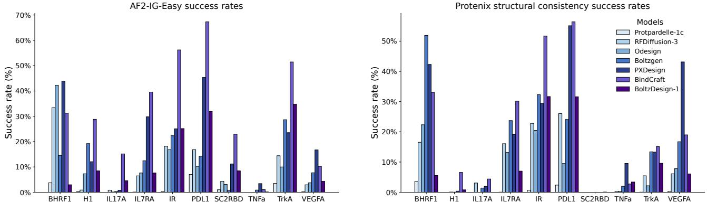  
Figure 2. Binder design benchmarks: (a) Success rates under AF2-IG-Easy; (b) Structural consistency across targets. Enlarged view across columns for better granularity.

defined as the fraction of sequences whose predicted structures recapitulate the generated backbone:

$$
\mathrm { C R } = \frac { 1 } { \sum _ { i } \left| S _ { i } \right| } \sum _ { i } \sum _ { s \in S _ { i } } \mathcal { C } ( s ) .
$$

# 4.3. Main Findings

Generation throughput varies substantially across generative paradigms. Table 2 reports the number of successful backbone structures under a standardized evaluation protocol. In our benchmark, all methods are evaluated using a comparable number of generated backbones. We apply the same downstream inverse folding and filtering pipeline. This pipeline allows us to isolate differences in generation quality and evaluation behavior. Under this controlled setting, diffusion-based methods consistently achieve orders-of-magnitude higher throughput than hallucination-based approaches across most targets. Among them, BoltzGen and PXDesign produce the largest number of successful structures on most of the targets, while extremely challenging cases such as TNFa remain difficult for several methods. We note that this protocol is designed for controlled comparison rather than optimal deployment. In practical production settings, diffusionbased and hallucination-based methods would potentially adopt different allocations of computational budget between backbone generation and evaluation. Exploring such strategy-dependent budget allocation is an important direction for future large-scale design pipelines, but is beyond the scope of the present benchmark.

Throughput and per-sequence success rate are decoupled. Figure 2a demonstrates per-sequence success rates under the AF2-IG-Easy protocol. Comparing per-sequence success rate with 24-hour throughput reveals a clear decoupling between sampling quality and computational efficiency. In contrast, BoltzGen and PXDesign strike a more favorable balance, combining strong per-sequence success with substantially higher throughput. Hallucination-based methods such as BindCraft exhibit high per-sequence success rates; however, this is partly attributable to their integrated generation-and-filtering pipelines, where candidates failing intermediate quality thresholds (e.g., low ipTM) are iteratively regenerated, biasing the final sample set toward higher post-hoc success.

Structural diversity reflects differences in effective design space exploration. Figure 3 reports the diversityadjusted cluster pass rate for each method after AF2- IG-Easy filtering, computed by clustering only the backbones that pass the filter at multiple TM-score thresholds. Hallucination-based methods exhibit higher cluster pass rates across targets, potentially indicating broader exploration of the structural design space. These hallucinationbased pipelines initialize each design independently and optimize it without an explicit generative prior. It leads to exploration of diverse local optima based on structure prediction models’ confidence landscape. In contrast, diffusion-based models sample from a learned distribution, which can lead to more concentrated sampling around a smaller number of structural modes that satisfy the evaluation criteria.

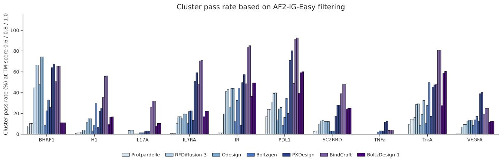  
Figure 3. Binder structural diversity benchmark. For each target, bars show the diversity-adjusted cluster pass rate of each model after AF2-IG-Easy filtering. Clustering is performed only on backbones that pass the filter, and the reported percentage corresponds to the number of unique structural clusters at TM-score thresholds 0.6, 0.8, and 1.0, normalized by the total number of designed backbones. Different colors denote different models.

Structural consistency highlights robustness of generated scaffolds. Figure 2b reports structural consistency measured by Protenix-Mini recapitulation. PXDesign achieves consistently high consistency across diverse targets, indicating that its generated backbones are robust to sequence design. In contrast, targets such as SC2RBD remain challenging across all methods, suggesting that structural consistency is jointly influenced by generative quality and intrinsic target structure prediction difficulty.

Overall, these results demonstrate that when evaluated under a fixed protocol, generative binder design methods exhibit markedly different trade-offs between efficiency, persequence success, and diversity.

# 5. Discussion

In this work, we address a central but underexplored challenge in de novo protein binder design: the lack of standardized, and practically meaningful evaluation protocols.

A key finding of our study is that evaluation outcomes are highly sensitive to the choice of structure prediction verifier. As shown in Section 3, different folding models exhibit distinct inductive biases, leading to markedly different enrichment behavior even under identical filtering protocols. This observation cautions against over-interpreting absolute success rates reported under a single verifier and motivates the use of multi-verifier or verifier-aware evaluation strategies in future work. Our analysis of verifier bias is primarily based on the Cao dataset, which consists of energy-based designs. While this setting enables controlled retrospective evaluation using wet-lab annotations, the observed bias patterns may not fully generalize to binders generated by deep generative models.

Our generative benchmarks further highlight that practical binder design performance cannot be characterized by a single metric. In particular, throughput, per-sequence success rate, and structural diversity are partially decoupled and reveal complementary aspects of model behavior. High per-sample success does not necessarily translate into high yield under realistic resource constraints, while models with lower raw success rates may nevertheless achieve broad coverage of productive regions of the design space. These trade-offs underscore the importance of throughputaware and diversity-aware evaluation when comparing generative models intended for real-world deployment.

Beyond the analyses presented here, several promising directions emerge for extending the ProtDBench framework. Firstly, exploring combinations of diverse scoring models: Investigating the integration of scores from a wider range of models, such as energy-based or molecular dynamicsbased metrics, has the potential to enable more precise screening. Secondly, expanding to broader molecular design applications: The ProtDBench framework could be extended to other areas of molecular design, such as the virtual screening of peptides and small molecules. Thirdly, improving success rates for challenging targets: Although ProtDBench introduces more accurate and robust screening metrics, there is still room to improve the screening success rates, particularly for notoriously difficult targets.

# Impact Statement

The proposed framework can facilitate more meaningful comparison between emerging generative models and help the community better understand trade-offs between efficiency, diversity, and success under realistic computational constraints. In the long term, such standardized evaluation protocols may accelerate the development of reliable protein binders for applications in biotechnology.

Potential negative impacts include the misuse of computational protein design and evaluation frameworks for the intentional design or optimization of harmful or toxic viral agents. Our work focuses exclusively on benchmarking and in silico evaluation, and does not provide biological design rules, experimental protocols, or deployment guidance. We mitigate such risks by emphasizing that all reported results are conditional on specific verification protocols and do not imply biological function or pathogenicity, and we encourage future work to incorporate appropriate ethical oversight and safeguards when applying these methods to biologically hazardous targets.

# References

Abramson, J., Adler, J., Dunger, J., Evans, R., Green, T., Pritzel, A., Ronneberger, O., Willmore, L., Ballard, A. J., Bambrick, J., et al. Accurate structure prediction of biomolecular interactions with alphafold 3. Nature, 630 (8016):493–500, 2024.   
Asimit, A. V., Bignozzi, V., Cheung, K. C., Hu, J., and Kim, E.-S. Robust and pareto optimality of insurance contracts. European Journal of Operational Research, 262(2):720–732, 2017.   
Baek, M., DiMaio, F., Anishchenko, I., Dauparas, J., Ovchinnikov, S., Lee, G. R., Wang, J., Cong, Q., Kinch, L. N., Schaeffer, R. D., et al. Accurate prediction of protein structures and interactions using a three-track neural network. Science, 373(6557):871–876, 2021.   
BioGeometry. Geoflow-v2: A unified atomic diffusion model for protein structure prediction and de novo design. bioRxiv, pp. 2025–05, 2025.   
Bridgland, A., Crabbe, J., Kenlay, H., Pretorius, D., ´ Schmon, S. M., Hilmkil, A., Bartke-Croughan, R., Rombach, R., Flashman, M., Matteson, T., et al. Latent-x: An atom-level frontier model for de novo protein binder design. arXiv e-prints, pp. arXiv–2507, 2025.   
Butcher, J., Krishna, R., Mitra, R., Brent, R. I., Li, Y., Corley, N., Kim, P., Funk, J., Mathis, S., Salike, S., Muraishi, A., Eisenach, H., Thompson, T. R., Chen, J., Politanska, Y., Sehgal, E., Coventry, B., Zhang, O., Qiang, B., Didi, K., Kazman, M., DiMaio, F., and Baker, D. De novo design of all-atom biomolecular interactions with rfdiffusion3. bioRxiv, 2025a. doi: 10.1101/2025.09.18.676967. URL https://www.biorxiv.org/content/ early/2025/09/18/2025.09.18.676967.   
Butcher, J. K. V., Krishna, R., Mitra, R., Brent, R. I., Li, Y., Corley, N., Kim, P., Funk, J., Mathis, S. V., Salike, S., et al. De novo design of all-atom biomolecular interactions with rfdiffusion3. bioRxiv, pp. 2025–09, 2025b.   
Cao, L., Coventry, B., Goreshnik, I., Huang, B., Sheffler, W., Park, J. S., Jude, K. M., Markovic, I., Kadam, R. U., ´ Verschueren, K. H., et al. Design of protein-binding proteins from the target structure alone. Nature, 605(7910): 551–560, 2022.   
ChaiDiscovery, Boitreaud, J., Dent, J., McPartlon, M., Meier, J., Reis, V., Rogozhonikov, A., and Wu, K. Chai-1: Decoding the molecular interactions of life. BioRxiv, pp. 2024–10, 2024.   
ChaiDiscovery, Boitreaud, J., Dent, J., Geisz, D., McPartlon, M., Meier, J., Qiao, Z., Rogozhnikov, A., Rollins, N., Wollenhaupt, P., et al. Zero-shot antibody design in a 24-well plate. bioRxiv, pp. 2025–07, 2025.   
Chen, X., Zhang, Y., Lu, C., Ma, W., Guan, J., Gong, C., Yang, J., Zhang, H., Zhang, K., Wu, S., Zhou, K., Yang, Y., Liu, Z., Wang, L., Shi, B., Shi, S., and Xiao, W. Protenix - advancing structure prediction through a comprehensive alphafold3 reproduction. bioRxiv, 2025. doi: 10.1101/2025.01.08.631967.   
Cho, Y., Pacesa, M., Zhang, Z., Correia, B. E., and Ovchinnikov, S. Boltzdesign1: Inverting all-atom structure prediction model for generalized biomolecular binder design. bioRxiv, pp. 2025–04, 2025.   
Chu, A. E., Cheng, L., Nesr, G. E., Xu, M., and Huang, P.-S. An all-atom protein generative model. bioRxiv, 2023. doi: 10.1101/2023.05.24.542194. URL https://www.biorxiv.org/content/ early/2023/05/25/2023.05.24.542194.   
Evans, R., O’Neill, M., Pritzel, A., Antropova, N., Senior, A., Green, T., Zˇ ´ıdek, A., Bates, R., Blackwell, S., Yim, J., et al. Protein complex prediction with alphafoldmultimer. biorxiv, pp. 2021–10, 2021.   
Gong, C., Chen, X., Zhang, Y., Song, Y., Zhou, H., and Xiao, W. Protenix-mini: Efficient structure predictor via compact architecture, few-step diffusion and switchable plm. arXiv preprint arXiv:2507.11839, 2025.   
Jumper, J., Evans, R., Pritzel, A., Green, T., Figurnov, M., Ronneberger, O., Tunyasuvunakool, K., Bates, R., Zˇ ´ıdek, A., Potapenko, A., et al. Highly accurate protein

structure prediction with alphafold. nature, 596(7873): 583–589, 2021.

Kortemme, T. and Baker, D. A simple physical model for binding energy hot spots in protein–protein complexes. Proceedings of the National Academy of Sciences, 99 (22):14116–14121, 2002.

Krishna, R., Wang, J., Ahern, W., Sturmfels, P., Venkatesh, P., Kalvet, I., Lee, G. R., Morey-Burrows, F. S., Anishchenko, I., Humphreys, I. R., et al. Generalized biomolecular modeling and design with rosettafold allatom. Science, 384(6693):eadl2528, 2024.

Lin, Z., Akin, H., Rao, R., Hie, B., Zhu, Z., Lu, W., Smetanin, N., dos Santos Costa, A., Fazel-Zarandi, M., Sercu, T., Candido, S., et al. Language models of protein sequences at the scale of evolution enable accurate structure prediction. bioRxiv, 2022.

Lin, Z., Akin, H., Rao, R., Hie, B., Zhu, Z., Lu, W., Smetanin, N., Verkuil, R., Kabeli, O., Shmueli, Y., et al. Evolutionary-scale prediction of atomic-level protein structure with a language model. Science, 379 (6637):1123–1130, 2023.

Mirdita, M., Schutze, K., Moriwaki, Y., Heo, L., Ovchin- ¨ nikov, S., and Steinegger, M. Colabfold: making protein folding accessible to all. Nature methods, 19(6):679– 682, 2022.

Pacesa, M., Nickel, L., Schellhaas, C., Schmidt, J., Pyatova, E., Kissling, L., Barendse, P., Choudhury, J., Kapoor, S., Alcaraz-Serna, A., Cho, Y., Ghamary, K. H., Vinue, L., Yachnin, B. J., Wollacott, A. M., Buckley, ´ S., Westphal, A. H., Lindhoud, S., Georgeon, S., Goverde, C. A., Hatzopoulos, G. N., Gonczy, P., Muller, ¨ Y. D., Schwank, G., Swarts, D. C., Vecchio, A. J., Schneider, B. L., Ovchinnikov, S., and Correia, B. E. Bindcraft: one-shot design of functional protein binders. bioRxiv, 2025a. doi: 10.1101/2024.09.30.615802. URL https://www.biorxiv.org/content/ early/2025/04/25/2024.09.30.615802.

Pacesa, M., Nickel, L., Schellhaas, C., Schmidt, J., Pyatova, E., Kissling, L., Barendse, P., Choudhury, J., Kapoor, S., Alcaraz-Serna, A., et al. One-shot design of functional protein binders with bindcraft. Nature, pp. 1–10, 2025b.

Passaro, S., Corso, G., Wohlwend, J., Reveiz, M., Thaler, S., Somnath, V. R., Getz, N., Portnoi, T., Roy, J., Stark, H., Kwabi-Addo, D., Beaini, D., Jaakkola, T., and Barzilay, R. Boltz-2: Towards accurate and efficient binding affinity prediction. bioRxiv, 2025. doi: 10.1101/2025.06.14.659707.

Qu, W., Ma, Y., Ye, F., Lu, C., Zhou, Y., Zhang, K., Wang, L., Gui, M., and Gu, Q. Seedproteo: Accurate de novo all-atom design of protein binders, 2025. URL https: //arxiv.org/abs/2512.24192.

Stark, H., Faltings, F., Choi, M., Xie, Y., Hur, E., O’Donnell, T., Bushuiev, A., Uc¸ar, T., Passaro, S., Mao, W., Reveiz, M., Bushuiev, R., Pluskal, T., Sivic, J., Kreis, K., Vahdat, A., Ray, S., Goldstein, J. T., Savinov, A., Hambalek, J. A., Gupta, A., Taquiri-Diaz, D. A., Zhang, Y., Hatstat, A. K., Arada, A., Kim, N. H., Tackie-Yarboi, E., Boselli, D., Schnaider, L., Liu, C. C., Li, G.-W., Hnisz, D., Sabatini, D. M., DeGrado, W. F., Wohlwend, J., Corso, G., Barzilay, R., and Jaakkola, T. Boltzgen: Toward universal binder design. bioRxiv, 2025. doi: 10.1101/2025.11.20.689494. URL https://www.biorxiv.org/content/ early/2025/11/24/2025.11.20.689494.

Team, P., Ren, M., Sun, J., Guan, J., Liu, C., Gong, C., Wang, Y., Wang, L., Cai, Q., Chen, X., and Xiao, W. Pxdesign: Fast, modular, and accurate de novo design of protein binders. bioRxiv, 2025. doi: 10.1101/2025.08.15.670450. URL https://www.biorxiv.org/content/ early/2025/08/16/2025.08.15.670450.

Van Kempen, M., Kim, S. S., Tumescheit, C., Mirdita, M., Lee, J., Gilchrist, C. L., Soding, J., and Steinegger, M. ¨ Fast and accurate protein structure search with foldseek. Nature biotechnology, 42(2):243–246, 2024.

Watson, J. L., Juergens, D., Bennett, N. R., Trippe, B. L., Yim, J., Eisenach, H. E., Ahern, W., Borst, A. J., Ragotte, R. J., Milles, L. F., et al. De novo design of protein structure and function with rfdiffusion. Nature, 620(7976):1089–1100, 2023.

Wohlwend, J., Corso, G., Passaro, S., Reveiz, M., Leidal, K., Swiderski, W., Portnoi, T., Chinn, I., Silterra, J., Jaakkola, T., et al. Boltz-1 democratizing biomolecular interaction modeling. BioRxiv, 2024.

Yang, J., Anishchenko, I., Park, H., Peng, Z., Ovchinnikov, S., and Baker, D. Improved protein structure prediction using predicted interresidue orientations. Proceedings of the National Academy of Sciences, 117(3):1496–1503, 2020.

Zambaldi, V., La, D., Chu, A. E., Patani, H., Danson, A. E., Kwan, T. O., Frerix, T., Schneider, R. G., Saxton, D., Thillaisundaram, A., et al. De novo design of highaffinity protein binders with alphaproteo. arXiv preprint arXiv:2409.08022, 2024.

Zhang, O., Zhang, X., Lin, H., Tan, C., Wang, Q., Mo, Y., Feng, Q., Du, G., Yu, Y., Jin, Z., You, Z., Lin, P.,

Zhang, Y., Tao, Y., Chen, S., Chen, J. X., Hua, C., Zhao, W., Ma, R., Xia, Y., Ying, K., Li, J., Zeng, Y., Lang, L., Pan, P., Cao, H., Song, Z., Qiang, B., Wang, J., Ji, P., Bai, L., Zhang, J., yu Hsieh, C., Heng, P. A., Sun, S., Hou, T., and Zheng, S. Odesign: A world model for biomolecular interaction design, 2025. URL https: //arxiv.org/abs/2510.22304.

ProtDBench: A Unified Benchmark of Protein Binder Design and Evaluation   

<table><tr><td>Target</td><td>PDB ID</td><td>Crop</td><td>Hotspot</td><td>Natural binder</td><td>Binder length</td></tr><tr><td>BHRF1</td><td>2wh6</td><td>A2-158</td><td>A65,A74, A77, A82,A85,A93</td><td>BH3 helix</td><td>80-120</td></tr><tr><td>SC2RBD</td><td>6m0j</td><td>E333-526</td><td>E485,E489, E494,E500,</td><td>ACE2 receptor</td><td>80-120</td></tr><tr><td>IL-7RA</td><td>3di3</td><td>B17-209</td><td>E505 B58,B80,B139</td><td>IL-7</td><td>50-120</td></tr><tr><td>PD-L1</td><td>5o45</td><td>A17-132</td><td>A56, A115, A123</td><td>PD-1</td><td>50-120</td></tr><tr><td>TrkA</td><td>1www</td><td>X282-382</td><td>X294, X296,</td><td>Nerve growth factor</td><td>50-120</td></tr><tr><td>Insulin</td><td>4zxb</td><td>E6-155</td><td>X333 E64,E88,E96</td><td>Insulin receptor</td><td>40-120</td></tr><tr><td>H1</td><td>5vli</td><td>A1-45, A47-50, A76-80,</td><td>B21,B45,B52</td><td>None</td><td>40-120</td></tr><tr><td></td><td></td><td>A107-111, A258-322, B1-68, B80-170</td><td></td><td></td><td></td></tr><tr><td>VEGF-A</td><td>1bj1</td><td>V14-107, W14-107</td><td>W81, W83, W91</td><td>VEGFR1, VEGFR2</td><td>50-140</td></tr><tr><td>IL-17A</td><td>4hsa</td><td>A17-29,</td><td>A94,A116,B67</td><td>IL-17 receptor alpha</td><td>50-140</td></tr><tr><td></td><td></td><td>A41-131,</td><td></td><td>None</td><td></td></tr><tr><td>TNFα</td><td></td><td>B19-127</td><td>A113,C73</td><td></td><td></td></tr></table>

Table 3. Overview of benchmark targets for protein binder design. Residue ranges and hotspot annotations are based on known structures and wet-lab characterization.

# A. Benchmark Details

# A.1. Task Definition

Each binder design task in our benchmark is specified by the following components:

• Target: The biological macromolecule that the designed binder is intended to bind, such as a receptor, enzyme, or viral protein.   
• Crop: Annotations specifying the target chains and residue ranges used as input to the design model. These typically correspond to solvent-exposed regions of the target surface that are accessible for binding. Since the computational cost of generative models and structure predictors often scales with the number of residues $L$ , appropriate cropping improves both runtime efficiency and focus.   
• Hotspot: A small subset of residues on the target surface believed to play a critical role in molecular recognition or binding energetics. These are typically derived from known protein–protein complexes, mutagenesis studies, or epitope mapping, and serve as anchors for binder placement.   
• Binder Length Range: Specifies the allowed length interval for generated binder sequences. This constraint reflects practical considerations: shorter binders are easier to express, purify, and characterize, while longer sequences may form more stable folds or allow for larger interaction surfaces.

The selection of targets, cropping strategies, hotspot residues, and binder length ranges follows established conventions from prior work such as AlphaProteo (Zambaldi et al., 2024). A complete overview of the benchmark targets is provided in Table 3. We made two minor modifications to the crop definitions compared to AlphaProteo: (1) For target H1, residue 46 includes an insertion code, which is not supported by most baseline models. This residue was excluded from the crop. (2) For target IL-17A, residues A30-A40 are unresolved in the crystal structure and were omitted.

Table 4. Secondary Structure Ratio and Radius of Gyration   

<table><tr><td>Method</td><td>Rg</td><td>α/β</td></tr><tr><td>Protpardelle-1c</td><td>13.49</td><td>24.2%:31.4%</td></tr><tr><td>RFDiffusion-3</td><td>13.09</td><td>70.4%:8.2%</td></tr><tr><td>Odesign</td><td>12.97</td><td>46.5%:19.3%</td></tr><tr><td>Boltzgen</td><td>12.43</td><td>36.1%:24.6%</td></tr><tr><td>PXDesign</td><td>13.00</td><td>81.8%:3.5%</td></tr><tr><td>BindCraft</td><td>13.37</td><td>72.4%:2.3%</td></tr><tr><td>BoltzDesign-1</td><td>14.81</td><td>42.0%:19.1%</td></tr></table>

# A.2. Benchmark Preprocessing and Caveats

Preprocessing of inference outputs. To ensure consistency and reproducibility across all methods, we harmonized the outputs of different design methods to enable unified downstream structure prediction and filtering:

• For generative models’ outputs, we explicitly marker binder chain ids to ensure compatibility with Protenix filters,   
which utilize target MSAs.   
• For all methods, we renumbered residue IDs in the target chains to match those in the original uncropped PDB structures. This ensures correct relative positional encoding for structure predictors.

Tool-specific limitations and failure cases. We observed several tool-specific limitations that impact compatibility or performance in certain scenarios. For example, BoltzDesign does not properly support cropped residue ranges: even when provided with discontinuous residue indices, it outputs continuous structures that ignore crop boundaries. Additionally, for challenging targets such as $\mathrm { T N F } \alpha$ , we found that Protenix occasionally produces binder structures that appear disordered or structurally implausible. This typically occurs when the input sequence—e.g., one generated by ProteinMPNN—contains excessive alanines, leading the structure predictor to interpret the region as intrinsically disordered or low-confidence.

# A.3. More benchmark results

Confidence-free property. We also compared the properties of binders designed by different methods, including the proportion of various secondary structures (e.g., $\alpha / \beta$ ) and the radius of gyration $( \mathbb { R } \mathbb { g } )$ of the designed binders, as summarized in Table 4. Overall, different methods exhibit distinct preferences in secondary structure composition and compactness, reflecting their inherent design biases.

Confidence by secondary structures. We show the performance of binders designed by different methods under different secondary structure proportions in Figure 6. First, we used DSSP to annotate the designed binders for secondary structure, and we divided the designed binders into two categories: all-alpha (beta fraction $< 1 \%$ ) and mainly-beta (beta fraction $> 3 0 \%$ ). We found that for all currently designed methods, across almost all targets, whether on AF2- or Protenix-based metrics, the performance of all-alpha-designed binders is better than that of mainly-beta-designed binders. Improving the generation of high-quality, beta-sheet-containing binders is a potential direction for future computational model development.

# A.4. Generative benchmark results with Protenix-Mini as verifier

In the main paper, we report generative benchmarking results using AF2-IG-Easy as the primary verifier for throughputaligned comparisons across methods. Here we provide an additional robustness check by re-evaluating the same set of generated binders with Protenix-Mini as an alternative verifier, and report both the success rate and the cluster pass rate.

Protenix-Mini applies a conservative set when converting its predicted structure/confidence signals into a binary pass/fail decision. As a result, absolute success rates are substantially lower than those obtained under AF2-IG-Easy, and several difficult targets exhibit near-zero pass rates across most methods.

Figure 4 reports the Protenix-Mini success rate, defined as the fraction of generated binder sequences that pass the

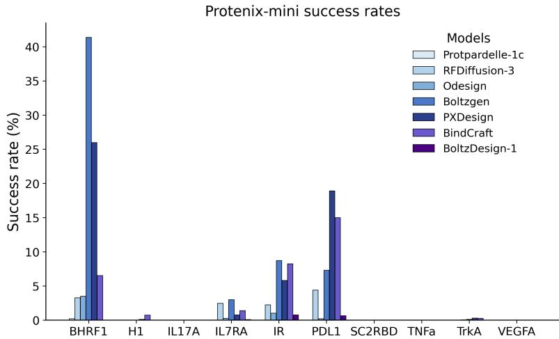  
Figure 4. Protenix-Mini sequence-level success rates. Fraction of generated binder sequences passing the Protenix-Mini filter for each target. Absolute success rates are lower than AF2-IG-Easy due to the conservative confidence scores of Protenix-Mini.

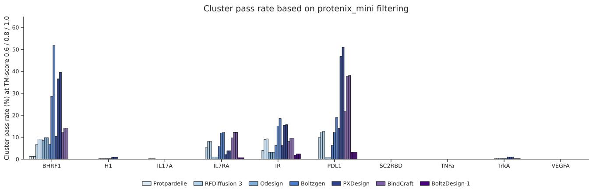  
Figure 5. Protenix-Mini cluster pass rates. Diversity-adjusted success rate computed as the number of unique structural clusters among passed designs (clustered at TM-score thresholds $0 . 6 / 0 . 8 / 1 . 0 )$ divided by the total number of generated backbones. This metric captures both filter success and diversity among successful designs.

Protenix-Mini filter for each target. Figure 5 reports the corresponding cluster pass rate (diversity-adjusted success rate), computed as the number of unique structural clusters among passed designs (clustered by TM-score thresholds $0 . 6 / 0 . 8 / 1 . 0 )$ normalized by the total number of generated backbones. The cluster pass rate therefore captures both filter success and structural diversity among successful designs.

Across targets where Protenix-Mini yields non-trivial acceptance (e.g., BHRF1, PDL1, IR, IL7RA), methods that achieve higher success rates generally also achieve higher cluster pass rates, indicating that the relative trends observed under AF2-IG-Easy are partially preserved when switching to a stricter verifier. At the same time, the sharp reduction in absolute acceptance highlights that verifier choice and default cutoffs can materially affect reported success rates.

# A.5. Metric details

Here, we present the distributions of performance metrics for binders designed by various methods against different targets.   
These metrics include ipAE and plddt from AF2-IG, and iptm and ptm from Protenix.

# A.6. Implementation Details

The GitHub repositories and commit ids for the benchmarked methods are detailed in Table 5. With the exception of BindCraft, all methods were evaluated using their default code and parameters.

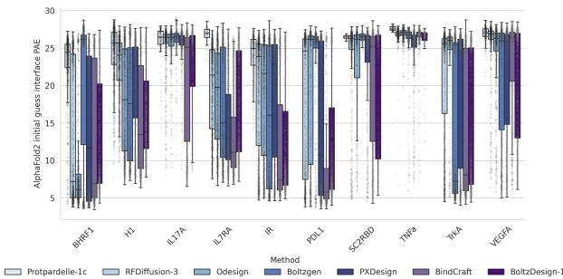  
(a) All-alpha binder performance on AF2 metric.

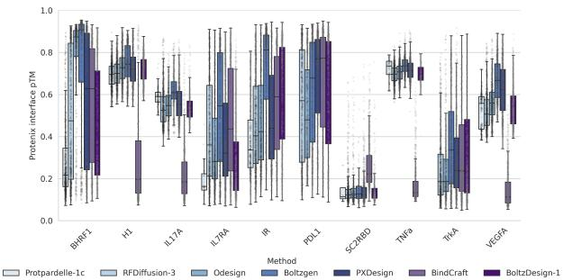  
$( b )$ All-alpha binder performance on Protenix metric.

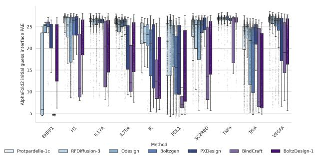  
(c) Mainly-beta binder performance on AF2 metric.

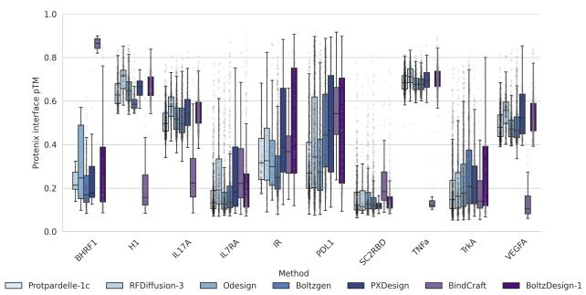  
(d) Mainly-beta binder performance on Protenix metric.   
Figure 6. Performance of binders with different secondary structures designed by various methods on AlphaFold2- and Protenix-based metrics.

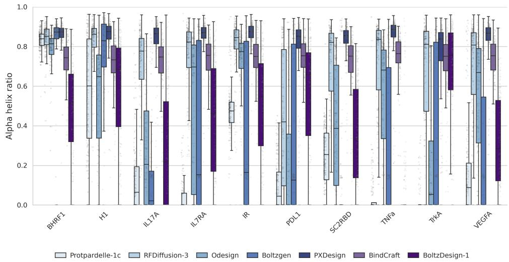  
Figure 7. Alpha-helix ratio on different targets across various methods.

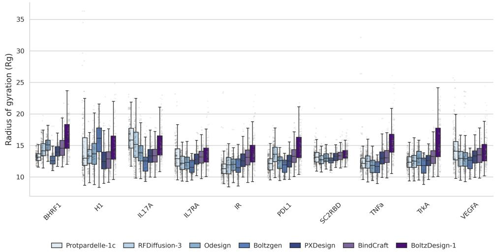  
Figure 8. Reference ratio of gyration radius on different targets across various methods.

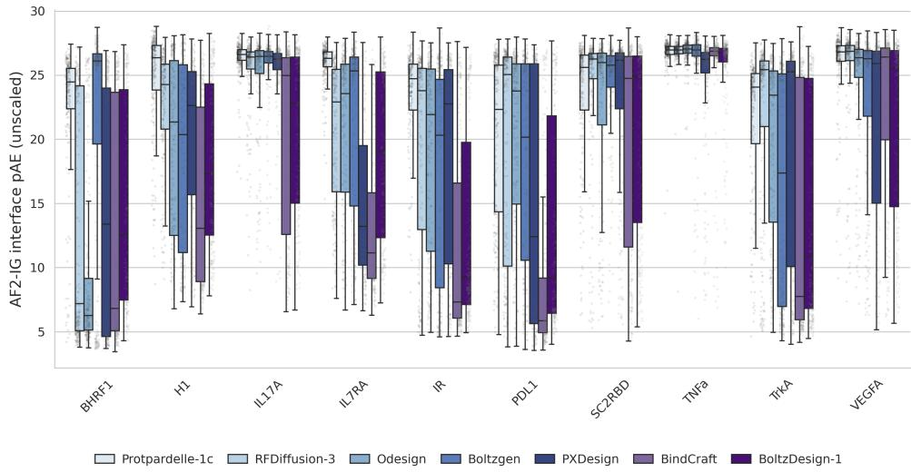  
Figure 9. AlphaFold2 initial guess interface pAE on different targets across various methods.

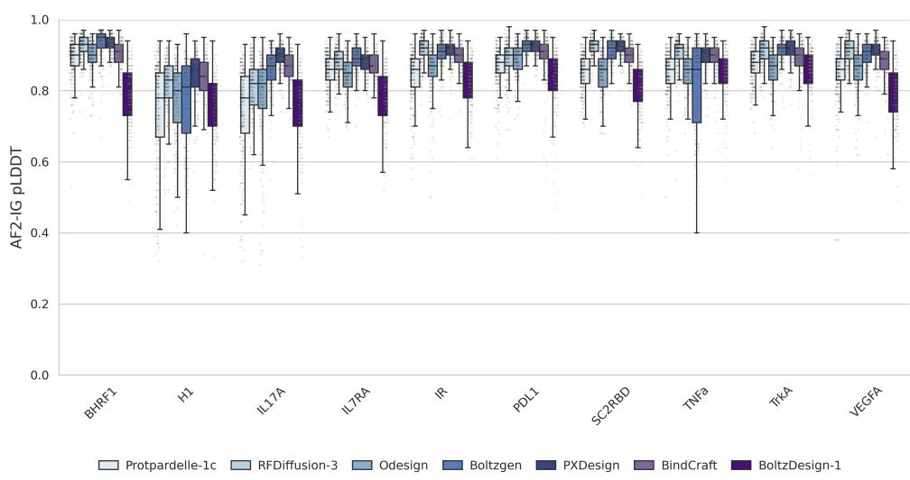  
Figure 10. AlphaFold2 initial guess pLDDT on different targets across various methods.

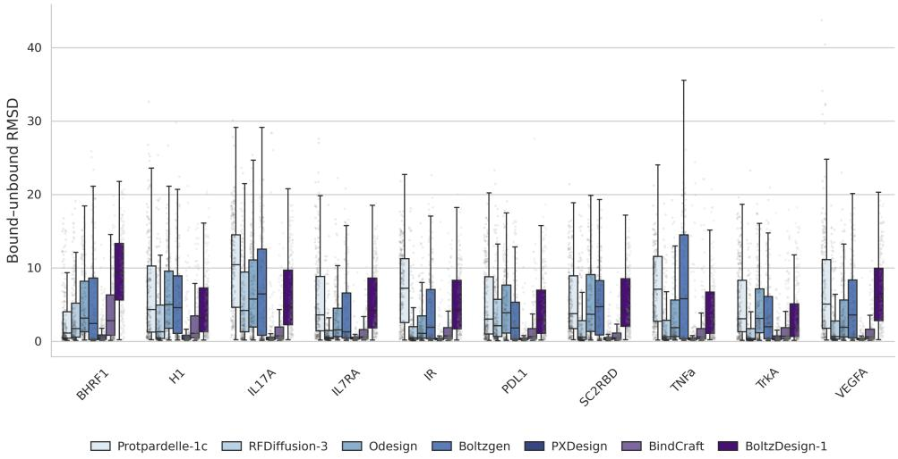  
Figure 11. Bound unbound RMSD on different targets across various methods.

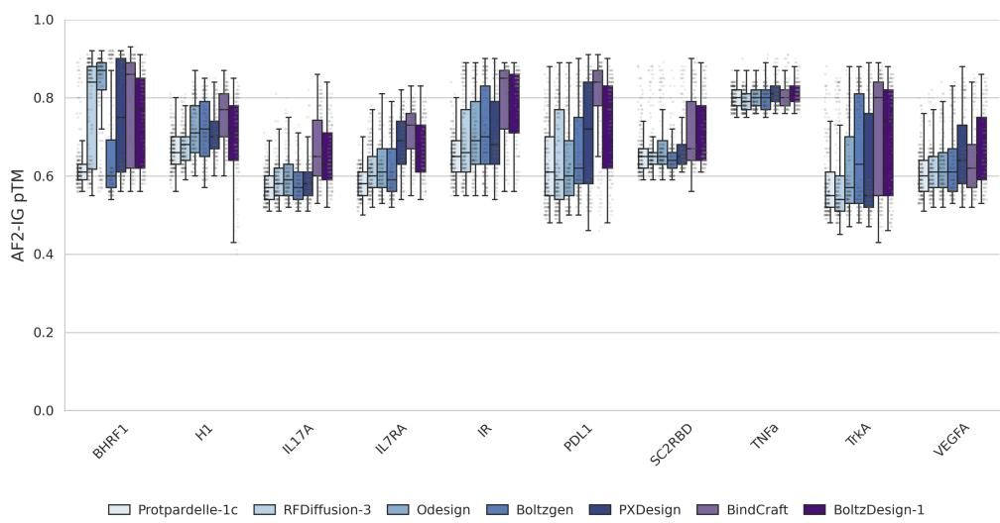  
Figure 12. AlphaFold2 initial guess pTM on different targets across various methods.

Since BindCraft integrates hallucination and evaluation in a single pipeline, we removed evaluation time from our measurement to enable a fairer comparison. Specifically, we measured the time consumed by the binder hallucination function (https://github.com/martinpacesa/BindCraft/blob/main/bindcraft.py, Lines 109- 111). Within this function, we counted only the time taken to hallucinate the binder, excluding the time spent on trajectory checking (https://github.com/martinpacesa/BindCraft/blob/main/functions/colabdesign_ utils.py, Lines 177-233).

Table 5. Details on running the compared methods.   

<table><tr><td>Method</td><td>GitHub repository and Commit</td></tr><tr><td>Protpardelle-1c</td><td>https://github.com/ProteinDesignLab/protpardelle/tree/main 68eb81290fd126e10a50e10d94b00c811fe7245a</td></tr><tr><td>RFdiffusion-3</td><td>https://github.com/RosettaCommons/foundry/tree/production cc327b4ad04551cc00bbbc3e0cdde46a7a358bde</td></tr><tr><td>ODesign</td><td>https://github.com/The-Institute-for-AI-Molecular-Design/ ODesign/tree/main aacceaa0d6cee551fa9ff886bfddfb3ae2b568d1</td></tr><tr><td>BoltzGen</td><td>https://github.com/HannesStark/boltzgen/tree/main 247b9bbd8b68a60aba854c2968d6a0cddd21ad6d</td></tr><tr><td>PXDesign</td><td>https://github.com/bytedance/PxDesign/tree/main f788441313c84c3074fe9596ac2433f96b15c763</td></tr><tr><td>BindCraft</td><td>https://github.com/martinpacesa/BindCraft/tree/main 05702c435e2172a99c2b3faf87487badb6e54727</td></tr><tr><td>BoltzDesign-1</td><td>https://github.com/yehlincho/BoltzDesignl 627c0cc7bab41e56f544c5d15467b2dbeb490168</td></tr></table>

# B. Filtering Methodology and Benchmark Evaluation

# B.1. Filter Combination Search

To identify general-purpose, model-specific filters, we perform a grid search over combinations of confidence scores. We design a two-stage filtering strategy to identify high-quality protein complex predictions generated by Protenix. In the first stage, we identify informative evaluation metrics and select an optimal triplet combination based on their ranking performance across targets. In the second stage, we perform a grid search over the cutoff values of the selected metrics to determine optimal thresholds for filtering.

Stage 1: Metric Selection and Combination. We first evaluate the ranking performance of individual metrics using a Top- $1 \%$ threshold classifier and compute the Enrichment Factor (EF) to measure how effectively each metric identifies high-quality predictions. For each target, we select the Top-3 metrics with the highest EF values. Based on frequency analysis, we identify eight most frequently selected metrics (some with the same EF score): binder pTM, complex pLDDT, interface pLDDT, binder ipTM, complex pTM, binder chain pLDDT, complex gpDE, and interface gpDE. From these eight metrics, we evaluate all possible triplets $( C ( 8 , 3 ) = 5 6 $ combinations) as filters. For each triplet, we apply the Top- $1 \%$ quantile as a threshold and classify a sample as positive only if it satisfies all three thresholds simultaneously. We compute the Success Rate (SR) for each combination on every target and rank them accordingly. The final optimal combination is determined by aggregating rankings across all targets and selecting the one that achieves the most “Top-1” positions. The final optimal combination is determined by aggregating rankings across all targets and selecting the one that achieves the highest ranking among all targets. Ultimately, we find that a simplified filter using only two metrics, binder pTM and binder ipTM, achieves comparable or better performance than the full triplet, while offering improved robustness and interpretability. Therefore, we adopt {binder pTM, binder ipTM} as the final filtering metric set.

Stage 2: Cutoff Grid Search. Finally, to refine the filtering process, we perform a grid search to determine the optimal cutoff values for the two selected metrics, binder pTM and binder ipTM. We formulate the filter selection problem as an optimization problem,

$$
\operatorname* { m a x } _ { \mathbf { x } \in \mathcal { X } } \left( \mathrm { S R } _ { 1 } ( \mathbf { x } ) , \mathrm { S R } _ { 2 } ( \mathbf { x } ) , \dots , \mathrm { S R } _ { k } ( \mathbf { x } ) \right) ,
$$

in which $\operatorname { S R } _ { i }$ denotes the success rate on the target $i$ , and the set $\mathcal { X }$ is the feasible set of confidence score threshold combination. Typically, there is no feasible solution that can maximize all objective functions simultaneously. Consequently, the focus is the solutions where improving any objective cannot be achieved without deteriorating at least one other objective, which is defined as Pareto Frontier.

Definition: A solution $x _ { 1 } \in \mathcal { X }$ dominates $x _ { 2 }$ , if

$$
\forall i , \mathrm { S R } _ { i } ( x _ { 1 } ) \geq \mathrm { S R } _ { i } ( x _ { 2 } ) ; \exists i , \mathrm { S R } _ { i } ( x _ { 1 } ) > \mathrm { S R } _ { i } ( x _ { 2 } ) .
$$

A solution $x ^ { * } \in \mathcal { X }$ is Pareto optimal if there does not exist another solution $x$ that dominates it. The set of Pareto optimal is called Pareto Frontier.

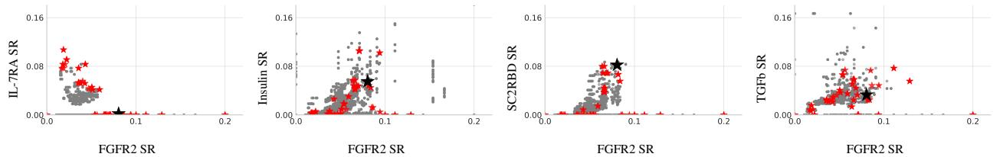  
Figure 13. The performance of the AF2 confidence score filters. The SR for each confidence combination is plotted as one gray dot. The pareto frontier filters are highlighted as red stars, and the selected one is marked as a black star.

For each threshold combination, we compute the success rate (SR) on each target. Following the definition of Pareto Frontier, the search algorithm can come to a set of optimal points (as demonstrated in Figure 13). To distinguish the final solution, we tend to the solution which has minimal shifts across different targets, known as robust selection or risk aversion policy (Asimit et al., 2017). We calculate the rank of each combination’s SR within each target and then take the average rank across all targets. This average rank serves as the overall “score” for the threshold combination. As demonstrated in the third figure in Figure 13, we come to a balanced SR solution on FGFR2 and SC2RBD. Ultimately, we select the combination with the highest score as the final filtering criteria.

# B.2. Per-Score Filter Evaluation

To complement the Top- $1 \%$ SR analysis in the main text (Figure 1a), we provide additional evaluation of individual confidence scores using two standard ranking metrics: AUC (area under the ROC curve) and AP (average precision, or area under the PR curve). These metrics reflect how well each score discriminates binders from non-binders across a range of thresholds, independent of any fixed selection cutoff.

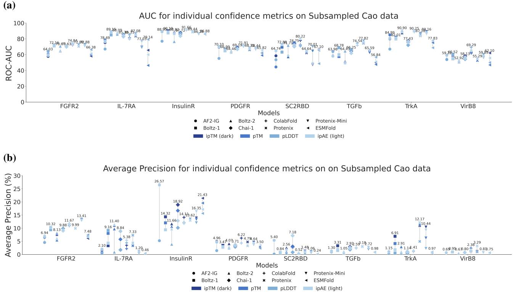  
Figure 14. AUC and Average Precision scores for individual confidence metrics on subsampled Cao data. (a) Higher values indicate better global discrimination between binders and non-binders. (b) Similar to AUC, but more sensitive to top-ranking false positives.

We report AUC and average precision scores for individual confidence metrics across diverse design targets (Figure 14). These results are generally consistent with the Top- $1 \%$ SR trends, reinforcing that Protenix-derived scores perform competitively to other verifiers. However, no single metric is universally optimal—performance varies by target and model.

# C. Related Work

Protein binder design. Previous works have exemplified binder design for some targets using natural interaction motifs or by generating or retrieving motifs computationally (Cao et al., 2022), and subsequently grafting them onto pre-defined scaffold libraries. These designs are then refined through sequence optimization to improve motif–scaffold compatibility and binder–target affinity using tools such as RosettaDesign (Kortemme & Baker, 2002). However, the experimental success rate remains low, and thus these approaches often rely on high-throughput experimental techniques to achieve functional binders. Moreover, the affinity of directly designed binders is typically insufficient, often requiring further rounds of experimental affinity maturation to reach nanomolar levels. Recent advances enable de novo binder generation via deep generative models (Watson et al., 2023; Krishna et al., 2024; BioGeometry, 2025; ChaiDiscovery et al., 2025; Bridgland et al., 2025; Pacesa et al., 2025b; Team et al., 2025; Zhang et al., 2025; Stark et al., 2025). These models are typically evaluated in silico on different targets using structure prediction models confidence scores (e.g., pLDDT, ipAE) and self-consistency RMSD. However, evaluation protocols vary significantly across studies. As a result, it remains unclear how reported performance differences reflect underlying model capabilities versus evaluation choices.

Structure prediction models. Modern binder design relies heavily on accurate structure prediction. Tools like tr-Rosetta (Yang et al., 2020), RoseTTAFold (Baek et al., 2021), and AlphaFold2 (Jumper et al., 2021) enable accurate prediction of protein monomer structure. More recent models such as ESMFold (Lin et al., 2023) and AlphaFold-Multimer (Evans et al., 2021) extend these capabilities to protein multimers. AlphaFold3(AF3) (Abramson et al., 2024) achieves higher prediction accuracy and is able to predict the joint structure of complexes including proteins, nucleic acids, small molecules, ions and modified residues. Multiple open-source variants of AF3 are released later, including Boltz-1 (Wohlwend et al., 2024), Boltz-2 (Passaro et al., 2025), Chai-1 (ChaiDiscovery et al., 2024) and Protenix (Chen et al., 2025). These predictors are now integral to design and evaluation workflows.