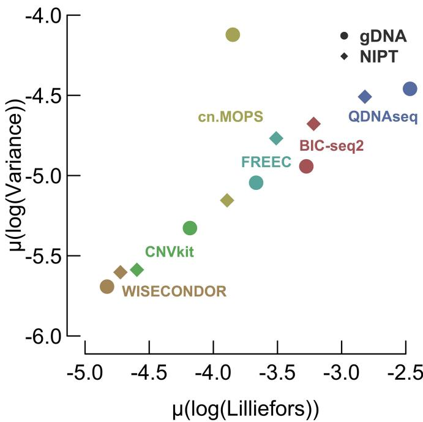
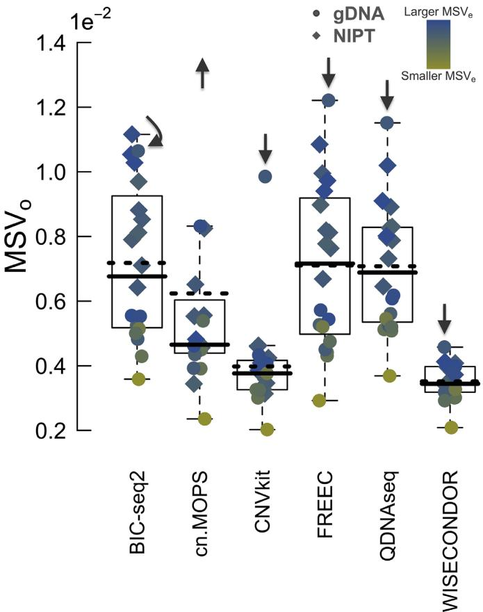
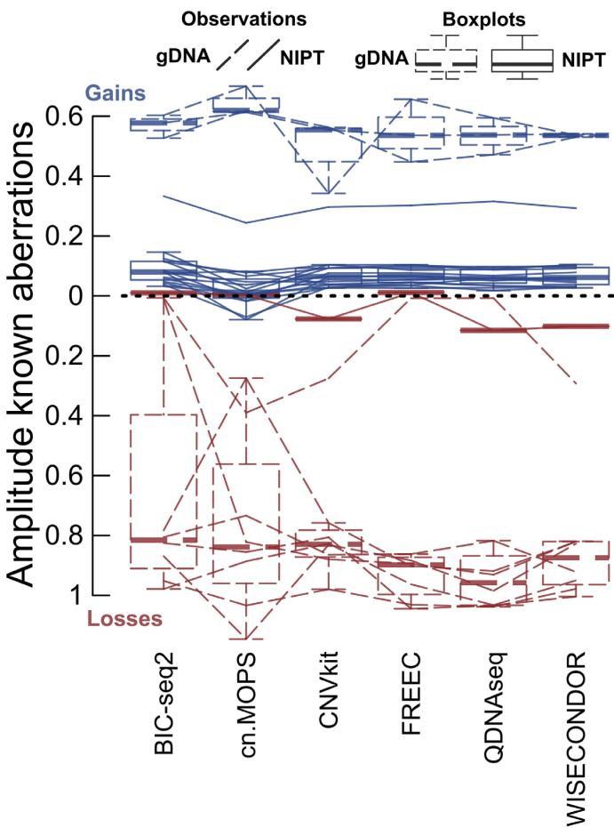
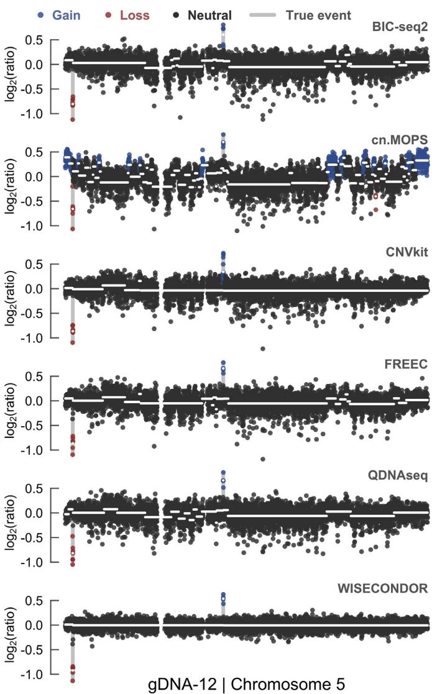
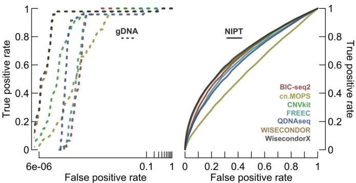
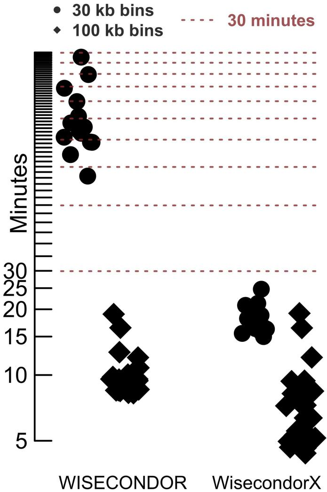

# WisecondorX: improved copy number detection for routine shallow whole-genome sequencing

Lennart Raman1,2,\*, Annelies Dheedene2, Matthias De Smet2, Jo Van Dorpe1 and Bjorn Menten¨ 2

1Department of Pathology, Ghent University, Ghent University Hospital, Ghent, Belgium and 2Center for Medical Genetics Ghent, Ghent University, Ghent University Hospital, Ghent, Belgium

Received September 11, 2018; Revised November 09, 2018; Editorial Decision December 05, 2018; Accepted December 06, 2018

# ABSTRACT

Shallow whole-genome sequencing to infer copy number alterations (CNAs) in the human genome is rapidly becoming the method par excellence for routine diagnostic use. Numerous tools exist to deduce aberrations from massive parallel sequencing data, yet most are optimized for research and often fail to redeem paramount needs in a clinical setting. Optimally, a read depth-based analytical software should be able to deal with single-end and lowcoverage data––this to make sequencing costs feasible. Other important factors include runtime, applicability to a variety of analyses and overall performance. We compared the most important aspect, being normalization, across six different CNA tools, selected for their assumed ability to satisfy the latter needs. In conclusion, WISECONDOR, which uses a within-sample normalization technique, undoubtedly produced the best results concerning variance, distributional assumptions and basic ability to detect true variations. Nonetheless, as is the case with every tool, WISECONDOR has limitations, which arise through its exclusiveness for non-invasive prenatal testing. Therefore, this work presents WisecondorX in addition, an improved WISECONDOR that enables its use for varying types of applications. WisecondorX is freely available at https://github.com/ CenterForMedicalGeneticsGhent/WisecondorX.

ity to yield results at––depending on the attained sequencing depth––unrivaled levels of accuracy (3,4). The current most important applications of sWGS include non-invasive prenatal testing (NIPT) (5); cancer diagnostics, practiced on e.g. liquid biopsies (LQBs) (6), effusion fluids (7), fresh frozen tumor tissue (FFT) (8) or formalin-fixed paraffinembedded material (FFPE) (9); preimplantation genetic testing (PGT) (10) and in the context of intellectual disability and congenital abnormalities, the study of congenital aberrations, which is often exercised on genomic DNA extracted from lymphocytes (gDNA) (11).

Due to its broad field of application, an abundance of data-analysis software has been developed for sWGS (Supplementary Table S1). These are commonly referred to as depth of coverage (DOC) methods. Other categories, enclosing assembly-based, split-read or read-pair methods, can additionally reveal chromosomal rearrangements (12). Nevertheless, these require higher coverage which is generally not (yet) achievable in a diagnostic context.

DOC tools usually comprise three basic steps in which they vary: data normalization, segmentation and aberration calling. While mostly subtle differences between approaches are present in the latter two phases, normalization seems to be the fundamental pillar for obtaining reliable results (13). Indeed, without normalization, predicted variations would not only reflect copy number state, but also repetitive sequences, GC content, mappability, polymorphisms, sample quality, false computational assumptions, etc. (14–17). Moreover, normalization directly impacts the performance of the following phases. Below, some of the steps executed by the majority of these software, and some alternative approaches, largely focused on normalization, are discussed.

# INTRODUCTION

Recently, due to dropping sequencing costs, the analysis of copy number alterations using shallow-depth whole-genome sequencing (sWGS) data (coverage $0 . 1 \times$ to $1 \times$ ) has grown into a rising practice for many genetic centers (1,2). This is not surprising: in contrast to almost-outmoded array comparative genomic hybridization (aCGH), sWGS is cheaper, faster and has the abil-

# DOC tools partition the genome in windows

All coverage-based CNA tools start by determining the number of reads at certain loci. Naturally, these numbers can be interpreted as measures for copy number. As sWGS never covers the genome entirely, a reference sequence is divided in larger (often non-overlapping and equally sized) windows or bins, which do exhibit the property of wholegenome coverage. An important consideration is the size of these bins: the larger they are, the more reads they will hold and the less 'noise' that will be displayed by the overall output. However, using larger bins comes at a price, namely a resulting lower resolution. Since read counts follow a binomial distribution, the level of Gaussian noise can be calculated in function of the coverage and bin size (18). An optimal bin size, which intrinsically depends on the interest and type of analysis, should thus be selected according to the sequencing depth.

# A large collection of normalization techniques has previously been described

Normalization techniques can be subcategorized in three main groups. The most basic methodology uses a set of healthy reference samples that were subject to the same experimental procedures. Bins from this set operate as the normal diploid state, which can be exploited for normalization. Its main disadvantage is the need for a (generally large) set of (validated) normal reference samples. The latter can be omitted by using one of many reference-free approaches. These procedures tend to normalize by using known features (such as GC content, mappability, etc.) of a human reference genome. Nevertheless, reference-free recipes are often described as less performant. Finally, matched casecontrol methods enable discrimination between a constitutional and e.g. a tumor-derived variation (19). Moreover, minor-allele frequencies can aid in predicting the true source of such a deviation (20). Other than the inevitable fact that multiple high-coverage samples per patient result in various complications, these procedures are simply not possible for e.g. NIPT and other cell-free strategies.

In this study, six techniques, selected for their diagnostic ability, popularity and distinct properties (Supplementary Table S1), are extensively compared. A basic form of reference-free normalization can be found with FREEC (21). Here, a polynomial fit is created between bin-wise read counts and their GC content, which serves as a normalization track. Next, mappability information is used to either filter or additionally normalize the bins. QDNAseq (22), however, aims at simultaneously correcting GC and mappability bias utilizing a loess fit between counts at bins with the same combinations of GC and mappability features. BIC-seq2 (23) states that bin size is a particularly important parameter during normalization. Here, copy numbers are quasi-Poisson distributed, where a generalized additive model is used to describe their dependence on local genomic features. BIC-seq2 does not use mappability information to normalize equally sized bins, but instead normalizes uniquely mappable windows––which makes sense, since equally sized bins naturally contain varying mappable positions. Hereafter, results for larger-sized windows, and thus a desired resolution, can still be obtained by merging normalized ones to a close-to desired width.

Regarding tools that necessitate pooled healthy reference samples, cn.MOPS (24) uses a mixture of Poisson distributions, where each locus is represented by a separate generative probabilistic model created using reference and case samples. Although this tool is actually described for dealing with higher than shallow sequencing depths, we still desired to evaluate it for its use of interesting concepts. Another tool contained in this category is CNVkit (25). In contrast to cn.MOPS, the set of normals is used directly to normalize corresponding bins. On top of this, some basic within-sample normalization is performed, meaning that CNVkit intends to correct for variation introduced by 'untraceable sources', such as varying sample quality which impacts the effect of GC bias, without the necessity to resequence control samples. A rolling median technique is adopted to normalize bins with similar GC content, repetitiveness and target density––the latter describing an effect where reads are present to a fewer extent at the edges of targeted sites, exclusively affecting whole-exome sequencing data. Finally, WISECONDOR (26) specifically addresses untraceable between-sample variation. Here, a reference set is required to both normalize bins directly, using the first three components of a principle component analysis (PCA) (27), and for defining sets of within-sample reference bins, each of which represent another window that is thought to behave the same. The search for sets of within-sample reference bins is executed by the Euclidean distance, which scans all samples of the pooled reference. These collections of within-sample loci handle a second round of normalization. Doing this, if all healthy reference samples were subject to the same experimental and computational conditions as the cases, the need to fully understand the mechanism behind the origin of any bias is eliminated.

# A blacklist of chromosomal regions is used to mask uninformative loci

The human genome harbors lots of problematic repeats such as satellites, centromeres and telomeres which impede short-read mapping. In addition, highly variable regions, including among others alternative haplotypes, e.g. overrepresented on chromosome 19, all complicate normalization. That is why every CNA tool borrows the concept of a 'blacklist', holding chromosomal positions of indeterminable copy number. For reference-free methods, this list is frequently pre-defined (e.g. QDNAseq), while others often derive it from a reference set (e.g. WISECONDOR).

# Segmentation and aberration calling result in an easy-tointerpret output

Arriving at the final steps, the normalized and blacklisted profiles are divided into segments, defining loci of equal copy number. Ideally, each chromosome forms one segment at diploid level––at least for autosomes––with the exception of (sub)chromosomal true aberrations. The most embraced algorithm to realize segmentation, is circular binary segmentation (CBS) (28). It is inter alia adopted by QDNAseq, cn.MOPS and CNVkit. Finally, a statistical method tries to separate significant segments from regions classified as normal. Most tools offer a parameter argument that allows to be optimally tweaked for a particular type of analysis to maximize the number of true positives, while keeping the false positives and negatives at a minimum.

# This study analyzes two distinct types of diagnostic tests

Using 40 validation samples, each of which processed by all tools of interest, two disparate types of diagnostic tests were evaluated. First, larger (sub)chromosomal aberrations can be detected in cell-free DNA (cfDNA) by NIPT at very low coverage $( 0 . 2 \mathrm { - } 0 . 3 \mathrm { \times } )$ . Second, gDNA extracted from lymphocytes at higher coverage $( 1 \times )$ allows the discovery of smaller subchromosomal events. In contrast to NIPT, non-mosaic congenital variations in gDNA are expected to be seen at discrete constitutional copy number levels other than diploid, whereas with NIPT, the peak of a true event is fetal fraction-dependent. We reasoned that, if a software supplies good results on both of these types of analyses, it seems justified to refer to it as 'generally applicable', as for malignancies, deviations are typically expected to be positioned somewhere between NIPT and constitutional deviations.

# MATERIALS AND METHODS

# Sample and bin size selection

As half of the six tools of interest require a pooled reference set, 100 exclusive healthy reference samples were selected (Supplementary Table S1). Concerning test cases, 20 healthy samples and another twenty with (validated) aberrations, annotated during routine testing, were included (Supplementary Table S2). The analyses were performed using a bin size of $3 0 \mathrm { k b }$ , which should enable capturing the $5 0 { \ - } 4 5 0 \mathrm { k b }$ confirmed events for the gDNA group, whereas the NIPT group is evaluated with $1 0 0 ~ \mathrm { k b }$ bins, as all included NIPT aberrations have larger widths (at least 5 Mb). Using these bin sizes in combination with the acquired sequencing depths (Supplementary Table S2), similar levels of noise for all profiles should be obtained.

# DNA isolation

For NIPT, maternal blood samples were centrifuged within $2 4 \mathrm { h }$ of collection at $1 6 0 0 \mathrm { g }$ for $1 0 \mathrm { { m i n } }$ at $4 ^ { \circ } \mathrm { C }$ to separate the plasma from the blood cells. Plasma was subsequently centrifuged at $1 6 ~ 0 0 0 \mathrm { g }$ for $1 0 \mathrm { { m i n } }$ at $4 ^ { \circ } \mathbf { C }$ . The supernatant was transferred to a new microcentrifuge tube and stored at $- 8 0 ^ { \circ } \mathrm { C }$ or $- 2 0 ^ { \circ } \mathrm { C }$ until further processing. Finally, cfDNA was extracted from $3 . 5 \mathrm { m l }$ of plasma using the Maxwel $^ \mathrm { \textregistered }$ RSC ccfDNA Plasma Kit (Promega) following the manufacturer's instructions. For gDNA analysis, DNA was extracted from peripheral blood lymphocytes of the patients, following standard protocols.

(Applied Biosystems) library quantification kit, and the fragment size was verified by the Agilent High Sensitivity DNA kit. Libraries were diluted to 2 nM

# Mapping

Although GRCh38 mapping would be recommended, our comparative study used Bowtie2 (29) (with fast-local flag) to map sequencing reads to human reference genome 19, as pregenerated files for the majority of CNA tools were solely available for GRCh37. Bamsormadup (https://github.com/ gt1/biobambam2) was deployed to generate sorted BAM files with marked duplicates.

# Validation of aberrations

Different confirmation strategies were adopted to validate the samples of interest (Supplementary Table S3). NIPT validation was mostly performed by amniocentesis and chorionic villus sampling. Five of these aberrations could not be confirmed in the fetus: these were assumed to be mosaic and from placental origin, mostly because the aneuploidies were not viable or they were supported by unmatched fetal fractions. Fetal fractions were predicted by SeqFF (30). For gDNA, aberrations were detected by trio analysis. Note that for this set, we could not exclude the presence of de novo aberrations that didn't match any of the parents, unless they were supported by phenotype.

# Library preparation and sequencing

Shallow whole-genome sequencing of cfDNA and gDNA samples was performed using a Hiseq3000 sequencer (Illumina Inc.), starting from 5 ng input of cfDNA, or $2 0 0 ~ \mathrm { n g }$ of gDNA. For library construction of cfDNA samples, the NEXTflex $\textsuperscript { \textregistered }$ Cell Free DNA-Seq kit (Bioo Scientific) was used according to manufacturer's instructions. For gDNA samples the NEXTflex $\textsuperscript { \textregistered }$ Rapid DNA Sequencing kit (Bioo Scientific) was adopted. All pipetting steps were automated on a Hamilton Star robot (Hamilton). Library concentrations were measured by the Qubit High-Sensitivity kit

# Study approach

A simple pipeline was employed where every tool evaluated the same set of 40 test samples (Supplementary Figure S1). Our comparisons are comprehensively based on binwise $\log _ { 2 }$ -transformed ratios between normalized observed and expected read counts, a measure that is calculated by the vast majority of CNA tools. Unfortunately, some algorithms blacklist these observations extremely conservative, while others do this rather liberal. A priori, a conservative algorithm has a higher chance to return clean data. To avoid bias at any level, a combined mask, created by inferring the union of all reviewed blacklists, was applied to the resulting ratios of the tools––this post-normalization blacklisting ensured that there was no interference with the actual algorithms. At last, CBS was executed on all profiles in order to obtain bias-free segments. Since not all of the reviewed tools analyze sex chromosomes, only autosomes were considered.

# Tool settings, post-processing and blacklist extraction

Post-tool parsing and the actual comparative analysis were executed by custom scripting in Python and R, respectively. Prior to this, every tool was applied to a set of 40 test cases. Below some of the parameter arguments and postprocessing procedures are shortly discussed.

FREEC. Using control-FREEC (v11), the read counts were normalized by the provided GEM mappability file (http://boevalab.com/FREEC/tutorial.html) and hg19 chromosomal sequences (and lengths). Other arguments, with the exception of bin size, remained untouched. Ratios of $^ { - 1 }$ were interpreted as blacklisted loci, others were log2- transformed to obtain the desired measure.

QDNAseq. For QDNAseq, its manual (v1.14.0) was strictly followed: simultaneous correction for GC content and mappability was applied, followed by outlier smoothening. Final uncovered bins were seen as blacklisted regions.

BIC-seq2. Seq files were generated using a custom script based on the author's descriptions (http://compbio.med.harvard.edu/BIC-seq/). Once again, provided chromosome-wise mappability documents were donated to the default bicseq2-norm (v0.2.4) script. Note that BIC-seq2 does not separate the genome in equally sized bins: whenever an observed bin size exceeded the specified desired size by a factor 2 or more, this was interpreted as an alternative way of blacklisting. Ratios were obtained by dividing the observed with the expected read counts, followed by $\log _ { 2 }$ transformation.

cn.MOPS. cn.MOPS (v1.24.0) was executed according to its R manual, using the default settings. The function .makeLogRatios finally donated $\log _ { 2 }$ -scores, where blacklisted bins were defined for having an extrapolated median ratio––these were deduced as such.

CNVkit. The batch function and -m wgs flag enable CN-Vkit (v0.9.3) for whole-genome sequencing use. Since no equally sized bins are used, the same blacklisting principles as adopted for BIC-seq2 were applied.

WISECONDOR. All settings, with the exception of - binsize at the convert and newref functions, remained default. Blacklisted positions are characterized by a ratio of exactly zero. According to WISECONDOR's code, the true ratio minus one results in a default output. After correcting for the latter, ratios were $\log _ { 2 }$ -transformed.

# Circular binary segmentation

Autosomal CBS was executed by the DNAcopy (v1.50.1) R package. The alpha parameter, defining a $P -$ -value cut-off between consecutive bins for breakpoint calling, was set to $\mathrm { l e } ^ { - 5 }$ . Segments should contain at least two bins. Finally, the mean value of corresponding bins was interpolated as the ratio of a segment.

# The median segment variance

The observed median segment variance $\mathrm { ( M S V _ { o } ) }$ , a samplewise measure for noise, is defined as the median of a set of variances, where each variance corresponds to the variance of a segment. Although not truly calculated, the expected median segment variance $\mathrm { ( M S V _ { e } ) }$ is inversely proportional to the bin size and the read depth, as both define noise, for which $\mathbf { M S V } _ { 0 }$ is a measure.

$$
\mathbf { M S V } _ { 0 } \approx \mathbf { M S V } _ { \mathrm { e } } \sim { \frac { 1 } { \mathrm { r e a d } \mathrm { d e p t h } * \mathrm { b i n } \mathrm { s i z e } } }
$$

# Constitutional aberration calling

The 'default heights' for constitutional autosomal aberrations in $\log _ { 2 }$ dimension are given below, expressed as a ratio between observed and expected copy number (CN).

$$
\mathrm { D e l e t i o n } = \log _ { 2 } \left( \frac { \mathrm { o b s } \mathrm { C N } } { \exp \mathrm { C N } } \right) = \log _ { 2 } \left( \frac { 1 } { 2 } \right) = - 1
$$

$$
\mathrm { D u p l i c a t i o n } = \log _ { 2 } \left( { \frac { \mathrm { o b s ~ C N } } { \exp C \mathrm { N } } } \right) = \log _ { 2 } \left( { \frac { 3 } { 2 } } \right) \approx 0 . 5 8
$$

The boundary for constitutional aberration calling was chosen at an arbitrary 1/3 copy number deviation from diploid––this to capture most true positives, while being sufficiently liberal to obtain an abundance of false positives.

$$
\mathrm { D e l e t i o n c u t o f f } = \log _ { 2 } \left( { \frac { 2 - 1 / 3 } { 2 } } \right) \approx - 0 . 2 6
$$

$$
\mathrm { G a i n ~ c u t o f f } = \log _ { 2 } \left( \frac { 2 + 1 / 3 } { 2 } \right) \approx 0 . 2 2
$$

# RESULTS

# Obtaining bias-free ratios using a unified blacklist

Comparing the blacklists employed by the CNA tools illustrates large differences in masking stringency, supporting the use of a unified blacklist to sideline this origin of bias (Supplementary Figures S2 and S3). For $1 0 0 ~ \mathrm { k b }$ windows, the conservative QDNAseq noteworthy masks $14 \%$ of the human genome, while the more liberal CNVkit and cn.MOPS account for only $6 \%$ each. In total, the inferred unified blacklist covers $1 6 \%$ of the human genome. After applying this mask to all bin-wise $\log _ { 2 }$ ratios, healthy cases, thought to have none or few large variations, are ideally expected to match profiles with flat $\log _ { 2 }$ patterns across all autosomes (typical autosome-wide profiles in Supplementary Figure S4 for NIPT and Supplementary Figure S5 for gDNA). In samples with aberrations however, the true deviations ideally transcend the background noise (typical autosome-wide profiles in Supplementary Figure S6 for NIPT and Supplementary Figure S7 for gDNA).

# Noise and normality

Variance highly depends on sequencing depth. Other than coverage, normalization algorithms might overlook main sources of bias which could thus negatively impact desired overall flat, normally distributed and limited noisy profiles in healthy cases. Overall flatness and normality can be measured by deploying the profile-wide variance and the Lilliefors normality test, respectively (Figure 1). Since both should be as low as possible, WISECONDOR, closely followed by CNVkit, score best.

Concerning a sample-wise noise measure, overall variance could be biased by subtle deviations. That is why we described a novel robust measure, named the (observed) median segment variance $\mathrm { ( M S V _ { o } ) }$ . This measure should reflect its expected equivalent, the $\mathbf { M S V _ { e } }$ , which is proportional to read depth and selected bin size (Figure 2) (Materials and Methods). Here, it's notable that the set of superior tools comprise the ones that use reference samples. Again, WISECONDOR's pole position is firmly followed by runner-up CNVkit. One observation however, gDNA-3, escapes this trend (Supplementary Figure S8): exclusively WISECONDOR appears to normalize this sample correct. Note that this implies an unverified assumption stating that for this sample, WISECONDOR's profile utmost approximates reality. Nonetheless, a second similar observation, this time with confirmed aberrations (discussed later), will strengthen this hypothesis.

Figure 1. The profile-wide variance versus the Lilliefors normality statistic. The means across log-transformed variances and Lilliefors statistics are shown. The lower left-hand corner is expected to contain the best tools according to these measures. One observation (gDNA/cn.MOPS), seems to desert the otherwise apparent linear relationship between both measures, mostly caused by sample gDNA-3 (Supplementary Figure S8).

Figure 2. The median segment variance. Scattered dots represent samplewise observations of median segment variances $\mathrm { ( M S V _ { o } ) }$ ). The default boxplots clarify the underlying distributions. A solid line represents the median, whereas a dotted line indicates the mean. Note that the means are consistently higher than the medians, caused by outlier sample gDNA-3 (Supplementary Figure S8), which is additionally marked by arrows. The colors of the dots represent the $\mathbf { M S V _ { e } }$ , a measure that depends on bin size and sequencing depth. According to the outlier sample, the lowest mean and median $\mathrm { M S V _ { o } }$ and a generally smooth blue-to-yellow $\mathrm { ( M S V _ { e , } }$ ) transition, WISECONDOR scores best.

# Amplitude

A superior normalization strategy should not arise at the expense of inferior amplitudes (defined as the absolute value of the corresponding segment's $\log _ { 2 }$ ratio) at true deviations. The amplitude measure exhibits no large differences between the reviewed tools, with the exception of cn.MOPS (Figure 3). WISECONDOR does not display the largest amplitudes, yet it seems superior compared to its current closest rival, CNVkit. Note that the highest peaks do not necessarily present the most correct ones––indeed, it is essential that an amplitude not only indicates an aberration but also reflects its true copy number. Nevertheless, nonmosaic congenital gDNA deletions are constitutional and are thus expected at $\log _ { 2 }$ ratios of $^ { - 1 }$ , whereas duplications are to be seen at 0.58 (the 'default heights' of aberrations, Materials and Methods). Our observations seem to consequently exhibit lower amplitudes, probably due to segments with outer bins that merely cover the matching loss or gain, an effect greatly affecting these narrow events.

# Performance

Without replicating a true statistical algorithm, $\mathrm { g D N A }$ samples allow for a hard ratio cut-off as aberrations from nonmosaic origin, which are not subject to tumor or fetal fraction, are expected to appear at 'default heights'. This boundary was chosen at 1/3 copy number deviation from diploid (Materials and methods)––this to capture most true positives, while being sufficiently liberal to obtain an abundance of false positives, supporting algorithm-wise comparison.

Using this approach, solely CNVkit and WISECON-DOR realize a sensitivity of $100 \%$ , where WISECONDOR returns six false positives, while CNVkit claims 10. Remark that these false observations could involve non-annotated true events as well: de novo gains and losses cannot be excluded during trio-analysis. Notably, according to the reciprocity of dots across the tools of interest, WISECON-

Figure 3. The amplitude of aberrations. Traveling left-to-right lines symbolize specific confirmed events (Supplementary Table S3) and their interpretation by the tools. The default boxplots clarify the underlying distributions. Solid lines (both for boxplots and observations) represent NIPT, whereas gDNA is depicted by dotted lines. For NIPT, one sample appears with elevated amplitudes, which concerns a mosaic maternal variation (NIPT-22). The narrowest event (in gDNA-11) is exclusively captured by cn.MOPS, CNVkit and WISECONDOR.

DOR's false positives probably belong to this group of unannotated narrow events (Supplementary Figure S9).

gDNA-12, a second problematic sample that seems to suffer from unaccounted bias, provoked multiple false positive results across all tools except one (Supplementary Figure S10). In e.g. chromosome 5, true events exclusively transcend the noise in WISECONDOR (Figure 4).

Finally, receiver operating characteristic (ROC) curves enable us to truly study bin-wise performance without a potentially biased predefined aberration cut-off. Again, WISECONDOR performs best, with differences in gDNA expressed to the greatest extent (Figure 5). Remember that these curves do not represent the true performance of the tools (which is underestimated), yet they do reflect the most important aspect, being bin-wise normalization.

# WISECONDOR's limitations

Although WISECONDOR certainly normalizes copy number data in the most consistent way, a CNA tool comprises more than a normalization phase. WISECONDOR was originally introduced as a NIPT-specific data analysis software. Suitable for debate, this implies that sex chromosomes are of less interest. Moreover, due to complications, such as a gender-dependent presence or absence of fetal Yreads and a variable number of X-reads, gonosomes were excluded from the analysis. WISECONDOR implements a Stouffer's z-score sliding window approach to simultaneously segment and score possible aberrations. This algorithm is unfortunately extremely slow for small bin sizes: we observed a mean runtime of $2 4 ~ \mathrm { h }$ for a realistic resolution of $1 5 \mathrm { k b }$ . Even more important, the algorithm is error-prone when dealing with large amounts of deviations. Particularly aberrations-within-aberrations cannot be dealt with and are not segmented correctly. In conclusion, WISECONDOR lacks basic necessities to suffice for a generally applicable sWGS tool.

Figure 4. Chromosome 5 profile comparison of problematic sample gDNA-12. Although exclusively cn.MOPS depicts false positives in chromosome 5, scattered segments in all but WISECONDOR's profile indicate mosaic deviations, which are not the case. It appears that solely WISECONDOR accounts for a particular type of bias, highly present in this sample.

Figure 5. The performance capabilities of normalization techniques. The gDNA plot (left) represents the performance on all gDNA cases, the NIPT plot (right) on the remaining NIPTs. The false positive rate for gDNA is shown in log-scale. These ROC curves do not represent the true performance of the tools, yet they do indicate the most important aspect: normalization. We can thus conclude that, for both gDNA and NIPT, WISECON-DOR performs best. Note that the WisecondorX curves are highly similar to the ones from WISECONDOR, as very few modifications to the actual normalization algorithm have been made.

loci, irrespective of the size, can be measured by this matrix.

$$
\begin{array} { r l } & { Z _ { s e g m e n t ( n  m ) } = } \\ & { \frac { \mu _ { w } ( R _ { n } , R _ { . . . } , R _ { m } ) - \mu ( \mu _ { w } ( r _ { 1 , n } , r _ { 1 , . . . } , r _ { 1 , m } ) , \dots , \mu _ { w } ( r _ { p , n } , r _ { p , . . . } , r _ { p , m } ) ) } { s t d ( \mu _ { w } ( r _ { 1 , n } , r _ { 1 , . . . } , r _ { 1 , m } ) , \dots , \mu _ { w } ( r _ { p , n } , r _ { p , . . . } , r _ { p , m } ) ) } } \end{array}
$$

In the above formula, $Z _ { s e g m e n t ( n  m ) }$ represents the $\mathbf { Z }$ -score corresponding to a segment (or chromosome) ranging from bin n until m. $\mu _ { w } ( )$ calculates the average of the provided sequence weighted by bin-wise variability calculated during reference creation. The functions $\mu ( )$ and $s t d ( )$ calculate a default mean and standard deviation, respectively. $R _ { n }$ represents the ratio of the studied sample at bin $n$ , while e.g. $r _ { 2 , n }$ holds the ratio for the same locus in null case 2. There are $p$ healthy null cases in the reference matrix.

# WisecondorX

In response to previous limitations, we developed WisecondorX. This novel freely available software package, written in Python and R, contains the same normalization principles, yet combined with fundamental custom code. To improve user-experience, we made WisecondorX installable through Bioconda (31). Below, some of the main adaptations are shortly introduced.

Gonosomal copy number detection. WisecondorX internally separates male from female samples, using a Gaussian mixture model with two expected components, trained on the Y-read fraction during reference creation. This technique appears to work extremely well across different types of analyses. While all samples are still used to generate an autosomal reference, both gender groups are treated separately to generate two additional gonosomal references. This process does not compromise with usability: only one reference file is generated. When evaluating a new sample, the gender is automatically predicted and the correct gonosomal reference is selected for normalization.

Segmentation. CBS substitutes the original iterative Stouffer's $z$ -score technique. This results in both significantly lower computing times (Figure 6) and more correct segments for analyses beyond NIPT (Supplementary Figure S11). Both CBS and segmental z-score calculations (discussed below) are weighted using variability information extracted from the reference set in WisecondorX, a methodology based on similar key steps in CNVkit. This way, bins with statistics that are less likely to be accurate are down-weighted.

Bin-wise, segmental and chromosomal $z$ -scores. Bin-wise zscores are calculated by treating the within-sample reference sets as null distributions, as is default in WISECONDOR. However, we believe that segmental and chromosomal $z$ - scores should not be influenced by other aberrations. That is why, during reference creation, bin-wise values from 100 healthy samples (or less, depending on how many are provided) are normalized and saved in a large 'reference matrix'. During $z$ -scoring, naturally occurring variance at any

Figure 6. Runtime comparison between WISECONDOR and WisecondorX. Minutes are presented in logarithmic scale. Timing covered the 'bam to result' principle (meaning the combination of the convert and test (WISECONDOR) or predict (WisecondorX) functions). Despite not being analyzed by this validation set, WISECONDOR exceeds a mean runtime of $2 4 \mathrm { h }$ for resolutions of $1 5 \mathrm { k b }$ (supposed exponential complexity for the test function), whereas WisecondorX barely increased with $2 \mathrm { m i n }$ (supposed linear complexity for the predict function). The increased runtime in WISECONDOR is caused by the iterative Stouffer's z-score procedure.

$Z _ { s e g m e n t ( n  m ) }$ represents a score that is directly proportional to the 'healthy variability' of the corresponding locus. Moreover, the length of a segment/chromosome is considered: the means of longer segments express less natural variability, therefore yielding higher scores for equal ratios. We retrospectively applied this score to ${ 5 0 0 0 } \mathrm { N I P T }$ samples, missing not one confirmed aneuploidy, while retrieving only few false positives, most of which concerned maternal aberrations.

Aberration calling. Notwithstanding $z$ -scores are thus calculated, a user-definable cut-off for aberration calling, associated to $\log _ { 2 }$ ratios, is used to separate aberrant segments from normal ones––this to preserve the general character of WisecondorX, where significance is unrelated to type of analysis and interest. A key principle in diagnostics further supports this methodology: if a small deviation from the healthy state is observed, it should be studied, irrespective of its statistical significance. This parameter argument is named –beta and represents the linear trade-off between assigning aberrant to every segment (–beta 0) and to exclusively expected non-mosaic variants from samples with $100 \%$ constitutional purity (–beta 1). When the tumor or fetal fraction is known, this parameter should be optimally close to this measure.

Output. On top of what's listed above, numerous smaller yet important changes in terms of interpretability and usability were made. These e.g. include the user's capability to output various tables, which can easily be processed by any automatic in-house diagnostic pipeline, and a basic plotter, which intends to visualize results during stand-alone use.

For validation purposes, WisecondorX was also subjected to ROC comparison (Figure 5). One test case that was not yet reviewed involved a gonosomal aneuploidy (NIPT-21; Supplementary Table S3), where previous comparative study exclusively considered autosomes. A genome-wide overview of this sample, inter alia resulting from WisecondorX's output, is shown in Supplementary Figure S12. As anticipated, the deviation is captured.

# DISCUSSION

Shallow whole-genome sequencing is rapidly becoming the method of choice to infer copy number alterations $( > 1 0 \mathrm { k b } )$ in a diagnostic environment. This study compares the most important aspect of computational data analysis during this process, which is normalization, across six different CNA tools (FREEC, QDNAseq, BIC-seq2, CNVkit, cn.MOPS and WISECONDOR) and two types of disparate material (cell-free DNA obtained during routine NIPT and gDNA extracted from lymphocytes).

A unified blacklist was derived to generally mask problematic regions in the test cases, as this results in the fairest comparison. An important consideration is that mostly reference-free methods (FREEC, QDNAseq and BIC-seq2) will benefit from this procedure. Indeed, the other tools (CNVkit, cn.MOPS and WISECONDOR) partly compile a blacklist based on the type of analysis and laboratory steps, as they exploit healthy reference samples of identical material that were subject to the same experimental procedures as the test cases. The union of all blacklists consequently introduces this mask to the reference-free methods. Nonetheless, this procedure seems justified as our interest lies with comparing normalization, which is independent from blacklisting. In short, we noticed that without this supplementary mask, the differences between WISECONDOR and the other tools are pronounced to an even greater extent, even compared to QDNAseq, which uses a more conservative blacklist, meaning WISECONDOR selects its blacklist in a well-balanced and an apparent correct way.

A tool's necessity for a pooled reference set might introduce complications, yet these compensate beyond doubt for the improved results. Especially in a diagnostic setting, the focus of this paper, acquiring a set of healthy pre-analyzed samples should not form an obstacle. Moreover, most tools, including WISECONDOR, provide code to transform a reference set into a compressed and directly interpretable format, a process that should only be executed once, meaning testing does generally not increase runtime in comparison to reference-free methods.

Two striking observations (gDNA-3 and gDNA-12) indicate unknown bias that remained unaccounted in all tools but WISECONDOR. Our institution retrospectively reported numerous other such cases, at the time concluding that, for unknown reasons, these samples could not be normalized efficiently. Notwithstanding that the true source of this bias remains unknown, WISECONDOR appears to accurately normalize these data. To interpret this finding, remember that both CNVkit and WISECONDOR implement the idea of within-sample normalization. For CNVkit, bin associations within a genome are based on genomic features such as GC content, whereas in WISECONDOR links arise from the Euclidean distance measure which scans all pooled reference genomes. The latter technique circumvents the need to fully understand the mechanism behind any source of potential bias. We hypothesize that, as CNVkit fails in correctly normalizing both gDNA-3 and gDNA-12, in contrast to WISECONDOR, the bias in these samples originates from another than typical source.

Concluding a comprehensive comparative study concerning three pillars of normalization, WISECONDOR returned the best results. In healthy cases, normally distributed, overall flat and non-noisy profiles were obtained. Concerning performance capabilities, WISECONDOR realized afresh superior outcome. These positives were not compromised with inferior amplitudes at validated aberrations.

Although WISECONDOR's approach certainly outperforms the other normalization algorithms, as just described, several limitations make it unfit for routine diagnostic use. We concluded our paper by releasing an adapted version of WISECONDOR, named WisecondorX, which supports a similar normalization procedure, yet the algorithm is enabled for genome-wide and general use beyond NIPT.

In contrast to most other established tools, WisecondorX does not base it aberration calls on a true underlying statistical procedure. We believe these procedures can only work reliable when they are optimized for a specific type of analysis. Indeed, a statistical approach should be optimized to expectance: in theory, for NIPT, as we expect none or sometimes one large deviation with a small amplitude, an algorithm could measure the deviation of a segment in comparison to the others, yet this reasoning does not apply for a highly aberrant tumor sample. Furthermore, when constitutional aberrations are of interest, higher amplitudes at variations are typically expected compared to cases subjected to DNA purity/fraction such as NIPT: it's virtually impossible to optimize a statistical recipe for all of the latter. Finally note that in a diagnostic setting, significance levels seem less important: an apparent variant should still be reported, even if it did not reach a user-defined significance level. Nevertheless, z-scores are still calculated by WisecondorX and have been shown to work reliably for NIPT.

To conclude, WisecondorX has been adopted by the ViVar structural genomic variation platform (32), where it replaced the reference-free QDNAseq software.

# DATA AVAILABILITY

WisecondorX is an open source tool. User-manual and software are freely available at https://github.com/ CenterForMedicalGeneticsGhent/WisecondorX. All samples from this manuscript are provided as WisecondorX output tables at https://datadryad.org (doi: 10.5061/dryad.t013r0s).

# SUPPLEMENTARY DATA

Supplementary Data are available at NAR Online.

# ACKNOWLEDGEMENTS

The authors would like to thank Roy Straver, the inventor of WISECONDOR, for supporting the creation of WisecondorX and for allowing us to publish this novel tool despite the inclusion of original WISECONDOR code.

# FUNDING

Bijzonder Onderzoeksfonds (BOF), Ghent University, in the form of a doctoral research grant [2017000201 to L.R.]. Funding for open access charge: Doctoral research grant, 'bijzonder onderzoeksfonds (BOF)', awarded by Ghent University. Conflict of interest statement. None declared.
