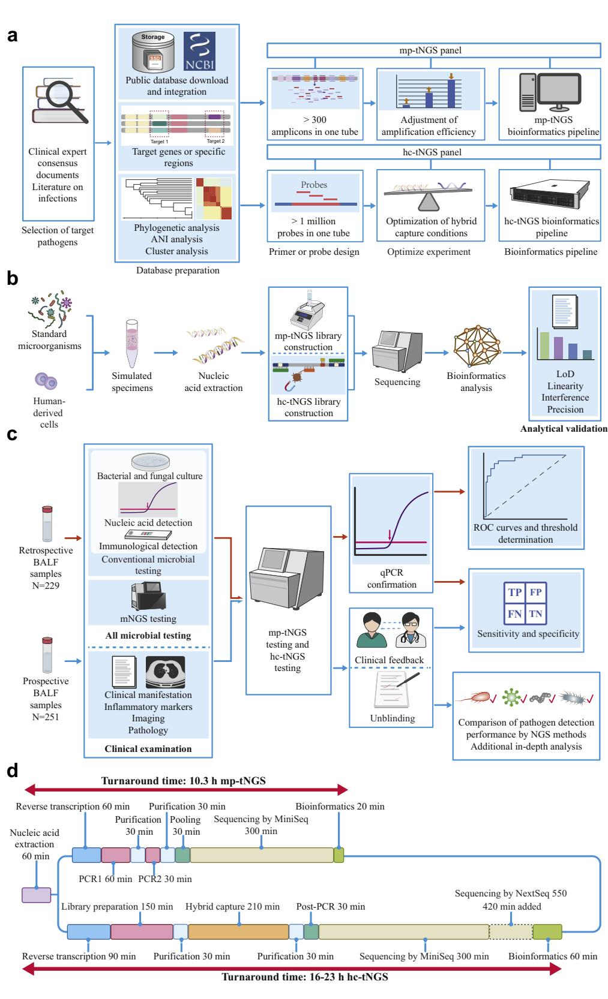
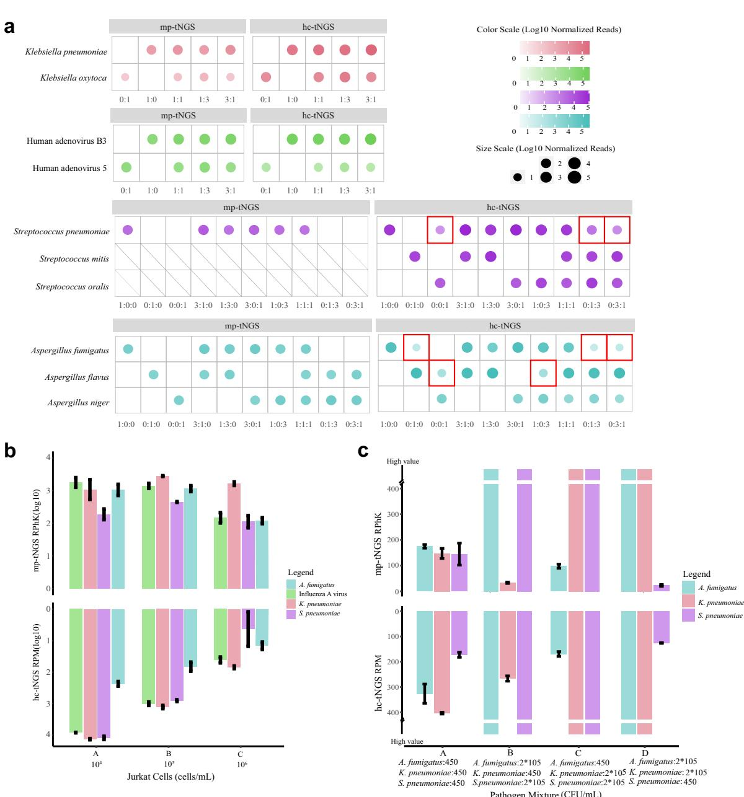
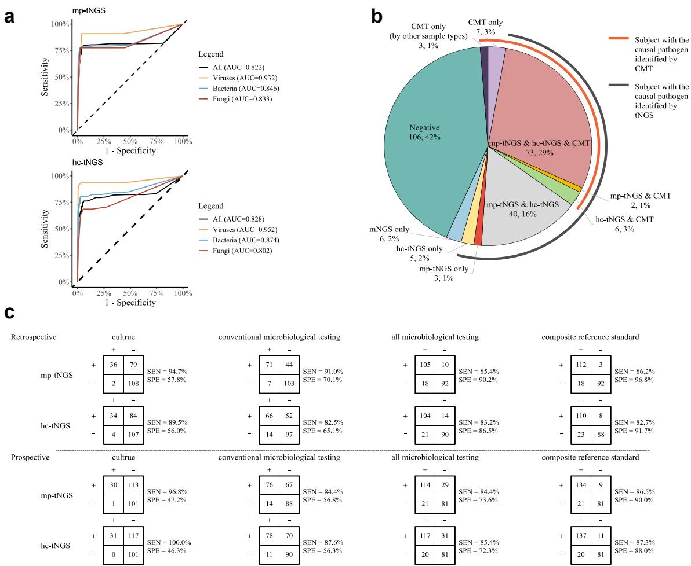
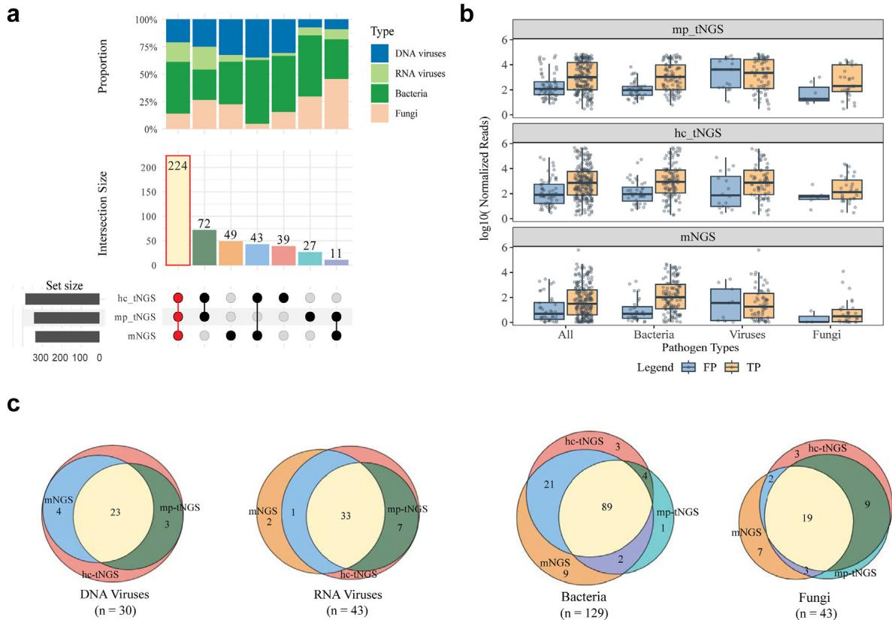
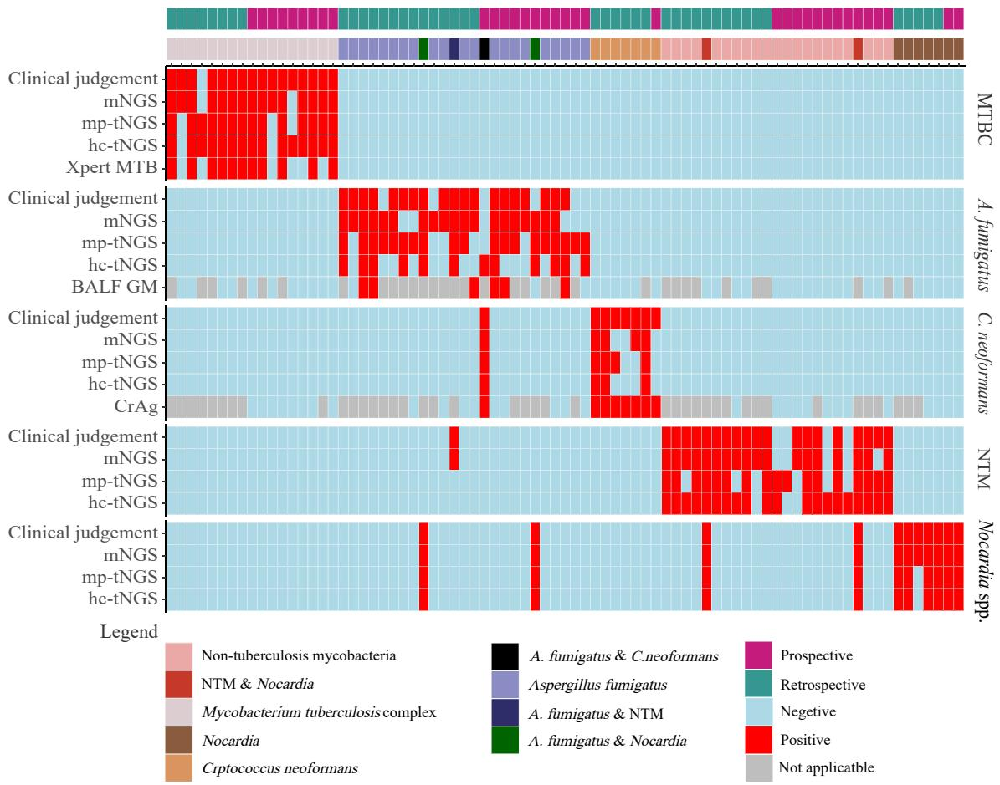

# Enhancing lower respiratory tract infection diagnosis: implementation and clinical assessment of multiplex PCRbased and hybrid capture-based targeted next-generation sequencing

Yuyao Yin,a,c Pengyuan $Z h u , ^ { b , c }$ Yifan Guo,a Yingzhen $L \mathbf { i } , ^ { b }$ Hongbin Chen,a Jun Liu,b Lingxiao Sun,a Shuai Ma,a Chaohui $H \cup _ { r } ^ { \ b , * * * }$ and Hui Wanga,∗

a Department of Clinical Laboratory, Peking University People’s Hospital, Beijing, China b Guangzhou KingCreate Biotechnology Co., Ltd., Guangzhou, China

# Summary

Background Shotgun metagenomic next-generation sequencing (mNGS) is widely used to detect pathogens in bronchoalveolar lavage fluid (BALF). However, mNGS is complex and expensive. This study explored the feasibility of targeted next-generation sequencing (tNGS) in distinguishing lower respiratory tract infections in clinical practice.

Methods We used 229 retrospective BALF samples to establish thresholds and diagnostic values in a prospective cohort of 251 patients. After target pathogen selection, primer and probe design, optimization experiments, and bioinformatics analysis, multiplex PCR-based tNGS (mp-tNGS) and hybrid capture-based tNGS (hc-tNGS), targeting 198 and 3060 pathogens (DNA and RNA co-detection workflow) were established and performed.

Findings mp-tNGS and hc-tNGS took 10.3 and $\mathbf { 1 6 ~ h }$ , respectively, with low sequencing data sizes of $\mathbf { 0 . 1 \ M }$ and 1 M reads, and test costs reduced to a quarter and half of mNGS. The LoDs of mp-tNGS and hc-tNGS were ${ \bf 5 0 { - } 4 5 0 ~ C F U / }$ mL. mp-tNGS and hc-tNGS were highly accurate, with $8 6 . 5 \%$ and $8 7 . 3 \%$ (vs. $8 5 . 5 \%$ for mNGS) sensitivities and $9 0 . 0 \%$ and $8 8 . 0 \%$ (vs. $9 2 . 1 \%$ for mNGS) specificities. tNGS detection rates for casual pathogens were $8 4 . 3 \%$ and $8 9 . 5 \%$ (vs. $8 8 . 5 \%$ for mNGS), significantly higher than conventional microbiological tests $( P < 0 . 0 0 1 )$ ). In seven samples, tNGS detected Pneumocystis jirovecii, a fungus not detected by mNGS. Whereas mNGS detected six samples with filamentous fungi (Rhizopus oryzae, Aureobasidium pullulans, Aspergillus niger complex, etc.) which missed by tNGS. The anaerobic bacteria as pathogen in eight samples was failed to detect by mp-tNGS.

Interpretation tNGS may offer a new, broad-spectrum, rapid, accurate and cost-effective approach to diagnosing respiratory infections.

Funding National Natural Science Foundation of China (81625014 and 82202535).

Copyright $\circledcirc$ 2024 The Author(s). Published by Elsevier B.V. This is an open access article under the CC BY-NC-ND license (http://creativecommons.org/licenses/by-nc-nd/4.0/).

Keywords: Metagenomic next-generation sequencing; Targeted next-generation sequencing; Pathogen; Bronchoalveolar lavage fluid; Pneumonia

# Introduction

Lower respiratory tract infections (LRTIs) are a leading cause of morbidity and mortality worldwide, with a great medical burden.1,2 A wide range of pathogens, such as bacteria, viruses, and fungi, can lead to LRTIs with indistinguishable clinical presentations. Rapid and accurate detection of pathogens results in broad-spectrum antibiotic reduction and promotion of patient recovery.3 However, conventional diagnostic methods have shortcomings regarding culture difficulties and long turnaround times (TAT) and require prior assumptions regarding the types of pathogens.3

With the development of next-generation sequencing (NGS) technology and the increase in its clinical use,

# Articles

# Research in context

# Evidence before this study

Popular use of shotgun metagenomic next-generation sequencing (mNGS) in pathogen identification and the technical advance of enrichment strategy have laid the foundation for the trending application of targeted NGS (tNGS) in respiratory tract infection. Currently, mature and commercial tNGS products usually employ two enrichment strategies, multiplex PCR and hybrid-capture. A concern is rising about what are the differences among mNGS, multiplex PCR-based tNGS (mp-tNGS), and hybrid capture-based tNGS (hc-tNGS) in routine practice. To the best of our knowledge, there are currently no head-to-head comparisons on the methodological elaboration and analytical performance of these methods, nor clinical studies with large prospective samples. However, the extent to which these new tNGS methods contribute to clinical decision-making, their strengths in pathogen detection, and the similarities and differences in their implementation in clinical practice remain important questions.

# Added value of this study

In this study, mp-tNGS and hc-tNGS methods were established. Analytical performance (limit of detection, linearity, interference, and precision) was evaluated. Notably, it was found that the main interfering factors of the two tNGS assays were different in the interference experiment.

229 retrospective and 251 prospective bronchoalveolar lavage fluid (BALF) samples were involved in the clinical evaluation. Compared with the composite reference standard, the accuracy of both tNGS methodologies was fully validated. The detection rates for casual pathogens of the three NGS methods were all significantly higher than that of conventional microbiological tests $( P < 0 . 0 0 1 )$ . Finally, the similarities, differences, advantages, and limitations of the three NGS methods were summarized.

# Implications of all the available evidence

Our data demonstrated that tNGS is broad-spectrum, rapid, accurate and cost-effective in lower respiratory tract infeciton. Compared with mNGS, tNGS shows low sensitity on Mucorales, non-tuberculous mycobacteria and anaerobic bacteria in patients with aspiration pneumonia (mp-tNGS), and strong ability on detecting Pneumocystis jirovecii. The results obtained from the data of analytical performance and clinical evaluation would enhance our comprehensive understanding of tNGS, which includes target selection, primer or probe design, optimization of experimental conditions, performance in prospective samples and clinical scenarios for tNGS. These results suggest that tNGS has large clinical application prospects in the field of infections in the future.

NGS has become an important method for diagnosing genetic diseases and cancer. Historically, the use of NGS for infection diagnosis can be traced back to the 2010s when metagenomic NGS (mNGS) was initially utilized for virus detection.4 Recent studies have shown that NGS technology has great potential for diagnosing clinically relevant microorganisms.5,6 Its possibility to assess all microorganisms in one test and fast response leads to a wide range of applications nowadays.7–9 However, several barriers, such as a high human host nucleic acids background, colonization discrimination, and high costs, must be overcomed.3

In this context, broad-spectrum targeted NGS (tNGS) has emerged as a cost-efficient alternative to mNGS. Technically, the methodology of tNGS, involving the use of PCR or hybrid capture to enrich the targets before sequencing, has not significantly changed since the 2010s.10 Nevertheless, the target spectrum of tNGS has expanded from singleplex assays (e.g., 16S rRNA, 18S rRNA, ITS amplicon sequencing) or low-multiplex to high-multiplex, driven by the need to overcome the challenges of accommodating hundreds to thousands of primers in a single assay system. This advancement has enabled tNGS to surpass the limitations observed when using singleplex targets. Consequently, the groundwork laid by mNGS, singleplex amplicon sequencing, and the subsequent technical progress have laid the foundation for the rise of multiplex PCR-tNGS (mp-tNGS) and hybrid capture-based tNGS (hc-tNGS) as the prominent trends in sequencing technology.

Some reports have demonstrated the clinical application of $\mathrm { \ t N G S { } ^ { 1 1 - 1 3 } }$ in different types of infections. The deployment of mNGS and tNGS for pathogen identification and their diagnostic value have been demonstrated in previous studies.6,11–13 The initial findings suggest that all three methods could assist in clinical decision-making.6,11–13 However, the differences in their clinical applications and suitability in different scenarios remain unclear. Studies directly comparing these methods in the same patient group are lacking. The extent to which these new tNGS methods’ strengths in pathogen detection, and the similarities and differences in their implementation in clinical practice remain important questions. Therefore, this study aimed to explore the feasibility of tNGS in distinguishing lower respiratory tract infections in clinical practice.

# Methods

# Ethics approval and consent to participate

This study was approved by the Research Ethics Board of the Peking University People’s Hospital (ID: 2023PHB078). All procedures involving human participants performed in this study were in accordance with the ethical standards of the institutional and/or national research committee and with the 1964 Helsinki Declaration and its later amendments or comparable ethical standards. Informed consents were obtained from all the patients enrolled in the study. This study was taken a trial registration in Chinese Clinical Trial Registry (ChiCTR2300073837, study leader Hui Wang, registration date 2023-07-24).

# Sample size

Sample size calculations were conducted before the study’s initiation by PASS 2021, v21.0.3. Compared with the composite reference standard, the expected sensitivity of tNGS was 0.8, the confidence level was 0.95, and the confidence interval width was 0.2; 130 LRTI samples were calculated for sensitivity analysis. The expected specificity was 0.8, the confidence level was 0.95, and the confidence interval width was 0.2; 70 samples of non-LRTIs were calculated for specificity analysis.

# Study design and participants

All bronchoalveolar lavage fluid (BALF) samples were obtained from patients undergoing routine mNGS tests at the Peking University People’s Hospital (PKUPH). Residual samples were collected in sterile tubes as part of routine clinical care. The non-duplicate patients with sufficient sample volume $( \geq ~ 6 0 0 ~ \mu \mathrm { L } )$ and complete clinical information were enrolled. Patients aged $< 1 8$ years with insufficient sample volume or tNGS failure were excluded. Cultures, molecular, and serological tests were performed in-house at the Department of Clinical Laboratory at PKUPH.

In this retrospective study, samples were collected between May 2022 and May 2023. Residual samples were stored at $- 8 0 ~ ^ { \circ } \mathrm { C }$ until the time of extraction. The samples were randomly selected for storage. In this prospective study, a cohort of adults with suspected LRTIs who underwent bendable bronchoscopy and routine mNGS between July and September 2023 was included. The samples were stored at $4 ~ ^ { \circ } \mathrm { C }$ and tested within 7 days of collection (Supplementary Fig. S1).

# mp-tNGS workflow construction

The panel design is based on a comprehensive compilation of sources. A survey was conducted on various types of documents, including clinical expert consensus and literature/books on infections14–17 (Fig. 1a). The mptNGS panel covered 198 pathogen targets commonly encountered in clinical scenarios. A full list of the target species identified by the mp-tNGS panel is presented in Supplementary Table S1. A reference database was curated mainly from NCBI Refseq/nt.18 Redundant sequences with high similarity were removed from the database. Phage sequences and artificial sequences such as plasmids were filtered. Based on assembly level, submission source, sequencing method and annotation information, the database was cleaned and annotated to remove low-quality sequences, improve accuracy and reduce bias. Alignment was performed using MUSCLE (v3.8.31)19 with default parameters to obtain interspecific SNP profiles, allowing phylogenetic relationships and downstream analysis to be computed. Based on the database integrated above, target loci capable of precise species and strain identification were selected for primer design. Target genes recommended by classical PCR methods in the literature were selected, followed by conserved and specific regions assessed by bioinformatics evaluation. The key points for primer design are as follows: 1. The GC content (guanine-cytosine content) of primers is set in the range from $40 \%$ to $60 \%$ . 2. The length of the primers is controlled between 18 bp and 26 bp. 3. The $\mathrm { T _ { m } }$ value of the primers is designed at approximately $6 0 ~ ^ { \circ } \mathrm { C } ~ 4$ . Avoid self-dimers, hairpins and cross-dimmers. Primer sets for over 300-plex amplification were designed, and more primers $( \geq 5 )$ were designed for significant pathogens (e.g., Mycobacterium tuberculosis complex [MTBC]) and pathogens that need to be typed (e.g., SARS-CoV-2). A PCR process was developed and optimized to efficiently amplify the target signals with high sensitivity. The composition and concentrations of the primer sets are shown in Supplementary Table S2.

# hc-tNGS workflow construction

hc-tNGS is a technology based on regular mNGS library construction, with its probe hybridization capture process specifically binding to microorganisms in order to enhance the detection of pathogenic microorganisms. Therefore, probe hybridization capture is the key development step of hc-tNGS. This project designed and synthesized a microbial capture probe pool containing millions of probes targeting species-specific genes, species-conserved genes, related drug resistance genes, and virulence genes of more than 3000 common and rare pathogenic microorganisms in the clinic. In the systematic study of probe hybridization, the optimal probe dosage between 0.1, 0.2, 0.3, and $0 . 4 \mathrm { \ f m o l }$ was verified by using simulated samples, and 0.3 fmol was found to have the best performance in this reaction system. The optimal temperatures for hybridization, capture, and washing are $6 0 ~ ^ { \circ } \mathrm { C } , ~ 6 5 ~ ^ { \circ } \mathrm { C }$ , and $6 8 \ ^ { \circ } \mathrm { C } ,$ respectively. Although a 12-h hybridization results in the best detection performance, the clinical requirement of shorter TAT in pathogenic detection urges us to apply $3 0 \ \mathrm { m i n }$ of hybridization in this project. As the $3 0 { \cdot } \mathrm { m i n }$ capture time has a minor effect on the final detection performance, considering the need to balance TAT and performance in clinical application, $3 0 { \cdot } \mathrm { m i n }$ hybridization is used in this project (Supplementary Fig. S2).

# mp-tNGS and hc-tNGS nucleic acid extraction

BALF samples with high viscosity were diluted 1:1 with $0 . 1 \textbf { M }$ dithiothreitol before nucleic acid extraction. The $6 0 0 ~ \mu \mathrm { L }$ sample and $1 . 5 \mathrm { \textrm { g } }$ glass bead were agitated

# Articles

  
Experimental design and analysis strategies for pathogen detection using NGS assays. (a) Design process of tNGS panels. (b) Workflow of Fig. 1:tNGS assays for analytical performance. (c) Workflow of clinical analysis for pathogen diagnosis. Retrospective and prospective BALF samples were subjected to mp-tNGS and hc-tNGS testing, respectively, and the test results were compared with the gold standard (composite reference

vigorously at $4 7 0 0 ~ \mathrm { r p m }$ for a total of $1 3 5 \mathrm { ~ s ~ }$ by FastPrep-$2 4 ^ { \mathbf { T M } }$ 5G Instrument (MP Biomedical, CA, USA). The separated $0 . 2 5 ~ \mathrm { m L }$ sample was used to extract nucleic acids using the MagPure Pathogen DNA/RNA Extraction Kit (Magen Biotechnology, Guangzhou, China). Jurkat cells (c101-b; IGE Biotechnology, Guangzhou, China) were used as negative controls (NCs) to detect contamination, and Jurkat cells spiked with Bacillus subtilis (Guangdong Microbial Culture Collection Center, Guangzhou, China) were used as positive controls (PCs).

# mp-tNGS library construction and bioinformatics pipelines

The target species covered by the mp-tNGS panel are listed in Supplementary Table S1. The cDNA synthesis, multiplex PCR preamplification of target loci, and library preparation were performed using the $\mathrm { R P 1 0 0 ^ { r m } }$ Respiratory Pathogen Multiplex Testing Kit (KingCreate, Guangzhou, China). Generated libraries were quantified using Equalbit DNA HS Assay Kit (Vazyme, Nanjing, Jiangsu, China) with Invitrogen™ Qubit™ 4.0 Fluorometer (Thermo Fisher, Waltham, MA, USA) to ensure all samples with library density $\ge ~ 0 . 5 ~ \mathrm { \ n g / \mu L }$ or else subjected for library reconstruction. After library qualification, a single-end 100 bp sequencing was performed on the Illumina MiniSeq Platform using the MiniSeq Rapid Reagent Kit (100 cycles) (Illumina, CA, USA), with an average of 0.1 million sequencing reads for each sample.

Fastp $\mathrm { v } 0 . 2 0 . 1 ^ { 2 0 }$ was employed for adapter trimming and low-quality reads filtering using default parameters, followed by alignment to the reference database (containing 683 bacteria, 372 viruses, and 349 fungi) using Bowtie2 $\mathsf { v } 2 . 4 . 1 ^ { 2 1 }$ in the “very-sensitive” mode. The numbers of reads per 100,000 sequencing reads (RPhK) were calculated at the species and genus levels. The thresholds were established based on the results of this retrospective study. The thresholds for viruses, bacteria, and fungi were 7, 15, and 11 RPhK, respectively.

# hc-tNGS library construction and bioinformatics pipelines

Libraries were constructed using Reverse Transcription Kit (KingCreate, Guangzhou, China). Then, the cDNA was applied to Library Construction Kit (KingCreate, Guangzhou, China) to obtain DNA library. Eight uniquely barcoded libraries were pooled to hybridize and capture by specific biotinylated probes for $0 . 5 \mathrm { ~ h ~ }$ using the MetaCAP™ Pathogen Capture Metagenomic Assay Kit (KingCreate, Guangzhou, China). Libraries that passed quality control were quantified using the Equalbit DNA HS Assay Kit (Vazyme, Nanjing, Jiangsu, China), and sequencing was performed on the Illumina MiniSeq/Nextseq 550Dx platform using the MiniSeq Rapid Reagent Kit (100 cycles) or Nextseq 500/550 Mid Output Kit v2.5 (150 cycles) (Illumina, CA, USA) set to a 100-bp single-end with an average of 1 million reads per sample.

Clean reads were obtained by removing sequencing adapters, low-quality reads, excessive N bases (Reads containing more than five N bases were removed) or reads below 35 bp using fastp (version 0.23.1).20 The remaining reads were aligned to the human reference (hg38) using Burrow-Wheeler Aligner (version 0.7.17- r1188), and human reads were filtered.22 The reads were compared to the classification reference database (containing 11,958 bacteria, 7373 viruses, 1714 fungi, and 343 parasites). The numbers of reads per one million sequencing reads (RPM) were calculated at the species and genus levels. The thresholds were established based on the results of this retrospective study. The thresholds for viruses, bacteria, and fungi were 6, 10, and 4 RPM, respectively.

# Analytical performance

The limit of detection (LoD) was measured for ten representative pathogens (Klebsiella pneumoniae, Legionella pneumophila, Streptococcus pneumoniae, Staphylococcus aureus, Candida albicans, Aspergillus fumigatus, Cryptococcus gattii, Influenza A virus [FluA], Influenza B virus [FluB], and Herpes simplex virus 1 [HSV1]). The quantitative results of the viruses were the genome copy numbers measured by digital PCR (For FluA and FluB, provided and measured by National Institute of Metrology, China. For HSV1, provided by BDS Biological Technology, Guangzhou, China and measured by Forevergen Biosciences Centre, Guangzhou, China). The microorganisms were spiked into Jurkat cells $( 1 0 ^ { 5 }$ cells/mL) in a series of 3-fold dilutions (from $4 0 5 0 \mathrm { C F U } /$ mL to $5 0 ~ \mathrm { C F U / m L } )$ (copies/mL for the viruses). If a concentration of $5 0 ~ \mathrm { C F U / m L }$ was detectable, microorganism dilution continued until it was undetectable. Four replicates were performed for each concentration.

# Articles

The LoD was defined as the dilution at which mp-tNGS or hc-tNGS detected the pathogen at levels above the threshold for simulated specimens $\mathrm { ' R P h K } \geq 1 5$ with coverage of amplicons $= 1$ or RPhK ${ \ge } 4 5$ for mp-tNGS, and $\mathrm { R P M } \ge 3 0$ for hc-tNGS) in four replicates.

For linearity, the results (RPhK for mp-tNGS and RPM for hc-tNGS) of the same samples used to determine the LoD were plotted against the input concentration to perform a linear regression. The best-fit regression lines, linear equations, and $\mathtt { R } ^ { 2 }$ values were added to the plotted values.

For precision, samples were spiked with seven representative organisms (A. fumigatus, K. pneumoniae, S. pneumoniae, S. aureus, C. gattii, FluA, and HSV1) at a concentration of $1 0 \times \mathrm { L o D }$ . The intra-assay reproducibility detected five replicates of the same sample processed in parallel during the same run. Inter-assay reproducibility was analyzed using five replicates of the same sample across four independent tNGS runs.

Co-infection interference between high genomicsimilarity microorganisms of the same genus, host interference, and competitive interference were analyzed. The performance of co-infection interference (high genomic-similarity microorganisms) was assessed using four cocktails of closely related species (K. pneumoniae/K. oxytoca, S. pneumoniae/S. mitis/S. oralis, A. fumigatus/A. flavus/A. niger, and Human adenovirus B3/Human adenovirus 5) of the same genus at different ratios (ratios of 1:3 and 3:1 in each species within a group, with a combination of equal proportions). Host interference was analyzed using a panel (1000 CFU/mL K. pneumoniae, S. pneumoniae, and A. fumigatus with 1000 copies/mL FluA) and different concentrations of Jurkat cells $( 1 0 ^ { 4 } , 1 0 ^ { 5 }$ , and $1 0 ^ { 6 }$ cells/ mL). Competitive interference was performed on the strains (K. pneumoniae, S. pneumoniae, and A. fumigatus) at ratios of 1:1:1, 1:444:444, 444:444:1, and 444:1:444. Results are presented as the mean and standard deviation (SD) of three replicates.

# mNGS nucleic acid extraction, library construction, and bioinformatics pipelines

The workflow was performed as previously reported.23 DNA and RNA were extracted from the samples after host depletion using the PathoXtract® WYXM03202S universal pathogen enrichment extraction kit (WillingMed, Beijing, China). Human cells were lysed using a saponin buffer and centrifuged to remove the supernatant. DNA libraries were constructed using a Vazyme® TruePrep DNA Library Prep Kit V2 for Illumina (TD503; Vazyme, Nanjing, China). RNA libraries were constructed using the VAHTS Universal V6 RNAseq Library Prep Kit for Illumina (NR604; Vazyme, Nanjing, China). Library concentrations were quantified using the Qubit dsDNA HS Assay Kit (Thermo Fisher

Scientific, Waltham, MA, USA), and the libraries were mixed in equimolar amounts. A 75-bp single-end sequencing was performed using a NextSeq™ $5 5 0 \mathrm { D x }$ instrument (Illumina, San Diego, CA, USA), with at least 10 million sequencing reads obtained for each sample.

The FASTQ format data obtained from sequencing were subjected to Trimmomatic $\mathrm { v } 0 . 4 0 ^ { 2 4 }$ for high-quality sequencing data. Bowtie2 $\mathtt { v } 2 . 4 . 3 ^ { 2 1 }$ was used to compare the data with the human reference genome GRCh37 (hg19) to filter out human host sequences. The remaining sequences were aligned with a previously constructed reference database (including $^ { 2 4 , 0 0 0 + }$ pathogens)23 to identify the pathogens in the sample using Kraken2 v2.1.0.25 The specific parameters used with Kraken were the reference database, which was the PlusPF database (downloaded on 9/12/2022) containing refseq archaea, bacteria, viral, fungi, and protozoa. The species-specific read number was normalized to RPM. The threshold criteria for determining pathogen positivity were established using the RPM ratio, which is the ratio between the RPM values of the sample and NC. For viruses, the threshold was detecting nonoverlapping reads from $\geq 3$ distinct genomic regions and RPM ratio $\geq 3$ . For bacteria and fungi, the threshold was RPM ratio of 10. Each batch’s external PC (B. subtilis) and external NC (saline) run parallel to the clinical specimens throughout the workflow (nucleic acid extraction, library construction and sequencing).

# Diagnostic assessment

The extra orthogonal testing, such as qPCR experiments for detecting EBV (Sansure Biotech, Changsha, China), CMV (Liferiver, Shanghai, China), HSV1, HSV2 (Liferiver, Shanghai, China), Flu A, Flu B, Rhinovirus, Human respiratory syncytial virus, Human mastadenovirus, M. pneumoniae (Sansure Biotech, Changsha, China), S. aureus, S. pneumoniae, $H$ . influenzae, K. pneumoniae, L. pneumophila, P. aeruginosa (Sansure Biotech, Changsha, China) Cryptococcus neoformans capsular polysaccharide antigen assays (CrAg), and GeneXpert MTB/RIF assays (Xpert-MTB) were performed on samples, which had different results between mNGS and tNGS. Combined with laboratory and clinical data, the pathogen results were classified as definite, probable, possible, or unlikely according to the composite reference standard outlined in the Karius test26 (Supplementary Fig. S3a). In separate cases, the categories of definite, probable, and possible pathogens were divided into causal and noncausal pathogens according to their clinical importance. Patients were considered negative for pathogens if causal pathogens were not detected. The clinical sensitivity and specificity of mp-tNGS, hc-tNGS, and mNGS were calculated and compared with those of conventional microbiological testing (CMTs) (including culture, qPCR, serological tests, [1,3]- $\cdot \beta$ -D-glucan and galactomannan tests, Xpert-MTB, and $\operatorname { C r } \mathrm { \mathrm { A g } } )$ , and clinical adjudication.

# Statistical analysis

The sample size was calculated using PASS software (v15.0; NCSS Corporation, USA). Student t-test, Mann– Whitney U test and the Chi-square test/correction for continuity of Chi-square test/Fisher’s exact test were used to compare continuous and categorical data, respectively. Statistical significance was set at $P < 0 . 0 5$ . Statistical analyses were performed using SPSS software (v25.0; IBM Corporation, USA).

# Role of funding source

The funders did not play any role in the study design, data collection, management, analysis, interpretation, review, approval of the manuscript, or the decision to submit the manuscript for publication.

# Results

# Analytical performance

An overview of the timeline for mp-tNGS and hc-tNGS is shown in Fig. 1d and a summary of the study design is shown in Fig. 1b and c. It takes approximately $1 \mathrm { ~ h ~ }$ t o perform multi-PCR to enrich the pathogens in mptNGS, which is shorter than the $3 . 5 \mathrm { ~ h ~ }$ to hybrid capture in hc-tNGS. mp-tNGS had an overall sample-toanswer TAT of $1 0 . 3 \mathrm { ~ h ~ }$ , whereas the TAT for hc-tNGS was $1 6 { - } 2 3 \mathrm { ~ h ~ }$ .

The desired LoD of the tNGS panel development is $4 5 0 \mathrm { C F U / m L }$ (copies/mL) for all target microorganisms, and the minimum sequencing data volumes for mptNGS and hc-tNGS is $2 4 . 2 ~ \mathrm { K }$ and $6 3 . 1 \ \mathrm { K } ,$ , respectively, based on Bernoulli processes27 (Supplementary Table S3). The LoD for bacterial detection was estimated to be $5 0 { - } 4 5 0 \ \mathrm { C F U / m L }$ using both the mp-tNGS and hc-tNGS assays. For fungal detection, the LoD ranged from 50 to $1 5 0 ~ \mathrm { C F U / m L }$ in two ways. The viral LoD was 50–150 copies/mL in both assays. The LoDs for S. aureus, A. fumigatus, and HSV1 were slightly higher in mp-tNGS than hc-tNGS. The LoDs for C. albicans and C. gattii were slightly higher in hc-tNGS than mp-tNGS (Table 1 and Supplementary Fig. S4). For both methods, a strong linear correlation was observed between the microorganism titer and RPhK or RPM values. The mean $\mathsf { R } ^ { 2 }$ was 0.83 (with SD of 0.14) and 0.91 (with SD of 0.07) (Supplementary Fig. S4).

The samples contained different concentrations of representative organisms to measure the precision and coefficient of variation (CV). The mp-tNGS and hc-tNGS assays showed high intra- and inter-assay reproducibility $( 1 0 0 \% )$ . The CV for hc-tNGS was less than that for mptNGS in both intra- and inter-assays. For mp-tNGS, the mean intra- and inter-assay CVs were $2 8 . 1 5 \%$ $\mathrm { ( S D = 1 0 . 5 0 \% }$ and $5 1 . 5 6 \%$ $( \mathrm { S D } = 1 7 . 9 6 \% )$ , respectively. The mean CV for hc-tNGS was $1 4 . 3 0 \%$ $\mathrm { \Delta } \mathrm { S D } = 8 . 9 8 \% )$ in the intra-assay and $5 4 . 8 2 \%$ $\mathrm { ( S D = 1 6 . 2 5 \% }$ in the interassay (Table 1 and Supplementary Table S4).

Interference from high genomic-similarity microorganisms within the same genus was evaluated using mp-tNGS and hc-tNGS assays. The samples revealed accurate pathogens and were consistent with the mixed panel using mp-tNGS. In hc-tNGS, a few related species of the same genus (Streptococcus spp. and Aspergillus spp.) were incorrectly detected. However, no absolute correlation was observed between the proportions of species and the mixed ratio for either mp-tNGS or hctNGS (Table 1 and Fig. 2a) because of the unbalanced design of specific primers for different pathogens.

Host interference was evaluated using samples with different host burdens but the same organism burden. The results showed that mp-tNGS detection was not affected by host burden, whereas host burden had little impact on hc-tNGS detection (Table 1 and Fig. 2b). For competitive interference, both assays accurately detected spiked organisms with a further disparity in the spiked proportion (Table 1 and Fig. 2c). The detected mp-tNGS sequences had greater bias than hc-tNGS.

# Study patients

A summary of fundamental information, the results of laboratory tests, and the discrepancies in pathogen detection is presented in Supplementary Table S5. In this retrospective study, 250 samples met the inclusion criteria, of which 21 were excluded because of the patient’s underage or insufficient volume. Of the $2 2 9 \ \mathrm { p a }$ - tients, the final pulmonary diagnoses included respiratory infections $( 6 3 . 8 \% )$ , tumors $( 6 . 6 \% )$ , and pulmonary abscesses $( 1 . 7 \% )$ . In this prospective study, 251 patients with suspected pneumonia were included after excluding one duplicate case. The final pulmonary diagnoses of the 251 patients included respiratory infections $( 6 8 . 1 \% )$ , tumors $( 7 . 2 \% )$ , and pulmonary abscesses $( 4 . 0 \% )$ . No significant differences were observed in sex, age, in-hospital and underlying diseases, 30-day mortality, or laboratory examinations between the two groups. A higher proportion of patients were admitted to the intensive care unit in the prospective study $( 2 3 . 1 \%$ vs. $7 . 9 \%$ , $P < 0 . 0 0 1$ , Chi-square test, Table 2).

# Diagnostic performance of mp-tNGS and hc-tNGS

In this retrospective study, thresholds were established using the clinical results of 229 patients. For mp-tNGS, the thresholds for viruses, bacteria, and fungi were 7, 15, and 11 reads per 100,000 sequencing reads (RPhK), respectively. For hc-tNGS, the thresholds for viruses, bacteria, and fungi were 6, 10, and 4 reads per million (RPM), respectively. The two methods showed good diagnostic performance (area under the receiver operating characteristic [ROC AUC] $\ge ~ 0 . 8 2 2$ for all

# Articles

Performance characteristics of the mp-tNGS and hc-tNGS assays.   

<table><tr><td rowspan="2">Performance metric</td><td rowspan="2"> Method/Pathogen type</td><td rowspan="2"> Representative organism</td><td colspan="2">Results</td></tr><tr><td> mp-tNGS assays</td><td>hc-tNGS assays</td></tr><tr><td rowspan="7">Limits of detection (LoD)</td><td>Bacteria, gram-negative</td><td>Klebsiella pneumoniaeATCC10031</td><td>50 CFU/mL</td><td>50 CFU/mL</td></tr><tr><td></td><td>Legionella pneumophila ATCC 33152</td><td> 450 CFU/mL</td><td> 450 CFU/mL</td></tr><tr><td>Bacteria, gram-positive</td><td>Streptococcus pneumoniae ATCC 49619</td><td>150 CFU/mL</td><td>150 CFU/mL</td></tr><tr><td></td><td>Staphylococcus aureus ATCC BAA-976</td><td>450 CFU/mL</td><td>150 CFU/mL</td></tr><tr><td>Fungi</td><td>Candida albicans ATcC 14053</td><td>50 CFU/mL</td><td>150 CFU/mL</td></tr><tr><td></td><td>Aspergillus fumigatus ATCC 96918</td><td>150 CFU/mL</td><td>50 CFU/mL</td></tr><tr><td></td><td>Cryptococcus gatti ATCC 34877</td><td>50 CFU/mL</td><td>150 CFU/mL</td></tr><tr><td>RNA Viruses</td><td>RM4054</td><td>Influenza A (H1N1) pdm09 virus NIM-</td><td>150 copies/mL</td><td>150 copies/mL</td></tr><tr><td rowspan="2">DNA Viruses Precision</td><td></td><td>Influenza B virus (B/Victoria) NIM-RM4056</td><td>50 copies/mL</td><td>50 copies/mL</td></tr><tr><td>Intra-assay consistency performance</td><td>Herpes simplex virus 1 BDS-IQC-032 Aspergillus fumigatus/Klebsiella pneumoniael</td><td>150 copies/mL 100% concordance</td><td>50 copies/mL 100% concordance</td></tr><tr><td>run</td><td>detecting five replicates of the same sample containing seven organisms at ratios of 10 × LoD processed in parallel on the same Inter-assay consistency analyses five</td><td>Streptococcus pneumoniae/Staphylococcus aureus/Cryptococcus gatti/nfluenza A virus/ Herpes simplex virus 1</td><td>100% concordance</td><td></td></tr><tr><td rowspan="5">Interference</td><td>replicates of the same sample across five independent tNGS runs Co-infection interference (high genomic- similaritymicroorganisms) performance wasassessed using cocktails of close species</td><td>Klebsiellapneumoniae/Klebsiellaoxytoca</td><td>Not interfered by high genomic-similarity</td><td>A litle interfered by high genomic-similarity</td></tr><tr><td> in the same genus at different levels</td><td>Streptococcus pneumoniae/Streptococcus mitis/Streptococcus oralis Aspergillus fumigatus/Aspergills flavus/ Aspergillus niger</td><td>microorganisms</td><td>microorganisms</td></tr><tr><td>Host interference analyses detection</td><td>Human adenovirus B3/Human adenovirus 5 Klebsiella pneumoniae/Streptococcus</td><td>Not interfered</td><td> Has little impact on the</td></tr><tr><td>samples with 104,105,and 106/mL Jurkat cells, respectively</td><td>pneumoniae/Aspergillus fumigatus/InfluenzaA virus</td><td></td><td>detection</td></tr><tr><td>Competitive interference analyses on representative organismsat different ratios of four remote phylogenetic groups</td><td>Klebsiella pneumoniae/Streptococcus pneumoniae/Aspergillus fumigatus</td><td>Has a minimal impact on the detection</td><td>Little effect</td></tr></table>

pathogens). Both mp-tNGS and hc-tNGS were better at detecting viruses (ROC AUC: 0.932 and 0.952, respectively) and bacteria (ROC AUC: 0.846 and 0.874, respectively) than fungi (ROC AUC: 0.833 and 0.802, respectively) (Fig. 3a). Compared to culture, the sensitivities of mp-tNGS and hc-tNGS were $9 4 . 7 \%$ $( 9 5 \%$ confidence interval [CI]: $8 2 . 3 \mathrm { - } 9 9 . 4 \% )$ and $8 9 . 5 \%$ $( 9 5 \%$ CI: $7 5 . 2 \mathrm { - } 9 7 . 1 \% )$ , respectively, with low specificities of $5 7 . 8 \%$ $9 5 \%$ CI: $5 0 . 3 \substack { - 6 4 . 9 \% }$ and $5 6 . 0 \%$ $9 5 \%$ CI: $4 8 . 7 \substack { - 6 3 . 2 \% }$ , respectively. The sensitivities of mp-tNGS and hc-tNGS were $8 6 . 2 \%$ $9 5 \%$ CI: $7 9 . 0 \mathrm { - } 9 1 . 6 \% )$ and $8 2 . 7 \%$ $9 5 \%$ CI: $7 5 . 2 \substack { - 8 8 . 7 \% } )$ , respectively, when compared with the composite reference standard, while mp-tNGS $( 9 6 . 8 \%$ $1 9 5 \%$ CI: $9 1 . 0 { - } 9 9 . 3 \% ] _ { i }$ ) and hc-tNGS $( 9 1 . 7 \%$ $1 9 5 \%$ CI: $8 4 . 2 \mathrm { - } 9 6 . 3 \% ]$ ) showed higher specificities (Fig. 3c). For mNGS, the sensitivity and specificity were $8 8 . 4 \%$ $9 5 \%$ CI: $8 1 . 5 \mathrm { - } 9 3 . 3 \% )$ and $9 0 . 4 \%$ $9 5 \%$ CI: $8 2 . 6 \mathrm { - } 9 5 . 5 \%$ ) compared with the composite reference standard (Supplementary Fig. S5).

Of 251 patients in the prospective study, 91 showed positive results in CMTs. Pathogens were detected in 129 cases by mp-tNGS or hc-tNGS (Fig. 3b). Compared to culture, the sensitivities of mp-tNGS and hc-tNGS were $9 6 . 8 \%$ ( $9 5 \%$ CI: $8 3 . 3 \substack { - 9 9 . 9 \% }$ and $1 0 0 . 0 \%$ $( 9 5 \%$ CI: $8 8 . 8 \substack { - 1 0 0 . 0 \% }$ ), with the specificities of $4 7 . 2 \%$ (mptNGS $1 9 5 \%$ CI: $4 0 . 4 \mathrm { - } 5 4 . 1 \% ] )$ ) and $4 6 . 3 \%$ (hc-tNGS $1 9 5 \%$ CI: $3 9 . 6 { - } 5 3 . 2 \% ]$ ). Compared with the composite reference standard, the sensitivities of mp-tNGS and hctNGS were $8 6 . 5 \%$ $9 5 \%$ CI: $8 0 . 0 { - } 9 1 . 4 \% )$ and $8 7 . 3 \%$ $9 5 \%$ CI: $8 1 . 0 { - } 9 2 . 0 \% )$ ), respectively. Additionally, mptNGS $( 9 0 . 0 \%$ $1 9 5 \%$ CI: $8 1 . 9 \mathrm { - } 9 5 . 3 \% ]$ ) and hc-tNGS $( 8 8 . 0 \%$ $1 9 5 \%$ CI: $7 9 . 6 { - } 9 3 . 9 \% ] )$ showed lower specificities than those in the retrospective study (Fig. 3c). For mNGS, the sensitivity and specificity were $8 5 . 5 \%$ $9 5 \%$ CI: $7 9 . 1 \mathrm { - } 9 0 . 6 \% )$ and $9 2 . 1 \%$ $9 5 \%$ CI: $8 4 . 5 \mathrm { - } 9 6 . 8 \% )$ compared with the composite reference standard (Supplementary Fig. S5). The potential pathogens detected by mp-tNGS and hc-tNGS in prospective studies were shown in Supplementary Fig. S6, and both two tNGS methods had a good consistency.

Clinical evaluation of mp-tNGS, hc-tNGS, vs. mNGS In this prospective study, 251 samples were used to evaluate the clinical diagnostic performance of mp-tNGS, hc-tNGS, and mNGS. Almost half of the pathogens (224/465) were detected using all three methods (Fig. 4a). A higher proportion of RNA viruses was detected in the pathogens co-detected by both mptNGS and hc-tNGS, while DNA viruses and bacteria accounted for a higher proportion of pathogens detected by both hc-tNGS and mNGS (Fig. 4a). The normalized reads were higher in the causal pathogen group than in the non-causal pathogen group (Fig. 4b), which was more significant according to the composite reference standard (Supplementary Fig. S7). The lists of colonizing bacteria and other non-pathogenic

  
Analysis of interference testing. (a) Interference testing for closely related species detection. Four groups of samples were selected for Fig. 2:interference testing, including Klebsiella spp., Mastadenovirus, Streptococcus mitis group, and Aspergillus spp. The 1:3, 3:1, and 1:1 ratios were used as the experimental groups for pairwise cross-testing, with 0:1 and 1:0 ratios as the control reference. The larger the circle in the figure, the darker the color, indicating a higher number of normalized reads. The red box indicates the presence of non-specific sequences, and the diagonal line indicates that they are not within the detection range of mp-tNGS. (b) Human source sequence interference testing. A, B, and C groups used three concentration gradients of $1 0 ^ { 4 }$ , $1 0 ^ { 5 }$ , and $1 0 ^ { 6 } ~ \mathrm { c e l l s / m L } ,$ respectively, with a concentration of 1000 copies/mL (CFU/mL) for the four pathogens. (c) Pathogenic competition interference testing. The test was divided into four groups: A, B, C, and D. Among them, the three pathogens in Group A were all 450 CFU/mL. B, C, and D alternately increased the two pathogens to $2 \times 1 0 ^ { 5 } ~ \mathrm { C F U / m L }$ .

# Articles

Demographic and clinical characteristics of the cohort.   

<table><tr><td>Characteristics</td><td>Retrospective study (n = 229)</td><td>Prospective study (n = 251)</td></tr><tr><td>Age (years)</td><td></td><td></td></tr><tr><td>Median (IQR)</td><td>59 (44-68)</td><td>62 (50-69)</td></tr><tr><td>Range</td><td>21-85</td><td>21-91</td></tr><tr><td>Sex, n (%)</td><td></td><td></td></tr><tr><td>Female</td><td>122 (53.28)</td><td>126 (50.20)</td></tr><tr><td>Male</td><td>107 (46.72)</td><td>125 (49.80)</td></tr><tr><td> In hospital, n (%)</td><td>222 (96.94)</td><td>234 (93.22)</td></tr><tr><td>In intensive care unit, n (%)</td><td>18 (7.86)</td><td>58 (23.11)</td></tr><tr><td>30-day mortality, n (%)</td><td>6 (2.62)</td><td>10 (3.98)</td></tr><tr><td>Immunocompromised, n (%)</td><td>72 (31.44)</td><td>85 (33.86)</td></tr><tr><td> Underlying conditions, n (%)</td><td></td><td></td></tr><tr><td> Respiratory diseases</td><td>127 (55.46)</td><td>155 (61.75)</td></tr><tr><td> Hematologic tumors</td><td>35 (15.28)</td><td>48 (19.12)</td></tr><tr><td>Blood system diseases</td><td>13 (5.68)</td><td>18 (7.17)</td></tr><tr><td> Solid organ tumors</td><td>34 (14.85)</td><td>38 (15.14)</td></tr><tr><td>Autoimmune diseases</td><td>52 (22.71)</td><td>33 (13.15)</td></tr><tr><td>Metabolic diseases</td><td>105 (45.85)</td><td>123 (49.00)</td></tr><tr><td>Circulatory system diseases</td><td>82 (35.81)</td><td>93 (37.05)</td></tr><tr><td>Digestive system diseases</td><td>53 (23.14)</td><td>73 (29.08)</td></tr><tr><td>Nervous system diseases</td><td>20 (8.73)</td><td>23 (9.16)</td></tr><tr><td> Urinary system diseases</td><td>26 (11.35)</td><td>23 (9.16)</td></tr><tr><td>Mental diseases</td><td>7 (3.06)</td><td>7 (2.79)</td></tr><tr><td>WBC,median (IQR)(x109/L)</td><td>6.37 (4.9-8.33)</td><td>6.39 (4.76-8.64)</td></tr><tr><td>Range Neutrophil ratio, median (IQR) (%)</td><td>0.1-27.24</td><td>0.3-39.95</td></tr><tr><td>Range</td><td>67.2 (55.9-77) 1.9-97.5</td><td>67 (56.6-77.6) 2-96.3</td></tr><tr><td>Lymphocyte ratio, median (IQR) (%)</td><td>20.8 (13.8-30.8)</td><td>22 (13.7-31.4)</td></tr><tr><td>Range CRP, median (IQR) (mg/L)</td><td>2.3-77.1</td><td>0.8-97.3</td></tr><tr><td>PCT, median (IQR) (ng/mL)</td><td>5.1 (1-34.4)</td><td>10.5 (2.1-46)</td></tr><tr><td></td><td>0.05 (0.03-0.12)</td><td>0.06 (0.04-0.13)</td></tr><tr><td>Final pulmonary diagnosis, n (%)</td><td></td><td></td></tr><tr><td>Respiratory infection</td><td>146 (63.76)</td><td>171 (68.13)</td></tr><tr><td>Tumor</td><td>15 (6.55)</td><td>18 (7.17)</td></tr><tr><td> Pulmonary abscess</td><td>4 (1.75)</td><td>10 (3.98)</td></tr><tr><td>Treatment modification based on mNGS results,n (%)</td><td>109 (47.60)</td><td>120 (47.81)</td></tr></table>

Abbreviation: IQR, interquartile range; WBC, whole blood count; CRP, C-reactive protein; PCT, procalcitonin; mNGS, metagenomic next-generation sequencing.

microorganisms for hc-tNGS and mNGS were shown in Supplementary Tables S6 and S7.

Moreover, 251 samples were used to analyze which of the three methods could detect different types of causal pathogens (Fig. 4c and Supplementary Table S8). mNGS performed better against rare pathogens (such as Rhizopus oryzae, Aureobasidium pullulans, and Aspergillus niger complex), whereas tNGS detected more viruses and Pneumocystis jirovecii. Eighteen causal pathogens detected only by mNGS were nine bacteria (MTBC, Mycobacterium avium complex [MAC], P. aeruginosa, K. pneumoniae, and S. maltophilia, Acinetobacter pittii), two RNA viruses (SARS-CoV-2 and Human orthorubulavirus 4), and six filamentous fungi (R. oryzae,

A. pullulans, A. flavus complex, A. fumigatus, Cladosporium sphaerospermum, and A. niger complex), and one yeast (Meyerozyma guilliermondii). The 23 causal pathogens detected by both tNGS but missed by mNGS were nine fungi (P. jirovecii, A. fumigatus, and Rhizopus microsporus), three DNA viruses (EBV and HSV1), seven RNA viruses (SARS-CoV-2, Rhinovirus, and Respiratory syncytial virus B, Human coronavirus OC43, Human orthorubulavirus 4), and four bacteria (S. pneumoniae, K. pneumoniae, and Mycobacterium abscessus complex). Five out of seven RNA viruses remained unidentified by mNGS, possibly due to missing RNA workflow, which was not requested by the physicians. Seven of the nine missing detected fungi by mNGS were P. jirovecii. Twenty-one bacteria were detected by hc-tNGS and mNGS but missed by mp-tNGS, as 16 of the 21 in eight samples were anaerobic bacteria in patients with lung abscesses or aspiration pneumonia. Overall, for mptNGS, $9 \%$ of DNA pathogens were missed due to panel setting, and for mNGS, $1 8 \%$ of RNA pathogens were missed due to no RNA detection (Supplementary Fig. S8).

In 251 prospective patients, the proportion of causal pathogens that could be detected using each method was measured. Thus, the detection rates of causal pathogens were $8 4 . 3 \%$ $9 5 \%$ CI: $7 8 . 9 \mathrm { - } 8 8 . 7 \% )$ , $8 9 . 5 \%$ $9 5 \%$ CI: $8 5 . 0 \mathrm { - } 9 3 . 0 \% )$ , and $8 8 . 5 \%$ $9 5 \%$ CI: $8 3 . 8 \mathrm { - } 9 2 . 2 \% )$ for mp-tNGS, hc-tNGS, and mNGS, respectively (Fig. 4c and Supplementary Fig. S9). Furthermore, the detection rates of three NGS methods were all significantly higher than those of CMTs $P < 0 . 0 0 1$ , Chi-square test/Fisher’s exact test, Supplementary Fig. S9). The pathogens missed by CMTs but detected by NGS were shown in Supplementary Table S9. The pathogen spectrum of tNGS could cover more than $9 5 \%$ (245/251 [mp-tNGS] and 249/251 [hc-tNGS]) of the cases (Supplementary Table S5).

To evaluate the detection performance of the five significant pathogens compared to traditional routine clinical tests, clinical judgment, mNGS, mp-tNGS, hctNGS, CrAg, Xpert-MTB, and galactomannan assays (GM) of all relevant cases in this study were integrated (Fig. 5). The sensitivity of C. neoformans Ag was significantly higher than that of mNGS and tNGS. mNGS and tNGS detected more MTBC than Xpert-MTB. Meanwhile, mNGS detected more non-tuberculous mycobacteria (NTM) than tNGS. Moreover, SARS-CoV-2 was genotyped, and NTM was detected and identified at the species level, which showed that mp-tNGS could identify more samples with a low pathogen burden, whereas hc-tNGS could be used to identify more precise subtypes (Supplementary Tables S10 and S11).

# Discussion

In this study, we introduced the main development process and key issues of the two tNGS methods for identifying respiratory pathogens, including similarities and differences in analytical performance. Both mptNGS and hc-tNGS showed good analytical performance (LoD, linearity, precision and interference), which was systematically evaluated using simulated samples. For hc-tNGS, similar to mNGS, some interference was observed from the human background, and a small amount of interference from high genomicsimilarity microorganisms was caused by the fault tolerance of the probe. For mp-tNGS, similar to multiqPCR, high concentrations of pathogens produced competitive inhibition. In clinical studies, all microbiological tests and clinical adjudications were used as a composite reference standard, and the accuracy of both tNGS methodologies was fully validated through retrospective and prospective studies. The normalized reads of different NGS methods (both tNGS and mNGS) are important for the clinical judgment of whether it is a causal pathogen.

  
Evaluation of clinical diagnostic efficacy of mp-tNGS and hc-tNGS methods. (a) Receiver operating characteristic (ROC) curves showing Fig. 3:the diagnostic value of mp-tNGS and hc-tNGS methods in detecting pathogens in 229 retrospective samples. Statistical methods were according to the algorithm in Gu, W. et al., 2021.5 (b) Pie chart showing the proportion of samples identified as causal pathogens by the mp-tNGS and hc-NGS in the prospective study $\left( \mathsf { n } = 2 5 1 \right)$ ). CMT, conventional microbiological testing. (c) Contingency tables for hc-tNGS results, mp-tNGS results vs. clinical culture, conventional microbiological testing, and composite reference standard in retrospective and prospective studies $[ \mathsf { n } = 4 8 0 )$ . Adjudication rules of true positive (TP), false positive (FP), true negative (TN), and false negative (FN) at the sample level were shown in Supplementary Fig. S3b. A detailed list of results is available in Supplementary Table S5. SEN, sensitivity; SPE, specificity.

Workflow differences among mp-tNGS, hc-tNGS, and mNGS resulted in variability in cost and diagnostic performance, which are summarized in Table 3. Both mp-tNGS and hc-tNGS are much cheaper than mNGS and do not require human genome deletion steps with simultaneous DNA and RNA dual-process detection. Given its low cost and good performance on clinically significant pathogens, tNGS may be a potential prechoice for mNGS in patients with uncritical LTRI.

In this study, mNGS failed to detect P. jirovecii at a higher rate than tNGS. The lower sensitivity of P. jirovecii detection by mNGS was attributed to trophoblasts destroyed by the host-removal step of differentiation cleavage. Notably, mNGS showed much higher detection rates for P. aeruginosa, S. maltophilia, and NTM than tNGS. P. aeruginosa and S. maltophilia are common reagent contaminants, which are a challenge in NGS approaches. tNGS could balance enrichment efficiency and contamination or control reagent background to address this problem in the future. For NTM, no favored unique gene probe could correctly identify NTM species, resulting in the low sensitivity of tNGS. All existing commercial tests detect a limited number of species or species complexes and have suboptimal specificity.28,29 These limitations can be addressed by increasing the number of targeted probes or improving the knowledge of genomic features. Increased detection of TB by mNGS and tNGS compared to Xpert-MTB may be associated with a low burden of pathogens. In initial analytical studies, in which a LoD of 131 CFU/mL, with which Xpert-MTB detected M. tuberculosis in sputum,30 could help to explain this.

  
Detection performance of pathogens using tNGS and mNGS methods in prospective study $[ \mathsf { n } = 2 5 1 ]$ . (a) Count and intersection size of Fig. 4:pathogens detected by three NGS methods. (b) Box plot showing the normalized reads in the causal pathogen group (TP) compared with that in the non-causal pathogen group (FP). (c) Venn plot showing the overlap of causal pathogens detected among mp-tNGS, hc-tNGS, and mNGS.

The sensitivity was higher in the prospective study than in the retrospective one, whereas the specificity was lower. This was attributed to the samples in the prospective study being fresher and not freeze-thawed. Further analysis of the clinical feedback information and more sensitive detection in a prospective study may help build more effective models and thresholds in the future.

According to analytical performance studies, in the context of samples with a high proportion of host nucleic acids, host depletion techniques should be contemplated for hc-tNGS before the construction of sequencing libraries. The tolerance of the probe enables hc-tNGS to enrich and detect pathogens not included in the defined target range. Meanwhile, mptNGS needs to set the panels according to different syndromes, avoiding the competitive inhibition caused by abundant colonized microbes in various sites. Similar to mNGS, reagent- and laboratoryassociated contaminants are also a challenge for tNGS. Controlling the concentration of background bacteria is very important for NGS methods; however, tNGS can avoid false-positive pathogens by adjusting the concentrations of primers and probes, leading to an increase in LoD. Furthermore, tNGS can be made more sensitive to important pathogens of clinical concern by adjusting the concentrations of primers and probes. In the target selection of the mp-tNGS method in this study, most of anaerobic bacteria were not included, mainly because anaerobic bacteria are normal human oral colonizing bacteria. Recent studies have shown that the most common pathogens of aspiration pneumonia are S. aureus, S. pneumoniae, Klebsiella and E. coli (this part has been included in the panel), and the anaerobes have been recovered less frequently.31 Moreover, if too many anaerobic targets were involved in mp-tNGS panel, amplification bias would be easily caused. In conclusion, tNGS is a flexible panel that allows the establishment of a reasonable range of pathogens with different enrichment efficiencies suitable for different specimen types and syndromes.

  
Heat map showing consistency among the NGS methods, clinical judgments and conventional testing (Xpert MTB/RIF assays Fig. 5:[Xpert-MTB], bronchoalveolar lavage fluid [BALF] galactomannan assays [GM], and cryptococcal antigen (CrAg) testing) in detecting several pathogens of clinical concern. The red, light blue, and gray color blocks indicate positive, negative, and undetected, respectively. MTBC, Mycobacterium tuberculosis complex; NTM, non-tuberculous mycobacteria.

In this study, compared with CMTs, tNGS had better performance in the detection of MTBC, NTM, P. jirovecii, Mucorales, Nocardia, L. pneumophila, etc (Supplementary Table S9). The main reason is that these pathogens are usually clinically difficult to culture or fall beyond the pathogen detection range or detection sensitivity threshold of PCR methods. Additionally, tNGS also had better detection rate than CMTs and could identify high genomic-similarity microorganisms.

Remarkably, it is worth mentioning that the timely identification of tuberculosis with other pathogens by tNGS method has very important clinical and epidemiological significance for early detection and triage of patients with tuberculosis in general hospitals. Furthermore, because of DNA and RNA co-detection workflow of tNGS, tNGS offers better diagnostic value in patients suspected of RNA virus infections or suspected of co-infections involving both RNA and DNA pathogens. Nevertheless, it is known that mNGS can identify rare pathogens, which are difficult by other methods. Therefore, mNGS remains an excellent recommendation for patients suspected of rare pathogen infections or those presenting with severe disease conditions.

Numerous studies and reviews have raised concerns regarding tNGS. Firstly, interpreting pathogen reports derived from tNGS is still challenging. The tNGS panel employed in this study covers a broad spectrum, and large tNGS panels can even assess thousands of genes

# Articles

Technical and practical comparison among NGS methods.   

<table><tr><td>Type</td><td>Event</td><td> mp-tNGS</td><td>hc-tNGS</td><td>mNGS</td></tr><tr><td rowspan="5">Base features</td><td>Target spectrum</td><td>198 species</td><td>&gt;3000 species</td><td>&gt;20,000 species</td></tr><tr><td>Pathogen coverage (BALF)</td><td>Nearly all covered</td><td>Almost all covered</td><td>All covered</td></tr><tr><td>Simultaneous detection of DNA and RNA</td><td>Yes</td><td>Yes</td><td>No, required individual procedures</td></tr><tr><td>Enrichment</td><td>Multiplex PCR</td><td>Hybridization probe capture</td><td>Host depletion</td></tr><tr><td>Sequencing data size</td><td>100 K (0.1 M)</td><td>1M</td><td>20M</td></tr><tr><td>Performance metrics</td><td>Turnaround time Interference</td><td>10.3 h Target detection may be interfered by</td><td>16-23 h Target detection interfered by high</td><td>16-24 h Target detection interfered by high</td></tr><tr><td>Comparison of detection</td><td></td><td>high titers of other pathogens</td><td>host genetic background and high genomic-similarity microorganisms</td><td>host genetic background and high genomic-similarity microorganisms</td></tr><tr><td rowspan="5">performance on BALF samples</td><td>Main threshold parameters</td><td>Normalized reads: RPhK</td><td>Normalized reads: RPM</td><td>Normalized reads: RPM</td></tr><tr><td>Reference parameters for interpretation Excels in detecting</td><td>Coverage, confidence,baselineof controls P. jirovecii,A. fumigatus,C.neoformans,</td><td>Relative abundance,distribution dispersion,baseline of controls P. jirovecii,A.flvus,C.noforns</td><td>Relative abundance,distribution dispersion, baseline of controls A.fumigatus,A.terres, C.nns</td></tr><tr><td>targets:</td><td>MTBC, Norcardia spp., RNA viruses</td><td>MTBC, Norcadip.，V, viruses</td><td>MTBC, Norcardiasp. viruses,and other rare pathogens</td></tr><tr><td>Weak at detecting targets: Interpretation for</td><td>P.aeruginosa,S.maltophilia, EV,, NTM,Mucorales,anaerobicacteria</td><td>P.aeruginosa, K. pneumoniae, A.fumigatus,, Require proficiency in microbiology</td><td>P. jirovecii,.piae</td></tr><tr><td>identifying the pathogens</td><td>Relativelyeasy</td><td>and interpretation</td><td>Require proficiency in microbiology and interpretation</td></tr><tr><td rowspan="2">Others</td><td>Cost</td><td>~120 USD</td><td>~300 USD</td><td>DNA procedure: ~500 USD DNA + RNA procedure: ~900 USD</td></tr><tr><td>Inadequacy</td><td>Long research and development cycle, limited targets, need to accumulate enough samples for sequencing</td><td>Complex experimental procedures, longer turnaround time</td><td>High cost, require individual procedures for DNA and RNA detection,longer turnaround time</td></tr></table>

Abbreviation: RPhK, The number of reads per 100,000 sequencing reads; RPM, The number of reads per one million sequencing reads; MTBC, Mycobacterium tuberculosis complex; NTM, Non-tuberculous mycobacteria; CMV, Human herpesvirus 5 (cytomegalovirus); EBV, Human herpesvirus 4 (Epstein–Barr virus); USD, USA dollar.

in parallel,32 which typically leads to a preliminary report with multiple microbes, encompassing pathogenic and opportunistic pathogens, and colonizing microorganisms. The distinction between colonizing or background microbes and infectious pathogens often lacks clarity. Discriminating clinically relevant details from this extensive list demands meticulous assessment. Doctors need to synthesize other microbiological tests and clinical information to make a comprehensive judgment and ultimately reach a conclusion. Secondly, although the PCR procedure before sequencing increases the detection sensitivity of the low-abundant microbes, it inversely increases contamination risk, let alone the potential risk of contaminant introduction during the steps in subsequent NGS procedures.33 Such contamination would confound the results, making interpretation difficult. Nonetheless, this issue can be mitigated by incorporating non-template or negative control samples for quality monitoring and control purposes, which was incorporated in our tNGS protocol. The establishment of a tNGS panel requires thorough threshold investigation and sophisticated analytical performance evaluation, which can significantly enhance our understanding of the advantages and limitations of tNGS. Therefore, it is essential to employ prospective research to strengthen the communication between physicians and laboratory technicians regarding report interpretation.

In 2023, the WHO officially enlisted tNGS in the list of recommendation methods for tuberculosis and drug resistance bacteria identification,34,35 and discussed its potential use in low-income countries. We consider this to be a significant signal that tNGS received acceptance in infection diagnosis, and tNGS may continue to receive increasing recognition and application in the future. Previous studies used tNGS for pathogen detection in sepsis,36 pneumonia,37–39 and periprosthetic joint infection.11 However, most of the reported tests applied a PCR amplification method, targeting the 16S, 23S, and 28S rRNA genes.11,36,39 A report targeted 153 pathogens assays using mp-tNGS, which was as effective as mNGS in detecting respiratory pathogens but lacked Mucorales without RNA workflow or clinical adjustment.37 The hctNGS panel performed for BALF in a previous study showed a higher LoD $( 1 0 ^ { 2 } – 1 0 ^ { 4 } \mathrm { C F U / m L } ) ^ { 3 8 }$ than the LoD $( 5 0 { - } 4 5 0 \ \mathrm { C F U / m L } )$ in our study, with a much narrower pathogen spectrum and lower detection of P. jirovecii.

This study had some limitations. First, the number of organisms tested was limited, resulting in an inadequate evaluation of certain types of pathogens. Secondly, orthogonal testing, such as qPCR, antigen assays, and Xpert-MTB, was not performed on all samples in parallel. Third, the effects of mp-tNGS and hc-tNGS on patient prognoses were not evaluated.

In conclusion, we systematically evaluated the efficacies of mp-tNGS and hc-tNGS for pathogen detection in BALF samples. The pathogen spectrum of tNGS could cover more than $9 5 \%$ of the cases. These results suggest that tNGS has large clinical application prospects for diagnosing LTRI in most situations owing to its lower cost and good detection ability. These data may also contribute to a more comprehensive understanding of tNGS, and provide reference and guidance for the development, technical reference and clinical application of tNGS assays.

# Contributors

Y.Y., P.Z., C.H., and H.W. conceived the study. Y.Y., Y.G., H.C., S. M., and L.S. collected the clinical data for the study. Y.Y., P.Z., Y.L., J.L., C.H., and H.W. established and optimized the experimental protocols. Y.Y. and P.Z. verified the underlying data and performed data analysis. Y.Y., P.Z., and H.W. prepared the first draft of the manuscript. All authors were responsible for data interpretation, critical revision of the manuscript, and approval of the version submitted for publication.

# Data sharing statement

The fastq files containing the microbial sequences from the experiments can be found in the SRA database (https://www.ncbi.nlm.nih.gov/sra) under accession number SUB14206958.

# Declaration of interests

P.Z., Y.L., J.L., and C.H. are employees of Guangzhou KingCreate Biotechnology Co., Ltd. The other authors declare no conflicts of interest.

# Acknowledgements

This study was supported by the National Natural Science Foundation of China (Grants 81625014 and 82202535).

# Appendix A. Supplementary data

Supplementary data related to this article can be found at https://doi.   
org/10.1016/j.ebiom.2024.105307.

# References

1 Tsitsiklis A, Osborne CM, Kamm J, et al. Lower respiratory tract infections in children requiring mechanical ventilation: a multicentre prospective surveillance study incorporating airway metagenomics. Lancet Microbe. 2022;3(4):e284–e293.   
2 Estimates of the global, regional, and national morbidity, mortality, and aetiologies of lower respiratory tract infections in 195 countries: a systematic analysis for the global burden of disease study   
2015. Lancet Infect Dis. 2017;17(11):1133–1161.   
3 Diao Z, Han D, Zhang R, Li J. Metagenomics next-generation sequencing tests take the stage in the diagnosis of lower respiratory tract infections. J Adv Res. 2022;38:201–212.   
4 Yang J, Yang F, Ren L, et al. Unbiased parallel detection of viral pathogens in clinical samples by use of a metagenomic approach. J Clin Microbiol. 2011;49(10):3463–3469.   
5 Gu W, Deng X, Lee M, et al. Rapid pathogen detection by metagenomic next-generation sequencing of infected body fluids. Nat Med. 2021;27(1):115–124.   
6 Fourgeaud J, Regnault B, Ok V, et al. Performance of clinical metagenomics in France: a prospective observational study. Lancet Microbe. 2024;5(1):e52–e61.   
7 Zhou H, Larkin PMK, Zhao D, et al. Clinical impact of metagenomic next-generation sequencing of bronchoalveolar lavage in the diagnosis and management of pneumonia: a multicenter prospective observational study. J Mol Diagn. 2021;23(10):1259– 1268.   
8 Yang A, Chen C, Hu Y, et al. Application of metagenomic nextgeneration sequencing (mNGS) using bronchoalveolar lavage fluid (BALF) in diagnosing pneumonia of children. Microbiol Spectr. 2022;10(5):e0148822.   
9 Chen H, Yin Y, Gao H, et al. Clinical utility of in-house metagenomic next-generation sequencing for the diagnosis of lower respiratory tract infections and analysis of the host immune response. Clin Infect Dis. 2020;71(Suppl 4):S416–S426.   
10 Mamanova L, Coffey AJ, Scott CE, et al. Target-enrichment strategies for next-generation sequencing. Nat Methods. 2010;7(2): 111–118.   
11 Hong HL, Flurin L, Thoendel MJ, et al. Targeted versus shotgun metagenomic sequencing-based detection of microorganisms in sonicate fluid for periprosthetic joint infection diagnosis. Clin Infect Dis. 2023;76(3):e1456–e1462.   
12 Lin R, Xing Z, Liu X, et al. Performance of targeted next-generation sequencing in the detection of respiratory pathogens and antimicrobial resistance genes for children. J Med Microbiol. 2023;72(11).   
13 Flurin L, Wolf MJ, Mutchler MM, Daniels ML, Wengenack NL, Patel R. Targeted metagenomic sequencing-based approach applied to 2146 tissue and body fluid samples in routine clinical practice. Clin Infect Dis. 2022;75(10):1800–1808.   
14 Huang XB, Yuan L, Ye CX, et al. Epidemiological characteristics of respiratory viruses in patients with acute respiratory infections during 2009-2018 in southern China. Int J Infect Dis. 2020;98:21–32.   
15 Li ZJ, Zhang HY, Ren LL, et al. Etiological and epidemiological features of acute respiratory infections in China. Nat Commun. 2021;12(1):5026.   
16 Liu YN, Zhang YF, Xu Q, et al. Infection and co-infection patterns of community-acquired pneumonia in patients of different ages in China from 2009 to 2020: a national surveillance study. Lancet Microbe. 2023;4(5):e330–e339.   
17 Kasper D, Fauci AS. Harrison’s infectious diseases, 3/E: McGraw-Hill education. 2016.   
18 O’Leary NA, Wright MW, Brister JR, et al. Reference sequence (RefSeq) database at NCBI: current status, taxonomic expansion, and functional annotation. Nucleic Acids Res. 2016;44(D1):D733–D745.   
19 Edgar RC. MUSCLE: multiple sequence alignment with high accuracy and high throughput. Nucleic Acids Res. 2004;32(5): 1792–1797.   
20 Chen S, Zhou Y, Chen Y, Gu J. fastp: an ultra-fast all-in-one FASTQ preprocessor. Bioinformatics. 2018;34(17):i884–i890.   
21 Langmead B, Salzberg SL. Fast gapped-read alignment with Bowtie 2. Nat Methods. 2012;9(4):357–359.   
22 Li H, Durbin R. Fast and accurate short read alignment with Burrows-Wheeler transform. Bioinformatics. 2009;25(14):1754–1760.   
23 Chen H, Zheng Y, Zhang X, et al. Clinical evaluation of cell-free and cellular metagenomic next-generation sequencing of infected body fluids. J Adv Res. 2024;55:119–129.   
24 Bolger AM, Lohse M, Usadel B. Trimmomatic: a flexible trimmer for Illumina sequence data. Bioinformatics. 2014;30(15):2114–2120.   
25 Wood DE, Lu J, Langmead B. Improved metagenomic analysis with Kraken 2. Genome Biol. 2019;20(1):257.   
26 Blauwkamp TA, Thair S, Rosen MJ, et al. Analytical and clinical validation of a microbial cell-free DNA sequencing test for infectious disease. Nat Microbiol. 2019;4(4):663–674.   
27 Ebinger A, Fischer S, Höper D. A theoretical and generalized approach for the assessment of the sample-specific limit of detection for clinical metagenomics. Comput Struct Biotechnol J. 2021;19:732–742.   
28 Cowman S, van Ingen J, Griffith DE, Loebinger MR. Non-tuberculous mycobacterial pulmonary disease. Eur Respir J. 2019;54(1): 1900250.   
29 van Ingen J. Microbiological diagnosis of nontuberculous mycobacterial pulmonary disease. Clin Chest Med. 2015;36(1):43–54.   
30 Helb D, Jones M, Story E, et al. Rapid detection of Mycobacterium tuberculosis and rifampin resistance by use of on-demand, nearpatient technology. J Clin Microbiol. 2010;48(1):229–237.

# Articles

31 Mandell LA, Niederman MS. Aspiration pneumonia. N Engl J Med. 2019;380(7):651–663.   
32 Rodino KG, Simner PJ. Status check: next-generation sequencing for infectious-disease diagnostics. J Clin Invest. 2024;134(4): e178003.   
33 Gao L, Li L, Fang B, et al. Carryover contamination-controlled amplicon sequencing workflow for accurate qualitative and quantitative detection of pathogens: a case study on SARS-CoV-2. Microbiol Spectr. 2023;11(3):e0020623.   
34 Use of targeted next-generation sequencing to detect drug-resistant tuberculosis: rapid communication, July 2023. World Health Organization; 2023.   
35 WHO consolidated guidelines on tuberculosis module 3: diagnosis WHO consolidated guidelines on tuberculosis rapid diagnostics for tuberculosis detection. 3rd ed. World Health Organization; 2024.   
36 Fida M, Wolf MJ, Hamdi A, et al. Detection of pathogenic bacteria from septic patients using 16S ribosomal RNA genetargeted metagenomic sequencing. Clin Infect Dis. 2021;73(7): 1165–1172.   
37 Li S, Tong J, Liu Y, Shen W, Hu P. Targeted next generation sequencing is comparable with metagenomic next generation sequencing in adults with pneumonia for pathogenic microorganism detection. J Infect. 2022;85(5):e127–e129.   
38 Gaston DC, Miller HB, Fissel JA, et al. Evaluation of metagenomic and targeted next-generation sequencing workflows for detection of respiratory pathogens from bronchoalveolar lavage fluid specimens. J Clin Microbiol. 2022;60(7):e0052622.   
39 Zhao N, Cao J, Xu J, et al. Targeting RNA with next- and thirdgeneration sequencing improves pathogen identification in clinical samples. Adv Sci (Weinh). 2021;8(23):e2102593.