# De novo design of protein structure and function with RFdiffusion

https://doi.org/10.1038/s41586-023-06415-8

Received: 14 December 2022

Accepted: 7 July 2023

Published online: 11 July 2023

Open access

# Check for updates

Joseph L. Watson1,2,15, David Juergens1,2,3,15, Nathaniel R. Bennett1,2,3,15, Brian L. Trippe2,4,5,15, Jason $\yen 123,45$ , Helen E. Eisenach1,2,15, Woody Ahern1,2,7,15, Andrew J. Borst1,2, Robert J. Ragotte1,2, Lukas F. Milles1,2, Basile I. M. Wicky1,2, Nikita Hanikel1,2, Samuel J. Pellock1,2, Alexis Courbet1,2,8, William Sheffler1,2, Jue Wang1,2, Preetham Venkatesh1,2,9, Isaac Sappington1,2,9, Susana Vázquez Torres1,2,9, Anna Lauko1,2,9, Valentin De Bortoli8 , Emile Mathieu10, Sergey Ovchinnikov11,12, Regina Barzilay6 , Tommi S. Jaakkola6 , Frank DiMaio1,2, Minkyung Baek13 & David Baker1,2,14 ✉

There has been considerable recent progress in designing new proteins using deeplearning methods1–9 . Despite this progress, a general deep-learning framework for protein design that enables solution of a wide range of design challenges, including de novo binder design and design of higher-order symmetric architectures, has yet to be described. Difusion models10,11 have had considerable success in image and language generative modelling but limited success when applied to protein modelling, probably due to the complexity of protein backbone geometry and sequence–structure relationships. Here we show that by fne-tuning the RoseTTAFold structure prediction network on protein structure denoising tasks, we obtain a generative model of protein backbones that achieves outstanding performance on unconditional and topologyconstrained protein monomer design, protein binder design, symmetric oligomer design, enzyme active site scafolding and symmetric motif scafolding for therapeutic and metal-binding protein design. We demonstrate the power and generality of the method, called RoseTTAFold difusion (RFdifusion), by experimentally characterizing the structures and functions of hundreds of designed symmetric assemblies, metalbinding proteins and protein binders. The accuracy of RFdifusion is confrmed by the cryogenic electron microscopy structure of a designed binder in complex with infuenza haemagglutinin that is nearly identical to the design model. In a manner analogous to networks that produce images from user-specifed inputs, RFdifusion enables the design of diverse functional proteins from simple molecular specifcations.

De novo protein design seeks to generate proteins with specified structural and/or functional properties, for example, making a binding interaction with a given target12, folding into a particular topology13 or containing a catalytic site4 . Denoising diffusion probabilistic models (DDPMs), a powerful class of machine learning models recently demonstrated to generate new photorealistic images in response to text prompts14,15, have several properties well suited to protein design. First, DDPMs generate highly diverse outputs, as they are trained to denoise data (for instance, images or text) that have been corrupted with Gaussian noise. By learning to stochastically reverse this corruption, diverse outputs closely resembling the training data are generated. Second, DDPMs can be guided at each step of the iterative generation process towards specific design objectives through provision of conditioning information. Third, for almost all protein design applications it is necessary to explicitly model three-dimensional (3D) structures; rotationally equivariant DDPMs can do this in a global representation frame independent manner. Recent work has adapted DDPMs for protein monomer design by conditioning on small protein ‘motifs’5,9 or on secondary structure and block-adjacency (‘fold’) information8 . Although promising, these attempts have shown limited success in generating sequences that fold to the intended structures in silico5,16, probably due to the limited ability of the denoising networks to generate realistic protein backbones, and have not been tested experimentally.

We reasoned that improved diffusion models for protein design could be developed by taking advantage of the deep understanding of protein structure implicit in powerful structure prediction methods

# Article

such as AlphaFold2 (ref. 17) (AF2) and RoseTTAFold18 (RF). RF has properties well suited for use in a protein design DDPM (Fig. 1a): it generates protein structures with high precision, operates on a rigid-frame representation of residues with rotational equivariance and has an architecture enabling conditioning on design specifications at the individual residue, inter-residue distance and orientation, and 3D coordinate levels. In previous work, we fine-tuned RF to complete protein backbones around input functional motifs in a single step $( \mathsf { R F _ { j o i n t } }$ Inpainting4 ). Experimental characterization showed that the method can scaffold a wide range of protein functional motifs with atomic accuracy19, but the approach fails on minimalist site descriptions that do not sufficiently constrain the overall fold and, because it is deterministic, can produce only a limited diversity of designs for a given problem. We reasoned that by fine-tuning RF as the denoising network in a generative diffusion model instead, we could overcome both problems: because the starting point is random noise, each denoising trajectory yields a different solution, and because structure is built up progressively through many denoising iterations, little to no starting structural information should be required. In this study, we used an updated version of $\mathsf { R F } ^ { 1 8 }$ as the basis for the denoising network architecture (Supplementary Methods), but other equivariant structure prediction networks (AF2 (ref. 17), OmegaFold20, ESMFold21) could in principle be substituted into an analogous DDPM.

We construct a RF-based diffusion model, RFdiffusion, using the RF frame representation that comprises a Cα coordinate and N-Cα-C rigid orientation for each residue. We generate training inputs by noising structures sampled from the Protein Data Bank (PDB) for up to 200 steps22. For translations, we perturb Cα coordinates with 3D Gaussian noise. For residue orientations, we use Brownian motion on the manifold of rotation matrices (building on refs. 23,24). To enable RFdiffusion to learn to reverse each step of the noising process, we train the model by minimizing a mean-squared error (m.s.e.) loss between frame predictions and the true protein structure (without alignment), averaged across all residues (Supplementary Methods). This loss drives denoising trajectories to match the data distribution at each timestep and hence to converge on structures of designable protein backbones (Extended Data Fig. 2a). The m.s.e. contrasts to the loss used in RF structure prediction training (frame aligned point error or FAPE) in that, unlike FAPE, m.s.e. loss is not invariant to the global reference frame and therefore promotes continuity of the global coordinate frame between timesteps (Supplementary Methods).

To generate a new protein backbone, we first initialize random residue frames and RFdiffusion makes a denoised prediction. Each residue frame is updated by taking a step in the direction of this prediction with some noise added to generate the input to the next step. The nature of the noise added and the size of this reverse step is chosen such that the denoising process matches the distribution of the noising process (Supplementary Methods and Extended Data Fig. 2a). RFdiffusion initially seeks to match the full breadth of possible protein structures compatible with the purely random frames with which it is initialized, and hence the denoised structures do not initially seem protein-like (Fig. 1c, left). However, through many such steps, the breadth of possible protein structures from which the input could have arisen narrows and RFdiffusion predictions come to closely resemble protein structures (Fig. 1c, right). We use the ProteinMPNN network1 to subsequently design sequences encoding these structures, typically sampling eight sequences per design in line with previous work5,16 (but see Supplementary Fig. 2a). We also considered simultaneously designing structure and sequence within RFdiffusion, but given the excellent performance of combining ProteinMPNN with the diffusion of structure alone, we did not extensively explore this possibility.

Figure 1a highlights the similarities between RF structure prediction and an RFdiffusion denoising step: in both cases, the networks transform coordinates into a predicted structure, conditioned on inputs to the model. In RF, sequence is the primary input, with extra structural information provided as templates and initial coordinates to the model. In RFdiffusion, the primary input is the noised coordinates from the previous step. For specific design tasks, a range of auxiliary conditioning information, including partial sequence, fold information or fixed functional-motif coordinates can be provided (Fig. 1b and Supplementary Methods).

We explored two different strategies for training RFdiffusion: (1) in a manner akin to ‘canonical’ diffusion models, with predictions at each timestep independent of predictions at previous timesteps (as in previous work5,8,9,16), and (2) with self-conditioning25, in which the model can condition on previous predictions between timesteps (Fig. 1a, bottom row and Supplementary Methods). The latter strategy was inspired by the success of ‘recycling’ in AF2, which is also central to the more recent RF model used here (Supplementary Methods). Self-conditioning within RFdiffusion notably improved performance on in silico benchmarks encompassing both conditional and unconditional protein design tasks (Fig. 2e and Extended Data Fig. 1e). Increased coherence of predictions within self-conditioned trajectories may, at least in part, explain these performance increases (Extended Data Fig. 1h). Fine-tuning RFdiffusion from pretrained RF weights was far more successful than training for an equivalent length of time from untrained weights (Extended Data Fig. 1f,g, also Supplementary Fig. 1) and the m.s.e. loss was also crucial for unconditional generation (Extended Data Fig. 1d). For all in silico benchmarks in this paper, we use the AF2 structure prediction network17 for validation and define an in silico ‘success’ as an RFdiffusion output for which the AF2 structure predicted from a single sequence is (1) of high confidence (mean predicted aligned error (pAE), less than five), (2) globally within a 2 Å backbone root mean-squared deviation (r.m.s.d.) of the designed structure and (3) within 1 Å backbone r.m.s.d. on any scaffolded functional site (Supplementary Methods). This measure of in silico success has been found to correlate with experimental success4,7,26 and is significantly more stringent than template modelling (TM)-score-based metrics used elsewhere5,16,27–29 (Supplementary Fig. 2c,d).

# Unconditional protein monomer generation

As shown in Fig. 2a–c and Supplementary Fig. 3c,d, starting from random noise, RFdiffusion can readily generate elaborate protein structures with little overall structural similarity to structures seen during training, indicating considerable generalization beyond the PDB (see Supplementary Table 1 for a comparison of all designs in the paper to the PDB). The designs are diverse (Supplementary Fig. 3a), spanning a wide range of alpha, beta and mixed alpha–beta topologies, with AF2 and ESMFold (Fig. 2c, Extended Data Fig. 1b,c and Supplementary Fig. 2b) predictions very close to the design structure models for de novo designs with as many as 600 residues. RFdiffusion generates plausible structures for even very large proteins, but these are difficult to validate in silico as they are probably generally beyond the single sequence prediction capabilities of AF2 and ESMFold. The quality and diversity of designs that are sampled are inherent to the model, and do not depend on any auxiliary conditioning input (for example, secondary structure information8 ). We experimentally characterized six of the 300 amino acid designs and three of the 200 amino acid designs, and found that they have circular dichroism spectra consistent with the mixed alpha–beta topologies of the designs and are extremely thermostable (Extended Data Fig. 3). Physics-based protein design methodologies have struggled in unconstrained generation of diverse protein monomers because of the difficulty of sampling on the very large and rugged conformational landscape30, and overcoming this limitation has been a primary test of deep-learning based protein design approaches5,6,8,16,27,31. RFdiffusion strongly outperforms (based on the AF2 success metric described above) Hallucination with RF, an experimentally validated method using Monte Carlo search or gradient descent to identify sequences predicted to fold into stable structures then predicts an updated $X _ { 0 }$ structure $( \widehat { X } _ { 0 } ^ { t } )$ . The next coordinate input to the model $( X _ { t - 1 } )$ is generated by a noisy interpolation (interp) towards $\widehat { X } _ { 0 } ^ { t }$ . b, RFdiffusion is broadly applicable for protein design. RFdiffusion generates protein structures either without further input (top row) or by conditioning on (top to bottom): symmetry specifications; binding targets; protein functional motifs or symmetric functional motifs. In each case random noise, along with conditioning information, is input to RFdiffusion, which iteratively refines that noise until a final protein structure is designed. c, An example of an unconditional design trajectory for a 300-residue chain, depicting the input to the model $( X _ { t } )$ and the corresponding ${ \widehat { X } } _ { 0 }$ prediction. At early timesteps (high t), ${ \widehat { X } } _ { 0 }$ bears little resemblance to a protein but is gradually refined into a realistic protein structure.

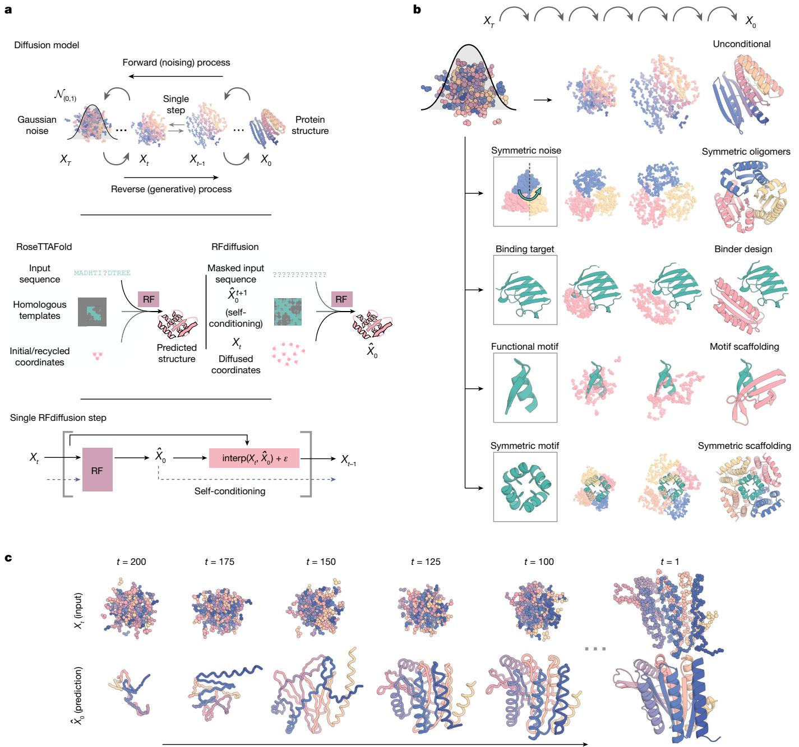  
Fig. 1 | Protein design using RFdiffusion. a, Diffusion models for proteins are trained to recover corrupted (noised) protein structures and to generate new structures by reversing the corruption process through iterative denoising of initially random noise $X _ { T }$ into a realistic structure $X _ { 0 }$ (top panel). The RF structure prediction network (middle panel, left side) is fine-tuned with minimal architectural changes into RFdiffusion (middle panel, right side); the denoising network of a DDPM is also shown. In RF, the primary input to the model is the sequence. In RFdiffusion, the primary input is diffused residue frames (coordinates and orientations). In both cases, the model predicts final 3D coordinates (denoted ${ \widehat { X } } _ { 0 }$ in RFdiffusion). The bottom panel shows that in RFdiffusion, the model receives its previous prediction as a template input (‘self-conditioning’, Supplementary Methods). At each timestep t of a trajectory (typically 200 steps), RFdiffusion takes $\widehat { X } _ { 0 } ^ { t + 1 }$ from the previous step and $X _ { t }$ and   
(Fig. 2d). RFdiffusion generation is also more compute efficient than unconstrained Hallucination with RF, and efficiency can be greatly improved by taking larger steps at inference time and by truncating trajectories early, which is possible because RF predicts the final structure at each timestep (Extended Data Fig. 2b,c). For example, a 100-residue

protein can be generated in as little as 11 s on an NVIDIA RTX A4000 Graphical Processing Unit, in contrast to RF Hallucination, which takes around $8 . 5 \mathrm { { m i n } }$ .

It is often desirable to be able to specify a protein fold during design (such as triose-phosphate isomerase (TIM) barrels or cavity-containing prediction weights as the denoiser), self-conditioning or m.s.e. losses (by training with FAPE) each notably decrease the performance of RFdiffusion. r.m.s.d. between design and AF2 is shown, for the unconditional generation of 300 amino acid proteins (Supplementary Methods). f, Two example 300 amino acid proteins that expressed as soluble monomers. Designs (grey) overlaid with AF2 predictions (colours) are shown on the left, alongside circular dichroism (CD) spectra (top) and melt curves (bottom) on the right. The designs are highly thermostable. g, RFdiffusion can condition on fold information. An example TIM barrel is shown (bottom left), conditioned on the secondary structure and block adjacency of a previously designed TIM barrel, PDB 6WVS (top left). Designs have very similar circular dichroism spectra to PDB 6WVS (top right) and are highly thermostable (bottom right). See also Extended Data Fig. 3 for further traces. Boxplots represent median $\pm$ interquartile range; tails are minimum and maximum excluding outliers $( \pm 1 . 5 \times$ interquartile range).

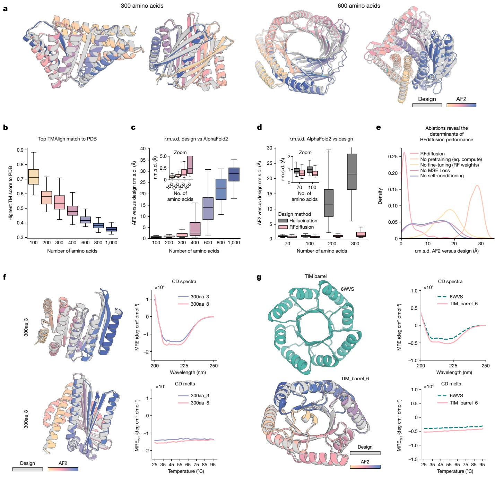  
Fig. 2 | Outstanding performance of RFdiffusion for monomer generation. a, RFdiffusion can generate new monomeric proteins of different lengths (left 300, right 600) with no conditioning information. Grey, design model; colours, AF2 prediction. r.m.s.d. AF2 versus design (Å), left to right: 0.90, 0.98, 1.15, 1.67. b, Unconditional designs from RFdiffusion are new and not present in the training set as quantified by highest TM-score to the PDB; the divergence from previously known structures increases with length. c, Unconditional samples are closely repredicted by AF2 up to about 400 amino acids. d, RFdiffusion significantly outperforms Hallucination (with RF) at unconditional monomer generation (two-proportion $z$ -test of in silico success: $n = 4 0 0$ designs per condition, $\displaystyle z = 9 . 5 , P \displaystyle = 1 . 6 \times 1 0 ^ { - 2 1 } ,$ ). Although Hallucination successfully generates designs up to 100 amino acids in length, in silico success rates rapidly deteriorate beyond this length. e, Ablating pretraining (by starting from untrained RF), RFdiffusion fine-tuning (that is, using original RF structure

NTF2s for small molecule binder and enzyme design32,33), and thus we further fine-tuned RFdiffusion to condition on secondary structure and/or fold information, enabling rapid and accurate generation of diverse designs with the desired topologies (Fig. 2g and Extended Data Fig. 4). In silico success rates were 42.5 and $5 4 . 1 \%$ for TIM barrels and NTF2 folds, respectively (Extended Data Fig. 4d), and experimental characterization of 11 TIM barrel designs indicated that at least eight designs were soluble, thermostable and had circular dichroism spectra consistent with the design model (Fig. 2g and Extended Data Fig. 4e,f).

# Design of higher-order oligomers

There is considerable interest in designing symmetric oligomers, which can serve as vaccine platforms34, delivery vehicles35 and catalysts36. Cyclic oligomers have been designed using structure prediction networks with an adaptation of Hallucination that searches for sequences predicted to fold to the desired cyclic symmetry, but this approach fails for higher-order dihedral, tetrahedral, octahedral and icosahedral symmetries, probably in part because of the much lower representation of such structures in the PDB7 .

We set out to generalize RFdiffusion to create symmetric oligomeric structures with any specified point group symmetry. Given a specification of a point group symmetry for an oligomer with n chains, and the monomer chain length, we generate random starting residue frames for a single monomer subunit as in the unconditional generation case, and then generate n − 1 copies of this starting point arranged with the specified point group symmetry. Because RFdiffusion is equivariant (inherited from RF) with respect to rotation and relabelings of chains, symmetry is largely maintained in the denoising predictions; we explicitly resymmetrize at each step but this changes the structures only slightly (compare grey and coloured chains in Extended Data Fig. 5a and Supplementary Methods). For octahedral and icosahedral architectures, we explicitly model only the smallest subset of monomers required to generate the full assembly (for example, for icosahedra, the subunits at the five-, three- and twofold symmetry axes) to reduce the computational cost and memory footprint.

Despite not being trained on symmetric inputs, RFdiffusion is able to generate symmetric oligomers with high in silico success rates (Extended Data Fig. 5b), particularly when guided by an auxiliary interand intrachain contact potential (Extended Data Fig. 5c). As illustrated in Fig. 3 and Extended Data Fig. 5e, RFdiffusion designs are nearly indistinguishable from AF2 predictions of the structures adopted by the designed sequences, and many show little resemblance to previously solved protein structures (Extended Data Fig. 5d and Supplementary Table 1). Several of the oligomeric topologies are not seen in the PDB, including two-layer beta barrels (Fig. 3a, C10 symmetry) and complex mixed alpha/beta topologies (Fig. 3a, C8 symmetry; closest TM align in PDB 6BRP, 0.47, and PDB 6BRO, 0.43, respectively).

We selected 608 designs for experimental characterization and found using size-exclusion chromatography (SEC) that at least 87 had oligomerization states closely consistent with the design models (within the $9 5 \%$ confidence interval, 126 designs within the $9 9 \%$ confidence interval, as determined by SEC calibration curves; Supplementary Figs. 4 and 5). We took advantage of the increased size of these oligomers (compared to the smaller unconditional and fold-conditioned monomers described above) and collected negative stain electron microscopy (nsEM) data on a subset of these designs across different symmetry groups. For most, distinct particles were evident with shapes resembling the design models in both the raw micrographs and subsequent two-dimensional (2D) classifications (Fig. 3 and Extended Data Fig. 5f). nsEM characterization of a C3 design (HE0822) with 350 residue subunits (1,050 residues in total) suggests that the actual structure is very close to the design, both over the 350 residue subunits and the overall C3 architecture. 2D class averages are clearly consistent with both top and side views of the design model, and a 3D reconstruction of the density has key features consistent with the design, including the distinctive pinwheel shape (Fig. 3b, top row). Electron microscopy 2D class averages of C5 and C6 designs with more than 750 residues (HE0794, HE0789, HE0841) were also consistent with the respective design models (Extended Data Fig. 5f).

RFdiffusion also generated cyclic oligomers with alpha and/or beta barrel structures that resemble expanded TIM barrels and provide an interesting comparison between innovation during natural evolution and innovation through deep learning. The TIM barrel fold, with eight strands and eight helices, is one of the most abundant folds in nature37. nsEM confirmed the structure of two RFdiffusion designed cyclic oligomers, which considerably extend beyond this fold (Fig. 3b, bottom rows). HE0626 is a C6 alpha–beta barrel composed of 18 strands and 18 helices, and HE0675 is a C8 octamer composed of an inner ring of 16 strands and an outer ring of 16 helices arranged locally in a very similar repeating pattern to the TIM barrel (1:1 helix:strand). For both HE0626 and HE0675 we obtained nsEM 3D reconstructions that are in agreement with the computational design models. The HE0600 design is also an alpha–beta barrel (Extended Data Fig. 5f), but has two strands for every helix (24 strands and 12 helices in total) and hence is locally different from a TIM barrel. Whereas natural evolution has extensively explored structural variations of the classic eight-strand or eight-helix TIM barrel fold, RFdiffusion can more readily explore global changes in barrel curvature, enabling discovery of TIM barrel-like structures with many more helices and strands.

RFdiffusion also readily generated structures with dihedral, tetrahedral and icosohedral symmetries (Fig. 3c,d and Extended Data Fig. 5e,f). SEC characterization indicated that 38 D2, seven D3 and three D4 designs had the expected molecular weights (these have four, six and eight chains, respectively) (Supplementary Fig. 5). Although the D2 dihedrals are too small for nsEM, 2D class averages—and for some, 3D reconstructions of D3 and D4 designs—were congruent with the overall topologies of the design models (Fig. 3c and Extended Data Fig. 5f). Similarly, 3D reconstruction (Fig. 3c) and cryogenic electron microscopy (cryo-EM) 2D class averages (Extended Data Fig. 5g and Supplementary Fig. 6) of the D4 HE0537 closely match the design model, recapitulating the roughly $4 5 ^ { \circ }$ offset between tetramic subunits. 2D nsEM class averages for a 12-chain tetrahedron (HE0964) were consistent with the design model (Extended Data Fig. 5f). Forty-eight icosahedra were selected for experimental validation, and one, HE0902, a $1 5 \mathsf { n m }$ (diameter) highly porous assembly (Fig. 3d, left) was observed in nsEM micrographs to form homogeneous particles. 2D class averages and a 3D reconstruction very closely match the design model (Fig. 3d), with triangular hubs arrayed around the empty C5 axes. Designs such as HE0902 (and future similar large assemblies) should be useful as new nanomaterials and vaccine scaffolds, with robust assembly and (in the case of HE0902) the outward facing N and C termini offering many possibilities for antigen display.

# Functional-motif scaffolding

We next investigated the use of RFdiffusion for scaffolding protein structural motifs that carry out binding and catalytic functions, in which the role of the scaffold is to hold the motif in precisely the 3D geometry needed for optimal function. In RFdiffusion, we input motifs as 3D coordinates (including sequence and sidechains) both during conditional training and inference, and build scaffolds that hold the motif atomic coordinates in place. Many deep-learning methods have been developed recently to address this problem, including $\mathsf { R F } _ { \mathrm { j o i n t } }$ Inpainting4 , constrained Hallucination4 and other DDPMs5,8,29. To rigorously evaluate the performance of these methods in comparison to RFdiffusion across a broad set of design challenges, we established an in silico benchmark test (Supplementary Table 9) comprising 25 motif-scaffolding design problems addressed in six recent publications encompassing several design methodologies4,5,29,38–40. The challenges span a broad range of motifs, including simple ‘inpainting’ problems, viral epitopes, receptor traps, small molecule binding sites, binding interfaces and enzyme active sites.

RFdiffusion solves 23 of the 25 benchmark problems, compared to 15 for Hallucination and 19 for $\mathsf { R F } _ { \mathrm { j o i n t } }$ Inpainting (Fig. 4a,b). For 19 out class averages with the design model fit into the density map. The overall shapes are consistent with the design models, and confirm the intended oligomeric state. As in a, AF2 predictions of each design are nearly indistinguishable from the design model (backbone r.m.s.d.s (Å) for HE0822, HE0626, HE0490, HE0675 and HE0537, are 1.33, 1.03, 0.60, 0.74 and 0.75, respectively). d, nsEM characterization of an icosahedral particle (HE0902, 100 AA per chain). The design model, including the AF2 prediction of the C3 subunit are shown on the left. nsEM data are shown on the right: on top, a representative micrograph is shown alongside 2D class averages along each symmetry axis (C3, C2 and C5, from left to right) with the corresponding 3D reconstruction map views shown directly below overlaid on the design model.

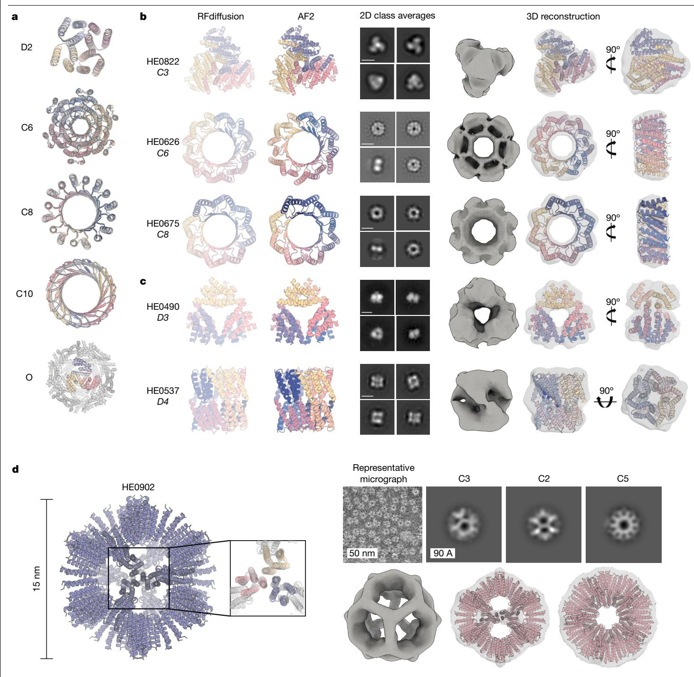  
Fig. 3 | Design and experimental characterization of symmetric oligomers. a, RFdiffusion-generated assemblies overlaid with the AF2 structure predictions based on the designed sequences; in all five cases they are nearly indistinguishable (for the octahedron (bottom), the prediction was for the C3 substructure). Symmetries are indicated to the left of the design models. b,c, Designed assemblies characterized by nsEM. Model symmetries are as follows: cyclic, C3 (HE0822, 350 amino acids (AA) per chain), C6 (HE0626, 100 AA per chain) and C8 (HE0675, 60 AA per chain) (b); dihedral, D3 (HE0490, 80 AA per chain) and D4 (HE0537, 100 AA per chain) (c). From left to right: (1) symmetric design model, (2) AF2 prediction of design following sequence design with ProteinMPNN, (3) 2D class averages showing both top and side views (scale bar, 60 Å for all class averages) and (4) 3D reconstructions from

of 23 of the problems solved by RFdiffusion, the fraction of successful designs is higher than either Hallucination or $\mathsf { R F } _ { \mathrm { j o i n t } }$ Inpainting. The excellent performance of RFdiffusion required no hyperparameter tuning or external potentials; this contrasts with Hallucination, for which problem-specific optimization can be required. In 17 out of 23 of the problems, RFdiffusion-generated successful solutions with higher in silico success rates when noise was not added during the reverse diffusion trajectories (see Extended Data Fig. 1i for further discussion on the (left) and makes extra contacts with the target (right, average $3 1 \%$ increased surface area. Design was p53_design_89). Designs were generated with an RFdiffusion model fine-tuned on complexes. d, BLI measurements indicate high-affinity binding to MDM2 (p53_design_89, $0 . 7 \mathsf { n M }$ ; p53_design_53, $\mathbf { 0 . 5 n M }$ ); the native affinity is $6 0 0 \mathsf { n M }$ (ref. 42). e, Out of 95 designs, 55 showed binding to MDM2 (more than $50 \%$ of maximum response). Thirty-two of these were monomeric (Supplementary Fig. 10h). f, After fine-tuning (Supplementary Methods), RFdiffusion can scaffold enzyme active sites. An oxidoreductase example (EC1) is shown (PDB 1A4I); catalytic site (teal); RFdiffusion output (grey, model; colours, AF2 prediction); zoom of active site. AF2 versus design backbone r.m.s.d. $0 . 8 8 \mathring { \mathsf { A } }$ , AF2 versus design motif backbone r.m.s.d. $0 . 5 3 \mathring \mathrm { A }$ , AF2 versus design motif full-atom r.m.s.d. 1.05 Å, AF2 pAE 4.47. g, In silico success rates on active sites derived from EC1-5 (AF2 Motif r.m.s.d. versus native: backbone less than 1 Å, backbone and sidechain atoms less than 1.5 Å, r.m.s.d. AF2 versus design less than 2 Å, AF2 pAE less than 5).

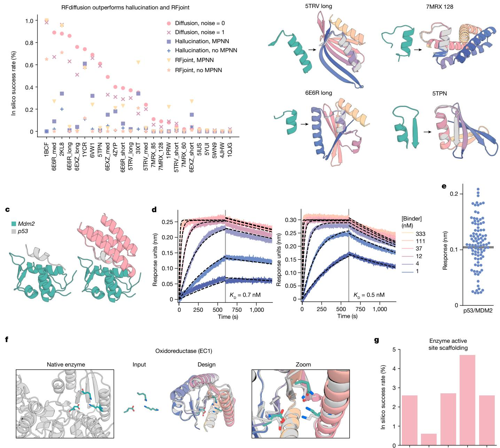  
Fig. 4 | Scaffolding of diverse functional sites with RFdiffusion. a, RFdiffusion outperforms other methods across 25 benchmark motif-scaffolding problems collected from six recent publications (Supplementary Table 9). In silico success is defined as AF2 r.m.s.d. to design model less than 2 Å, AF2 r.m.s.d. to the native functional motif less than 1 Å and AF2 pAE less than five. One hundred designs were generated per problem, with no previous optimization on the benchmark set (some optimization was necessary for Hallucination). Supplementary Table 10 presents full results. In silico success rates on the problems are correlated between the methods, and RFdiffusion can still struggle on challenging problems in which all methods have low success. b, Four examples of designs in which RFdiffusion significantly outperforms existing methods. Teal, native motif; colours, AF2 prediction of a design. Metrics (r.m.s.d. AF2 versus design/versus native motif (Å), AF2 pAE): 5TRV long, 1.17/0.57; 4.73; 6E6R long, 0.89/0.27, 4.56; 7MRX long, 0.84/0.82 4.32; 5TPN, 0.59/0.49 3.77. c, RFdiffusion can scaffold the p53 helix that binds MDM2

effect of noise on design quality, and Supplementary Fig. 8 for analysis of design diversity). The ability of RFdiffusion to scaffold functional motifs is not related to their presence in the RFdiffusion training set (Supplementary Fig. 7).

One of the benchmark problems is the scaffolding of the p53 helix that binds MDM2. Inhibiting this interaction through high-affinity competitive inhibition by scaffolding the p53 helix and making further interactions with MDM2 is a promising therapeutic avenue41. In silico

# Article

success has been described elsewhere4 , but experimental success has not been reported. We used an RFdiffusion model fine-tuned on protein complexes (Supplementary Methods) to generate 96 designs scaffolding this helix. We scaffolded the p53 helix in the presence of MDM2, so extra interactions could be designed by RFdiffusion and experimentally identified 0.5 and $0 . 7 \mathsf { n M }$ binders (Fig. 4c,d), three orders of magnitude higher affinity than the reported ${ 6 0 0 } \mathrm { n M }$ affinity of the p53 peptide alone42. The overall success rate was quite high: out of the 96 designs, 55 showed some detectable binding at $1 0 \mu \mathrm { M }$ (Fig. 4e and Supplementary Fig. 10h).

# Scaffolding enzyme active sites

A grand challenge in protein design is to scaffold minimal descriptions of enzyme active sites comprising a few single amino acids. Whereas some in silico success has been reported previously4 , a general solution that can readily produce high-quality, orthogonally validated outputs remains elusive. Following fine-tuning on a task mimicking this problem (Supplementary Methods), RFdiffusion was able to scaffold enzyme active sites comprising many sidechain and backbone functional groups with high accuracy and in silico success rates across a range of enzyme classes (Fig. 4f and Extended Data Fig. 6a–d; in silico success required fine tuning). Although RFdiffusion is unable to explicitly model bound small molecules at present (however, see our conclusions), the substrate can be implicitly modelled using an external potential to guide the generation of ‘pockets’ around the active site. As a demonstration, we scaffold a retroaldolase active site triad while implicitly modelling the reaction substrate (Extended Data Fig. 6e–h).

# Symmetric functional-motif scaffolding

Several important design challenges involve the scaffolding of several copies of a functional motif in symmetric arrangements. For example, many viral glycoproteins are trimeric and symmetry matched arrangements of inhibitory domains can be extremely potent43–46. Conversely, symmetric presentation of viral epitopes in an arrangement that mimics the virus could induce new classes of neutralizing antibodies47,48. To explore this general direction, we sought to design trimeric multivalent binders to the SARS-CoV-2 spike protein. In previous work, flexible linkage of a binder to the ACE2 binding site (on the spike protein receptor binding domain) to a trimerization domain yielded a high-affinity inhibitor that had potent and broadly neutralizing antiviral activity in animal models43. Ideally, however, symmetric fusions to binders would be rigid, so as to reduce the entropic cost of binding while maintaining the avidity benefits from multivalency. We used RFdiffusion to design C3-symmetric trimers that rigidly hold three binding domains (the functional motif in this case) such that they exactly match the ACE2 binding sites on the SARS-CoV-2 spike protein trimer. The designs were confidently predicted by AF2 to both assemble as C3-symmetric oligomers, and to scaffold the AHB2 SARS-CoV-2 binder interface with high accuracy (Fig. 5a).

The ability to scaffold functional sites with any desired symmetry opens up new approaches to designing metal-coordinating protein assemblies49,50. Divalent transition metal ions show distinct preferences for specific coordination geometries (for example, square planar, tetrahedral and octahedral) with ion-specific optimal sidechain–metal bond lengths. RFdiffusion provides a general route to building up symmetric protein assemblies around such sites, with the symmetry of the assembly matching the symmetry of the coordination geometry. As a first test, we sought to design square-planar ${ \mathsf { N i } } ^ { 2 + }$ binding sites. We designed C4 protein assemblies with four central histidine imidazoles arranged in an ideal ${ \mathsf { N i } } ^ { 2 + }$ -binding site with square-planar coordination geometry (Fig. 5b). Diverse designs starting from distinct C4-symmetric histidine square-planar sites had good in silico success with the histidine residues in near ideal geometries for coordinating metal in the AF2-predicted structures (Supplementary Fig. 9).

We expressed and purified 44 designs in Escherichia coli, and found that 37 had SEC chromatograms consistent with the intended oligomeric state (Extended Data Fig. 7b). Of the designs, 36 were tested for ${ \mathsf { N i } } ^ { 2 + }$ coordination by isothermal titration calorimetry, and 18 were found to bind $\mathsf { N i } ^ { 2 + }$ with dissociation constants ranging from low nanomolar to low micromolar (Fig. 5c,d and Extended Data Fig. 7a). The inflection points in the wild-type isotherms indicate binding with the designed stoichiometry, a one to four ratio of ion to monomer. Although most of the designed proteins showed exothermic metal coordination, in a few cases binding was endothermic (Fig. 5d, left and Extended Data Fig. 7a: NiB2.9, NiB2.10, NiB2.15 and NiB2.23), suggesting that $\mathsf { N i } ^ { 2 + }$ coordination is entropically driven in these assemblies. To confirm that $\mathsf { N i } ^ { 2 + }$ binding was indeed mediated by the scaffolded histidine 52, we mutated this residue to alanine, which abolished or notably reduced binding in 17 out of 17 cases with successful expression (Extended Data Figs. 7a,c and Fig. 5c,d; one mutant did not express). We structurally characterized by nsEM a subset of the designs—NiB1.12, NiB1.15, NiB1.17 and NiB1.20—that showed histidine-dependent binding. All four designs showed clear fourfold symmetry both in the raw micrographs and in 2D class averages (Fig. 5c,d), with design NiB1.17 also clearly showing twofold axis side views with a measured diameter approximating the design model. A 3D reconstruction of NiB1.17 was in close agreement with the design model (Fig. 5c).

# Design of protein-binding proteins

The design of high-affinity binders to target proteins is a grand challenge in protein design, with numerous therapeutic applications51. A general method for de novo binder design from target structure information alone using the physically based Rosetta method was recently described12, and subsequently, using ProteinMPNN for sequence design and AF2 for design filtering was found to improve design success rates26. However, experimental success rates were low, still requiring many thousands of designs to be screened for each design campaign12, and the approach relied on prespecifying a particular set of protein scaffolds as the basis for the designs, inherently limiting the diversity and shape complementarity of possible solutions12. To our knowledge, no deep-learning method has yet demonstrated experimental general success in designing completely de novo binders.

We reasoned that RFdiffusion might be able to address this challenge by directly generating binding proteins in the context of the target. For many therapeutic applications, for example, blocking a protein–protein interaction, it is desirable to bind to a particular site on a target protein. To enable this, we fine-tuned RFdiffusion on protein complex structures, providing a feature as input indicating a subset of the residues on the target chain (called ‘interface hotspots’) to which the diffused chain binds (Fig. 6a and Extended Data Fig. 8a,b). For design challenges in which a particular binder fold might be especially compatible, we enabled coarse-grained control over binder scaffold topology by fine-tuning an extra model to condition binder diffusion on secondary structure and block-adjacency information, in addition to conditioning on interface hotspots (Extended Data Fig. 8c,d and Supplementary Methods).

To compare RFdiffusion to previous binder design methods, we performed binder design campaigns against five targets: Influenza A H1 Haemagglutinin $( \mathsf { H A } ) ^ { 5 2 }$ , Interleukin-7 Receptor- $\mathbf { \alpha } _ { \mathbf { \alpha } } \mathbf { \alpha } _ { \mathbf { \alpha } }$ (IL-7Rα)12, Programmed Death-Ligand 1 (PD-L1)12, Insulin Receptor (InsR) and Tropomyosin Receptor Kinase A (TrkA)12. We designed putative binders to each target, both with and without conditioning on compatible fold information, with high in silico success rates (Extended Data Fig. 8e,f). Designs were filtered by AF2 confidence in the interface and monomer structure26, and 95 were selected for each target for experimental characterization.

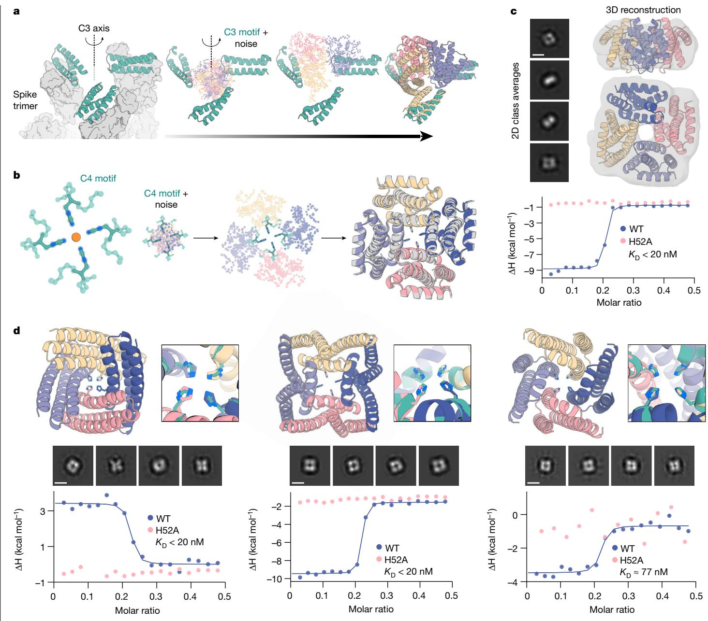  
Fig. 5 | Symmetric motif scaffolding with RFdiffusion. a, Design of symmetric oligomers scaffolding the binding interface of ACE2 mimic AHB2 (left, teal) against the SARS-CoV-2 spike trimer (left, grey). Three AHB2 copies are input to RFdiffusion along with C3 noise (middle); output are C3-symmetric oligomers holding the three AHB2 copies in place to engage all spike subunits. AF2 predictions (right) recapitulate the AHB2 structure with 0.6 Å r.m.s.d. over the assymetric unit and 2.9 Å r.m.s.d. over the C3 assembly. b, Design of C4- symmetric oligomers to scaffold a ${ \mathsf { N i } } ^ { 2 + }$ binding motif (left). Starting from square-planar histidine rotamers within helical fragments (Supplementary Methods), RFdiffusion generates a C4 oligomer scaffolding the binding domain (middle). AF2 predictions (colour) agree closely with the design model (grey), with backbone r.m.s.d. less than $1 . 0 \mathring \mathrm { A }$ (right). c, nsEM 2D class averages (scale bar, $6 0 \mathring \mathbf { A } .$ ) and 3D reconstruction density are consistent with the symmetry and   
structure of the NiB1.17 design model shown superimposed on the density in ribbon representation (top). Isothermal titration calorimetry binding isotherm of design NiB1.17 (blue) indicates a dissociation constant less than $2 0 \mathsf { n M }$ at a metal:monomer stoichiometry of 1:4. The H52A mutant isotherm (pink) ablates binding, indicating scaffolded histidine residues are critical for metal binding. d, Additional experimentally characterized $\mathsf { N i } ^ { 2 + }$ binders NiB2.15 (left), NiB1.12 (middle) and NiB1.20 (right). Metal-coordinating sidechains in the design models (top, teal) are closely recapitulated in the AF2 predictions (colours). 2D nsEM class averages (middle; scale bar, $6 0 \mathring { \mathsf { A } }$ ) are consistent with design models. Binding isotherms for wild-type (WT) and H52A mutant (bottom) indicate $\mathsf { N i } ^ { 2 + }$ binding mediated directly by the scaffolded histidines at the designed stoichiometry. Note that for ITC plots, points represent single measurements.

The designed binders were expressed in E. coli and purified, and binding was assessed through single point biolayer interferometry (BLI) screening at $1 0 \mu \mathrm { M }$ binder concentration (Extended Data Fig. $\mathbf { 8 9 } )$ ). The overall experimental success rate, defined as binding at or above $50 \%$ of the maximal response for the positive control, was $1 9 \%$ (this is a conservative estimate as some designs that showed binding had insufficient material to permit screening at $1 0 \mu \mathrm { M }$ : Extended Data

Fig. 8g); an increase of roughly two orders of magnitude over our previous Rosetta-based method on the same targets (Fig. 6b). Binders were identified for all five targets, with fewer than 100 designs tested per target compared to thousands in previous studies. Full BLI titrations for a subset of the designs showed nanomolar affinities with no further experimental optimization, including HA and IL-7Rα binders with affinities of roughly $3 0 \mathrm { n M }$ (Fig. 6c). Binding interfaces were often highly distinct from interfaces to these targets in the PDB (Supplementary Figs. 11 and 12). To assess binder specificity, six of the highest affinity IL-7Rα binders were assessed by means of competition BLI, and all six competed for binding with a structurally validated positive control binding to the same site residues; grey, design model; purple, AF2 prediction (r.m.s.d. AF2 versus design). Binders: IL7Ra_55 (2.1 Å), InsulinR_30 (2.6 Å), PDL1_77 (1.5 Å), TrkA_88 (1.4 Å) (left to right in c) and HA_20 (1.7 Å) (d). e, Cryo-EM 2D class averages of HA_20 bound to influenza HA, strain A/USA:Iowa/1943 H1N1 (scale bar, $1 0 \mathsf { n m }$ ). f, 2.9 Å cryo-EM 3D reconstruction of the complex viewed along two orthogonal axes. HA_20 (purple) is bound to H1 along the stem of all three subunits. g, The cryo-EM structure of the HA_20 binder in complex closely matches the design model (r.m.s.d. to RFdiffusion design, $0 . 6 3 \mathring \mathrm { A }$ ; yellow, influenza HA). h, Structure of the HA_20 binder alone superimposed on the design model viewed along two orthogonal axes. For cryo-EM panels, yellow, Influenza H1 map and/or structure; grey, HA_20 binder design model; purple, HA_20 binder map or structure.

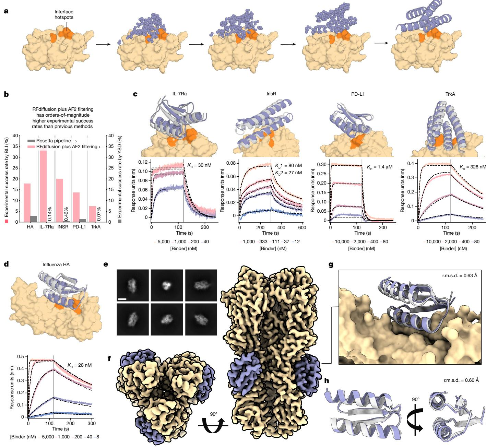  
Fig. 6 | De novo design of protein-binding proteins. a, RFdiffusion generates protein binders given a target and specification of interface hotspot residues. b, De novo binders were designed to five protein targets; Influenza A H1 HA, IL-7Rα, InsR, PD-L1 and TrkA and hits with BLI response greater than or equal to $5 0 \%$ of the positive control were identified for all targets. For IL-7Rα, InsR, PD-L1 and TrkA, RFdiffusion has success rates roughly two orders of magnitude higher than the original design campaigns. We attribute one order of magnitude to RFdiffusion, and the second to filtering with AF2 (estimated success rates for previous campaigns if AF2 filtering had been used: HA, $0 \%$ ; IL-7Rα, $2 . 2 \%$ ; InsR, $5 . 5 \%$ ; PD-L1, $3 . 7 \%$ ; TrkA, $1 . 5 \%$ ). c, For IL-7Rα, InsR, PD-L1 and TrkA, the highest affinity binder is shown above a BLI titration series. Reported $K _ { \mathrm { D } }$ values are based on global kinetic fitting with fixed global $R _ { \mathrm { m a x } }$ . d, The highest affinity HA binder, HA_20, binds with a $K _ { \mathrm { D } }$ of 28 nM. c,d, Yellow or orange, target or hotspot

(Supplementary Fig. 10a; further work is required to fully characterize proteome-wide specificity).

We solved the structure of the highest affinity Influenza binder, $H A \_ { 2 } O$ , in complex with Iowa43 HA using cryo-EM  (Extended Data Table 1). Raw electron micrographs revealed a well-folded HA glycoprotein with clearly discernible side, top and tilted view orientations suspended in a thin layer of vitreous ice (Extended Data Fig. 9a). The 2D class averages further show clear secondary structure elements corresponding to both Iowa43 HA (Extended Data Fig. 9b), as well as the HA_20 binder bound to the stem (Fig 6e). The 3D heterogenous refinement without symmetry revealed full occupancy of all three HA stem epitopes by the HA_20 binder. A final non-uniform 3D refinement reconstruction with C3 symmetry yielded a $2 . 9 \mathring \mathrm { A }$ map of the HA/HA_20 protein–protein complex (Fig 6f) and corresponding 3D structure that almost perfectly matches the computational design model $( 0 . 6 3 \mathring \mathbf { A }$ , Fig 6f,g; the sidechain interactions at the interface are very different from the closest structure in the PDB; Extended Data Fig. 9h). Over the binder alone, the experimental structure deviates from the RFdiffusion design by only $0 . 6 \mathring { \mathsf { A } }$ (Fig. 6h). These results demonstrate the ability of RFdiffusion to generate new proteins with atomic level accuracy, and to precisely target functionally relevant sites on therapeutically important proteins.

# Discussion

RFdiffusion is a comprehensive improvement over current protein design methods. RFdiffusion readily generates diverse unconditional designs up to 600 residues in length that are accurately predicted by AF2, far exceeding the complexity and accuracy achieved by most previous methods (a recent Hallucination-based approach also achieved high unconditional performance53). Half of our tested unconditional designs express in a soluble way,  and have circular dichroism spectra consistent with the design models and high thermostability. Despite their substantially increased complexity, the ideality and stability of RFdiffusion designs is akin to that of de novo protein designs generated using previous methods such as Rosetta. RFdiffusion enables generation of higher-order architectures with any desired symmetry, unlike Hallucination methods, which have so far been limited to cyclic symmetries. Electron microscopy confirmed that the structures of these oligomers are very similar to the design models, which in many cases show little global similarity to known protein oligomers.

There has been recent progress in scaffolding protein functional motifs using deep-learning methods (RF Hallucination, $\mathsf { R F } _ { \mathrm { j o i n t } }$ Inpainting and diffusion), but Hallucination is slow for large systems, Inpainting fails when insufficient starting information is provided and previous diffusion methods had low accuracy. RFdiffusion outperforms these previous methods in the complexity of the motifs that can be scaffolded, the precision with which sidechains are positioned (for catalysis and other functions), and the accuracy of motif recapitulation by AF2. The design of MDM2 binding proteins with three orders of magnitude higher affinities than the scaffolded P53 motif demonstrates the robustness of RFdiffusion motif scaffolding. Combining accurate motif scaffolding with the design of symmetric assemblies enabled consistent and atomically precise positioning of sidechains to coordinate ${ \mathsf { N i } } ^ { 2 + }$ ions across diverse tetrameric assemblies

For binder design from target structural information alone, previous work required testing tens of thousands of sequences12. RFdiffusion, when combined with improved filtering26 raises experimental success rates by two orders of magnitude; high-affinity binders can be identified from dozens of designs, in many cases eliminating the requirement for slow and expensive high-throughput screening (at least for the non-polar sites targeted here; further studies will be required to assess success rates on more polar target sites and sites without native binding partners). A high-resolution cryo-EM structure of one of these designs in complex with influenza HA shows that RFdiffusion can design functional proteins with atomic accuracy. Vázquez Torres et al. demonstrate the ability of RFdiffusion to design picomolar affinity binders to flexible helical peptides54, further highlighting its use for de novo binder design. Vázquez Torres et al. also show how RFdiffusion can be extended for protein model refinement by partial noising and denoising, which enables tuneable sampling around a given input structure. For peptide binder design, this enabled increases in affinity of nearly three orders of magnitude without high-throughput screening.

The breadth and complexity of problems solvable with RFdiffusion and the robustness and accuracy of the solutions far exceeds what has been achieved previously. In a manner reminiscent of the generation of images from text prompts, RFdiffusion makes possible, with minimal specialist knowledge, the generation of functional proteins from minimal molecular specifications (for example, high-affinity binders to a user-specified target protein, and diverse protein assemblies from user-specified symmetries).

The power and scope of RFdiffusion can be extended in several directions. RF has recently been extended to nucleic acids and protein–nucleic acid complexes55, which should enable RFdiffusion to design nucleic acid binding proteins and perhaps folded RNA structures. Extension of RF to incorporate ligands should similarly enable extension of RFdiffusion to explicitly model ligand atoms, and allow the design of protein–ligand interactions. The ability to customize RFdiffusion to specific design challenges by addition of external potentials and by fine-tuning (as illustrated here for catalytic site scaffolding, binder-targeting and fold specification), along with continued improvements to the underlying methodology, should enable de novo protein design to achieve still higher levels of complexity, to approach and, in some cases, surpass what natural evolution has achieved.

# Online content

Any methods, additional references, Nature Portfolio reporting summaries, source data, extended data, supplementary information, acknowledgements, peer review information; details of author contributions and competing interests; and statements of data and code availability are available at https://doi.org/10.1038/s41586-023-06415-8.

# Article

18. Baek, M. et al. Accurate prediction of protein structures and interactions using a three-trac neural network. Science 373, 871–876 (2021).   
19. Watson, J. L., Bera, A., Juergens, D., Wang, J. & Baker, D. X-ray crystallographic validation of design from this paper. Science 377, 387–394 (2022).   
20. Wu, R. et al. High-resolution de novo structure prediction from primary sequence. Preprint at https://doi.org/10.1101/2022.07.21.500999 (2022).   
21. Lin, Z. et al. Language models of protein sequences at the scale of evolution enable accurate structure prediction. Science 379, 1123–1130 (2023).   
22. Berman, H. M. et al. The Protein Data Bank. Nucleic Acids Res. 28, 235–242 (2000).   
23. De Bortoli, V. et al. Riemannian score-based generative modelling. in Adv. Neural Information Processing Systems Vol. 35 (eds Koyejo, S. et al.) 2406–2422 (Curran Associates, 2022).   
24. Leach, A., Schmon, S. M., Degiacomi, M. T. & Willcocks, C. G. Denoising diffusion probabilistic models on SO(3) for rotational alignment. In Proc. ICLR 2022 Workshop on Geometrical and Topological Representation Learning (2022).   
25. Chen, T., Zhang, R. & Hinton, G. Analog bits: generating discrete data using diffusion models with self-conditioning. in The Eleventh International Conference on Learning Representations (2023).   
26. Bennett, N.R. et al. Improving de novo protein binder design with deep learning. Nat. Commun. 14, 2625 (2023).   
27. Anand, N. & Huang, P. Generative modeling for protein structures. in Adv. Neural Information Processing Systems Vol. 31 (eds Bengio, S. et al.) (Curran Associates, 2018).   
28. Ingraham, J. et al. Illuminating protein space with a programmable generative model. Preprint at bioRxiv https://doi.org/10.1101/2022.12.01.518682 (2022).   
29. Lee, J. S. & Kim, P. M. ProteinSGM: Score-based generative modeling for de novo protein design. Preprint at bioRxiv https://doi.org/10.1101/2022.07.13.499967 (2022).   
30. Onuchic, J. N., Luthey-Schulten, Z. & Wolynes, P. G. Theory of protein folding: the energy landscape perspective. Annu. Rev. Phys. Chem. 48, 545–600 (1997).   
31. Jendrusch, M., Korbel, J. O. & Sadiq, S. K. AlphaDesign: a de novo protein design framework based on AlphaFold. Preprint at bioRxiv https://doi.org/10.1101/2021.10.11. 463937 (2021).   
32. Basanta, B. et al. An enumerative algorithm for de novo design of proteins with diverse pocket structures. Proc. Natl Acad. Sci. USA 117, 22135–22145 (2020).   
33. Pan, X. et al. Expanding the space of protein geometries by computational design of de novo fold families. Science 369, 1132–1136 (2020).   
34. Marcandalli, J. et al. Induction of potent neutralizing antibody responses by a designed protein nanoparticle vaccine for respiratory syncytial virus. Cell 176, 1420–1431.e17 (2019).   
35. Butterfield, G. L. et al. Evolution of a designed protein assembly encapsulating its own RNA genome. Nature 552, 415–420 (2017).   
36. Goodsell, D. S. & Olson, A. J. Structural symmetry and protein function. Annu. Rev. Biophys. Biomol. Struct. 29, 105–153 (2000).   
37. Sterner, R. & Höcker, B. Catalytic versatility, stability, and evolution of the $( \beta \mathsf { { c } } ) _ { 8 }$ -barrel enzyme fold. Chem. Rev. 105, 4038–4055 (2005).   
38. Sesterhenn, F. et al. De novo protein design enables the precise induction of RSV-neutralizing antibodies. Science 368, eaay5051 (2020).   
39. Yang, C. et al. Bottom-up de novo design of functional proteins with complex structural features. Nat. Chem. Biol. 17, 492–500 (2021).   
40. Glasgow, A. et al. Engineered ACE2 receptor traps potently neutralize SARS-CoV-2. Proc. Natl Acad. Sci. USA 117, 28046–28055 (2020).   
41. Chène, P. Inhibiting the p53-MDM2 interaction: an important target for cancer therapy. Nat. Rev. Cancer 3, 102–109 (2003).   
42. Kussie, P. H. et al. Structure of the MDM2 oncoprotein bound to the p53 tumor suppressor transactivation domain. Science 274, 948–953 (1996).   
43. Hunt, A. C. et al. Multivalent designed proteins neutralize SARS-CoV-2 variants of concern and confer protection against infection in mice. Sci. Transl. Med. 14, eabn1252 (2022).   
44. Silverman, J. et al. Multivalent avimer proteins evolved by exon shuffling of a family of human receptor domains. Nat. Biotechnol. 23, 1556–1561 (2005).   
45. Detalle, L. et al. Generation and characterization of ALX-0171, a potent novel therapeutic nanobody for the treatment of respiratory syncytial virus infection. Antimicrob. Agents Chemother. 60, 6–13 (2016).   
46. Strauch, E.-M. et al. Computational design of trimeric influenza-neutralizing proteins targeting the hemagglutinin receptor binding site. Nat. Biotechnol. 35, 667–671 (2017).   
47. Boyoglu-Barnum, S. et al. Quadrivalent influenza nanoparticle vaccines induce broad protection. Nature 592, 623–628 (2021).   
48. Walls, A. C. et al. Elicitation of potent neutralizing antibody responses by designed protein nanoparticle vaccines for SARS-CoV-2. Cell 183, 1367–1382.e17 (2020).   
49. Salgado, E. N., Lewis, R. A., Mossin, S., Rheingold, A. L. & Tezcan, F. A. Control of protein oligomerization symmetry by metal coordination: $C _ { 2 }$ and $C _ { 3 }$ symmetrical assemblies through $\mathsf { C u } ^ { \parallel }$ and NiII coordination. Inorg. Chem. 48, 2726–2728 (2009).   
50. Salgado, E. N. et al. Metal templated design of protein interfaces. Proc. Natl Acad. Sci. USA 107, 1827–1832 (2010).   
51. Quijano-Rubio, A., Ulge, U. Y., Walkey, C. D. & Silva, D.-A. The advent of de novo proteins for cancer immunotherapy. Curr. Opin. Chem. Biol. 56, 119–128 (2020).   
52. Chevalier, A. et al. Massively parallel de novo protein design for targeted therapeutics. Nature 550, 74–79 (2017).   
53. Frank, C. et al. Efficient and scalable de novo protein design using a relaxed sequence space. Preprint at bioRxiv https://doi.org/10.1101/2023.02.24.529906 (2023).   
54. Torres, S. V. et al. De novo design of high-affinity protein binders to bioactive helical peptides. Preprint at bioRxiv https://doi.org/10.1101/2022.12.10.519862 (2022).   
55. Baek, M., McHugh, R., Anishchenko, I., Baker, D. & DiMaio, F. Accurate prediction of nucleic acid and protein-nucleic acid complexes using RoseTTAFoldNA. Preprint at bioRxiv https://doi.org/10.1101/2022.09.09.507333 (2022).

Publisher’s note Springer Nature remains neutral with regard to jurisdictional claims in published maps and institutional affiliations.

Open Access This article is licensed under a Creative Commons Attribution 4.0 International License, which permits use, sharing, adaptation, distribution and reproduction in any medium or format, as long as you give appropriate credit to the original author(s) and the source, provide a link to the Creative Commons licence, and indicate if changes were made. The images or other third party material in this article are included in the article’s Creative Commons licence, unless indicated otherwise in a credit line to the material. If material is not included in the article’s Creative Commons licence and your intended use is not permitted by statutory regulation or exceeds the permitted use, you will need to obtain permission directly from the copyright holder. To view a copy of this licence, visit http://creativecommons.org/licenses/by/4.0/.

# Reporting summary

Further information on research design is available in the Nature Portfolio Reporting Summary linked to this article.

# Data availability

Design structures, AF2 models and experimental measurements are available at https://figshare.com/s/439fdd59488215753bc3. Cryo-EM maps and corresponding atomic models for the Influenza HA binder in Fig. 6d–h have been deposited in the PDB and the Electron Microscopy Data Bank under accession codes 8SK7 and EMDB-40557, respectively. Electron microscopy data collected for the HE0537 oligomer are available at EMDB-40602.

# Code availability

Code for running RFdiffusion has been released on GitHub, free for academic, personal and commercial use at https://github.com/Rosetta-Commons/RFdiffusion. It is also available as a Google Colab notebook, accessible through GitHub.

56. Yeh, A. H.-W. et al. De novo design of luciferases using deep learning. Nature 614, 774–780 (2023).   
57. Ribeiro, A. J. M. et al. Mechanism and Catalytic Site Atlas (M-CSA): a database of enzyme reaction mechanisms and active sites. Nucleic Acids Res. 46, D618–D623 (2018).   
58. Leaver-Fay, A. et al. ROSETTA3: an object-oriented software suite for the simulation and design of macromolecules. Methods Enzymol. 487, 545–574 (2011).

Acknowledgements We thank N. Anand and D. Tischer for helpful discussions, and I. Kalvet and Y. Kipnis for providing helpful Rosetta scripts. We thank A. Dosey for the provision of purified influenza HA protein. We thank R. Wu, J. Mou, K. Choi, L. Wu and D. Blei for valuable feedback during writing. We thank I. Haydon for help with graphics. We also thank L. Goldschmidt and K. VanWormer, respectively, for maintaining the computational and wet laboratory resources at the Institute for Protein Design. This work was supported by gifts from Microsoft (D.J., M.B. and D.B.), Amgen (J.L.W.), the Audacious Project at the Institute for Protein

Design (B.L.T., I.S., J.Y., H.E. and D.B.), the Washington State General Operating Fund supporting the Institute for Protein Design (P.V. and I.S.), grant no. INV-010680 from the Bill and Melinda Gates Foundation (W.B.A., D.J., J.W. and D.B.), grant no. DE-SC0018940 MOD03 from the US Department of Energy Office of Science (A.J.B. and D.B.), grant no. 5U19AG065156-02 from the National Institute for Aging (S.V.T. and D.B.), an EMBO long-term fellowship no. ALTF 139-2018 (B.I.M.W.), the Open Philanthropy Project Improving Protein Design Fund (R.J.R. and D.B.), The Donald and Jo Anne Petersen Endowment for Accelerating Advancements in Alzheimer’s Disease Research (N.R.B.), a Washington Research Foundation Fellowship (S.J.P.), a Human Frontier Science Program Cross Disciplinary Fellowship (grant no. LT000395/2020-C, L.F.M.), an EMBO Non-Stipendiary Fellowship (grant no. ALTF 1047-2019, L.F.M.), the Defense Threat Reduction Agency grant nos. HDTRA1-19-1-0003 (N.H. and D.B.) and HDTRA12210012 (F.D.), the Institute for Protein Design Breakthrough Fund (A.C. and D.B.), an EMBO Postdoctoral Fellowship (grant no. ALTF 292-2022, J.L.W.) and the Howard Hughes Medical Institute (A.C., W.S., R.J.R. and D.B.), an NSF-GRFP (J.Y.), an NSF Expeditions grant (no. 1918839, J.Y., R.B. and T.S.J.), the Machine Learning for Pharmaceutical Discovery and Synthesis consortium (J.Y., R.B. and T.S.J.), the Abdul Latif Jameel Clinic for Machine Learning in Health (J.Y., R.B. and T.S.J.), the DTRA Discovery of Medical Countermeasures Against New and Emerging threats program (J.Y., R.B. and T.S.J.), EPSRC Prosperity Partnership grant no. EP/T005386/1 (E.M.) and the DARPA Accelerated Molecular Discovery program and the Sanofi Computational Antibody Design grant (J.Y., R.B. and T.S.J.). We thank Microsoft and AWS for generous gifts of cloud computing resources.

Author contributions J.L.W., D.J., N.R.B., B.L.T., J.Y. and D.B. conceived the study. J.L.W., D.J., N.R.B., W.A., B.L.T. and J.Y. trained RFdiffusion. B.L.T. and J.Y., with assistance from V.D.B. and E.M., extended diffusion to residue orientations. H.E.E., D.J., J.L.W., N.R.B., N.H., W.S., P.V. and I.S. generated experimentally characterized designs. W.A., B.L.T., J.Y., D.J., J.L.W. and N.R.B. generated computational designs. H.E.E., A.J.B., R.J.R., L.F.M., B.I.M.W., S.J.P., N.H., A.C., S.V.T., J.L.W. and B.L.T. experimentally characterized designs. J.W., A.L. and W.S. contributed additional code. S.O. implemented RFdiffusion on Google Colab. M.B. and F.D. trained RF. D.B., T.S.J. and R.B. offered supervision throughout the project. J.L.W., D.J., B.L.T., N.R.B., J.Y., H.E. and D.B. wrote the manuscript. All authors read and contributed to the manuscript. J.L.W. and D.J. agree that the order of their respective names may be changed for personal pursuits to best suit their own interests.

Competing interests The authors declare no competing interests.

# Additional information

Supplementary information The online version contains supplementary material available at https://doi.org/10.1038/s41586-023-06415-8. Correspondence and requests for materials should be addressed to David Baker. Peer review information Nature thanks Arne Elofsson, Giulia Palermo, Alex Pritzel and the other, anonymous, reviewer(s) for their contribution to the peer review of this work. Reprints and permissions information is available at http://www.nature.com/reprints.

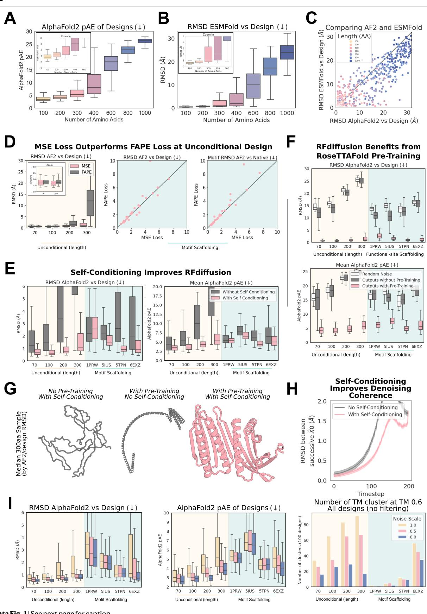

Extended Data Fig. 1 | See next page for caption.

Extended Data Fig. 1 | Training ablations reveal determinants of RFdiffusion success. A–C) RFdiffusion can generate high quality large unconditional monomers. Designs are routinely accurately recapitulated by AF2 (see also Fig. 2c), with high confidence (A) for proteins up to approximately 400 amino acids in length. B) Further orthogonal validation of designs by ESMFold. C) Recapitulation of the design structure is often better with ESMFold compared with AF2. For each backbone, the best of 8 ProteinMPNN sequences is plotted, with points therefore paired by backbone rather than sequence. D) Comparing RFdiffusion trained with MSE loss on Cα atoms and N-Cα-C backbone frames (Methods 2.5), rather than with FAPE loss8,17. The MSE loss is not invariant to the global coordinate frame, unlike FAPE loss, and is required for good performance at unconditional generation (left, two-proportion z-test of in silico success rate, $n { = } 4 0 0$ designs per condition, $z = 4 . 1 , p = 4 . 1 e { \cdot } 5 )$ . For motif scaffolding problems, where the ‘motif’ provides a means to align the global coordinate frame between timesteps, FAPE loss performs approximately as well as MSE loss, suggesting the L2 nature of MSE loss (as opposed to the L1 loss in FAPE) is not empirically critical for performance. E) Allowing the model to condition on its $\mathsf { X } _ { 0 }$ prediction at the previous timestep (see Supplementary Methods 2.4) improves designs. Designs with self-conditioning (pink) have improved recapitulation by AF2 (left) and better AF2 confidence in the prediction (right). Two-proportion z-test of in silico success rate, $\scriptstyle n = 8 0 0$ designs per condition $z = I I . 4 , p = 6 . I e { \cdot } 3 O . \mathbf { F } )$ RFdiffusion leverages the representations learned during RF pre-training. RFdiffusion fine-tuned from pre-trained RF (pink) comprehensively outperforms a model trained for an equivalent amount of time, from untrained weights (gray). For context, sequences generated by ProteinMPNN on these output backbones are little

better than sampling ProteinMPNN sequences from random Gaussian-sampled coordinates (white). Two-proportion z-test of in silico success rate, pre-training vs without pre-training (or vs random noise; both have zero success rate), $\scriptstyle n = 8 0 0$ designs per condition, $\begin{array} { r } { z = 2 3 . O , p = 3 . { I e } \cdot \mathrm { ~ } } \end{array}$ 117. Note that the data in pink in D–F is the same data, reproduced in each plot for clarity. G) The median (by AF2 r.m.s.d. vs design) 300 amino acid unconditional sample highlighting the importance of self-conditioning and pre-training. Without pre-training (at least when trained with equivalent compute), RFdiffusion outputs bear little resemblance to proteins (gray, left). Without self-conditioning, outputs show characteristic protein secondary structures, but lack core-packing and ideality (gray, middle). With pre-training and self-conditioning, proteins are diverse and well-packed (pink, right). H) Greater coherence during unconditional denoising may partly explain the effect of self-conditioning. Successive $\mathsf { X } _ { 0 }$ predictions are more similar when the model can self-condition (lower r.m.s.d. between ${ \tt X } _ { 0 }$ predictions, pink curve). Data are aggregated from unconditional design trajectories of 100, 200 and 300 residues. I) During the reverse (generation) process, the noise added at each step can be scaled (reduced). Reducing the noise scale improves the in silico design success rates (left, middle; twoproportion z-test of in silico success rate, $\scriptstyle n = 8 0 0$ designs per condition, $0 \mathbf { v } s 0 . 5 { : } z = 1 . 7 , p = 0 . 0 9 ,$ 0 vs 1: z = 6.5, p = 6.8e-11; 0.5 vs 1: $z = 4 . 8 , p = 1 . 4 e { \cdot } 6 )$ . This comes at the expense of diversity, with the number of unique clusters at a TM-score cutoff of 0.6 reduced when noise is reduced (right). Note throughout this figure the 6EXZ_long benchmarking problem is abbreviated to 6EXZ for brevity. Boxplots represent median±IQR; tails: min/max excluding outliers $( \pm 1 . 5 \times 1 0 \mathrm { R } )$ ).

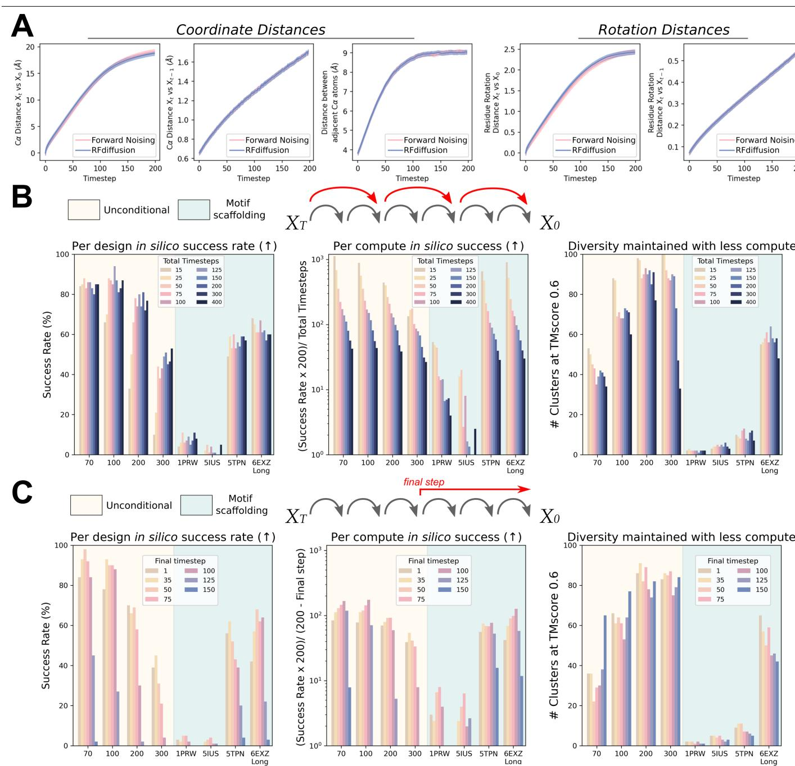  
Extended Data Fig. 2 | RFdiffusion learns the distribution of the denoising process, and inference efficiency can be improved. A) Analysis of simulated forward (noising) and reverse (denoising) trajectories shows that the distribution of Cα coordinates and residue orientations closely match, demonstrating that RFdiffusion has learned the distribution of the denoising process as desired. Left to right: i) average distance between a Cα coordinate at ${ \sf X } _ { \sf t }$ and its position in ${ \sf X } _ { 0 } .$ ; ii) average distance between a Cα coordinate at Xt and $\Chi _ { \mathrm { t } \mathrm { cdot } \mathrm { 1 } } ,$ iii) average distance between adjacent Cα coordinates at $\mathbf { X } _ { \mathrm { t } } \mathbf { ; }$ iv) average rotation distance between a residue orientation at ${ \sf X } _ { \sf t }$ and ${ \tt X } _ { 0 } ; { \tt V } ,$ ) average rotation distance between a residue orientation at Xt and ${ \tt X } _ { \mathrm { t - 1 } }$ . B-C) While RFdiffusion is trained to generate samples over 200 timesteps, in many cases, trajectories can be shortened to improve computational efficiency. B) Larger steps can be taken between timesteps at inference. Decreasing the number of timesteps speeds up inference, and often does not decrease in silico success rates (left)

(for example, on an NVIDIA A4000 GPU, 100 amino acid designs can be generated with 15 steps, in \~11s, with an in silico success rate of over $60 \%$ ). When normalized for compute budget (center) it is often much more efficient to run more trajectories with fewer timesteps. This can be done without loss of diversity in samples (right). For harder problems (e.g. unconditional 300 amino acids), one must strike an intermediate number of total timesteps (e.g., $\mathbf { T } = 5 \mathbf { 0 } ,$ ) for optimal compute efficiency. Note that for all other analyses in the paper, 200 inference steps were used, in line with how RFdiffusion is trained. C) An alternative to taking larger steps is to stop trajectories early (possible because RFdiffusion predicts $\mathsf { X } _ { 0 }$ at every timestep). In many cases, trajectories can be stopped at timestep 50–75 with little effect on the final in silico success rate of designs (left), and when normalized by compute budget (center), success rates per unit time are typically higher generating more designs with early-stopping. Again, this can be done without a significant loss in diversity (right).

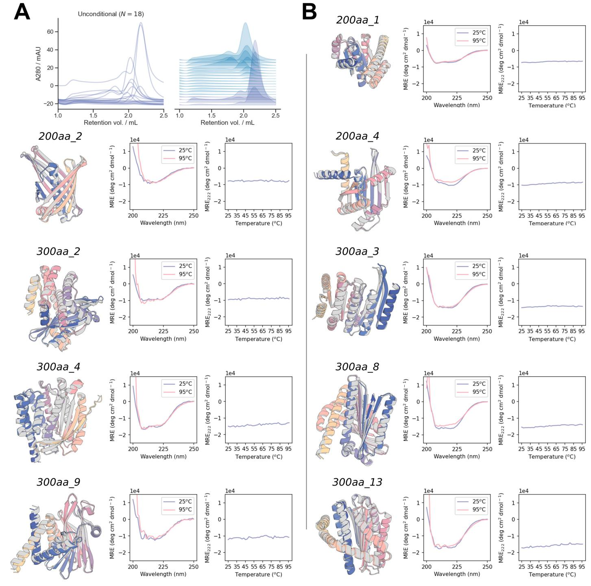  
Extended Data Fig. 3 | Unconditionally-generated designs are folded and thermostable. A) Four 200 amino acid and fourteen 300 amino acid proteins were tested for expression and stability. 9/18 designs expressed, with a major peak at the expected elution volume. Blue: 300 amino acid proteins; Purple: 200 amino acid proteins. B) Colored AF2 predictions overlaid on gray design   
models (left), circular dichroism spectra at $2 5 ^ { \circ } \mathrm { C }$ (blue) and $9 5 ^ { \circ } \mathrm { C }$ (pink) (middle) and circular dichroism melt curves (right) for all 9 designs passing expression thresholds. In all cases, proteins remain well folded even at $9 5 ^ { \circ } \mathrm { C }$ . Note that data on 300aa_3 and 300aa_8 are duplicated from Fig. 2f, reproduced here for clarity.

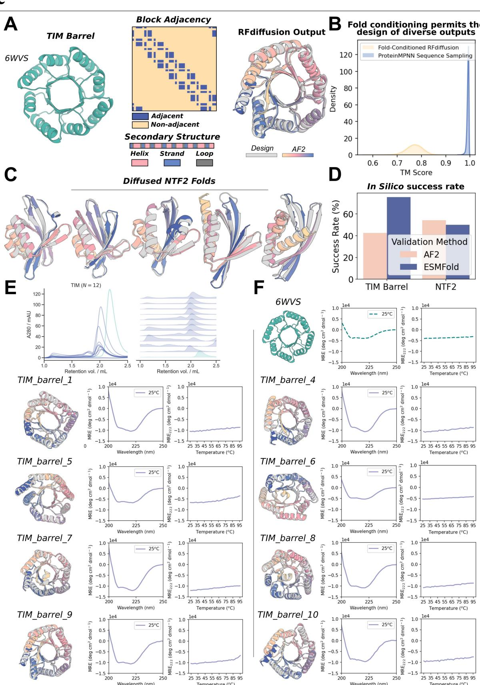

Extended Data Fig. 4 | See next page for caption.

Extended Data Fig. 4 | RFdiffusion can condition on fold information to generate specific, thermostable folds. A) 6WVS is a previously-described de novo designed TIM barrel (left). A fine-tuned RFdiffusion model can condition on 1D and 2D inputs representing this protein fold, specifically secondary structure (middle, bottom) and block-adjacency information (middle, top) (see Supplementary Methods 4.3.2). RFdiffusion then generates proteins that closely recapitulate this course-grained fold information (right). B) Outputs are diverse with respect to each other. With this coarse-grained fold specification, in silico successful designs are much more diverse (as quantified by pairwise TM-scores) compared to diversity generated through simply sampling many sequences for the original PDB backbone (6WVS). C) NTF2 folds are useful scaffolds for de novo enzyme design56, and can also be readily generated with fold-conditioning in RFdiffusion. Designs are diverse and closely recapitulated by AF2. D) In silico success rates are high with foldconditioned diffusion. TIM barrels are generated with an AF2 in silico success rate of $4 2 . 5 \%$ (left bar, pink) with in silico success incorporating both AF2

metrics and a TM-score vs 6WVS $> 0 . 5 .$ NTF2 folds are generated with an AF2 in silico success rate of $5 4 . 1 \%$ (right bar, pink), with in silico success incorporating both AF2 metrics and a TM-score vs PDB: $1 \mathsf { G Y } 6 > 0 . 5 .$ . In silico success was further validated with ESMFold (blue bars), where a pLDDT $\scriptstyle > 8 0$ was used as the confidence metric for success. Gray: RFdiffusion design, colors: AF2 prediction. E) 11 TIM barrel designs were purified alongside the 6WVS positive control. Ten of these express and elute predominantly as monomers (note that the designs are approximately 4kDa larger than 6WVS). F) Eight designs expressed sufficiently for analysis by circular dichroism. All designs are folded, with circular dichroism spectra consistent with the designed structure (middle), and similar to 6WVS. Designs were also all highly thermostable, with CD melt analyses demonstrating designs were folded even at $9 5 ^ { \circ } \mathrm { C }$ (right). Designs are shown in gray, with the AF2 predictions overlaid in colors (left). Note that data on 6WVS and TIM_barrel_6 are duplicated from Fig. 2g, reproduced here for clarity.

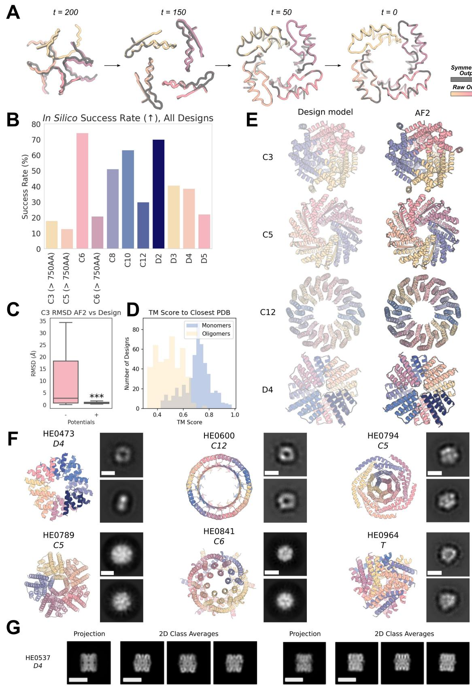

Extended Data Fig. 5 | Symmetric oligomer design with RFdiffusion. A) Due to the (near-perfect - see Supplementary Methods 3.1) equivariance properties of RFdiffusion, ${ \tt X } _ { 0 }$ predictions from symmetric inputs are also symmetric, even at very early timepoints (and becoming increasingly symmetric through time; r.m.s.d. vs symmetrized: $t = 2 O O 1 . 2 0 \mathring { \mathsf { A } } ; t = { \cal I } 5 O 0 . 4 0 \mathring { \mathsf { A } } ; t = 5 O 0 . 0 6 \mathring { \mathsf { A } } ; t = O 0 . 0 2 \mathring { \mathsf { A } } )$ . Gray: symmetrized (top left) subunit; colors: RFdiffusion X0 prediction. B) In silico success rates for symmetric oligomer designs of various cyclic and dihedral symmetries. In silico success is defined here as the proportion of designs for which AF2 yields a prediction from a single sequence that has mean pLDDT $\scriptstyle > 8 0$ and backbone r.m.s.d. over the oligomer between the design model and ${ \bf A } { \sf F } 2 < 2 { \bar { \bf A } }$ . Note that 16 sequences per RFdiffusion design were sampled. C) Box plots of the distribution of backbone r.m.s.d.s between AF2 and the RFdiffusion design model with and without the use of external potentials during the trajectory. The external potentials used are the ‘inter-chain’ contact potential (pushing chains together), as well as the ‘intra-chain’ contact potential (making chains more globular). Using these potentials dramatically improves in silico

success (Two-proportion z-test of in silico success rate: $n { = } 1 0 0$ designs per condition, $z = 4 . 3 , p = 1 . 9 e \cdot s$ 5). D) Designs are diverse with respect to the training dataset (the PDB). While the monomers (typically 60–100 AA) show reasonable alignment to the PDB (median 0.72), the whole oligomeric assemblies showed little resemblance to the PDB (median 0.50). E) Additional examples of design models (left) against AF2 predictions (right) for C3, C5, C12, and D4 symmetric designs (the symmetries not displayed in Fig. 3) with backbone r.m.s.d.s (Å) against their AF2 predictions of 0.82, 0.63, 0.79, and 0.78 with total amino acids 750, 900, 960, 640. F) Additional nsEM data for symmetric designs. The model is shown on the left and the 2D class averages on the right for each design. G) Two orthogonal side views of HE0537 by cryo-EM. Representative 2D class averages from the cryo-EM data are shown to the right of 2D projection images of the computational design model (lowpass filtered to 8 Å), which appear nearly identical to the experimental data. Scale bars shown (white) are $6 0 \mathring \mathbf { A }$ . Boxplot represents median $\pm$ IQR; tails: min/max excluding outliers (±1.5xIQR).

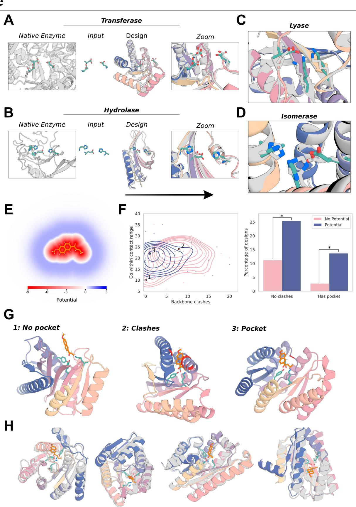

Extended Data Fig. 6 | External potentials for generating pockets around substrate molecules. A–D) Example in silico successful designs for enzyme classes 2–5 (ref. 57, see also Fig. 4). Native enzyme (PDB: 1CWY, 1DE3, 1P1X, 1SNZ); catalytic site (teal); RFdiffusion output (gray: model, colors: AF2 prediction). Metrics (AF2 vs design backbone r.m.s.d., AF2 vs design motif backbone r.m.s.d., AF2 vs design motif full-atom r.m.s.d., AF2 pAE): EC2: 0.93 Å, 0.50 Å, 1.29 Å, 3.51; EC3: 0.92 Å, 0.60 Å, 1.07 Å, 4.59; EC4: 0.93 Å, 0.80 Å, 1.03 Å, 4.41; EC5: 0.78 Å, 0.44 Å, 1.14 Å, 3.32. E–H) Implicit modeling of a substrate while scaffolding a retroaldolase active site triad [TYR1051-LYS1083-TYR1180] from PDB: 5AN7. E) The potential used to implicitly model the substrate, which has both a repulsive and attractive field (see Supplementary Methods 4.4). F) Left: Kernel densities demonstrate that without using the external potential (pink), designs often fall into two failure modes: (1) no pocket, and (2) clashes with the substrate. Right: clashes (substrate $< 3 \mathring \mathbf { A }$ of the backbone) & pockets (no clash and ${ \tt > } 1 6 \mathsf { C } \alpha$ within 3–8 Å of substrate) with and without the potential. Twoproportion z-test: $n = 7 1 / 5 1 + / -$ − potential; clashes $z = - 2 . O 5 , p = O . O 2$ , pocket

$z = - 2 . 2 7 , p = 0 . 0 1$ . Each datapoint represents a design already passing the stringent in silico success metrics (AF2 motif r.m.s.d. $< 1 \mathring \mathbf { A }$ , AF2 backbone r.m.s.d. $< 2 \mathring { \mathbf { A } }$ , $\mathbf { A F } 2 \mathbf { p A E } < 5$ ). Note that the potential and clash definition pertain only to backbone Cα atoms, and do not currently include sidechain atoms. G) Designs close to the labeled local maxima of the kernel density estimate. Without the potential, the catalytic triad is predominantly (1) exposed on the surface with no residues available to provide substrate stabilization or (2) buried in the protein core, preventing substrate access. With the potential, the catalytic triad is predominantly (3), partially buried in a concave pocket with shape complementary to the substrate. Backbone atoms within 3 Å of the substrate are shown in red. H) A variety of diverse designs with pockets made using the potential, with no clashes between the substrate and the AF2- predicted backbone. The functional form and parameters used for the pocket potential are detailed in Supplementary Methods 4.4. In each case the substrate is superimposed on the AF2 prediction of the catalytic triad.

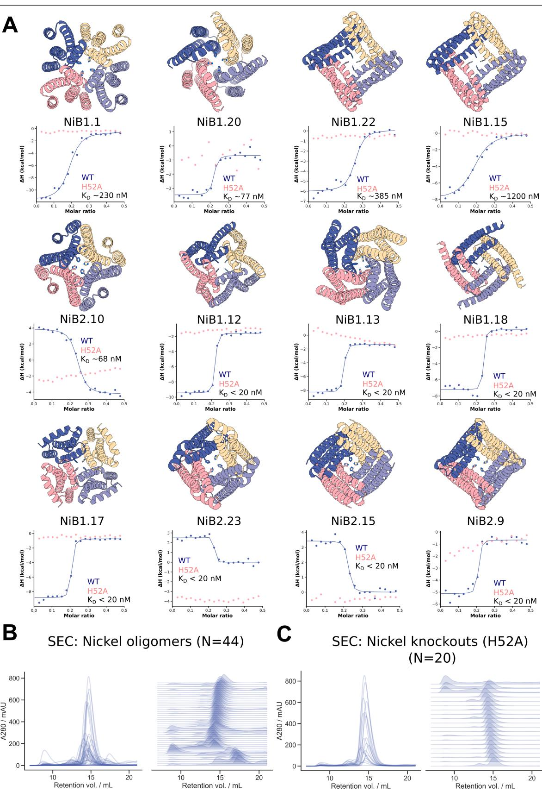

Extended Data Fig. 7 | See next page for caption.

Extended Data Fig. 7 | Additional Ni2+ binding C4 oligomers. A) AF2 predictions of a subset of the experimentally verified $\mathsf { N i } ^ { 2 + }$ binding oligomers, with corresponding isothermal titration calorimetry (ITC) binding isotherms for the wild-type (blue) and H52A mutant (pink) below. Note that these, with Fig. 5, encompass all of the experimentally validated outputs deriving from unique RFdiffusion backbones. Wild-type dissociation constants are displayed in each plot. We observe a mixture of endothermic (NiB2.10, NiB2.23, NiB2.15) and exothermic isotherms. For all cases displayed we observe no binding to the ion for H52A mutants, indicating the scaffolded histidine at position 52 is critical for ion binding. $\mathsf { K } _ { \mathtt { D } }$ values in the isotherms indicate binding of the ion

with the designed stoichiometry $( { \bf 1 } ; { \bf 4 } { \bf N i } ^ { 2 + }$ :protein). Note that each backbone depicted is from a unique RFdiffusion sampling trajectory, and that models and data for designs NiB2.15, NiB1.12, NiB1.20 and NiB1.17 from Fig. 5 are duplicated here for ease of viewing. B) Size exclusion chromatograms for elutions from the 44 purifications suggest the vast majority of designs are soluble and have the correct oligomeric state. C) Size exclusion chromatograms for 20 H52A mutants show that the mutants remain soluble and retain the intended oligomeric state. Note that only 18 of these 20 had wild-type sequences that definitively bound nickel. Note also that for ITC plots, points represent single measurements.

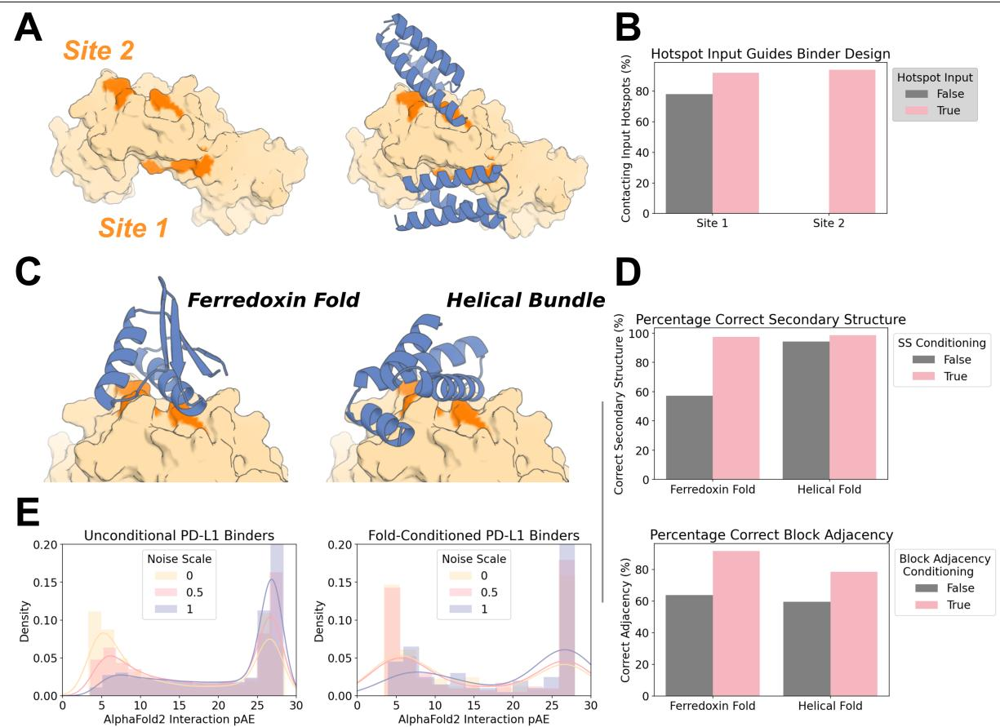

# F

# In Silico Success Rate $( \% )$ [raw/ $^ +$ FastRelax]

<table><tr><td></td><td>Noise Scale</td><td>PD-L1</td><td> IL7 Receptor α</td><td>Insulin Receptor</td><td>TrkA Receptor</td><td> Hemagglutinin</td></tr><tr><td rowspan="3">Unconditional</td><td>0.0</td><td>39.3/47.6</td><td>9.1/18.8</td><td>17.9/17.9</td><td>14.7/12.1</td><td>4.2/3.9</td></tr><tr><td>0.5</td><td>25.4/29.9</td><td>6.6/9.9</td><td>7.1/6.7</td><td>6.5/6.0</td><td>0.6/1.0</td></tr><tr><td>1.0</td><td>10.7/14.4</td><td>2.1/4.4</td><td>2.8/3.2</td><td>1.5/1.6</td><td>0.1/0.1</td></tr><tr><td rowspan="3">Fold-Conditioned</td><td>0.0</td><td>44.0/46.0</td><td>11.7/21.9</td><td>10.6/10.8</td><td>29.2/24.2</td><td>14.6/13.9</td></tr><tr><td>0.5</td><td>37.0/49.0</td><td>11.9/15.0</td><td>3.7/3.7</td><td>16.3/15.2</td><td>3.2/4.7</td></tr><tr><td>1.0</td><td>22.0/26.0</td><td>5.3/10.7</td><td>2.5/3.0</td><td>6.6/7.2</td><td>0.2/2.3</td></tr></table>

G

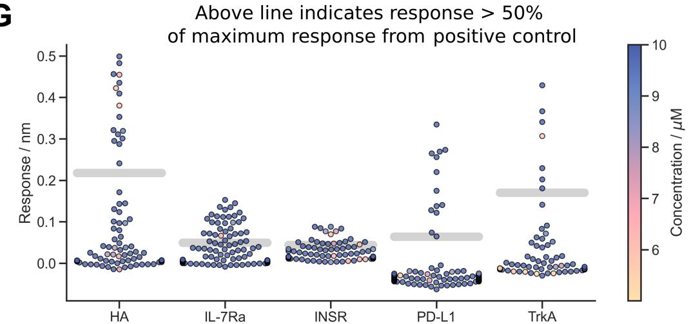

Extended Data Fig. 8 | See next page for caption.

Extended Data Fig. 8 | Targeted unconditional and fold-conditioned protein binder design. A-B) The ability to specify where on a target a designed binder should bind is crucial. Specific “hotspot” residues can be input to a fine-tuned RFdiffusion model, and with these inputs, binders almost universally target the correct site. A) IL-7Rα (PDB: 3DI3) has two patches that are optimal for binding, denoted Site 1 and Site 2 here. For each site, 100 designs were generated (without fold-specification). B) Without guidance, designs typically target Site 1 (left bar, gray), with contact defined as Cα-Cα distance between binder and hotspot reside $< 1 0 \mathring \mathbf { A }$ . Specifying Site 1 hotspot residues increases further the efficiency with which Site 1 is targeted (left bar, pink). In contrast, specifying the Site 2 hotspot residues can completely redirect RFdiffusion, allowing it to efficiently target this site (right bar, pink). C-D) As well as conditioning on hotspot residue information, a fine-tuned RFdiffusion model can also condition on input fold information (secondary structure and block-adjacency information - see Supplementary Methods 4.5). This effectively allows the specification of a (for instance, particularly compatible) fold that the binder should adopt. C) Two examples showing binders can be specified to adopt either a ferredoxin fold (left) or a particular helical bundle fold (right). D) Quantification of the efficiency of fold-conditioning. Secondary structure inputs were accurately respected (top, pink). Note that in this design target and target site, RFdiffusion without fold-specification made generally helical designs (right, gray bar). Block-adjacency inputs were also respected for both input folds (bottom, pink). E) Reducing the noise added at each step of inference improves the quality of binders designed with RFdiffusion, both with and without fold-conditioning. As an example, the distribution of AF2 interaction pAEs (known to indicate binding when pAE $< 1 0 ^ { 2 6 }$ ) is shown for binders designed to PD-L1. In both cases, the proportion of designs with interaction pAE $< 1 0$ is high (blue curve), and improved when the noise is scaled by a factor 0.5 (pink curve) or 0 (yellow curve). F) Full in silico success rates for the protein binders designed to five targets. In each case, the best foldconditioned results are shown (i.e. from the most target-compatible input fold), and the success rates at each noise scale are separated. In line with current best practice26, we tested using Rosetta FastRelax58 before designing the sequence with ProteinMPNN, but found that this did not systematically improve designs. In silico success is defined in line with current best practice26: AF2 pLDDT of the monomer $> 8 0$ , AF2 interaction pAE $< 1 0$ , AF2 r.m.s.d. monomer vs design $< 1 \mathring \mathbf { A }$ . G) Experimentally-validated de novo protein binders were identified for all five of the targets. Designs that bound at $1 0 \mu \mathrm { M }$ during single point BLI screening with a response equal to or greater than $5 0 \%$ of the positive control were considered binders. Concentration is denoted by hue for designs that were screened at concentrations less than $1 0 \mu \mathrm { M }$ and thus may be false negatives.

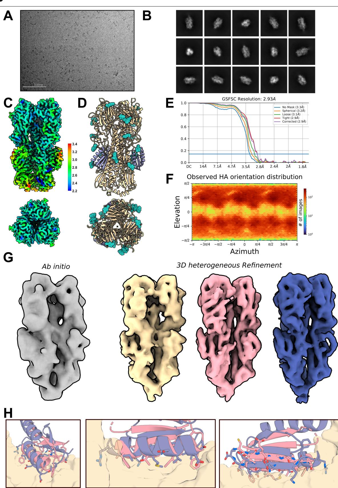

Extended Data Fig. 9 | See next page for caption.

Extended Data Fig. 9 | Cryo-electron microscopy structure determination of designed Influenza HA binder. A) Representative raw micrograph showing ideal particle distribution and contrast. B) 2D Class averages of Influenza H1+HA_20 binder with clearly defined secondary structure elements and a fullsampling of particle view angles (scale bar $\mathbf { \omega } = \mathbf { 1 0 n m }$ ). C) Cryo-EM local resolution map calculated using an FSC value of 0.143 viewed along two different angles. Local resolution estimates range from ${ \bf - } 2 . 3 \mathring \mathrm { A }$ at the core of H1 to ${ \bf - } 3 . 4 \mathring { \bf A }$ along the periphery of the N-terminal helix of the HA_20 binder. D) Cryo-EM structure of the full H1+HA_20 binder complex (purple: HA_20; yellow: H1; teal: glycans). E) Global resolution estimation plot. F) Orientational distribution plot demonstrating complete angular sampling. G) 3D ab initio (left) and 3D heterogenous refinement (right - unsharpened) outputs, performed in the absence of applied symmetry, and showing clear density of the HA_20 binder bound to all three stem epitopes of the Iowa43 HA glycoprotein trimer, in all maps. H) The designed binder has topological similarity to 5VLI, a protein in the PDB, but binds with very different interface contacts.

Extended Data Table 1 | Cryo-EM data collection, refinement and validation statistics   

<table><tr><td colspan="3"></td></tr><tr><td></td><td>HE0537 (EMDB-40602)</td><td>H1+HA_20 (EMDB-40557) (PDB 8SK7)</td></tr><tr><td>Data collection and processing</td><td></td><td></td></tr><tr><td>Magnification</td><td>36,000</td><td>105000</td></tr><tr><td>Voltage (kV)</td><td>200</td><td>300</td></tr><tr><td>Electron exposure (e-/A2)</td><td>65</td><td>64.273</td></tr><tr><td>Defocus range (μm)</td><td>-0.8: -2</td><td>0.7-1.8</td></tr><tr><td>Pixel size (A)</td><td>0.883</td><td>0.84</td></tr><tr><td>Symmetry imposed</td><td>D4</td><td>C3</td></tr><tr><td>Initial particle images (no.)</td><td>184,703</td><td>2,396,954</td></tr><tr><td>Final particle images (no.)</td><td>36,827</td><td>308,846</td></tr><tr><td>Map resolution (A)</td><td>6.06</td><td>2.93</td></tr><tr><td>FSC threshold Map resolution range (A)</td><td>5.8-8.47</td><td>2.2-3.4</td></tr><tr><td></td><td></td><td></td></tr><tr><td>Refinement Initial model used (PDB code)</td><td></td><td>3LZG</td></tr><tr><td>Model resolution (A)</td><td></td><td>119.6</td></tr><tr><td>FSC threshold</td><td></td><td></td></tr><tr><td>Validation</td><td></td><td></td></tr><tr><td>MolProbity score</td><td></td><td>0.92</td></tr><tr><td>Clashscore</td><td></td><td>1.67</td></tr><tr><td>Poor rotamers (%)</td><td></td><td>6</td></tr><tr><td>Ramachandran plot</td><td></td><td></td></tr><tr><td>Favored (%)</td><td></td><td>98.72</td></tr><tr><td>Allowed (%)</td><td></td><td></td></tr><tr><td></td><td></td><td>1.28</td></tr><tr><td>Disallowed (%)</td><td></td><td>0.00</td></tr></table>

# nature portfolio

# Reporting Summary

Nature Portfolio wishes to improve the reproducibility of the work that we publish. This form provides structure for consistency and transparency in reporting. For further information on Nature Portfolio policies, see our Editorial Policies and the Editorial Policy Checklist.

# Statistics

For all statistical analyses, confirm that the following items are present in the figure legend, table legend, main text, or Methods section.

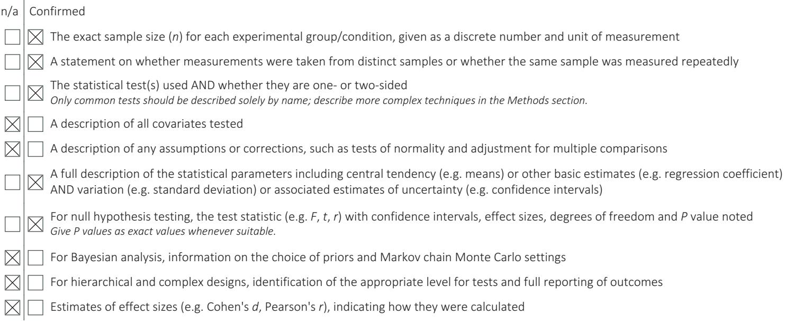

Our web collection on statistics for biologists contains articles on many of the points above.

# Software and code

Policy information about availability of computer code

Data collection

RFdiffusion 1.0.0 (this study), ProteinMPNN, AlphaFold2, TMalign, Protein-Protein BLAST $2 . 1 1 . 0 +$ , SerialEM

Data analysis

Matplotlib 3.6.2, ScIPy 1.9.3, Seaborn 0.11.2, PyMOL 2.5.0, ForteBio Data Analysis Software Version 9.0.0.14, pycorn 0.19, CryoSparc v4.0.3, Microcal PEAQ-ITC Analysis Software

For manuscripts utilizing custom algorithms or software that are central to the research but not yet described in published literature, software must be made available to editors and reviewers. We strongly encourage code deposition in a community repository (e.g. GitHub). See the Nature Portfolio guidelines for submitting code & software for further information.

# Data

Policy information about availability of data

All manuscripts must include a data availability statement. This statement should provide the following information, where applicable:

- Accession codes, unique identifiers, or web links for publicly available datasets - A description of any restrictions on data availability - For clinical datasets or third party data, please ensure that the statement adheres to our policy

# Research involving human participants, their data, or biological material

Policy information about studies with human participants or human data. See also policy information about sex, gender (identity/presentation), and sexual orientation and race, ethnicity and racism.

<table><tr><td> Reporting on sex and gender</td><td>N/A</td></tr><tr><td>Reporting on race,ethnicity,or other socially relevant groupings</td><td>N/A</td></tr><tr><td>Population characteristics</td><td>N/A</td></tr><tr><td>Recruitment</td><td>N/A</td></tr><tr><td>Ethics oversight</td><td>N/A</td></tr></table>

Note that full information on the approval of the study protocol must also be provided in the manuscript.

# Field-specific reporting

Please select the one below that is the best fit for your research. If you are not sure, read the appropriate sections before making your selection.

Life sciences

Behavioural & social sciences

Ecological, evolutionary & environmental sciences

For a reference copy of the document with all sections, see nature.com/documents/nr-reporting-summary-flat.pdf

# Life sciences study design

All studies must disclose on these points even when the disclosure is negative.

<table><tr><td>Sample size</td><td>Variabledependingonanalysisperformed.Detailedifigurelegends.Samplesizeswerechosenpriortotheexperiment,ndweredecided arbitrarlybyteexperimenterathrtanbytatistcatest)utwereleeoughtodawmeanngfuloclusiosfrotept</td></tr><tr><td>Data exclusions</td><td>None</td></tr><tr><td>Replication</td><td>Each dataset contains many (n reported in figure legends) independent measurements.</td></tr><tr><td>Randomization</td><td>N/A (all analysis was automated,soeach datapoint was generated computationallyundercontrolledanduniformsetings)</td></tr><tr><td>Blinding</td><td>N/A (allanalysis was automated,so there was no userintervention that could have introduced bias)</td></tr></table>

# Behavioural & social sciences study design

All studies must disclose on these points even when the disclosure is negative.

<table><tr><td>Study description</td><td>Breflyescriethytypedighethtreuatitatieaitatieiedmethdsuaitatiecrotial quantitative experimental,mixed-methods casestudy).</td></tr><tr><td>Research sample</td><td>Statetheresearchsample (e.g.Harvarduniversityundergraduates,vilagersinruralIndia)andproviderelevantdemographic information(e.g.age,sex)andindicatewhetherthesampleisrepresentative.rovidearationdleforthestudysamplechosen.For</td></tr><tr><td>Sampling strategy</td><td>studies involving existing datasets,please describe the dataset and source. Describethemplinrocedure(edomobalrifdeene).ibetatisticlthdstatedto predeterminesamplesizeORifnosample-sizecalculationwasperformed,describehowsamplesizeswerechosenandprovidea</td></tr><tr><td></td><td>rationaleforythesesampleszesaresuffcient.Frquittivedatapleseindicatewheterdatasaturationwasconsideednd what criteria were used to decide that no further sampling was needed. Providedetailsaboutthedatacolectionprocedure,includingtheinstrumentsordevicesusedtorecordthedata(e.g.penandpape</td></tr><tr><td></td><td>computer,eyetrackerideoorudiipment)whetheranyonewaspresetbsidestheparticipant(s)ndtheesearcernd whetherthe researcherwas blind to experimentalcondition and/orthe study hypothesis during data collction.</td></tr><tr><td>Timing</td><td>Indicatethestartandstopdatesofdatacolection.Ifthereisagapbetweencolectionperiods,statethedatesforeachsample cohort.</td></tr><tr><td>Data exclusions</td><td>Ifnodatawereexcludedfromtheanalyses,statesoORifdatawereexcluded,providetheexactumberofexclusionsandthe rationale behind them,indicating whether exclusion criteria were pre-established.</td></tr><tr><td>Non-participation</td><td>Statehowmanyparticipantsdroppedout/declinedparticipationandthereason(s)givenORprovideresponserateORstatethatno participants dropped out/declined participation.</td></tr><tr><td>Randomization</td><td>Ifparticipantswerenotallcatedintexperimentalgroups,statesoORdescribeowparticipantswerealocatedtogroupsandif allocation was not random,describe how covariates were controlled.</td></tr></table>

# Ecological, evolutionary & environmental sciences study design

ll studies must disclose on these points even when the disclosure is negative.

<table><tr><td>Study description</td><td>BrieflydescrbettudyFrantitatieatcludetreatmentctorsditeractiossiructure(efctoalsted hierarchical),nature and number of experimental units and replicates.</td></tr><tr><td>Research sample</td><td>Describetheresearchsample(e.g.agroupoftaggedPasserdomesticusallStenocereusthurberiwithinOrganPipeCactusNational Monument)ndproideratioalefothesamplecoice.Weneevant,describetheorgaismtaaource,exgeged anymanipulations.Statewhatpopulationthesampleismeantorepresentwhenaplicable.Forstudiesinvolvingexistingdatasets,</td></tr><tr><td>Sampling strategy</td><td>describe the data and its source. Notethesamplingprocedure.Describethestatisticalmethodsthatwereused topredeterminesamplesizeORifnosample-size calculationwasperformeddescribeowsamplesizeswerechosenandproviderationaleforwhythesesamplesizesaresufficent</td></tr><tr><td>Data collection</td><td>Describe the data collection procedure,including who recorded the data and how.</td></tr><tr><td>Timing and spatial scale</td><td>Indicatethestartandstopdatesofdatacolection,notingthefrequencyandperiodicityofsamplingandprovidingaratioalefor thesechoices.Ifthereisgapbetweencolectionperiods,statethedatesforeachsamplecohort.Specifythespatialscalefromwhich the data are taken</td></tr><tr><td>Data exclusions</td><td>IfnodatawereexcdedfromthenalysesstatesORifatawereexludeddescribtheeclusiosandtheatioalebedthem indicating whether exclusion criteria were pre-established.</td></tr><tr><td>Reproducibility</td><td>Describethemeasurestakentoverifythereproducibilityofexperimentalfindings.Foreachexperiment,notewhetheranyatemptsto repeat the experiment failed OR state that allattempts to repeat the experiment were successful.</td></tr><tr><td>Randomization</td><td>Describehowsamples/rganisms/partipants weredlocatedintogroups.Ifalocationwasnotrandom,describehowcovariateswere controlled.If this is not relevant to your study, explain why.</td></tr><tr><td>Blinding</td><td>Describetheextentofblindingusedduringdataacqusitionandanalysis.Ifblinding wasnotpossible,describewhyORexplainwhy blinding was not relevant to your study.</td></tr></table>

Did the study involve field work?

# Field work, collection and transport

<table><tr><td>Field conditions</td><td>Describe the study conditions for field work,providing relevant parameters (e.g.temperature,rainfal).</td></tr><tr><td>Location</td><td>Statethelocationofthesamplingorexperiment,providingrelevantparameters(e.g.latitudeandlongitude,elevation,wateepth).</td></tr><tr><td>Access &amp; import/export</td><td>Describetheeffrtsyouhave madetoaccesshabitatsand tocolletandimport/exportyoursamplesinaresponsiblemannerandin complianceithlocltioldnteratilastingyperitsttweretaediethaeofthsngtity the date of issue,and any identifying information).</td></tr><tr><td>Disturbance</td><td>Describe any disturbance caused by the study and how it was minimized.</td></tr></table>

# Reporting for specific materials, systems and methods

# Methods

n/a Involved in the study Antibodies Eukaryotic cell lines Palaeontology and archaeology Animals and other organisms Clinical data Dual use research of concern Plants

n/a Involved in the study ChIP-seq Flow cytometry MRI-based neuroimaging

# Antibodies

Describe all antibodies used in the study; as applicable, provide supplier name, catalog number, clone name, and lot number.

Describe the validation of each primary antibody for the species and application, noting any validation statements on the manufacturer’s website, relevant citations, antibody profiles in online databases, or data provided in the manuscript.

# Eukaryotic cell lines

Policy information about cell lines and Sex and Gender in Research

<table><tr><td>Cell line source(s)</td><td>Statethesourceofeachcellineusedandthesexofallprimarycellinesandcellsderivedfromhumanparticipantsor vertebratemodels.</td></tr><tr><td>Authentication</td><td>Describe theauthenticationproceduresforeachcellineusedORdeclarethatnoneofthecellinesusedwereauthenticated.</td></tr><tr><td>Mycoplasma contamination</td><td>Confirm thatallcellines tested negativefor mycoplasmacontamination ORdescribe theresultsofthe testingfor mycoplasma contamination OR declare that the cellines were not tested for mycoplasma contamination.</td></tr><tr><td>Commonly misidentified lines (See ICLAC register)</td><td>Name any commonly misidentified cellines used in the study and provide arationale for their use.</td></tr></table>

# Palaeontology and Archaeology

# Specimen provenance

Provide provenance information for specimens and describe permits that were obtained for the work (including the name of the issuing authority, the date of issue, and any identifying information). Permits should encompass collection and, where applicable, export.

Indicate where the specimens have been deposited to permit free access by other researchers.

Dating methods

If new dates are provided, describe how they were obtained (e.g. collection, storage, sample pretreatment and measurement), where they were obtained (i.e. lab name), the calibration program and the protocol for quality assurance OR state that no new dates are provided.

Tick this box to confirm that the raw and calibrated dates are available in the paper or in Supplementary Information.

Ethics oversight

Identify the organization(s) that approved or provided guidance on the study protocol, OR state that no ethical approval or guidance was required and explain why not.

Note that full information on the approval of the study protocol must also be provided in the manuscrip

# Animals and other research organisms

Policy information about studies involving animals; ARRIVE guidelines recommended for reporting animal research, and Sex and Gender in Research

# Laboratory animals

For laboratory animals, report species, strain and age OR state that the study did not involve laboratory animals.

Wild animals

Provide details on animals observed in or captured in the field; report species and age where possible. Describe how animals were caught and transported and what happened to captive animals after the study (if killed, explain why and describe method; if released, say where and when) OR state that the study did not involve wild animals.

Indicate if findings apply to only one sex; describe whether sex was considered in study design, methods used for assigning sex. Provide data disaggregated for sex where this information has been collected in the source data as appropriate; provide overall

<table><tr><td></td><td>numbersinthisReportingSummary.Pleasestateifthisinformationhasnotbeencolected.Reportsex-basedanalyseswhere performed,justify reasons for lack of sex-based analysis.</td></tr><tr><td>Field-collected samples</td><td>Forlaboratoryworkwithfield-collctedsamples，describeallrelevantparameterssuchashousing,maintenance,temperature photoperiodandend-of-experimentprotocol ORstate thatthestudydidnotinvolve samplescolectedfromthefield.</td></tr><tr><td>Ethics oversight</td><td>Identifytheorganzation(s)tatapprovedorprovidedgudanceonthstudyprotoolORstatethatnoethicalapprovaloudance</td></tr><tr><td></td><td>was required and explain why not.</td></tr></table>

Note that full information on the approval of the study protocol must also be provided in the manuscrip

# Clinical data

Policy information about clinical studies

All manuscripts should comply with the ICMJE guidelines for publication of clinical research and a completed CONSORT checklist must be included with all submissions.

<table><tr><td>Clinical trial registration</td><td>Provide the trial registration number from ClinicalTrials.gov or an equivalentagency.</td></tr><tr><td>Study protocol</td><td>Note where the fulltial protocol can be accessed OR if not available,explain why.</td></tr><tr><td>Data collection</td><td>Describe the setings and locales ofdata collection,noting the time periods ofrecruitment and datacollection.</td></tr><tr><td>Outcomes</td><td>Describe how you pre-defined primary and secondary outcome measures and how you assessed these measures.</td></tr></table>

# Dual use research of concern

Policy information about dual use research of concern

# Hazards

Could the accidental, deliberate or reckless misuse of agents or technologies generated in the work, or the application of information presented in the manuscript, pose a threat to:

No Yes Public health National security Crops and/or livestock Ecosystems Any other significant area

# Experiments of concern

Does the work involve any of these experiments of concern:

No Yes Demonstrate how to render a vaccine ineffective Confer resistance to therapeutically useful antibiotics or antiviral agents Enhance the virulence of a pathogen or render a nonpathogen virulent Increase transmissibility of a pathogen Alter the host range of a pathogen Enable evasion of diagnostic/detection modalities Enable the weaponization of a biological agent or toxin Any other potentially harmful combination of experiments and agents

# Plants

<table><tr><td>Seed stocks</td><td>Reportonthesourceoflseedstocksorotherplantmaterialused.Ifapplicable,statetheseedstockcentreandcatalogueumber.If plant specimens werecolectedfromthefield,describethecollectionlocation,dateandsampling procedures.</td></tr><tr><td>Novel plant genotypes</td><td>Describethemethodsbywhichallnovelplantgenotypeswereproduced.Thisincludesthose generatedbytransgenicapproaches, geneeditingemicaldiatiobedmutageneisdbdtio.Fortransgeniclnesdescibethraformatiodte numberofindependentlinesanalyzedandthegenerationuponwhichexperimentswereperformed.Forgene-editedlines,describe theeditorused,thedogenoussequencetargetedforediting,thetargetingguideRAsequence(ifapplicable)andowtheeditor</td></tr></table>

was applied.

Describe any authentication procedures for each seed stock used or novel genotype generated. Describe any experiments used to assess the effect of a mutation and, where applicable, how potential secondary effects (e.g. second site T-DNA insertions, mosiacism, off-target gene editing) were examined.

# ChIP-seq

# Data deposition

Confirm that both raw and final processed data have been deposited in a public database such as GEO.

Confirm that you have deposited or provided access to graph files (e.g. BED files) for the called peaks.

Data access links May remain private before publication.

For "Initial submission" or "Revised version" documents, provide reviewer access links. For your "Final submission" document, provide a link to the deposited data.

Files in database submission

Genome browser session (e.g. UCSC)

Provide a list of all files available in the database submission.

# Methodology

<table><tr><td>Replicates</td><td>Describe the experimental replicates,specifying number,type and replicate agreement.</td></tr><tr><td>Sequencing depth</td><td>Describethesequencingdepthforeachexperiment,providingthetotalnumberofreads,uniquelymappedreads,lengthofreadsand whether they were paired-or single-end.</td></tr><tr><td>Antibodies</td><td>DescribetheantibodiesusedfortheChleqexperiments;sapplicableprovidesupliernameatalognumberloneamend lot number.</td></tr><tr><td>Peak calling parameters</td><td>SpecifythecommandlineprogramandparametersusedforedmappingndpeakcalingincudingtheChlPontroladindefiles used.</td></tr><tr><td>Data quality</td><td>Describethemethodsusedtoensuredataqualityinfulldetail,includinghowmanypeaksareatFDR5%andabove5-foldeicment.</td></tr><tr><td>Software</td><td>Describethesoftwareusedtocolectandanalyze theChlP-seqdata.Forcustomcodethathasbeendepositedintoqcommunity repository,provide accession details.</td></tr></table>

# Flow Cytometry

# Plots

Confirm that:

The axis labels state the marker and fluorochrome used (e.g. CD4-FITC). The axis scales are clearly visible. Include numbers along axes only for bottom left plot of group (a 'group' is an analysis of identical markers). All plots are contour plots with outliers or pseudocolor plots. A numerical value for number of cells or percentage (with statistics) is provided.

# Methodology

<table><tr><td>Sample preparation</td><td>Describe thesample preparation,detailing thebiologicalsource of thecelsand any tissue processing steps used.</td></tr><tr><td>Instrument</td><td>Identify the instrument used fordata collection,specifying make and model number.</td></tr><tr><td>Software</td><td>Describe thesoftwareusedtocolectandanalyzetheflowcytometrydata.Forcustomcode thathas beendeposited intoa</td></tr><tr><td>Cell population abundance</td><td>community repository, provide accession details. Describe the abundanceoftherelevant cellpopulations within post-sortfractions,providingdetailsonthepurity ofthe</td></tr><tr><td>Gating strategy</td><td>samples and how it was determined. Describethe gating strategyusedforallrelevantexperiments,specifyingthepreliminaryFSC/sSCgatesofthestartingcell</td></tr></table>

Tick this box to confirm that a figure exemplifying the gating strategy is provided in the Supplementary Information.

# Magnetic resonance imaging

# Experimental design

Indicate task or resting state; event-related or block design.

Design specifications

Specify the number of blocks, trials or experimental units per session and/or subject, and specify the length of each trial or block (if trials are blocked) and interval between trials.

Behavioral performance measures

State number and/or type of variables recorded (e.g. correct button press, response time) and what statistics were used to establish that the subjects were performing the task as expected (e.g. mean, range, and/or standard deviation across subjects).

# Acquisition

Specify: functional, structural, diffusion, perfusion.

Imaging type(s)   
Field strength   
Sequence & imaging parameters

Specify in Tesla

Specify the pulse sequence type (gradient echo, spin echo, etc.), imaging type (EPI, spiral, etc.), field of view, matrix size, slice thickness, orientation and TE/TR/flip angle.

Area of acquisition

State whether a whole brain scan was used OR define the area of acquisition, describing how the region was determined.

Not used

# Preprocessing

Provide detail on software version and revision number and on specific parameters (model/functions, brain extraction, segmentation, smoothing kernel size, etc.).

If data were normalized/standardized, describe the approach(es): specify linear or non-linear and define image types used f transformation OR indicate that data were not normalized and explain rationale for lack of normalization.

Normalization template

Describe the template used for normalization/transformation, specifying subject space or group standardized space (e.g.   
original Talairach, MNI305, ICBM152) OR indicate that the data were not normalized.

Noise and artifact removal

Describe your procedure(s) for artifact and structured noise removal, specifying motion parameters, tissue signals and physiological signals (heart rate, respiration).

efine your software and/or method and criteria for volume censoring, and state the extent of such censoring.

# Statistical modeling & inference

Model type and settings

Specify type (mass univariate, multivariate, RSA, predictive, etc.) and describe essential details of the model at the first and second levels (e.g. fixed, random or mixed effects; drift or auto-correlation).

Effect(s) tested

Define precise effect in terms of the task or stimulus conditions instead of psychological concepts and indicate whether ANOVA or factorial designs were used.

Statistic type for inference

(See Eklund et al. 2016)

Specify voxel-wise or cluster-wise and report all relevant parameters for cluster-wise methods.

Correction

Describe the type of correction and how it is obtained for multiple comparisons (e.g. FWE, FDR, permutation or Monte Carlo).

# Models & analysis

n/a Involved in the study

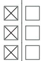

Functional and/or effective connectivity Graph analysis Multivariate modeling or predictive analysis

Functional and/or effective connectivity

Report the measures of dependence used and the model details (e.g. Pearson correlation, partial correlation, mutual information).

Report the dependent variable and connectivity measure, specifying weighted graph or binarized graph,