# An agentic system for rare disease diagnosis with traceable reasoning

https://doi.org/10.1038/s41586-025-10097-9

Received: 30 June 2025

Accepted: 30 December 2025

Published online: 18 February 2026

Open access

# Check for updates

Weike Zhao1,2,3,10, Chaoyi Wu1,10, Yanjie Fan4,5,10, Pengcheng Qiu1,2,3, Xiaoman Zhang6 , Yuze Sun1 , Xiao Zhou3 , Shuju Zhang7 , Yu Peng7 , Yanfeng Wang1 , Xin Sun4 , Ya Zhang1,3,8 ✉, Yongguo Yu4 ✉, Kun Sun4,9 ✉ & Weidi Xie1,3 ✉

Rare diseases afect more than 300 million people worldwide1–3 , yet timely and accurate diagnosis remains an urgent challenge1,3–5 . Patients often endure a prolonged ‘diagnostic odyssey’ exceeding 5 years, marked by repeated referrals, misdiagnoses and unnecessary interventions, leading to delayed treatment and substantial emotional and economic burden4,5 . Here we present DeepRare—a multi-agent system for rare disease diferential diagnosis decision support6–8 powered by large language models, integrating more than 40 specialized tools and up-to-date knowledge sources. DeepRare processes heterogeneous clinical inputs, including free-text descriptions, structured human phenotype ontology terms and genetic testing results to generate ranked diagnostic hypotheses with transparent reasoning linked to verifable medical evidence. Evaluated across nine datasets from literature, case reports and clinical centres across Asia, North America and Europe spanning 14 medical specialties, DeepRare demonstrates exceptional performance on 2,919 diseases. In human-phenotype-ontology-based tasks, it achieves an average Recall@1 of $5 7 . 1 8 \%$ , outperforming the next best method by $2 3 . 7 9 \%$ ; in multi-modal tests, it reaches $6 9 . 1 \%$ compared with Exomiser’s $5 5 . 9 \%$ on 168 cases. Expert review achieved $9 5 . 4 \%$ agreement on its reasoning chains, confrming their validity and traceability. Our work not only advances rare disease diagnosis but also demonstrates how the latest powerful large-language-model-driven agentic systems can reshape current clinical workfows.

Rare diseases—defined as conditions affecting fewer than 1 in 2,000 people—collectively impact more than 300 million people worldwide, with more than 7,000 distinct disorders identified to date, approximately $80 \%$ of which are genetic in origin1–3,9 . Despite their cumulative burden, rare diseases remain notoriously difficult to diagnose due to their clinical heterogeneity, low individual prevalence and limited clinician familiarity1,2,4,6,10–15. Patients often experience a prolonged ‘diagnostic odyssey’ averaging more than 5 years, marked by repeated referrals, misdiagnoses and unnecessary interventions, all of which contribute to delayed treatment and adverse outcomes4,5 . These challenges highlight the urgent need for scalable, accurate and interpretable diagnostic tools—an area where recent advances in multi-agent systems offer transformative potential.

Developing artificial intelligence (AI) systems for rare disease diagnosis presents several inherent challenges: (1) multi-disciplinary (rare diseases often manifest with complex, heterogeneous and multisystem symptoms, requiring diagnostic models to possess multi-disciplinary medical knowledge and the ability to interpret diverse patient phenotypes16,17), (2) limited cases (the scarcity of cases for individual rare diseases limits the availability of training data, making it difficult to develop robust models and increasing the risk of overfitting and catastrophic forgetting), (3) dynamic knowledge updates (the rare disease knowledge landscape is rapidly evolving, with approximately 260 to 280 rare genetic diseases discovered per year, according to the International Rare Diseases Research Consortium (IRDiRC))18 and (4) transparency and traceability (clinical deployment demands interpretability; diagnostic suggestions must be accompanied by transparent, traceable reasoning to support clinician trust and accountability). This dynamic nature demands AI systems that are not only updatable but also capable of integrating new knowledge efficiently.

Recent advances in agentic large language model (LLM) systems have opened new avenues for rare disease diagnosis6,7,19–26. These systems orchestrate several specialized tools and sub-agents23,24, enabling seamless integration of external knowledge bases, case repositories and multi-modal analytical components8,21. Unlike conventional supervised learning approaches, these systems are typically training-free and excel in few-shot and zero-shot scenarios—an essential capability for rare disease applications where annotated data are scarce. Their modular

# Article

and interpretable architectures further facilitate transparent, auditable and clinically actionable diagnostic workflows.

Here we present DeepRare, an agentic LLM-based system designed specifically for rare disease differential diagnosis decision support. DeepRare is capable of processing heterogeneous patient inputs, including free-text clinical descriptions, structured human phenotype ontology (HPO) terms and genomic testing results. Based on the input, the system generates a ranked list of candidate diagnoses, each supported by a transparent chain of reasoning that directly references verifiable medical evidence, enhancing interpretability and supporting clinician trust in AI-assisted decisions. Inspired by the Model Context Protocol (MCP)8 , DeepRare uses a three-tier architecture: a central LLM-powered host with memory coordinates the process, specialized agent servers handle phenotype and genotype analysis, normalization and knowledge retrieval, and the outer tier integrates curated and Web-scale medical resources. To improve robustness, DeepRare further uses a self-reflective loop that iteratively reassesses hypotheses, reducing over-diagnosis and mitigating LLM hallucinations.

We evaluated DeepRare on 6,401 clinical cases collected from seven public datasets and two in-house datasets, sourced from diverse populations across Asia, North America and Europe. Additionally, the two in-house datasets, from Xinhua Hospital (Shanghai) and The Affiliated Children’s Hospital of Xiangya School of Medicine (Hunan), contain 330 cases with not only phenotypes but also whole-exome sequencing (WES) data. All diagnoses in this cohort have been validated rigorously by genetic testing, providing a high-quality standard for assessing diagnostic performance. DeepRare consistently achieves superior diagnostic accuracy across all eight datasets of 2,919 rare diseases spanning 14 medical specialties.

In HPO-based evaluations, compared with a further 15 methods, including traditional bioinformatics tools, LLMs and agentic systems, DeepRare achieved an average score of $5 7 . 1 8 \%$ , $6 5 . 2 5 \%$ at Recall@1 and Recal $@ 3$ , respectively, surpassing the second-best method (Reasoning LLM) by substantial margins of $2 3 . 7 9 \%$ and $1 8 . 6 5 \%$ . Recall@K measures whether the correct diagnosis appears within the top-K predictions— for instance, Recall $@ 1$ indicates the percentage of cases in which the correct diagnosis is the top-ranked prediction, while Recal $@ 3$ measures cases in which the correct diagnosis appears anywhere in the top three predictions. In multi-modal input scenarios, DeepRare achieved a Recall $@ 1$ of $6 9 . 1 \%$ , outperforming Exomiser’s $5 5 . 9 \%$ in the Xinhua whole-exome cases. Furthermore, we engaged ten rare disease physicians to verify manually the traceable reasoning chains generated by the system across 180 cases. DeepRare demonstrates high reliability in evidence factuality, achieving $9 5 . 4 \%$ agreement with clinical experts, thereby confirming that its intermediate reasoning steps are both medically valid and traceable to authoritative sources. To facilitate clinical adoption, we have deployed DeepRare as a user-friendly Web application as a diagnostic copilot for rare disease physicians. Finally, we discuss the robustness of our agentic framework by evaluating different underlying LLMs and analysing the contribution of each module, demonstrating the superiority of our system design.

The following sections present the results of our study, beginning with an overview of the proposed DeepRare framework and the evaluation settings, followed by a detailed analysis of the main findings.

# System overview

DeepRare is an LLM-powered agentic system designed for rare disease diagnosis. It features a three-tier architecture inspired by the MCP8 that synergistically integrates reasoning-enhanced LLMs with a broad range of clinical knowledge sources, as shown in Fig. 1a,b. The system comprises (1) a central host, powered by LLMs (locally implemented DeepSeek- $\cdot \mathsf { V } 3 ^ { 2 7 }$ by default) and equipped with a memory bank, which orchestrates the entire diagnostic workflow by synthesizing collected evidence; (2) several specialized agent servers, each managing a local set of tools to perform various rare disease-related analytical tasks and interact with distinct resource environments; and (3) heterogeneous Web-scale medical sources, which provide essential and traceable diagnostic evidence, such as research articles, clinical guidelines and existing patient cases.

Upon receiving a clinical case—provided as free-text phenotypic descriptions, structured HPO terms, raw variant call format (VCF) files or any combination thereof—the central host decomposes the diagnostic task systematically. It first orchestrates the agent servers to retrieve relevant evidence and references from external data sources, tailored to the patient’s information. The host then synthesizes this evidence to generate preliminary diagnostic hypotheses, followed by a self-reflection phase in which it conducts additional searches to rigorously validate or refute these hypotheses. If no hypothesized diseases meet the self-reflection criteria, the system revisits earlier steps iteratively to acquire further patient-specific evidence, repeating this diagnostic loop until a satisfactory resolution is achieved. Ultimately, DeepRare outputs a ranked list of potential rare diseases, each accompanied by a transparent reasoning chain that links each inference step directly to trusted medical evidence. Further details on the system workflow are provided in Methods.

# Evaluation settings

To evaluate the performance of DeepRare, we consider three baseline approaches:

(1) Specialized rare disease diagnosis tools. We consider bioinformatics tools that are directly designed for rare disease diagnosis. Two HPO-wise analysis tools—PhenoBrain28 and PubCaseFinder29—are considered here.

(2) Latest LLMs. We compare different LLMs, including general LLMs, reasoning-enhanced LLMs and medical LLMs. General LLMs denote the most commonly used LLMs without extra reasoning enhancement or domain alignment, including GPT- $\mathbf { \Delta } \cdot \mathbf { 4 0 } ^ { 3 0 }$ , DeepSeek- $\mathbf { \nabla } \cdot \mathbf { V } \mathbf { \mathcal { 3 } } ^ { 3 1 }$ , Gemini-2.0-flash32 and Claude-3.7-Sonnet33. Reasoning LLMs denote the latest generation LLMs enhanced with an explicit reasoning chain, including ${ \tt o } 3 \mathrm { m i n i } ^ { 3 4 }$ , DeepSeek-R131, Gemini- $- 2 . 0 { \cdot } \mathsf { F T } ^ { 3 2 }$ and Claude-3.7-Sonnet-thinking33. Medical LLMs refer to LLMs developed specifically for the medical domain, with Baichuan- $\cdot 1 4 \mathsf { B } ^ { 3 5 }$ and MMedS-Llama $3 ^ { 3 6 }$ serving as notable representatives. All these LLMs are adapted to rare disease diagnosis, leveraging well-designed Prompt 1 (detailed descriptions of all prompts mentioned later in the text are provided in the Supplementary Methods).

(3) Other agentic systems. We compare our approach with existing agentic systems built upon various LLMs. These include MDAgents37, which uses multi-disciplinary consultations through GPT-4o or DeepSeek-V3, and DS-R1-search, which enhances DeepSeek-V3 with real-time internet retrieval capabilities. More detailed descriptions on these baselines can be found in Methods.

To demonstrate the effectiveness of our method, we performed a comprehensive cross-centre evaluation. As illustrated in Extended Data Table 1, our study uses nine rare disease diagnostic datasets comprising 6,401 clinical cases collected from seven public sources and one in-house repository. We categorize these datasets into three distinct groups based on their origin, representing varying levels of diagnostic difficulty:

(1) From research papers: RareBench-Matchmaker Exchange (MME)38 (40 cases), RareBench-LIRICAL39 (370 cases) and the Deciphering Developmental Disorders Study40 (DDD) (2,283 cases). These cases are extracted from papers and verified manually. Considering that the cases present in the literature are often typical and well documented, diagnosis on these datasets tends to be relatively easy.   
(2) From case reports: RareBench-RAMEDIS41 (624 cases) and MyGene242 (https://mygene2.org) (146 cases). These rare disease cases are uploaded by scientists or patients through case reports. They offer

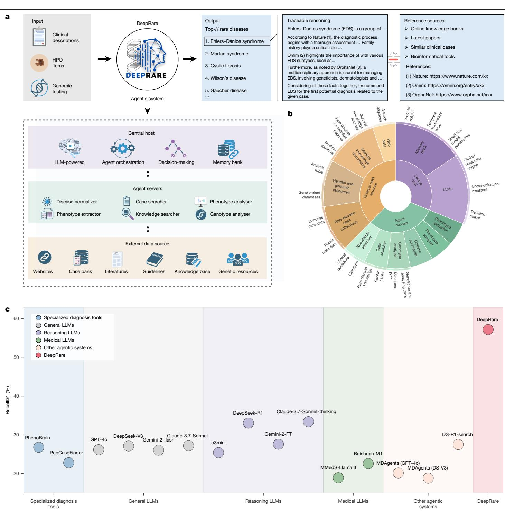  
Fig. 1 | DeepRare: an agentic framework for rare disease prioritization. a, System workflow: multi-modal patient data (HPO terms, genomic variants) are processed through a tiered MCP-inspired architecture, generating a ranked top-K diagnosis list with evidence-supported reasoning chains. b, Knowledge architecture: sunburst visualization depicting hierarchical integration of   
diagnostic tools and biomedical knowledge sources within DeepRare. c, Performance benchmarking: comparative evaluation across diagnostic APIs, general-purpose LLMs, reasoning-enhanced LLMs, medically tuned LLMs and agentic systems. Illustrations in a were created using BioRender (https://biorender.com).

authenticity but also have undergone extra manual filtering, thus presenting moderate diagnostic difficulty.

(3) From real clinical centres: RareBench-HMS43 (88 cases), MIMIC-IV-Rare44 (1,875 cases), Xinhua Hospital (975 cases) and Hunan Hospital (162 cases). These datasets are collected directly from four independent clinical centres of real patients in daily diagnostic procedures. Due to the complexity and diversity of real patients, these benchmarks are more challenging and aligned with real clinical practice. Specifically, RareBench-HMS is collected from the outpatient clinic at Hannover Medical School in Germany. MIMIC-IV-Rare is collected from Beth Israel Deaconess Medical Center in Boston by filtering for the rare-disease-related cases. Xinhua Hospital and Hunan Hospital are two newly collected in-house data from Xinhua Hospital Affiliated to Shanghai Jiao Tong University School of Medicine, China and the Hunan Children’s Hospital, respectively (pre-processing details in Extended Data Fig. 2). Notably, the 168 cases in the Xinhua Hospital dataset and the entire Hunan Hospital dataset (162 cases) include original VCF files generated from WES, constituting a test subset for evaluating genetic data analysis in our collection, spanning two distinct health systems that differ in

# Article

patient demographics, disease profiles and clinical practice patterns. Owing to patient privacy considerations, the Xinhua hospital and Hunan hospital datasets were evaluated exclusively using local models without external application programming interface (API) access. These datasets cover three distinct regions, enabling cross-centre evaluation of our methods on different populations from various countries.

This collection is one of the most comprehensive benchmarks for rare-disease diagnosis, covering 2,919 diseases from different case sources and several independent clinical centres.

For each diagnostic task, we generated five most probable diagnostic predictions. The position of the correct diagnosis within these predictions was determined using GPT-4o under Prompt 2 (more detailed reliability validation can be found in Supplementary Methods), and we subsequently calculated Recal $@ 1$ , Recall@3 and Recal $@ 5$ metrics across the entire dataset.

To validate the reliability of our automated evaluation approach, we engaged eight rare disease specialists, each with more than 10 years of clinical experience, to independently verify the accuracy of the LLM-based assessments. The Pearson correlation coefficient between physician rankings and LLM rankings was 0.8689, indicating strong agreement between human expert and automated evaluations. In our analysis of 240 cases, $8 8 \%$ demonstrated concordant assessments between physicians and the LLM evaluation system. In $10 \%$ of cases, physicians ranked the correct diagnosis higher (assigned it a better position) than the LLM-based evaluation. This pattern suggests that physicians use more nuanced clinical judgment and may recognize subtle diagnostic indicators that the automated evaluation system overlooks, whereas LLMs tend to apply more conservative or stringent ranking criteria. From a validation standpoint, these findings demonstrate that large-scale LLM-based evaluation can produce reliable and methodologically sound outcomes for automated assessment purposes, while acknowledging that human clinical expertise may capture additional diagnostic nuances. Furthermore, these clinical specialists evaluated the validity of the models’ diagnostic reasoning processes to ensure clinical relevance and accuracy.

# HPO-wise analysis across dataset

Figure 1c presents a comparison of HPO-wise diagnosis of average Recall@1 across all benchmarks (except for Xinhua Hospital due to privacy issues). Our proposed DeepRare clearly demonstrates superior performance across all method categories, achieving $5 7 . 1 8 \%$ top-1 diagnosis recall, and significantly outperforming the second-best method, Claude-3.7-Sonnet-thinking $( 3 3 . 3 9 \% )$ . Specifically, we can draw the following key observations: (1) LLM-supported approaches consistently outperform traditional rare disease diagnostic models (PhenoBrain, PubCaseFinder), demonstrating enhanced flexibility in handling diverse clinical presentations; (2) Reasoning-enhanced LLMs systematically surpass their general-purpose counterparts without explicit reasoning, probably because of their transparent reasoning traces that improve diagnostic accuracy; (3) General-purpose LLMs unexpectedly exceed medical domain-tuned LLMs in performance, potentially reflecting parameter scale advantages and broader training diversity; and (4) our multi-agent framework significantly advances beyond existing single-model approaches, highlighting the value of orchestrated specialist agents in complex diagnostic reasoning.

In Fig. 2a,b, we present a detailed comparison of each dataset (only the top-performing models in each baseline category are shown). Complete results for all methods can be found in Supplementary Table 1. Our proposed DeepRare system consistently outperforms all existing methods on all benchmarks. Specifically, in the RareBench-MME evaluation, DeepRare achieves exceptional scores of $78 \%$ , and $85 \%$ for Recall@1 and

Recall@3, respectively, surpassing the second-best baseline method (PubCaseFinder) by margins of $30 \%$ and $20 \%$ , respectively. The system demonstrates particularly strong results on the MyGene2 evaluation with scores of $74 \%$ and $81 \%$ , respectively, surpassing second methods by substantial margins of $3 5 \%$ and $28 \%$ , respectively.

In clinical datasets, DeepRare maintains its performance edge on the MIMIC-IV-Rare test $( 2 9 \% , 3 7 \% )$ . In addition to the public benchmarks, we also report its performance on the in-house clinical test set, Xinhua Hospital (Fig. 2b). We compare mainly with DeepSeek-V3, DeepSeek-R1, and Baichuan-M1, which can be implemented locally. DeepRare achieves $58 \%$ and $71 \%$ for Recal $@ 1$ and Recall $@ 3$ , respectively, significantly surpassing the other methods.

# HPO-wise analysis across specialties

In addition to analysing HPO-wise diagnostic performance across datasets, we also present results across different medical specialties, highlighting the system’s broad understanding of diverse medical knowledge.

Specifically, we categorized all test cases based on 14 body system specialties, following the taxonomy introduced by MedlinePlus45 (https://medlineplus.gov), namely, Blood, Heart and Circulation; Bones, Joints and Muscles; Brain and Nerves; Digestive System; Ear, Nose and Throat; Endocrine System; Eyes and Vision; Immune System; Kidneys and Urinary System; Lungs and Breathing; Mouth and Teeth; Skin, Hair and Nails; Female Reproductive System; and Male Reproductive System. The diseases are categorized by DeepSeek-V3 under Prompt 4.

Next we present the performance comparison on various specialties. It is important to note that each case may involve several specialties. Similarly, because of privacy concerns regarding the in-house cases, we evaluate only those methods that do not require uploading cases through online LLM APIs. Thus, DeepSeek-V3, DeepSeek-R1 and Baichuan-M1 are retained to represent general LLMs, reasoning LLMs and medical LLMs, respectively.

The results are illustrated in Fig. 3a. DeepRare demonstrates substantial performance superiority across almost all specialties. For example, in the Endocrine System category, DeepRare achieves a top-1 diagnostic accuracy of $60 \%$ , significantly higher than the second-best method $( 3 2 \% )$ . Similarly, for 729 cases in the Digestive System category, Deep-Rare’s top-1 diagnostic accuracy reaches $4 9 \%$ , substantially outperforming the second-best method $( 3 4 \% )$ . Notably, this analysis reveals that our DeepRare performs best in the Kidneys and Urinary System, achieving an accuracy of $6 6 \%$ , while showing relatively lower performance in the Lungs and Breathing System, with an accuracy of $31 \%$ , reflecting its clinical application boundaries.

# HPO-wise analysis across diseases

To ensure a comprehensive evaluation beyond aggregate metrics, we conducted a fine-grained, disease-level performance analysis. This is crucial for contextualizing the results, as the benchmark encompasses a long-tail of rare diseases with varying case counts. We stratified the 2,919 diseases based on their representation in the test set to determine whether performance was uniform or driven by specific subsets.

For diseases with substantial representation (more than ten cases), DeepRare demonstrated a consistent and clear performance advantage. As shown in Fig. 3b, the Recal $@ 1$ for these diseases is consistently higher for DeepRare compared with all baseline models across the spectrum of case volumes, confirming that its efficacy is not an artefact of data-sparse categories.

We further focused on the most challenging segment of the benchmark: diseases with ten or fewer cases. Performance on these ‘long-tail’ categories is a critical test of a model’s generalization capability. The results show that DeepRare achieves a high level of diagnostic accuracy (Recall $@ 1 > 0 . 8 )$ for $3 1 . 8 \%$ of these data-sparse diseases. This significantly outperforms DeepSeek-V3 $( 2 3 . 5 \% )$ and DeepSeek-R1 $( 2 6 . 6 \% )$ . Notably, the smaller, domain-specific medical LLM (Baichuan-M1) struggled profoundly in this setting, achieving the same high recall threshold for only $2 . 5 \%$ of tail-end diseases, highlighting a significant limitation in its ability to generalize. This stratified analysis confirms that DeepRare’s superior performance is robust across the case distribution. It excels not only on well-represented diseases but also demonstrates a stronger capacity to diagnose challenging, rare conditions with limited data available, a key requirement for a practical clinical decision support system.

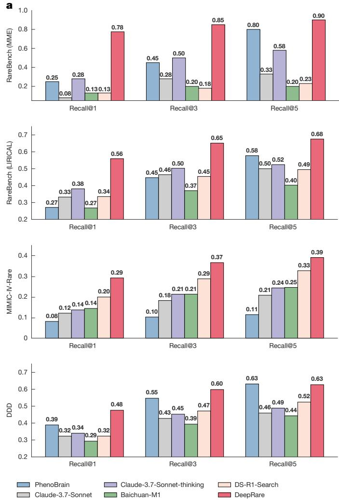  
Fig. 2 | HPO-wise cross-dataset evaluation and comparative performance of DeepRare. a, Diagnostic accuracy on seven public rare disease registries, demonstrating DeepRare’s significant advantage over leading baselines— particularly in RareBench-MME $( 7 0 . 0 \%$ top-1 accuracy) and RareBench-RAMEDIS

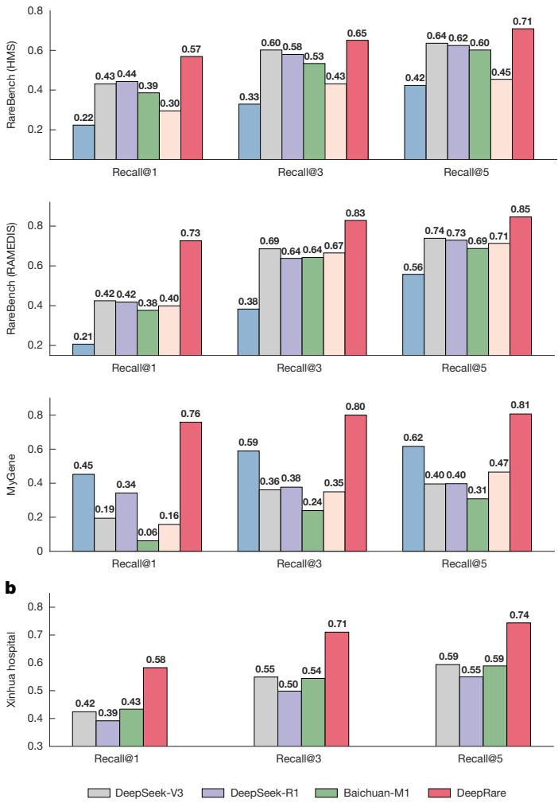  
$7 2 . 6 \%$ top-1 accuracy). b, Superior performance consistency on the Xinhua Hospital cohort (local model evaluation only because of privacy considerations).

were instructed to list up to five differential diagnoses, providing fewer if they were highly confident.

As shown in Fig. 3c, DeepRare achieved a Recal $@ 5$ of $7 8 . 5 \%$ , significantly outperforming the clinicians’ average accuracy of $6 5 . 6 \%$ . Crucially, at Recall@1, DeepRare $( 6 4 . 4 \% )$ surpassed the physicians’ performance $( 5 4 . 6 \% )$ . This represents a landmark result: DeepRare is one of the first computational models to surpass the diagnostic performance of expert physicians in the complex task of rare-disease phenotyping and diagnosis, providing compelling evidence of its practical value in real-world clinical scenarios.

# HPO-wise comparison against experts

To further validate the real-world clinical utility of our approach, we conducted a comparative study using 163 clinical cases from Xinhua Hospital’s test dataset (selected from an initial pool of 200, after excluding cases physicians deemed unreasonable due to insufficient information in outpatient narratives). In this setting, DeepRare’s diagnostic performance is benchmarked against five experienced physicians (with at least 10 years of clinical practice in rare diseases). To ensure a fair comparison, both the physicians and DeepRare were provided with the identical input: the structured HPO extracted from free-text outpatient narratives. The physicians were allowed to use search engines and reference materials but were prohibited from using AI tools. They

# Analysis of HPO and genetic data

To evaluate our system’s diagnostic capabilities comprehensively, we investigated performance when incorporating both HPO and genetic data as inputs. We conducted this evaluation on 168 cases from the Xinhua Hospital dataset and 162 cases from the Hunan Hospital dataset, specifically selecting cases with complete WES data to ensure robust comparative analysis. As shown in Fig. 3d, the integration of genetic information yielded substantial performance improvements, with Recal $@ 1$ increasing dramatically from $3 9 . 9 \%$ to $6 9 . 1 \%$ in the Xinhua Hospital dataset and from $3 3 . 3 \%$ to $6 3 . 6 \%$ in the Hunan Hospital dataset. In addition, we compared our approach with other bioinformatics tools that similarly process both HPO and genetic data, such as

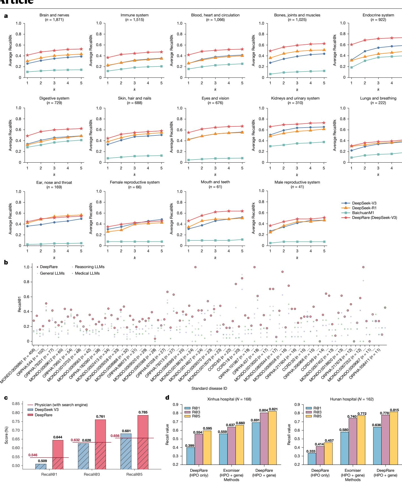  
Fig. 3 | DeepRare diagnostic performance. a, Comparison of diagnostic accuracy across 14 body systems, showing DeepRare’s superior performance in most specialties compared with LLM (DeepSeek-V3), Reasoning LLM (DeepSeek-R1) and Medical LLM (Baichuan-M1). b, Disease-level recall performance comparison for diseases with more than ten cases, showing DeepRare’s consistent superiority. c, Real-world clinical validation study:   
diagnostic recall performance comparison of specialized rare disease physicians (more than 10 years experience with search engine), LLM (DeepSeek-V3) and DeepRare using unprocessed outpatient clinical narratives (free-text context only). d, Diagnosis performance with HPO and genetic data input compared with baseline method and HPO input only.

# Top 5 most likely rare disease diagnoses: ## Vitamin B12-responsive methylmalonic acidemia (cblA/cblB type) (Rank #1/5)

### Diagnostic reasoning:

- This diagnosis is strongly supported by the patient’s phenotype, including \*\*methylmalonic acidemia, hyperammonemia, metabolic acidosis and severe neonatal/childhood symptoms\*\*. These are hallmark features of \*\*Vitamin B12-Responsive Methylmalonic Acidemia\*\*, a disorder caused by defects in methylmalonyl-CoA mutase or its cofactor, vitamin B12 [1][2]. The patient’s \*\*intellectual disability, motor delay and generalized hypotonia\*\* are consistent with the neurological manifestations of this condition [3]

# ## Methylmalonic acidemia (MMA) (Rank #2/5)

### Diagnostic reasoning:

- The patient’s phenotype aligns closely with \*\*Methylmalonic Acidemia (MMA)\*\*, as

# Reference list:

# (1) Source: Vitamin B12-responsive methylmalonic acidemia

Content: The article ‘Vitamin B12-responsive methylmalonic acidemia’ discusses the clinical features of this condition, including methylmalonic acidemia, hyperammonemia and metabolic acidosis, which align with the patient’s phenotype.

URL: http://www.orpha.net/consor/cgi-bin/OC_Exp.php?lng=en&Expert=28

# (2) Source: OMIM

Content: OMIM entry #251100 describes methylmalonic aciduria, cblA type, highlighting the severe neonatal symptoms and metabolic abnormalities seen in this disorder.

URL: https://www.omim.org/entry/251100

# (3) Source: Similar case

Content: Similar Case 1 describes a patient with Vitamin B12-responsive methylmalonic acidemia presenting with methylmalonic aciduria, hyperammonemia and metabolic acidosis, closely matching the patient’s symptoms.

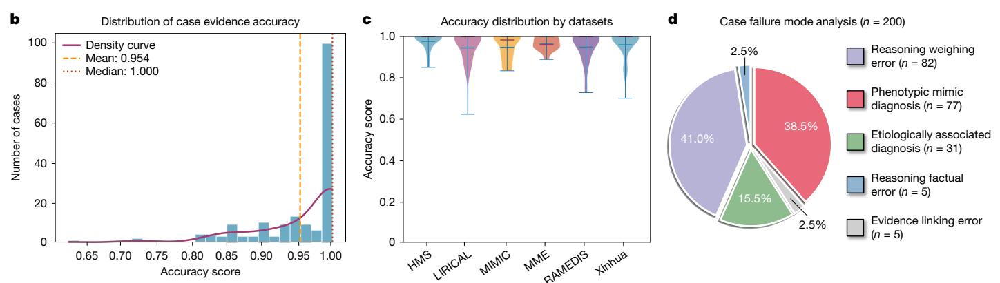  
Fig. 4 | Human expert validation of traceable reasoning chain and failure mode in the DeepRare diagnostic system. a, Representative case output demonstrating differential diagnosis with an evidence-based reference list. b, Histogram of reference accuracy scores with density curve (mean $= 0 . 9 5 4$ ,   
median $= 1 . 0 0 0 ^ { \cdot }$ ). c, Dataset-specific accuracy distributions showing robust performance across eight rare disease datasets. d, Distribution of failure modes in 200 failed cases sampled randomly from the entire HPO-wise test set.

Exomiser46, which is also used as a component within our system. When comparing systems using both HPO and genetic data, our DeepRare system achieved Recall $@ 1$ of $6 9 . 1 \%$ versus Exomiser’s $5 5 . 9 \%$ in the Xinhua Hospital dataset, and $6 3 . 6 \%$ versus $5 8 . 0 \%$ in the Hunan Hospital dataset, demonstrating superior performance across both cohorts. These results demonstrate that our agentic system significantly outperforms existing bioinformatics diagnostic tools in comprehensive analysis of rare disease.

# Traceable reasoning chain validation

To assess the reliability and clinical relevance of the reference lists generated by DeepRare, we enlisted ten associate chief physicians specializing in rare diseases to evaluate the system’s outputs on complex cases. A total of 180 cases were sampled randomly from DeepRare’s predictions across eight datasets. Each case was reviewed independently by three specialists, and the consensus was calculated as the mean score. We developed a dedicated annotation interface that presented experts with patient information, model-generated diagnostic results and corresponding reference lists (Fig. 4a). Physicians were asked to assess the accuracy of each reference (including literature, case reports and websites), with accuracy defined as the reference being both reliable and directly relevant to the model’s final diagnostic decision.

Statistical results at the case level (Fig. 4b) show an average reference accuracy of $9 5 . 4 \%$ . At the dataset level (Fig. 4c), the system consistently demonstrates high performance across all datasets. Further analysis of references deemed incorrect by physicians revealed two main error categories: (1) hallucinated references, where the system generated plausible but non-existent URLs in the absence of actual literature links, leading to erroneous Web pages; (2) irrelevant references, resulting from incorrect diagnostic conclusions that caused the model to cite sources unrelated to the true disease.

Overall, physician validation confirms the robustness of DeepRare’s source attribution, highlighting its potential to substantially streamline the literature and case retrieval process during clinical diagnosis and to enhance diagnostic efficiency for healthcare professionals.

# Failure cases analysis

A rigorous analysis of DeepRare’s diagnostic failures was performed to delineate its limitations and inform the next stages of development. Detailed examples are presented in the Supplementary Information section 1.9. We also perform a quantitative failure mode analysis on 200 cases sampled randomly from the HPO-wise test set where the correct diagnosis is not ranked among the top five recommendations. Each case was reviewed independently and classified by three rare disease specialists, each with a decade of clinical experience.

We categorized failures based on the system’s output structure: (1) reasoning processes, (2) use of external evidence and (3) final diagnosis. This yielded five distinct failure modes (Fig. 4d). The most prevalent failure mode was Reasoning Weighing Error $( 4 1 . 0 \%$ , 82 of 200), where the logical structure is sound but the diagnostic weight assigned to specific phenotypes is suboptimal. For instance, DeepRare occasionally overemphasizes non-specific features (for example, Antinuclear antibody positivity) while underweighting more pathognomonic findings (for example, significantly low alkaline phosphatase), leading to a plausible but incorrect diagnosis. The second most common mode is Phenotypic Mimic Diagnosis $( 3 8 . 5 \%$ , 77 of 200), quantitatively substantiating the challenge of high phenotypic overlap. In these cases, DeepRare identifies the correct clinical category but cannot differentiate between molecularly distinct entities based on HPO terms alone. For example, it frequently confuses CTCF-related disorder with its clinical mimic, Cornelia de Lange syndrome. A smaller proportion of errors is classified as Etiologically Associated Diagnosis $( 1 5 . 5 \%$ , 31 of 200), where the predicted diagnosis is a taxonomically distinct but clinically and pathophysiologically related entity, capturing the fundamental pathology of the case. In contrast, fundamental errors in reasoning (Reasoning Factual Error, $2 . 5 \%$ ) or in using retrieved information (Evidence Linking Error, $2 . 5 \%$ ) are rare, indicating the robustness of the system’s core knowledge and retrieval capabilities.

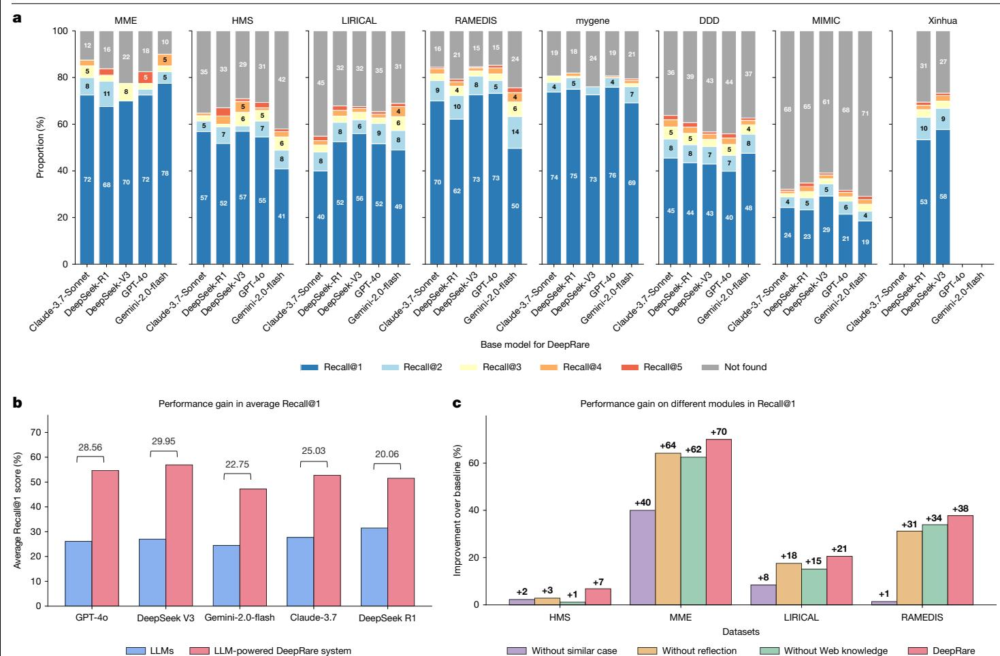  
Fig. 5 | Ablation study of the DeepRare system. a, Performance comparison across different LLMs (Claude-3.7-Sonnet, DeepSeek-R1, DeepSeek-V3, GPT-4o and Gemini-2.0-flash) as central hosts on eight rare disease datasets. b, Performance enhancement comparison between baseline LLMs and their   
powered agentic DeepRare systems. c, Module-wise contribution analysis on DeepRare system (GPT-4o powered) demonstrating the effectiveness of similar case retrieval, Web knowledge integration and self-reflection components compared with baseline GPT-4o performance.

# Ablation study

We next conducted a comprehensive ablation study on our system design, focusing on central host selection and the effectiveness of introducing various agent designs.

To begin, we evaluated various foundational models as central hosts for DeepRare. As illustrated in Fig. 5a, we tested Claude-3.5-Sonnet, DeepSeek-R1, DeepSeek-V3, GPT-4o and Gemini-2.0-Flash across eight datasets, assessing their suitability as the core of our agentic system. According to the results, DeepSeek-V3 outperforms other models on most datasets, except for RareBench-MME, where the Gemini-2.0-flash-based agentic system achieved the best performance. Overall, the choice of central host LLMs has minimal impact on the results, highlighting the generalization of our system, which is not reliant on specific LLMs.

Figure 5b compares the raw LLMs with their corresponding agentic systems. As shown in the figure, our agentic design significantly improves the performance of the original LLMs, highlighting the necessity of the proposed agentic workflow mechanisms. For instance, with GPT-4o, the average Recall $@ 1$ score across the five public datasets improves substantially from $2 5 . 6 0 \%$ to $5 4 . 6 7 \%$ with $2 8 . 5 6 \%$ performance gain, whereas for DeepSeek-V3, it increases from $2 6 . 1 8 \%$ to $5 6 . 9 4 \%$ with $2 9 . 9 5 \%$ performance gain. This enhancement is observed consistently across all tested LLMs, demonstrating the effectiveness of our approach.

In Fig. 5c and Supplementary Tables 2 and 3, we show the effectiveness of different agentic components. This illustrates the Recal $@ 1$ improvements of each module, including similar case retrieval, Web knowledge and self-reflection modules, in the DeepRare system (GPT-4o powered) compared with the baseline method (GPT-4o) on the RareBench dataset. The results confirm that the system’s components provide complementary strengths. In contexts with sparse historical precedent, knowledge tools and reflective reasoning sustain robust diagnostic performance. Conversely, in scenarios rich with analogous cases, case-based retrieval delivers substantial gains. Critically, the full DeepRare system, which orchestrates all components dynamically, consistently surpasses any partial configuration. This synergy demonstrates that it leverages precedent adaptively where available and relies on foundational knowledge and verification for new challenges, thereby achieving state-of-the-art performance across the diverse and long-tailed landscape of rare diseases.

# Discussion

In this study, we present DeepRare, an LLM-powered agentic system specifically designed for rare disease diagnosis. It can process a wide range of input types commonly encountered in clinical workflows, including chief complaints, genetic data and detailed clinical phenotypes, thereby supporting clinicians in the timely and accurate diagnosis of rare diseases. A key feature of DeepRare is its ability to generate a comprehensive diagnostic reasoning chain, providing transparent and interpretable insights that enhance clinical decision-making. We evaluated DeepRare rigorously across diverse datasets spanning several sources, disease categories and medical centres, where it consistently outperformed existing methods, demonstrating both effectiveness and generalizability.

Compared with existing diagnostic tools used commonly in clinical practice, DeepRare addresses several critical limitations: (1) traditional HPO-based systems typically generate candidate disease lists without providing sufficient explanatory context or diagnostic rationale, thereby limiting their clinical applicability; (2) some tools that integrate both HPO phenotypes and genetic data remain highly dependent on genetic testing results, rendering them less suitable for initial patient assessments or first-line screening; (3) recent advances in LLMs have improved clinician usability, but these models are still prone to hallucinations that undermine diagnostic reliability. DeepRare overcomes these challenges by grounding its diagnostic reasoning in verifiable medical evidence, ensuring both interpretability and trustworthiness throughout the diagnostic process.

Our experimental results demonstrate two key achievements. (1) Superior performance across benchmarks: DeepRare achieved substantial improvements over existing methods across several benchmark datasets, including the publicly available RareBench—a rare disease subset of MIMIC-IV-Note—and our in-house Xinhua Hospital dataset, with comprehensive analyses showing consistent outperformance across different medical specialties and input modalities. (2) Evidence-based reasoning chains: beyond diagnostic accuracy, DeepRare provides transparent, step-by-step diagnostic reasoning with verifiable references that reduce clinical decision-making time significantly and minimize patient costs associated with misdiagnosis, as validated through expert clinical assessment.

The clinical implications of DeepRare extend beyond diagnostic accuracy to address fundamental challenges in rare disease care delivery. The system’s ability to provide evidence-based reasoning chains with verifiable references could reduce significantly the time required for literature review and case research, enabling clinicians to focus more on patient care rather than information gathering. Furthermore, the system’s consistent performance across different medical specialties suggests its potential as a valuable decision support tool for non-specialist physicians who may encounter rare diseases infrequently. This democratization of rare disease expertise could be particularly impactful in resource-limited settings or regions with limited access to specialized care, potentially reducing healthcare disparities in rare disease diagnosis.

# Limitations

Although DeepRare demonstrates strong performance and broad applicability, several areas offer opportunities for further enhancement. First, although our current agentic architecture integrates diverse specialized medical resources and databases, it has yet to fully incorporate potentially valuable data sources. Nevertheless, the flexibility of our agentic system, combined with its MCP-like plugin interface, enables seamless future expansion and integration of additional rare disease knowledge systems and bioinformatics tools, further enhancing diagnostic support.

Second, our present knowledge search agent processes phenotypic information in aggregate. Although this approach has proven effective, future work could explore more refined and adaptive retrieval mechanisms to further optimize knowledge curation and potentially enhance diagnostic precision.

Third, our diagnosis system targets primarily cases where patients are aware of rare diseases but have not yet received a precise diagnosis. We also acknowledge that ‘screening’ in non-specialist settings to trigger initial suspicion is crucial. Expanding the system with screening represents a promising direction to enhance its clinical impact. Thanks to its agentic architecture, our system can be integrated seamlessly with new agent servers to broaden its functional coverage. In Supplementary Information section 1.7, we provide a simple attempt to equip the system with preliminary screening ability and encourage further work to advance this line of research.

Finally, although we have developed modules for patient interaction to facilitate information gathering, the lack of suitable validation datasets has so far precluded experimental evaluation of this feature. As such datasets become available, further investigation and iterative improvement of patient interaction capabilities will be a natural next step.

Overall, these represent areas for ongoing development rather than fundamental limitations. Future work will focus on expanding the agentic system framework to encompass rare disease treatment and prognosis prediction, with the goal of evolving DeepRare into an even more flexible and comprehensive ecosystem for rare disease management.

# Online content

Any methods, additional references, Nature Portfolio reporting summaries, source data, extended data, supplementary information, acknowledgements, peer review information; details of author contributions and competing interests; and statements of data and code availability are available at https://doi.org/10.1038/s41586-025-10097-9.

# Article

21. Talebirad Y. & Nadiri A. Multi-agent collaboration: harnessing the power of intelligent LLM agents. Preprint at https://arxiv.org/abs/2306.03314v1 (2023).   
22. Zheng, Q. et al. How well can modern LLMs act as agent cores in radiology environments? Preprint at https://arxiv.org/abs/2412.09529v3 (2024).   
23. LangChain’s suite of products supports developers along each step of the LLM application lifecycle. LangChain https://www.langchain.com/langchain (2025).   
24. Building effective agents. Anthropic https://www.anthropic.com/engineering/buildingeffective-agents (2025).   
25. Zheng Q. et al. End-to-end agentic RAG system training for traceable diagnostic reasoning. Preprint at https://arxiv.org/abs/2508.15746v1 (2025).   
26. Qiu P. et al. Evolving diagnostic agents in a virtual clinical environment. Preprint at https:// arxiv.org/abs/2510.24654v1 (2025).   
27. DeepSeek-AI, Liu, A. et al. DeepSeek-V3 technical report. Preprint at https://arxiv.org/ abs/2412.19437v2 (2024).   
28. Mao, X. et al. A phenotype-based AI pipeline outperforms human experts in differentially diagnosing rare diseases using EHRs. NPJ Digit. Med. 8, 68 (2025).   
29. Fujiwara, T., Shin, J.-M. & Yamaguchi, A. Advances in the development of PubCaseFinder, including the new application programming interface and matching algorithm. Hum. Mutat. 43, 734–742 (2022).   
30. Achiam J. et al. GPT-4 technical report. Preprint at https://arxiv.org/abs/2303.08774v6 (2023).   
31. Guo, D. et al. DeepSeek-R1 incentivizes reasoning in LLMs through reinforcement learning. Nature 645, 633–638 (2025).   
32. Reid, M. et al. Gemini 1.5: unlocking multimodal understanding across millions of tokens of context. CoRR (2024).   
33. Anthropic Team. Introducing the next generation of Claude. Anthropic https://www. anthropic.com/news/claude-3-family (2024).   
34. OpenAI O3 Mini. OpenAI https://openai.com/index/openai-o3-mini (2025).   
35. Wang, B. et al. Baichuan-M1: pushing the medical capability of large language models. Preprint at https://arxiv.org/abs/2502.12671v2 (2025).   
36. Wu, C. et al. Towards evaluating and building versatile large language models for medicine. NPJ Digit. Med. 8, 58 (2025).   
37. Kim, Y. et al. MDAgents: an adaptive collaboration of LLMs for medical decision-making. In Proc. Advances in Neural Information Processing Systems 37 (eds Globerson, A. et al.) 79410–79452 (Nomis Foundation, 2024).   
38. Philippakis, A. A. et al. The Matchmaker Exchange: a platform for rare disease gene discovery. Hum. Mutat. 36, 915–921 (2015).   
39. Robinson, P. N. et al. Interpretable clinical genomics with a likelihood ratio paradigm. Am. J. Hum. Genet. 107, 403–417 (2020).   
40. Firth, H. V. et al. DECIPHER: database of chromosomal imbalance and phenotype in humans using Ensembl resources. Am. J. Hum. Genet. 84, 524–533 (2009).   
41. Töpel, T., Scheible, D., Trefz, F. & Hofestädt, R. Ramedis: a comprehensive information system for variations and corresponding phenotypes of rare metabolic diseases. Hum. Mutat. 31, E1081–E1088 (2010).   
42. Alsentzer, E. et al. Few-shot learning for phenotype-driven diagnosis of patients with rare genetic diseases. NPJ Digit. Med. 8, 380 (2025).   
43. Ronicke, S. et al. Can a decision support system accelerate rare disease diagnosis? Evaluating the potential impact of Ada DX in a retrospective study. Orphanet J Rare Dis. 14, 69 (2019).   
44. Johnson, A., Pollard, T., Horng, S., Celi, L. A. & Mark, R. MIMIC-IV-Note: deidentified freetext clinical notes (version 2.2). PhysioNet https://doi.org/10.13026/1n74-ne17 (2023).   
45. Miller, N., Lacroix, E.-M. & Backus, J. E. B. MedlinePlus: building and maintaining the National Library of Medicine’s consumer health web service. Bull. Med. Libr. Assoc. 88, 11 (2000).   
46. Smedley, D. et al. Next-generation diagnostics and disease-gene discovery with the Exomiser. Nat. Protoc. 10, 2004–2015 (2015).

Publisher’s note Springer Nature remains neutral with regard to jurisdictional claims in published maps and institutional affiliations.

Open Access This article is licensed under a Creative Commons Attribution-NonCommercial-NoDerivatives 4.0 International License, which permits any non-commercial use, sharing, distribution and reproduction in any medium or format, as long as you give appropriate credit to the original author(s) and the source, provide a link to the Creative Commons licence, and indicate if you modified the licensed material. You do not have permission under this licence to share adapted material derived from this article or parts of it. The images or other third party material in this article are included in the article’s Creative Commons licence, unless indicated otherwise in a credit line to the material. If material is not included in the article’s Creative Commons licence and your intended use is not permitted by statutory regulation or exceeds the permitted use, you will need to obtain permission directly from the copyright holder. To view a copy of this licence, visit http:// creativecommons.org/licenses/by-nc-nd/4.0/.

# Methods

We introduce DeepRare—an agentic framework designed to support rare disease diagnosis, structured upon a modular, multi-tiered architecture. The system comprises three core components: (1) a central host agent, equipped with a memory bank that integrates and synthesizes diagnostic information while coordinating system-wide operations; (2) specialized local agent servers, each interfacing with specific diagnostic resource environments through tailored toolsets and (3) heterogeneous data sources that provide critical diagnostic evidence, including structured knowledge bases (for example, research literature, clinical guidelines) and real-world patient data. The architecture of DeepRare is described in a top-down manner, beginning with the central host’s core workflow and proceeding through the agent servers to the underlying data sources.

# Problem formulation

In this paper, we focus on rare disease diagnosis, where the input of a rare disease patient’s case consists typically of two components: phenotype and genotype, denoted as $\mathcal { T } = \{ \mathcal { P }$ , $\mathcal { G }$ . Either $\mathcal { P }$ or $\mathcal { G }$ (but not both) may be an empty set $\varnothing$ , indicating the absence of the corresponding input. Specifically, the input phenotype may consist of free-text descriptions $\tau$ , structured HPO terms $\mathcal { H }$ or both. Formally, we define, $\mathcal { P } = \left( \mathcal { T } , \mathcal { H } \right)$ , where either $\tau$ or $\mathcal { H }$ may be empty (that is, $\emptyset )$ indicating the absence of that input modality. The ‘genotype input’ denotes the raw VCF file generated from WES.

Given $\mathcal { P }$ , the goal of the system is to produce a ranked list of the top $K$ most probable rare diseases, $\mathcal { D } = \{ d _ { 1 } , d _ { 2 } , . . . , d _ { K } \} ,$ and a corresponding rationale $\mathcal { R }$ consisting of evidence-grounded explanations traceable to medical sources such as peer-reviewed literature, clinical guidelines and similar patient cases. This can be formalized as:

$$
\{ \mathcal { D } , \ \mathcal { R } \} = \mathcal { A } ( \mathcal { P } ) ,
$$

where $\boldsymbol { \mathcal { A } } ( \cdot )$ denotes the diagnostic model.

As shown in Extended Data Fig. 1b, our multi-agent system comprises three main components:

(1) A central host with a memory bank serves as the coordinating brain of the system. The memory bank is initialized as empty and updated incrementally with information gathered by agent servers. Powered by a LLM, the central host integrates historical context from the memory bank to determine the system’s next actions.

(2) Several agent servers execute specialized tasks such as phenotype extraction and knowledge retrieval, enabling dynamic interaction with external data sources.

(3) Diverse data sources serve as the external environment, providing crucial diagnostic evidence from PubMed articles, clinical guidelines, publicly available case reports and other relevant resources.

# Main workflow

The system operates in two primary stages, orchestrated by the central host: information collection and self-reflective diagnosis, as illustrated in Extended Data Fig. 1c. For clarity, the specific functionalities of the agent servers involved in each stage are detailed in the following section.

Information collection. In the information collection stage, the system pre-processes the patient input and invokes specialized agent servers to gather relevant medical evidence from external sources. The process begins with two parallel steps: one focusing on phenotype inputs and the other on genotype data. Subsequently, the central host takes control to facilitate diagnostic decision-making and patient interaction.

Phenotype information collection. Given the phenotype input $( \mathcal { P } = \left( \mathcal { T } , \mathcal { H } \right) )$ , the system performs the three main sub-steps to collect extra information: HPO standardization, phenotype retrieval and phenotype analysis.

In HPO standardization, the phenotype extractor $a _ { \mathrm { H P O } }$ agent server is called, to convert the given free-form reports $\tau$ into a list of standardized entities $\mathcal { H }$ , denoted as:

$$
\begin{array} { r } { \hat { \mathcal { P } } = \left\{ \begin{array} { c l } { a _ { \mathsf { H P O } } ( T ) , } & { \mathsf { i f } \ : T \neq \emptyset } \\ { \mathcal { H } , } & { \mathrm { o t h e r w i s e } } \end{array} \right. } \end{array}
$$

As a result, each patient is now denoted as a set of standardized HPO entities $( \hat { \mathcal { P } } )$ that are further treated as the query for phenotype retrieval.

The knowledge searcher $( a _ { \mathrm { k - s e a r c h } } )$ and case searcher $( a _ { \mathrm { c \cdot s e a r c h } } )$ agent servers are invoked to retrieve supporting documents from the Web and relevant cases from an external database, respectively:

$$
\mathcal E _ { \sf H \mathrm { P 0 } } = a _ { \mathrm { k - s e a r c h } } ( \hat { \mathcal P } , \mathcal M , N ) \bigcup a _ { \mathrm { c - s e a r c h } } ( \hat { \mathcal P } , \mathcal M , N ) ,
$$

where $\mathcal { E } _ { \mathrm { H P O } }$ refers to a unified set of retrieved evidences and $N$ denotes the search depth. Notably, the two search agents will also check the memory bank $( \mathcal { M } )$ to avoid retrieving items that have already been recorded.

Finally, in phenotype analysis, the agent server integrates various distinct bioinformatics tools to provide a set of diagnostic-related suggestions, for example, identifying diseases that are more likely to be associated with the patient based on their phenotype, denoted as:

$$
\mathcal { V } _ { \sf H P O } { = } a _ { \sf H P O - a n a l y z e r } ( \hat { \mathcal { P } } )
$$

Thus far, we have gathered relevant information on the phenotype by exploring the Web or database with similar cases, and several existing bioinformatics analysis tools, collectively denoted as $( \mathcal { E } _ { \mathrm { H P O } } , \mathcal { V } _ { \mathrm { H P O } } )$ and update them into the system memory bank $\mathcal { M }$ , denoted as:

$$
\mathcal { M }  \mathcal { M } \cup ( \mathcal { E } _ { \sf H P O } , \mathcal { V } _ { \sf H P O } )
$$

Following the phenotype analysis, the central host generates a tentative diagnosis based on the available phenotype information:

$$
\mathcal { D } ^ { \prime } \mathbf { = } \mathcal { A } _ { \mathrm { h o s t } } ( \hat { \mathcal { P } } , \mathcal { M } \vert \mathbf { < p r o m p t } \gamma _ { 5 } )
$$

where <promp $> _ { 5 }$ is a diagnosis-related prompt instruction to drive the central host. The output $\mathcal { D } ^ { \prime }$ is an initialized rare disease list.

Genotype information collection. In parallel to the phenotype analysis, the system will also collect external information relevant to the genotypes, if provided $( { \mathcal { G } } \neq \emptyset )$ . It also consists of three main sub-steps: VCF annotation, variant ranking and synthetic analysis. The first two steps are conducted by the genotype analyser agent server, and the last one is processed by the central host.

In VCF annotation, the goal is to annotate the raw VCF input, which often contains thousands of gene variants using various genomic databases. This process enriches each variant with comprehensive functional annotations, population frequencies and pathogenicity predictions. Subsequently, variant ranking is performed to prioritize variants on the basis of their potential clinical significance. This step applies scoring algorithms that consider several factors, including functional impact, allele frequencies, conservation scores and predicted pathogenicity:

$$
\hat { \mathcal { G } } = a _ { \mathrm { g e n o - a n a l y s e r } } ( \mathcal { G } )
$$

where $\hat { \mathcal G }$ denotes the ranked set of variants ordered by their clinical relevance scores.

Finally, in synthetic analysis, the central host uses LLM to interpret the ranked variants and patient information, providing comprehensive variant interpretation, gene-phenotype association predictions and inheritance pattern analysis:

$$
\mathcal { D } ^ { \prime \prime } { = } \mathcal { A } _ { \mathrm { h o s t } } ( \hat { \mathcal { G } } , \mathcal { M } , \mathcal { D } ^ { \prime } , N | { < } \mathrm { p r o m p t } \gamma _ { 6 } )
$$

where <prompt> $\dot { } _ { 6 }$ is synthetic analysis prompt. If genotype data is not available $( { \mathcal { G } } = \emptyset )$ , the system uses the phenotype-only diagnosis:

$$
\mathcal { D } ^ { \prime \prime } { = } \mathcal { D } ^ { \prime } \mathbf { i } \mathbf { f } , \mathcal { G } { = } \mathcal { D }
$$

where $\mathcal { D } ^ { \prime \prime }$ represents the updated diagnosis list after incorporating genotype information (when available). The results are then consolidated and updated in the system memory bank:

$$
{ \mathcal { M } } \gets { \mathcal { M } } \cup { \mathcal { D } } ^ { \prime \prime }
$$

Self-reflective diagnosis. At this stage, the central host takes entire system control and proceeds to self-reflective diagnosis, which attempts to make a diagnosis based on all previously collected information.

Specifically, the central host will make a tentative diagnosis decision-making, defined as:

$$
\mathcal { D } ^ { \prime } \mathrm { = } \mathcal { A } _ { \mathrm { h s } } ( \hat { \mathcal { T } } , \mathcal { M } \mathrm { | < p r o m p t > } _ { 7 } )
$$

where $\mathsf { < p r o m p t > } _ { 7 }$ is a self-reflection prompt, and $\mathcal { D } = \{ d _ { 1 } , d _ { 2 } , \ldots \}$ represents the ranked list of possible rare diseases, ordered by their likelihood. Notably, if $\mathcal { D } = \emptyset$ , that is, all proposed rare diseases are ruled out during self-reflection, the system will return to the beginning and increase $N$ by $\Delta N$ , re-collect new patient-wise information and iterate through the entire program workflow until $\mathcal { D } \neq \emptyset$ is satisfied.

Once the system passes the former self-reflection step, the central host will further synthesize the collected information, and provide traceable, transparent rationale explanations:

$$
\{ \mathcal { D } , \mathcal { R } \} = \mathcal { A } _ { \sf h p o } ( \mathcal { D } , \hat { \mathcal { T } } , \mathcal { M } | { \sf < p r o m p t > } _ { 8 } )
$$

where $\mathcal { R }$ denotes the rational explanation for each output rare disease, organized as free-text by the central host. This ensures that the final diagnosis is not only accurate but also interpretable, offering users a clear and auditable justification for the predicted diseases. Notably, $\mathcal { R }$ provides accessible reference links to enable traceable reasoning. Before producing the final output, we apply a post-processing step, namely reference link verification, which checks the validity of each URL and removes any invalid URLs from $\mathcal { R }$ to mitigate hallucination (implementation details are provided in the Supplementary Information section 1.3).

# Agent servers

Agent servers form the second tier of our DeepRare system. Each manages one or several specific tools, interacting with a specialized working environment to gather evidence from external data sources. Specifically, the following agent servers are used in our system: phenotype extractor, disease normalizer, knowledge searcher, case searcher, phenotype analyser and genotype analyser.

Phenotype extractor. The clinical rare disease diagnosis procedure requires converting patients’ phenotype consultation records $( \tau )$ into standardized HPO items. Specifically, we extract potential phenotype candidates and modify the phenotype name by prompting an LLM:

$$
\mathcal { H } = \phi _ { \mathrm { L L M } } ( \phi _ { \mathrm { L L M } } ( \mathcal { T } | < \mathrm { p r o m p t } > _ { 9 } ) | < \mathrm { p r o m p t } > _ { 1 0 } )
$$

where $\mathcal { H } = \{ h _ { 1 } , h _ { 2 } , \ldots \}$ denotes the set of extracted, unnormalized HPO candidate entities, and <prompt> ${ \bf \dot { \boldsymbol } 9 }$ and <prompt> $_ { 1 0 }$ represent the corresponding prompt instruction. Here, the two-step reasoning process is designed to extract more accurate phenotypic descriptions with

LLM assistance, significantly reducing the probability of errors in the subsequent step.

Subsequently, we perform named-entity normalization leveraging BioLORD47—a BERT-based text encoder—to map these candidate entities to standardized HPO terms. Specifically, we compute the cosine similarity between the text embeddings of the predicted entity name and all standardized HPO term names. The top-matching HPO term is then selected to represent the entity. Notably, if no HPO term achieves a cosine similarity of 0.8 or above, the entity is discarded. To assess the effectiveness of this module, we provide a detailed comparison of phenotype extraction methods in Supplementary Information section 1.6.

Disease normalizer. During the diagnostic process, free-text diagnostic diseases are mapped to standardized Orphanet or Online Mendelian Inheritance in Man (OMIM) items, as more precise keywords for subsequent searches. Similar to that in the phenotype extractor, we use BioLORD47 to perform named-entity normalization, by computing the cosine similarity between the text embeddings of the predicted disease name and all standardized disease names listed in the Orphanet or OMIM. The top-matched standardized disease name is then used and, if all standardized disease names cannot match the predicted term (cosine similarity less than 0.8), the predicted disease will be discarded.

Knowledge searcher. The knowledge searcher is tasked with real-time knowledge document searching, interacting with external medical knowledge documents and the Internet, supporting the diagnosis system with latest rare disease knowledge.

When invoked, it will perform two distinct search modules with several searching tools, on a specific search query (Q), for example, HPO or predicted diseases:

(1) General Web search. This part executes the general search engines, including Bing, Google and DuckDuckGo. We will call them one by one, following the listed order. Each time, the top-N Web pages (with a default value of $N = 5$ ) will be retrieved. Specifically, Bing (https:// www.bing.com/) is accessed through automated browser simulation using Selenium, whereas Google (https://google.com) and DuckDuckGo (https://api.duckduckgo.com/) are queried through their official APIs. If a search engine completes the execution successfully, the process will stop immediately.

(2) Medical domain search. Considering that some professional medical-specific Web pages may not be ranked highly in general search engines, this part retrieves information from well-known medical databases. The following search engines are considered:

• Up-to-date academic literature, including PubMed48 (https://pubmed.ncbi.nlm.nih.gov/) (accessed through PubMedRetriever from langchain_community (https://python.langchain.com/api_reference/community/retrievers/langchain_community.retrievers. pubmed.PubMedRetriever.html)) and Crossref (https://www. crossref.org) (queried through official API (https://api.crossref. org/swagger-ui/index.html));

• Rare disease-specific knowledge bases such as Orphanet49, OMIM50 and HPO51 (all using offline knowledge bases and accessed through retrieval mechanisms);

• General medical knowledge repositories: Wikipedia (https://www. wikipedia.org) (accessed through WikipediaRetriever from langchain_community (https://python.langchain.com/api_reference/ community/retrievers/langchain_community.retrievers.wikipedia.WikipediaRetriever.html)) and MedlinePlus (https://medlineplus.gov/) (accessed through automated browser simulation using Selenium).

Similarly, while searching academic papers and rare disease-specific knowledge bases, we retrieve the top-N Web pages (defaulting to $N = 5$ ) from each source. The search engines are queried one by one, and the process stops upon successful execution.

These tools retrieve Web pages and return them to the knowledge searcher, and are summarized by the agent server with a lightweight language model (GPT-4o-mini by default), to simultaneously extract key information and filter relevant content. This integrated processing pipeline can be formalized as:

$$
\mathcal { R } = \phi _ { \mathrm { L L M } } ( \mathrm { d o c u m e n t } , \mathcal { Q } | < \mathrm { p r o m p t } > _ { 1 1 } )
$$

where $\mathcal { R }$ represents the processed output for each retrieved document and $\mathcal { Q }$ denotes the given search queries, and is the unified prompt instruction that simultaneously governs both summarization and relevance filtering. The system uses a binary classification approach: medical-related documents are retained and translated into the target language, whereas non-medical content is rejected with the output ‘Not a medical-related page’.

Case searcher. Inspired by clinical practice, where physicians often refer to publicly discussed cases when faced with rare or challenging patients, the case searcher agent is designed to explore an external case bank. Each patient in the database is represented as a list of HPO terms, transforming case search into an HPO similarity matching problem. Using an input HPO list $( \mathcal { H } )$ from the query case, we implement a two-step retrieval method to interact with this external database. (1) Initial retrieval: we use OpenAI’s text-embedding model (textembedding-3-small) to encode both the query HPO list and each candidate patient’s HPO representation into dense vector embeddings. The embeddings for all candidate patients in the case database have been pre-computed and stored using the same embedding model. We then identify the top-50 candidate patients based on cosine similarity between these embeddings. (2) Re-ranking: we further re-rank these candidates using MedCPT-Cross-Encoder52—a BERT-based model specifically trained on PubMed search logs for biomedical information retrieval. This model computes refined cosine similarity scores between the query case’s HPO profile and each candidate’s HPO profile, leveraging domain-specific medical knowledge to improve matching accuracy.

We also evaluated alternative retrieval strategies, including singlestage methods with different embedding models such as BioLORD and MedCPT, as well as traditional approaches such as ${ \bf B } { \bf M } 2 5 ^ { 5 3 }$ discussed above. Experimental findings indicate that the two-stage retrieval approach outperforms all alternatives, optimizing both computational efficiency and clinical relevance of the retrieved cases.

Similar to the knowledge searcher, after receiving the similar cases, the case searcher will further assess their relevance to prevent misdiagnosis from irrelevant cases, powered by the lightweight language model:

$$
r _ { \mathrm { c a s e } } { = } \phi _ { \mathrm { L L M } } ( \mathrm { C a s e } , \mathcal { H } | { < } \mathrm { p r o m p t } > _ { 1 2 } )
$$

where $r _ { \mathrm { c a s e } } \in$ {True, False} is a binary scalar that indicates whether the case is related to the given HPO list and <prompt $> _ { 1 2 }$ is the corresponding prompt instruction. Consistency is maintained by using the same LLM architecture used in the diagnostic process for this assessment.

Phenotype analyser. This agent server controls various professional diagnosis tools that have been developed for phenotype analysis. By integrating the analysis results from these tools into the overall diagnostic pipeline, our system is able to incorporate more professional and comprehensive suggestions. Specifically, given the patient HPO list $( \mathcal { H } )$ , the following tools are used:

• PhenoBrain28: this is a tool for HPO analysis that takes structured HPO items as input $( \hat { \mathcal { H } } )$ and outputs five potential rare disease suggestions. We adopt it by calling its official API (https://github.com/xiaohaomao/ timgroup_disease_diagnosis/tree/main/PhenoBrain_Web_API).

• PubcaseFinder29: this tool performs HPO-wise diagnostic analysis by matching the most similar public cases from PubMed case reports. Similarly, it takes the structured HPO items $\hat { \mathcal { H } }$ as input and returns top-5 potential rare disease suggestions, each with a confidence score. We access it through its official API (https://pubcasefinder. dbcls.jp/api).

• Zero-shot LLM inference: we also use LLMs to perform zero-shot preliminary reasoning. Given the extensive knowledge base acquired during LLM training, these models can often suggest candidate diagnoses that conventional diagnostic tools might overlook. Specifically, this approach takes the structured HPO items ˆ as input and returns the top-5 potential rare disease candidates under Prompt 13.

Genotype analyser. Similar to the phenotype analyser, the genotype analyser is tasked with performing professional genotype analysis by calling existing tools.

For patient genomic variant files (aligned to the GRCh37 reference genome), we initially subjected the HPO phenotype terms  and corresponding VCF files $\mathcal { G }$ to comprehensive annotation and prioritization analysis using the Exomiser46 framework, with configuration parameters detailed in Supplementary Information section 1.10, which is configured to integrate several data sources and analytical steps: population frequency filtering using databases including gnomAD54, 1000 Genomes Project55, TOPMed56, $\mathrm { U K 1 0 K ^ { 5 7 } }$ and Exome Sequencing Project58 across diverse populations; pathogenicity assessment through PolyPhen $\cdot 2 ^ { 5 9 }$ , SIFT60 and MutationTaster61 prediction algorithms; variant effect filtering to retain coding and splice-site variants while excluding intergenic and regulatory variants; inheritance mode analysis supporting autosomal dominant/recessive, X-linked and mitochondrial patterns; and gene-disease association prioritization through OMIM50 and HiPhive46 algorithms that leverage cross-species phenotype data.

The Exomiser output is ranked according to the composite exomiser_ score, from which we selected the top-n candidate genes while preserving essential metadata including OMIM identifiers, phenotype score, variant score, statistical significance $P$ value), detailed variant info, ACMG pathogenicity classifications, ClinVar annotations and associated disease phenotypes. The curated genomic annotations were subsequently transmitted to the Central Host for downstream processing and integration.

All outputs from the specialized tools are then transformed into free texts by the agent server that can be seamlessly combined with the LLM-based central host or other LLM-driven tools. This is achieved by using a predefined templates tailored to each tool’s specific output format, such as ‘[Tool Name] identified [Disease]’ (with confidence scores included when available) for disease predictions.

# External data sources

External data sources form the third tier of our DeepRare framework, providing a comprehensive external environment for tool interaction. These diverse, rare disease-related information sources support the system with professional medical knowledge; specifically, we consider medical-focused databases.

Medical literature. Scientific publications are essential for evidencebased diagnosis, especially for rapidly evolving rare diseases. DeepRare accesses peer-reviewed literature through:

• PubMed database48 (https://pubmed.ncbi.nlm.nih.gov/): the world largest database of biomedical literature containing more than 34 million papers. • Google Scholar (https://scholar.google.com): a broad academic search engine covering publications across diverse sources. • Crossref (https://www.crossref.org): comprehensive metadata database that enables seamless access to scholarly publications and related fields through persistent identifiers and open APIs.

# Article

Rare disease knowledge sources. Curated repositories that aggregate structured information about rare diseases include:

• Orphanet49: comprehensive information for more than 6,000 rare diseases, including descriptions, genetics, epidemiology, diagnostics, treatments and so on.   
• OMIM50: a catalogue of human genes and genetic disorders, documenting more than 17,000 genes and their associated phenotypes. • ${ \mathsf { H P O } } ^ { 6 2 }$ : a standardized vocabulary of phenotypic abnormalities in human diseases, containing more than 18,000 terms and more than 156,000 hereditary disease annotations.

General knowledge sources. Broad clinical resources that provide contextual understanding include:

• MedlinePlus (https://medlineplus.gov): a United States National Library of Medicine resource providing reliable, up-to-date health information for patients and clinicians.   
• Wikipedia (https://www.wikipedia.org): general encyclopaedia entries on all general knowledge, including medical conditions and rare diseases.   
• Online websites: resources accessible through search engines that provide up-to-date information, including medical news portals, patient advocacy groups, research institution websites and clinical trial registries that may contain the latest developments not yet published in scholarly literature.

Case collection. A large-scale case repository is constructed from several data sources to serve as the database for the case search agent server, with a subset of the data reserved as a test set to validate model performance. Specifically, the rare disease case bank comprises 67,795 cases from published literature (49,685), public datasets (13,265) and de-identified proprietary cases (4,845). To ensure fair evaluation, we implement rigorous de-duplication, excluding any identical matches between query cases and the case bank.

• RareBench11 is a benchmark designed to evaluate LLM capabilities systematically across four critical dimensions in rare disease analysis. We use Task 4 (Differential Diagnosis among Universal Rare Diseases), specifically its public subset comprising 1,114 patient cases collected from four open datasets: MME, HMS, LIRICAL and RAMEDIS. MME and LIRICAL cases are extracted from published literature and verified manually. HMS contains data from the outpatient clinic at Hannover Medical School in Germany. RAMEDIS comprises rare disease cases submitted autonomously by researchers.

• Mygene2 (https://mygene2.org), a data-sharing platform connecting families with rare genetic conditions, clinicians and researchers, provided additional data. We use pre-processed data (146 patients spanning 55 MONDO diseases)42, which extracted phenotype-genotype information as of May 2022, limited to patients with confirmed OMIM disease identifiers and single candidate genes to ensure diagnostic accuracy.

• DDD63 data were obtained from the Gene2Phenotype (G2P) project, which curates gene-disease associations for clinical interpretation. We downloaded phenotype terms and associated gene sets from the G2P database11 in May 2025. After pre-processing to remove cases with missing diagnostic results or phenotypes, the final DDD cohort comprised 2,283 cases.

• MIMIC-IV-Note44 contains 331,794 de-identified discharge summaries from 145,915 patients admitted to Beth Israel Deaconess Medical Center in Boston, Massachusetts. Since our focus is exclusively on rare diseases, we first determined whether the case involved a rare disease by prompting GPT-4o with the ICD-10 (https://icd.who. int/browse10/2019/en) codes associated with each note. Confirmed cases were mapped to our rare disease knowledge base using a methodology similar to disease normalization, whereas unmapped cases were discarded, resulting in a final dataset of 9,185 records.

• Xinhua Hospital Dataset (in-house) encompasses all rare disease   
diagnostic records from 2014 to 2025, totalling 352,425 entries. Using   
a procedure similar to our MIMIC processing workflow, we applied   
GPT-4o and vector matching to eliminate records without defini  
tive diagnoses or significant data gaps. We also consolidated several consultations for the same patient, resulting in a curated dataset of 5,820 records.   
• PMC-Patients64 comprises 167,000 patient summaries extracted from   
case reports in PubMed48. The RareArena GitHub65 repository has processed this dataset with GPT-4o for rare disease screening. We therefore used their pre-processed dataset, which contains 69,759 relevant records.

Genetic variant databases. Specialized repositories that support the analysis of genetic findings in rare disease diagnosis include:

• ClinVar66: a freely accessible database containing 1.7 million interpretations of clinical significance for genetic variants, with particular value for identifying pathogenic mutations in rare disorders.   
• gnomAD (Genome Aggregation Database)54: a resource of population   
frequency data for genetic variants from more than 140,000 people,   
essential for distinguishing rare pathogenic variants from benign   
population polymorphisms.   
• 1000 Genomes Project55: a database of human genetic variation across diverse populations worldwide.   
• Exome Aggregation Consortium67: a database of exome sequence   
data from more than 60,000 people.   
• UK10K57: a British genomics project providing population-specific   
variant frequencies for the UK population through whole-genome   
sequencing and WES of approximately 10,000 people.   
• Exome Sequencing Project (National Heart Lung and Blood Institute   
Exome Sequencing Project)58: a project focused on exome sequencing of people with heart, lung and blood disorders, providing population   
frequency data stratified by ancestry.

# Clinical evaluation dataset curation

In this section, we introduce the curation procedure of the two proposed evaluation datasets from the clinical centres, that is, the MIMIC-IV-Rare and Xinhua Hospital datasets.

The MIMIC-IV-Note dataset comprised 331,794 de-identified discharge summaries from 145,915 patients sourced from public repositories, whereas the Xinhua Hospital dataset contained 352,425 outpatient and emergency records from 42,248 patients specializing in genetic diseases, which are in-house clinical data.

As shown in Extended Data Fig. 2, a systematic data pre-processing pipeline was implemented to ensure data quality and relevance. For the MIMIC-IV-Note dataset, we applied a two-stage exclusion process: first, cases without rare disease diagnoses were filtered out $( n = 3 1 8 , 9 7 6$ excluded), where rare disease classification was determined using an LLM under prompt 14. Subsequently, records with incomplete patient information were removed $_ { n = 3 , 6 3 3 }$ excluded), with information completeness defined as the ability to correctly extract HPO entities that could be matched successfully to the HPO database. This filtering process resulted in 9,185 cases. Similarly, the Xinhua Hospital dataset underwent parallel filtering using identical criteria, excluding 28,150 cases without rare disease diagnoses and 8,278 cases with incomplete information, yielding 5,820 cases.

Subsequently, a time-based allocation strategy was used to partition the data into evaluation and reference sets. Recent cases were designated for testing purposes, whereas historical cases were allocated to similar case libraries for retrieval-based analysis. This allocation resulted in the MIMIC-IV Test Set $_ { ( n = 1 , 8 7 5 }$ cases) and MIMIC-IV Similar Case Library $^ { \prime } n = 7 { , } 3 1 0$ cases), alongside the Xinhua Test Set $( n = 9 7 5$ cases) and Xinhua Similar Case Library $( n = 4 , 8 4 5$ cases).

It should be noted that these datasets, derived from authentic clinical records, inherently contain heterogeneous and potentially noisy phenotypic information, including patient-reported symptoms, post-operative complications, several consultation entries and incomplete documentation. This real-world complexity increases the diagnostic challenge significantly compared with curated datasets, thereby providing a more rigorous evaluation framework for clinical decision support systems in rare disease diagnosis.

# Evaluation datasets statistics

As shown by Extended Data Table 1 from a statistical perspective, the number of rare diseases represented across various datasets ranged from 17 to 2,150, whereas the average number of HPO items per patient varies between 4.0 and 19.4. Moreover, following refs. 11,68, we calculated the average information content for each dataset. Information content quantifies the specificity of a concept within an ontology by measuring its inverse frequency of occurrence, that is, concepts that appear less frequently in the corpus have higher information content values. Lower information content values typically correspond to more general terms within the ontology hierarchy68. This collection thus represents a comprehensive benchmark for rare-disease diagnosis, covering 2,919 diseases from different case sources and several independent clinical centres.

# Baselines

In this section we introduce the compared baselines in detail, covering specialized diagnostic methods, latest LLMs and other agentic systems.

Specialized diagnostic methods:

• PhenoBrain28: takes free-text or structured HPO items as input and suggests top potential rare diseases by an ensembling method integrating the result of a graph-based Bayesian method (proximal policy optimization) and two machine learning methods (complement naive Bayes and multilayer perceptron) through its API.   
• PubcaseFinder29: a website that can extract free-text input first and analyse HPO items by matching similar cases from PubMed reports, returning top potential rare disease suggestions with confidence scores, accessible through its API.   
Latest LLMs:   
• GPT- $4 { \bf O } ^ { 6 9 }$ : a closed-source model (version identifier: gpt-4o-2024-11-20) developed by OpenAI. The model was released in May 2024.   
• DeepSeek- $\cdot \mathsf { V } 3 ^ { 2 7 }$ : an open-source model (version identifier: deepseek-ai/ DeepSeek-V3) with 671 billion parameters. It was trained on 14.8 trillion tokens and released in December 2024.   
• Gemini-2.0-flash70: a closed-source model (version identifier: gemini-2.0-flash) developed by Google. This model was released in December 2024.   
• Claude-3.7-Sonnet33: a closed-source model (version identifier: claude-3-7-sonnet) developed by Anthropic. It features a unique ‘hybrid reasoning’ mechanism that allows it to switch between fast responses and extended thinking for complex tasks. This model was released in February 2025.   
• OpenAI-o3-mini34: a closed-source model (version identifier: o3- mini-2025-01-31). This model was officially released in January 2025. • DeepSeek-R131: an open-source LLM (version identifier: deepseek-ai/ DeepSeek-R1) with 671 billion parameters. The model was publicly released in January 2025.   
• Gemini-2.0-FT32: a closed-source model (version identifier: gemini-2.0- flash-thinking-exp-01-21). Its training data encompasses information up to June 2024, and it was released in January 2025.   
• Claude-3.7-Sonnet-thinking33: this is an extended version of Claude-3.7-sonnet that provides transparency into its step-by-step thought process. It is a closed-source reasoning model (version identifier: claude-3-7-sonnet-20250219-thinking), publicly released in January 2025.   
• Baichuan-M135: an open-source domain-specific model (version identifier: baichuan-inc/Baichuan-M1-14B-Instruct) designed specifically for medical applications, distinguishing it from the general-purpose LLMs above. This model comprises 14 billion parameters and was released in January 2025.   
• MMedS-Llama $3 ^ { 3 6 }$ : an open-source domain-specific model (version identifier: Henrychur/MMedS-Llama-3-8B) specialized for the medical domain and released in January 2025. Built upon the Llama-3 architecture with extensive medical domain adaptation, this model comprises 8 billion parameters.   
Other agentic systems:   
• MDAgents37: a multi-agent architecture that adaptively orchestrates single or collaborative LLM configurations for medical decisionmaking through a five-phase methodology: Complexity Checking, Expert Recruitment, Initial Assessment, Collaborative Discussion, and Review and Final Decision.   
• DeepSeek-V3-Search27: an LLM agent framework augmented with internet search through Volcano Engine’s platform and Web browser plugin.   
Genetic analysis tools:   
• Exomiser: a variant prioritization tool (version identifier: 14.1.0 2024-11-14) that combines genomic variant data with HPO phenotype terms to identify disease-causing variants in rare genetic diseases. It integrates population frequency, pathogenicity prediction and phenotype-gene associations to rank candidate variants.

# Web application

To facilitate adoption by rare disease clinicians and patients, we developed a user-friendly Web application interface for DeepRare. The platform enables users to input patient demographics, family history and clinical presentations to obtain diagnostic predictions. The backend architecture processes and structures the model outputs, presenting results through an intuitive and interactive interface optimized for clinical workflow integration. As presented in Extended Data Fig. 3, the diagnostic workflow encompasses five sequential phases:

(1) Clinical data entry: users input essential patient information, including age, sex, family history and primary clinical manifestations. The platform supports the upload of supplementary materials such as case reports, diagnostic imaging, laboratory results or raw genomic VCF files when available.   
(2) Systematic clinical enquiry: the system first conducts ‘detailed symptom enquiry’, further investigating information that helps clarify the scope of organ involvement, family genetic history and symptom progression to narrow the diagnostic range. Users may also choose to skip this step and proceed directly to diagnosis.   
(3) HPO phenotype mapping: the platform automatically maps clinical inputs to standardized HPO terms, with manual curation capabilities allowing clinicians to refine, supplement or remove assigned phenotypic descriptors.   
(4) Diagnostic analysis and output: at this stage, the system executes a comprehensive analysis by invoking various tools and consulting medical literature and case databases to provide diagnostic recommendations and treatment suggestions for physicians. The Web frontend renders the output results for user-friendly presentation.   
(5) Clinical report downloading: upon completion of the diagnostic analysis, users can generate comprehensive diagnostic reports that are automatically formatted and exported as PDF or Word documents for integration into electronic health records or clinical documentation.

Detailed descriptions of the Web engineering implementations are provided in Supplementary Information section 1.4.

# Ethical approval and informed consent

The study protocol was reviewed and approved by the Ethics Committee of Xinhua Hospital Affiliated to Shanghai Jiao Tong University School of Medicine (Approval nos. XHEC-D-2025-094 and XHEC-D-2025-165). The study adheres to the principles of the Declaration of Helsinki.

# Article

Written informed consent was obtained from all probands or their legal guardians (for those under 8 years old) before the initiation of genetic testing at Xinhua Hospital and Hunan Children’s Hospital. The consent forms, approved by the respective Institutional Review Boards, explicitly authorized the clinical testing as well as the subsequent use of de-identified biological samples, clinical phenotypes and genomic data for scientific research and academic publication. All data were fully de-identified and anonymized before being accessed for this study to ensure patient privacy.

# Reporting summary

Further information on research design is available in the Nature Portfolio Reporting Summary linked to this article.

# Data availability

In this study, we used six data sources: RareBench, MyGene2, the DDD study, MIMIC-IV, Xinhua Hospital and Hunan Hospital. The first four datasets are publicly available and can be accessed as follows: RareBench (MME, HMS, LIRICAL and RAMEDIS subsets) at https:// huggingface.co/datasets/chenxz/RareBench; MyGene2 at https:// dataverse.harva rd.edu/dataset.xhtml?persistentId $\equiv$ doi:10.7910/DVN/ TZTPFL; DDD at https://www.deciphergenomics.org/ddd/ddgenes and MIMIC-IV at https://physionet.org/content/mimiciv/3.1/. The remaining two datasets, namely Xinhua Hospital and Hunan Hospital, have been deposited in public repositories at the National Genomics Data Center (NGDC), China National Center for Bioinformation (CNCB). The overall project is archived at PRJCA052720. Variant data have been submitted to the Genome Variation Map (GVM) under the accession numbers GVM001237and GVM001238 and metadata/clinical phenotype information to the Open Multi-Omics Information eXchange (OMIX) under the accession OMIX013512. The raw sequence data have been deposited in the Genome Sequence Archive (GSA) under accession number GSA-Human: HRA015470. To protect participant confidentiality, the genetic data and clinical records are available to the scientific community for research through a controlled access process. Access can be requested by submitting an application that includes a detailed research proposal and an Institutional Review Board approval from the applicant’s home institute to the Data Access Committee of Xinhua Hospital, Shanghai Jiao Tong University School of Medicine through the NGDC portal. Source data are provided with this paper.

# Code availability

Our source code is available at https://github.com/MAGIC-AI4Med/ DeepRare. The extended web application developed for this research is hosted at https://deeprare.cn.

47. Remy, F., Demuynck, K. & Demeester, T. BioLORD: learning ontological representations from definitions for biomedical concepts and their textual descriptions. In EMNLP Findings 2022. Association for Computational Linguistics (ACL) 1454–1465 (2022).   
48. Macleod, M. R. PubMed: http://www.pubmed.org. J. Neurol. Neurosurg. Psychiatry 73, 746 (2002).   
49. Weinreich, S. S., Mangon, R., Sikkens, J. J. & En Teeuw, M. E. and M. C. Cornel. Orphanet: a European database for rare diseases [Article in Dutch]. Ned. Tijdschr. Geneeskd 152, 518–519 (2008).   
50. Amberger, J. S., Bocchini, C. A., Schiettecatte, F., Scott, A. F. & Hamosh, A. OMIM.org: Online Mendelian Inheritance in Man (OMIM®), an online catalog of human genes and genetic disorders. Nucleic Acids Res. 43, D789–D798 (2015).   
51. Gargano, M. A. et al. The Human Phenotype Ontology in 2024: phenotypes around the world. Nucleic Acids Res. 52, D1333–D1346 (2023).   
52. Qiao Jin, W. et al. MedCPT: Contrastive pre-trained transformers with large-scale PubMed search logs for zero-shot biomedical information retrieval. Bioinformatics 39, btad651 (2023).   
53. Robertson, S. & Zaragoza, H. et al. The probabilistic relevance framework: BM25 and beyond. Found Trends Information Retrieval 3, 333–389 (2009).   
54. Siwei Chen, L. et al. A genomic mutational constraint map using variation in 76,156 human genomes. Nature 625, 92–100 (2024).   
55. Siva, N. 1000 Genomes Project. Nature 26, 256 (2008).   
56. Daniel Taliun, D. N. et al. Sequencing of 53,831 diverse genomes from the NHLBI TOPMed program. Nature 590, 290–299 (2021).   
57. UK10K Consortium. The UK10K project identifies rare variants in health and disease. Nature 526, 82–90 (2015).   
58. Tennessen, J. A. et al. Evolution and functional impact of rare coding variation from deep sequencing of human exomes. Science 337, 64–69 (2012).   
59. Ivan, A. et al. A method and server for predicting damaging missense mutations. Nat. Methods 7, 248–249 (2010).   
60. Ng, P. C. & Henikoff, S. SIFT: predicting amino acid changes that affect protein function. Nucleic Acids Res. 31, 3812–3814 (2003).   
61. Schwarz, J. M., Rödelsperger, C., Schuelke, M. & Seelow, D. MutationTaster evaluates disease-causing potential of sequence alterations. Nat. Methods 7, 575–576 (2010).   
62. Sebastian Köhler, M. et al. The Human Phenotype Ontology in 2021. Nucleic Acids Res. 49, D1207–D1217 (2021).   
63. Yates, T. M., Ansari, M., Thompson, L. & Hunt, S. E. Curating genomic disease-gene relationships with Gene2Phenotype (G2P). Genome Med. 16, 127 (2024).   
64. Zhao, Z., Jin, Q., Chen, F., Peng, T. & Yu, S. A large-scale dataset of patient summaries for retrieval-based clinical decision support systems. Sci. Data 10, 909 (2023).   
65. Zhao Z. et al. RareArena: a comprehensive rare disease diagnostic dataset with nearly 50,000 patients covering more than 4000 diseases. GitHub https://github.com/ zhao-zy15/RareArena (2025).   
66. Landrum, M. J. et al. ClinVar: public archive of interpretations of clinically relevant variants. Nucleic Acids Res. 44, D862–D868 (2016).   
67. Karczewski, K. J. et al. The ExAC browser: displaying reference data information from over 60,000 exomes. Nucleic Acids Res. 45, D840–D845 (2017).   
68. Fan, Y. et al. Improving variant prioritization in exome analysis by entropy-weighted ensemble of multiple tools. Clin. Genet. 103, 190–199 (2023).   
69. Kasai, J., Kasai, Y., Sakaguchi, K., Yamada, Y. & Radev, D. Evaluating GPT-4 and ChatGPT on Japanese medical licensing examinations. Preprint at https://arxiv.org/abs/2303.18027v2 (2023).   
70. Gemini Team Google, Anil, R. et al. Gemini: a family of highly capable multimodal models. Preprint at https://arxiv.org/abs/2312.11805v5 (2023).

Acknowledgements We gratefully acknowledge the developers and contributors of publicly available rare disease datasets, foundational research works, bioinformatics tools and LLMs who have collectively enabled our research. This work is supported by the National Key R&D Programme of China (No. 2022ZD0160702), the Shanghai Municipal Commission of Economy and Informatization (Grant No. 2025-GZL-RGZN-01036), Innovation Programme of the Shanghai Municipal Health Commission (No.2020CXJQ01) and Natural Science Foundation of China (grant no. 82130015). W.X. would like to acknowledge funding from Scientific Research Innovation Capability Support Project for Young Faculty (ZY- GXQNJSKYCXNLZCXM-I22).

Author contributions All listed authors meet the ICMJE four criteria for authorship. All authors (W.Z., C.W., Y.F., P.Q., X. Zhang, Y.S., X. Zhou, S.Z., Y.P., Y.W., X.S., Y.Z., Y.Y., K.S. and W.X.) contributed to the conception and design of the study. W.Z. and C.W. led the computational algorithm design; Y.F. led the clinical design and medical aspects. W.Z., C.W. and Y.F. performed data acquisition, analysis and interpretation. W.Z., C.W., Y.Z. and W.X. contributed to the technical implementation. W.Z., C.W. and Y.F. contributed to the evaluation framework used in the study. Y.Z., Y.Y., K.S. and W.X. provided technical and infrastructure guidance. Y.F., S.Z., Y.P., Y.Y. and K.S. provided clinical inputs to the study. All authors contributed to the drafting and revising of the manuscript. All authors approved the final version for publication and agree to be accountable for all aspects of the work, ensuring that questions related to the accuracy or integrity of any part of the work are appropriately investigated and resolved.

Competing interests The authors declare no competing interests.

# Additional information

Supplementary information The online version contains supplementary material available at https://doi.org/10.1038/s41586-025-10097-9.

Correspondence and requests for materials should be addressed to Ya Zhang, Yongguo Yu, Kun Sun or Weidi Xie.

Peer review information Nature thanks Timo Lassmann, Joshua Weinstock and the other, anonymous, reviewer(s) for their contribution to the peer review of this work. Peer reviewer reports are available.

Reprints and permissions information is available at http://www.nature.com/reprints.

# Free-text Patient Phenotypes

# HPO

# Gene Variants (VCF)

· Chief Complaint ·Physical Examination ·LaboratoryFindings·Antecedent Medical Conditions

Example:A30-year-old female patient wasadmitted to the pulmonary department with dyspnea and dry cough. Her history revealed recurrent respiratory infectionsover the pasttwo years. Laboratory findingsshowed leukocytosis (WBC $1 8 . 5 \times 1 0 ^ { \wedge } 9 / \mathrm { L } _ { i } ^ { \prime }$ ),elevated $\mathsf { I g } \mathsf { M }$ levels $\phantom { - } ( 8 . 2 \mathrm { g } / \mathsf { L } )$ ,and positive cryoglobulins.Physical examination revealed palpable purpura on the lower extremities,consistent with vasculitis.Achest X-ray showed right-sided pleural effusion.Skin biopsy confirmed leukocytoclasticvasculitis...

# Example:

HP:0001974 Leukocytosis   
HP:0002205 Recurrent respiratory infections   
HP:0002633 Vasculitis   
HP:0003496 Increased circulating IgM level   
HP:0100778 Cryoglobulinemia

Example:   

<table><tr><td>CHROM</td><td>POS REF</td><td>ALT</td><td>QUAL</td><td>FILT...</td><td>TYPE</td></tr><tr><td>chr17</td><td>7224319T</td><td>C</td><td></td><td>1793.77 PASS</td><td>snv</td></tr><tr><td>chr1</td><td>950113 GAAGT</td><td>G(-4)</td><td></td><td>53.70 PASS</td><td>indel</td></tr><tr><td>chr1</td><td>957967T</td><td></td><td>TTGTA...</td><td>590.73 PASS</td><td>indel</td></tr><tr><td>chr1</td><td>970215G</td><td>C</td><td></td><td>139.03 PASS</td><td>snv</td></tr><tr><td>chr1</td><td>976514C</td><td>A</td><td></td><td>209.84 PASS</td><td>snv</td></tr><tr><td>chr1</td><td>977156 CCGGC...</td><td></td><td>C (-48)</td><td>289.73 PASS</td><td>indel</td></tr><tr><td>chr1</td><td>977330T</td><td></td><td>C</td><td>3460.77 PASS</td><td>snv</td></tr></table>

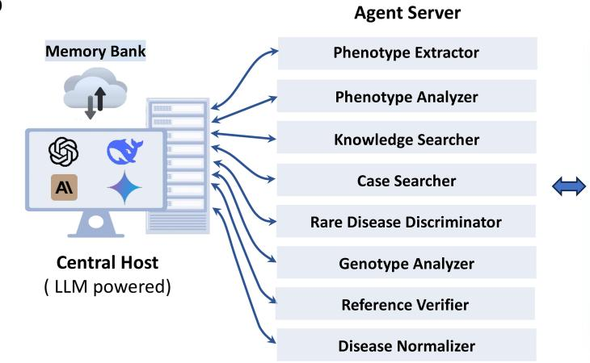

# External Data Source

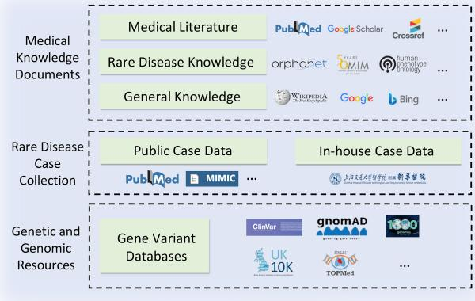

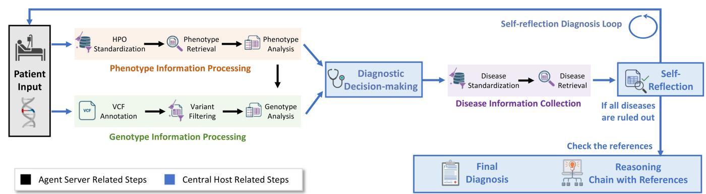

Extended Data Fig. 1 | Overview of the DeepRare system. a, The input consists of patient free-text information, structured HPO IDs, or any combination of them. b, The three-level components in DeepRare. Inspired by the MCP, our system can also be analogized to a personal computer system architecture, comprising: (1) a central host with a memory bank for centrally managing and coordinating the system, analogous to the main computer processing system; (2) multiple agent servers to organize tools, execute specific tasks, and interact with the external environment, analogous to auxiliary hardware assistant equipment; (3) comprehensive external data sources, representing a complete external rare-disease diagnostic environment, supporting the entire system by various medical reliable evidence, including medical knowledge and clinical cases. c, The flowchart of the main workflow of our system illustrates two primary stages, i.e., the information collection stage and the self-reflection diagnosis stage. In the former, the central host actively collects medical support information relevant to the patient. In the latter, the central host performs self-reflection on its diagnostic results. Steps involving the central host are highlighted in blue boxes within the flowchart. Illustrations created using BioRender (https://biorender.com).

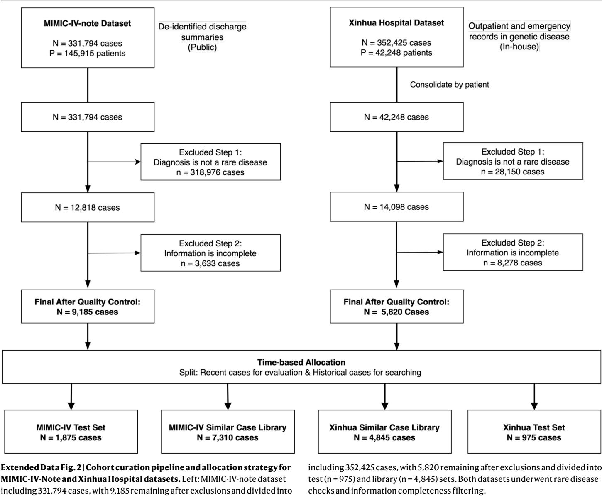  
test $( \mathsf { n } = \mathsf { 1 } , 8 7 5 )$ ) and library $\mathbf { ( n = 7 , } 3 1 0 _ { , }$ ) sets. Right: Xinhua Hospital dataset

# Clinical Data Entry

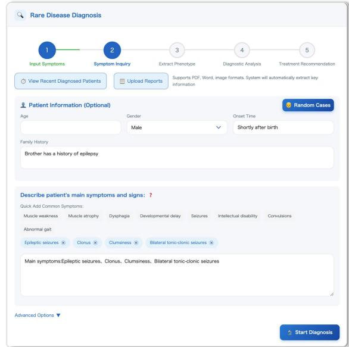

# Systematic Clinical Inquiry

# Detailed Symptom Inquiry

# Reason for Inquiry:

onsetasodudtatttt metabolic disorders, or neurodegenerative diseases

Continue Phenotype Analysis

# Clinical Report Generation

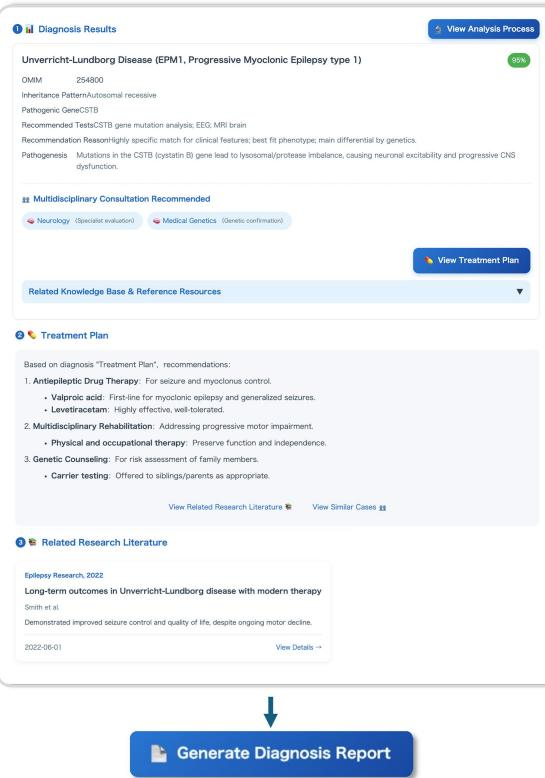

# HPO Phenotype Mapping

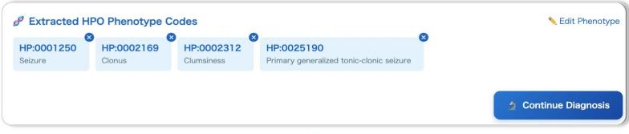

# ↓

# Diagnostic Analysis and Output

# HPO Phenotype Analysis

Next,Iwillextract standardized Human Phenotype Ontology (HPO) terms from the patient's clinical manifestations and analyze the associations between these phenotypesand possible diseases.

# Information Retrieval

Provide support for diagnosis through literature and case retrieval

# Preliminary Diagnosis

Based on the previous analysis,I willform a preliminary diagnosis,listing five possible diagnoses and their probability ranking.

# Reflective Judgment

Before reaching a final diagnosis, conduct critical reflection on each possible diagnosis

Final Diagnosisand Treatment Recommendations

Based on the comprehensive analysis above,I willprovide the final diagnosis, complete treatment recommendations,andprognosisassessment

Extended Data Fig. 3 | The five-stage DeepRare web application workflow. First, clinical data entry: input of demographic parameters, family history, and clinical manifestations with optional file uploads (medical images, lab reports, VCF files). Second, systematic clinical inquiry: AI-guided symptom refinement for organ involvement and disease progression. Third, HPO phenotype mapping:

automated terminology standardization with a clinician-curated adjustment interface. Fourth, diagnostic analysis: integrated tool orchestration generating evidence-based recommendations. Finally, report downloading: automated export of structured clinical reports (PDF/Word).

# Article

Extended Data Table 1 | Multi-center benchmark characteristics   

<table><tr><td></td><td>RareBench (MME)</td><td>RareBench (HMS)</td><td>RareBench (LIRICAL)</td><td>RareBench (RAMEDIS)</td><td> MyGene2</td><td> DDD</td><td>MIMIC-IV- Rare</td><td>Xinhua Hosp.</td><td>Hunan Hosp.</td></tr><tr><td>Cases</td><td>40</td><td>88</td><td>370</td><td>624</td><td>146</td><td>2.283</td><td>1,875</td><td>975</td><td>162</td></tr><tr><td>Avg Info Content</td><td>52.7</td><td>103.7</td><td>59.5</td><td>46.1</td><td>29.4</td><td>70.9</td><td>50.1</td><td>16.4</td><td>27.5</td></tr><tr><td>Avg HPO Ids</td><td>12.2</td><td>19.4</td><td>14.3</td><td>10.1</td><td>7.9</td><td>18.0</td><td>10.1</td><td>4.0</td><td>7.0</td></tr><tr><td> Rare Diseases</td><td>17</td><td>39</td><td>252</td><td>74</td><td>58</td><td>2150</td><td>355</td><td>314</td><td>106</td></tr><tr><td> Source</td><td>Literature</td><td>Clinical Center (Germany)</td><td>Literature</td><td>Scientist Uploaded</td><td>Patients Uploaded</td><td>Literature</td><td>Clinical Center (USA)</td><td>Clinical Center (China)</td><td>Clinical Center (China)</td></tr><tr><td>Public</td><td>√</td><td>√</td><td>√</td><td>√</td><td>√</td><td>√</td><td>√</td><td>X</td><td>×</td></tr><tr><td>Raw Genome Data</td><td>○</td><td>O</td><td>O</td><td>O</td><td>0</td><td>0</td><td>○</td><td>：</td><td>：</td></tr></table>

Case distributions, phenotypic complexity (HPO metrics), disease spectrum, provenance, and genetic annotation status (solid: confirmed pathogenic variants; half-solid: candidate variants extracted; hollow: no genetic data).

# nature portfolio

# Reporting Summary

Nature Portfolio wishes to improve the reproducibility of the work that we publish. This form provides structure for consistency and transparency in reporting. For further information on Nature Portfolio policies, see our Editorial Policies and the Editorial Policy Checklist.

# Statistics

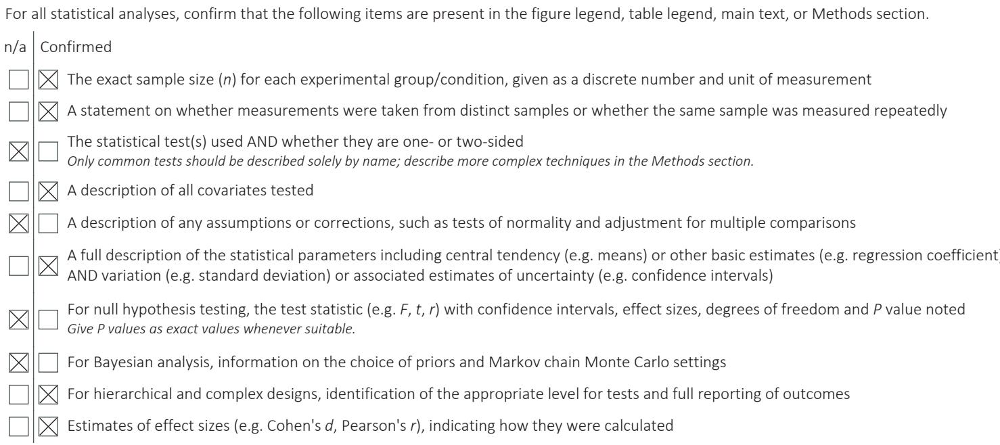

Our web collection on statistics for biologists contains articles on many of the points above.

# Software and code

Policy information about availability of computer code

Data collection

Data collection and preparation scripts was collected by python 3.10.16.

Data analysis

The whole framework was implemented in Python 3.10.16. Our source code is available at https://github.com/MAGIC-AI4Med/DeepRare.   
Additionally, the extended web application developed for this research is hosted at https://deeprare.cn.

The DeepRare system supports multiple LLM providers for flexible deployment. In our experiments, we evaluated the following LLM versions: GPT-4o (version identifier: gpt-4o-2024-11-20, released May 2024), DeepSeek-V3 (version identifier: deepseek-ai/DeepSeek-V3, 671B parameters, released December 2024), Gemini-2.0-flash (version identifier: gemini-2.0-flash, released December 2024), Claude-3.7-Sonnet (version identifier: claude-3-7-sonnet, released February 2025), OpenAI-o3-mini (version identifier: o3-mini-2025-01-31, released January 2025), DeepSeek-R1 (version identifier: deepseek-ai/DeepSeek-R1, 671B parameters, released January 2025), Gemini-2.0-FT (version identifier: gemini-2.0-flash-thinking-exp-01-21, released January 2025), Claude-3.7-Sonnet-thinking (version identifier: claude-3-7- sonnet-20250219-thinking, released January 2025), Baichuan-M1 (version identifier: baichuan-inc/Baichuan-M1-14B-Instruct, 14B parameters, released January 2025), and MMedS-Llama 3 (version identifier: Henrychur/MMedS-Llama-3-8B, 8B parameters, released January 2025).

For manuscripts utilizing custom algorithms or software that are central to the research but not yet described in published literature, software must be made available to editors and reviewers. We strongly encourage code deposition in a community repository (e.g. GitHub). See the Nature Portfolio guidelines for submitting code & software for further information.

# Data

Policy information about availability of data

All manuscripts must include a data availability statement. This statement should provide the following information, where applicable:

- Accession codes, unique identifiers, or web links for publicly available datasets - A description of any restrictions on data availability - For clinical datasets or third party data, please ensure that the statement adheres to our policy

In this study, we utilized six data sources: i.e., RareBench, MyGene2, the Deciphering Developmental Disorders (DDD) study, MIMIC-IV, Xinhua Hosp., and Hunan Hosp..

The first four datasets are publicly available and can be accessed as follows: RareBench (MME, HMS, LIRICAL, and RAMEDIS subsets) at https://huggingface.co/ datasets/chenxz/RareBench; MyGene2 at https://dataverse.harvard.edu/dataset.xhtml?persistentId=doi:10.7910/DVN/TZTPFL ; DDD at https:// www.deciphergenomics.org/ddd/ddgenes; and MIMIC-IV at https://physionet.org/content/mimiciv/3.1/.

The remaining two datasets, namely Xinhua Hosp. and Hunan Hosp., have been deposited in public repositories at the National Genomics Data Center (NGDC), China National Center for Bioinformation (CNCB). The overall project is archived under the accession number PRJCA052720 at https://ngdc.cncb.ac.cn/bioproject/ browse/PRJCA052720 . Variant data have been submitted to the Genome Variation Map (GVM) under the accession numbers GVM001237 ( https:// ngdc.cncb.ac.cn/gvm/getProjectDetail?project=GVM001237 ) and

GVM001238 ( https://ngdc.cncb.ac.cn/gvm/getProjectDetail?project=GVM001238 ), and metadata/clinical phenotype information to the Open Multi-Omics Information eXchange (OMIX) under the accession OMIX013512 ( https://ngdc.cncb.ac.cn/omix/preview/bOQCkDQO ). To protect participant confidentiality, the genetic data and clinical records are available to the scientific community for research through a controlled access process. Access can be requested by submitting an application that includes a detailed research proposal and an IRB approval from the applicant’s home institute to the Data Access Committee of Xinhua Hospital, Shanghai Jiao Tong University School of Medicine via the NGDC portal.

# Research involving human participants, their data, or biological material

Policy information about studies with human participants or human data. See also policy information about sex, gender (identity/presentation), and sexual orientation and race, ethnicity and racism.

<table><tr><td>Reporting on sex and gender</td><td>Inouranalysis,wedonot specifically diferentiateby gender inour analysisand treat both genders equallysince mostrare disease datasets do not release gender-related patient information.</td></tr><tr><td>Reporting on race,ethnicity,or other socially relevant</td><td>We have reported the relevant clinical characteristics of each dataset to the best of our knowledge.</td></tr><tr><td>groupings Population characteristics</td><td>Xinhua Hospital Dataset:The studyincluded978 participants from Xinhua Hospital,of whom915 (93.6%)hadcomplete age information.Themean age was 6.26±8.19 years witha medianof 3.00 years,ranging fromOto74 years.Regarding sex</td></tr><tr><td></td><td>distribution,there were512males (52.35%)and415females (42.43%),with51participants (5.22%)having missing sex information. Hunan Hospital Dataset:The Hunan Hospitaldataset comprised 162 participants with amean ageof4.5O±5.O7years anda</td></tr><tr><td></td><td>medianof2.00 years,ranging from 0.01to 30 years.Thesex distribution consistedof95 males (58.64%)and 67females (41.36%).</td></tr><tr><td></td><td>OverallCharacteristics:Both datasets predominantlyincluded pediatricandadolescentpatients,with medianagesof3years and2years respectively.Thesexratios were comparable betweenthe two cohorts,withaslightly higher proportionof males compared to females in both groups (Xinhua:52.35% vs 42.43%; Hunan: 58.64% vs 41.36%).</td></tr><tr><td>Recruitment</td><td>Ourpaperisaretrospectiveanalysisand thereforedoesnotinvolveparticipant recruitment.Allmethods ofin-house cohort organization are presented in Figure 8 of the original paper.</td></tr><tr><td>Ethics oversight</td><td>Our studyisapproved by&quot;Ethics Committee of Xinhua Hospital Afiliated to ShanghaiJiao Tong UniversitySchoolof Medicine&quot;</td></tr></table>

Note that full information on the approval of the study protocol must also be provided in the manuscript.

# Field-specific reporting

lease select the one below that is the best fit for your research. If you are not sure, read the appropriate sections before making your selection.

Life sciences

Behavioural & social sciences

Ecological, evolutionary & environmental sciences

# Life sciences study design

All studies must disclose on these points even when the disclosure is negative.

<table><tr><td rowspan="4">Sample size</td><td>Forpublicencarksedoptedteirialaplsize(35)hchepresetsttaddeauatietdelydi for model performance comparison.</td></tr><tr><td>FortheMIMlC-V-otesdatasetescreeed145,95patientsandecudedthoseitoutarediseasedagossowithincompleteinical information,resultinginn9,85patients.Thefialsamplesizeprovidesadequatestatisticalpowerformodelevaluation,withan8:2 chronological split yielding 7,348 training and 1,837 test samples.</td></tr><tr><td>FortheXinuadatasetamong42,248patientswhounderwentgenetictestingweretainedn=5,820samplesafterapplyingesame inclusioncriteria.Thissamplesizewasdeterminedbytheavailabiltyofconfirmedrarediseasecaseswithcompletegeneticandclinical documentation.Thedatasetwasdividedintoalibraryset(n=4,845)forbuildingthereferencedatabaseandatestset(n=975)for</td></tr><tr><td>independentevaluation.Thisalocationensuresacomprehensivereferencelibraryhilemaintaiinganadequatelysizedheld-outestset forunbiased performance assessment. TheHunandataset (n=162)servesasanindependentexteralvalidatiocohorttoasessmodelgeneralizabilityacrossdiferentliical</td></tr><tr><td>Data exclusions</td><td>setingsandpatintpopulatios.Althoughsmallrinsize,thisdatasetisuffcientforexteralvalidationpurposesaitrepresetseal- world clinical scenarios from a geographically distinct institution. Ourexclusiostrategyconsistedoftwocriteria:1)excludingpatientswhosediagnosticresultsdidnotidicaterarediseasesorhorined</td></tr><tr><td>Replication</td><td>undiagnosed,and 2) excluding patients with incomplete recorded information. Wereleaseallthecodestomakesureallesultsarereproducibleaongwithawebsitefrolineuage.Forteinicalevaluatioinvolving humaspecialistsachsesdepedentsessdars.Aalidatiemtsreesfulmostratingsistt</td></tr><tr><td>Randomization</td><td>performance across different cohorts. Thisisotrelevanttoourstudyaswedonotivolvepatientisecomparisos.Ourmainfocusisoncomparingdierentmethodsusingthe</td></tr><tr><td>Blinding</td><td>same dataset; therefore,all available data is utilized. Evaluations wereconductedinablinded manner,withhumanspecialistsunawareofthestudyarmassignmentsforeachcase.</td></tr></table>

# Reporting for specific materials, systems and methods

We require information from authors about some types of materials, experimental systems and methods used in many studies. Here, indicate whether each material system or method listed is relevant to your study. If you are not sure if a list item applies to your research, read the appropriate section before selecting a response.

# Materials & experimental systems

# Methods

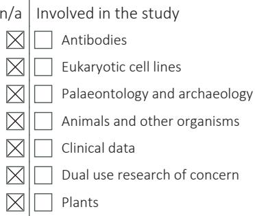

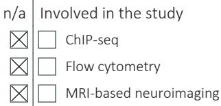

# Plants

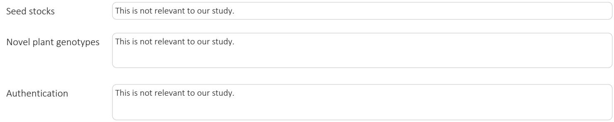