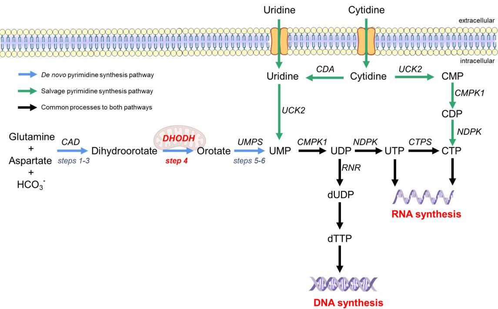
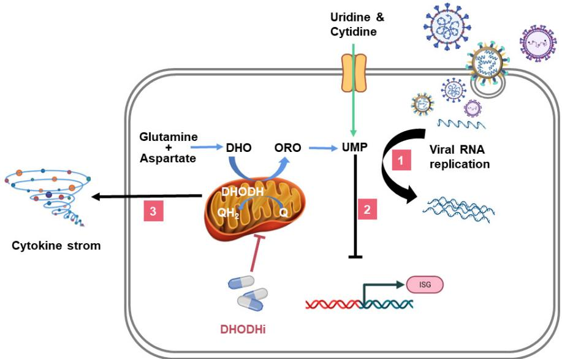
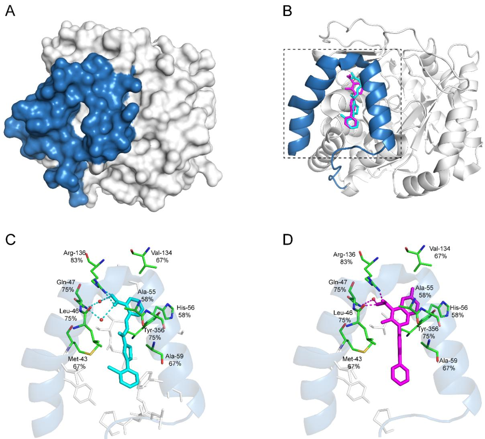

# Review A Broad Antiviral Strategy: Inhibitors of Human DHODH Pave the Way for Host-Targeting Antivirals against Emerging and Re-Emerging Viruses

Yucheng Zheng 1, Shiliang Li $2 \textcircled { \left[ \left[ \right] \right] }$ , Kun Song 1, Jiajie Ye 1, Wenkang Li $\mathbf { 1 } _ { \textcircled { 1 0 } }$ , Yifan Zhong 1, Ziyan Feng 2, Simeng Liang 1, Zeng Cai $^ { 1 , 3 \oplus }$ and Ke Xu $^ { 1 , 3 , * \oplus }$

Citation: Zheng, Y.; Li, S.; Song, K.; Ye, J.; Li, W.; Zhong, Y.; Feng, Z.; Liang, S.; Cai, Z.; Xu, K. A Broad Antiviral Strategy: Inhibitors of Human DHODH Pave the Way for Host-Targeting Antivirals against Emerging and Re-Emerging Viruses. Viruses 2022, 14, 928. https:// doi.org/10.3390/v14050928

Academic Editor: Qiang Ding

Received: 24 March 2022   
Accepted: 25 April 2022   
Published: 28 April 2022

Publisher’s Note: MDPI stays neutral with regard to jurisdictional claims in published maps and institutional affiliations.

1 State Key Laboratory of Virology, College of Life Sciences, Wuhan University, Wuhan 430072, China; 2020102040034@whu.edu.cn (Y.Z.); kunsong@whu.edu.cn (K.S.); 2019202040053@whu.edu.cn (J.Y.); liwenkang@whu.edu.cn (W.L.); 2021202040011@whu.edu.cn (Y.Z.); 2015301060039@whu.edu.cn (S.L.); caiz@whu.edu.cn (Z.C.)   
2 State Key Laboratory of New Drug Design, School of Pharmacy, East China University of Science and Technology, Shanghai 200237, China; shiliangli@ecust.edu.cn (S.L.); ziyan_fe@163.com (Z.F.)   
3 Institute for Vaccine Research, Animal Biosafety Level 3 Laboratory at Center for Animal Experiments, Wuhan University, Wuhan 430072, China   
￥ Correspondence: xuke03@whu.edu.cn; Tel.: +86-27-68756997; Fax: +86-27-68754592

Abstract: New strategies to rapidly develop broad-spectrum antiviral therapies are urgently required for emerging and re-emerging viruses. Host-targeting antivirals (HTAs) that target the universal host factors necessary for viral replication are the most promising approach, with broad-spectrum, foresighted function, and low resistance. We and others recently identified that host dihydroorotate dehydrogenase (DHODH) is one of the universal host factors essential for the replication of many acute-infectious viruses. DHODH is a rate-limiting enzyme catalyzing the fourth step in de novo pyrimidine synthesis. Therefore, it has also been developed as a therapeutic target for many diseases relying on cellular pyrimidine resources, such as cancers, autoimmune diseases, and viral or bacterial infections. Significantly, the successful use of DHODH inhibitors (DHODHi) against severe acute respiratory syndrome coronavirus 2 (SARS-CoV-2) infection further supports the application prospects. This review focuses on the advantages of HTAs and the antiviral effects of DHODHi with clinical applications. The multiple functions of DHODHi in inhibiting viral replication, stimulating ISGs expression, and suppressing cytokine storms make DHODHi a potent strategy against viral infection.

Keywords: host-targeting antivirals (HTAs); DHODH inhibitors (DHODHi); pyrimidine synthesis; broad-spectrum antivirals

# 1. Introduction

In recent years, emerging or re-emerging viruses have appeared with increasing frequency, severely threatening global public health security and causing enormous economic losses [1]. At present, the World Health Organization has announced six international public health emergencies, the H1N1 influenza pandemic in 2009 [2], the polio epidemic in 2014 [3], the Ebola epidemic in West Africa in 2014 [4], the Zika epidemic in 2015–2016 [5], the Ebola epidemic in the Democratic Republic of Congo that began in 2018 (announced in July 2019) [6,7], and the severe acute respiratory syndrome coronavirus 2 (SARS-CoV-2) pneumonia pandemic that broke out at the end of 2019 [8]. In addition, Middle East respiratory syndrome coronavirus (MERS-CoV), SARS-CoV, dengue virus (DENV), Chikungunya virus, and other viruses cause epidemic infections worldwide [9–12]. These virus epidemics and pandemics remind us that a broad-spectrum antiviral must be prepared to combat the continual outbreaks of various viruses.

At present, most approved antivirals target viral proteins to inhibit specific steps in the viral infection cycle and are called direct-acting antivirals (DAAs). Taking SARS-CoV-2 as an example, in the rush of anti-SARS-CoV-2 drug development competition, remdesivir is highly expected. It targets viral RNA-dependent RNA polymerase (RdRp) to terminate viral RNA chain elongation by competing with the natural substrate of RdRp, adenosine triphosphate [13,14]. Unfortunately, although remdesivir showed fair anti-SARS-CoV-2 activity in vitro, clinical results showed no significant benefit compared with placebo [15,16], probably because of three reasons. (1) Remdesivir needs to be converted into remdesivir-TP in vivo to function [17,18]. (2) Remdesivir is originally developed by targeting the Ebola virus (EBOV) RdRp [19], making it unlikely to have an equivalent impact on the SARS-CoV-2 RdRp because of the plasticity of the virus. (3) The proofreading function of SARS-CoV-2 nsp14 exonuclease limits the potential of remdesivir [20]. Similar to remdesivir, many DAAs have been proven to be clinically successful only against a certain kind of virus but not others. Overall, DAAs have some inherent disadvantages. (1) They have narrow-spectrum antiviral properties. Viral proteins usually share few structural similarities among different species or classes. (2) Drug resistance develops against DAAs. DAAs act directly on viral proteins, promoting mutagenesis during viral replication. (3) DAAs are expensive and inefficient. DAAs apply the “one bug, one drug” strategy so that the development of individual DAA to each virus is an expensive and inefficient process in the context of continually emerging viruses [21].

Viruses are obligate parasites that rely entirely on the internal host environment to produce progeny viral particles. Therefore, viruses usually need to hijack the host machinery to replicate. For this reason, host-targeting antivirals (HTAs), which target the host factors required for viral infection, represent a broad-spectrum antiviral strategy. Moreover, the treatment of acute viral infections requires only a few days, greatly facilitating tolerance of the relative toxicity from the targeted host pathway. Compared with DAAs, HTAs have advantages. (1) HTAs show broad-spectrum antiviral activities because viruses use many of the same host proteins to replicate. (2) HTAs may also be effective against future emerging viruses. HTAs inhibit the host proteins essential for viral replication, which may also be effective against emerging viruses. (3) HTAs poorly induce the development of drug resistance. The host genetic material is double-stranded DNA with a lower mutation rate than RNA. Table 1 summarizes the host targets for antiviral treatment, such as dihydroorotate dehydrogenase (DHODH), chemokine receptor type 5, inosine monophosphate dehydrogenase, cyclophilins, eukaryotic initiation factor $2 \alpha ,$ dihydrofolate reductase, and et al.

Table 1. Host targets and antiviral activities of host-targeting antivirals (HTAs)   

<table><tr><td>Host Targets</td><td>Description of Host Targets</td><td>HTAs</td><td>Known Antiviral Effects</td></tr><tr><td>DHODH</td><td>The rate-limiting enzyme in the de novo pyrimidine synthesis pathway</td><td>Leflunomide, teriflunomide, and brequinar</td><td>Influenza virus,HBV,HCV, EBOV, DENV, SARS-CoV-2, HIV,and ZIKV</td></tr><tr><td>Chemokine receptors type 5</td><td>A G-protein coupled receptor, which is an HIV-1 co-receptor associated with CXCR4</td><td>Maraviroc,PF-232798,TAK-220, and INCB9471</td><td>HIV</td></tr><tr><td>Inosine monophosphate dehydrogenase</td><td>The rate-limiting enzyme in the de novo biosynthesis of guanine nucleotides</td><td>Ribavirin,mycophenolic acid, mycophenolate mofetil,and mizoribine</td><td>RSV, HCV, HBV, HCMV, EMCV, ZIKV, and EBOV</td></tr><tr><td>Cyclophilins</td><td>A peptidyl-prolyl isomerase, catalyzing the isomerization of peptide bonds from trans to cis form at proline residues to facilitate protein folding</td><td>Cyclosporin A, NIM811,and alisporivir</td><td>HCV</td></tr><tr><td>Eukaryotic initiation factor 2α</td><td>A eukaryotic initiation factor required for most eukaryotic translation initiation</td><td>Nitazoxanide, tizoxanide,and RM5061</td><td>Influenza virus,HBV,HCV, EBOV,DENV,JEV,HIV,and ZIKV</td></tr></table>

Table 1. Cont.   

<table><tr><td>Host Targets</td><td>Description of Host Targets</td><td>HTAs</td><td>Known Antiviral Effects</td></tr><tr><td>Dihydrofolate reductase</td><td>An enzyme converting dihydrofolate into tetrahydrofolate for the de novo synthesis of purines, thymidylic acid,and certain amino acids</td><td>Methotrexate,trimetrexate,and 1-aryl-4,6-diamino-1,2- dihydrotriazines</td><td>ZIKV, influenza virus, and RSV</td></tr><tr><td>α-Glucosidase</td><td>An enzyme catalyzing the hydrolysis of glycosidic bonds in complex sugars</td><td>NB-DNJ and Celgosivir</td><td>HIV,HV,hu coronavirus, influenza A virus,and DENV</td></tr><tr><td>Kinases</td><td>An enzyme that catalyzes the transfer of phosphate groups from high-energy, phosphate-donating molecules to specific substrates</td><td>Sunitinib and erlotinib</td><td>DENV and EBOV</td></tr><tr><td>Sodium taurocholate cotransporting polypeptide</td><td>A multiple transmembrane transporter involved in the circulation of bile acids,and served as a common receptor of HBV and HDV</td><td>Myrcludex B, CsA,ezetimibe, and ritonavir</td><td>HBV and HDV</td></tr><tr><td>Farnesoid X receptor</td><td>A nuclear bile acid receptor that regulates the expression of bile acid transporters</td><td>GW4064,WAY362450, fexaramine,and chenodeoxycholic acid</td><td>HBV</td></tr><tr><td>Diacylglycerol acyltransferases</td><td>An enzyme catalyzing the terminal step in triacylglycerol synthesis</td><td> pradigastat</td><td>HCV</td></tr></table>

DENV, dengue virus; EBOV, Ebola virus; EMCV, encephalomyocarditis virus; HBV, hepatitis B virus; HCV, hepatitis C virus; HCMV, human cytomegalovirus; HDV, hepatitis D virus; HIV, human immunodeficiency virus; JEV, Japanese encephalitis virus; RSV, respiratory syncytial virus; SARS-CoV-2, severe acute respiratory syndrome coronavirus 2; ZIKV, Zika virus.

# 2. The Pyrimidine Synthesis Pathway Is a Reliable HTA Target

Pyrimidine is a heterocyclic compound and a vital component of cells [22]. Therefore, antivirals targeting the pyrimidine synthesis pathway may be effective and have a broad spectrum of activity. Pyrimidine participates in synthesizing not only nucleotides but also polysaccharides and phospholipids, which play an essential role in human metabolism. When cells become cancerous [23] or infected by pathogenic microorganisms [24,25], the overall metabolic activity and the demand for pyrimidines are increased compared with those in quiescent cells. Munger et al. researched human cytomegalovirus (HCMV)-infected human fibroblasts using liquid chromatography–tandem mass spectrometry and identified 167 differentially abundant metabolites. Among these metabolites, those related to de novo pyrimidine biosynthetic pathways, such as carbamoyl-aspartic acid, cytidine triphosphate, uridine triphosphate, and thymidine triphosphate, were significantly enriched compared to those in the uninfected group [26]. Another study by Consigli et al. found a similar phenomenon. The activity of aspartate transcarbamylase, which is essential for pyrimidine synthesis, was significantly increased in adenovirus type 5-infected HeLa cells [27]. These reports suggested that viruses would hijack the host pyrimidine synthesis pathway to benefit their replication.

There are two ways to synthesize pyrimidines in the human body, namely, the de novo biosynthesis and salvage pathways [25], as shown in Figure 1. The salvage pathway utilizes extracellular uridine or cytidine to resynthesize pyrimidine nucleotides through simple enzymatic reactions (green arrow in Figure 1). The salvage pathway is the primary source of quiescent or differentiated cells, but it is insufficient to provide the pyrimidine pool for highly proliferating and virus-infected cells [28,29]. Therefore, the de novo synthesispool for highly proliferating and virus-infected cells [28,29]. Therefore, the de novo synthepathway is required for these cells. The de novo synthesis pathway provides a large pool ofsis pathway is required for these cells. The de novo synthesis pathway provides a large pyrimidine nucleotides by using simple precursor molecules (such as amino acids,pool of pyrimidine nucleotides by using simple precursor molecules (such as amino $\mathrm { C O } _ { 2 }$ and pentose phosphate) as substrates through a series of complex enzymatic reactions (blueCO2, and pentose phosphate) as substrates through a series of complex enzymatic reacarrow in Figure 1) [30]. Step 4 is the rate-limiting step in the de novo synthesis pathway, andtions (blue arrow in Figure 1) [30]. Step 4 is the rate-limiting step in the de novo synthesis dihydroorotate dehydrogenase (DHODH) is the only enzyme that oxidizes dihydroorotatepathway, and dihydroorotate dehydrogenase (DHODH) is the only enzyme that oxidizes (DHO) acid to orotate (ORO) [31].dihydroorotate (DHO) acid to oro

  
Figure 1. Pyrimidine synthesis pathway in humans. The de novo synthesis pathway of pyrimidine is Figure 1. Pyrimidine synthesis pathway in humans. The de novo synthesis pathway of pyrimidine is represented by blue arrows, and the salvage pathway is represented by green arrows. The de novorepresented by blue arrows, and the salvage pathway is represented by green arrows. The de novo synthesis pathway begins with dihydroorotate from glutamine and aspartate under the action ofsynthesis pathway begins with dihydroorotate from glutamine and aspartate under the action of CAD multifunctional enzymes (steps 1–3). The mitochondrial inner membrane protein DHODH oxidizes DHO to produce orotate (step 4). Orotate is subsequently phosphorylated and produces UMP from and cytidine can be transformed into UMP and CTP, respectively. UDP is the raw material for DNAthe bifunctional enzyme UMPS (steps 5–6). In the salvage pathway, exogenous uridine and cytidine synthesis. CTP and UTP are the raw materials for RNA synthesis. CAD, carbamoyl phosphate syn-can be transformed into UMP and CTP, respectively. UDP is the raw material for DNA synthesis. CTP thetase, aspartate transcarbamoylase, and dihydroorotase; UMP, uridine monophosphate;and UTP are the raw materials for RNA synthesis. CAD, carbamoyl phosphate synthetase, aspartate DHODH, dihydroorotate dehydrogenase; UDP, uridine diphosphate; UTP, uridine triphosphate; transcarbamoylase, and dihydroorotase; UMP, uridine monophosphate; DHODH, dihydroorotate CMP, cytidine monophosphate; CDP, cytidine diphosphate; CTP, cytidine triphosphate; CTPS, CTP dehydrogenase; UDP, uridine diphosphate; UTP, uridine triphosphate; CMP, cytidine monophosphate; synthase; dUDP, deoxy-UDP; dTTP, deoxythymidine triphosphate; UMPS, uridine monophosphate CDP, cytidine diphosphate; CTP, cytidine triphosphate; CTPS, CTP synthase; dUDP, deoxy-UDP; synthetase; CMPK, cytidine monophosphate kinase; NDPK, nucleoside-diphosphate kinase; CDA, dTTP, deoxythymidine triphosphate; UMPS, uridine monophosphate synthetase; CMPK, cytidine monophosphate kinase; NDPK, nucleoside-diphosphate kinase; CDA, cytidine deaminase; UCK, uridine or cytidine kinase; RR, ribonucleotide reductase.

# The de novo pyrimidine synthesis pathway is divided into six steps (Figure 13. The Essential Role of DHODH in the De Novo Pyrimidine Synthesis Pathway

first three steps proceed via the multifunctional CAD (carbamyl phosphate synthase, The de novo pyrimidine synthesis pathway is divided into six steps (Figure 1) [30]. aspartate transcarbamylase, and dihydroorotate) enzymes catalyzing the conversion of L-The first three steps proceed via the multifunctional CAD (carbamyl phosphate synthase, glutamine, aspartic acid, and bicarbonate to dihydroorotate (DHO) (steps 1–3). Then, the aspartate transcarbamylase, and dihydroorotate) enzymes catalyzing the conversion of mitochondrial membrane protein dihydroorotate dehydrogenase (DHODH) oxidizes L-glutamine, aspartic acid, and bicarbonate to dihydroorotate (DHO) (steps 1–3). Then, the mitochondrial membrane protein dihydroorotate dehydrogenase (DHODH) oxidizes DHO to ORO (step 4), which is the rate-limiting step of the de novo pyrimidine synthesis pathway [32]. ORO undergoes the action of orotate phosphoribosyltransferase and orotate $5 ^ { \prime }$ -monophosphate decarboxylase to generate uridine monophosphate (steps 5 and 6). In step 4, DHODH, as an oxidoreductase, removes two electrons from DHO and transfers them to flavin mononucleotide (FMN). FMN regeneration is necessary for sustained DHODH catalysis. For this reason, ubiquinone, the electron acceptor in the mitochondrial electron transport chain, is required to receive electrons from FMN to complete the catalytic cycle [30]. This specific role of DHODH, which is involved in the de novo pyrimidine synthesis and links this pathway to the electron transport chain of aerobic respiration, makes DHODH the most attractive drug target in the pyrimidine synthesis pathway.DHODH inhibitors (DHODHi) have been used to treat malignant tumors, auto

DHODH inhibitors (DHODHi) have been used to treat malignant tumors, autoimmune diseases, viral or bacterial infections, parasitic diseases, and other diseases diseases, viral or bacterial infections, parasitic diseases, and other diseases [23,31,33–35].[23,31,33–35]. DHODHi inhibit viral infection by three mechanisms: (1) inhibiting viral DHODHi inhibit viral infection by three mechanisms: (1) inhibiting viral replication (path-replication (pathway 1 in Figure 2), (2) promoting interferon-stimulated genes (ISGs) exway 1 in Figure 2), (2) promoting interferon-stimulated genes (ISGs) expression (pathway 2pression (pathway 2 in Figure 2), and (3) regulating inflammation (pathway 3 in Figure in Figure 2), and (3) regulating inflammation (pathway 3 in Figure 2). This article reviews2). This article reviews the critical role of DHODH in the de novo pyrimidine synthesis the critical role of DHODH in the de novo pyrimidine synthesis pathway during viralpathway during viral infections, with examples of several DHODHi and their clinical apinfections, with examples of several DHODHi and their clinical applications.plications.

  
Figure 2. The role of DHODHi in viral infection. The triple mechanism of DHODHi is as follows: Figure 2. The role of DHODHi in viral infection. The triple mechanism of DHODHi is as follows: (1) DHODHi reduce the pyrimidine pool required for viral replication; (2) DHODHi activate ISGs (1) DHODHi reduce the pyrimidine pool required for viral replication; (2) DHODHi activate ISGs expression; and (3) DHODHi suppress the inflammatory factor storm caused by the virus. The expression; and (3) DHODHi suppress the inflammatory factor storm caused by the virus. The mechanisms by which human cells obtain pyrimidines: the de novo biosynthesis (blue arrow) and the salvage pathway (green arrow). UMP, uridine monophosphate; DHO, dihydroorotate; ORO, orotate; $\mathrm { Q } ,$ ubiquinone; $\mathrm { Q H } _ { 2 } .$ , ubiquinol; ISG, interferon-stimulated gene.

# 4. DHODHi Inhibit the Virus Replication Cycle

Cytosine, thymine, and uridine are essential components of DNA and RNA. Therefore, Cytosine, thymine, and uridine are essential components of DNA and RNA. There-viral genome replication requires the synthesis of large amounts of pyrimidines, which ore, viral genome replication requires the synthesis of large amounts of pyrimidines, enables the broad-spectrum antiviral activity of DHODHi. Compared with DNA viruses, which enables the broad-spectrum antiviral activity of DHODHi. Compared with DNA RNA viruses require the unique uridine monophosphate (particular nucleotide produced viruses, RNA viruses require the unique uridine monophosphate (particular nucleotide by DHODH) in their genomes instead of thymidine monophosphate, which suggests that produced by DHODH) in their genomes instead of thymidine monophosphate, which RNA viruses are more sensitive to DHODH activity [36]. At present, increasing studies suggests that RNA viruses are more sensitive to DHODH activity [36]. At present, increas-have found that DHODHi inhibit the replication of RNA viruses, especially from the early ng studies have found that DHODHi inhibit the replication of RNstage of the virus replication cycle. In IBRS-2 cells infected with $1 0 0 \mathrm { \ T C I D } _ { 5 0 }$ especially of FMDV rom the early stage of the virus replica(O/MY98/BY/2010), administration of $3 0 0 \mu \mathrm { M }$ e. In IBRS-2 cells infected with 100 TCID50 teriflunomide at the early stage of infection o( $_ { \mathrm { 0 - 4 h } }$ V (O/MY98/BY/2010), administration of after infection) significantly inhibited $9 9 \%$ μM teriflunomide at the early stage of  of the 2B mRNA level and VP1 viral protein expression [32]. Similarly, in a Junin virus-infected Vero cell model $( \mathrm { M O I } = 0 . 1 $ ), $5 0 ~ \mu \mathrm { M }$ teriflunomide mainly inhibited viral replication in the early and middle stages ( $_ { \mathrm { 0 - 6 h } }$ after infection) [37]. Intriguingly, in Vero or A549 cell models infected with DENV serotype 2 $\left( \mathrm { M O I } = 2 \right)$ ), brequinar inhibited not only the early and middle phases, but also the

later phases (RNA synthesis, virion assembly, or release) of the viral replication cycle [38].   
Therefore, DHODHi may have potent antiviral effects at all steps of RNA virus replication.

Although not as powerful as they are against RNA viruses, DHODHi are also reported to inhibit the replication of DNA viruses. For example, in HCMV (Towne strain)-infected human primary embryonic lung fibroblasts (HEL 299), FK778, an oral DHODHi, exhibited a potential antiviral effect with an $\mathrm { E C } _ { 5 0 }$ of $1 . 9 7 \mu \mathrm { M }$ [39]. In the A549 cell model infected with human adenovirus 5 $( \mathrm { M O I } = 5 ) $ ), the virus titers were reduced by 6 logs by compound A3. Vaccinia virus was also sensitive to compound A3 [35].

# 5. DHODHi Stimulate the Expression of ISGs

Lucas-Hourani et al. screened stimulators of the innate antiviral response and established a link between pyrimidine biosynthesis and ISGs expression [40]. They identified a DHODHi, DD264, which possessed ideal antiviral effects by enhancing ISGs expression. Moreover, supplementation with uridine abolished the amplification of ISGs expression by DD264. However, whether DHODHi induction of the expression of ISGs depends on the classic JAK-STAT pathway is not yet clear. Jin et al. used the JAK inhibitor CP-690550 to block the JAK-STAT pathway in Peste des petits ruminants virus (PPRV)-infected HEK293T cells. Surprisingly, the transcription of ISGs could still be upregulated by brequinar. This result indicated that the induction of ISGs by brequinar was independent of the JAK-STAT pathway [41]. In addition, an anti-influenza virus study suggested that leflunomide could still play an antiviral role after inhibiting the tyrosine phosphorylation of JAK1 and JAK3 [42]. In contrast, the antiviral activity of FA-613 relied on interferon-dependent ISGs stimulation [43]. It seems that different DHODHi activate ISGs expression by triggering different pathways.

# 6. DHODHi Inhibit the Production of Inflammatory Cytokines

For a long time, cytokines and chemokines have been considered to play essential roles in immunopathology during viral infection, because excessive virus-induced inflammation contributes to severe disease and death [44–49]. The DHODHi, such as leflunomide and teriflunomide, have been clinically used to treat autoimmune diseases and suppress cytokine production [50–54], they may also regulate excessive inflammation induced by viruses. We previously proved that the combination of S312 and oseltamivir vastly reduced the pathogenic inflammatory cytokine levels of IL6, MCP-1, IL5, KC/GRO (CXCL1), IL2, $\mathrm { I F N - } \gamma ,$ IP-10, IL9, TNF- $\cdot \alpha ,$ GM-CSF, EPO, $\mathrm { I L 1 2 p 7 0 }$ , ${ \mathrm { M I P } } 3 \alpha ,$ and IL17A/F in influenza A virusinfected mice [36]. Similarly, it was reported that elevated inflammatory factor levels are positively correlated with the severity of COVID-19, such as those of IL-2, IL-6, IL-7, IL-10, G-CSF, MCP, ${ \mathrm { M I P } } 1 \alpha ,$ IFN- $\gamma .$ , IP-10, and TNF- $\propto$ [55–60]. Our unpublished data indicated that DHODHi could also regulate hyperinflammation reactions in severe SARS-CoV-2-infected animals by reducing pathogenic inflammatory cytokines levels. Although more research and clinical studies are expected to illustrate the immune-regulation role of DHODHi against SARS-CoV-2 infection, our clinical observation already showed that leflunomide could reduce lung inflammation and the serum C-reactive protein level in COVID-19 patients [61].

Moreover, DHODHi would offer dual effects in minimizing immune overreaction induced by viral infection. It is believed that SARS-CoV-2 induces lung damage in two stages [46,62]. The virus replicates in the lungs directly, causing lung tissue damage in the first stage. The second stage is characterized by the massive expression of cytokines and chemokines and the migration of immune cells to the lungs, resulting in an excessive inflammatory response [55–60,63]. The severity of tissue damage in the first stage determines the degree of inflammation in the second stage. Thus, DHODHi could act in both stages to reduce lung damage by limiting viral replication in the first stage [64] and further inhibit the overexpression of cytokines and chemokines from the residue tissue damage in the second stage [65].

# 7. DHODHi Applications in Antiviral Treatment7. DHODHi Applications in Antiviral TreatA variety of DHODHi have been proven t[64]. Table 2 lists the antiviral activities and t[64]. Table 2 lists the antiviral activities and t

A variety of DHODHi have been proven to inhibit viral infection in vitro and in vivo [64].A variety of DHODHi have been proven to inhibit viral infection in vitro and in [64]. Table 2 lists the antiviral activities and their current clinical applications of m[64]. Table 2 lists the antiviral activities and their current clinical applications of mDHODHi that have been approved or are in the experimental phase. Currently, all DHODHi that have been approved or are in the experimental phase. Currently, all Table 2 lists the antiviral activities and their current clinical applications of major DHODHi[64]. Table 2 lists the antiviral activities and their current clinical applications of mDHODHi that have been approved or are in the experimental phase. Currently, all DHODHi that have been approved or are in the experimental phase. Currently, all human DHODHi target the ubiquinone-binding site in the N-terminal domainhuman DHODHi target the ubiquinone-binding site in the N-terminal domain that have been approved or are in the experimental phase. Currently, all the humanDHODHi that have been approved or are in the experimental phase. Currently, allhuman DHODHi target the ubiquinone-binding site in the N-terminal domainhuman DHODHi target the ubiquinone-binding site in the N-terminal domainDHODH (aa 30–68). Several recurring critical binding residues inside the ubiquinoDHODH (aa 30–68). Several recurring critical binding residues inside the ubiquino DHODHi target the ubiquinone-binding site in the N-terminal domain of DHODH (aahuman DHODHi target the ubiquinone-binding site in the N-terminal domainDHODH (aa 30–68). Several recurring critical binding residues inside the ubiquinoDHODH (aa 30–68). Several recurring critical binding residues inside the ubiquinobinding pocket are targeted repeatedly by different DHODHi, indicating the essentialbinding pocket are targeted repeatedly by different DHODHi, indicating the essential 30–68). Several recurring critical binding residues inside the ubiquinone-binding pocketDHODH (aa 30–68). Several recurring critical binding residues inside the ubiquinbinding pocket are targeted repeatedly by different DHODHi, indicating the essentialthese residues for developing potent DHODHi (Figure 3). these residues for developing potent DHODHi (Figure 3). are targeted repeatedly by different DHODHi, indicating the essentials of these residuesbinding pocket are targeted repeatedly by different DHODHi, indicating the essentiathese residues for developing potent DHODHi (Figure 3). for developing potent DHODHi (Figure 3).these residues for developing potent DTable 2. Ongoing research of DHODHi inTable 2. Ongoing research of DHODHi in

Table 2. Ongoing research of DHODHi in antiviral infections.Table 2. Ongoing research of DHODHi in antiviral inf Molecular Structure Antivinding Site  Molecular Structure Antivi   

<table><tr><td>DHODHi</td><td>Key Binding Site Residues</td><td>Molecular Structure</td><td>Antiviral Activities</td><td>Clinical Applications</td></tr><tr><td>Leflunomide</td><td>Tyr356, Met 43, His56, Ala55,Ala59,Pro364, Val134, Gln47, Arg136, Phe98</td><td>。</td><td>Influenza A virus (H1N1), ZIKV, EBOV, SARS-CoV-2, BK virus, DENV, porcine epidemic diarrhea virus, CMV, RSV,herpes simplex virus type 1,and HCMV</td><td>Phase I/II/III (SARS-CoV-2) Phase I (HIV) Phase II (BK virus)</td></tr><tr><td>Teriflunomide</td><td>Tyr356,Met 43,His56, Ala55,Ala59,Pro364, Val134, Arg136, Gln47, Phe98</td><td>。 OH</td><td>SARS-CoV-2,Human T-lymphotropic virus type-1,JUNV, influena virus (H5N1),EBV,EV71, and HIV</td><td>Phase I/II (HTLV-1)</td></tr><tr><td>Brequinar</td><td>Arg136,Met 43,Gln47, Leu46,Leu42,His56,Tyr38, Pro326,Tyr356, Pro69,Val143,Val134</td><td>HO</td><td>SARS-CoV-2 flaviviruses,alphavirus, rhabdovirus,influenza viruses,EV71,EV70,d Coxsackievirus B3</td><td>Phase I/II (SARS-CoV-2)</td></tr><tr><td>IMU838</td><td>Arg136,Met 43, Gln47, Leu46,Leu42,His56,Tyr38, Pro326,Tyr356,Pro69, Val143, Val134</td><td></td><td>SARS-CoV-2,HCMV, HIV-1,and HCV</td><td>Phase II/III (SARS-CoV-2)</td></tr><tr><td>S416</td><td>Tyr38,Leu42,Met43, Leu46,Gln47,Pro52,Ala55, His56,Ala59,Phe62, Thr63, Leu67,Leu68,Pro69, Phe98,Met111, Val134, Arg136,Val143, Tyr356, Leu359,Thr360</td><td></td><td>Influenza A virus (H1N1, H3N2,H9N2),ZIKV, EBOV,and SARS-CoV-2</td><td></td></tr><tr><td>S312</td><td>Tyr38,Leu42,Met43, Leu46,Gln47,Pro52,Ala55, His56,Ala59,Phe62, Thr63, Leu67, Leu68,Pro69, Phe98, Met111, Val134, Arg136,Val143,Tyr356,</td><td></td><td>Influenza virus (H1N1, H3N2,H9N2),ZIKV, EBOV,and SARS-CoV-2</td><td></td></tr><tr><td>FA-613</td><td>Leu359,Thr360 Tyr356,Arg136,Ala55, Ala59,Leu 46,Thr360</td><td>OH O= CH</td><td>Influenza A virus (H5N1 and H7N9),EV-A71,RV, human rhinovirus A, SARS-CoV,and MERS-CoV</td><td></td></tr></table>

Table 2. Cont.rg136, Ala55rg136, Ala55,   

<table><tr><td>DHODHi</td><td>Key Binding Site Residues</td><td>Molecular Structure</td><td>Antiviral Activities</td><td>Clinical Applications</td></tr><tr><td>PTC299</td><td>Tyr356,Phe98,Met111, Leu68,Pro364,Phe62, Met43,Leu58,Leu46, Leu50, Ala55,Arg136, His56,Ala59,Gln47, Val134,VAL143,Thr63</td><td></td><td>SARS-CoV-2,HCV, Poliovirus,EBOV,and Rift Valley Fever</td><td></td></tr><tr><td>Compound A3</td><td>Tyr356,Arg136,Ala55, Ala59,Leu46,Pro364, Phe336</td><td></td><td>Influenza A virus (A/WSN/33), influenza B virus (B/Yamagata/88), Newcastle disease virus (La Sota), Sendai virus (SV52), Vesicular stomatitis virus, Sindbis virus,HCV, West Nile virus,DENV-1, NYVAC,hAd5,and HIV-1</td><td></td></tr><tr><td>BAY2402234</td><td>Thr63,Tyr38,Leu42,Met43, Leu46,Leu50,Leu58, Ala59,Phe62,Leu67, Leu68,Pro69,Met111, Leu359,Pro364,Thr360</td><td>FF HO</td><td>SARS-CoV-2</td><td></td></tr><tr><td>MEDS433</td><td>Gln47,Phe62, Arg136, Thr360</td><td>HO</td><td>HCoV-OC43,HCoV-229E, SARS-CoV-2,and HSV</td><td></td></tr><tr><td>RYL-634</td><td>Tyr38, Leu42, Leu46, Gln47, Phe62, Leu67,Arg136</td><td></td><td>HCV, DENV, ZIKV, chikungunya virus, EV71, HIV,RSV, severe fever with thrombocytopenia syndrome virus,and influenza virus</td><td></td></tr></table>

  
Figure 3. Recurring residues of DHODHi in ubiquinone-binding site. (A) 3D structure of humFigure 3. Recurring residues of DHODHi in ubiquinone-binding site. (A) 3D structure of human DHODH (PDB ID: 6M2B) with ubiquinone-binding site shown in blue. (B) Ribbon diagram of DHODH (PDB ID: 6M2B) with ubiquinone-binding site shown in blue. (B) Ribbon diagram of human man DHODH in complex with S416 (cyan) and brequinar (purple). The C-terminal region (aa DHODH in complex with S416 (cyan) and brequinar (purple). The C-terminal region (aa 78-395) is 395) is colored in white, and the N-terminal domain concolored in white, and the N-terminal domain consisting of two $\propto$ sting of two α helices (binding sites helices (binding sites for ubiquinone) is colored in blue. (C) Ribbon diagram of the DHODH ubiquinone-binding site in complex with S416 (cyan). S416 binds 9 recurring residues with 4 hydrogen bonds shown in the dashed line. (D) Ribbon ple). Brequinar binds 7 recurring residues with 3 hydrogen bonds shown in the dashed line. (C,diagram of the DHODH ubiquinone-binding site in complex with brequinar (purple). Brequinar The oxygen atom is marked in red, and the nitrogen atom is marked in blue. The water moleculbinds 7 recurring residues with 3 hydrogen bonds shown in the dashed line. (C,D) The oxygen atom depicted as the red ball. Recurring binding residues are indicated as thin green rods, and the cois marked in red, and the nitrogen atom is marked in blue. The water molecule is depicted as the red sponding recurring frequencies among all the listed twelve drugs are marked underneath eball. Recurring binding residues are indicated as thin green rods, and the corresponding recurring amino acid. The other non-recurring binding residues specific to each drug are marked in thin gfrequencies among all the listed twelve drugs are marked underneath each amino acid. The other rods. non-recurring binding residues specific to each drug are marked in thin grey rods.

# 7.1. Leflunomide and Teriflunom7.1. Leflunomide and Teriflunomide

Leflunomide is a prodrug that can be metabolized to its active metabolite terifluLeflunomide is a prodrug that can be metabolized to its active metabolite teriflunomide. mide. Teriflunomide inhibit DHODH activity by noncompetitively binding to ubiqTeriflunomide inhibit DHODH activity by noncompetitively binding to ubiquinone [66] noat an $\mathrm { I C } _ { 5 0 }$ 6] at an ICvalue of $\mathrm { \sim } 6 0 0 ~ \mathrm { n M }$ ∼600 nM[23]. The FDA has approved leflunomide for the cl [23]. The FDA has approved leflunomide for the clinical ical treatment of rheumatoid arthritis and psoriatic arthritis and teriflunomide for the cltreatment of rheumatoid arthritis and psoriatic arthritis and teriflunomide for the clinical ical treatment of multiple sclerosis [67]. Both leflunomide and teriflunomide have betreatment of multiple sclerosis [67]. Both leflunomide and teriflunomide have been proven proven to have various antiviral activities in vitro. They inhibit the replication of SAto have various antiviral activities in vitro. They inhibit the replication of SARS-CoV-2, cy-CoV-2, cytomegalovirus, herpesvirus, BK virus, Epstein–Barr virus, respiratory syncyttomegalovirus, herpesvirus, BK virus, Epstein–Barr virus, respiratory syncytial virus (RSV), virus (RSV), and influenza virus [37,41,42,61,68–72]. In an anti-Junin virus study, whand influenza virus [37,41,42,61,68–72]. In an anti-Junin virus study, when teriflunomide was used in combination with the DAA drug ribavirin, the antiviral activity was superior to single-drug treatment [37]. In influenza A virus (H5N1 or H1N1)-infected mouse models, leflunomide treatment mitigated weight loss, reduced viral load in the lung, and prolonged the survival time [42]. In the same study, teriflunomide inhibited the replication of the H5N1 virus by blocking the activity of Janus kinase 1 (JAK1) and JAK3. Two studies from the same group showed that the reduction in alveolar fluid clearance, a pathophysiologic sequelae post-RSV infection, could be prevented by leflunomide and teriflunomide. At the same time, the drug effects could be reversed by exogenous uridine [68,70].

Leflunomide and teriflunomide also showed strong anti-SARS-CoV-2 activity in vitro; in particular, the antiviral activity of teriflunomide was ${ \sim } 2 . 6$ -fold higher than that of favipiravir (a DAA that inhibits viral $\mathrm { R d R p }$ ) [36]. In addition, leflunomide was tested in a clinical trial for COVID-19 therapy at the People’s Hospital of Wuhan University, China [61]. The results for compassionate use showed that the shedding time of patients taking leflunomide (median 5 days) was significantly shorter than that of control patients (median 11 days), with $p = 0 . 0 4 6$ . Additionally, C-reactive protein level was reduced in leflunomide-treated patients, confirming the dual antiviral and anti-inflammatory functions of leflunomide. In addition, as a novel anti-SARS-CoV-2 drug, leflunomide research received a total grant (£1.5 million) from LifeArc, a well-known public welfare research institution in the field of global pharmaceutical innovation, on 29 May 2020 (https://www. lifearc.org/news/covid-19-information/covid-19-funding/defeat-covid-study/, accessed on 15 March 2022).

# 7.2. Brequinar

Brequinar is a more potent DHODHi $\mathrm { I C } _ { 5 0 }$ value of $1 0 \mathrm { n M }$ for human DHODH) than leflunomide or teriflunomide [73]. The FDA has approved brequinar for rheumatoid arthritis and multiple sclerosis. Unlike leflunomide and teriflunomide, brequinar competitively binds to ubiquinone and disrupts the catalytic cycle of DHODH [66]. It was recently reported that brequinar possessed potential broad-spectrum antiviral activity against flaviviruses (West Nile virus, yellow fever virus, DENV, and Zika virus), western equine encephalitis virus, EBOV, influenza virus, enterovirus, and vesicular stomatitis virus in vitro [38,41,74–77]. Additionally, adding exogenous uridine could reverse the antiviral activity in vitro, indicating that the antiviral effect of brequinar may be attributed to affecting pyrimidine synthesis [38,41,74–77]. Furthermore, a study by Li et al. demonstrated that brequinar exhibited antiviral efficacy in mice challenged with $1 0 0 \mathrm { L D } _ { 5 0 }$ of FMDV [77]. Brequinar significantly prolonged the survival time of infected mice and provided a $2 5 \%$ protection rate at $5 \mathrm { d p i }$ (the virus-infected mice all died within $6 0 \mathrm { h }$ ) [77]. For SARS-CoV-2, Xiong et al. demonstrated that brequinar showed excellent anti-SARS-CoV-2 effect with $\mathsf { C C } _ { 5 0 } = 2 3 1 . 3 0 \mu \mathrm { M } ,$ $\begin{array} { r } { \mathrm { E C } _ { 5 0 } = 0 . 1 2 3 ~ \mu \mathrm { M } , } \end{array}$ and $\mathrm { S I } = 1 8 8 0 . 4 9$ [36]. Schultz et al. also found that, in a model of wildtype BALB/c mice infected with the SARS-CoV-2 Beta strain, combined treatment of brequinar and molnupiravir significantly reduced viral titers and pathology compared to using monupiravir alone [78].

# 7.3. S312 and S416

The anti-influenza virus activity of leflunomide $( \mathrm { E C } _ { 5 0 } > 2 5 ~ \mu \mathrm { M } )$ and teriflunomide $( \mathrm { E C } _ { 5 0 } = 3 5 . 0 2 \ \mu \mathrm { M } )$ was insufficient in vitro. Brequinar has excellent anti-influenza virus activity $( \mathrm { E C } _ { 5 0 } = 0 . 2 4 1 ~ \mu \mathrm { M } )$ but high cytotoxicity $( \mathbf { C C } _ { 5 0 } = 2 . 8 7 ~ \mu \mathrm { M } )$ [36]. Therefore, it is necessary to develop novel DHODHi with high efficiency and low toxicity. Our previous study screened 280,000 compounds by hierarchical structure analysis and identified two potent DHODHi, S312 and S416, with high efficiency and low toxicity. S312 and S416 have the same novel scaffold, and both are thiazole derivatives. The particular chemical structures endow them with unique binding characteristics in the ubiquinone-binding pocket of human DHODH. Furthermore, compared to S312, the additional methyl group of S416 could strengthen the binding affinity with the small hydrophobic subsite on DHODH through a stronger Van der Waals interaction. In addition, two water molecules participate in forming a water-bridged hydrogen bond network, which is favorable for the binding of the scaffold. The hydrazine group provides stability with a biologically active conformation. The hydrophobic interaction and charge-assisted hydrogen bond interactions in the hydrophilic region of the pocket lead to complementation with the tunnel-shaped ubiquinone-binding site [79,80]. The combination of water-mediated effects and conformational advantages make S312 and S416 highly effective DHODHi with $\mathrm { I C } _ { 5 0 }$ values of $2 9 . 2 \mathrm { n M }$ and $7 . 5 \mathrm { n M }$ , respectively [36].

In vitro experiments have proven the broad-spectrum antiviral activity of S312 and S416, including against influenza A virus (H1N1, H3N2, and H9N2), Zika virus, EBOV, and SARS-CoV-2 [36]. It was worth noting that S312 $( \mathrm { E C } _ { 5 0 } = 1 . 5 6 ~ \mu \mathrm { M } ,$ $\mathrm { S I } = 1 0 1 . 4 1 $ ) and S416 $( \mathrm { E C } _ { 5 0 } = 0 . 0 1 7 \mu \mathrm { M } ,$ , $\mathrm { S I } = 1 0 { , } 5 0 5 { . } 8 8 _ { , }$ ) showed excellent anti-SARS-CoV-2 efficacy in Vero cells. In vivo experiments in influenza-infected mice showed that S312 was superior to oseltamivir (the DAA targeting neuraminidase of influenza viruses) in treating the late infection phase and reducing cytokine and chemokine storms in influenza virus-infected mice because of its dual antiviral and immune regulation activities. In addition, combined with oseltamivir, S312 could confer an additional $1 6 . 7 \%$ survival in the severely late infection stage [36].

# 7.4. PTC299

PTC299 is an oral DHODHi with an $\mathrm { I C } _ { 5 0 }$ value of $1 \ \mathrm { n M }$ for human DHODH [81]. PTC299 has favorable drug properties targeting hematological tumors and normalizes vascular endothelial growth factor levels in cancer patients [82]. A study by Luban et al. demonstrated that PTC299 inhibited SARS-CoV-2 replication with little cytotoxicity in Vero E6 cells $( \mathsf { C C } _ { 5 0 } > 1 0 , 0 0 0 \mathrm { n M }$ , $\mathrm { E C } _ { 5 0 } = 2 . 6 \mathrm { n M } ,$ , $\mathrm { S I } > 3 8 0 0$ ). In addition, they also suggested that PTC299 had broad-spectrum antiviral activity in vitro against viruses such as EBOV, poliovirus, hepatitis C virus genotype 1b, and Rift Valley fever virus. Moreover, PTC299 also had a dual mechanism of inhibiting viral replication and reducing the production of inflammatory cytokines, such as interleukin (IL)-6, IL-17A, and IL-17F [65]. PTC299 is currently being evaluated in phase II/III study PTC299-VIR-015-COV19 (FITE19) to treat COVID-19 (https://clinicaltrials.gov/ct2/show/NCT04439071, accessed on 15 March 2022).

# 7.5. IMU-838

IMU-838 is another oral selective immunomodulator that inhibits the intracellular metabolism of activated immune cells by blocking DHODH activity at an $\mathrm { I C } _ { 5 0 }$ value of $1 6 0 \mathrm { n M }$ [83]. It has been proven that the active moiety of IMU-838, vidofludimus, exhibits broad-spectrum antiviral activity in vitro, including against SARS-CoV-2. Notably, in SARS-CoV-2-infected cells, the combination of IMU-838 and remdesivir (a DAA) almost entirely reduced viral yield, suggesting that the combination of a DHODHi and DAA was an effective antiviral strategy [84]. Currently, IMU-838 is being evaluated for its therapeutic effect against COVID-19 in phase II clinical trial of COVID-19 therapy (CALVID-1, NCT04379271) (https://clinicaltrials.gov/ct2/show/NCT04379271, accessed on 15 March 2022).

# 7.6. Compound A3

Hoffmann et al. screened approximately 61,600 inhibitors of influenza virus replication and identified compound A3 with low toxicity and high antiviral activity $( { \bf C C } _ { 5 0 } = 2 6 8 ~ \mu \mathrm { M } ,$ $\begin{array} { r } { \mathrm { E C } _ { 5 0 } = 0 . 1 7 8 ~ \mu \mathrm { M } , } \end{array}$ $\mathrm { S I } = 1 5 0 5$ ) [35]. Moreover, they also suggested that compound A3 had broad-spectrum antiviral activity, including against retroviruses, RNA viruses, and DNA viruses. Compound A3, inhibiting human DHODH at an $\mathrm { I C } _ { 5 0 }$ of $1 . 1 3 ~ \mu \mathrm { M } ,$ was more effective in combination with ribavirin (an HTA, a guanosine analog) in anti-arenavirus studies, further demonstrating the therapeutic benefits of combining a DHODHi and another HTA [85].

# 7.7. FA-613

Cheung et al. screened 50,240 compounds targeting influenza virus nucleoprotein, and FA-613 was found to inhibit influenza A virus infection [43]. Their further study indicated that FA-613 had broad-spectrum antiviral efficacy, including against enterovirus A71, highly pathogenic influenza A virus (H5N1 and H7N9), RSV, SARS-CoV, MERS-CoV, and human rhinovirus A. In addition, FA-613 had almost no cytotoxicity at the effective antiviral concentration. When BALB/c mice were challenged with $3 ~ \mathrm { L D } _ { 5 0 }$ of influenza A/HK/415742Md/2009 (H1N1), FA-613 treatment $( 2 \mathrm { m g } / \mathrm { k g }$ per day) for three days protected $3 0 . 7 \%$ of the mice from death [43]. Mechanismly, the antiviral effect of FA-613 was reversed by the addition of exogenous uridine or orotic acid, which suggested that FA-613 may target DHODH [43]. However, the direct DHODH inhibition by FA-613 is still wondering.

# 7.8. BAY2402234

BAY2402234 is a novel potent selective DHODHi with an $\mathrm { I C } _ { 5 0 }$ of $1 . 2 \mathrm { n M }$ [86]. Mathieu et al. screened 492 compounds inhibiting SARS-CoV-2 replication and found that BAY2402234 blocked almost $1 0 0 \%$ of SARS-CoV-2 particle production at $0 . 6 \mu \mathrm { M }$ [87]. In addition, the combination of teriflunomide, IMU-838/vidofludimus, and BAY2402234 inhibited SARS-CoV-2 replication and reduced viral yield by at least two orders of magnitude in Vero E6 and Calu-3 cells infected with wildtype, the Alpha variant, and the Beta variant of SARS-CoV-2 [88].

# 7.9. MEDS433

MEDS433, a DHODHi with an $\mathrm { I C } _ { 5 0 }$ of $1 . 2 \mathrm { n M }$ for human DHODH, was developed using 2-hydroxypyrazolo [1,5-a] pyridine as an acidic scaffold [89]. Calistri et al. demonstrated that MEDS433 inhibited in vitro replication of HCoV-OC43 $( \mathrm { E C } _ { 5 0 } = 0 . 0 1 2 \mu \mathrm { M } )$ , HCoV-229E $( \mathrm { E C } _ { 5 0 } = 0 . 0 2 2 \mu \mathrm { M } )$ , and SARS-CoV-2 $\mathrm { E C } _ { 5 0 } = 0 . 0 6 3 \mu \mathrm { M }$ in Vero E6, $\mathsf { E C } _ { 5 0 } = 0 . 0 7 6 \mu \mathrm { M }$ in Calu-3) at nanomolar range with low toxicity [90]. Luganinia et al. demonstrated that MEDS433 inhibited herpes simplex virus-1 and -2 in vitro $( \mathrm { E C } _ { 5 0 } { \sim } 0 . 1 \mu \mathrm { M } )$ and exhibited highly synergistic antiviral activity when combined with acyclovir (a DAA) in a checkerboard assay [91].

# 7.10. RYL-634

RYL-634 is another potent inhibitor targeting human DHODH with an $\mathrm { I C } _ { 5 0 }$ of $6 0 \mathrm { n M }$ [92]. RYL-634 exhibited excellent broad-spectrum antiviral activity in vitro against hepatitis C virus, DENV, Zika virus, chikungunya virus, enterovirus 71, human immunodeficiency virus, RSV, and influenza virus [92]. Recently, Gong et al. further illustrated that RYL-634 had a high antiviral activity $( \mathrm { E C } _ { 5 0 } = 0 . 0 7 9 \mu \mathrm { M } )$ in EBOV-infected Huh7 cells $( \mathrm { M O I } = 0 . 1 $ ) [93].

# 8. Conclusions and Prospects

DHODHi were initially used to treat cancers or autoimmune disorders and have gradually been applied to antiviral therapies. When viruses infect host cells, nucleotide biosynthesis flux increases, and the cytokine storm is also triggered [55,94]. The triple antiviral effects of DHODHi, including inhibiting viral replication, suppressing inflammation, and activating ISGs expression, make DHODHi excellent antivirals. The large-scale screening has also resulted in DHODHi becoming leading antiviral compounds [35,75,85,95]. Of note, leflunomide and brequinar have been associated with clinical side effects, such as gastrointestinal symptoms, thrombocytopenia, reversible alopecia areata, and elevated liver enzyme levels [96–100]. The off-target effects, not pyrimidine synthesis blockade, may be responsible for the side effects [31]. Fortunately, these side effects were reversed after stopping treatment [101].

Although most DHODHi exhibit broad-spectrum antiviral activity in vitro, several small-molecule DHODHi have failed to show significant therapeutic effects in animal models or clinically. The failure might be due to the narrow window of these molecules or the recovery of exogenous uridine from the host. Therefore, developing a more efficient

DHODHi is a priority. Our previous research indicated the high target occupancy rate and low toxicity of S416, making S416 the most potent anti-SARS-CoV-2 candidate compound in vitro reported to date [36]. The potent antiviral activity of S416 $( \mathrm { C C } _ { 5 0 } = 1 7 8 . 6 ~ \mu \mathrm { M } ,$ $\begin{array} { r } { \mathrm { E C } _ { 5 0 } = 0 . 0 1 7 \mu \mathrm { M } , } \end{array}$ $\mathrm { S I } = 1 0 { , } 5 0 5 { . } 8 8 )$ fully illustrates the great potential of DHODHi in the treatment of viral infections.

Moreover, the combination of an HTA and a DAA showed superior antiviral effects compared to that of a single drug, such as teriflunomide in combination with ribavirin [37], brequinar in combination with molnupiravir (a DAA that inhibits viral RdRp) [78], and S312 in combination with oseltamivir [36]. As the drug targets are distinct between an HTA and a DAA, a synergistic treatment by combining these drugs could block multiple steps and factors in the virus life cycle. Especially, DHODHi have several significant advantages when combined with DAAs. (1) Due to the rapid replication cycle of viruses, DAAs usually need to be applied shortly after infection because the targeted viral components will amplify exponentially during the illness duration. However, DHODHi target the host DHODH, which keeps a relatively stable level during infection. A combination of DHODHi and DAA would have a superimposing inhibitory effect throughout the disease course compared to a single drug alone. (2) DAAs directly target viruses but have no effects on the host’s inflammatory responses. DHODHi harbor dual functions of inhibiting both viral replication and excessive inflammation cytokine expressions by reducing the cellular pyrimidine pool. (3) The uptake or incorporation of the nucleoside analogs may be increased when pyrimidines are limiting [78]. Therefore, when DHODHi are used in combined with DAAs of nucleoside analogs, the incorporation efficiency of nucleoside analogs would be further increased. (4) DHODHi are effective to various viruses and viral variants regardless of mutagenesis, so combining with DAA could expand the targeted viral spectrum.

Targeting universal host factors necessary for viruses can finally achieve broadspectrum antiviral effects. As a promising example, DHODHi, which can effectively reduce the pyrimidine pool for viral replication, stimulate the ISGs expression, and suppress the virus-induced cytokine storm, could serve as a broad antiviral strategy against emerging and re-emerging viruses.

Author Contributions: Conceptualization of the manuscript, K.X. and Y.Z. (Yucheng Zheng); design and production of illustrations, K.X. and Y.Z. (Yucheng Zheng); writing—original draft preparation, Y.Z. (Yucheng Zheng), S.L. (Shiliang Li), K.S., J.Y., W.L., Y.Z. (Yifan Zhong), Z.F. and S.L. (Simeng Liang); writing—review and editing, K.X., Y.Z. (Yucheng Zheng) and Z.C.; funding acquisition, K.X. All authors have read and agreed to the published version of the manuscript.

Funding: This work was supported by the National Natural Science Foundation of China (grants 31922004 and 81772202), the Innovation Team Research Program of Hubei Province (2020CFA015), the Application & Frontier Research Program of the Wuhan Government (2019020701011463).

Institutional Review Board Statement: Not applicable.

Informed Consent Statement: Not applicable.

Data Availability Statement: Not applicable.

Acknowledgments: We are grateful to the Taikang Insurance Group Co., Ltd.; Beijing Taikang Yicai Foundation, Special Fund for COVID-19 Research of Wuhan University.

Conflicts of Interest: The authors declare no conflict of interest.

# References

1. Gao, G.F. From “A”IV to $' / Z ^ { \prime \prime } \mathrm { I K V }$ : Attacks from Emerging and Re-emerging Pathogens. Cell 2018, 172, 1157–1159. [CrossRef]   
2. WHO. H1N1 IHR Emergency Committee. Available online: https://www.who.int/groups/h1n1-ihr-emergency-committee (accessed on 15 March 2022).   
3. WHO. Poliovirus IHR Emergency Committee. Available online: https://www.who.int/groups/poliovirus-ihr-emergencycommittee (accessed on 15 March 2022).   
4. WHO. Ebola Virus Disease in West Africa (2014–2015) IHR Emergency Committee. Available online: https://www.who.int/ groups/ebola-virus-disease-in-west-africa-(2014-2015)-ihr-emergency-committee (accessed on 15 March 2022).   
5. WHO. Zika Virus IHR Emergency Committee. Available online: https://www.who.int/groups/zika-virus-ihr-emergencycommittee (accessed on 15 March 2022).   
6. WHO. Ebola Virus Disease in the Democratic Republic of the Congo (Equateur) IHR Emergency Committee. Available online: https://www.who.int/groups/ebola-virus-disease-in-the-democratic-republic-of-the-congo-equateur-ihr-emergencycommittee (accessed on 15 March 2022).   
7. WHO. Ebola Virus Disease in the Democratic Republic of the Congo (Kivu and Ituri) IHR Emergency Committee. Available online: https://www.who.int/groups/ebola-virus-disease-in-the-democratic-republic-of-the-congo-kivu-and-ituri-ihremergency-committee (accessed on 15 March 2022).   
8. WHO. COVID-19 IHR Emergency Committee. Available online: https://www.who.int/groups/covid-19-ihr-emergencycommittee (accessed on 15 March 2022).   
9. WHO. Summary of probable SARS cases with onset of illness from 1 November 2002 to 31 July 2003. Available online: https://www.who.int/publications/m/item/summary-of-probable-sars-cases-with-onset-of-illness-from-1-november-2002 -to-31-july-2003 (accessed on 15 March 2022).   
10. WHO. MERS-CoV IHR Emergency Committee. Available online: https://www.who.int/groups/mers-cov-ihr-emergencycommittee (accessed on 15 March 2022).   
11. Guzman, M.G.; Harris, E. Dengue. Lancet 2015, 385, 453–465. [CrossRef]   
12. Burt, F.J.; Chen, W.; Miner, J.J.; Lenschow, D.J.; Merits, A.; Schnettler, E.; Kohl, A.; Rudd, P.A.; Taylor, A.; Herrero, L.J.; et al. Chikungunya virus: An update on the biology and pathogenesis of this emerging pathogen. Lancet Infect. Dis. 2017, 17, e107–e117. [CrossRef]   
13. Gao, Y.; Yan, L.; Huang, Y.; Liu, F.; Zhao, Y.; Cao, L.; Wang, T.; Sun, Q.; Ming, Z.; Zhang, L.; et al. Structure of the RNA-dependent RNA polymerase from COVID-19 virus. Science 2020, 368, 779–782. [CrossRef]   
14. Wang, M.; Cao, R.; Zhang, L.; Yang, X.; Liu, J.; Xu, M.; Shi, Z.; Hu, Z.; Zhong, W.; Xiao, G. Remdesivir and chloroquine effectively inhibit the recently emerged novel coronavirus (2019-nCoV) in vitro. Cell Res. 2020, 30, 269–271. [CrossRef] [PubMed]   
15. Young, B.; Tan, T.T.; Leo, Y.S. The place for remdesivir in COVID-19 treatment. Lancet Infect. Dis. 2021, 21, 20–21. [CrossRef]   
16. Grein, J.; Ohmagari, N.; Shin, D.; Diaz, G.; Asperges, E.; Castagna, A.; Feldt, T.; Green, G.; Green, M.L.; Lescure, F.X.; et al. Compassionate Use of Remdesivir for Patients with Severe Covid-19. N. Engl. J. Med. 2020, 382, 2327–2336. [CrossRef]   
17. Amirian, E.S.; Levy, J.K. Current knowledge about the antivirals remdesivir (GS-5734) and GS-441524 as therapeutic options for coronaviruses. One Health 2020, 9, 100128. [CrossRef]   
18. Gordon, C.J.; Tchesnokov, E.P.; Feng, J.Y.; Porter, D.P.; Götte, M. The antiviral compound remdesivir potently inhibits RNAdependent RNA polymerase from Middle East respiratory syndrome coronavirus. J. Biol. Chem. 2020, 295, 4773–4779. [CrossRef]   
19. Warren, T.K.; Jordan, R.; Lo, M.K.; Ray, A.S.; Mackman, R.L.; Soloveva, V.; Siegel, D.; Perron, M.; Bannister, R.; Hui, H.C.; et al. Therapeutic efficacy of the small molecule GS-5734 against Ebola virus in rhesus monkeys. Nature 2016, 531, 381–385. [CrossRef] [PubMed]   
20. Ogando, N.S.; Zevenhoven-Dobbe, J.C.; van der Meer, Y.; Bredenbeek, P.J.; Posthuma, C.C.; Snijder, E.J. The Enzymatic Activity of the nsp14 Exoribonuclease Is Critical for Replication of MERS-CoV and SARS-CoV-2. J. Virol. 2020, 94, e01246-20. [CrossRef] [PubMed]   
21. Adalja, A.; Inglesby, T. Broad-Spectrum Antiviral Agents: A Crucial Pandemic Tool. Expert Rev. Anti. Infect. Ther. 2019, 17, 467–470. [CrossRef]   
22. Löffler, M.; Fairbanks, L.D.; Zameitat, E.; Marinaki, A.M.; Simmonds, H.A. Pyrimidine pathways in health and disease. Trends Mol. Med. 2005, 11, 430–437. [CrossRef]   
23. Zhou, Y.; Tao, L.; Zhou, X.; Zuo, Z.; Gong, J.; Liu, X.; Zhou, Y.; Liu, C.; Sang, N.; Liu, H.; et al. DHODH and cancer: Promising prospects to be explored. Cancer Metab. 2021, 9, 22. [CrossRef] [PubMed]   
24. Sharma, V.; Chitranshi, N.; Agarwal, A.K. Significance and biological importance of pyrimidine in the microbial world. Int. J. Med. Chem. 2014, 2014, 202784. [CrossRef] [PubMed]   
25. Evans, D.R.; Guy, H.I. Mammalian pyrimidine biosynthesis: Fresh insights into an ancient pathway. J. Biol. Chem. 2004, 279, 33035–33038. [CrossRef] [PubMed]   
26. Munger, J.; Bajad, S.U.; Coller, H.A.; Shenk, T.; Rabinowitz, J.D. Dynamics of the cellular metabolome during human cytomegalovirus infection. PLoS Pathog. 2006, 2, e132. [CrossRef]   
27. Consigli, R.A.; Ginsberg, H.S. Control of aspartate transcarbamylase activity in type 5 adenovirus-infected HeLa cells. J. Bacteriol. 1964, 87, 1027–1033. [CrossRef]   
28. Traut, T.W. Physiological concentrations of purines and pyrimidines. Mol. Cell Biochem. 1994, 140, 1–22. [CrossRef]   
29. Okesli, A.; Khosla, C.; Bassik, M.C. Human pyrimidine nucleotide biosynthesis as a target for antiviral chemotherapy. Curr. Opin. Biotechnol. 2017, 48, 127–134. [CrossRef]   
30. Reis, R.A.G.; Calil, F.A.; Feliciano, P.R.; Pinheiro, M.P.; Nonato, M.C. The dihydroorotate dehydrogenases: Past and present. Arch. Biochem. Biophys. 2017, 632, 175–191. [CrossRef]   
31. Munier-Lehmann, H.; Vidalain, P.-O.; Tangy, F.; Janin, Y.L. On Dihydroorotate Dehydrogenases and Their Inhibitors and Uses. J. Med. Chem. 2013, 56, 3148–3167. [CrossRef] [PubMed] S.; eng, S.; Ting-Ting, R.; Yong-Guang, Z.; un of selected IMPDH and DHODH inhibitors against foot and mouth disease virus. Biomed. Pharmacother. 2019, 118, 109305. [CrossRef] [PubMed]   
33. Alamri, R.D.; Elmeligy, M.A.; Albalawi, G.A.; Alquayr, S.M.; Alsubhi, S.S.; El-Ghaiesh, S.H. Leflunomide an immunomodulator with antineoplastic and antiviral potentials but drug-induced liver injury: A comprehensive review. Int. Immunopharmacol. 2021, 93, 107398. [CrossRef]   
34. Singh, A.; Maqbool, M.; Mobashir, M.; Hoda, N. Dihydroorotate dehydrogenase: A drug target for the development of antimalarials. Eur. J. Med. Chem. 2017, 125, 640–651. [CrossRef] [PubMed]   
35. Hoffmann, H.H.; Kunz, A.; Simon, V.A.; Palese, P.; Shaw, M.L. Broad-spectrum antiviral that interferes with de novo pyrimidine biosynthesis. Proc. Natl. Acad. Sci. USA 2011, 108, 5777–5782. [CrossRef]   
36. Xiong, R.; Zhang, L.; Li, S.; Sun, Y.; Ding, M.; Wang, Y.; Zhao, Y.; Wu, Y.; Shang, W.; Jiang, X.; et al. Novel and potent inhibitors targeting DHODH are broad-spectrum antivirals against RNA viruses including newly-emerged coronavirus SARS-CoV-2. Protein Cell 2020, 11, 723–739. [CrossRef]   
37. Sepúlveda, C.S.; García, C.C.; Damonte, E.B. Antiviral activity of A771726, the active metabolite of leflunomide, against Junín virus. J. Med. Virol. 2018, 90, 819–827. [CrossRef]   
38. Qing, M.; Zou, G.; Wang, Q.-Y.; Xu, H.Y.; Dong, H.; Yuan, Z.; Shi, P.-Y. Characterization of dengue virus resistance to brequinar in cell culture. Antimicrob. Agents Chemother. 2010, 54, 3686–3695. [CrossRef]   
39. Evers, D.L.; Wang, X.; Huong, S.M.; Andreoni, K.A.; Huang, E.S. Inhibition of human cytomegalovirus signaling and replication by the immunosuppressant FK778. Antivir. Res. 2005, 65, 1–12. [CrossRef]   
40. Lucas-Hourani, M.; Dauzonne, D.; Jorda, P.; Cousin, G.; Lupan, A.; Helynck, O.; Caignard, G.; Janvier, G.; André-Leroux, G.; Khiar, S.; et al. Inhibition of pyrimidine biosynthesis pathway suppresses viral growth through innate immunity. PLoS Pathog. 2013, 9, e1003678. [CrossRef]   
41. Jin, L.; Li, Y.; Pu, F.; Wang, H.; Zhang, D.; Bai, J.; Shang, Y.; Ma, Z.; Ma, X.X. Inhibiting pyrimidine biosynthesis impairs Peste des Petits Ruminants Virus replication through depletion of nucleoside pools and activation of cellular immunity. Vet. Microbiol. 2021, 260, 109186. [CrossRef] [PubMed]   
42. Wang, J.; Sun, J.; Hu, J.; Wang, C.; Prinz, R.A.; Peng, D.; Liu, X.; Xu, X. A77 1726, the active metabolite of the anti-rheumatoid arthritis drug leflunomide, inhibits influenza A virus replication in vitro and in vivo by inhibiting the activity of Janus kinases. Faseb. J. 2020, 34, 10132–10145. [CrossRef] [PubMed]   
43. Cheung, N.N.; Lai, K.K.; Dai, J.; Kok, K.H.; Chen, H.; Chan, K.H.; Yuen, K.Y.; Kao, R.Y.T. Broad-spectrum inhibition of common respiratory RNA viruses by a pyrimidine synthesis inhibitor with involvement of the host antiviral response. J. Gen. Virol. 2017, 98, 946–954. [CrossRef]   
44. Smits, S.L.; de Lang, A.; van den Brand, J.M.; Leijten, L.M.; van IJcken, W.F.; Eijkemans, M.J.; van Amerongen, G.; Kuiken, T.; Andeweg, A.C.; Osterhaus, A.D.; et al. Exacerbated innate host response to SARS-CoV in aged non-human primates. PLoS Pathog. 2010, 6, e1000756. [CrossRef]   
45. Shaw, A.C.; Goldstein, D.R.; Montgomery, R.R. Age-dependent dysregulation of innate immunity. Nat. Rev. Immunol. 2013, 13, 875–887. [CrossRef]   
46. Channappanavar, R.; Fehr, A.R.; Vijay, R.; Mack, M.; Zhao, J.; Meyerholz, D.K.; Perlman, S. Dysregulated Type I Interferon and Inflammatory Monocyte-Macrophage Responses Cause Lethal Pneumonia in SARS-CoV-Infected Mice. Cell Host Microbe 2016, 19, 181–193. [CrossRef]   
47. Davidson, S.; Maini, M.K.; Wack, A. Disease-promoting effects of type I interferons in viral, bacterial, and coinfections. J. Interferon. Cytokine. Res. 2015, 35, 252–264. [CrossRef]   
48. Rockx, B.; Baas, T.; Zornetzer, G.A.; Haagmans, B.; Sheahan, T.; Frieman, M.; Dyer, M.D.; Teal, T.H.; Proll, S.; van den Brand, J.; et al. Early upregulation of acute respiratory distress syndrome-associated cytokines promotes lethal disease in an aged-mouse model of severe acute respiratory syndrome coronavirus infection. J. Virol. 2009, 83, 7062–7074. [CrossRef]   
49. Jiang, Y.; Xu, J.; Zhou, C.; Wu, Z.; Zhong, S.; Liu, J.; Luo, W.; Chen, T.; Qin, Q.; Deng, P. Characterization of cytokine/chemokine profiles of severe acute respiratory syndrome. Am. J. Respir. Crit. Care Med. 2005, 171, 850–857. [CrossRef] [PubMed]   
50. Herrmann, M.L.; Schleyerbach, R.; Kirschbaum, B.J. Leflunomide: An immunomodulatory drug for the treatment of rheumatoid arthritis and other autoimmune diseases. Immunopharmacology 2000, 47, 273–289. [CrossRef]   
51. Breedveld, F.C.; Dayer, J.M. Leflunomide: Mode of action in the treatment of rheumatoid arthritis. Ann. Rheum. Dis. 2000, 59, 841–849. [CrossRef]   
52. Cutolo, M.; Sulli, A.; Ghiorzo, P.; Pizzorni, C.; Craviotto, C.; Villaggio, B. Anti-inflammatory effects of leflunomide on cultured synovial macrophages from patients with rheumatoid arthritis. Ann. Rheum. Dis. 2003, 62, 297–302. [CrossRef]   
53. Vergne-Salle, P.; Léger, D.Y.; Bertin, P.; Trèves, R.; Beneytout, J.L.; Liagre, B. Effects of the active metabolite of leflunomide, A77 1726, on cytokine release and the MAPK signalling pathway in human rheumatoid arthritis synoviocytes. Cytokine 2005, 31, 335–348. [CrossRef] [PubMed]   
54. Burger, D.; Begué-Pastor, N.; Benavent, S.; Gruaz, L.; Kaufmann, M.T.; Chicheportiche, R.; Dayer, J.M. The active metabolite of leflunomide, A77 1726, inhibits the production of prostaglandin E(2), matrix metalloproteinase 1 and interleukin 6 in human fibroblast-like synoviocytes. Rheumatology 2003, 42, 89–96. [CrossRef] [PubMed]   
55. Ryabkova, V.A.; Churilov, L.P.; Shoenfeld, Y. Influenza infection, SARS, MERS and COVID-19: Cytokine storm—The common denominator and the lessons to be learned. Clin. Immunol. 2021, 223, 108652. [CrossRef] [PubMed]   
56. Wang, J.; Jiang, M.; Chen, X.; Montaner, L.J. Cytokine storm and leukocyte changes in mild versus severe SARS-CoV-2 infection: Review of 3939 COVID-19 patients in China and emerging pathogenesis and therapy concepts. J. Leukoc. Biol. 2020, 108, 17–41. [CrossRef]   
57. Kim, J.S.; Lee, J.Y.; Yang, J.W.; Lee, K.H.; Effenberger, M.; Szpirt, W.; Kronbichler, A.; Shin, J.I. Immunopathogenesis and treatment of cytokine storm in COVID-19. Theranostics 2021, 11, 316–329. [CrossRef]   
58. Gustine, J.N.; Jones, D. Immunopathology of Hyperinflammation in COVID-19. Am. J. Pathol. 2021, 191, 4–17. [CrossRef] [PubMed]   
59. Afrin, L.B.; Weinstock, L.B.; Molderings, G.J. Covid-19 hyperinflammation and post-Covid-19 illness may be rooted in mast cell activation syndrome. Int. J. Infect. Dis. 2020, 100, 327–332. [CrossRef]   
60. Kluge, S.; Janssens, U.; Welte, T.; Weber-Carstens, S.; Schälte, G.; Salzberger, B.; Gastmeier, P.; Langer, F.; Welper, M.; Westhoff, M.; et al. Recommendations for treatment of critically ill patients with COVID-19: Version 3 S1 guideline. Anaesthesist 2021, 70, 19–29. [CrossRef] [PubMed]   
61. Hu, K.; Wang, M.; Zhao, Y.; Zhang, Y.; Wang, T.; Zheng, Z.; Li, X.; Zeng, S.; Zhao, D.; Li, H.; et al. A Small-Scale Medication of Leflunomide as a Treatment of COVID-19 in an Open-Label Blank-Controlled Clinical Trial. Virol. Sin. 2020, 35, 725–733. [CrossRef]   
62. Merad, M.; Blish, C.A.; Sallusto, F.; Iwasaki, A. The immunology and immunopathology of COVID-19. Science 2022, 375, 1122–1127. [CrossRef] [PubMed]   
63. Merad, M.; Martin, J.C. Pathological inflammation in patients with COVID-19: A key role for monocytes and macrophages. Nat. Rev. Immunol. 2020, 20, 355–362. [CrossRef]   
64. Xu, Y.; Jiang, H. Potential treatment of COVID-19 by inhibitors of human dihydroorotate dehydrogenase. Protein Cell 2020, 11, 699–702. [CrossRef] [PubMed]   
65. Luban, J.; Sattler, R.A.; Mühlberger, E.; Graci, J.D.; Cao, L.; Weetall, M.; Trotta, C.; Colacino, J.M.; Bavari, S.; Strambio-De-Castillia, C.; et al. The DHODH inhibitor PTC299 arrests SARS-CoV-2 replication and suppresses induction of inflammatory cytokines. Virus Res. 2021, 292, 198246. [CrossRef]   
66. McLean, J.E.; Neidhardt, E.A.; Grossman, T.H.; Hedstrom, L. Multiple inhibitor analysis of the brequinar and leflunomide binding sites on human dihydroorotate dehydrogenase. Biochemistry 2001, 40, 2194–2200. [CrossRef]   
67. Fragoso, Y.D.; Brooks, J.B. Leflunomide and teriflunomide: Altering the metabolism of pyrimidines for the treatment of autoimmune diseases. Expert Rev. Clin. Pharmacol. 2015, 8, 315–320. [CrossRef]   
68. Davis, I.C.; Lazarowski, E.R.; Chen, F.P.; Hickman-Davis, J.M.; Sullender, W.M.; Matalon, S. Post-infection A77-1726 blocks pathophysiologic sequelae of respiratory syncytial virus infection. Am. J. Respir. Cell Mol. Biol. 2007, 37, 379–386. [CrossRef]   
69. Bilger, A.; Plowshay, J.; Ma, S.; Nawandar, D.; Barlow, E.A.; Romero-Masters, J.C.; Bristol, J.A.; Li, Z.; Tsai, M.H.; Delecluse, H.J.; et al. Leflunomide/teriflunomide inhibit Epstein-Barr Virus (EBV)-induced lymphoproliferative disease and lytic viral replication. Oncotarget 2017, 8, 44266–44280. [CrossRef]   
70. Davis, I.C.; Lazarowski, E.R.; Hickman-Davis, J.M.; Fortenberry, J.A.; Chen, F.P.; Zhao, X.; Sorscher, E.; Graves, L.M.; Sullender, W.M.; Matalon, S. Leflunomide prevents alveolar fluid clearance inhibition by respiratory syncytial virus. Am. J. Respir. Crit. Care Med. 2006, 173, 673–682. [CrossRef] [PubMed]   
71. Bernhoff, E.; Tylden, G.D.; Kjerpeseth, L.J.; Gutteberg, T.J.; Hirsch, H.H.; Rinaldo, C.H. Leflunomide inhibition of BK virus replication in renal tubular epithelial cells. J. Virol. 2010, 84, 2150–2156. [CrossRef]   
72. Chacko, B.; John, G.T. Leflunomide for cytomegalovirus: Bench to bedside. Transpl. Infect. Dis. 2012, 14, 111–120. [CrossRef]   
73. Knecht, W.; Löffler, M. Species-related inhibition of human and rat dihydroorotate dehydrogenase by immunosuppressive isoxazol and cinchoninic acid derivatives. Biochem. Pharmacol. 1998, 56, 1259–1264. [CrossRef]   
74. Andersen, P.I.; Krpina, K.; Ianevski, A.; Shtaida, N.; Jo, E.; Yang, J.; Koit, S.; Tenson, T.; Hukkanen, V.; Anthonsen, M.W.; et al. Novel Antiviral Activities of Obatoclax, Emetine, Niclosamide, Brequinar, and Homoharringtonine. Viruses 2019, 11, 964. [CrossRef] [PubMed]   
75. Luthra, P.; Naidoo, J.; Pietzsch, C.A.; De, S.; Khadka, S.; Anantpadma, M.; Williams, C.G.; Edwards, M.R.; Davey, R.A.; Bukreyev, A.; et al. Inhibiting pyrimidine biosynthesis impairs Ebola virus replication through depletion of nucleoside pools and activation of innate immune responses. Antiviral. Res. 2018, 158, 288–302. [CrossRef]   
76. Morales Vasquez, D.; Park, J.-G.; Ávila-Pérez, G.; Nogales, A.; de la Torre, J.C.; Almazan, F.; Martinez-Sobrido, L. Identification of Inhibitors of ZIKV Replication. Viruses 2020, 12, 1041. [CrossRef]   
77. Li, S.-f.; Gong, M.-j.; Sun, Y.-f.; Shao, J.-j.; Zhang, Y.-g.; Chang, H.-y. Antiviral activity of brequinar against foot-and-mouth disease virus infection in vitro and in vivo. Biomed. Pharmacother. 2019, 116, 108982. [CrossRef]   
78. Schultz, D.C.; Johnson, R.M.; Ayyanathan, K.; Miller, J.; Whig, K.; Kamalia, B.; Dittmar, M.; Weston, S.; Hammond, H.L.; Dillen, C.; et al. Pyrimidine inhibitors synergize with nucleoside analogues to block SARS-CoV-2. Nature 2022, 604, 134–140. [CrossRef]   
79. Zhu, J.; Han, L.; Diao, Y.; Ren, X.; Xu, M.; Xu, L.; Li, S.; Li, Q.; Dong, D.; Huang, J.; et al. Design, synthesis, X-ray crystallographic analysis, and biological evaluation of thiazole derivatives as potent and selective inhibitors of human dihydroorotate dehydrogenase. J. Med. Chem. 2015, 58, 1123–1139. [CrossRef]   
80. Li, S.; Luan, G.; Ren, X.; Song, W.; Xu, L.; Xu, M.; Zhu, J.; Dong, D.; Diao, Y.; Liu, X.; et al. Rational Design of Benzylidenehydrazinyl-Substituted Thiazole Derivatives as Potent Inhibitors of Human Dihydroorotate Dehydrogenase with in Vivo Anti-arthritic Activity. Sci. Rep. 2015, 5, 14836. [CrossRef] [PubMed]   
81. Cao, L.; Weetall, M.; Trotta, C.; Cintron, K.; Ma, J.; Kim, M.J.; Furia, B.; Romfo, C.; Graci, J.D.; Li, W.; et al. Targeting of Hematologic Malignancies with PTC299, A Novel Potent Inhibitor of Dihydroorotate Dehydrogenase with Favorable Pharmaceutical Properties. Mol. Cancer Ther. 2019, 18, 3–16. [CrossRef] [PubMed]   
82. ¸Sim¸sek-Yavuz, S.; Komsuo ˘glu Çelikyurt, F.I. An update of anti-viral treatment of COVID-19. Turk. J. Med. Sci. 2021, 51, 3372–3390. [CrossRef]   
83. Muehler, A.; Peelen, E.; Kohlhof, H.; Gröppel, M.; Vitt, D. Vidofludimus calcium, a next generation DHODH inhibitor for the Treatment of relapsing-remitting multiple sclerosis. Mult. Scler. Relat. Disord. 2020, 43, 102129. [CrossRef] [PubMed]   
84. Hahn, F.; Wangen, C.; Häge, S.; Peter, A.S.; Dobler, G.; Hurst, B.; Julander, J.; Fuchs, J.; Ruzsics, Z.; Überla, K.; et al. IMU-838, a Developmental DHODH Inhibitor in Phase II for Autoimmune Disease, Shows Anti-SARS-CoV-2 and Broad-Spectrum Antiviral Efficacy In Vitro. Viruses 2020, 12, 1394. [CrossRef]   
85. Ortiz-Riaño, E.; Ngo, N.; Devito, S.; Eggink, D.; Munger, J.; Shaw, M.L.; de la Torre, J.C.; Martínez-Sobrido, L. Inhibition of arenavirus by A3, a pyrimidine biosynthesis inhibitor. J. Virol. 2014, 88, 878–889. [CrossRef] [PubMed]   
86. Christian, S.; Merz, C.; Evans, L.; Gradl, S.; Seidel, H.; Friberg, A.; Eheim, A.; Lejeune, P.; Brzezinka, K.; Zimmermann, K.; et al. The novel dihydroorotate dehydrogenase (DHODH) inhibitor BAY 2402234 triggers differentiation and is effective in the treatment of myeloid malignancies. Leukemia 2019, 33, 2403–2415. [CrossRef]   
87. Mathieu, C.; Touret, F.; Jacquemin, C.; Janin, Y.L.; Nougairède, A.; Brailly, M.; Mazelier, M.; Décimo, D.; Vasseur, V.; Hans, A.; et al. A Bioluminescent 3CL(Pro) Activity Assay to Monitor SARS-CoV-2 Replication and Identify Inhibitors. Viruses 2021, 13, 1814. [CrossRef]   
88. Stegmann, K.M.; Dickmanns, A.; Heinen, N.; Groß, U.; Görlich, D.; Pfaender, S.; Dobbelstein, M. N4-hydroxycytidine and inhibitors of dihydroorotate dehydrogenase synergistically suppress SARS-CoV-2 replication. bioRxiv 2021. preprint. [CrossRef]   
89. Sainas, S.; Pippione, A.C.; Lupino, E.; Giorgis, M.; Circosta, P.; Gaidano, V.; Goyal, P.; Bonanni, D.; Rolando, B.; Cignetti, A.; et al. Targeting Myeloid Differentiation Using Potent 2-Hydroxypyrazolo [1,5-a]pyridine Scaffold-Based Human Dihydroorotate Dehydrogenase Inhibitors. J. Med. Chem. 2018, 61, 6034–6055. [CrossRef]   
90. Calistri, A.; Luganini, A.; Mognetti, B.; Elder, E.; Sibille, G.; Conciatori, V.; Del Vecchio, C.; Sainas, S.; Boschi, D.; Montserrat, N.; et al. The New Generation hDHODH Inhibitor MEDS433 Hinders the In Vitro Replication of SARS-CoV-2 and Other Human Coronaviruses. Microorganisms 2021, 9, 1731. [CrossRef] [PubMed]   
91. Luganini, A.; Sibille, G.; Mognetti, B.; Sainas, S.; Pippione, A.C.; Giorgis, M.; Boschi, D.; Lolli, M.L.; Gribaudo, G. Effective deploying of a novel DHODH inhibitor against herpes simplex type 1 and type 2 replication. Antiviral. Res. 2021, 189, 105057. [CrossRef] [PubMed]   
92. Yang, Y.; Cao, L.; Gao, H.; Wu, Y.; Wang, Y.; Fang, F.; Lan, T.; Lou, Z.; Rao, Y. Discovery, Optimization, and Target Identification of Novel Potent Broad-Spectrum Antiviral Inhibitors. J. Med. Chem. 2019, 62, 4056–4073. [CrossRef] [PubMed]   
93. Gong, M.; Yang, Y.; Huang, Y.; Gan, T.; Wu, Y.; Gao, H.; Li, Q.; Nie, J.; Huang, W.; Wang, Y.; et al. Novel quinolone derivatives targeting human dihydroorotate dehydrogenase suppress Ebola virus infection in vitro. Antiviral. Res. 2021, 194, 105161. [CrossRef]   
94. Song, P.; Li, W.; Xie, J.; Hou, Y.; You, C. Cytokine storm induced by SARS-CoV-2. Clin. Chim. Acta 2020, 509, 280–287. [CrossRef]   
95. Rane, J.S.; Pandey, P.; Chatterjee, A.; Khan, R.; Kumar, A.; Prakash, A.; Ray, S. Targeting virus-host interaction by novel pyrimidine derivative: An in silico approach towards discovery of potential drug against COVID-19. J. Biomol. Struct. Dyn. 2021, 39, 5768–5778. [CrossRef]   
96. Kaltwasser, J.P.; Nash, P.; Gladman, D.; Rosen, C.F.; Behrens, F.; Jones, P.; Wollenhaupt, J.; Falk, F.G.; Mease, P. Efficacy and safety of leflunomide in the treatment of psoriatic arthritis and psoriasis: A multinational, double-blind, randomized, placebo-controlled clinical trial. Arthritis Rheum. 2004, 50, 1939–1950. [CrossRef] [PubMed]   
97. Koller, G.; Cusnir, I.; Hall, J.; Ye, C. Reversible alopecia areata: A little known side effect of leflunomide. Clin. Rheumatol. 2019, 38, 2015–2016. [CrossRef]   
98. Alfaro-Lara, R.; Espinosa-Ortega, H.F.; Arce-Salinas, C.A. Systematic review and meta-analysis of the efficacy and safety of leflunomide and methotrexate in the treatment of rheumatoid arthritis. Reumatol. Clin. 2019, 15, 133–139. [CrossRef]   
99. Pally, C.; Smith, D.; Jaffee, B.; Magolda, R.; Zehender, H.; Dorobek, B.; Donatsch, P.; Papageorgiou, C.; Schuurman, H.J. Side effects of brequinar and brequinar analogues, in combination with cyclosporine, in the rat. Toxicology 1998, 127, 207–222. [CrossRef]   
100. Makowka, L.; Sher, L.S.; Cramer, D.V. The development of Brequinar as an immunosuppressive drug for transplantation. Immunol. Rev. 1993, 136, 51–70. [CrossRef] [PubMed]   
101. Schiff, M.H.; Strand, V.; Oed, C.; Loew-Friedrich, I. Leflunomide: Efficacy and safety in clinical trials for the treatment of rheumatoid arthritis. Drugs Today 2000, 36, 383–394. [CrossRef] [PubMed]