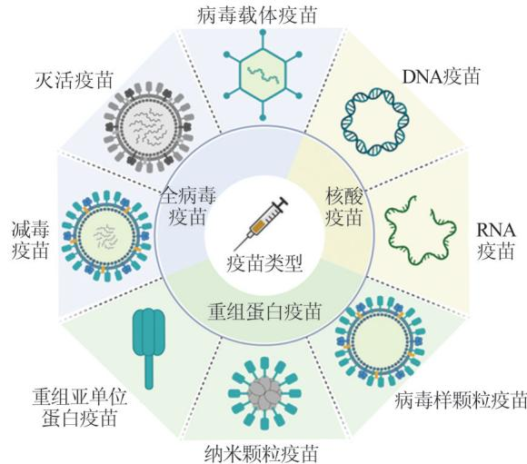
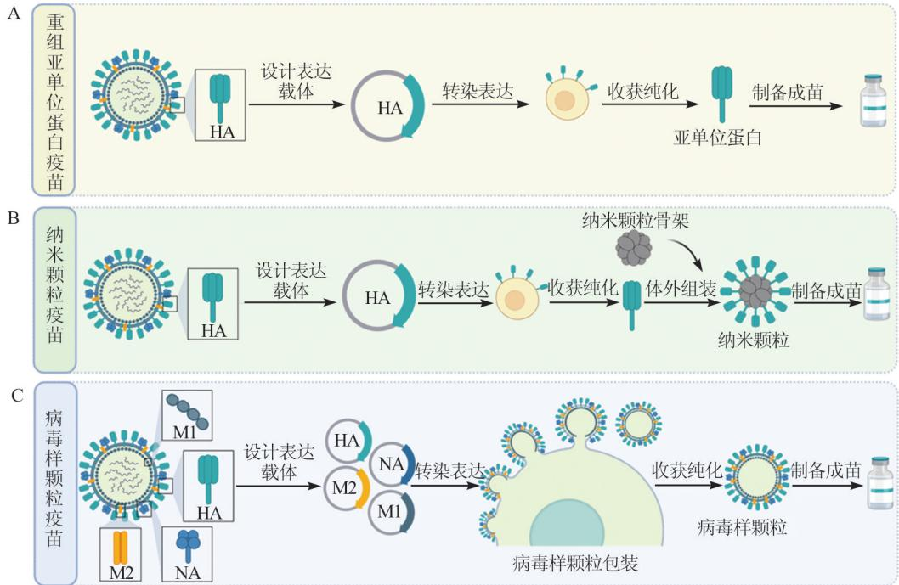
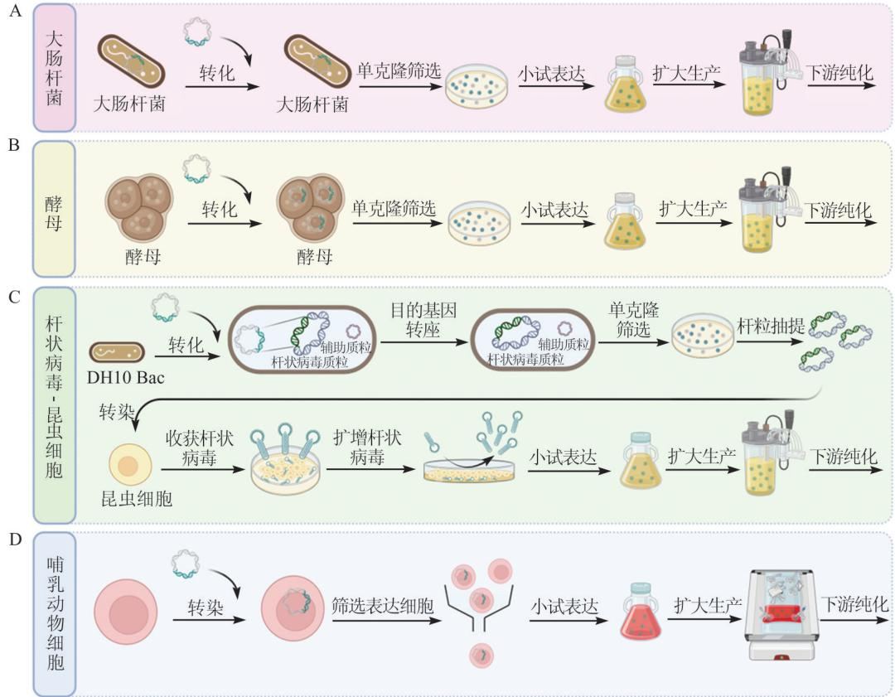

# 病毒性传染病的重组蛋白疫苗研究进展

钟一帆1 ，袁为锋1 ，徐 可 1，2，3†  
1. 武汉大学 生命科学学院/病毒学国家重点实验室，湖北 武汉 430072；2. 武汉大学 泰康生命医学中心，湖北 武汉 430071；  
3. 武汉大学 疫苗研究院，湖北 武汉 430071  
收稿日期：2024⁃05⁃25 †通信联系人 E-mail： xuke03@whu. edu. cn  
基金项目：国家重点研发计划（2018YFA0900801、2023YFC2307800）；中央高校基本科研业务费专项资金（重点重大项目建设推进专项，2042024kf1026）；湖北省支持企业技术创新发展项目（2021BAB117）；湖北省自然科学基金（2022CFB624、2022CFA047）；中国博士后基金（2023M742709）

第一作者：钟一帆，男，硕士生，现从事抗病毒疫苗研究。E-mail：2021202040011@whu. edu. cn摘 要：重组蛋白疫苗由基因工程表达获得，其免疫原可设计性强、成分单一可控、生物安全性较高、规模化放大的技术成熟，是近年来新型疫苗采用的主要类型。在免疫原设计方面，重组蛋白疫苗的免疫原偶联、工程化设计和免疫原重构等技术可以拓展疫苗的广谱性和长效性；在表达纯化方面，多种表达纯化工艺能够满足不同重组蛋白疫苗对免疫原修饰、产品产量和质量的要求；在规模化生产方面，多种细胞反应器、细胞工厂等生产工艺提高了重组蛋白免疫原的产量。本文综述了重组蛋白疫苗的类型，总结了重组蛋白疫苗在免疫原设计、蛋白表达纯化工艺等方面的进展，以及在免疫原性、保护性和安全性方面的优势，展望了重组蛋白疫苗进一步优化的策略和前景，可望为重组蛋白疫苗的未来应用提供理论参考。

关 键 词：病毒性传染病；疫苗；重组蛋白疫苗；免疫原设计；疫苗生产技术中图分类号： R186 文献标志码：A文章编号：1671-8836（2024）05-0539-17

# Advance in Recombinant Protein Vaccine Research for Viral Infectious Diseases

ZHONG Yifan1 ， YUAN Weifeng1 ， XU Ke1，2，3†

1. State Key Laboratory of Virology/College of Life Sciences， Wuhan University， Wuhan 430072， Hubei， China；  
2. Taikang Center for Life and Medical Sciences， Wuhan University， Wuhan 430071， Hubei， China；  
3. Institute for Vaccine Research， Wuhan University， Wuhan 430071， Hubei， China

Abstract：Recombinant protein vaccines, obtained through gene engineering expression, offer strong immunogen design flexibility, single and controllable components, high biological safety, and mature large-scale amplification technology, making them the main type of new vaccines in recent years. In terms of immunogen design, technologies such as immunogen conjugation, engineering design, and immunogen reconstruction in recombinant protein vaccines can extend the vaccine’s broad-spectrum and long-lasting efficacy. Regarding expression and purification, various expression and purification processes can meet the requirements for immunogen modification, product yield, and quality in different recombinant protein vaccines. For large-scale production, multiple production processes such as cell reactors and cell factories have improved the yield of recombinant protein immunogens. This article reviews the types of recombinant protein vaccines, summarizes the progress in immunogen design, protein expression and purification processes, and highlights their advantages in terms of immunogenicity, protection, and safety. It also explores strategies and prospects for further optimization of recombinant protein vaccines, aiming to provide theoretical references for their future applications.

Key words：viral infectious diseases；vaccine；recombinant protein vaccines；immunogen design；vaccines production technologies

# 0 引 言

疫 苗（vaccine）是 接 种 后 能 使 机 体 对 相 应 疾 病产生免疫力的生物制剂，是对抗传染病最有效的手段。根据制备技术路径的不同，疫苗分为包含全病毒结构的灭活疫苗、减毒疫苗、病毒载体疫苗，只包含主要免疫原性的部分病毒蛋白的重组蛋白疫苗（包括重组亚单位蛋白疫苗、纳米颗粒疫苗和病毒样颗粒疫苗）以及近年来兴起的由病毒核酸构成的DNA疫苗和RNA疫苗（图1）。灭活疫苗是将病毒培养后灭活制备成的疫苗，灭活的病毒粒子具有完整的病毒结构，去除感染性或毒性的同时保留了免疫原性[1]。但灭活疫苗免疫力维持时间短，需要多次重复接种才能达到预期抗体水平[2]。减毒疫苗是通 过 自 然 分 离、人 工 培 育 或 反 向 遗 传 学 手 段，在 保留病原体完整性和复制能力情况下，将毒力致弱或消除后制备的疫苗[1]。完整的病毒粒子结构使减毒疫 苗 可 通 过 天 然 感 染 途 径 接 种，刺 激 机 体 产 生 黏膜、体液和细胞免疫的多维度免疫应答[3，4]，但是减毒疫苗由于毒力没有完全消除可能导致免疫力低下人群患病，同时在人体中低剂量感染仍然存在毒力 恢 复 与 毒 力 返 祖 的 风 险 [5，6] 。 病 毒 载 体 疫 苗 是 由编码免疫原蛋白的工程病毒制备的疫苗，载体病毒侵入宿主细胞并表达负载的免疫原蛋白，诱导免疫反应[1]。病毒载体在宿主中能够被免疫细胞识别，具 有 天 然 佐 剂 的 效 果，能 够 增 强 免 疫 细 胞 应 答，同时刺激产生体液免疫和细胞免疫[7，8]。重组蛋白疫苗是指体外通过细菌、酵母、植物、昆虫或哺乳动物细胞等表达系统表达免疫原，再经过分离纯化等过程得到相应的蛋白，然后配伍适当的佐剂制成的疫苗[1]。除了直接和佐剂配伍外，蛋白亚单位疫苗还可制备成纳米颗粒疫苗或病毒样颗粒疫苗的形式，以 增 强 免 疫 原 的 展 示 和 递 呈 效 率。核 酸 疫 苗 是 由编 码 病 毒 免 疫 原 蛋 白 的 DNA 或 mRNA 制 备 的 疫苗，通过基因枪、肌肉注射或递送系统等手段导入机体内表达靶免疫原[1]，诱导机体产生体液免疫和细 胞 免 疫[8\~10] 。

病毒的高变异特征对疫苗的广谱性和长效性提出了新的挑战，灭活疫苗和减毒活疫苗毒株来源单一、制备工艺复杂，无法获得对变异株的广谱保护效果，主要在疫情流行初期使用。随着病毒的长期流行和变异，病毒序列的数据库不断丰富，免疫原“再设计”思路使重组蛋白疫苗成为负载各类广谱设计策略的优势底盘，经过人工设计的重组蛋白疫 苗 可 获 得 更 广 谱 的 保 护 效 果。本 文 综 述 了 重 组蛋白疫苗的类型和优势，总结了重组蛋白疫苗免疫原蛋白的设计、表达纯化、生产工艺的研发进展，希望为不同病毒的重组蛋白疫苗设计和开发工艺提供可参考的科学见解。

  
图 1　疫苗的分类  
Fig. 1 Vaccine types

# 1 重组蛋白疫苗的定义和分类

重 组 蛋 白 疫 苗 以 病 原 体 具 有 免 疫 活 性 组 分 的病毒蛋白为免疫原，诱导免疫应答的同时，又避免了病原体其他成分的不良影响。根据重组蛋白在成品疫苗中的存在形式，可将重组蛋白疫苗分为重组亚单位蛋白疫苗（图 2A）、纳米颗粒疫苗（图 2B）和病毒样颗粒疫苗（图2C）。

# 1. 1　重组亚单位蛋白疫苗

重组亚单位蛋白疫苗（recombinant protein vac⁃cine）是 以 单 个 或 数 个 病 毒 免 疫 原 蛋 白 为 免 疫 原 的疫 苗 。 以 流 感 病 毒（influenza virus，IFV）血 凝 素（hemagglutinin，HA）蛋白为免疫原的疫苗为例，制备流程为：首先将流感病毒的 HA 基因克隆至表达载体，再将表达载体转染至细胞，表达出HA重组亚单 位 蛋 白，在 细 胞 培 养 上 清 液 或 破 碎 细 胞 中 收 获HA 重组亚单位蛋白进行纯化，最终制备成 HA 重组亚单位疫苗（图2A）。根据重组亚单位蛋白所激活的免疫反应强弱，可针对性进行免疫原长度和结构的改造，以获得更强的免疫激活反应和更高的中和性抗体水平。Li 等[11] 对新冠病毒（severe acute re⁃spiratory syndrome coronavirus 2，SARS-CoV-2）刺突蛋白（spike protein，S）进行截短改造，仅保留其胞外域，提升了S蛋白在体外的表达量，并在小鼠模型中诱发了更高的中和抗体滴度。Golchin等[12]设计的 流 感 M2e-HA2 串 联 免 疫 原 疫 苗，显 著 提 高 了 小鼠模型中产生的抗流感病毒体液免疫应答水平。Young等[13]设计的一种通用分子标签与病毒蛋白融合表达时，能够在极端环境下稳定中东呼吸综合征冠状病毒、埃博拉病毒、拉沙病毒和尼帕病毒的三聚体免疫原构象。目前，已有多种重组亚单位蛋白疫苗获批上市，包括预防新冠病毒的 COVAX-19[11] 、Zifivax[14] 、威 克 欣[15] 和 SCTV01C[16] ，预 防 流 感病毒的 Flublok[17（] 详见表 1）。

# 1. 2　纳米颗粒疫苗

纳 米 颗 粒 疫 苗（nanoparticle-based vaccines）是在自组装蛋白或纳米颗粒骨架的表面展示多个免疫原蛋白。以流感病毒纳米颗粒疫苗为例，制备流程为：首先将流感病毒HA基因克隆至表达载体，再将表达载体转染至细胞表达出 HA蛋白，然后将纯化后的 HA蛋白组装至纳米颗粒骨架的表面，最终制备成苗（图 2B）。用于制备疫苗的自组装蛋白纳米颗粒可以模拟天然微生物的表面结构，通过高密度 且 有 序 地 展 示 免 疫 原，增 强 免 疫 原 的 递 呈 效 率，从而刺激B细胞和T细胞反应[18，19]。常用于上市疫苗的自组装蛋白纳米颗粒平台I53-50，是一种人工设计的双组分二十面体自组装蛋白纳米颗粒[20]，预防新冠病毒的 SKYCovione 在 I53-50 表面展示 S 蛋白 的 受 体 结 构 域（receptor binding domain，RBD）作为免疫原，已经在韩国获批上市[21]。

脂质体是一种具有免疫增强效果的纳米骨架[22，23]，由两亲性脂分子组成，内部包含充满液体的亲水核心的双层或多层囊泡，可以在不同位置容纳亲水或疏水的免疫原蛋白[24，25]。脂质体的一大优势在于，它可以将免疫原和佐剂共同递送到同一抗原递呈细胞（antigen presenting cell，APC）中。脂质体可以保护免疫原不被降解，增加免疫原被APC识别的概率，使免疫原释放到APC细胞质中并刺激免疫系 统[26] 。 Allison 等[27] 验 证 了 脂 质 体 免 疫 佐 剂 的 特性，发现脂质体的尺寸大小和所带电荷影响其免疫效果[28]。阳离子脂质体可以与带负电荷的细胞膜相互作用，更容易被APC摄取，从而引发更强烈的免疫 反 应。较 小 的 脂 质 体（ $5 0 { \sim } 2 0 0 ~ \mathrm { n m }$ ）更 易 被 APC摄 取 并 释 放 到 胞 质 中，从 而 穿 透 血 管 壁 进 入 淋 巴结，因此通常具有更强的免疫效果[29]。目前已有多种脂质体纳米颗粒疫苗上市，包括预防新冠病毒的Covovax[30] ，预防流感病毒的 Inflexal $\mathrm { V } ^ { [ 3 1 ] }$ （表1）。

高 分 子 聚 合 物 颗 粒 也 是 构 建 纳 米 颗 粒 疫 苗 的骨架策略之一[32，33]。聚合物纳米颗粒可以包裹免疫原，并在体内缓慢释放，延长免疫原作用时间；能够抵抗环境和酶的降解，提高稳定性；同时可以刺激免 疫 系 统 ，增 强 免 疫 反 应[34，35] 。 某 些 聚 合 物 纳 米 颗粒具有独特的生物降解速率，可以根据需要设计成定点释放，为疫苗设计提供了更多的灵活性和可控性[36，37] 。Shen 等[38] 研究发现，包装在聚乳酸-乙醇酸颗粒内的卵清蛋白免疫原在免疫 $9 6 \ \mathrm { h }$ 后仅降解$20 \%$ ，而未包装的卵清蛋白免疫原在免疫后 $4 8 \mathrm { ~ h ~ }$ 已全部降解。

  
图2　重组蛋白疫苗制备流程图  
Fig. 2 Recombinant protein vaccine production process

# 1. 3　病毒样颗粒疫苗

病毒样颗粒（virus-like particle，VLP）是由病毒结构蛋白自组装形成的生物纳米颗粒，具有病毒颗粒的天然结构，但不包含病毒遗传物质。以流感病毒纳米颗粒疫苗为例，该疫苗的制备流程如图 2C所示。首先将流感病毒 HA、神经氨酸酶（neuramin⁃idase，NA）、基质蛋白（matrix protein，M1）和离子通道 蛋 白（membrane protein，M2）基 因 克 隆 至 表 达 载体，再将表达载体转染至细胞，上述4种蛋白在细胞内表达并自组装成 VLP，最后将上清液中的 VLP收获纯化并制成疫苗。VLP疫苗可模拟活病毒感染途径，激活 B 细胞和 T 细胞反应[39\~41]。目前已有多 种 抗 病 毒 VLP 疫 苗 上 市，如 预 防 新 冠 病 毒 的CoVLP[42] ，预 防 乙 型 肝 炎 病 毒（hepatitis B virus，HBV）的 Engerix- $\mathrm { - B ^ { [ 4 3 ] } }$ 和 $\mathrm { S c i - B - V a X ^ { [ 4 4 ] } }$ ，预防戊型肝炎 病 毒（hepatitis E virus，HEV）的 Hecolin[45] ，预 防人乳头瘤病毒（human papilloma virus，HPV）的 Cer⁃varix[46] 和 Gardasil $9 ^ { [ 4 7 ] }$ （详见表 1）。

表1　部分已上市病毒性传染病的重组蛋白疫苗  
Table 1 Selected approval recombinant protein vaccines for viral infectious diseases   

<table><tr><td>病原体</td><td>类型</td><td>名称</td><td>免疫原</td></tr><tr><td rowspan="6">新冠病毒</td><td rowspan="3">亚单位</td><td>COVAX-19[1]</td><td>S蛋白</td></tr><tr><td>Zifivax[14]</td><td>RBD二聚体</td></tr><tr><td>威克欣[15]</td><td>S蛋白</td></tr><tr><td rowspan="2">VLP</td><td>SCTV01C[16]</td><td>S蛋白</td></tr><tr><td>CoVLp[42]</td><td>S蛋白</td></tr><tr><td rowspan="2">纳米颗粒</td><td>SKYCovione[21]</td><td>S蛋白RBD</td></tr><tr><td>Covovax[30]</td><td>S蛋白</td></tr><tr><td rowspan="2">流感病毒</td><td>亚单位 纳米颗粒</td><td>Flublok[17]</td><td>HA蛋白</td></tr><tr><td></td><td>Inflexal V[31]</td><td>HA、NA蛋白</td></tr><tr><td rowspan="2">乙肝病毒</td><td>VLP</td><td>Engerix-B[43]</td><td>小表面蛋白</td></tr><tr><td></td><td>Sci-B-Vax[44]</td><td>pre-S1免疫原、pre-S2免疫原和小表面蛋白</td></tr><tr><td>戊肝病毒</td><td>VLP</td><td>Hecolin[45]</td><td>ORF2</td></tr><tr><td rowspan="2">人乳头瘤病毒</td><td rowspan="2">VLP</td><td>Cervarix[46]</td><td>HPV16型和18型L1蛋白</td></tr><tr><td>Gardasil 9[47]</td><td>HPV6型、11型、16型、18型、31型、33型、45型、52型和58型L1蛋白</td></tr></table>

# 2 重组蛋白疫苗的研究

重组蛋白疫苗的研发流程包括免疫原设计、表达纯化和规模化生产等步骤。近年来，重组蛋白疫苗的研究进展体现在以下方面：1）在免疫原设计方面，通过研究病毒的结构和功能，挖掘病毒的保守位点和强免疫原性区域，科学设计为更广谱、高效的免疫原；2）在蛋白表达纯化方面，根据免疫原的表达量和翻译后修饰的要求，选择更高效的表达方式以获得具有天然构象的免疫原，并结合其表达特性优化、纯化工艺，确保获得高纯度的免疫原；3）在规模化生产方面，通过开发高通量筛选技术，优化培养基和升级生产设备，有效降低了生产成本。

# 2. 1　免疫原设计

重组蛋白疫苗的优势首先体现在可以通过对免疫原进行科学设计和灵活改造，以获得更加适配病原特征的免疫原，提高重组蛋白疫苗的广谱性和长效性。广谱免疫原的设计策略包括马赛克法、保守表位法和共识序列法，这些方法适用于人类免疫缺 陷 病 毒（human immunodeficiency virus，HIV）和冠状病毒等高度变异的病毒。

马赛克法是将多种病毒变异株的核心免疫原直接混合或模块化拼接，是提高疫苗广谱性最直接的 方 法。模 块 化 串 联 的 免 疫 原 结 合 纳 米 载 体 或 二聚体化，可获得覆盖多种变异株的混合免疫原[48\~50]。HIV 的 马 赛 克 法 设 计 策 略 是 基 于 免 疫 原 表 位 库 的建立，对 HIV不同免疫原表位进行排列组合，筛选保护效果最好的表位组合，以获得接近通用型的免疫 原 蛋 白[51] 。 Dai 等[52] 以 新 冠 病 毒 Omicron 毒 株BA. 1和 BA. 2 RBD的异源二聚体组合，相比原型株疫苗获得了对Omicron突变株更佳的保护效果。

保守表位法是以病毒的保守结构作为免疫原。此策略依赖于对病毒蛋白的功能挖掘和结构解析，这些结构在体外表达时不稳定，需要进行重构和工程 化 改 造 才 能 获 得 稳 定 的 蛋 白 质。呼 吸 道 合 胞 病毒（respiratory syncytial virus，RSV）重 组 蛋 白 疫 苗保守表位法设计策略体现在以融合蛋白（fusion pro⁃tein，F）的稳定构象作为免疫原。F蛋白是Ⅰ类融合蛋白，具有与细胞膜融合的融合前构象和融合后构象，融合前F蛋白免疫原性强但不稳定，易转变为融合 后 构 象[53，54] 。 Crank 等[54] 在 F 蛋 白 的 C 端 引 入 两个 点 突 变（S155C 和 S290C），使 F 蛋 白 融 合 前 构 象的空腔得到填充以增强蛋白的稳定性。新冠病毒 S蛋白同样为Ⅰ类融合蛋白，与细胞融合时形成融合前构象、融合中间构象和融合后构象[55]。因此，此策略 同 样 适 用 于 新 冠 病 毒 重 组 蛋 白 疫 苗 保 守 表 位 法的 设 计 。 Pang 等[55] 通 过 还 原 融 合 中 间 态 的 构 象 和功能，在体外实现重组表达，得到可中和新冠病毒突 变 株 以 及 不 同 种 属 人 冠 状 病 毒 的 重 组 蛋 白 疫 苗免疫原。

共识序列法则是通过计算病毒的进化方向，将相同进化分支的病毒序列聚类到一起，得到含有该分支变异频率最高的共识位点序列，再计算得到总共识序列，经密码子优化后在体外表达系统中表达出蛋白质。以甲型H5N1流感病毒HA蛋白共识序列 为 免 疫 原 的 疫 苗 可 产 生 针 对 clade 1、clade 2. 1、clade 2. 2、clade 2. 3. 2 和 clade 2. 3. 4 等 亚 类 的H5N1高致病性毒株的中和抗体和免疫保护[56]。本团队通过追踪新冠病毒刺突蛋白的进化和突变规律，研发出一种覆盖新冠病毒刺突蛋白“共性进化突 变 ”的 广 谱 疫 苗 免 疫 原 $\mathrm { S _ { p a n } }$ （泛 新 冠 病 毒 S 免 疫原），该免疫原可诱导产生对新冠病毒各突变株及其亚系的广谱中和抗体，保护小鼠抵抗多种新冠病毒突变株的致死性攻击[57]。

# 2. 2　蛋白表达纯化

重 组 蛋 白 疫 苗 的 优 势 还 体 现 在 蛋 白 表 达 纯 化方 式 多 样，即 可 根 据 蛋 白 的 特 性 定 制 表 达 纯 化 条件。表达系统包括以细菌为宿主的原核表达系统和以酵母 、杆状病毒-昆虫细胞和哺乳动物细胞等为宿主的真核表达系统，利用细菌或细胞的生物机制可以表达出免疫原蛋白。

1）原核表达系统。大肠杆菌因增殖快、易于操作 且 培 养 成 本 低，是 目 前 最 常 使 用 的 原 核 表 达 系统。利 用 大 肠 杆 菌 表 达 系 统 获 得 目 的 蛋 白 的 步 骤为：首先将免疫原基因克隆到表达载体，转化至大肠杆菌中筛选出阳性克隆，取阳性单克隆进行小规模表达（即小试表达），随后扩增大肠杆菌并诱导免疫 原 蛋 白 表 达，最 后 收 集 培 养 上 清 液 或 破 碎 细 菌，经纯化后获得目的蛋白（图3A）。但大肠杆菌表达系统在蛋白纯化时需要去除内毒素，这增加了纯化的成本。同时大肠杆菌存在较强的密码子偏向性，又无法对蛋白进行正确折叠，可能导致蛋白溶解度降低而形成包涵体，且无法进行某些特定的翻译后修饰（如糖基化、磷酸化等）。目前基于大肠杆菌表达系统的 HBV[58]、HEV[59] 和 HPV[60] 疫苗已经上市，流感疫苗已经进入临床试验[61]。

2）真核表达系统。真核表达系统不仅具有高表达量、大规模和低成本优势，相比原核表达系统还具有更丰富的蛋白折叠、修饰和组装方式，可保持 免 疫 原 蛋 白 的 天 然 结 构。免 疫 原 蛋 白 的 真 核 表达平台已广泛应用于各类疫苗的生产。利用酵母表达系统获得目的蛋白的步骤与大肠杆菌类似（图3B）。目前基于酵母表达系统的 HBV[62]、HPV[63] 疫苗已经上市，新冠病毒疫苗[64]已进入临床试验。杆状病毒-昆虫细胞表达系统需要通过杆状病毒感染实 现 目 的 蛋 白 的 表 达，步 骤 为：首 先 通 过 同 源 重 组方法将目的基因插入杆状病毒基因组，筛选并提取含有目的基因的重组杆状病毒基因组；然后将带有目的基因的杆状病毒基因组转染至昆虫细胞中，构建带有目的基因的重组杆状病毒；最终将重组杆状病毒感染昆虫细胞以扩增杆状病毒，用扩增后的杆状病毒再次感染昆虫细胞以表达蛋白，通过分离纯化获得目的蛋白（图3C）。目前基于杆状病毒-昆虫细胞表达系统的 HPV[65]、新冠病毒[66]、流感病毒[67]疫苗已经上市，HEV[68]疫苗已进入临床试验。哺乳动物细胞株间差异大，通常需要构建稳定表达的单克隆 细 胞 株 才 能 实 现 高 表 达。利 用 哺 乳 动 物 细 胞 表达系统获得目的蛋白的步骤为：首先将免疫原基因克隆到表达载体，转染至哺乳动物细胞中筛选出高表达克隆，随后扩增哺乳动物细胞并表达免疫原蛋白，再通过分离纯化获得目的蛋白（图3D）。目前基于哺乳动物细胞表达系统的 HBV[44]、RSV[69]、新冠病毒[70]疫苗已经上市， $\mathrm { H I V } ^ { [ 7 1 ] }$ 、人巨细胞病毒[72]疫苗已进入临床试验。这些清晰的生产技术路线为免疫原蛋白的科学设计和灵活改造提供了便利，有助于广谱、长效免疫原的快速获得。

表达系统获得产物，还需要进行下游的蛋白纯化 步 骤，去 除 免 疫 原 外 的 杂 质，才 能 应 用 于 疫 苗 领域。在 纯 化 过 程 中，通 常 利 用 各 蛋 白 的 尺 寸 大 小、等电点、亲疏水性以及与特定配体的亲和力等理化性质差异实现免疫原蛋白的纯化。常用的蛋白纯化 方 法 有 亲 和 层 析、离 子 交 换 层 析、尺 寸 排 阻 层 析和疏水层析。

1）亲和层析是利用目的蛋白（或蛋白复合物）与层析介质中配体之间的特异性亲和力，将未结合的物质从柱中洗出，从而实现蛋白的纯化。亲和层析通过一步操作就能得到高纯度蛋白，具有高选择性和高分辨性，因而广泛用于实验室规模的蛋白纯化。三叶草公司研发了一种Trimer-Tag，能够自组装成二硫键连接的三聚体，可用于稳定 S 蛋白三聚体结构，并作为亲和纯化标签用于S蛋白的纯化[73]。

  
图3　重组蛋白的表达流程  
Fig. 3 Recombinant protein expression process

2）离子交换层析是根据不同蛋白所带电荷的差异对蛋白进行分离的一种纯化方法。在低离子强度的流动相中，带电的部分蛋白与层析介质中带相同电荷的平衡离子发生可逆交换，从而结合到带相反电荷的层析介质中；结合后的蛋白在流动相的pH值发生改变或离子强度增强时又会被洗脱，从而实现目的蛋白的富集、浓缩与纯化。三叶草公司[73]和Novavax公司[30]纯化新冠病毒S蛋白三聚体疫苗时均使用了一次强阴离子交换层析，神州生物公司纯 化 新 冠 病 毒 亚 单 位 疫 苗 时 采 用 了 3 次 离 子 交 换层 析 [74] 。

3）尺寸排阻层析是根据蛋白的分子量和尺寸差 异 对 蛋 白 进 行 分 离 纯 化。大 尺 寸 蛋 白 无 法 进 入填料颗粒内部而最先从层析柱中流出，小尺寸的蛋白则进入填料颗粒间隙而在层析柱中停留更长时间，由分子量决定蛋白洗脱的先后顺序。目前已有多项研究[75\~78]表明，尺寸排阻层析可以高效纯化各

类 VLP。

4）疏水层析是利用不同蛋白与层析介质的疏水作用力差异而实现蛋白分离。蛋白在高浓度的盐 溶 液 中 暴 露 非 极 性 部 位 并 与 层 析 介 质 中 的 疏 水配 基 发 生 疏 水 性 结 合，当 缓 冲 液 的 盐 浓 度 降 低 时，蛋白又会被依次洗脱，从而对目的蛋白进行捕获与纯化。基于疏水层析技术，Li等[79]开发了一种高效HBV VLP 纯化方法，在回收率为 $4 1 . 2 1 \%$ 的情况下，实现了接近 $100 \%$ 的纯度。

# 2. 3　规模化生产

重组蛋白疫苗的优势还体现在规模化生产，已有多种细胞、细菌规模化培养工厂，满足工程化设计免疫原从小试放大至规模化生产需要。

1）细胞培养工厂主要采用悬浮细胞培养的方法 在 生 物 反 应 器 中 进 行 高 密 度 的 细 胞 旋 转 培 养。相对于传统的贴壁细胞培养法，悬浮细胞培养的方法极大地增加了培养器皿的空间利用率。悬浮细胞培养又可分为微载体式的贴壁-悬浮培养和全悬浮培养。微载体增加了细胞贴壁的表面积，有效节约空间，主要应用于灭活疫苗的贴壁细胞培养[80，81]。在重组蛋白疫苗规模化生产中，已工程化的表达细胞系（如 HEK-293F和 CHO-K1等），均可采用全悬浮培养方法。Lonza 公司将贴壁 CHO-K1 细胞通过基 因 修 饰 法，实 现 了 细 胞 的 悬 浮 培 养，比 贴 壁 培 养的 产 量 提 高 $4 { \sim } 5$ 倍[82] 。 Graham 等[83] 利 用 腺 病 毒 5型DNA转染人胚胎肾细胞，建立了永生化的HEK-293细胞系。HEK-293细胞瞬时转染效率高、表达蛋 白 活 性 高 且 不 存 在 $\alpha - \mathrm { g a l }$ 糖 基 化，可 进 行 悬 浮培 养 [84] 。

2）生物反应器是工业化规模培养大量细胞的主要工具。生物反应器是通过转子带动培养液旋转，使 细 胞 处 于 单 个 悬 浮 状 态，细 胞 的 增 殖 不 受 基质表面积限制，克服了传统细胞贴壁培养的弊端[85]。生物反应器可大量提供同步分裂、增殖快的细胞，使同批次表达的免疫原质量具有均一性。同时，生物 反 应 器 操 作 机 械 化、智 能 化，逐 渐 放 大 的 过 程 均通过管道完成，减少了人为操作带来污染的风险[86]。生物反应器可控的工艺参数提高细胞的产量和质量，还保证了表达免疫原的质量。

3）疫苗企业根据市场需求波动快速调整生产能力，针对细胞工厂大规模培养开发了连续性制造方式，包括批次培养、补料培养和灌流培养[87]。灌流培养是指在细胞培养和蛋白表达过程中，将细胞截留 于 反 应 器 内，收 集 培 养 基 和 表 达 产 物，不 断 补 充新鲜培养基的培养方式[87，88]。灌流培养保持了反应器细胞中营养物质不间断，降低了代谢废物浓度，可持续收获蛋白的方式提高了免疫原的均一性，广泛 运 用 于 重 组 蛋 白 疫 苗 生 产 中[89] 。 Chen 等[90] 利 用灌流培养表达 RSV F蛋白，将表达量提升至 1 500$\mathrm { m g / L }$ 。 Alvim 等[91] 采 用 灌 流 培 养 在 哺 乳 动 物 细 胞表达系统中得到了 $8 0 ~ \mu \mathrm { g / L }$ 寨卡病毒 VLP，相对于分批培养的产率提升了 4 倍。但灌流培养方法存在培养基利用率低的问题，需要持续大量供给新鲜培养基，增加了生产成本。

4）无血清培养基提供了一种降低细胞培养成本 的 方 法[92，93] 。 相 对 于 含 血 清 培 养 基 ，无 血 清 培 养基可以根据细胞培养特点设计，满足和实现某些细胞的高密度培养和生物高效表达。Kuwae等[94]开发了一种适用于 CHO 细胞悬浮培养的无血清培养基，该 培 养 基 相 比 商 业 培 养 基 含 有 更 多 的 胆 碱，能使 CHO 细 胞 密 度 达 到 $1 . 7 \times 1 0 ^ { 7 }$ 个/ $^ \prime \mathrm { m L }$ ，比 商 业 培养基培养的细胞密度提高了2.1倍。Kim等[95]通过筛 选 商 业 培 养 基，证 明 Cytiva CDM4PerMAb 培 养基相比 BalanCD CHO Growth A 基础培养基，能使水痘-带状疱疹病毒囊膜糖蛋白在 CHO 细胞系中表达量提升2倍以上。因此，开发适宜的培养基，不但有利于细胞安全有效的增殖，而且能提高产物的

表达产量。

细 胞 工 厂 在 细 胞 株、培 养 方 式、培 养 工 艺 等 方面为工程化设计的免疫原提供了规模化生产平台。一旦确定了新发、突发或变异株的病毒基因序列，就可以迅速设计并生产出相应的免疫原蛋白，再由细胞工厂将免疫原蛋白表达产量快速放大到工业生产规模。这对于应对大规模疫情至关重要。

# 3 重组蛋白疫苗的应用

# 3. 1　新冠病毒重组蛋白疫苗

新冠病毒疫苗主要以 S蛋白或其 RBD作为免疫原[96，97]。目前已有多种经过结构改造的新冠病毒S蛋白亚单位疫苗上市。新冠病毒 S蛋白具有融合前和融合后两种构象，Bowen等[98]发现处于融合前构象的S蛋白免疫原性要显著优于融合后构象，且能诱导更高的中和抗体滴度。不同研究机构在设计疫苗时对 S 蛋白进行了不同的修饰，以稳定融合前 构 象 并 投 入 市 场 使 用。其 中 一 种 修 饰 方 式 是 突变 S 蛋白的弗林蛋白酶切位点。S1/S2 位点被弗林蛋白酶切割是后续 S2'位点被跨膜丝氨酸蛋白酶 2或组织蛋白酶 L切割、S蛋白转变为融合后构象的先决条件。修饰弗林蛋白酶切位点可以阻止S蛋白发 生 构 象 变 化 ，强 生 公 司 设 计 的 Jcovden 疫 苗 将 弗林 蛋 白 酶 切 位 点 的 氨 基 酸 序 列 由 682-RRAR-685突变为682-SRAG-685。另一种修饰策略是将S蛋白 986K 和 987V 这两处氨基酸都突变为脯氨酸。辉 瑞 公 司 的 Comirnaty 疫 苗 和 Moderna 公 司 的Spikevax 疫苗等采用 K986P 和 V987P 的突变方式。研究表明，新冠病毒S蛋白上双脯氨酸突变提高了其 构 象 稳 定 性[99，100] 。

除了对S蛋白进行截短或突变改造，还可以对疫 苗 免 疫 原 进 行 再 设 计 。 例 如 ，Liu 等[101] 将 新 冠 病毒 RBD 蛋 白 与 IgG Fc 片 段 融 合 表 达，可 以 将 新 冠病毒 RBD蛋白串联形成多聚体RBD-Fc蛋白，相比RBD 单 体 蛋 白 能 诱 导 更 高 效、长 期 的 中 和 抗 体 反应。Sun 等[102] 在 RBD-Fc 基 础 上 继 续 进 行 优 化 ，通过在RBD蛋白N端添加 $\mathrm { I F N } { - \alpha }$ 蛋白为分子内佐剂，增强了将RBD-Fc靶向递送至免疫原提呈细胞的能力，此方法制备的免疫原即使在低剂量或无佐剂的情况下也具有较高的免疫原性。

另外，使用纳米颗粒装载 RBD 蛋白使多个RBD蛋白均一地展示在纳米颗粒的外表面，可提供增强的保护效果。SKYCovione是由自组装蛋白纳米颗粒GBP510和佐剂AS03构成的新冠病毒疫苗。

GBP510表面紧密展示60个S蛋白RBD结构域，即使 在 较 低 剂 量 下 也 能 刺 激 免 疫 反 应。该 蛋 白 质 纳米 颗 粒 平 台 还 可 以 通 过 改 变 靶 免 疫 原，简 单、有 效地调整疫苗，以匹配S新冠病毒的变异株或其他病原 体[103] 。 三 期 临 床 试 验 结 果 显 示 ，SKYCovione 诱导 的 中 和 抗 体 水 平 是 对 照 疫 苗 Vaxzevria 的 3 倍 以上，且未出现严重的不良反应[104]。Covovax是以聚山梨酯-80纳米颗粒为骨架，表面吸附 S蛋白而制成的新冠病毒疫苗，在三期临床试验中表现出$89 . 7 \%$ 的 有 效 率[66] 。

目前唯一一款上市的新冠病毒 VLP 疫苗是由Medicago 公 司 研 发 的 植 物 源 性 重 组 疫 苗 CoV⁃$\mathrm { L P ^ { [ 1 0 5 ] } }$ ，其 设 计 原 理 是 利 用 一 种 烟 草 植 物 Nicotianabenthamiana 的 病 毒 样 颗 粒 展 示 三 聚 体 形 式 的 S 蛋白。CoVLP疫苗诱导较高滴度的中和抗体和持久的 T细胞免疫应答，临床数据显示，该疫苗的有效保护率为 $6 9 . 5 \% ^ { [ 4 2 , 1 0 5 ] }$ 。

虽然目前新冠病毒疫苗接种普及率高，但新冠病毒的 S 蛋白上关键位点突变使病毒具有疫苗逃逸的能力。Omicron BA. 1突变株使原型株疫苗中和抗 体 滴 度 下 降 至 $1 / 4 0 ^ { [ 1 0 6 ] }$ 。针 对 新 冠 病 毒 的 多 种 广谱 免 疫 原 正 在 研 发，如 将 不 同 突 变 株 的 免 疫 原 整合 ，产 生 针 对 突 变 株 更 高 的 中 和 抗 体 效 价[107] ；靶 向病毒保守表位设计免疫原[108]；嵌入流行株重要突变位点，增强疫苗对现有流行株的保护性[109]；设计位于新冠病毒进化中点的共识序列，提供跨谱系的交叉免疫保护[57] 。

# 3. 2　流感病毒重组蛋白疫苗

根据世界卫生组织统计，流感病毒（IFV）引发的 季 节 性 流 感 每 年 导 致 约 300 万 至 500 万 病 例 感染，并造成 29 万至 65 万病例死亡。HA 是 IFV 表面含量最多的糖蛋白，以同源三聚体形式分布于病毒囊 膜 表 面，在 病 毒 入 侵 和 感 染 过 程 中 起 关 键 作用[110] 。Gerhard 等[111] 证实，HA 头部的免疫原位点存在 B 细 胞 免 疫 原 呈 递 表 位。与 病 毒 的 其 他 蛋 白 相比，这些位点具有特异性免疫优势[112，113]。由于 HA头 部 含 有 受 体 结 合 位 点 和 优 势 免 疫 原 位 点，所 以HA是疫苗研制的重要靶免疫原[114]。

第一款上市的四价重组流感疫苗是Flublok[67]。与灭活疫苗相比，四价重组流感疫苗中 HA的翻译后修饰展示了更优秀的蛋白质三级和四级结构，有利于保留和暴露 HA分子上的某些保守表位，从而诱发强烈广泛交叉反应性和高水平保护性抗体[17]。此外，四价重组流感疫苗中没有灭活疫苗中常见的HA 低聚物、宿主蛋白或病毒 RNA，有效减弱了不

良 反 应[67] 。

Boyoglu-Barnum 等[115] 通过计算设计、构建了双组分自组装蛋白质纳米颗粒 I53-dn5，20 个 HA 三聚体在体外以指定的比例精确展示在纳米颗粒表面，可以引发强烈而广泛的中和抗体。纳米颗粒可以同 时 展 示 4种 HA免 疫 原，其 诱 导 的 中 和 抗 体 滴 度显著高于商业四价流感疫苗。同时，纳米颗粒疫苗还 通 过 靶 向 HA 茎 部 诱 导 产 生 广 谱 交 叉 中 和抗 体 [115] 。

Novavax 公司研发的流感 VLP 疫苗在 2 期临床试验中表现出和上市疫苗相近的免疫原性和安全性[61] ；Medicago 公司研发的四价 VLP 流感疫苗能在临床试验中诱发强烈的体液免疫和细胞免疫[116]，并具有良好的安全性[117]。流感纳米颗粒疫苗和 VLP疫苗在临床试验和临床前试验中均表现出了良好的免疫效果。

流感 HA结构域极易发生免疫原漂移和转变，需要定期更新免疫原，加大了疫苗研发成本；疫苗毒株与流行毒株的免疫原性并不完全匹配，导致疫苗 的 抗 病 毒 作 用 有 限。目 前 已 有 多 种 研 发 广 谱 流感疫苗策略，如串联多个免疫原表位[12，118]、靶向HA颈部保守表位[119，120] 、设计共识序列[121，122] 。这些策略为广谱流感免疫原的设计提供了多种备选方案，有望为流感防控提供新的思路和方法。

# 3. 3　其他病毒性传染病重组蛋白疫苗

# 3.3.1　乙型肝炎病毒疫苗

乙型肝炎病毒可导致急性或慢性肝炎，进而发展为肝硬化、肝功能衰竭或肝癌，对人类健康构成严 重 威 胁 [123] 。 世 界 上 第 一 款 投 入 临 床 使 用 的 病 毒样颗粒疫苗是 Recombivax HB，其主要成分是酵母表达的 HBV 小表面蛋白；基于此原理的乙肝疫苗已经广泛用于预防HBV感染[124]。2002年我国将乙肝疫苗纳入免疫规划，2005年后乙肝疫苗在全国范围内实施免费接种。根据2022年数据[125]，我国一般人群乙肝阳性检出率下降了 $4 8 . 7 \%$ ，5岁以下儿童的乙肝阳性检出率降至 $0 . 1 \%$ 。乙肝疫苗的广泛接种有效控制了乙型肝炎病毒的流行，为其他传染病的防治提供了可借鉴的模式。

# 3.3.2　人乳头瘤病毒疫苗

全球范围内，由HPV感染引起的癌症约占全部癌 症 的 $5 \% ^ { [ 1 2 6 , 1 2 7 ] }$ 。HPV 的 结 构 蛋 白 包 括 主 要 衣 壳蛋白L1和次要衣壳蛋白L2，其中L1蛋白能够在体外自组装成具有较强免疫原性的 VLP，是目前HPV疫苗的主要免疫原形式[128]。HPV亚型众多，其中HPV 16型和18型占主导地位，引发了 $70 \%$ 的

HPV 相关癌症[129，130] 。二价 HPV 疫苗 Cervarix 包含HPV 16 型 和 18 型 的 L1 免 疫 原，可 以 预 防 $70 \%$ 的HPV 感染[131] 。在此基础上，Gardasil 九价 HPV 疫苗额外加入了 HPV6型、11型、31型、33型、45型、52型和58型的L1免疫原，可以预防超过 $9 5 \%$ 的 HPV感染和宫颈癌前病变[132，133]。但是HPV疫苗产量有限且价格较高，影响了接种意愿[134]。 $\mathrm { H u }$ 等[135] 利 用大肠杆菌表达系统成功表达 HPV VLP，有效降低了疫苗成本。基于该研究的二价HPV疫苗Cecolin已 经 上 市 ，九 价 HPV 疫 苗 Cecolin 9 也 已 进 入 临 床二 期 试 验[136] 。

# 3.3.3　手足口病疫苗

手 足 口 病 是 由 肠 道 病 毒 71 型（EnterovirusA71，EV71）和 柯 萨 奇 病 毒 16 型（CoxsackievirusA16，CA16）等肠道病毒引起的常见传染病，多发生于 5 岁 以 下 儿 童[137] 。 在 小 鼠 模 型 中 ，EV71 VLP 疫苗可引起比灭活疫苗更高的中和抗体滴度，还能引发 EV71异 源 亚 型 的 交 叉 中 和 抗 体 活 性，诱 发 的 母传 抗 体 能 保 护 新 生 小 鼠 免 受 EV71 致 死 攻 击[138] 。EV71 VLP疫苗在动物模型中表现出了良好的安全性[139]，可以刺激产生强烈而持久的体液免疫和细胞免 疫[140] 。 近 10 年 来 ，我 国 手 足 口 病 病 原 谱 发 生 改变 ，CA16 逐 渐 取 代 EV71 成 为 优 势 毒 株[141] 。 Zhao等[142] 改造 EV71 VLP 结构，构建包含 CA16 SP70 表位的嵌合EV71 VLP疫苗，该疫苗免疫小鼠后能产生 针 对 EV71 和 CA16 的 体 液 免 疫 和 细 胞 免 疫 。Luo 等[143] 构建了包含 CA16 的 4 个保守表位的嵌合EV71 VLP 疫苗，该疫苗能在小鼠感染 EV71 和CA16的致死模型中提供有效保护。这类嵌合免疫原疫苗同时预防 EV71 和 CA16 两种肠道病毒，能有效应对手足口病病原谱的改变。

# 3. 4　重组蛋白疫苗中的佐剂应用

佐剂作为一类免疫增强剂，可增加免疫原蛋白稳定性、促进免疫原缓释、激活免疫原呈递细胞，从而 增 强 重 组 蛋 白 疫 苗 的 免 疫 效 果[144] 。 在 重 组 蛋 白疫苗中，佐剂可分为分子内佐剂和分子外佐剂两种形式。

分 子 内 佐 剂 指 将 免 疫 增 强 分 子 嵌 入 到 免 疫 原蛋白进行融合表达，其在增强免疫原性的同时还可以通过延长免疫原蛋白的半衰期提升疫苗效果。例如，以 IgG Fc 片段为分子内佐剂，将其与新冠病毒 RBD 蛋白融合表达形成 RBD-Fc 二聚体蛋白，能诱导出比 RBD 单体蛋白更高效的中和抗体反应[101]。此外，粒细胞-巨噬细胞集落刺激因子[145]、热休克蛋白[146]等细胞因子也具有分子内佐剂效果，这些因子与免疫原蛋白的融合表达可能通过特定的受体或信号通路增强疫苗的免疫效果。

分 子 外 佐 剂 是 单 独 表 达 或 合 成 的 免 疫 增 强 分子，与表达的免疫原蛋白混合后制备成疫苗。常见的 分 子 外 佐 剂 种 类 包 括 铝 佐 剂[147] 、Toll 样 受 体（Toll-like receptors, TLR）激 动 剂 佐 剂[148] 、油 乳 佐剂[149] 等 。 铝 佐 剂 作 为 首 个 获 批 用 于 人 类 疫 苗 的 佐剂，其 免 疫 原 性 相 比 其 他 类 型 佐 剂 较 弱，但 疫 苗 接种 后 产 生 的 不 良 反 应 风 险 较 低[147] 。 在 新 冠 病 毒 重组蛋白疫苗中，中国科学院微生物研究所和智飞生物联合开发的重组亚单位疫苗ZF2001使用氢氧化铝为佐剂[150]。TLR 激动剂佐剂多为合成小分子佐剂，相比铝佐剂可提高疫苗诱导细胞免疫应答的能力[151] 。 AS04 和 CpG 都 是 经 典 的 基 于 TLR 激 动 剂分子的佐剂，AS04由铝吸附TLR4激动剂单磷酰脂质A分子制备而成，可增强疫苗诱导的特异性T细胞 活 化 水 平 ，应 用 于 HPV 疫 苗 Cervarix 和 HBV 疫苗 Fendrix[152，153] ； $\mathrm { C p G }$ 是 一 类 模 拟 细 菌 和 病 毒 遗 传物 质 的 合 成 DNA，可 以 靶 向 激 活 TLR9，其 中CpG1018 应 用 于 HBV 重 组 蛋 白 疫 苗 Heplisav-$\mathrm { B ^ { [ 1 5 4 ] } }$ ， $\mathrm { C p G 5 5 . 2 }$ 应 用 于 新 冠 病 毒 重 组 蛋 白 疫 苗Covax-19[11] 。 油 乳 佐 剂 是 由 油 相 和 水 相 混 合 而 成的乳状复合物，其制备工艺比其他单成分的佐剂更为复杂 ，已获批上市的油乳佐剂包括 MF59 和AS03。MF59由角鲨烯、吐温80和司盘85组成，主要应用于流感疫苗四价疫苗 Flucelvax[155] 。AS03 也包含角鲨烯和吐温80，不同的是含有 $\alpha$ -生育酚作为额外的免疫增强成分，现已应用于新冠病毒蛋白亚单位疫苗 $\mathrm { V A T 0 0 0 0 8 ^ { [ 1 5 6 ] } }$ 。此外，还有纳米颗粒形式的 Matrix-M 佐 剂 和 AS01 佐 剂 。 Matrix-M 佐 剂 是一种由纯化的皂苷组分 QS-21 与胆固醇、磷脂混合形成的稳定的纳米颗粒，Novavax 公司以 Matrix-M为 佐 剂 开 发 了 新 冠 病 毒 疫 苗 NVX-CoV2373[157]。AS01佐剂是以脂质体包装单磷酰脂质A和QS-21形成的纳米颗粒，主要应用于带状疱疹病毒重组亚单 位 蛋 白 疫 苗[158] 。

# 4 总结与展望

重组蛋白疫苗因其灵活的设计性、成熟的表达纯化工艺和高效的规模化生产等优点受到广泛青睐。灵活的设计性使重组蛋白疫苗能够充分调动人体的免疫系统，成熟的表达纯化工艺满足了不同重组蛋白疫苗对免疫原修饰、产品产量和质量的要求，高 效 的 规 模 化 生 产 使 得 有 效 控 制 传 染 病 成 为

可能。

由于流感病毒、冠状病毒等RNA病毒变异快、亚型众多，针对重组蛋白疫苗设计跟不上病毒变异速度的现状，未来需要深入探究免疫原的表位特异性和保守性的区别，如结合高通量分析系统深度扫描免疫原，描绘免疫原的保守表位图谱，定位广谱免疫原的识别位点；结合结构生物学手段，重构含有 广 谱 表 位 或 者 保 守 位 点 的 工 程 化 改 造 的 重 组 蛋白，使 通 用 的 表 位 在 新 的 人 工 蛋 白 上 充 分 暴 露；利用丰富的病毒基因序列数据库和进化计算等手段，提 高 预 测 病 毒 进 化 方 向 的 准 确 性。这 些 手 段 都 将有 利 于 提 高 免 疫 原 对 未 来 可 能 出 现 的 病 毒 变 异 的覆盖度。此外，鉴于传统铝佐剂针对免疫功能衰退人群的免疫应答较弱，未来需要设计和筛选更多的新型佐剂分子，以增强免疫原蛋白与佐剂的紧密吸附或锚定，提高免疫原蛋白与佐剂的协同免疫效力，同时降低佐剂和免疫原蛋白用量，提升疫苗安全性并降低成本。

通过进一步加强重组蛋白疫苗的广谱性、长效性和免疫原性，将推动重组蛋白疫苗在更大的人群范围和地区得到应用，为病毒性传染病防控提供更广泛的、更安全和更高效的选择。

# 参考文献：

［1］ FRANCIS M J. Recent advances in vaccine technologies［J］.The Veterinary Clinics of North America Small AnimalPractice，2018，48（2）：231-241. DOI：10.1016/j. cvsm.2017.10.002.  
［2］ CLEM A S. Fundamentals of vaccine immunology［J］.Journal of Global Infectious Diseases，2011，3（1）：73-78.DOI：10.4103/0974-777X.77299.  
［3］ KRAMMER F. SARS-CoV-2 vaccines in development［J］.Nature，2020，586（7830）：516-527. DOI：10.1038/s41586-020-2798-3.  
［4］ WANG Y， YANG C， SONG Y T，et al. Scalable live-attenuated SARS-CoV-2 vaccine candidate demonstratespreclinical safety and efficacy［J］. Proceedings of the NationalAcademy of Sciences of the United States of America，2021，118（29）： e2102775118. DOI：10.1073/pnas. 2102775118.  
［5］ IWASAKI A， OMER S B. Why and how vaccines work［J］. Cell，2020，183（2）：290-295. DOI：10.1016/j.cell.2020.09.040.  
［6］ LAURING A S， JONES J O， ANDINO R. Rationalizingthe development of live attenuated virus vaccines［J］. NatureBiotechnology，2010，28（6）：573-579. DOI：10.1038/nbt.1635.  
［7］ STEPHENSON K E， LE GARS M， SADOFF J，et al.Immunogenicity of the Ad26.COV2.S vaccine for COVID-19［J］. The Journal of the American Medical Association，2021，325（15）：1535. DOI：10.1001/jama.2021.3645.  
［8］ FOLEGATTI P M， EWER K J， ALEY P K，et al. Safetyand immunogenicity of the ChAdOx1 nCoV-19 vaccineagainst SARS-CoV-2： A preliminary report of a phase 1/2，single-blind， randomised controlled trial［J］. Lancet，2020，396（10249）：467-478. DOI：10.1016/S0140-6736（20）31604-4.  
［9］ TURNER J S， O’HALLORAN J A， KALAIDINA E，etal. SARS-CoV-2 mRNA vaccines induce persistent humangerminal centre responses［J］. Nature，2021，596（7870）：109-113. DOI：10.1038/s41586-021-03738-2.  
［10］ GOEL R R， APOSTOLIDIS S A， PAINTER M M，etal. Distinct antibody and memory B cell responses inSARS-CoV-2 naïve and recovered individuals followingmRNA vaccination［J］. Science Immunology， 2021， 6（58）： eabi6950. DOI：10.1126/sciimmunol.abi6950.  
［11］ LI L， HONDA-OKUBO Y， BALDWIN J，et al. Covax-19/Spikogen $\textsuperscript { \textregistered }$ vaccine based on recombinant spike proteinextracellular domain with Advax-CpG55.2 adjuvant providessingle dose protection against SARS-CoV-2 infection inhamsters［J］. Vaccine，2022，40（23）：3182-3192. DOI：10.1016/j.vaccine.2022.04.041.  
［12］ GOLCHIN M， MOGHADASZADEH M， TAVAKKOLIH，et al. Recombinant M2e-HA2 fusion protein inducedimmunity responses against intranasally administered H9N2influenza virus［J］. Microbial Pathogenesis，2018，115：183-188. DOI：10.1016/ j.micpath. 2017. 12. 050.  
［13］ YOUNG A， ISAACS A， SCOTT C A P，et al. A platformtechnology for generating subunit vaccines against diverseviral pathogens［J］. Frontiers in Immunology，2022，13：963023. DOI：10.3389/fimmu.2022.963023.  
［14］ GAO L D， LI Y， HE P，et al. Safety and immunogenicityof a protein subunit COVID-19 vaccine （ZF2001） in healthychildren and adolescents aged 3-17 years in China： A ran⁃domised， double-blind， placebo-controlled， phase 1 trial andan open-label， non-randomised， non-inferiority， phase 2 trial［J］. The Lancet Child & Adolescent Health，2023，7（4）：269-279. DOI：10.1016/S2352-4642（22）00376-5.  
［15］ HE C， ALU A Q， LEI H，et al. A recombinant spike-XBB.1.5 protein vaccine induces broad-spectrum immune re⁃sponses against XBB. 1.5-included Omicron variants ofSARS-CoV-2［J］. MedComm，2023，4（3）： e263. DOI：10.1002/mco2.263.  
［16］ HANNAWI S， SAFELDIN L， ABUQUTA A，et al.Safety and immunogenicity of a bivalent SARS-CoV-2proteinbooster vaccine， SCTV01C， in adults previouslyvaccinated with mRNA vaccine： A randomized， double-blind， placebo-controlled phase 1/2 clinical trial［J］. eBio⁃Medicine，2023，87：104386. DOI：10.1016/j.ebiom.2022.104386.  
［17］ COX M M J， IZIKSON R， POST P，et al. Safety， efficacy，and immunogenicity of Flublok in the prevention of seasonalinfluenza in adults［J］. Therapeutic Advances in Vaccines，2015，3（4）：97-108. DOI：10.1177/2051013615595595.  
［18］ BACHMANN M F， JENNINGS G T. Vaccine delivery： Amatter of size， geometry， kinetics and molecular patterns［J］.Nature Reviews Immunology，2010，10（11）：787-796.DOI：10.1038/nri2868.  
［19］ OYEWUMI M O， KUMAR A， CUI Z R. Nano-mic⁃roparticles as immune adjuvants： Correlating particle sizesand the resultant immune responses［J］. Expert Review ofVaccines，2010，9（9）：1095-1107. DOI：10.1586/erv.10.89.  
［20］ BALE J B， GONEN S， LIU Y X，et al. Accurate design ofmegadalton-scale two-component icosahedral protein com ⁃plexes［J］. Science，2016，353（6297）：389-394. DOI：10.1126/science.aaf8818.  
［21］ SONG J Y， CHOI W S， HEO J Y，et al. Immunogenicityand safety of SARS-CoV-2 recombinant protein nanoparticlevaccine GBP510 adjuvanted with AS03： Interim results of arandomised， active-controlled， observer-blinded， phase 3trial［J］. EClinicalMedicine，2023，64：102140. DOI：10.1016/j.eclinm.2023.102140.  
［22］ MONPARA J， KANTHOU C， TOZER G M，et al. Ra⁃tional design of cholesterol derivative for improved stabilityof paclitaxel cationic liposomes［J］. Pharmaceutical Research，2018，35（4）：90. DOI：10.1007/s11095-018-2367-8.  
［23］ CHAVDA V P， VIHOL D， MEHTA B，et al. Phyto⁃chemical-loaded liposomes for anticancer therapy： An up⁃dated review［J］. Nanomedicine，2022，17（8）：547-568.DOI：10.2217/nnm-2021-0463.  
［24］ WANG N， CHEN M N， WANG T. Liposomes used as avaccine adjuvant-delivery system： From basics to clinicalimmunization［J］. Journal of Controlled Release： OfficialJournal of the Controlled Release Society，2019，303：130-150. DOI：10.1016/j.jconrel.2019.04.025.  
［25］ NISINI R， POERIO N， MARIOTTI S，et al. The multiroleof liposomes in therapy and prevention of infectious diseases［J］. Frontiers in Immunology，2018，9：155. DOI：10.3389/fimmu.2018.00155.  
［26］ SCHWENDENER R A. Liposomes as vaccine deliverysystems： A review of the recent advances［J］. TherapeuticAdvances in Vaccines，2014，2（6）：159-182. DOI：10.1177/2051013614541440.  
［27］ ALLISON A C， GREGORIADIS G. Liposomes as im ⁃munological adjuvants［J］. Nature，1974，252：252. DOI：10.1038/252252a0.  
［28］ HENRIKSEN-LACEY M， CHRISTENSEN D，BRAMWELL V W，et al. Liposomal cationic charge andantigen adsorption are important properties for the efficientdeposition of antigen at the injection site and ability of thevaccine to induce a CMI response［J］. Journal of ControlledRelease，2010，145（2）：102-108. DOI：10.1016/j.jconrel.2010.03.027.  
［29］ RAJ S， KHURANA S， CHOUDHARI R，et al. Specifictargeting cancer cells with nanoparticles and drug deliveryin cancer therapy［J］. Seminars in Cancer Biology，2021，69：166-177. DOI：10.1016/j.semcancer.2019.11.002.  
［30］ TIAN J H， PATEL N， HAUPT R，et al. SARS-CoV-2 spike glycoprotein vaccine candidate NVX-CoV2373 im ⁃munogenicity in baboons and protection in mice［J］. Na⁃ture Communications，2021，12（1）：372. DOI：10.1038/s41467-020-20653-8.  
［31］ MISCHLER R， METCALFE I C. Inflexal V a trivalentvirosome subunit influenza vaccine： Production［J］. Vac⁃cine，2002，20（S5）： B17-B23. DOI：10.1016/s0264-410x（02）00512-1.  
［32］ SHAE D， POSTMA A， WILSON J T. Vaccine delivery：Where polymer chemistry meets immunology［J］. Thera⁃peutic Delivery，2016，7（4）：193-196. DOI：10.4155/tde-2016-0008.  
［33］ CHAVDA V P， PATEL A B， MISTRY K J，et al. Nano-drug delivery systems entrapping natural bioactive compoundsfor cancer： Recent progress and future challenges［J］.Frontiers in Oncology，2022，12：867655. DOI：10.3389/fonc.2022.867655.  
［34］ MOON J J， SUH H， POLHEMUS M E，et al. Antigen-displaying lipid-enveloped PLGA nanoparticles as deliveryagents for a Plasmodium vivax malaria vaccine［J］. PLoSOne，2012，7（2）： e31472. DOI：10.1371/journal. pone.0031472.  
［35］ FENG G Z， JIANG Q T， XIA M，et al. Enhanced immuneresponse and protective effects of nano-chitosan-based DNAvaccine encoding T cell epitopes of Esat-6 and FL againstMycobacterium tuberculosis infection［J］. PLoS One，2013，8（4）： e61135. DOI：10.1371/journal.pone.0061135.  
［36］ BEZBARUAH R， CHAVDA V P， NONGRANG L，et al.Nanoparticle-based delivery systems for vaccines ［J］.Vaccines， 2022， 10 （11） ： 1946. DOI： 10.3390/vac⁃cines10111946.  
［37］ BERTI C， GRACIOTTI M， BOARINO A，et al. Polymernanoparticle-mediated delivery of oxidized tumor lysate-based cancer vaccines［J］. Macromolecular Bioscience，2022，22（2）： e2100356. DOI：10.1002/mabi.202100356.  
［38］ SHEN H， ACKERMAN A L， CODY V，et al. Enhancedand prolonged cross-presentation following endosomal escapeof exogenous antigens encapsulated in biodegradablenanoparticles［J］. Immunology，2006，117（1）：78-88. DOI：10.1111/j.1365-2567.2005.02268.x.  
［39］ MACHHI J， SHAHJIN F， DAS S，et al. A role for ex⁃tracellular vesicles in SARS-CoV-2 therapeutics and pre⁃vention［J］. Journal of Neuroimmune Pharmacology，2021，16（2）：270-288. DOI：10.1007/s11481-020-09981-0.  
［40］ DONALDSON B， LATEEF Z， WALKER G F，et al.Virus-like particle vaccines： Immunology and formulationfor clinical translation［J］. Expert Review of Vaccines，2018，17（9）：833-849. DOI：10.1080/14760584.2018.1516552.  
［41］ CHAVDA V P， PATEL A B， VORA L K，et al. Den⁃dritic cell-based vaccine： The state-of-the-art vaccineplatform for COVID-19 management［J］. Expert Reviewof Vaccines，2022，21（10）：1395-1403. DOI：10.1080/14760584.2022.2110076.  
［42］ HAGER K J， MARC G P， GOBEIL P，et al. Efficacy andsafety of a recombinant plant-based adjuvanted COVID-19vaccine［J］. The New England Journal of Medicine，2022，386（22）：2084-2096. DOI：10.1056/NEJMoa2201300.  
［43］ KEATING G M， NOBLE S. Recombinant hepatitis Bvaccine （Engerix-B）： A review of its immunogenicity andprotective efficacy against hepatitis B［J］. Drugs，2003，63（10）：1021-1051. DOI：10.2165/00003495-200363100-00006.  
［44］ ETZION O， NOVACK V， PERL Y， et al. Sci-B-VacTM vs ENGERIX-B vaccines for hepatitis B virus inpatients with inflammatory bowel diseases： A randomisedcontrolled trial［J］. Journal of Crohn’s & Colitis，2016，10（8）：905-912. DOI：10.1093/ecco-jcc/jjw046.  
［45］ MOHSEN M O， ZHA L S， CABRAL-MIRANDA G，etal. Major findings and recent advances in virus-like particle（VLP）-based vaccines［J］. Seminars in Immunology，2017，34：123-132. DOI：10.1016/j.smim.2017.08.014.  
［46］ MONIE A， HUNG C F， RODEN R，et al. Cervarix： Avaccine for the prevention of HPV 16，18-associated cervicalcancer［J］. Biologics： Targets & Therapy，2008，2（1）：97-105.  
［47］ TARIQ H， BATOOL S， ASIF S，et al. Virus-like parti⁃cles： Revolutionary platforms for developing vaccines againstemerging infectious diseases［J］. Frontiers in Microbiology，2022，12：790121. DOI：10.3389/fmicb.2021.790121.  
［48］ KANG Y F， SUN C， SUN J，et al. Quadrivalent mosaicHexaPro-bearing nanoparticle vaccine protects against in⁃fection of SARS-CoV-2 variants［J］. Nature Communica⁃tions，2022，13（1）：2674. DOI：10.1038/s41467-022-30222-w.  
［49］ JOYCE M G， KING H A D， ELAKHAL-NAOUAR I，et al. A SARS-CoV-2 ferritin nanoparticle vaccine elicitsprotective immune responses in nonhuman primates［J］.Science Translational Medicine， 2022， 14（632）： ea⁃bi5735. DOI：10.1126/scitranslmed.abi5735.  
［50］ TAI W B， CHAI B J， FENG S Y，et al. Development ofa ferritin-based nanoparticle vaccine against the SARS-CoV-2 Omicron variant［J］. Signal Transduction and TargetedTherapy，2022，7（1）：173. DOI：10.1038/s41392-022-01041-8.  
［51］ FISCHER W， PERKINS S， THEILER J，et al. Polyvalentvaccines for optimal coverage of potential T-cell epitopes inglobal HIV-1 variants［J］. Nature Medicine，2007，13（1）：100-106. DOI：10.1038/nm1461.  
［52］ DAI L P， DUAN H X， LIU X Y，et al. Omicron neu⁃tralisation： RBD-dimer booster versus BF. 7 and BA. 5.2breakthrough infection［J］. Lancet，2023，402（10403）：687-689. DOI：10.1016/S0140-6736（23）01367-3.  
［53］ MCLELLAN J S， CHEN M， JOYCE M G，et al. Structure-based design of a fusion glycoprotein vaccine for respiratorysyncytial virus［J］. Science，2013，342（6158）：592-598.DOI：10.1126/science.1243283.  
［54］ CRANK M C， RUCKWARDT T J， CHEN M，et al. Aproof of concept for structure-based vaccine design targetingRSV in humans［J］. Science，2019，365（6452）：505-509.DOI：10.1126/science.aav9033.  
［55］ PANG W， LU Y， ZHAO Y B，et al. A variant-proofSARS-CoV-2 vaccine targeting HR1 domain in S2 subunitof spike protein［J］. Cell Research，2022，32（12）：1068-1085. DOI：10.1038/s41422-022-00746-3.  
［56］ CHEN M W， CHENG T J R， HUANG Y X，et al. Aconsensus-hemagglutinin-based DNA vaccine that protectsmice against divergent H5N1 influenza viruses［J］. Pro⁃ceedings of the National Academy of Sciences of the UnitedStates of America，2008，105（36）：13538-13543. DOI：10.1073/pnas.0806901105.  
［57］ ZHAO Y L， NI W J， LIANG S M，et al. Vaccinationwith $\mathrm { S _ { p a n } }$ ， an antigen guided by SARS-CoV-2 S proteinevolution， protects against challenge with viral variants inmice ［J］. Science Translational Medicine， 2023， 15（677）： eabo3332. DOI：10.1126/scitranslmed.abo3332.  
［58］ PENTÓN-ARIAS E， AGUILAR-RUBIDO J C. Cubanprophylactic and therapeutic vaccines for controlling hepatitisB［J］. MEDICC Review，2021，23（1）：21-29. DOI：10.37757/MR2021.V23.N1.6.  
［59］ LI S W， ZHAO Q J， WU T，et al. The development of arecombinant hepatitis E vaccine HEV 239［J］. HumanVaccines & Immunotherapeutics，2015，11（4）：908-914.DOI：10.1080/21645515.2015.1008870.

［60］ ZHAO F H， WU T， HU Y M，et al. Efficacy， safety， and

immunogenicity of an Escherichia coli-produced HumanPapillomavirus （16 and 18） L1 virus-like-particle vaccine：End-of-study analysis of a phase 3， double-blind， ran⁃domised， controlled trial［J］. The Lancet Infectious Diseases，2022，22（12）：1756-1768. DOI：10.1016/s1473-3099（22）00435-2.  
［61］ LÓPEZ-MACÍAS C， FERAT-OSORIO E， TENO⁃RIO-CALVO A，et al. Safety and immunogenicity of avirus-like particle pandemic influenza A （H1N1） 2009vaccine in a blinded， randomized， placebo-controlled trialof adults in Mexico［J］. Vaccine，2011，29（44）：7826-7834. DOI：10.1016/j.vaccine.2011.07.099.  
［62］ HILLEMAN M R. Yeast recombinant hepatitis B vaccine［J］.Infection，1987，15（1）：3-7. DOI：10.1007/BF01646107.  
［63］ BAZAN S B， DE ALENCAR MUNIZ CHAVES A，AIRES K A，et al. Expression and characterization ofHPV-16 L1 capsid protein in Pichia pastoris［J］. Archivesof Virology，2009，154（10）：1609-1617. DOI：10.1007/s00705-009-0484-8.  
［64］ THULUVA S， PARADKAR V， GUNNERI S R，et al.Evaluation of safety and immunogenicity of receptor-bindingdomain-based COVID-19 vaccine （Corbevax） to select theoptimum formulation in open-label， multicentre， and ran⁃domised phase-1/2 and phase-2 clinical trials［J］. eBio⁃Medicine，2022，83：104217. DOI：10.1016/j.ebiom.2022.104217.  
［65］ SENGER T， SCHÄDLICH L， GISSMANN L，et al.Enhanced papillomavirus-like particle production in insectcells［J］. Virology，2009，388（2）：344-353. DOI：10.1016/j.virol.2009.04.004.  
［66］ HEATH P T， GALIZA E P， BAXTER D N，et al.Safety and efficacy of NVX-CoV2373 COVID-19 vaccine［J］. The New England Journal of Medicine，2021，385（13）：1172-1183. DOI：10.1056/NEJMoa2107659.  
［67］ ARUNACHALAM A B， POST P， RUDIN D. Uniquefeatures of a recombinant haemagglutinin influenza vaccinethat influence vaccine performance［J］. NPJ Vaccines，2021，6（1）：144. DOI：10.1038/s41541-021-00403-7.  
［68］ SHRESTHA M P， SCOTT R M， JOSHI D M，et al.Safety and efficacy of a recombinant hepatitis E vaccine［J］. The New England Journal of Medicine，2007，356（9）：895-903. DOI：10.1056/NEJMoa061847.  
［69］ VENKATESAN P. First RSV vaccine approvals［J］. TheLancet Microbe， 2023， 4（8）： e577. DOI： 10.1016/S2666-5247（23）00195-7.  
［70］ DAI L P， GAO L D， TAO L F，et al. Efficacy and safetyof the RBD-dimer-based COVID-19 vaccine ZF2001 inadults［J］. The New England Journal of Medicine，2022，386（22）：2097-2111. DOI：10.1056/NEJMoa2202261.  
［71］ WOLFE L S， SMEDLEY J G， BUBNA N，et al. De⁃velopment of a platform-based approach for the clinicalproduction of HIV gp120 envelope glycoprotein vaccinecandidates［J］. Vaccine，2021，39（29）：3852-3861. DOI：10.1016/j.vaccine.2021.05.073.  
［72］ DAS R， BLÁZQUEZ-GAMERO D， BERNSTEIN DI，et al. Safety， efficacy， and immunogenicity of a replica⁃tion-defective human cytomegalovirus vaccine， V160， incytomegalovirus-seronegative women： A double-blind，randomised， placebo-controlled， phase 2b trial ［J］. TheLancet Infectious Diseases，2023，23（12）：1383-1394.DOI：10.1016/S1473-3099（23）00343-2.  
［73］ LIANG J G， SU D M， SONG T Z，et al. S-Trimer， aCOVID-19 subunit vaccine candidate， induces protectiveimmunity in nonhuman primates［J］. Nature Communica⁃tions，2021，12（1）：1346. DOI：10.1038/s41467-021-21634-1.  
［74］ WANG R， SUN C Y， MA J，et al. A bivalent COVID-19 vaccine based on alpha and beta variants elicits potentand broad immune responses in mice against SARS-CoV-2 variants［J］. Vaccines，2022，10（5）：702. DOI：10.3390/vaccines10050702.  
［75］ JIANG Z J， TONG G J， CAI B B，et al. Purification andimmunogenicity study of human papillomavirus 58 virus-like particles expressed in Pichia pastoris［J］. Protein Ex⁃pression and Purification，2011，80（2）：203-210. DOI：10.1016/j.pep.2011.07.009.  
［76］ SONG Y M， YANG Y L， LIN X，et al. Size exclusionchromatography using large pore size media induces adverseconformational changes of inactivated foot-and-mouth dis⁃ease virus particles［J］. Journal of Chromatography A，2022，1677：463301. DOI：10.1016/j.chroma.2022.463301.  
［77］ GONZÁLEZ-DOMÍNGUEZ I， LORENZO E， BERNIERA，et al. A four-step purification process for gag VLPs：From culture supernatant to high-purity lyophilized particles［J］. Vaccines，2021，9（10）：1154. DOI：10.3390/vac⁃cines9101154.  
［78］ HILLEBRANDT N， HUBBUCH J. Size-selectivedownstream processing of virus particles and non-envelopedvirus-like particles［J］. Frontiers in Bioengineering andBiotechnology，2023，11：1192050. DOI：10.3389/fbioe.2023.1192050.  
［79］ LI Z J， WEI J X， YANG Y L，et al. Strong hydrophobicityenables efficient purification of HBc VLPs displaying variousantigen epitopes through hydrophobic interaction chroma⁃tography［J］. Biochemical Engineering Journal，2018，140：157-167. DOI：10.1016/j.bej.2018.09.020.  
［80］ RODRIGUES M E， COSTA A R， HENRIQUES M，etal. Evaluation of solid and porous microcarriers for cellgrowth and production of recombinant proteins ［J］. Methodsin molecular biology，2014，1104：137-47. DOI：10.1007/978-1-62703-733-4_10.  
［81］ ZHANG J Y， QIU Z Y， WANG S Y，et al. Suspendedcell lines for inactivated virus vaccine production［J］. Ex⁃pert Review of Vaccines，2023，22（1）：468-480. DOI：10.1080/14760584.2023.2214219.  
［82］ DE LA CRUZ EDMONDS M C， TELLERS M，CHAN C，et al. Development of transfection and high-producer screening protocols for the CHOK1SV cell sys⁃tem［J］. Molecular Biotechnology，2006，34（2）：179-190. DOI：10.1385/mb：34：2：179.  
［83］ GRAHAM F L， SMILEY J， RUSSELL W C，et al.Characteristics of a human cell line transformed by DNAfrom human adenovirus type 5［J］. The Journal of GeneralVirology，1977，36（1）：59-74. DOI：10.1099/0022-1317-36-1-59.  
［84］ ZHANG L， GAO J H， ZHANG X，et al. Current strate⁃gies for the development of high-yield HEK293 cell lines［J］. Biochemical Engineering Journal， 2024， 205：109279. DOI：10.1016/j.bej.2024.109279.  
［85］ BIRCH J R， ARATHOON R. Suspension culture ofmammalian cells［J］. Bioprocess Technology，1990，10：251-270.  
［86］ HEINS A L， HOANG M D， WEUSTER-BOTZ D.Advances in automated real-time flow cytometry for moni⁃toring of bioreactor processes［J］. Engineering in LifeSciences，2021，22（3/4）：260-278. DOI：10.1002/elsc.202100082.  
［87］ MATANGUIHAN C， WU P. Upstream continuous pro⁃cessing： Recent advances in production of biopharmaceuticalsand challenges in manufacturing［J］. Current Opinion inBiotechnology，2022，78：102828. DOI：10.1016/j.copbio.2022.102828.  
［88］ TEWORTE S， MALCı K， WALLS L E，et al. Recentadvances in fed-batch microscale bioreactor design［J］.Biotechnology Advances，2022，55：107888. DOI：10.1016/j.biotechadv.2021.107888.  
［89］ MACDONALD M A， NÖBEL M， ROCHE RECINOSD，et al. Perfusion culture of Chinese hamster ovary cellsfor bioprocessing applications［J］. Critical Reviews in Bio⁃technology，2022，42（7）：1099-1115. DOI：10.1080/07388551.2021.1998821.  
［90］ CHEN P F， CHEN M Z， MENON A，et al. Develop⁃ment of a high yielding bioprocess for a pre-fusion RSVsubunit vaccine［J］. Journal of Biotechnology， 2021，325：261-270. DOI：10.1016/j.jbiotec.2020.10.014.  
［91］ ALVIM R G F， ITABAIANA I， CASTILHO L R. Zika

virus-like particles （VLPs）： Stable cell lines and continuous

perfusion processes as a new potential vaccine manufacturingplatform［J］. Vaccine，2019，37（47）：6970-6977. DOI：10.1016/j.vaccine.2019.05.064.  
［92］ WESSMAN S J， LEVINGS R L. Benefits and risks due toanimal serum used in cell culture production［J］. Develop⁃ments in Biological Standardization，1999，99：3-8.  
［93］ LI W F， FAN Z L， LIN Y，et al. Serum-free medium forrecombinant protein expression in Chinese hamster ovary cells［J］. Frontiers in Bioengineering and Biotechnology，2021，9：646363. DOI：10.3389/fbioe.2021.646363.  
［94］ KUWAE S， MIYAKAWA I， DOI T. Development of achemically defined platform fed-batch culture media formonoclonal antibody-producing CHO cell lines with opti⁃mized choline content［J］. Cytotechnology，2018，70（3）：939-948. DOI：10.1007/s10616-017-0185-1.  
［95］ KIM K S， PARK S A， WUI S R，et al. Culture mediaoptimization for Chinese hamster ovary cell growth and ex⁃pression of recombinant varicella-zoster virus glycoprotein E［J］. Cytotechnology，2021，73（3）：433-445. DOI：10.1007/s10616-021-00468-1.  
［96］ SONG Z Q， XU Y F， BAO L L，et al. From SARS toMERS， thrusting coronaviruses into the spotlight［J］. Vi⁃ruses，2019，11（1）：59. DOI：10.3390/v11010059.  
［97］ DAI L P， GAO G F. Viral targets for vaccines againstCOVID-19［J］. Nature Reviews Immunology，2021，21（2）：73-82. DOI：10.1038/s41577-020-00480-0.  
［98］ BOWEN J E， PARK Y J， STEWART C，et al. SARS-CoV-2 spike conformation determines plasma neutralizingactivity elicited by a wide panel of human vaccines［J］. ScienceImmunology，2022，7（78）： eadf1421. DOI：10.1126/sci⁃immunol.adf1421.  
［99］ TAN T J C， MOU Z J， LEI R P，et al. High-throughputidentification of prefusion-stabilizing mutations in SARS-CoV-2 spike［J］. Nature Communications，2023，14（1）：2003. DOI：10.1038/s41467-023-37786-1.  
［100］JURASZEK J， RUTTEN L， BLOKLAND S，et al. Sta⁃bilizing the closed SARS-CoV-2 spike trimer［J］. NatureCommunications， 2021， 12（1）： 244. DOI： 10.1038/s41467-020-20321-x.  
［101］LIU Z Z， XU W， XIA S，et al. RBD-Fc-based COVID-19 vaccine candidate induces highly potent SARS-CoV-2neutralizing antibody response［J］. Signal Transductionand Targeted Therapy，2020，5（1）：282. DOI：10.1038/s41392-020-00402-5.  
［102］SUN S Y， CAI Y Q， SONG T Z，et al. Interferon-armedRBD dimer enhances the immunogenicity of RBD forsterilizing immunity against SARS-CoV-2 ［J］. CellResearch，2021，31（9）：1011-1023. DOI：10.1038/s41422-021-00531-8.  
［103］WALLS A C， FIALA B， SCHÄFER A，et al. Elicitationof potent neutralizing antibody responses by designed proteinnanoparticle vaccines for SARS-CoV-2［J］. Cell，2020，183（5）：1367-1382. DOI：10.1016/j.cell.2020.10.043.  
［104］SONG J Y， CHOI W S， HEO J Y，et al. Safety and im ⁃munogenicity of a SARS-CoV-2 recombinant proteinnanoparticle vaccine （GBP510） adjuvanted with AS03： Arandomised， placebo-controlled， observer-blinded phase 1/2 trial［J］. EClinicalMedicine，2022，51：101569. DOI：10.1016/j.eclinm.2022.101569.  
［105］WARD B J， GOBEIL P， SÉGUIN A，et al. Phase 1 ran⁃domized trial of a plant-derived virus-like particle vaccine forCOVID-19［J］. Nature Medicine，2021，27（6）：1071-1078.DOI：10.1038/s41591-021-01370-1.  
［106］WILHELM A， WIDERA M， GRIKSCHEIT K，et al.Limited neutralisation of the SARS-CoV-2 Omicron sub⁃variants BA.1 and BA.2 by convalescent and vaccine serumand monoclonal antibodies［J］. eBioMedicine，2022，82：104158. DOI：10.1016/j.ebiom.2022.104158.  
［107］WANG R， HUANG H P， YU C L，et al. A spike-trimerprotein-based tetravalent COVID-19 vaccine elicits enhancedbreadth of neutralization against SARS-CoV-2 Omicronsubvariants and other variants［J］. Science China LifeSciences，2023，66（8）：1818-1830. DOI：10.1007/s11427-022-2207-7.  
［108］DOLGIN E. Pan-coronavirus vaccine pipeline takes form［J］.Nature Reviews Drug Discovery，2022，21（5）：324-326.DOI：10.1038/d41573-022-00074-6.  
［109］XU K， LEI W W， KANG B，et al. A novel mRNA vaccine，SYS6006， against SARS-CoV-2［J］. Frontiers in Immu⁃nology，2023，13：1051576. DOI：10.3389/fimmu.2022.1051576.  
［110］FLÓRIDO M， CHIU J， HOGG P J. Influenza A virushemagglutinin is produced in different disulfide-bonded states［J］. Antioxidants & Redox Signaling，2021，35（13）：1081-1092. DOI：10.1089/ars.2021.0033.  
［111］GERHARD W， YEWDELL J， FRANKEL M E，et al.Antigenic structure of influenza virus haemagglutinin definedby hybridoma antibodies［J］. Nature，1981，290（5808）：713-717. DOI：10.1038/290713a0.  
［112］ANDREWS S F， HUANG Y P， KAUR K，et al. Immunehistory profoundly affects broadly protective B cell responsesto influenza［J］. Science Translational Medicine，2015，7（316）：316ra192. DOI：10.1126/scitranslmed.aad0522.  
［113］ANGELETTI D， GIBBS J S， ANGEL M，et al. DefiningB cell immunodominance to viruses［J］. Nature Immunology，2017，18（4）：456-463. DOI：10.1038/ni.3680.  
［114］FULVINI A A， TUTEJA A， LE J H， et al. HA1（Hemagglutinin） quantitation for influenza A H1N1 andH3N2 high yield reassortant vaccine candidate seed virusesby RP-UPLC［J］. Vaccine，2021，39（3）：545-553. DOI：10.1016/j.vaccine.2020.12.001.  
［115］BOYOGLU-BARNUM S， ELLIS D， GILLESPIE R A，et al. Quadrivalent influenza nanoparticle vaccines inducebroad protection［J］. Nature，2021，592（7855）：623-628.DOI：10.1038/s41586-021-03365-x.  
［116］PILLET S， COUILLARD J， TRÉPANIER S，et al.Immunogenicity and safety of a quadrivalent plant-derivedvirus like particle influenza vaccine candidate-Two ran⁃domized Phase II clinical trials in 18 to 49 and $\geqslant 5 0$ years oldadults［J］. PLoS One，2019，14（6）： e0216533. DOI：10.1371/journal.pone.0216533.  
［117］WARD B J， MAKARKOV A， SÉGUIN A，et al. Efficacy，immunogenicity， and safety of a plant-derived， quadrivalent，virus-like particle influenza vaccine in adults （18-64 years）and older adults （ $\geqslant$ 65 years）： Two multicentre， randomisedphase 3 trials［J］. Lancet，2020，396（10261）：1491-1503.DOI：10.1016/S0140-6736（20）32014-6.  
［118］FARAHMAND B， TAHERI N， SHOKOUHI H，et al.Chimeric protein consisting of 3M2e and HSP as a universalinfluenza vaccine candidate： From in silico analysis to pre⁃liminary evaluation［J］. Virus Genes，2019，55（1）：22-32.DOI：10.1007/s11262-018-1609-5.  
［119］NACHBAGAUER R， FESER J， NAFICY A，et al. Achimeric hemagglutinin-based universal influenza virusvaccine approach induces broad and long-lasting immunity ina randomized， placebo-controlled phase I trial［J］. NatureMedicine，2021，27（1）：106-114. DOI：10.1038/s41591-020-1118-7.  
［120］KRAMMER F， PALESE P. Influenza virus hemagglutininstalk-based antibodies and vaccines［J］. Current Opinion inVirology，2013，3（5）：521-530. DOI：10.1016/j.coviro.2013.07.007.  
［121］WEAVER E A， RUBRUM A M， WEBBY R J，et al.Protection against divergent influenza H1N1 virus by acentralized influenza hemagglutinin［J］. PLoS One，2011，6（3）： e18314. DOI：10.1371/journal.pone.0018314.  
［122］PING X Q， HU W B， XIONG R，et al. Generation of abroadly reactive influenza H1 antigen using a consensus HAsequence［J］. Vaccine，2018，36：4837-4845. DOI：10.1016/j.vaccine.2018.06.048.  
［123］PUNGPAPONG S， KIM W R， POTERUCHA J J. Naturalhistory of hepatitis B virus infection： An update for clinicians［J］. Mayo Clinic Proceedings，2007，82（8）：967-975. DOI：10.4065/82.8.967.  
［124］VALENZUELA P， MEDINA A， RUTTER W J，et al.Synthesis and assembly of hepatitis B virus surface antigenparticles in yeast［J］. Nature，1982，298（5872）：347-350. DOI：10.1038/298347a0.  
［125］SU X， ZHENG L， ZHANG H M，et al. Secular trends ofacute viral hepatitis incidence and mortality in China，1990 to2019 and its prediction to 2030： The global burden of diseasestudy 2019［J］. Frontiers in Medicine，2022，9：842088.DOI：10.3389/fmed.2022.842088.  
［126］PARKIN D M. The global health burden of infection-associated cancers in the year 2002［J］. International Journalof Cancer，2006，118（12）：3030-3044. DOI：10.1002/ijc.21731.  
［127］FORMAN D， DE MARTEL C， LACEY C J，et al. Globalburden of human papillomavirus and related diseases［J］.Vaccine，2012，30（S5）： F12-F23. DOI：10.1016/j.vaccine.2012.07.055.  
［128］ZHOU J， SUN X Y， STENZEL D J，et al. Expression ofvaccinia recombinant HPV 16 L1 and L2 ORF proteins inepithelial cells is sufficient for assembly of HPV virion-likeparticles［J］. Virology，1991，185（1）：251-257. DOI：10.1016/0042-6822（91）90772-4.  
［129］LIN C Q， FRANCESCHI S， CLIFFORD G M. Humanpapillomavirus types from infection to cancer in the anus，according to sex and HIV status： A systematic review andmeta-analysis［J］. The Lancet Infectious Diseases，2018，18（2）：198-206. DOI：10.1016/S1473-3099（17）30653-9.  
［130］CLIFFORD G M， DE VUYST H， TENET V，et al. Effectof HIV infection on human papillomavirus types causinginvasive cervical cancer in Africa［J］. Journal of AcquiredImmune Deficiency Syndromes（1999），2016，73（3）：332-339. DOI：10.1097/QAI.0000000000001113.  
［131］ZHANG Z G， ZHANG J， XIA N S，et al. Expanded straincoverage for a highly successful public health tool： Prophy⁃lactic 9-valent human papillomavirus vaccine［J］. HumanVaccines & Immunotherapeutics，2017，13（10）：2280-2291.DOI：10.1080/21645515.2017.1346755.  
［132］GIULIANO A R， JOURA E A， GARLAND S M，et al.Nine-valent HPV vaccine efficacy against related diseasesand definitive therapy： Comparison with historic placebopopulation［J］. Gynecologic Oncology，2019，154（1）：110-117. DOI：10.1016/j.ygyno.2019.03.253.  
［133］SAADEH K， PARK I， GARGANO J W，et al. Prevalenceof human papillomavirus （HPV）-vaccine types by race/ethnicity and sociodemographic factors in women with high-grade cervical intraepithelial neoplasia （CIN2/3/AIS），Alameda County， California， United States［J］. Vaccine，2020，38（1）：39-45. DOI：10.1016/j.vaccine.2019.09.103.  
［134］REITER P L， BUSTAMANTE G， MCREE A L. HPVvaccine coverage and acceptability among a national sampleof sexual minority women ages 18-45［J］. Vaccine，2020，38（32）：4956-4963. DOI：10.1016/j.vaccine.2020.06.001.

［135］HU Y M， HUANG S J， CHU K，et al. Safety of anEscherichia coli-expressed bivalent human papillomavirus（types 16 and 18） L1 virus-like particle vaccine： An open-label phase I clinical trial ［J］. Human Vaccines & Immuno⁃therapeutics，2014，10（2）：469-475. DOI：10.4161/hv.26846.

［136］HU Y M， BI Z F， ZHENG Y，et al. Immunogenicity andsafety of an Escherichia coli-produced human papillomavirus（types 6/11/16/18/31/33/45/52/58） L1 virus-like-particlevaccine： A phase 2 double-blind， randomized， controlled trial［J］. Science Bulletin，2023，68（20）：2448-2455. DOI：10.1016/j.scib.2023.09.020.  
［137］REPASS G L， PALMER W C， STANCAMPIANO F F.Hand， foot， and mouth disease： Identifying and managing anacute viral syndrome［J］. Cleveland Clinic Journal ofMedicine，2014，81（9）：537-543. DOI：10.3949/ccjm.81a.13132.  
［138］YANG Z J， GAO F， WANG X L，et al. Development andcharacterization of an enterovirus 71 （EV71） virus-likeparticles （VLPs） vaccine produced in Pichia pastoris［J］.Human Vaccines & Immunotherapeutics，2020，16（7）：1602-1610. DOI：10.1080/21645515.2019.1649554.  
［139］WANG Z Y， ZHOU C L， GAO F，et al. Preclinicalevaluation of recombinant HFMD vaccine based on entero⁃virus 71 （EV71） virus-like particles （VLP）： Immunoge⁃nicity， efficacy and toxicology［J］. Vaccine，2021，39（31）：4296-4305. DOI：10.1016/j.vaccine.2021.06.031.  
［140］CHUNG Y C， HO M S， WU J C，et al. Immunization withvirus-like particles of enterovirus 71 elicits potent immuneresponses and protects mice against lethal challenge［J］.Vaccine，2008，26（15）：1855-1862. DOI：10.1016/j.vaccine.2008.01.058.  
［141］HONG J， LIU F， QI H，et al. Changing epidemiology ofhand， foot， and mouth disease in China，2013-2019： Apopulation-based study ［J］. The Lancet Regional Health.Western Pacific，2022，20：100370. DOI：10.1016/j.lanwpc.2021.100370.  
［142］ZHAO H， LI H Y， HAN J F，et al. Novel recombinantchimeric virus-like particle is immunogenic and protectiveagainst both enterovirus 71 and coxsackievirus A16 in mice［J］. Scientific Reports，2015，5：7878. DOI：10.1038/srep07878.  
［143］LUO J， HUO C L， QIN H，et al. Chimeric enterovirus 71virus-like particle displaying conserved coxsackievirus A16epitopes elicits potent immune responses and protects miceagainst lethal EV71 and CA16 infection［J］. Vaccine，2021，39（30）：4135-4143. DOI：10.1016/j.vaccine.2021.05.093.  
［144］GUIMARÃES L E， BAKER B， PERRICONE C，et al.Vaccines， adjuvants and autoimmunity［J］. PharmacologicalResearch，2015，100：190-209.DOI：10.1016/j.phrs.2015.08.003.  
［145］ZHAO W， ZHAO G， WANG B. Revisiting GM-CSF as anadjuvant for therapeutic vaccines［J］. Cellular & MolecularImmunology，2018，15（2）：187-189. DOI：10.1038/cmi.2017.105.  
［146］SEGAL B H， WANG X Y， DENNIS C G，et al. Heat shockproteins as vaccine adjuvants in infections and cancer［J］. DrugDiscovery Today，2006，11（11-12）：534-540. DOI：10.1016/j.drudis.2006.04.016.  
［147］MARRACK P， MCKEE A S， MUNKS M W. Towards anunderstanding of the adjuvant action of aluminium［J］. NatureReviews Immunology，2009，9（4）：287-293. DOI：10.1038/nri2510.  
［148］SCHIJNS V E J C， STRIOGA M， ASCARATEIL S. Oil-based emulsion vaccine adjuvants［J］. Current Protocols inImmunology， 2014， 106： 25081910. DOI： 10.1002/0471142735.im0218s106.  
［149］SUN B N， YU S， ZHAO D Y，et al. Polysaccharides asvaccine adjuvants［J］. Vaccine，2018，36（35）：5226-5234.DOI：10.1016/j.vaccine.2018.07.040.  
［150］YANG S L， LI Y， DAI L P，et al. Safety and immunoge⁃nicity of a recombinant tandem-repeat dimeric RBD-basedprotein subunit vaccine （ZF2001） against COVID-19 inadults： Two randomised， double-blind， placebo-controlled，phase 1 and 2 trials［J］. The Lancet Infectious Diseases，2021，21（8）：1107-1119. DOI：10.1016/S1473-3099（21）00127-4.  
［151］OWEN A M， FULTS J B， PATIL N K，et al. TLRagonists as mediators of trained immunity： Mechanistic in⁃sight and immunotherapeutic potential to combat infection［J］.Frontiers in Immunology，2021，11：622614. DOI：10.3389/fimmu.2020.622614.  
［152］DIDIERLAURENT A M， MOREL S， LOCKMAN L，etal. AS04， an aluminum salt- and TLR4 agonist-basedadjuvant system， induces a transient localized innate immuneresponse leading to enhanced adaptive immunity［J］. Journalof Immunology，2009，183（10）：6186-6197. DOI：10.4049/jimmunol.0901474.  
［153］BRYAN J T， BUCKLAND B， HAMMOND J，et al.Prevention of cervical cancer： Journey to develop the firsthuman papillomavirus virus-like particle vaccine and the nextgeneration vaccine ［J］. Current Opinion in ChemicalBiology，2016，32：34-47. DOI：10.1016/j. cbpa. 2016.03.001.  
［154］LEE G H， LIM S G. CpG-adjuvanted hepatitis B vaccine（HEPLISAV-B $\textsuperscript { \textregistered }$ ） update［J］. Expert Review of Vaccines，2021，20（5）：487-495. DOI：10.1080/14760584.2021.1908133.  
［155］KO E J， KANG S M. Immunology and efficacy of MF59-adjuvanted vaccines［J］. Human Vaccines & Immunothera⁃peutics， 2018， 14（12） ： 3041-3045. DOI： 10.1080/21645515.2018.1495301.  
［156］DAYAN G H， ROUPHAEL N， WALSH S R，et al. Ef⁃ficacy of a bivalent （D614+B. 1.351） SARS-CoV-2recombinant protein vaccine with AS03 adjuvant in adults： Aphase 3， parallel， randomised， modified double-blind，placebo-controlled trial［J］. The Lancet Respiratory Medi⁃cine，2023，11（11）：975-990.DOI：10.1016/S2213-2600（23）00263-1.  
［157］STERTMAN L， PALM A K E， ZARNEGAR B，et al.The Matrix-M™ adjuvant： A critical component of vaccinesfor the $2 1 ^ { \mathrm { s t } }$ century［J］. Human Vaccines & Immunothera⁃peutics，2023，19（1）：2189885. DOI：10.1080/21645515.2023.2189885.  
［158］CHLIBEK R， BAYAS J M， COLLINS H，et al. Safety andimmunogenicity of an AS01-adjuvanted varicella-zoster virussubunit candidate vaccine against herpes zoster in adults ≥50years of age［J］. The Journal of Infectious Diseases，2013，208（12）：1953-1961. DOI：10.1093/infdis/jit365.